<!--
author:   Jen Kershaw, M.ed

email:    LiaScript@web.de

version:  0.0.1

language: en

narrator: US English Female

comment:  ...

logo:     ../cover.jpg

tags:       mathematics, Algebra, Geometry, arithmetic, probability, statistics, Measurement

-->

# CK-12 Middle School Math - Grade 8

> This document was automatically translated to LiaScript from
>
> https://www.ck12.org/book/ck-12-middle-school-math-grade-8/

## 1.0 Using Algebra

<article>

</article>

### 1.1 Analyzing Graphs

<article>

Introduction
------------

**_A New Year of Big Changes_**

“How could they have cancelled wood shop?” Kyle, a seventh grader asked looking at his schedule. “I have been waiting all year for this.”

In the past, the students at Smith Middle School had to be in seventh grade to take wood shop. Many students longed to be a part of wood shop for all of sixth grade.

“I know, I was waiting for it too,” Sarah said.

“There must be a mistake,” Tanisha commented.

However, there wasn’t a mistake. The administration was sure that there wasn’t enough student interest to continue having wood shop.

This set the students in the seventh and eighth grade on a mission. That very first day afterschool the students held their own meeting on the football field. They decided to gather their data and prove to the administration that woodshop was a necessary part of the curriculum.

Over the next few weeks, the students worked hard to gather data about wood shop. They learned that in 2008, there were 30 out of 100 seventh graders and 40 out of 100 eighth graders who had participated in wood shop. Then in 2009, the numbers had increased. There were 40 seventh graders and 58 eighth graders who had participated.

“This is great!” Kyle said. “Now we can prove that wood shop is wanted!”

“Yes, but I think we should draw a chart to show our results,” Tanisha said.

**This is where you come in. In this lesson, you will learn how to draw different types of graphs to display data. Pay close attention because at the end of the lesson you will need to draw a bar graph to show the data that was collected.**

**_What You Will Learn_**

By the end of this lesson you will be able to complete the following skills.

* Interpret given bar graphs.
* Make a frequency table given unorganized data.
* Make a histogram of data in a frequency table.
* Collect, organize, display and analyze real-world data using bar graphs, frequency tables and histograms.

**_Teaching Time_**

I. **Interpret Given Bar Graphs**

In the real world, we work with data all the time. What are we talking about when we use that word, “data”? We are referring to statistics or information that has been gathered about real events. **_Data_** **is any information that is collected.** When we conduct at survey or measure distances over time or record how trends change, these are examples of data. The big idea is that data is collected information and in this lesson you are going to learn how to organize, analyze and work with data.

**Let’s start by thinking about bar graphs.** You have probably been working with bar graphs since elementary school, but sometimes we forget what a bar graph actually is and what its purpose is in working with data. Let’s begin there.

**What is a bar graph?**

**A** **_bar graph_** **is a graph that uses columns to show comparison of quantities or amounts.** The key word here is comparison. If you can remember to think about comparing when working with a bar graph, it will help you to keep things straight.

Let’s look at an example and see how we can use a bar graph to answer questions.

Example

The bar graph below depicts the number of hours that high school students are permitted to spend working at a part-time job each week. Use the information from the bar graph to answer the questions below.

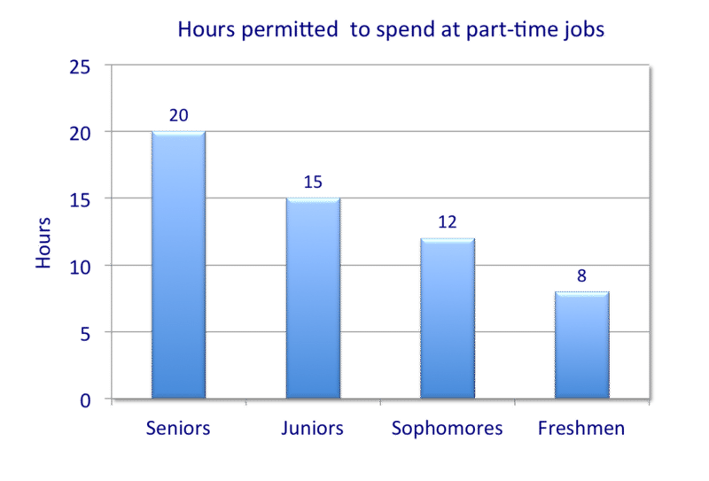

**How many more hours per week are seniors allowed to spend working than sophomores?** Seniors are allowed to spend twenty hours per week working. Sophomores are allowed to work twelve hours per week. Therefore, seniors are allowed to work eight more hours each week than sophomores.

**Are juniors allowed to work twice as many hours as freshman?** Juniors are permitted to work fifteen hours per week. Freshmen are permitted to work eight hours per week. The amount of time freshmen are allowed to work doubled is sixteen. Therefore, juniors are permitted to work almost double the amount freshman are allowed to work, but not quite.

You can see how the visual display of the information is helpful in answering questions about the data. Let’s look at another example.

Example

The bar graph below compares the air travel costs to fly to numerous U.S. cities from Oakland, California on three airlines. Use the information on the bar graph to answer the questions below.

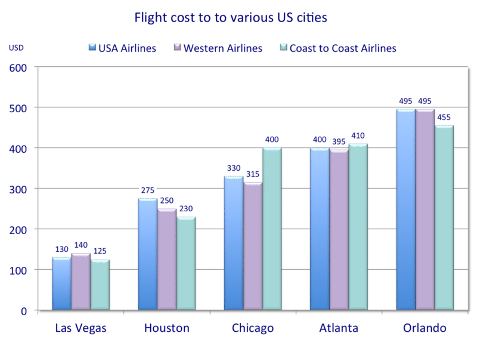

**Which airline had the lowest price for three of the five cities?** Coast to Coast Airlines had the lowest price ticket to Las Vegas, Houston, and Orlando.

**For which city did Western Airlines and Coast to Coast Airlines have a difference in price of forty dollars?** The price of ticket to Orlando on Western Airlines was forty dollars more than a ticket on Coast to Coast Airlines.

**By now, you can begin to see the benefits of using a bar graph. Not only is it a visual display, but the information is organized in such a way that the comparisons between the data is very clear. When you want to show comparisons in a visual way, a bar graph is your best option.**

**However, there are other ways to examine data. Let’s look at using frequency tables.**

II. **Make a Frequency Table Given Unorganized Data**

To understand what a frequency table is, let’s first look at the words themselves. The word frequency refers to how often something occurs. A table is a way of organizing information using columns. Therefore, a **_frequency table_** is way of summarizing data by depicting the number of times a data value occurs. To show this, a frequency table organizes the information into a table with three separate columns.

**How do we create a frequency table?**

First, you need to make a table with three separate columns.

**One column is designated for intervals.** The amount of intervals is determined by the range in data values. Intervals are equal in size and do not overlap. If the range in data values is not that great, the intervals will be small. If the range in data values is great, the intervals will be larger. It is important that the intervals are of equal size and do not overlap.

**Another column is created for tallied results.** This is where you tally the number of times you see a data value from each interval. This is where you will see tally marks or lines that record the number of times a data value occurs.

**In the last column, add the tally marks to determine the frequency results.**

Let’s look at creating a frequency table for the following example.

Example

Create a frequency table to display the data below.

$$
43, 42, 45, 42, 39, 38, 50, 52, 36, 49, 38, 50, 40, 37, 35
$$

**_Step 1:_** Make a table with three separate columns.

* Intervals
* Tallied results
* Frequency results

Since the range in data values is not that great, intervals will be in groups of five.

**_Step 2:_** Looking at the data, tally the number of times a data value occurs.

**_Step 3:_** Add the tally marks to record the frequency.

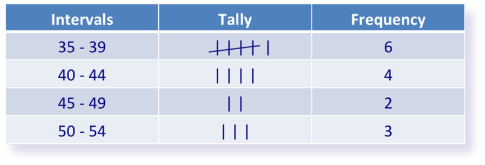

The data values below depict student scores (out of 100%) on a recent math exam. Organize the data on a frequency table.

$$
92, 88, 75, 82, 95, 99, 84, 89, 90, 79, 68, 71, 88, 93, 87, 92, 77, 68, 71, 85
$$

**_Step 1:_** Make a table with three separate columns.

* Intervals
* Tallied results
* Frequency results

Since the range in data is big (thirty-one), intervals will be in groups of ten.

**_Step 2:_** Looking at the data, tally the number of times a data value occurs.

**_Step 3:_** Add the tally marks to record the frequency.

")

\[Figure 7\]

**_Take a few minutes to write down the steps for creating a frequency table._**

**Thinking about the frequency that an event occurs can help you to understand and predict certain trends. Think about how useful the trend of grades could be if you were a teacher thinking about a student’s progress.**

**We can also create a histogram to display data. Histograms and bar graphs are often confused, but they are different. Let’s look at how.**

III. **Make a Histogram of Data in a Frequency Table**

**A** **_histogram_** **shows the frequency of data values on a graph.** Like a frequency table, data is grouped in intervals of equal size that do not overlap. Like a bar graph, the height of each bar depicts the frequency of the data values. However, on a histogram the vertical columns have no space in between each other.

Example

Create a histogram to display the information on the frequency table.

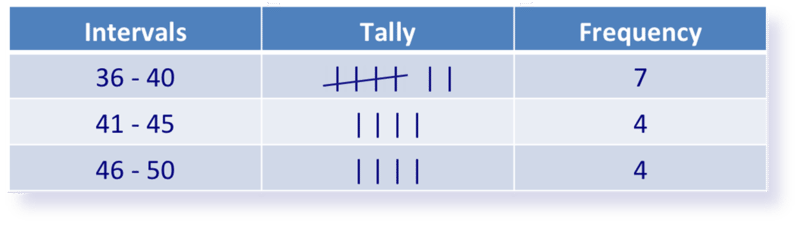

**_Step 1:_** Draw the horizontal $(x)$ and vertical $(y)$ axis.

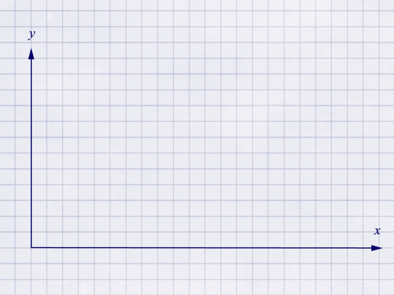

**_Step 3:_** Label the horizontal axis “Hours.” List the intervals across the horizontal axis.

**_Step 4:_** Label the vertical axis “Frequency.” Since the range in frequencies is not that great, label the axis by ones.

**_Step 5:_** For each interval on the horizontal access, draw a vertical column to the appropriate frequency value. On a histogram, there is no space in between vertical columns.

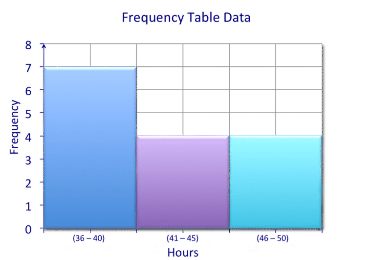

Example

The frequency table depicts student scores on a recent math exam. Use the information from the frequency table to create a histogram.

")

\[Figure 12\]

**_Use the steps listed above to create this histogram in your notebook. Then check your work._**

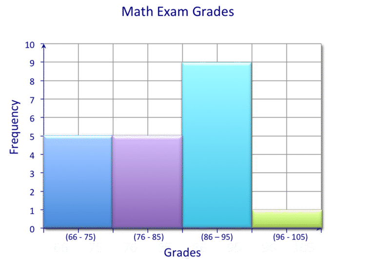

IV. **Collect, Organize, Display and Analyze Real-World Data Using Bar Graphs, Frequency Tables and Histograms**

We have already been working with some real-world data with bar graphs, frequency tables and histograms. Let’s look at how to work with these concepts and a few more examples.

The data table below depicts the ages of twenty of our nation’s presidents at the time of Inauguration. Create a bar graph, frequency table, and histogram to display the data.

$ and vertical $(y)$ axis. Label the horizontal axis with the president’s last names. Label the vertical axis with intervals of two, beginning with the number thirty. Draw a vertical column to the appropriate value for each president.")

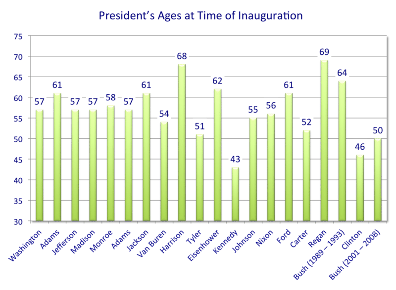

$ and vertical $(y)$ axis. Label the horizontal axis with the intervals depicted on the frequency table. Label the vertical axis by ones. Draw a vertical column to the appropriate value for each interval on the horizontal axis. Recall that there is no space between the vertical columns on a bar graph.")

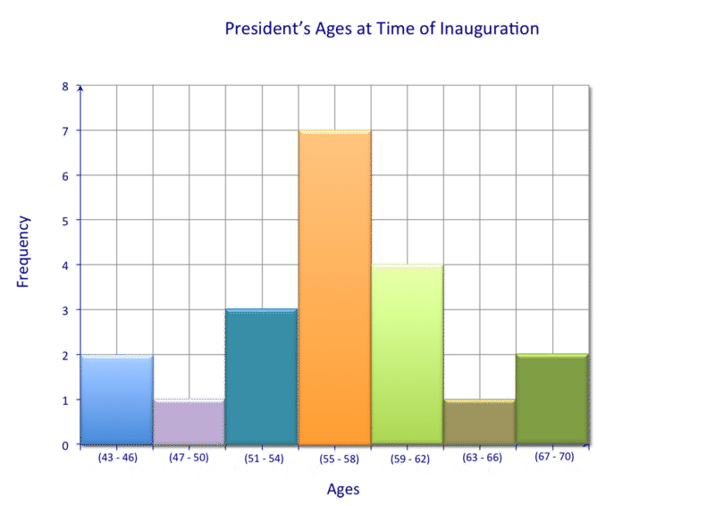

Real-Life Example Completed
---------------------------

**_A New Year of Big Changes_**

**Here is the original problem once again. Now it is time for you to apply what you have learned. Reread this problem and make notes on the information that the students collected for 2008 and 2009. Then create a bar graph to show your work.**

The students at Smith Middle School returned to classes and found out that there was a big surprise. There wasn’t any more wood shop.

“How could they have cancelled wood shop?” Kyle, a seventh grader asked looking at his schedule. “I have been waiting all year for this.”

In the past, the students at Smith Middle School had to be in seventh grade to take wood shop. Many students longed to be a part of wood shop for all of sixth grade.

“I know, I was waiting for it too,” Sarah said.

“There must be a mistake,” Tanisha commented.

However, there wasn’t a mistake. The administration was sure that there wasn’t enough student interest to continue having wood shop.

This set the students in the seventh and eighth grade on a mission. That very first day afterschool the students held their own meeting on the football field. They decided to gather their data and prove to the administration that woodshop was a necessary part of the curriculum.

Over the next few weeks, the students worked hard to gather data about wood shop. They learned that in 2008, there were 30 out of 100 seventh graders and 40 out of 100 eighth graders who had participated in wood shop. Then in 2009, the numbers had increased. There were 40 seventh graders and 58 eighth graders who had participated.

“This is great!” Kyle said. “Now we can prove that wood shop is wanted!”

“Yes, but I think we should draw a chart to show our results,” Tanisha said.

**_Solution to Real – Life Example_**

**To create a bar graph, remember you will need a vertical axis and a horizontal axis. Now because there are 100 students in both the seventh and the eighth grade, you will be able to figure out the intervals for the vertical axis. The horizontal axis should show the numbers of seventh and eighth graders for both 2008 and 2009.**

**Here is a bar graph to show the data.**

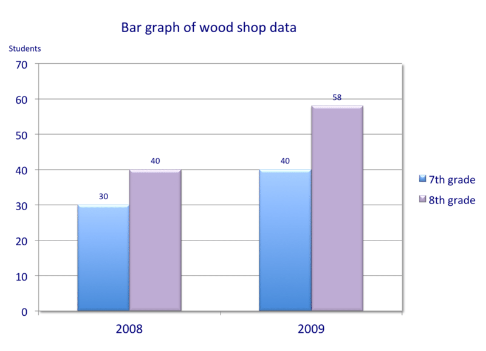
----------

Here are the vocabulary words that are found in this lesson.

__Data__

information that has been collected regarding an occurrence or an event.

__Bar Graph__

is a graph that uses columns to compare quantities or amounts.

__Frequency Table__

Summarizing data by depicting the number of times that a data value occurs.

__Histogram__

Showing the frequency of data values on a graph.

Time to Practice
----------------

Directions: Use the data table below to complete the following tasks.

| **State** | **Year** |
| --- | --- |
| West Virginia | 1863 |
| Nevada | 1867 |
| Colorado | 1876 |
| North Dakota | 1889 |
| South Dakota | 1889 |
| Montana | 1889 |
| Washington | 1889 |
| Idaho | 1890 |
| Wyoming | 1890 |
| Utah | 1896 |
| Oklahoma | 1907 |
| New Mexico | 1912 |
| Arizona | 1912 |
| Alaska | 1959 |
| Hawaii | 1959 |

1.  Create a bar graph of the data.
2.  Create a frequency table of the data.
3.  Create a histogram of the data.
4.  Looking at the bar graph, identify the last two states to join the union.
5.  In what year did they join the union?
6.  Identify the states that joined in 1889.
7.  During which years did twenty percent of the states join the union?
8.  Show how you converted the fraction to a percent to define your answer for question seven.
9.  How many states joined the union after 1904?
10. What percent of states joined the union after 1907?

Directions: Use the table to complete each problem listed below.

| **Type of Dog** | **Weight (in pounds)** |
| --- | --- |
| Pug | 18  |
| Jack Russell Terrier | 20  |
| Dachshund | 20  |
| Corgi | 38  |
| Border Collie | 40  |
| English Springer Spaniel | 45  |
| Golden Retriever | 75  |
| Labrador | 75  |
| Akita | 130 |
| Bull Mastiff | 145 |

11. Create a bar graph of the data.
12. Create a frequency table of the data.
13. Create a histogram of the data.
14. Identify the types of dogs that weigh less than 50 pounds.
15. What fraction of the dogs weigh less than 50 pounds?
16. What percent of the dogs weigh less than 50 pounds?
17. Identify the types of dogs that weigh more than 50 pounds.
18. What fraction of the dogs weigh more than 50 pounds?
19. What percent of the dogs weigh more than 50 pounds?
20. What is the heaviest of the dogs? What is its weight?

Directions: The data table below depicts the magnitude of the last ten earthquakes that occurred in Lima, Peru. Use the data to answer the following questions.

| **Date** | **Magnitude of Quake** |
| --- | --- |
| July $12^{th}$ | 5.1 |
| July $18^{th}$ | 3.2 |
| August $4^{th}$ | 4.1 |
| August $10^{th}$ | 3.9 |
| August $19^{th}$ | 2.5 |
| September $2^{nd}$ | 3.9 |
| September $8^{th}$ | 4.1 |
| September $16^{th}$ | 4.8 |
| October $1^{st}$ | 5.0 |
| October $10^{th}$ | 3.5 |

21. Create a bar graph of the data.
22. Create a frequency table of the data.
23. Create a histogram of the data.
24. On what dates did the earthquakes with the largest and smallest magnitude occur?
25. What percent of the earthquakes were between 4.1 and 5.1 in magnitude?
26. What fraction did you use in question 25 to find the accurate percentage?
27. On which date was there an earthquake measuring 5.0?
28. On which dates were there earthquakes measuring 3.9?

</article>

### 1.2 Order of Operations

<article>

Introduction
------------

**_Gym Class Changes_**

Mr. Osgrove was young and lively with lots of energy, but he also had some new ideas about how gym class ought to be run.

“We’ll combine two periods of students together,” he explained. “That will give us so many more combinations of students when it comes to teams.”

Jesse looked around. He counted the number of boys and girls in his class. There were 11 boys and 14 girls in the class. The other class had thirteen boys and fourteen girls in it.

“We can add the boys together and form four teams and the girls together and form four teams.”

Jesse left gym class with his head full of numbers. If they were to combine all of the boys from the two classes and all of the girls from the two classes, then that would be a lot of students. Jesses started to figure out the different combinations of teams.

**To work this through, you can use the order of operations. That is what you will learn in this lesson. Pay close attention, then you can work this through at the end of the lesson.**

**_What You Will Learn_**

By the end of this lesson you will learn how to execute the following skills.

* Evaluate numerical and variable expressions involving arithmetic operations.
* Evaluate numerical and variable expressions involving grouping symbols.
* Write variable expressions to represent and solve real-world problems using order of operations.

**_Teaching Time_**

I. **Evaluate Numerical and Variable Expressions Involving Arithmetic Operations**

In mathematics, you will often hear the word “**_evaluate_**.” Before we begin the lesson, it is important for you to understand what the word “evaluate” means. When we evaluate a mathematical sentence, we figure out the value of the number sentence. If the mathematical sentence has numbers in it, then we figure out the value of the number sentence. Often times we think of evaluating as solving, and it can be that, but more specifically, evaluating is figuring out the value of a sentence.

**What do we evaluate?**

In mathematics, we can evaluate different types of number sentences. Sometimes we will be working with equations and other times we will be working with expressions.

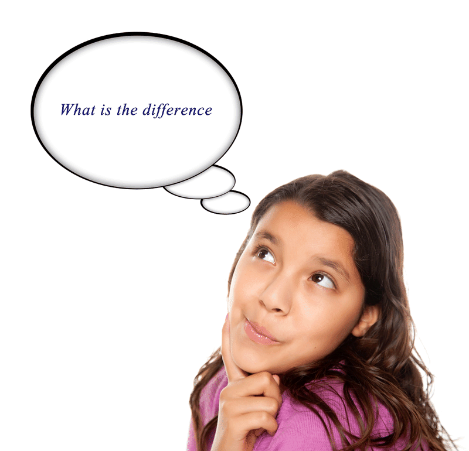

**Let’s start by focusing on evaluating expressions.** Think about this example.

Example

Two eighth grade math students evaluated the expression: $2 + 3 \times 4 \div 2$. Both students approached the expression differently. Macy’s answer was ten. Cole’s answer was eight.

We can think about what happened here. How could one student arrive at one answer and another student come up with an entirely different answer? The key is in the order that each student performed each operation.

This is where the order of operations comes in. The order of operations is a rule that tells us which operation we need to perform in what order to achieve the accurate answer. The order of operations applies whenever you have two or more operations in a single expression. Here is the order of operations.

**Order of Operations**

**P parentheses or grouping symbols**

**E exponents**

**MD multiplication and division in order from left to right**

**AS addition and subtraction in order from left to right**

Now the example above does not have any parentheses or exponents, so don’t worry about those just yet. Let’s look at the example again and look at how Macy and Cole arrived at their answers.

Example

$2 + 3 \times 4 \div 2$

Cole worked on evaluating this expression using the order of operations. He multiplied $3 \times 4 = 12$. Then he divided by 2 which is 6 and finally he added 2 for a final answer of 8. This is correct. It may seem out of order to work this way, but remember you are working according to the order of operations.

What did Macy do? Macy worked on evaluating the expression by working in order from left to right. She simply did not follow the order of operations. In this case, she evaluated the value of the expression as 10. This is incorrect. Next time, Macy needs to follow the order of operations.

**Working in this way is called evaluating a numerical expression. It is a** **_numerical expression_** **because it is made up only of numbers and operations.**

Example

Evaluate $3 + 9 \cdot 2 \div 3 + 8$

To begin with, we first need to remind ourselves of the order of operations. Notice that there is a dot in between the nine and the two. This is another way to show multiplication. As you get into higher levels of math, you will see that multiplication is often shown in other ways besides using an $x$. Now back to evaluating.

Following the order of operations, we would first multiply and then divide.

$9 \cdot 2 = 18$

$18 \div 3 = 6$

Next we perform addition and subtraction in order from left to right.

$6 + 3 = 9$

$9 + 8 = 17$

**This is our answer.**

**You will also find another type of expression. These expressions can have letters in them. These letters are called** **_variables_** **and** **_variables represent an unknown quantity_****. When you see an expression with a variable in it, we call it a** **_variable expression_****.**

We can evaluate variable expressions using the order of operations too. The key thing with a variable expression is that you will have to substitute a given value into the expression for the unknown variable and then evaluate the expression. Let’s look at an example.

Example

Evaluate the expression $60 \div 2 \cdot 2a + 16 - 4$ when $a = 5$.

**First, notice that the expression has the letter $a$ in it. This is our variable. Also, you can see that you have been given a value for $a$. Our first step is to substitute the value of $a$ into the expression.**

$60 \div 2 \cdot 2(5) + 16 - 4$

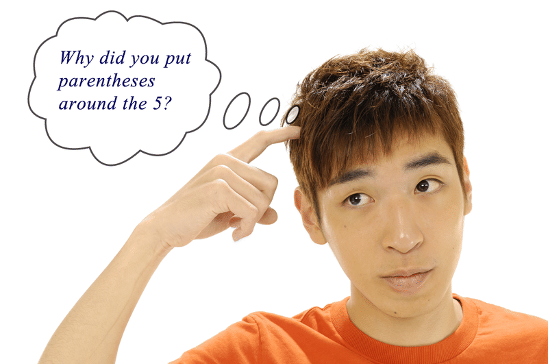

**Now we can use our order of operations. We have division, multiplication and multiplication in this expression right away. We complete multiplication and division in order from left to right.**

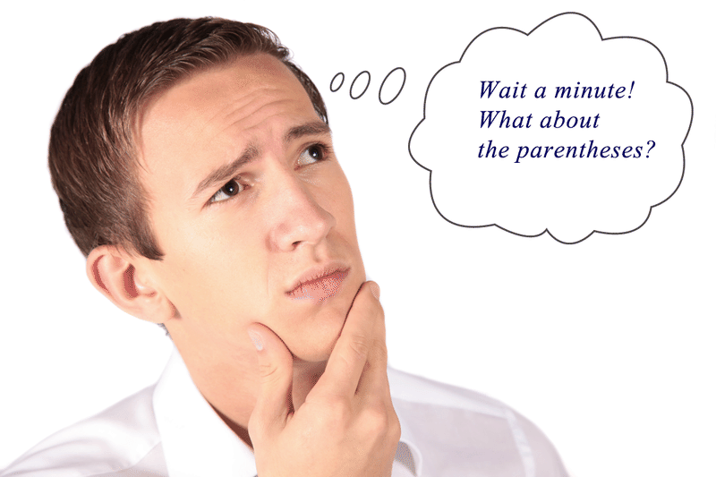

**Now back to evaluating the expression by performing multiplication and division in order from left to right.**

$$
\begin{align*}
& 60 \div 2 \cdot 2(5) + 16 - 4\\
& 60 \div 2 = 30\\
& 30 \cdot 2(5) = 300
\end{align*}
$$

**Next, we work with addition and subtraction in order from left to right.**

$$
\begin{align*}
& 300 + 16 - 4\\
& 316 - 4\\
& 312
\end{align*}
$$

**Our final answer is 312.**

Example

Evaluate the expression $14 \cdot 2 \div 7 + 3b - 4$ when $b = 12$.

**First, we substitute the value of $b$ into our variable expression.**

$14 \cdot 2 \div 7 + 3(12) - 4$

**Now we follow the order of operations by performing multiplication and division in order from left to right.**

$14 \cdot 2 = 28$

$28 \div 7 = 4$

**Let’s rewrite what we have so far so we don’t get confused.**

$4 + 3(12) - 4$

**OH! There’s more multiplication to do!**

$3(12) = 36$

**Now our expression is:**

$4 + 36 - 4$

**Our last step is to perform addition and subtraction in order from left to right.**

$4 + 36 = 40 - 4 = 36$

**Our final answer is 36.**

**Now that you have had some practice the order of operations is probably beginning to make more sense. If you always follow them, then your work will be accurate. You can think of the order of operations as a kind of road map for working with complicated expressions.**

**Next, we are going to look at the first step in the order of operations. Let’s talk about grouping symbols.**

II. **Evaluate Numerical and Variable Expressions Involving Grouping Symbols**

Grouping symbols are a way to point out an operation that needs special attention. If you can think of a spotlight, grouping symbols are a way of highlighting or shining a spotlight on a particular operation.

**What are the grouping symbols?**

**The** **_grouping symbols_** **that we are going to be working with are brackets \[ \] and parentheses ( ).** According to the order of operations, we perform all operations inside of grouping symbols BEFORE performing any other operation in the list.

Example

Evaluate the expression $7 + 4(15 \div 5) - 6$.

**First, notice that we have a set of parentheses in this numerical expression. Remember that it is called a numerical expression because this expression does not have any variable in it.**

**We perform any and all operations in parentheses first.**

$15 \div 5 = 3$

Now let’s rewrite the expression.

$7 + 4(3) - 6$

**Our next step is to continue with the order of operations.** We have multiplication in this expression. We do that next.

$7 + 12 - 6$

**Now we can perform addition and subtraction in order from left to right.**

$19 - 6 = 13$

**Our final answer is 13.**

**We can also evaluate variable expressions that contain parentheses.**

Example

Evaluate the expression $6y + 3 - (2 \cdot 4)$ when $y = 15$.

**First, substitute the value in for the unknown quantity, $y$.**

$6(15) + 3 - (2 \cdot 4)$

**Our next step is to perform the operation in parentheses.**

$6(15) + 3 - 8$

**Now we can perform multiplication and division in order from left to right.**

$90 + 3 - 8$

**Finally, we work with addition and subtraction in order from left to right.**

$$
\begin{align*}
& 93 - 8 \\
& 85
\end{align*}
$$

**Our answer is 85.**

**What about brackets?**

Brackets can be used to group more than one operation. When you see a set of brackets, remember that brackets are a way of grouping numbers and operations. There is a spotlight on brackets too.

Example

Evaluate the expression $6 + [5 + (4 \cdot 6)] - 17$.

**Now we have a set of parentheses within a set of brackets. To work through this, we are going to perform the operation in the parentheses inside the brackets first, and then we will perform the other operation in the brackets.**

$$
\begin{align*}
& 6 + [5 + 24] - 17\\
& 6 + 29 - 17
\end{align*}
$$

**Next we perform addition and subtraction in order from left to right.**

$$
\begin{align*}
& 35 - 17\\
& 18
\end{align*}
$$

**Our final answer is 18.**

III. **Write Variable Expressions to Represent and Solve Real-World Problems Using Order of Operations**

When we have an unknown quantity in a problem, we can use a variable to help us to find the value of our problem. You can find many real-world scenarios where variable expressions would be helpful in solving problems.

**Let’s think about ticket pricing.** Many different places sell tickets. There are also prices for adults and prices for children. The number of tickets can vary, or they can be the same. If we know the number of tickets, then we can figure out the total amount of revenue earned based on the cost of the ticket for an adult and for a child. Let’s look at an example to see how this works.

An amusement park charges eight dollars admission and one dollar and fifty-cents per ride. Write an expression to find the cost of admission and five ride tickets.

**First, notice that we have eight dollars admission. That is the first part of the expression.**

8

**Next, they charge $1.50 per ride.**

$8 + 1.50x$

We used the variable for the number of rides since this is the variable or changeable facet. The number of rides can change. In this example, we were asked to figure out the cost for 5 rides. That is the value that we can substitute into our expression for $x$.

$8 + 1.50(5)$

Now we can use the order of operations to solve this problem.

$$
\begin{align*}
& 8 + 7.50 \\
& 15.50
\end{align*}
$$

**The cost of admission plus five ride tickets is $15.50.**

**Using variable expressions can help you solve for unknown quantities. Just remember to use the order of operations so that your work is accurate!!**

Real-Life Example Completed
---------------------------

**_Gym Class Changes_**

**Here is the original problem once again. Reread it and then write two expressions to show how the teams will be divided up. How many boys will be on each team if there are four teams? How many girls will be on four teams? There are four parts to your answer.**

Wood shop wasn’t the only thing that had changed with the new year. After working to successfully resolve wood shop being reinstated, the students found out that there were also changes for gym class or physical education. It seems that the old gym teacher, Mr. Woullard had retired and there was a new gym teacher.

Mr. Osgrove was young and lively with lots of energy, but he also had some new ideas about how gym class ought to be run.

“We’ll combine two periods of students together,” he explained. “That will give us so many more combinations of students when it comes to teams.”

Jesse looked around. He counted the number of boys and girls in his class. There were 11 boys and 14 girls in the class. The other class had thirteen boys and fourteen girls in it.

“We can add the boys together and form four teams and the girls together and form four teams.”

Jesse left gym class with his head full of numbers. If they were to combine all of the boys from the two classes and all of the girls from the two classes, then that would be a lot of students. Jesses started to figure out the different combinations of teams.

**_Solution to Real – Life Example_**

**First, let’s look at the information that we have been given in the problem.**

**Class one has 11 boys and 14 girls.**

**Class two has 13 boys and 14 girls.**

**The boys from the two classes will be added together, and the girls from the two classes will be added together.**

$11 + 13$

$14 + 14$

**We can use parentheses to show that the boys will be added and the girls will be added. Both groups will be divided by four.**

$(11 + 13) \div 4$

Or $\frac{11+13}{4}$

**This is an expression for the boys.**

$(14 + 14) \div 4$

Or $\frac{14+14}{4}$

**This is an expression for the girls.**

**Now we can solve for the number on each team.**

**$\text{Boys} = (11 + 13) \div 4 = 24 \div 4 = 6$ boys on each team**

**$\text{Girls} = (14 + 14) \div 4 = 28 \div 4 = 7$ girls on each team**

**Now our work is complete.**

Vocabulary
----------

Here are the vocabulary words that are found in this lesson.

__Evaluate__

to figure out the value of a numerical or variable expression.

__Equation__

a mathematical statement with an equals sign where one side of the equation has the same value as the other side.

__Expression__

a group of numbers, symbols and variables that represents a quantity.

__Numerical Expression__

a group of numbers and operations.

__Variable Expression__

a group of numbers, operations and at least one variable.

__Variable__

a letter used to represent an unknown quantity.

__Grouping Symbols__

parentheses or brackets used to group numbers and operations.

Time to Practice
----------------

Directions: Evaluate each numerical expression using the order of operations.

1.  $4 + 5 \cdot 2 - 3$
2.  $6 + 6 \cdot 3 \div 2 - 7$
3.  $5 + 5 \cdot 8 \div 2 + 6$
4.  $13 - 3 \cdot 2 + 8 - 2$
5.  $17 - 5 \cdot 3 + 8 \div 2$
6.  $9 + 4 \cdot 2 + 7 - 1$
7.  $8 + 5 \cdot 6 + 2 \cdot 4 - 3$
8.  $19 + 2 \cdot 4 - 3 \cdot 2 + 10$
9.  $12 + 4 \cdot 4 \div 8 - 3$
10. $12 \cdot 2 + 16 \div 2 - 12$

Directions: Evaluate each variable expression. Remember to use the order of operations when necessary.

11. $4y+6-2$, _when_ $y=6$
12. $9+3x-5+2$, _when_ $x=8$
13. $6y+2y-5$, _when_ $y=3$
14. $8+3y-5 \cdot 2$, _when_ $y=4$
15. $7x-2 \cdot 3 \div 3+12$, _when_ $x=5$
16. $3+4 \cdot 3 - 2y+5$, _when_ $y=7$
17. $6a+3(2)+5 - 4$, _when_ $a=9$
18. $10+3 \cdot 5+2-9b$, _when_ $b=2$
19. $14 \div 2+3a+7a$, _when_ $a=2$
20. $5+6y-2y+11-4$, _when_ $y=3$

Directions: Evaluate each expression using the order of operations. Remember to pay attention to the grouping symbols.

21. $3 + (4 + 5) - 6(2)$
22. $4 + (6 \div 3) + 2(7) - 4$
23. $3 + 2(4 + 2) - 5(2)$
24. $7 + (3 + 2) - 5 + 8(3)$
25. $4(2) + (3 + 9) - 4$
26. $7 + [4 + (3 \cdot 2)] - 5$
27. $9 + [6 - (2 \cdot 3)] + 15$
28. $4 \cdot 2 + [3 + (7 + 2)] - 4$

</article>

### 1.3 Powers and Exponents

<article>

Introduction
------------

**_Science Class_**

“This is a lot of changes to get used to,” Lauren said sitting next to Michaela.

“I agree. First wood shop, then gym and now science,” Michaela agreed.

Sure enough, when Ms. Richards arrived the students realized that they were about to branch off into the universe with Astronomy. While Astronomy had been taught before in sixth grade, this was eighth grade and something brand new.

“We will be using a lot of math,” Ms. Richards explained. “One of the reasons that we decided to include Astronomy is because it has a lot of connections with mathematics. You will be using your algebra in this class as well. Let’s take a look at this.”

Ms. Richards took a pen and wrote these values on the white board.

$93 \times 10^6$

$2.39 \times 10^5$

“These are two distances in the galaxy. The first one is the distance from the Earth to the Sun and the second is from the Earth to the Moon. Your first task is to figure out how far this actually is,” Ms. Richards explained.

Michaela and Lauren took out their notebooks and got right down to work.

**You need to get right down to work too. Use the information in this lesson on exponents to help you with the problem. While scientific notation isn’t specifically covered, you should be able to figure out how to work with these values once you learn about exponents.**

**_What You Will Learn_**

By the end of this lesson, you will be able to demonstrate the following skills.

* Evaluate numerical and variable expressions involving powers.
* Extend order of operations to include evaluating powers.
* Write variable expressions to represent and solve real-world problems involving operations and exponents.

**_Teaching Time_**

I. **Evaluate Numerical and Variable Expressions Involving Powers**

Let’s think back to the last lesson where we began working with numerical and variable expressions. You will be working with them again in this section, so let’s be sure that you understand each.

**A** **_numerical expression_** **is a group of numbers and operations that represent a quantity, there isn’t an equal sign.**

**A** **_variable expression_** **is a group of numbers, operations and variables that represents a quantity, there isn’t an equal sign.**

In the last lesson, you worked on evaluating numerical and variable expressions using the order of operations. You worked with expressions that had combinations of operations and you worked with expressions that contained grouping symbols such as parentheses and brackets. Now we are going to add a new think to our work. Let’s talk about powers.

**A** **_power_** **is a number with an** **_exponent_** **and a** **_base_****. An** **_exponent_** **is a little number that shows the number of times a base is multiplied by itself. The** **_base_** **is the regular sized number that is being worked with.**

**Now let’s look at an example.**

Example

$4^2 = 16$

**What happened here?**

We can break down this problem to better understand powers and exponents. In the power $4^2$ or four-squared, four is the base and two is the exponent. $4^2$ means four multiplied two times or $4 \times 4$. Therefore, $4^2$ is sixteen.

Example

Evaluate $6^3$

First, we have to think about what this means. It means that we take the base, 6 and multiply it by itself three times.

$$
\begin{align*}
& 6 \times 6 \times 6\\
& 36 \times 6 \\
& 216
\end{align*}
$$

**The answer is 216.**

Example

Evaluate $(-8)^2$

To work on this one, we have to work on remembering integer rules. Think back remember that we multiply a negative times a negative to get a positive.

$-8 \cdot -8 = 64$

**The answer is 64.**

**This is called evaluating a power.**

**Let’s look at evaluating powers within expressions.**

Example

Simplify the expression $6^4 + 2^5 + 12$.

**_Step 1:_** Simplify $6^4$.

$6^4 = 6 \times 6 \times 6 \times 6 = 1,296$

**_Step 2:_** Simplify $2^5$.

$2^5 = 2 \times 2 \times 2 \times 2 \times 2= 32$

**_Step 3:_** Add to solve.

$1,296 + 32 + 12 = 1,340$

**The answer is 1,340.**

**We can also evaluate variable expressions by substituting given values into the expressions.**

Example

Evaluate the expression $4a^2$ when $a = 3$.

**_Step 1:_** Substitute 3 for the variable “$a$.”

$$
4(3)^2
$$

**_Step 2:_** Simplify the powers.

$$
\begin{align*}
& 4(3)^2\\
& 4(3 \cdot 3)\\
& 4(9)
\end{align*}
$$

**_Step 3:_** Multiply to solve.

$$
\begin{align*}
& 4(9)\\
& 36
\end{align*}
$$

**The answer is 36.**

Example

Evaluate the expression $5b^4 + 17$. Let $b=5$.

**_Step 1:_** Substitute 5 for “$b$.”

$$
5(5)^4 + 17
$$

**_Step 2:_** Simplify the powers.

$$
\begin{align*}
& 5(5 \cdot 5 \cdot 5 \cdot 5) + 17\\
& 5(625) + 17
\end{align*}
$$

**_Step 3:_** Multiply then add to solve.

$$
\begin{align*}
& 5(625) + 17\\
& 3,125 + 17 = 3,142
\end{align*}
$$

**The answer is 3,142.**

II. **Extend Order of Operations to Include Evaluating Powers**

Now that you have learned how to evaluate powers and to apply evaluating powers to numerical and variable expressions, you are ready to apply this information to evaluating expressions with the order of operations.

**To do this, we are going to need to refer back to the order of operations.**

**Order of Operations**

**P parentheses or grouping symbols**

**E exponents**

**MD multiplication and division in order from left to right**

**AS addition and subtraction in order from left to right**

Here is the order of operations once again. You will be working with the order of operations from now on so it is a good idea to commit it to memory.

Example

Evaluate the expression $-12^3 + 7y^2 + 12$ for $y=6$.

**_Step 1:_** Before performing the order of operations, substitute 6 for “$y$.”

$$
-12^3 + 7(6)^2 + 12
$$

**_Step 2:_** Perform the calculations inside the parentheses.

$$
-12^3 + 7(36) + 12
$$

**_Step 3:_** Perform the calculations with exponents.

$$
\begin{align*}
& -12^3 + 7(36) + 12\\
& -1,728 + 7(36) + 12
\end{align*}
$$

**_Step 4:_** Multiply

$$
\begin{align*}
& -1,728 + 7(36) + 12\\
& -1,728 + 252 + 12
\end{align*}
$$

**_Step 5:_** Add

$$
-1,728 + 252 + 12 = - 1,464
$$

**The answer is -1,464.**

")

\[Figure 5\]

**Now let’s look at another example.**

Example

Evaluate the expression $8h^2 + [51 \div (4 \cdot 4.25)] - 52 \div 5$. Let $h=4$.

$$
\begin{align*}
& P && Step \ 1: \ \text{Substitute} \ 4 \ \text{for} \ "h".\\
& && 8h^2 + [51 \div (4 \cdot 4.25)] - 52 \div 5\\
& && 8(4)^2 + [51 \div (4 \cdot 4.25)] - 52 \div 5\\
& && Step \ 2: \ \text{Remember PEMDAS. Therefore, perform the operation inside the}\\
& && \text{grouping symbols first. Recall that order of operations must be followed}\\
& && \text{inside grouping symbols also. In this case, multiply} \ 4 \times 4.25 \ \text{before dividing}\\
& && \text{by} \ 51.\\
& && 8(4)^2 + [51 \div (4 \cdot 4.25)] - 52 \div 5\\
& && 8(4)^2 + [51 \div 17] - 52 \div 5\\
& && 8(4)^2 + 3 - 52 \div 5\\
& E && Step \ 3: \ \text{The next step in order of operations is to simplify the numbers with}\\
& && \text{exponents.}\\
& && 8(4)^2+ 3 - 52 \div 5\\
& && 8(4 \cdot 4) + 3 - 5 \cdot 5 \div 5\\
& && 8(16) + 3 - 25 \div 5\\
& M && Step \ 4: \ \text{Multiply}\\
& && 8(16) + 3 - 25 \div 5\\
& && 128 + 3 - 25 \div 5\\
& D && Step \ 5: \ \text{Divide}\\
& && 128 + 3 - 25 \div 5\\
& && 128 + 3 - 5\\
& A && Step \ 6: \ \text{Add}\\
& && 128 + 3 - 5\\
& && 131 - 5\\
& S && Step \ 6: \ \text{Subtract}\\
& && 131 - 5 = 126
\end{align*}
$$

**The answer is 126.**

**We can also evaluate variable expressions that have more than one variable. Notice that a different value has been given for $x$ and $y$. You simply substitute the given values into each expression and evaluate it for the quantity of the expression.**

Example

Evaluate the expression $4x^3 - (3y \div 9) + 12$. Let $x=3$ and $y=9$.

$$
\begin{align*}
& 4x^3 - (3y \div 9) + 12 \ (\text{Substitute the variables})\\
& 4(3)^3 - [(3 \times 9) \div 9] + 12 \ (\text{Parentheses})\\
& 4(3)^3 - [27 \div 9] + 12\\
& 4(3)^3 - 3 + 12 \ (\text{Exponents})\\
& 4(3 \times 3 \times 3) - 3 + 12\\
& 4(27) - 3 + 12 \ (\text{Multiply})\\
& 108 - 3 + 12 \ (\text{Add and then Subtract from left to right})\\
& 105 + 12\\
& 117
\end{align*}
$$

**The answer is 117.**

**When you have variable and numerical expressions with powers in them, you can use the order of operations to evaluate the expressions. Remember not to get stuck if the problem seems complicated. Stick to the order of operations and you will be able to evaluate the expression.**

III. **Write Variable Expressions to Represent and Solve Real-World Problems Involving Operations and Exponents**

**We can use exponents to express real-life situations too. An example of a situation like this can be found when we look at geometric progressions.**

**A** **_geometric progression_** **is a sequence of numbers where each term after the first is found by multiplying the previous one by a fixed non-zero number.** For example, the sequence 2, 4, 8, 16 is found by multiplying the previous number by two. Exponents can be used to express geometric progression.

Ben’s pet mice, Spike and Betty, double in number each month. Write a variable expression to determine the number of mice after “$n$” months. Then evaluate the expression for twelve months.

To determine the number of mice for twelve months, double the original amount (2) for twelve months.

Month 1: $2 \times 2$

Month 2: $4 \times 2$

Month 3: $8 \times 2$

Month 4: $16 \times 2$

Month 5: $32 \times 2$

Month 6: $64 \times 2$

Month 7: $128 \times 2$

Month 8: $256 \times 2$

Month 9: $512 \times 2$

Month 10: $1,024 \times 2$

Month 11: $2,048 \times 2$

Month 12: $4,096 \times 2$

You can write an expression to represent the work you did above. By writing the expression, you are creating a way to determine the number of mice at any time in a much quicker way.

$y = 2 \cdot 2^x$

To evaluate the expression for twelve months, substitute “12” for “$x$.”

$$
\begin{align*}
y & = 2 \times 2^x\\
y & = 2 \times 2^{12}\\
y & = 2 \times (2 \times 2 \times 2 \times 2 \times 2 \times 2 \times 2 \times 2 \times 2 \times 2 \times 2 \times 2)\\
y & = 2 \times 4,096\\
y & = 8,192
\end{align*}
$$

**There will be 8,192 mice after 12 months.**

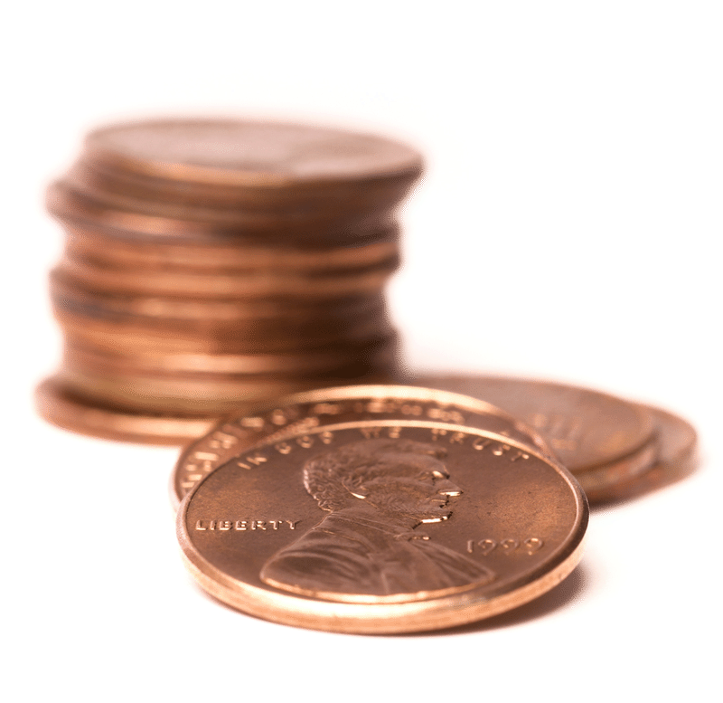

Would you rather have one million dollars or a penny doubled each day for thirty days?

Number of pennies on Day One: 1

Number of pennies on Day Two: $1 + 2 = 3$

Number of pennies on Day Three: $1 + 2 + 4 = 7$

Number of pennies on Day Four: $1 + 2 + 4 + 8 = 15$

Number of pennies on Day Five: $1 + 2 + 4 + 8 + 16 = 31$

Number of pennies on Day Six: $1 + 2 + 4 + 8 + 16 + 32 = 63$

Number of pennies on Day Seven: $1 + 2 + 4 + 8 + 16 + 32 + 64 = 127$

Number of pennies on Day Eight: $1 + 2 + 4 + 8 + 16 + 32 + 64 + 128 = 255$

Number of pennies on Day Nine: $1 + 2 + 4 + 8 + 16 + 32 + 64 + 128 + 256 = 511$

Number of pennies on Day Ten: $1 + 2 + 4 + 8 + 16 + 32 + 64 + 128 + 256 + 512 = 1,023$

An expression can be written to represent the work completed above: $2^n - 1$.

Use the expression to determine the number of pennies on Day Ten.

$$
\begin{align*}
& 2^{10} - 1\\
& (2 \times 2 \times 2 \times 2 \times 2 \times 2 \times 2 \times 2 \times 2 \times 2) - 1\\
& 1,024 - 1\\
& 1,023
\end{align*}
$$

Use the expression to determine the number of pennies on Day Thirty.

$$
\begin{align*}
& 2^{30} - 1\\
& 1,073,741,824 - 1\\
& 1,073,741,823
\end{align*}
$$

Since there are one hundred pennies in a dollar, divide the amount of pennies by one hundred to determine the pennies worth.

$1,073,741,823 \div 100 = \$ 10,737,418.23$

**Therefore, a penny doubled each day for thirty days is worth more than one million dollars.**

**In these examples you can see that we used an exponent and a variable for the number of months. This was a way to use a variable expression to write an equation.**

Real-Life Example Completed
---------------------------

**_Science Class_**

**Here is the problem from the introduction once again. Now you will need to apply what you have learned about exponents. Reread the problem first. Then, you need to figure out the distance from the Earth to the Moon and from the Earth to the Sun. Your answer will have two parts to it.**

When Michaela and Lauren arrived at science class they were surprised to see that there were big changes going on in science class too. On each desk was an Astronomy book about stars and planets along with a journal.

“This is a lot of changes to get used to,” Lauren said sitting next to Michaela.

“I agree. First wood shop, then gym and now science,” Michaela agreed.

Sure enough, when Ms. Richards arrived the students realized that they were about to branch off into the universe with Astronomy. While Astronomy had been taught before in sixth grade, this was eighth grade and something brand new.

“We will be using a lot of math,” Ms. Richards explained. “One of the reasons that we decided to include Astronomy is because it has a lot of connections with mathematics. You will be using your algebra in this class as well. Let’s take a look at this.”

Ms. Richards took a pen and wrote these values on the white board.

$93 \times 10^6$

$2.39 \times 10^5$

“These are two distances in the galaxy. The first one is the distance from the Earth to the Sun and the second is from the Earth to the Moon. Your first task is to figure out how far this actually is,” Ms. Richards explained.

Michaela and Lauren took out their notebooks and got right down to work.

**_Solution to Real – Life Example_**

**Now begin by looking at the information that you have been given in the problem.**

**Earth to Sun $93 \times 10^6$**

**Earth to Moon $2.39 \times 10^5$**

**Next, we need to figure out those actually distances. First, let’s figure out the first distance. To do this, we need to understand the value of $10^6$.**

$10^6 = 10 \times 10 \times 10 \times 10 \times 10 \times 10 = 1,000,000$

**Now we multiply the value times 93 which means we move the decimal point six places.**

**93,000,000**

**The distance from the Earth to the Sun is 93 million miles.**

**Next, we figure out the distance from the Earth to the Moon. To do this, we need to understand the value of $10^5$.**

$10^5 = 10 \times 10 \times 10 \times 10 \times 10 = 100,000$

**Now we multiply.**

$2.39 \times 100,000 = 239,000 \ miles$

**There are our answers.**

Vocabulary
----------

Here are the vocabulary words that are found in this lesson.

__Numerical Expression__

a group of numbers and operations used to represent a quantity without an equals sign.

__Variable Expression__

a group of numbers, operations and variables used to represent a quantity without an equals sign.

__Powers__

the value of a base and an exponent.

__Base__

the regular sized number that the exponent works upon.

__Exponent__

the little number that tells you how many times to multiply the base by itself.

__Geometric Progression__

each term after the first is found by multiplying the previous number by a fixed non-zero number.

Time to Practice
----------------

Directions: Evaluate each power.

1.  $3^3$
2.  $4^2$
3.  $(-2)^4$
4.  $(-8)^2$
5.  $5^3$
6.  $2^6$
7.  $(-9)^2$
8.  $(-2)^6$

Directions: Evaluate each numerical expression.

9.  $6^2 + 22$
10. $-3^3 + 18$
11. $2^3 + 16 - 4$
12. $(-5)^2 - 19$
13. $(-7)^2 + 52 - 2$
14. $18 + 9^2 - 3$
15. $22 - 3^3 + 7$

Directions: Evaluate each variable expression using the given values.

16. $6a + 4^2 - 2$, when $a = 3$
17. $a^3 + 14$, when $a = 6$
18. $2a^2 - 16$, when $a = 4$
19. $5b^3 + 12$, when $b = -2$
20. $2x^2 + 52$, when $x = 4$

Directions: Evaluate each expression. Remember to follow the order of operations.

21. $3^2 + [(5 \cdot 2) - 3] - 8 \cdot 2$
22. $5^2 + (3 + 5) - 6^2 + 2$
23. $6^3 + 5^2 + 25$
24. $16(12^3)$
25. $8^2 - (2(3^3) \div 2) + (16 \cdot 5)$

</article>

### 1.4 Writing Expressions

<article>

Introduction
------------

**_Cookies at Lunch_**

“Really, that is a change,” Marcy commented.

The students at the middle school had always been able to fundraise, but they needed to get special permission. This was especially true regarding food and regarding lunch time. This news was greeted by some excitement and a lot of talking at the meeting.

“Hold on everybody,” Cameron shouted over the crowd. “Let’s talk about this.”

The group quieted down and Cameron began.

“We need $350.00 for the first autumn dance. We have $50.00 in our account right now. I figure that if we can see cookies for 25 cents each, then we can make about $30.00 per week in the two lunches,” Cameron proposed.

“I think we’ll make double that,” Tracy said smiling.

“Well maybe, but if we make the $30.00 then we will have the money for the autumn dance in no time. Just do the math!”

**Did you do the math? Well, this lesson is about writing expressions. How long will it take based on Cameron’s plan? How long if Tracy is correct?**

**Pay attention and learn how to write expressions in this lesson. Then you will have a chance to put what you have learned to the test and “do the math” yourself.**

**_What You Will Learn_**

By the end of this lesson you will be able to complete the following skills.

* Evaluate variable expressions with given values for the variables.
* Translate verbal phrases into variable expressions.
* Write and evaluate variable expressions for given problem situations.
* Write variable expressions to represent and solve real-world problems.

**_Teaching Time_**

I. **Evaluate Variable Expressions with Given Values for the Variables**

In the last few lessons you have been learning about evaluating expressions. This lesson is going to focus on writing and evaluating variable expressions. Think about the definition of a variable expression.

**A** **_variable expression_** **is a group of numbers, operations and variables without using an equal sign. A** **_variable_** **is a letter used to represent an unknown quantity. A** **_constant_** **is a number without a variable.**

Example

$6a+7$

In this variable expression, $a$ is the **_variable_** and 7 is the **_constant_**.

**Let’s look at evaluating variable expressions when we have been given a value for the variable.**

Example

Evaluate the expression $4g + 1.5$ for $g = 8$.

")

\[Figure 3\]

_Step 1:_ Substitute 8 for the variable “$g$.”

$4(8) + 1.5$

_Step 2:_ Follow the standard order of operations to solve: parentheses, exponents, multiply, divide, add, and then subtract.

$$
\begin{align*}
& 4(8) + 1.5 \ (\text{Multiply})\\
& 32 + 1.5 \ (\text{Add})\\
& 33.5
\end{align*}
$$

**Our answer is 33.5**

Example

Evaluate the expression $5ab + 2a - 7$, when $a = 2$ and $b = 4$.

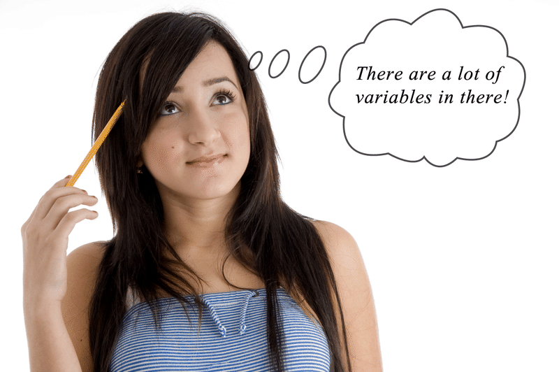

_Step 1:_ Substitute 2 for the variable “$a$” and 4 for the variable “$b$.”

$$
\begin{align*}
& 5ab + 2a - 7\\
& 5(2)(4) + 2(2) - 7
\end{align*}
$$

_Step 2:_ Follow the standard order of operations to solve: parentheses, exponents, multiply, divide, add, and then subtract.

$$
\begin{align*}
& 5(2)(4) + 2(2) - 7 \ (\text{Multiply})\\
& 10(4) + 4 - 7\\
& 40 + 4 - 7 \ (\text{Add})\\
& 44 - 7 \ (\text{Subtract})\\
& 37
\end{align*}
$$

**The answer is 37.**

**You have been working on evaluating expression for a couple of lessons. Now let’s look at writing variable expressions.**

II. **Translate Verbal Phrases into Variable Expressions**

**In this section, you will learn how to take a verbal phrase and write it as a variable expression.** To accomplish this task, we need to think about what different words mean. A verbal expression is a mathematical statement that is expressed in words.

**Let’s start by looking at some mathematical operations written as words.**

**Addition**

**Sum**

**Plus**

**Increased by**

**More**

**Subtraction**

**Difference**

**Less than**

**Take away**

**Multiplication**

**Product**

**Times**

**Division**

**Quotient**

**Split up**

**This list does not include ALL of the ways to write the operations, but it will give you a good place to start.**

**Now we can look at the following chart which starts with a verbal phrase and writes it as a variable expression.**

| **Verbal Phrase** | **Variable Expression** |
| --- | --- |
| Three minus a number | $3 - x$ |
| A number increased by seven | $n + 7$ |
| The difference between an unknown quantity and twenty-six | $s - 26$ |
| A number decreased by nine | $w - 9$ |
| Ten times a number plus four | $10f + 4$ |

**Notice that words like “a number” and “an unknown quantity” let us know that we need to use a variable.**

**Now let’s look at working through a few of our own.**

Example

Write a variable expression that reads “The product of a number and six plus four.”

**A product is the answer in a multiplication problem. Therefore, this expression includes the operations multiplication and addition.**

**The answer is $6x+4$**

Example

Write a variable expression that reads “Ninety divided by a number minus eight.”

**We could do this in several different ways. We could use a symbol, $\div$, to show division or we could use a fraction bar to show division. Because you are moving toward Algebra, let’s use a fraction bar.**

**The answer is $\frac{90}{b}-8$.**

**We can also write variable expressions that include grouping symbols. This can be a little trickier, but if you look for clues, you can figure these verbal expressions out too.**

Example

Write a variable expression that reads “Two less than a number, multiplied by thirty-six.”

**The clue word less tells you to subtract the number and two. Since this is a two-step problem, you can place grouping symbols around the first part of the expression.**

**The answer is $36(n - 2)$.**

**You can figure out how to write a verbal expression as a variable expression by decoding the words in the verbal expression into their mathematical meaning. Now let’s look at writing variable expressions for given situations.**

III. **Write and Evaluate Variable Expressions for Given Problem Situations**

**Now that you have learned how to write variable expressions, you can apply this to evaluating given expressions. To complete this section, you will need to write a variable expression from a verbal expression and then evaluate the expression using the given value.**

Example

Evaluate four times a number minus five, when the number is four.

**First, we need to write an expression. We know that there are two operations in this expression. The word “times” tells us that we have multiplication and the word “minus” tells us that we have subtraction. We also know that the value of the variable is four.**

$$
4n-5, \ when \ n \ is \ 4
$$

**Next, we can substitute the given value in for $n$ and evaluate the expression.**

$$
\begin{align*}
& 4(4)-5\\
& 16-5\\
& 11
\end{align*}
$$

**The answer is 11.**

Example

Evaluate a number squared plus six when the number is eight.

**First, notice that we have the word “squared” that lets us know that we will be working with a power. Then we have the word “plus” so we know that our second operation is addition. The unknown value is eight.**

$$
x^2+6 \ when \ x \ is \ 8
$$

**Next, we substitute the 8 in for the value of the variable.**

$$
\begin{align*}
& 8^2+6\\
& 64 + 6\\
& 70
\end{align*}
$$

**The answer is 70.**

**Sometimes a variable expression can be used to represent a real-world situation. Let’s look at how to write and evaluate variable expressions that are connected with real-world scenarios.**

IV. **Write Variable Expressions to Represent and Solve Real-World Problems**

**A variable expression can be very helpful when problem solving. We can work to use a variable expression to understand a given situation. The variable expression can also help us to work through something and find a solution.**

Grace is saving money to purchase a new bike that costs one hundred seventy-five dollars. Grace has twenty-five dollars and is also saving twenty dollars each week. Write and solve a variable expression to determine the number of weeks “$w$” it will take Grace to save for her new bike.

**First, add the amount that Grace has already saved, $25.00, to the amount that she plans on saving each week. Because the number of weeks is unknown, we multiply the amount she is planning on saving each week, $20.00 by the variable “$w$”. The “$w$” represents the number of weeks. Set the expression equal to Grace’s goal of $175.00.**

$25.00 + 20.00w = 175.00$

**Now we know that she needs to earn an amount of money that equals $175.00. Because she has already earned 25.00, we can subtract that from the total she needs.**

$175.00 - 25.00 = \$150.00$

**We are left with the expression.**

$20.00w = 150.00$

**Solve for “$w$” by completing the inverse of multiplication. Since the number of weeks “$w$” times 20.00 equals 150.00, divide 150.00 by $20.00w$.**

$$
\frac{20.00w}{20.00}=\frac{150.00}{20.00}=7.5
$$

**Therefore, it will take Grace seven and one half weeks to save for her bike.**

**You can find problems like this one all the time in real-life situations. Now let’s go back to the problem in the introduction and use what we have learned to solve the problem.**

Real-Life Example Completed
---------------------------

**_Cookies at Lunch_**

**Here is the original problem once again. Reread it and then write an expression to show Cameron’s proposal. How many weeks will it take based on Cameron’s plan? If Tracy is correct, how many weeks will it take then? There are three parts to your answer.**

“Here is a change that is great,” Cameron the eighth grade President said to the Student Council on Wednesday afternoon. “We can fundraise during lunch by selling cookies and we don’t need permission.”

“Really, that is a change,” Marcy commented.

The students at the middle school had always been able to fundraise, but they needed to get special permission. This was especially true regarding food and regarding lunch time. This news was greeted by some excitement and a lot of talking at the meeting.

“Hold on everybody,” Cameron shouted over the crowd. “Let’s talk about this.”

The group quieted down and Cameron began.

“We need $350.00 for the first autumn dance. We have $50.00 in our account right now. I figure that if we can see cookies for 25 cents each, then we can make about $30.00 per week in the two lunches,” Cameron proposed.

“I think we’ll make double that,” Tracy said smiling.

“Well maybe, but if we make the $30.00 then we will have the money for the autumn dance in no time. Just do the math!”

**_Solution to Real – Life Example_**

**To work on this problem, let’s first think about the given information and write an expression. We use Cameron’s information to do this.**

**There is $50.00 in the student council account.**

**Cameron thinks that they can save $30.00 per week.**

**The number of weeks needed to save the money is unknown that is our variable, $w$.**

**Here is the expression.**

$50 + 30w$

**Next, we can write an equation using this expression to solve for the number of weeks needed to make $350.00.**

$50 + 30w = 350$

**We can solve it by using mental math.**

$w = 10$

**It will take 10 weeks based on Cameron’s proposal.**

**If Tracy is correct and the students are able to make twice as much money, then it will take them 5 weeks to make the money.**

Vocabulary
----------

Here are the vocabulary words that are found in this lesson.

__Variable Expression__

a group of numbers, operations and variables without an equal sign.

__Variable__

a letter used to represent an unknown number

__Constant__

a number in an expression that does not have a variable.

__Verbal Expression__

using language to write a mathematical expression instead of numbers, symbols and variables.

Time to Practice
----------------

Directions: Evaluate each variable expression using the given values for each variable.

1.  $6a+7$ _when_ $a$ _is_ 8
2.  $9x-y$ _when_ $x$ _is_ 2 _and_ $y$ _is_ 4.
3.  $5a+ b^2$ _when_ $a$ _is_ 12 _and_ $b$ _is_ 4.
4.  $\frac{8}{x}+2$ _when_ $x$ _is_ 4
5.  $6x+2.5$ _when_ $x$ _is_ 2.
6.  $y^2+4$ _when_ $y$ _is_ 9
7.  $7x+2y$ _when_ $x$ _is_ 3 _and_ $y$ _is_ 5
8.  $9xy+ x^2$ _when_ $x$ _is_ 4 _and_ $y$ _is_ 2
9.  $3ab+ b^3$ _when $a$_ is _9_ and _$b$_ is _2_
10. $16xy^2+ 14$ _when_ $x$ _is_ 3 _and_ $y$ _is_ 4

Directions: Write a variable expression for each verbal expression.

11. The sum of a number and twelve.
12. The difference between a number and eight.
13. Three times a number
14. A number squared plus five
15. A number divided by two plus seven
16. Four times the quantity of a number plus six
17. A number times two divided by four
18. A number times six plus the same number times two
19. A number squared plus seven take a way four
20. A number divided by three plus twelve

Directions: For numbers evaluate each expressions.

21. The sum of a number 12 and twelve.
22. The difference between a number 12 and eight.
23. Three times a number 12
24. A number 12 squared plus five
25. A number 12 divided by two plus seven
26. Four times the quantity of a number 12 plus six
27. A number 12 times two divided by four
28. A number 12 times six plus the same number times two
29. A number 12 squared plus seven take a way four
30. A number 12 divided by three plus twelve

</article>

### 1.5 Solving Equations

<article>

Introduction
------------

**_Cookie Sale Success_**

By midterms, the students calculated that after paying the home economics students, that they were still averaging $60.00 profit per week. By midterms, they had collected $540.00 total.

“How many weeks did it take us to make that much?” Jesse asked at lunch one day.

“I don’t know, but I am sure that we can make $1000.00 by end of the semester,” Tracy said smiling.

“How can you be so sure?”

“You just do the math. First, we can write an equation and solve it to figure out how long it took us to make the $540.00. Then double it for the end of the semester,” Tracy explained.

**In the last lesson you worked with evaluating expressions. Now let’s look at writing and solving simple equations. These are equations that you can use mental math to solve. Pay close attention and you will see this problem again at the end of the lesson.**

**_What You Will Learn_**

In this lesson you will learn how to complete the following skills.

* Solve single-variable equations using mental math.
* Check suggested solutions to equations by substituting for the variable and simplifying.
* Write and solve equations using verbal models for given problem situations.
* Model and solve real-world problems using simple whole-number equations.

**_Teaching Time_**

I. **Solve Single-Variable Equations Using Mental Math**

Like an expression, an **_equation_** includes groups of numbers, symbols, and variables. However, equations also include equal signs. **The key thing to remember about an equation is that the quantity on one side of the equals must be the same as the quantity on the other side of the equals**. There are different ways to solve an equation. In this lesson, you will learn to solve equations using mental math.

**When you solve an equation, you are solving to determine the value of the variable. If you choose the correct value for the variable, then the equation will be a true statement. Let’s look at an example of an equation without a variable.**

Example

$4+16=20$

We can look at the quantity on the left side of the equation first. It is equal to 20. The right side of the equation is also 20. This is a true statement.

**An equation must always make a true statement. We can say that this is a balanced equation.**

**What if this equation had a variable in place of one of the numbers?**

Example

$x+16=20$

**Now we have a puzzle to solve. We can start by thinking about what number plus sixteen is equal to 20. We know that four plus sixteen is equal to 20. So, the value of $x$ must be four.**

**We write the answer to an equation in a particular way.**

**The answer is that $x=4$.**

**Think a little deeper about how you solved this. If you think about it you probably subtracted 20 – 16 in your head. This is called using an** **_inverse operation_****. The** **_inverse operation_** **is the opposite operation. We can use inverse operations to solve equations.**

Example

$4x=12$

**Here we have a multiplication problem. We can ask ourselves, what number times four is equal to 12? The answer is 3.**

$$
x=3
$$

**We could also use the inverse operation to solve this. Twelve divided by four is three. Our answer is the same and both methods can be completed using mental math.**

Example

$\frac{x}{2}= 7$

**Now we have a division problem. We have a number divided by two is equal to seven. To solve this one, we can use the inverse operation. Two times seven is fourteen.**

$$
x=14
$$

Example

$\frac{22}{x}=11$

**This one is tricky because the inverse operation won’t work. We can’t multiply 22 times 11 to get an answer that makes any sense. We want to figure out what number times 11 is 22 or 22 divided by what number is 11?**

**We can use the 11 times table to figure this out.**

**11, 22, 33, 44**

**Oh, the answer is 2.**

$$
x=2
$$

**Sometimes, you will have problems that are a bit more challenging. You can still complete these using mental math. You will just have to think of two operations and not one.**

Example

$5x+3=18$

**Let’s break down this equation by using saying it to ourselves.**

**“Five times some number plus three is equal to eighteen.” Now you can think through the five times table for an answer that makes sense.**

**5, 10, 15, 20**

**15 makes sense so that would make the variable equal to three since five times three is fifteen.**

$$
x=3
$$

Sometimes looking at a problem like this one can be hard to check to see if your answer is correct. This is when checking your answer is so important.

II. **Check Suggested Solutions to Equations by Substituting for the Variable and Simplifying**

**A solution of an equation is the value for a variable that makes an equation true.** For example, five is the solution in the equation $2 + x = 7$ because $2 + 5 = 7$. You can check to see if the solution given for an equation is correct by substituting it for the variable. Let’s look at the last example from the last section.

Example

$5x+3=18$

**After solving this equation using mental math, we figure out the value of the variable is three. We can check this answer by substituting the value of the variable back into the original equation. Then we simplify it. If the equation makes a true statement, then we know that we have the correct answer.**

$$
\begin{align*}
5(3) + 3 &= 18\\
15 + 3 &= 18\\
18 &= 18
\end{align*}
$$

**This is a true statement so our work is accurate.**

Sometimes you will be given a value and you will need to determine if it makes a true statement.

Example

Is 40 a solution of $15x + 15 = 615$?

_Step 1:_ Substitute 40 for the variable “$x$.”

$$
\begin{align*}
15x + 15 &= 615\\
15(40) + 15 &= 615
\end{align*}
$$

_Step 2:_ Solve the equation using the standard order of operations.

$$
\begin{align*}
15(40) + 15 &= 615\\
600 + 15 &= 615\\
615 &= 615
\end{align*}
$$

**In this case, when 40 is substituted for the variable, both sides of the equation equal 615. Therefore, 40 is a solution of $15x + 15 = 615$.**

")

\[Figure 3\]

Let’s look at an example where you will also need to use the order of operations.

Example

Is 6 a solution for $7m + 7 - 2m = 37$?

**Recall that 6 should be substituted for the variable in the equation. Then follow the order of operations to solve.**

$$
\begin{align*}
7m + 7 - 2m &= 37\\
7(6) + 7 - 2(6) &= 37 \ (\text{Substitute the variable and multiply})\\
42 + 7 - 12 &= 37 \ (\text{Add})\\
49 - 12 &= 37 \ (\text{Subtract})\\
37 &= 37
\end{align*}
$$

**When 6 is substituted for the variable, both sides of the equation equal 37. Therefore, 6 is a solution for the equation $7m + 7 - 2m = 37$**.

**6 is a solution for this equation.**

III. **Write and Solve Equations using Verbal Models for Given Problem Situations**

Sometimes if you think of a problem in terms of words and parts it will be easier to write an equation and solve it. Writing a verbal model is similar to making a plan for solving a problem. When you write a verbal model, you are paraphrasing the information stated in the problem. After writing a verbal model, insert the values from the problem to write an equation. Then, use mental math or an inverse operation to solve it.

Let’s look at an example.

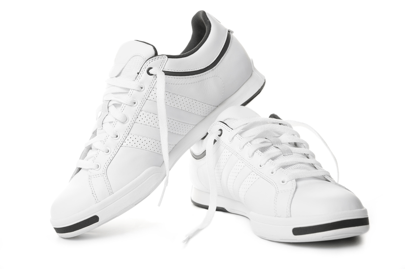

Monica purchased a pair of tennis shoes on sale for $65.99. The shoes were originally $99.00. Use a verbal model to write and solve an equation to determine the amount of money Monica saved by purchasing the shoes on sale

**First write a verbal model to represent the problem.**

_Verbal Model:_ $\text{Sale Price} + \text{Amount Saved} = \text{Original Price}$

Let “$s$” represent the amount saved.

_Equation:_ $65.99 + s = 99.00$

_Solution:_ Recall that to solve for “$s$,” complete the inverse operation. Since addition is used in the equation, use subtraction to solve.

It makes sense to subtract 65.99 from 99.00.

$99.00 - 65.99 = \$33.01$

**This is the answer.**

The cost to run a thirty second commercial on prime time television is seven hundred fifty-thousand dollars. Use a verbal model to write and solve an equation to determine the cost per second.

_Verbal Model:_ $\frac{\text{Total Cost}}{\text{Number of Seconds}} = \text{Cost per Second}$

Let “$x$” represent the unknown cost per second.

_Equation:_ $\frac{\$750,000}{30} = x$

_Solution:_ To solve, divide 750,000 by 30.

$$
\begin{align*}
\frac{750,000}{30} &= x\\
25,000 &= x
\end{align*}
$$

**Now remember that we were talking about money in this problem. So our answer needs to be written as a money amount.**

**The answer is that is costs $25,000 per second for a thirty second commercial.**

IV. **Model and Solve Real-World Problems using Simple Whole-Number Equations**

You can construct models to help you solve a problem. You have already learned to use a verbal model to write and solve equations to solve problems. Creating a model for a problem may also include methods such as drawing a diagram or picture or making a table or chart.

Example

The triangles below were constructed using toothpicks. Determine the number of toothpicks needed to construct twenty triangles.

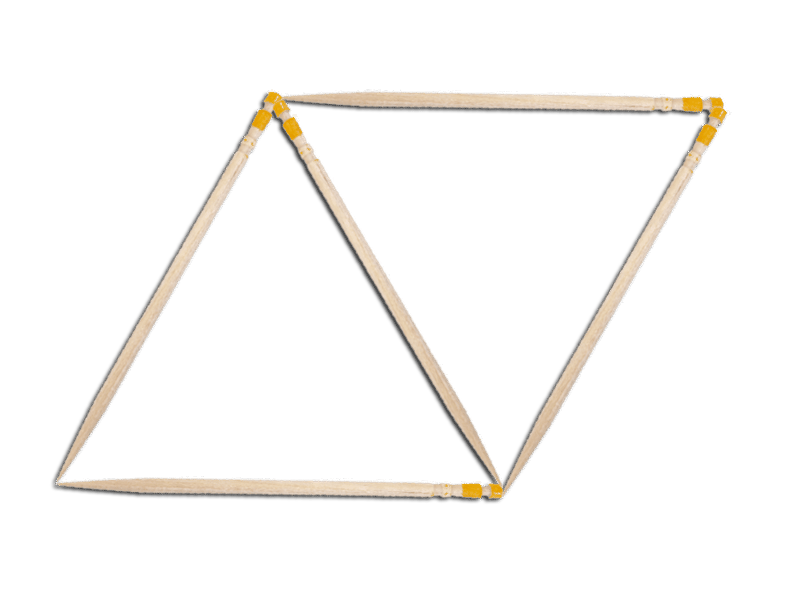

| **Triangle #:** | **Toothpick #** |
| --- | --- |
| 1   | 3   |
| 2   | 5   |
| 3   | 7   |
| 4   | 9   |
| 5   | 11  |
| 6   | 13  |
| 7   | 15  |
| 8   | 17  |
| 9   | 19  |
| 10  | 21  |

**Looking at the table, you can identify a pattern. You can see that two toothpicks are needed each time a new triangle is constructed. You can write a verbal model to express this amount.**

Total Number of Toothpicks Needed = Two Times the Number of Triangles + One Toothpick

Let $n =$ number of triangles

Total Number of Toothpicks Needed $= 2n + 1$

**To determine the number of toothpicks needed to construct twenty triangles, substitute twenty for the variable.**

$$
\begin{align*}
& 2n + 1\\
& 2(20) + 1\\
& 40 + 1\\
& 41
\end{align*}
$$

**41 toothpicks are needed to construct twenty triangles.**

**Now let’s go back to the problem from the introduction and work on applying what we have learned in this lesson. With our new knowledge, we can work on solving the introductory problem.**

Real-Life Example Completed
---------------------------

**_Cookie Sale Success_**

**Here is the original problem once again. Reread it first. Then write an equation to solve for the number of weeks that it took the students to earn $540.00. There are two parts to this problem, an equation and the number of weeks.**

The cookie sale was a much bigger success than either Cameron or Tracy had even thought. Within the first month, the students were selling out the inventory every single day. They were having such a difficult time keeping up, that they hired the home economics classes to help them with the baking. So some of the money went to the students who agreed to bake, but the rest of it went into the student council.

By midterms, the students calculated that after paying the home economics students, that they were still averaging $60.00 profit per week. By midterms, they had collected $540.00 total.

“How many weeks did it take us to make that much?” Jesse asked at lunch one day.

“I don’t know, but I am sure that we can make $1000.00 by end of the semester,” Tracy said smiling.

“How can you be so sure?”

“You just do the math. First, we can write an equation and solve it to figure out how long it took us to make the $540.00. Then double it for the length of the semester.” Tracy explained.

**_Solution to Real – Life Example_**

**To work on this problem, first we need to write an equation. Let’s look at what we know.**

**We know that the students averaged $60.00 profit per week.**

**We know that their gross profit was $540.00.**

**We need to know how many weeks it took them to earn that. Our variable is the number of weeks, $w$.**

**Here is our equation.**

$$
60w=540
$$

**We can solve this using mental math.**

**It took the students 9 weeks to earn the money.**

Vocabulary
----------

Here are the vocabulary words found in this lesson.

__Equation__

a group of numbers, operations and variables where the quantity on one side of the equal sign is the same as the quantity on the other side of the equal sign.

__Inverse Operation__

the opposite operation. Equation can often be solved by using an inverse operation.

__Verbal Model__

using words to decipher the mathematical information in a problem. An equation can often be written from a verbal model.

Time to Practice
----------------

Directions: Solve each equation using mental math. Be sure to check each answer by substituting your solution back into the original problem. Then simplify to be sure that your equation is balanced.

1.  $x+4=22$
2.  $y+8=30$
3.  $x-19=40$
4.  $12-x=9$
5.  $4x=24$
6.  $6x=36$
7.  $9x=81$
8.  $\frac{y}{5}=2$
9.  $\frac{a}{8} = 5$
10. $\frac{12}{b}=6$
11. $6x+3=27$
12. $8y-2=54$
13. $3b+12=30$
14. $9y-7=65$
15. $12a-5=31$
16. $\frac{x}{2} + 4 = 8$
17. $\frac{x}{4}+3=7$
18. $\frac{10}{x}+9=14$
19. $5a-12=33$
20. $7b-9=33$

Directions: Use what you have learned about writing verbal models to solve each equation. There are three parts to each problem.

21. Alexander’s resting heart rate is 75 beats per minute. This is thirty-beats less than his heart rate after exercising. Use a verbal model. Write an equation. Then solve the equation to determine Alexander’s heart rate after exercising.
22. The rectangles below were constructed using toothpicks. Four toothpicks were used to make one rectangle. Three more toothpicks were added to make a second rectangle. Determine the number of toothpicks needed to make fifteen rectangles in a row. Write a verbal model. Write an equation. Solve the equation for the solution. 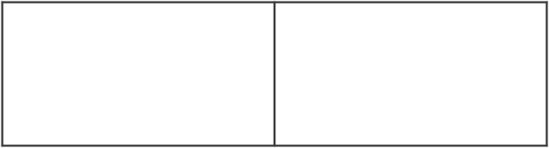
    
    \[Figure 8\]

</article>

### 1.6 Using Formulas

<article>

Introduction
------------

**_Summer Travels_**

“We went camping at Yellowstone National Park and it was the best,” Laila said taking a bite of her sandwich.

“Really, that must have taken forever,” Kevin commented.

“No, we flew into Denver and then drove from Denver to Yellowstone so that we could see some of the country.”

“How far is it from Denver to Yellowstone?”

“It is about 540 miles. I know because I tracked it on the map. After leaving Denver it only took us nine hours to get there. We just made little stops and drove straight through so we could get there in time,” Laila explained.

Kevin began figuring out the math in his head. He wondered how fast the car was traveling if it made it in just nine hours.

**Figuring out this problem will require you to use formulas. Formulas are often used in math as a method for solving a particular type of problem. Pay close attention to this lesson and you will see this problem once again.**

**_What You Will Learn_**

By the end of this lesson, you will have an understanding of how to use the following skills.

* Find perimeter and area of squares and rectangles using formulas.
* Solve for unknown dimensions using formulas, given perimeter or area.
* Recognize and rewrite the formula for distance as the product of rate and time to find distance, to find rate, and to find time.
* Solve real-world problems involving simple familiar formulas, including area, distance and unit conversions.

**_Teaching Time_**

I. **Find Perimeter and Area of Squares and Rectangles using Formulas**

This lesson is all about formulas. Let’s start by thinking about what a formula actually is. **A** **_formula_** **is a method that has been proven to work when solving specific types of problems.** By this point in mathematics, there are many formulas that you are already familiar with. This lesson will explore some of those familiar formulas and their applications in problem solving. Let’s start by looking at rectangles, squares, area and perimeter.

**The** **_perimeter_** **of a figure is the distance around the figure.** Perimeter is the sum of all of the sides in a square or rectangle. Since a rectangle has two sets of parallel sides, the formula for determining perimeter of a rectangle is: $2L + 2W$. $L =$ length and $W =$ width.

$$
\begin{align*}
2(9) + 2(12) &= \text{Perimeter}\\
18 + 24 &= \text{Perimeter}\\
42 \ inches &= \text{Perimeter}
\end{align*}
$$

**The perimeter of this rectangle is 42 inches.**

**_Area_** **is the amount of square units inside the figure.** Area is found by multiplying the $\text{Length} \times \text{Width}$. The formula for finding the area of a rectangle is $L \times W$.

**We can use the dimensions from the rectangle above to find the area of this rectangle.**

$$
\begin{align*}
12 \times 9 &= \text{Area}\\
12 \times 9 &= \text{Area}\\
108 \ cm^2 &= \text{Area}
\end{align*}
$$

**The area of this rectangle is $108 \ cm^2$.**

")

\[Figure 4\]

**We can also find the perimeter and area of a square.** Remember that a square has four equal sides, so we can use the following formula for finding the perimeter of a square, $4s$.

Example

Find the perimeter of the following square.

$$
\begin{align*}
4s &= \text{Perimeter}\\
4(4.5) &= \text{Perimeter}\\
18 \ inches &= \text{Perimeter}
\end{align*}
$$

**The perimeter of the square is 18 inches.**

**We can also find the area of a square. To find the area of a square we simply multiply the measurement of the side by itself.**

$$
A= s^2
$$

**We know the length of the side, so we simply substitute it into the formula and solve.**

$$
\begin{align*}
A &= (4.5)(4.5)\\
A &= 20.25 \ in^2
\end{align*}
$$

**The area of the square is $20.25 \ in^2$.**

II. **Solve for Unknown Dimensions using Formulas, Given Perimeter or Area**

In the last section, you solved for the perimeter or area of a square or rectangle using the given side lengths. In this section, you are going to be working backwards by using the perimeter or area to figure out a missing length of a square or rectangle.

Example

A rectangle has a length of 12 feet and a perimeter of 72 feet. Write and solve an equation to determine the width of the rectangle.

**Recall that the formula to determine perimeter of a rectangle is $2(L) + 2(W)$. Substitute the information given in the problem to determine the missing dimension. We know the length of one side is 12 feet. Therefore, plug in 12 for the length. We also know that the total perimeter is 72 feet. Therefore, set the formula equal to 72 feet. Then, use inverse operations to solve for the unknown width.**

$$
\begin{align*}
\text{Perimeter} &= 2(L) + 2(W)\\
\text{Perimeter} &= 2(12)+ 2(W)= 72\\
\text{Perimeter} &= 24 + 2W = 72
\end{align*}
$$

**Next, we need to work to figure out the value of the width. It makes sense to use an inverse operation and subtract 24 from 72.**

$$
2W=48
$$

**Two times twenty-four is forty-eight. This is our answer.**

**The unknown width is 24 feet.**

Example

A square has a perimeter of 196 inches. Determine the length of one side of the square.

Recall that a square has four equal sides. Therefore, $4s = 196 \ inches$. Use inverse operations to solve for “$s$.”

$$
\begin{align*}
\frac{4s}{4} &= 196\\
s &= 49 \ inches
\end{align*}
$$

You can check your work by substituting 49 for the variable in $4s$. 49 is the correct length if your answer is 196 inches.

$$
\begin{align*}
4s &= 196\\
4(49) &= 196\\
196 &= 196
\end{align*}
$$

**The length of one side of the square is 49 inches.**

Example

The area of a rectangle is 240 square feet. The length of one side is 15 feet. Write and solve an equation to determine the width of one side of the rectangle.

**Recall that the formula for area is $L \times W$. Plug in the information given in the problem. Then, use algebra to solve for the unknown width.**

$$
\begin{align*}
L \times W &= Area\\
15W &= 240
\end{align*}
$$

**To figure this out, we divide 240 by 15. This is an example of using an inverse operation.**

$$
W = 16 \ feet
$$

We can check our work by substituting 16 for the width in the equation $L \times W = Area$.

$$
\begin{align*}
15 \times 16 &= \text{Area}\\
15 \times 16 &= 240 \ square \ feet
\end{align*}
$$

**The rectangle is 15 feet by 16 feet.**

**You can see that by using the same formulas for finding the area and perimeter of squares and rectangles that we can work backwards and figure out missing parts. Remember it is a lot like figuring out the pieces of a puzzle.**

III. **Recognize and Rewrite the Formula for Distance as the Product of Rate and Time to Find Distance, to Find Rate and to Find Time**

In the last section, you looked at measuring the distance around a figure and the distance inside a figure. We also measure **_distance_****\-as in how far you can travel** by car, boat, train or foot. We can measure **_rate_** **or the speed** that you can travel by each different mode, and finally we can measure the **_time_** **or how long** that it takes us. Look at the following example and then let’s look at how we can calculate distance, rate and time.

The Murphy Family drove for three and a half hours from Manhattan, New York to Providence, Rhode Island at a rate of fifty-three miles per hour. Determine the distance at which the Murphy’s were traveling.

**First, we need to think about what we need to solve for. In this problem, we need to figure out the distance that the Murphy family traveled. To do this, there is a simple formula that we can use. In fact, we can use this formula whenever we are calculating distance.**

$$
Distance = rate \times time
$$

**Now we can take the given information from the problem and substitute that information into the formula. Once we have done that, we will be able to calculate the distance.**

$$
D=53(3.5)
$$

**53 represents the rate or speed that the car was traveling.**

**3.5 represents the three and a half hours that the family traveled.**

$$
D=185.5 \ miles
$$

**The distance that the Murphy family traveled was 185.5 miles.**

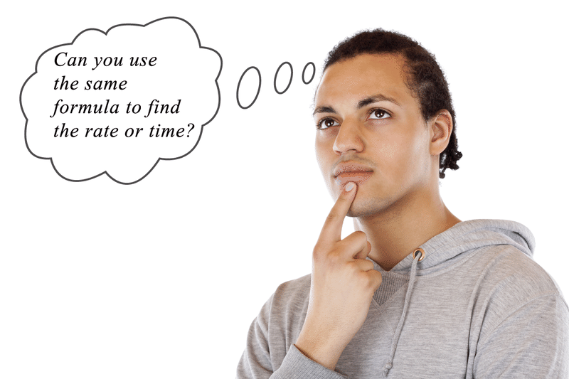

To find **rate**, divide both sides of the equation by time.

$\text{Rate} = \frac{Distance}{Time}$

To find **time**, divide both sides of the equation by rate.

$\text{Time} = \frac{Distance}{Rate}$

**Now let’s look at applying these formulas when problem solving.**

Example

Use the distance formula to solve for rate.

$\text{Distance} = 285 \ miles$

$\text{Time} = 9.5 \ hours$

$\text{Rate} = x$

_Step 1:_ Recall that $\text{Rate} = \frac{\text{Distance}}{\text{Time}}$.

$\text{Rate} = \frac{Distance}{Time}$

_Step 2:_ Substitute in the information given in the problem.

$\text{Rate} = \frac{285}{9.5}$

_Step 3:_ Solve

$\text{Rate} = 30 \ mph$

**The answer is 30 mph.**

Example

Use the distance formula to solve for time.

$\text{Distance} = 550 \ miles$

$\text{Rate} = 55 \ mph$

$\text{Time} = x$

_Step 1:_ Recall that $\text{Time} = \frac{\text{Distance}}{\text{Rate}}$.

$\text{Time} = \frac{Distance}{Rate}$

Step 2: Substitute in the given information into the equation.

$\text{Time} = \frac{550}{55}$

_Step 3:_ Solve

$\text{Time} = 10 \ hours$

**The answer is 10 hours.**

**Now let’s look at how we can use all of these formulas when solving real-world problems.**

IV. **Solve Real – World Problems Involving Simple Familiar Formulas including Area, Distance and Unit Conversions**

Formulas are used all the time in everyday life. If you think about what the formula helps you solve, you will be able to apply them in situations that make sense. Let’s work through a few examples and use formulas to solve real-world problems.

The students at Horizon Elementary School are constructing a $400ft^2$ vegetable garden. The width of the garden is 25 feet. Determine the length of the vegetable garden.

**Recall that $\text{Area} = \text{Length} \times \text{Width}$. To determine the unknown length, plug the known information into the equation.**

$$
\begin{align*}
Area &= Length \times Width\\
\frac{400}{25} &= \frac{25}{25} W
\end{align*}
$$

**The width of the garden is 16 feet.**

A train traveled 255 miles in 300 minutes. Determine the rate at which the train was traveling.

_Step 1:_ When using the distance formula, it is essential that you pay attention to the units used in the problem. If the rate in the problem gives miles per hour (mph), then time must be in hours. If the time is given in minutes, divide by sixty to determine the number of hours prior to solving the equation. Therefore prior to solving the problem above, divide 300 minutes by 60.

$300 \ minutes \div 60 \ minutes = 5 \ hours$

_Step 2:_ Since the problem is asking you to determine the rate, use the formula $\text{Rate} = \frac{\text{Distance}}{\text{Time}}$. Plug the known information into the problem.

$\text{Rate} = \frac{Distance}{Time}$

_Step 3:_ Solve

$$
\begin{align*}
\text{Rate} &= \frac{255}{5}\\
\text{Rate} &= 51 \ miles \ per \ hour
\end{align*}
$$

**The train was traveling at a rate of 51 miles per hour.**

A snake slithers at a rate of 2.5 feet per second. Determine the amount of time (in minutes) it will take a snake to slither a distance one mile.

**Recall that $\text{Time} = \frac{\text{Distance}}{\text{Rate}}$. Prior to solving the above problem, convert miles to feet. There are 5,280 feet in one mile. Therefore, use 5,280 feet to represent the distance traveled in the equation.**

$$
\begin{align*}
\text{Time} &= \frac{Distance}{Rate}\\
\text{Time} &= \frac{5280 \ feet}{2.5 \ feet}\\
\text{Time} &= 2,112 \ seconds
\end{align*}
$$

**The problem asks you to determine the amount of time in minutes. Therefore, convert seconds to minutes. There are 60 seconds in one minute. To convert the time to hours, divide 2,112 by 60.**

$2,112 \ seconds \div 60 \ seconds = 35.2 \ minutes$

**Rounded to the nearest minute, the snake traveled thirty-five minutes.**

Real-Life Example Completed
---------------------------

**_Summer Travels_**

**Here is the original problem once again. Reread it and then write the formula that you will need to solve it. After that, solve the problem for the speed of travel. Your answer will have two parts to it.**

“What did you do this summer for fun?” Kevin asked Laila at lunch during the first week of school.

“We went camping at Yellowstone National Park and it was the best,” Laila said taking a bite of her sandwich.

“Really, that must have taken forever,” Kevin commented.

“No, we flew into Denver and then drove from Denver to Yellowstone so that we could see some of the country.”

“How far is it from Denver to Yellowstone?”

“It is about 540 miles. I know because I tracked it on the map. After leaving Denver it only took us nine hours to get there. We just made little stops and drove straight through so we could get there in time,” Laila explained.

Kevin began figuring out the math in his head. He wondered how fast the car was traveling if it made it in just nine hours.

**_Solution to Real – Life Example_**

**Think about this problem. We are solving for the speed that the car traveled.**

**To solve this problem you will need to use the formula:**

$$
D=R \times T
$$

**Now that you have identified the correct formula, let’s think about the information that you have been given.**

You know the distance from Denver to Yellowstone. It is 540 miles.

You know that it took the family 9 hours to get there with little quick stops.

We are looking to find the speed the car traveled.

Let’s substitute the given information into the formula.

$$
540=R(9)
$$

Next, we can solve this problem by solving the equation. We want to figure out “$R$” so we divide both sides of the equation by nine.

$$
\begin{align*}
\frac{540}{9} &= R\\
60 \ mph &= R
\end{align*}
$$

**The family was traveling about 60 mph. We could say that they were even traveling a little bit slower because there were quick stops.**

Vocabulary
----------

Here are the vocabulary words that are found in this lesson.

__Formula__

a method proven to work when solving specific types of problems.

__Perimeter__

the distance around a figure.

__Area__

the measurement of the inside of a figure.

__Distance__

how far a vehicle or person travels in a certain amount of time given a specific rate.

__Rate__

the speed of travel

__Time__

the time of travel

Time to Practice
----------------

Directions: Find the area and perimeter of each square or rectangle using formulas and the given dimensions. Each problem will have two answers.

1.  A square with a side length of 5 inches.
2.  A rectangle with a length of 5 inches and a width of 3 inches.
3.  A rectangle with a length of 8 cm and a width of 6 cm.
4.  A square with a side length of 11 feet.
5.  A rectangle with a length of 9 inches and a width of 4.5 inches.
6.  A square with a side length of 7 feet.
7.  A rectangle with a length of 12 meters and a width of 11 meters.
8.  A square with a side length of 13 meters.
9.  A rectangle with a length of 15 feet and a width of 8 feet.
10. A square with a side length of 12.5 feet.

Directions: Find the missing side length given the area of each square.

11. $A = 64 \ in^2$
12. $A = 36 \ in^2$
13. $A = 81 \ m^2$
14. $A = 100 \ in^2$
15. $A = 144 \ ft^2$
16. $A = 121 \ cm^2$
17. $A = 4 \ mm^2$

Directions: Find the number of miles traveled given the rate and time.

18. Four hours at a rate of 33 mph.
19. Six hours at a rate of 55 mph.
20. Eight hours at a rate of 65 mph.
21. 12 hours at a rate of 50 mph.
22. 14 hours at a rate of 60 mph.
23. 9 hours at a rate of 70 mph.

Directions: Use the given information to figure out each rate or time.

24. A car traveled 450 miles at a speed of 30 mph. How many hours did it take?
25. A car traveled 600 miles in 12 hours. What was the speed of the car?
26. A runner traveled 6 miles in 30 minutes. How fast was the runner going?
27. A car traveled 520 miles at a speed of 65 mph. How many hours did it take?

</article>

### 1.7 A Problem Solving Plan

<article>

Introduction
------------

**_The Garden_**

“I didn’t do anything that exciting this summer,” he said with another sigh.

“I’m sure you did great stuff. What did you do? Tell me about it,” Laila said smiling.

“Well, the big thing that I did was to design and build a vegetable garden. It actually was quite cool, because I was working as a Junior Counselor at the Boys and Girls Club and so I had a bunch of seven year olds who helped me,” Kevin said.

“That is terrific.”

“You know, it really was. I designed the garden to fit in this corner of the play yard. We had an area of $6^\prime \times 12^\prime$ to work with, and then we wanted to plant broccoli, carrots, peas, squash, zucchini, peppers, eggplant and tomatoes. It actually involved a lot of math. We had to figure out the area of the land and then the kids wanted each vegetable to have an even spot in the garden,” Kevin explained.

Laila began thinking about this problem in her head.

**It is time for you to do the same thing. There are several steps to this problem and to work through it, you will need to figure out a problem solving plan. After learning the information in this section, you should be all ready to begin.**

**_What You Will Learn_**

By the end of this lesson you will be able to use the following skills.

* Read and understand a given problem situation.
* Make a plan to solve the problem.
* Solve the problem and check the results
* Compare alternative approaches to solving the problem.
* Solve real-world problems using a plan.

**_Teaching Time_**

I. **Read and Understand a Given Problem Situation**

By now, you have probably learned that there are many ways to solve a problem. Several problem solving strategies are listed on the table below. When making a plan to solve a problem, you may choose one or several strategies.

Act it Out

Make a Model

Try and Check

Look for a Pattern

Guess and check

Make a Table

Work Backward

Write an Equation

Write a Proportion

In this lesson, you will learn how to use a few of these strategies when approaching a problem. Let’s start with the first step in any problem solving plan-reading the problem for understanding.

**When you read a problem, it is helpful to underline any important information. Important information can include words that identify an operation. You can also identify key words such as distance, time, speed, area or perimeter. All of these parts help you to identify a problem and what the problem is asking you to solve.**

**Let’s look at an example.**

Mollie is planning to meet a group of friends at the movies on Saturday night at 6:00 p.m. Mollie is in charge of driving a few friends to the movies. Mollie lives 15 minutes from Sara’s house. It takes 10 minutes to get from Sara’s house to Madison’s house. It is another 20 minutes to the movie theatre from Madison’s house. It takes Mollie 1 hour to get dressed and ready for the evening. At what time should Mollie begin to get ready for the evening?

**_Step 1:_** **Read and Understand the Problem**

**Ask: What is the problem asking me to find out?**

The problem is asking you to determine the time at which Mollie should begin getting ready for the evening if she is to be at the movies at 6:00 p.m. You must take in to consideration the amount of travel time to each of her friends houses and the amount of time it takes for Mollie to get dressed.

Now that you know what you are looking for, we can work on figuring out a plan.

II. **Make a Plan to Solve the Problem**

This problem involves time. We need to back up the time that it takes for Molly to get to the movie theater. Because of this, we can look at the strategies mentioned in the first section and see if any of these makes sense for our problem solving plan.

Act it Out

Make a Model

Try and Check

Look for a Pattern

Write a Proportion

Make a Table

Work Backward

Write an Equation

Guess and check

We don’t need to act anything out, so that eliminates option one.

Making a model could be one option, but let’s look for a better one.

Try and check doesn’t make sense because we don’t have a number to try.

We need to find the time first, then we can try one out.

Looking for a pattern doesn’t make sense because there isn’t a pattern of numbers shown.

We don’t have any values to compare, so writing a proportion doesn’t make sense.

Making a table doesn’t make sense because we don’t have a list of values.

**Working backwards, hmmm. This makes sense! We know the final time that Molly needs to arrive at the movie theater, so if we work backwards, we will be able to help her figure out the time that she needs to get there.**

**_Step 2:_** **Make a Plan**

Mollie needs to be at the movies at 6:00 p.m. Work backward to determine the time Mollie should begin getting ready.

III. **Solve the Problem and Check the Results**

Now that we have selected a plan, we can use “working backwards” as our strategy and solve the problem.

**_Step 3:_** **Solve the Problem**

Time of Movie – Time to Dress – Time to Movies – Time to Madison’s – Time to Sara’s

6:00 – 1:00 – 0:20 – 0:10 – 0:15

5:00 – 0:20 – 0:10 – 0:15

4:40 – 0:10 – 0:15

4:30 – 0.15

4:15

**With all that she has to do, Mollie should begin getting ready at 4:15 p.m.**

**Now that we have a solution, we need to check our results to be sure that our work is accurate.**

**_Step 4:_** **Check the Results**

If Mollie begins getting dressed at 4:15 p.m. and takes 1 hour, she will be ready to leave at 5:15 p.m. Since it takes Mollie 15 minutes to get to Sara’s house, she’ll arrive at 5:30 p.m. 10 minutes later at 5:40 Mollie will arrive at Madison’s house. Since it takes 20 minutes to drive to the movies, Mollie will arrive at the movies promptly at 6:00 p.m.

**Mollie needs to begin getting ready at 4:15 p.m.**

V. **Compare Alternative Approaches to Solving the Problem**

While we used “working backwards” successfully, there could have been another strategy for solving this problem. Let’s look at building a model.

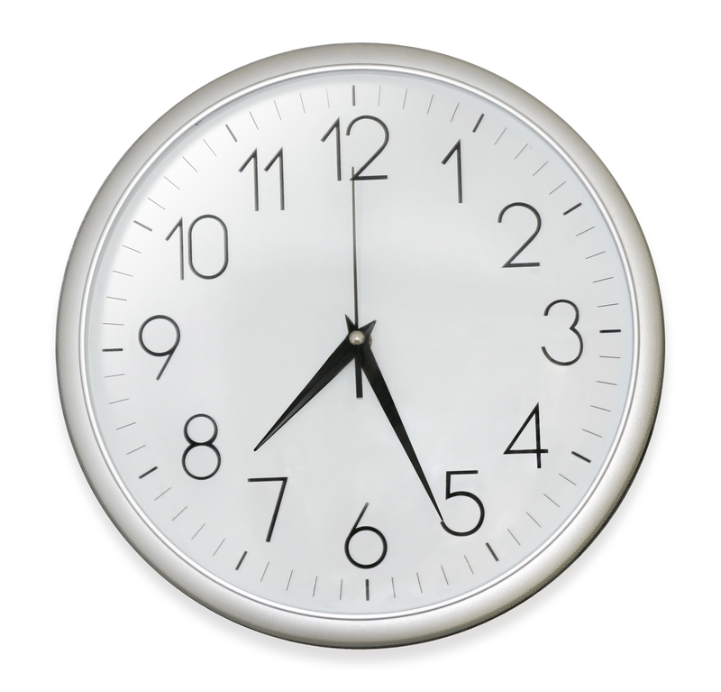

**We could have used the model to solve the problem as well. When problem solving, the important thing is to find a method that you are comfortable with and one that seems to serve the problem.**

VI. **Solve Real – World Problems Using a Plan**

We can solve real-world problems using a problem solving plan. Think about patterns and problem solving. You see examples of patterns around you each day. The leaves of a plant, the petals on a flower, and a colorful quilt all exude patterns. In math, a pattern is a repeated set of numbers. You can analyze patterns in data to make predictions and generalizations. Sometimes you may solve a problem just by determining a pattern. You may also be asked to use the pattern to determine a solution.

The bowling alley charges $12 for one person to play, $10 for the second person to play, $8 for the third to person to play, and so on. What is the total cost for a family of five to bowl? How much money does the family save bowling together rather than separately?

**_Step 1:_** **Read and Understand the Problem**

Ask: What is the problem asking me to do?

The problem is asking you to analyze the pattern to determine the cost for a family of five to bowl. After determining the cost of a family of five to bowl, determine the difference between the amount the family is spending and the amount it would cost for five individuals to play.

**_Step 2:_** **Make a Plan**

To better observe the pattern, organize the information on a table.

| **Family Member** | **Cost to Play** |
| --- | --- |
| 1   | $12 |
| 2   | $10 |
| 3   | $8  |

You can see that the cost to play decreases by two dollars for each additional family member.

**_Step 3:_** **Solve the Problem**

Continue the pattern for the fourth and fifth family members. Add the cost to play for each family member to determine the total cost. You can see that the total cost for a family of five is $40.

| **Family Member** | **Cost to Play** | **Total Cost** |
| --- | --- | --- |
| 1   | $12 | $12 |
| 2   | $10 | $22 |
| 3   | $8  | $30 |
| 4   | $6  | $36 |
| 5   | $4  | $40 |

To determine the amount saved playing as a family, subtract the total cost for a family of five from the total cost for five individuals. The cost to play individually is $12, therefore the cost for five individuals is $\$ 60 (\$12 \times 5)$. $40 subtracted from $60 is $20.

$\text{Cost to Play Individually} - \text{Cost to Play as a Family} = \text{Amount Saved}$

$\$ 60 - \$ 40 = \$ 20$

**The cost for a family of five to bowl is $40. A family of five saves $20 playing together rather than individually.**

Now let’s look at how we can use a problem solving plan to figure out the solution to the problem in the introduction.

Real-Life Example Completed
---------------------------

**_The Garden_**

**Here is the original problem once again. First, reread it. Then you will need to find the area of the garden using a formula. After that, you will need to show how much of the area each vegetable was given in the garden. There are two parts to your answer.**

Kevin finished looking at the pictures from Laila’s trip to Yellowstone National Park. He took a deep sigh.

“I didn’t do anything that exciting this summer,” he said with another sigh.

“I’m sure you did great stuff. What did you do? Tell me about it,” Laila said smiling.

“Well, the big thing that I did was to design and build a vegetable garden. It actually was quite cool, because I was working as a Junior Counselor at the Boys and Girls Club and so I had a bunch of seven year olds who helped me,” Kevin said.

“That is terrific.”

“You know, it really was. I designed the garden to fit in this corner of the play yard. We had an area of $6^\prime \times 12^\prime$ to work with, and then we wanted to plant broccoli, carrots, peas, squash, zucchini, peppers, eggplant and tomatoes. It actually involved a lot of math. We had to figure out the area of the land and then the kids wanted each vegetable to have an even spot in the garden,” Kevin explained.

Laila began thinking about this problem in her head.

**_Solution to Real – Life Example_**

**First, you need to find the area of the garden**.

**Area is found by using the formula $l \times w$.**

You know that the length of the garden is 12 feet and the width of the garden is 6 feet. We can substitute those values into the formula and solve for the area of the garden.

$$
\begin{align*}
A &= lw\\
A &= 12(6)\\
A &= 72 \ sq.feet
\end{align*}
$$

Notice that you need to label your answer in square feet because we are working with area.

**To figure out how much area each vegetable was given, we can use mental math. Think about what we know.**

The area of the garden is 72 sq. feet.

There are 8 vegetables being planted.

$72 \div 8 = 9$

**Each vegetable was given 9 square feet.**

Time to Practice
----------------

Directions: Read each problem and then answer the questions following each problem.

**At the end of a phone call home, Brad had $0.42. During the last minute of the phone call, the operator asked him to deposit $0.15. The initial cost of the phone call was $0.75 plus $0.12 per minute. If Brad spoke on the phone for 20 minutes, how much money did he have before making the phone call home?**

1.  Should you use working backwards or writing a proportion for this problem?
2.  Why wouldn’t you use a proportion for this problem?
3.  You will need to multiply one part of this problem, which part?
4.  What equation could you write to solve this problem?
5.  How much money did Brad have before making the phone call?

**Suppose you have $75 in your savings account. You plan to save an additional $25 per week. After how many weeks will you have saved $500?**

6.  Which strategy makes the most sense look for a pattern or working backwards?
7.  What is the unknown quantity that you are trying to figure out?
8.  What equation can you use to solve this problem?
9.  How many weeks will it take to save $500.00?

**An online music store charges $1.89 to download 2 songs. Determine the cost of downloading 13 songs.**

10. Which strategy would you use look for a pattern or use a proportion?
11. Why would you use that method?
12. What is the cost for the 13 songs?
13. What would be the cost for double the songs?
14. If the cost had been $2.25 per song, how much would 2 songs cost?
15. What would be the cost for 4 songs?
16. If six friends each downloaded four songs, how much would the total cost be?

**For every day that Jesse harvested vegetables in the garden, he collected 4 pounds of vegetables. If Jesse continued this for 45 days, how many total pounds of vegetables will he have collected?**

17. Does it make sense to look for a pattern or work backwards on this problem?
18. What equation can you write to show the total number of vegetables that Jesse gathered?
19. How many total pounds did he gather after 45 days?
20. If Jesse could collect vegetables for 90 days, how many pounds would he collect in all?

</article>

### 1.8 Problem Solving Strategies

<article>

Introduction
------------

**_Summer Flights_**

“We were talking about what we did this summer. I went to Yellowstone camping and Kevin did this really great project with a group of kids making a garden. What about you? What did you do with your summer?” Laila asked Carmen as she took a drink of milk.

“I went to see my Grandparents. It was a great time, but I barely made it on the day of my flight,” Carmen said munching a carrot.

“What happened?” Kevin asked.

“Well, it started out fine. I had a 9 pm flight. I knew that I had to be at the airport 2 hours before the flight and that we live one hour from the airport. I needed $1 \frac{1}{2}$ to pack and take a shower and stuff like that. It would have been fine except I had a plan to play soccer at the park first. I got home at 4:00 and barely made it to the airport,” Carmen explained.

Kevin looked at Laila.

“You should have had plenty of time,” Kevin said.

**How does Kevin know this? Can you follow Kevin’s thinking? Why does Kevin make this statement? To figure this out, you will need to apply your problem solving skills. This problem will appear again at the end of the lesson.**

**_What You Will Learn_**

By the end of this lesson you will be able to use the following skills.

* Read and understand given problem situations.
* Develop and use a variety of strategies.
* Plan and compare alternative approaches to solving problems.
* Solve real-world problems using selected strategies as part of a plan.

**_Teaching Time_**

I. **Read and Understand Given Problem Situations**

In this chapter we have talked about and worked with many different strategies. Each of the introduction problems required you to use different strategies to think about and solve problems. You have learned to use the strategies Write an Equation, Make a Model, Work Backward, and Look for a Pattern. In this lesson, you will use all of the strategies you learned. For each situation, you will be asked to read and understand a given problem. You will make a plan to solve by choosing an appropriate strategy. Recall that there are multiple ways to solve a word problem. Therefore, you will be asked to consider and compare different approaches for each problem given.

**First, let’s think about reading a problem.**

When you read to understand a problem, you are working to determine what the problem is asking you to do. It helps to highlight the question in the problem. You may want to also underline clue words that may help you with planning and strategy.

A lizard ate five hundred flies on five consecutive nights. Each night he ate twenty-five more than the night before. How many flies did the lizard eat each night?

**In this section, you are working to determine what the problem is asking you to do.**

For this problem, you are to determine the number of flies the lizard ate each night. Here is what you are told:

* You are told that the lizard ate a total of five hundred flies over the course of five nights.
* You are told that the lizard eats twenty-five more flies each night than the night before.
* You should know the word consecutive means a logical sequence or succession. In this case, it means one night after the other.

Example

A train’s caboose is 12 feet long. Each of the train’s eight cars are twice the length of the caboose. Determine the length of the entire train.

**Ask: What is the problem asking you to find out?**

You are to determine the entire length of the train. You were told some information.

* The caboose is 12 feet long.
* There area of an additional eight cars.
* Each car is twice the length of the caboose.

**Once you have had some practice reading for understanding, it is time to work with some strategies for problem solving.**

II. **Develop and Use a Variety of Strategies**

The next step after reading the problem is to make a plan to solve. When you make a plan to solve, you decide which strategy to use. In this section, you will see the problems from the first section.

Example

A lizard ate five hundred flies on five consecutive nights. Each night he ate twenty-five more than the night before. How many flies did the lizard eat each night?

**Recall what you are to find out.**

For this problem, you are to determine the number of flies the lizard ate each night. Here is what you are told:

* You are told that the lizard ate a total of five hundred flies over the course of five nights.
* You are told that the lizard eats twenty-five more flies each night than the night before.
* You should know the word consecutive means a logical sequence or succession. In this case, it means one night after the other.

**Make plan to solve the problem.**

Use a verbal model to write and solve an equation to determine the unknown number of flies eaten each day.

You are told that the lizard ate a total of five hundred flies in five days. You are also told that each night he eats twenty-five more than the night before. To determine the number of flies consumed each night, you must first determine the number of flies the lizard ate the first night. After determining the number of flies consumed the first night, add twenty-five more each day to get the daily total.

**The next step is to solve the problem.**

**_Verbal Model:_**

number of flies eaten on night one + (number of flies eaten on night one + twenty-five) + (number of flies eaten on night one + twenty-five + twenty-five) + (number of flies eaten on night one + twenty-five + twenty-five + twenty-five) + (number of flies eaten on night one + twenty-five + twenty-five + twenty-five + twenty-five) = total number of flies eaten over five nights (500)

Let “$x$” represent the number of flies eaten on night one.

**_Equation:_**

$x + (x + 25) + (x + 25 + 25) + (x + 25 + 25 + 25) + (x + 25 + 25 + 25 + 25) = 500$

**_Solution:_**

$$
\begin{align*}
x + (x + 25) + (x + 25 + 25) + (x + 25 + 25 + 25) + (x + 25 + 25 + 25 + 25) &= 500\\
x + (x + 25) + (x + 50) + (x + 75) + (x + 100) &= 500\\
5x + 250 &= 500
\end{align*}
$$

**Next, we solve the equation. Subtract 250 from 500 and divide by 5.**

$$
x=50
$$

**The lizard consumed 50 flies the first night. To determine the number of flies the lizard ate on nights two, three, four, and five, substitute 50 for “$x$” in the equation.**

$$
\begin{align*}
x + (x + 25) + (x + 50) + (x + 75) + (x + 100) &= 500\\
50 + (50 + 25) + (50 + 50) + (50 + 75) + (50 + 100) &= 500\\
50 + 75 + 100 + 125 + 150 &= 500
\end{align*}
$$

**You can see that on night one, the lizard ate 50 flies.**

**On night two, the lizard consumed 75 flies.**

**On night three, the lizard ate 100 flies.**

**On night four, the lizard ate 125 flies.**

**On the last night, the lizard ate 150 flies.**

**Check the Results**

You can check your work, by adding the number of flies consumed each night. The sum should be equal to five hundred.

$50 + 75 + 100 + 125 + 150 = 500$

**Answer:**

**Night One: 50**

**Night Two: 75**

**Night Three: 100**

**Night Four: 125**

**Night Five: 150**

Example

A train’s caboose is 12 feet long. Each of the train’s eight cars are twice the length of the caboose. Determine the length entire train.

**Ask: What is the problem asking you to find out?**

You are to determine the entire length of the train. You were told:

* The caboose is 12 feet long.
* There area an additional eight cars.
* Each car is twice the length of the caboose.

**Make a plan to solve the problem.**

You can draw a diagram and use a verbal model to visualize the information given in the problem. Then, write an equation to determine the length of the entire train.

Eight trains twice the length of the caboose + the length of the caboose = entire length of the entire train

Let “$x$” represent the unknown length of the train.

**_Equation:_**

$$
8(2 \cdot 12) + 12 = x
$$

_Solution:_

$$
\begin{align*}
8(2 \cdot 12) + 12 &= x\\
8(24) + 12 &= x\\
192 + 12 &= x\\
204 &= x
\end{align*}
$$

**The entire train is 204 feet.**

III. **Plan and Compare Alternative Approaches to Solving Problems**

When working with a problem, you have many different approaches to choose from. While some approaches may be better than others, you can select different strategies and still end up with the correct answer.

**The key here is to check your work.**

**Always make sure that your answer makes sense.**

**If you aren’t sure that your work is correct, then use a different strategy to test your results.**

IV. **Solve Real – World Problems Using Selected Strategies as Part of a Plan**

In this section, you will use all you have learned about problem solving to solve real-world problems. Remember to read and understand the problems, make plans to solve, and then check your answers.

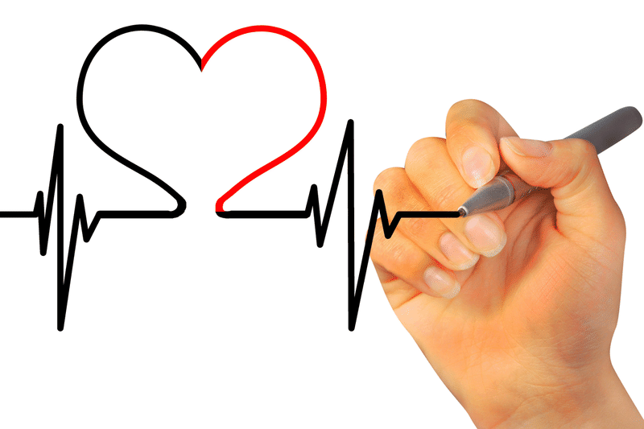

A ten year olds’ heart beats approximately 85 times per minute. How many times does the heart beat in 24 seconds?

**What is the problem asking you to do?**

Knowing that the heart beats 85 times per minute, determine the number of heart beats in 24 seconds.

**What is the plan?**

Since you are being asked to determine an unknown rate, write a proportion to solve.

**Solve the problem.**

When you look at the problem, you should notice that the number of heart beats is given in minutes. The question asks for you to give the answer in number of heart beats per second. Therefore when writing the proportion, express one minute as sixty seconds. Recall that to solve a proportion, cross multiply then use inverse operations to determine the value of the unknown quantity.

Let “$x$” = the number of heart beats in 24 seconds

$$
\begin{align*}
& \ \underline{\;\; 85 \ beats\;\;} = \underline{\;\;\;\;\;\;\; x \;\;\;\;\;\;\;}\\
& \ 60 \ seconds \quad \ 24 \ seconds\\
& \qquad 85(24) = 60(x)\\
& \ \quad \underline{\;\; 2,040 \;\;} = \underline{\;\; 60x \;\;}\\
& \ \qquad \ 60 \qquad \quad \ 60\\
& \qquad \qquad \ x=34 \ beats
\end{align*}
$$

**Check the results.**

Since you were told that the heart beats 85 times per minute, you know that your answer should be less than that amount since you were determining how many times the heart beats in 24 seconds. You can see that your answer is reasonable because it is less than 85.

You can also check your results by substituting 34 for the variable “$x$” into the equation $85(24) = 60x$.

$$
\begin{align*}
85(24) &= 60x\\
85(24) &= 60(34)\\
2,040 &= 2,040
\end{align*}
$$

**The answer is accurate and our work checks out.**

**Now let’s go back to the problem from the introduction and work on solving that problem.**

Real-Life Example Completed
---------------------------

**_Summer Flights_**

**Here is the original problem once again. Reread it and then explain why Kevin made the statement he made. What time did Carmen need to leave her home to be on time for the flight? There are two parts to your answer.**

“What are you guys talking about?” Carmen asked coming over to see Kevin and Laila.

“We were talking about what we did this summer. I went to Yellowstone camping and Kevin did this really great project with a group of kids making a garden. What about you? What did you do with your summer?” Laila asked Carmen as she took a drink of milk.

“I went to see my Grandparents. It was a great time, but I barely made it on the day of my flight,” Carmen said munching a carrot.

“What happened?” Kevin asked.

“Well, it started out fine. I had a 9 pm flight. I knew that I had to be at the airport 2 hours before the flight and that we live one hour from the airport. I needed $1 \ \frac{1}{2}$ to pack and take a shower and stuff like that. It would have been fine except I had a plan to play soccer at the park first. I got home at 4:00 and barely made it to the airport,” Carmen explained.

Kevin looked at Laila.

“You should have had plenty of time,” Kevin said.

**_Solution to Real – Life Example_**

**First, why did Kevin make that statement?**

Kevin figure out that Carmen should have left for the airport at 6 pm. If she only needed $1 \frac{1}{2}$ hours to get ready, then she should have had plenty of time because she got home at 4 pm leaving her 2 hours to get ready.

**Here is the breakdown of her time.**

9 pm flight – 2 hours check in = 7 pm

7 pm – 1 hour drive time = 6 pm

$6 - 1 \frac{1}{2}$ hours to get ready = 4:30 pm

**Carmen should have left her home at 4:30 pm to be on time for the flight.**

Time to Practice
----------------

Directions: Read each problem and then solve each problem.

**Ted has a collection of rare coins. He already had 34 coins in his collection. The first week, Ted purchases 1 new coin. During the second week, Ted purchases 4 coins. During the third week, Ted adds 9 new coins to his collection. At this rate how many weeks will it take Ted to collect 125 coins?**

1.  Which strategy should Ted use to solve this problem?
2.  What could Ted draw to help him with his solution?
3.  How long will it take Ted to collect 125 coins?

**Savannah purchases a pair of jeans on sale for $59.00. The price is 25% less than the original price. Determine the original price of the jeans.**

4.  Which strategy could Savannah use to calculate the price?
5.  What is the amount of the discount?
6.  What is the original price?

**Extension: Have the students work in pairs to write three problems. One solved through a pattern and table, one solved through a diagram and one solved with an equation then have the students solve them and explain their thinking.**

</article>

## 2.0 Using Rational Numbers

<article>

</article>

### 2.1 Adding and Subtracting Decimals

<article>

Introduction
------------

**_The School Store_**

“What do you think Mr. Janus?” Kelly asked of their teacher advisor at the meeting.

“I think that it is a good idea. There will be some up-front costs involved however. Have you thought of how you are going to handle that?” Mr. Janus asked.

“Yes,” Tyler responded. “Each grade has some money in their account. We have each decided to use this money to help purchase supplies for the store.”

“Alright kids, it seems to me that you have this under control. Why don’t you begin by figuring out the sum of the money that you have so that you know what we have to work with?” Mr. Janus suggested.

“Okay, let’s start their, Trevor, how much is in the sixth grade budget?” Kelly asked.

Trevor flipped a few pages in his notebook before responding.

“There is $345.67 in the sixth grade budget.”

“Okay, let’s write that down. Mallory how about seventh grade?”

“There is $504.89 in seventh grade,” Mallory answered.

“Great and I know that there is $489.25 in the eighth grade budget,” Kelly responded.

“How much do we have to work with?” Trevor asked. “Let’s start by estimating.”

**This is where you come in. This lesson is about adding sums and figuring out differences of decimals. Trevor’s suggestion is a great way to begin tackling the sum, with an estimate. Pay attention to this lesson and you will learn all about estimating and adding sums with decimals. At the end of the lesson, you will have the chance to solve this problem for yourself.**

**_What You Will Learn_**

By the end of this lesson you will be able to demonstrate the following skills.

* Add and subtract decimals with and without rounding.
* Estimate decimal sums and differences using front-end estimation.
* Identify and apply the properties of addition and subtraction in decimal operations using numerical and variable expressions.
* Model and solve real-world problems using simple equations involving decimal addition and subtraction.

**_Teaching Time_**

I. **Add and Subtract Decimals with and without Rounding**

By this point in your learning of mathematics, you have some experience working with decimals. In this lesson we are going to review some of what you have learned before, but we will also build upon this knowledge and expand what you know to include some new ideas. First, let’s think about identifying decimals.

**What is a decimal?**

**A** **_decimal_** **is a number that uses a decimal point and place value to show tenths, hundredths, thousandths, and so on.** The decimal point divides the whole number portion from the fractional portion of the number. For example, look at this number.

35.492

The whole number portion is 35, or 3 tens and 5 ones. The fractional portion is 0.492, or 4 tenths, 9 hundredths, and 2 thousandths. Sometimes there are decimals with both wholes and parts, and sometimes, there are decimals with only parts.

**Let's take a look at adding and subtracting decimals.**

You can add and subtract decimals by adding according to place value or by rounding the values before adding them.

First, let's take a look at adding according to place value.

Example

_Add:_ $48.08+6.215$

**We can add decimals like we add whole numbers: by lining up the place values. For decimals, this means lining up the decimal points. This means that we add each place value with its common place value. We don’t add hundredths and tens. We add hundredths and hundredths. If you think about this logically, it makes perfect sense. Here is what a problem looks like when it is lined up according to place value.**

$$
\begin{align*}
& \ 48.080\\
& \underline{+6.215}
\end{align*}
$$

**Now add each place value, remembering to carry when necessary.**

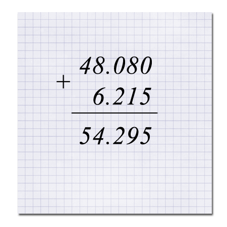

**Next, we can find a sum by estimating. Remember that when you** **_estimate_** **you will find an approximate answer, but it will not be exact.**

**One way to estimate is by rounding.**

**We round each value to the nearest whole number. To determine which whole number to round a number to, we look at the decimal portion of the number. If the decimal part is less than .5, then we round down. If the decimal part is .5 or greater we round up. Let’s look at an example.**

Example

Round 4.56 to the nearest whole number

**In this example, we look at the fraction part to decide whether we will round the 4 up to 5 or leave it alone. In this case the fraction part is .56 which is greater than .5 so we round up to 5.**

**4.56 rounds up to 5**

Example

Round 2.3 to the nearest whole number

**In this example, the decimal part of the number is .3. It is less than .5, so we round down and the 2 remains the whole number.**

**2.3 rounds down to 2.**

**Rounding decimals is very useful when estimating a sum. We round each decimal in the problem and then add the whole numbers. This will give us our sum by rounding.**

**Let’s look at the last example.**

Example

$48.08+6.215$

**Let’s start with rounding 48.08. The decimal part of the value is less than .5 in fact it is .08 a very small decimal. Therefore, the number rounds down to 48.**

**48**

**Next, we round the second value. We look at the decimal part of the value .215 is less than .5. Therefore we round down to 6.**

**$48 + 6$ is our new problem.**

**Our answer is 54.**

**You can see that the actual addition and the estimate by rounding are very close. That is how you can tell that your work is accurate.**

**We can also subtract decimals by using place value or by rounding.** Let’s look at an example.

Example

$56.93-10.14$

**First, we line up the values according to place value so that we can subtract one from the other.**

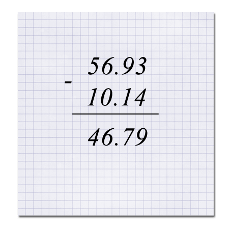

**We can also find the difference by rounding to the nearest whole number. We round each number to the nearest whole number and then we find the difference between the two values.**

**56.93 rounds up to 57**

**10.14 rounds down to 10**

$57-10 = 47$

**Our answer is 47.**

**Notice once again that the answers are close. This lets us know that our work is accurate.**

II. **Estimate Decimal Sums and Differences using Front-End Estimation**

In the last section, you learned to estimate using rounding. Now we are going to use a different method of estimation. It is called **_front-end estimation._**

**_Front-end estimation_** **is a particular way of rounding numbers to estimate sums and differences. To use** **_front-end estimation_****, add or subtract only the numbers in the greatest place value.**

Example

_Estimate the sum using front-end estimation: $4.8+3.2+7.2$_

**First add the digits in the ones places: $4+3+7=14$. So 14 is a good first estimate.**

**Now look at the digits in the tenths places: $8+2+2=12$. Since there are more than 10 tenths, adjust your first estimate. Add 1 one for a more accurate estimate.**

$14+1=15$

**A good estimate for the sum is 15. This is our answer.**

Example

_Estimate the difference using front-end estimation: $9.52-3.39$_

**First subtract the digits in the ones places: $9-3=6$. So 6 is a good first estimate.**

**Now look at the digits in the tenths places. Since the difference of 5 and 3 is 2, it will not affect your first estimate.**

**A good estimate for the difference is 6. This is our answer.**

Now you know how to find sums and differences in three different ways. You can add them according to place value for an exact answer. You can estimate using rounding or you can estimate using front-end estimation.

III. **Identify and Apply the Properties of Addition and Subtraction in Decimal Operations, using Numerical and Variable Expressions**

Do you remember working with properties? **A** **_property_** **is a rule that applies to mathematical statements.** The great thing about a property is that the rule has been proven so it is always true. Properties help us to understand certain ways of doing things in mathematics.

Here are two properties of addition that you should be familiar with.

**_Associative Property of Addition_**

**The grouping of addends does not affect the sum: $4.5+(2.1+9.6)=(4.5+2.1)+9.6$**

**_Commutative Property of Addition_**

**The order of addends does not change the sum: $6.3+8.7=8.7+6.3$**

Example

_Which of the following shows the Commutative Property?_

a. $x+9.5=9.5x$

b. $x-9.5=9.5-x$

c. $x+9.5=9.5+x$

**Consider choice a.**

**This equation states that a number added to 9.5 is equal to that number multiplied by 9.5. This is not correct.**

**Consider choice b.**

**This equation states that the difference of a number and 9.5 is equal to the difference of 9.5 and a number. This is not correct.**

**Consider choice c.**

**This equation states that the sum of a number and 9.5 is equal to the sum of 9.5 and a number. The Commutative Property states that the order of addends does not change the sum, so this is the correct equation.**

**You can also use properties to help you simplify numerical expressions.**

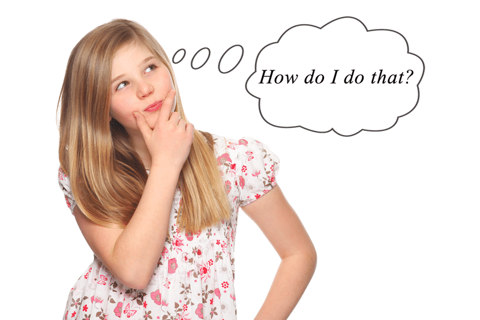

Example

_Simplify: $10.5+(3.2+4.5)$_

**You can use addition properties to reorganize this expression to make it easier to simplify.**

**First apply the commutative property.**

$10.5+(3.2+4.5)=10.5+(4.5+3.2)$

Then apply the associate property.

$10.5+(4.5+3.2)=(10.5+4.5)+3.2$

**Now you can easily use mental math to find the sum.**

$(10.5+4.5)+3.2=15+3.2=18.2$

**The answer is 18.2**

IV. **Model and Solve Real – World Problems using Simple Equations Involving Decimal Addition and Subtraction**

Decimals are all around us in the world. Anytime a number does not divide evenly, you will have to work with a decimal. Think about measurement, items are often not perfect whole measurements. Think about money, we often receive change when we buy something. Because decimals are such a big part of our everyday life, it is important for you to achieve some proficiency and mastery when working with them.

_While at the grocery store, Candace bought a box of cereal for $3.65, a carton of juice for $4.78, and fish for $10.28. If all prices include tax, what is a reasonable estimate for the amount Candace spent? What is the exact amount that Candace spent?_

**There are two parts to the answer for this question. First, we need to find an estimate and then we need to figure out the exact amount that Candace spent.**

**First, to find an estimate, let’s use rounding.**

Round each decimal to a whole number and then find the sum.

3.65 rounds up to 4

4.78 rounds up to 5

10.28 rounds down to 10

$4+5+10=19$

**Candace spent about $19.**

**Now let’s work on figuring out the exact amount that Candace spent.**

To find the exact amount Candace spent, write a simple equation to represent the problem. Let $x$ represent the total amount Candace spent.

$$
\begin{align*}
x &= 3.65+4.78+10.28\\
&=8.43+10.28\\
&=18.71
\end{align*}
$$

**Candace spent exactly $18.71.**

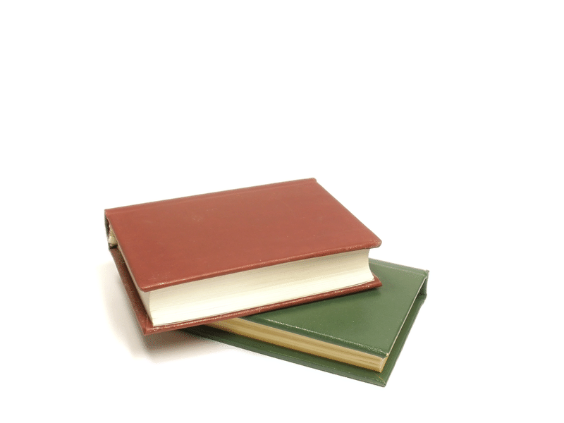

_Nick bought one book for $5.75 and one book for $7.15. He paid with a $20 bill. How much change should he receive?_

**First find the total amount Nick spent.**

$5.75+7.15=12.9$

**Then subtract to find the change he should receive.**

$20-12.9=7.1$

**Nick should receive $7.10 in change.**

**Now let’s go back to the problem in the introduction and use what we have learned to help us solve that problem.**

Real-Life Example Completed
---------------------------

**_The School Store_**

The student council of F.W. Harris Middle School has decided to open a school store. There always seems to be a need for extra money whether it for school dances or for sporting events or to help with field trip costs. The student council has students on it from sixth, seventh and eighth grade and they have decided that this will be the best way to tackle fundraising in an ongoing way.

“What do you think Mr. Janus?” Kelly asked of their teacher advisor at the meeting.

“I think that it is a good idea. There will be some up-front costs involved however. Have you thought of how you are going to handle that?” Mr. Janus asked.

“Yes,” Tyler responded. “Each grade has some money in their account. We have each decided to use this money to help purchase supplies for the store.”

“Alright kids, it seems to me that you have this under control. Why don’t you begin by figuring out the sum of the money that you have so that you know what we have to work with?” Mr. Janus suggested.

“Okay, let’s start their, Trevor, how much is in the sixth grade budget?” Kelly asked.

Trevor flipped a few pages in his notebook before responding.

“There is $345.67 in the sixth grade budget.”

“Okay, let’s write that down. Mallory how about seventh grade?”

“There is $504.89 in seventh grade,” Mallory answered.

“Great and I know that there is $489.25 in the eighth grade budget,” Kelly responded.

“How much do we have to work with?” Trevor asked. “Let’s start by estimating.”

**_Solution to Real – Life Example_**

**The first thing that the students need to do is to find an estimate.**

**To find an estimate, we round each number to the nearest whole number.**

**$345.67 rounds to $346**

**$504.89 rounds to $505**

**$489.25 round up to $490**

**We add $346 + 505 + 390 = \$ 1341$**

**_Look at your estimate is it close to this one? Why or why not?_**

**Now we can find the actual sum.**

$$
\begin{align*}
& \quad \$ 345.67\\
& \quad \$ 504.89\\
& \underline{+ \$ 489.25}\\
& \ \$ 1339.81
\end{align*}
$$

**_Notice that our estimate is reasonable given the actual answer. In fact, our estimate is very close to the actual sum._**

Vocabulary
----------

Here are the vocabulary words that are found in this lesson.

__Decimal__

a part of a whole. The numbers to the left of the decimal point represent whole quantities. The numbers to the right of the decimal point represent parts.

__Estimate__

to find an approximate answer that is reasonable or makes sense given the problem.

__Front-End Estimation__

a method of estimating where you only add the digits in the greatest place value

__Associative Property of Addition__

states that the grouping of numbers does not impact the sum of those numbers.

__Commutative Property of Addition__

states that the order of the numbers as you add them does not impact the sum of those numbers.

Time to Practice
----------------

Directions: Find the exact sum or difference by adding or subtracting the following decimals according to place value.

1.  $16.27 + 3.45 = \underline{\;\;\;\;\;\;\;\;\;\;}$
2.  $22.34 + 9.21 = \underline{\;\;\;\;\;\;\;\;\;\;}$
3.  $34.5 + 1.234 = \underline{\;\;\;\;\;\;\;\;\;\;}$
4.  $5.6 + 8.9 = \underline{\;\;\;\;\;\;\;\;\;\;}$
5.  $1.02 + 12.34 = \underline{\;\;\;\;\;\;\;\;\;\;}$
6.  $67.89 + 23.45 = \underline{\;\;\;\;\;\;\;\;\;\;}$
7.  $123.4 + 7.89 = \underline{\;\;\;\;\;\;\;\;\;\;}$
8.  $34.05 + 102.10 = \underline{\;\;\;\;\;\;\;\;\;\;}$
9.  $34.56 - 11.23 = \underline{\;\;\;\;\;\;\;\;\;\;}$
10. $67.09 - 2.34 = \underline{\;\;\;\;\;\;\;\;\;\;}$
11. $88.9 - 13.24 = \underline{\;\;\;\;\;\;\;\;\;\;}$
12. $234.5 - 16.7 = \underline{\;\;\;\;\;\;\;\;\;\;}$
13. $708.90 - 45.67 = \underline{\;\;\;\;\;\;\;\;\;\;}$
14. $27.56 - 1.20 = \underline{\;\;\;\;\;\;\;\;\;\;}$

Directions: Find each estimate by rounding or by using front-end estimation.

15. $45.67 + 3.04 = \underline{\;\;\;\;\;\;\;\;\;\;}$
16. $55.10 + 5.6 = \underline{\;\;\;\;\;\;\;\;\;\;}$
17. $88.99 - 2.10 = \underline{\;\;\;\;\;\;\;\;\;\;}$
18. $80.09 - 12.78 = \underline{\;\;\;\;\;\;\;\;\;\;}$
19. $34.75 - 3.05 = \underline{\;\;\;\;\;\;\;\;\;\;}$
20. $5.67 + 3.87 = \underline{\;\;\;\;\;\;\;\;\;\;}$
21. $5.6 + 3.2 + 8.9 = \underline{\;\;\;\;\;\;\;\;\;\;}$
22. $7.8 + 2.3 + 5.3 = \underline{\;\;\;\;\;\;\;\;\;\;}$
23. $8.1 + 5.4 + 5.8 = \underline{\;\;\;\;\;\;\;\;\;\;}$

Directions: Use the associative and commutative properties of addition to solve each problem.

24. $(7.2 + 9.1) + 3.2 = \underline{\;\;\;\;\;\;\;\;\;\;}$
25. $5.4 + 2.1 + 5.4 = \underline{\;\;\;\;\;\;\;\;\;\;}$
26. $(1.2 + 6.7) + 1.3 = \underline{\;\;\;\;\;\;\;\;\;\;}$
27. $(4.1 + 9.2) + 9.0 = \underline{\;\;\;\;\;\;\;\;\;\;}$

</article>

### 2.2 Multiplying and Dividing Decimals

<article>

Introduction
------------

**_Ordering Pencils_**

Mallory and Trevor are working on ordering pencils.

“Wow, there are a lot of different ones to choose from,” Mallory said looking through a catalog of pencils.

“There sure is, but I think that we should go for the number 2 ones with our school name on them. Those are sure to sell,” Trevor said pointing to a blue and red pencil in the catalog.

“I agree. Now let’s figure out the cost. It says here that we can buy a case of 25 boxes of pencils and each box has 144 pencils in it for $196.08. That seems like a good deal.”

“Yes, but we are going to need to order two cases so that we are sure that we have enough,” Trevor said as he began multiplying. “Why don’t you work on figuring out the cost per box if we order 25 for $196.08?”

“Okay, you do the other part,” Mallory said as she began her division problem.

**There are two parts to this problem. One involves multiplying decimals that is the part that Trevor is working on and the other requires a division of decimals. Mallory is working on the second part of the problem. To complete these two problems, you will need to know about multiplying and dividing decimals. Estimation may also be very useful to you. Take some notes because you will be required to finish this problem at the end of the lesson.**

**_What You Will Learn_**

In this lesson you will learn how to do the following skills.

* Multiply and divide decimals with and without rounding.
* Estimate decimal products and quotients using leading digits.
* Identify and apply the properties of multiplication and division in decimal operations, using numerical and variable expressions.
* Model and solve real-world problems using simple equations involving decimal multiplication and division.

**_Teaching Time_**

I. **Multiply and Divide Decimals with and without Rounding**

In the last lesson you learned how to add and subtract decimals, now we are going to look at multiplying and dividing decimals. Let’s start with multiplying decimals.

**Do you remember how to multiply whole numbers with several digits?**

**Well, we are going to multiply decimals in the same way. Don’t worry about the decimal point in the beginning. We will work with it in the product.**

Example

_Multiply: $34.67 \times 8.2$_

We can multiply decimals like we multiply whole numbers. First, ignore the decimal points and line up the numbers from the right.

$$
\begin{align*}
& \quad 34.67\\
& \underline{\;\; \times 8.2 \;}
\end{align*}
$$

Now multiply each digit in the top number by each digit in the bottom number, just like whole numbers.

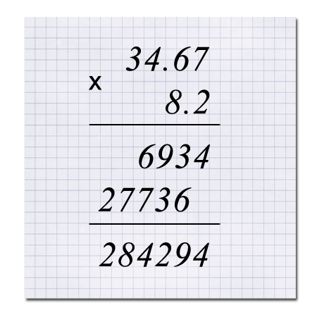

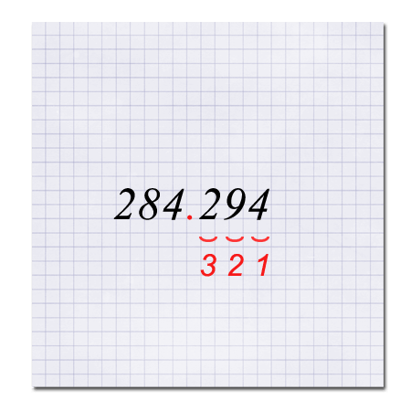

**What about division?**

**We can divide decimals too. When we divide decimals, we have to pay attention to the decimal point.** Let’s look at an example.

Example

_Divide: $253.26 \div 4.5$_

We can divide decimals like we divide whole numbers. First, move the decimal point so that the divisor, 4.5, is a whole number. Then move the decimal point in the dividend, 253.36, the same number of places and write out the problem in long division. Notice that the first number is the dividend. **The** **_dividend_** **is the number being divided** so it goes into our division box. The other number is the divisor. **The** **_divisor_** **is the number doing the dividing.**

$\overset{\ \underline{\;\;\;\;\;\;\;\;\;\;\;\;\;\;\;\;}}{45 \Big ) 2532.6}$

Now ignore the decimal point and divide as you would divide whole numbers. Then place the decimal point in the quotient directly above the decimal point in the dividend.

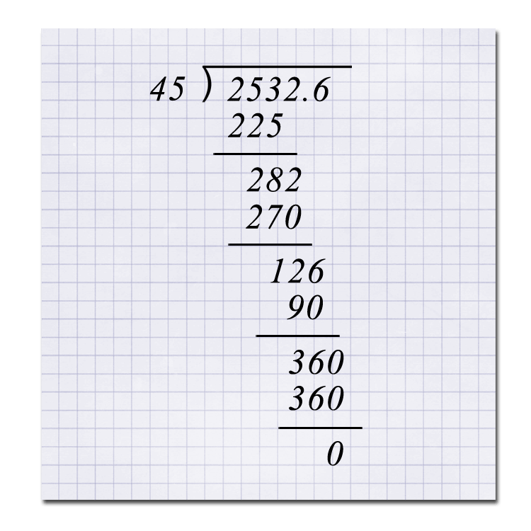

**The answer is 56.28.**

**You have probably worked on multiplying and dividing decimals in past math classes. However, it is always a skill worth practicing because of how many times you will work with decimals in real-life. We can also estimate products and quotients of decimals.**

II. **Estimate Decimal Products and Quotients using Leading Digits**

To estimate products and quotients with decimals, you need to first round the numbers so that they are easier to work with. To round to the nearest whole number, look at the digit in the tenths place. If it is less than 5, round down. If it is 5 or greater, round up.

**Remember that an** **_estimate_** **is an answer that is not exact, but is approximate and reasonable.**

Let’s look at an example.

Example

_Estimate the product: $11.256 \times 6.81$_

First, we round the first number. Since there is a 2 in the tenths place, 11.256 rounds down to 11.

Now round the second number. Since there is an 8 in the tenths place, 6.81 rounds up to 7.

Now multiply the rounded numbers.

$11 \times 7 = 77$

**A good estimate for the product is 77.**

Example

_Estimate the quotient: $91.93 \div 4.39$_

First we round the first number. Since there is a 9 in the tenths place, 91.93 rounds up to 92.

Now round the second number. Since there is a 3 in the tenths place, 4.39 rounds down to 4.

Now divide the rounded numbers.

$92 \div 4=23$

**A good estimate for the quotient is 23.**

**Did you notice which numbers we multiplied? We multiplied the whole digits or the digits that were leading the entire number. We did the same thing when we divided.**

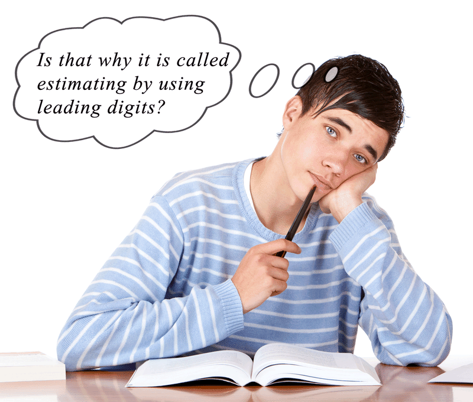

Now let’s see how the properties of multiplication and division can help us when working with decimals.

III. **Identify and Apply the Properties of Multiplication and Division in Decimal Operations, using Numerical and Variable Expressions**

To work with multiplication and division of decimals, we are going to use a few properties that you are probably already familiar with. Here are the properties.

**_Associative Property of Multiplication_**

**The grouping of numbers does not affect the product: $4.5\times(2.1\times9.6)=(4.5\times2.1)\times9.6$**

**_Commutative Property of Multiplication_**

**The order of numbers does not change the product: $6.3 \times 8.7=8.7 \times 6.3$**

**_Distributive Property_**

**The product of a number and a sum is equal to the sum of the individual products of addends and the number: $3.2(1.5+8.9)=(3.2 \cdot 1.5)+(3.2 \cdot 8.9)$**

The first thing that we can look at is identifying these properties in some examples. Notice how the property is applied.

Example

_Which of the following shows the Commutative Property?_

a. $y+7.2=7.2y$

b. $y \div 7.2=7.2\div y$

c. $y \times 7.2=7.2 \times y$

Consider choice a.

This equation states that a number added to 7.2 is equal to that number multiplied by 7.2. This is not correct.

Consider choice b.

This equation states that the quotient of a number and 7.2 is equal to the quotient of 7.2 and a number. This is not correct.

Consider choice c.

This equation states that the product of a number and 7.2 is equal to the product of 7.2 and a number. The Commutative Property states that the order of numbers does not change the product, so this is the correct equation.

**The answer is choice c.**

**You can use the properties of multiplication and division to simplify numerical expressions.**

Example

$5(2\cdot 3)\cdot9$

First, notice that we can use the order of operations here. We find the product of the terms inside the parentheses.

$$
\begin{align*}
& 2 \times 3 = 6\\
& 5(6) \cdot 9\\
& 30 \cdot 9
\end{align*}
$$

**The answer is 270.**

Now you could have also worked with this example by changing the grouping through the associative property. Take a look.

$$
(5 \cdot 2)\cdot 9 \cdot3
$$

The product would have been $10 \times 27$ which is simple to multiply.

**The product is 270.**

**We can also use properties to simplify variable expressions.**

Example

_Simplify: $2.5(2.1x+4.3y)$_

The addends inside the parentheses cannot be combined because two different variables are being used, so you can use the distributive property to help you simplify the expression.

Apply the distributive property: $2.5(2.1x+4.3y)=(2.5 \times 2.1x)+(2.5 \times 4.3y)$

Then simplify: $(2.5 \times 2.1x)+(2.5 \times 4.3y)=5.25x+10.75y$

**This is our answer.**

IV. **Model and Solve Real – World Problems using Simple Equations Involving Decimal Multiplication and Division**

Think of all of the places where decimals appear in the real-world. You will encounter many different situations where you will need to multiply and divide decimals. Let’s look at an example.

_Avi bought five new telephones for the school office. They cost $61.35 each. If the price includes tax, about how much did Avi spend? What is the exact amount that Avi spent?_

**Round each decimal to a number that is easy to multiply. Then find the sum.**

5 does not need to be rounded.

61.35 rounds down to 60.

$5 \times 60=300$

**Avi spent about $300. This is our estimate.**

To find the exact amount Avi spent, write a simple equation to represent the problem. Let $x$ represent the total amount Avi spent.

$$
\begin{align*}
x &= 5 \times 61.35\\
&=306.75
\end{align*}
$$

**Avi spent exactly $306.75. This is our exact answer.**

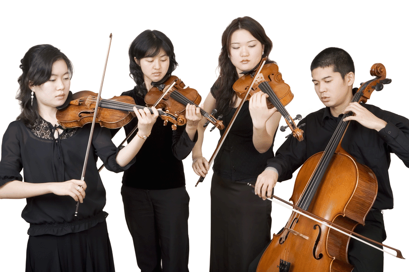

_The City Orchestra received a total of $1,891.50 in donations. This needs to be divided evenly among six different departments. How much will each department receive?_

**Notice that the key word “each” tells us that we are going to need to divide. The money is being split up and that means division.**

Divide to find the amount each department will receive: $1891.5 \div 6 = 315.25$

Each department will receive $315.25.

**Now let’s apply the information from this lesson to the problem in the introduction.**

Real-Life Example Completed
---------------------------

**_Ordering Pencils_**

The students decided to divide up the tasks of ordering. Each pair needed to work on figuring out a reasonable purchase price and quantity for the item that they were assigned. Then keeping the budget in mind the students would present their item, purchase price and quantity purchased to the team.

Mallory and Trevor are working on ordering pencils.

“Wow, there are a lot of different ones to choose from,” Mallory said looking through a catalog of pencils.

“There sure is, but I think that we should go for the number 2 ones with our school name on them. Those are sure to sell,”

Trevor said pointing to a blue and red pencil in the catalog.

“I agree. Now let’s figure out the cost. It says here that we can buy a case of 25 boxes of pencils and each box has 144 pencils in it for $196.08. That seems like a good deal.”

“Yes, but we are going to need to order two cases so that we are sure that we have enough,” Trevor said as he began multiplying. “Why don’t you work on figuring out the cost per box if we order 25 for $196.08?”

“Okay, you do the other part,” Mallory said as she began her division problem.

**_Solution to Real – Life Example_**

**Now let’s look at the solution to this problem.**

**We can start with Trevor. Trevor needed to find a product. To estimate, he could round the cost of the case of pencils. Then he wants to order two cases, so he would multiply this rounded dollar amount by 2.**

**$196.08 rounds to $200.00**

$200 \times 2 = 400$

**The estimate is about $400.00 for two cases.**

**Now let’s look at the actual product.**

$$
\begin{align*}
& \$ 196.08\\
& \underline{\times \;\;\;\;\;\;\; 2}\\
& \$ 392.16
\end{align*}
$$

**You can see that our estimate was reasonable for the actual answer.**

**Next, we can work with Mallory. Mallory needed to figure out the price per box if there are 25 boxes in a case for $196.08.**

**It makes sense for her to round the dollar amount first to find an estimate.**

**$196.08 rounds to $200.00**

$200 \div 25 = 8$

**Each box costs roughly $8.00.**

**Now let’s find the quotient.**

$196.08 \div 25 = \$ 7.84 \ per \ box$

**You can see that our estimate was reasonable given the quotient.**

Vocabulary
----------

Here are the vocabulary words that are found in this lesson.

__Dividend__

the number being divided in a division problem. It is often the first number in a problem written horizontally.

__Divisor__

the number doing the dividing in a division problem.

__Estimate__

an approximate answer that is reasonable and makes sense for the problem.

__Leading Digits__

the first digits in a decimal-often the whole number part of the decimal.

Time to Practice
----------------

Directions: Estimate each product using rounding.

1.  $2.67 \times 3.10 = \underline{\;\;\;\;\;\;\;\;\;\;}$
2.  $4.15 \times 8.09 = \underline{\;\;\;\;\;\;\;\;\;\;}$
3.  $6.67 \times 7.10 = \underline{\;\;\;\;\;\;\;\;\;\;}$
4.  $8.21 \times 9.87 = \underline{\;\;\;\;\;\;\;\;\;\;}$
5.  $5.86 \times 5.13 = \underline{\;\;\;\;\;\;\;\;\;\;}$
6.  $5.86 \times 5.13 = \underline{\;\;\;\;\;\;\;\;\;\;}$
7.  $6.35 \times 12.01 = \underline{\;\;\;\;\;\;\;\;\;\;}$
8.  $4.13 \times 9.87 = \underline{\;\;\;\;\;\;\;\;\;\;}$
9.  $8.12 \times 9.15 = \underline{\;\;\;\;\;\;\;\;\;\;}$
10. $16.21 \times 9.94 = \underline{\;\;\;\;\;\;\;\;\;\;}$

Directions: Estimate each quotient using rounding.

11. $21.87 \div 2.1 = \underline{\;\;\;\;\;\;\;\;\;\;}$
12. $32.14 \div 8.03 = \underline{\;\;\;\;\;\;\;\;\;\;}$
13. $36.07 \div 8.83 = \underline{\;\;\;\;\;\;\;\;\;\;}$
14. $16.20 \div 7.92 = \underline{\;\;\;\;\;\;\;\;\;\;}$
15. $34.87 \div 5.03 = \underline{\;\;\;\;\;\;\;\;\;\;}$
16. $18.08 \div 3.14 = \underline{\;\;\;\;\;\;\;\;\;\;}$
17. $21.10 \div 3.17 = \underline{\;\;\;\;\;\;\;\;\;\;}$
18. $44.82 \div 8.60 = \underline{\;\;\;\;\;\;\;\;\;\;}$
19. $120.02 \div 58.72 = \underline{\;\;\;\;\;\;\;\;\;\;}$
20. $139.87 \div 69.81 = \underline{\;\;\;\;\;\;\;\;\;\;}$

Directions: Multiply or divide to find each product or quotient.

21. $14.50 \times 2.1 = \underline{\;\;\;\;\;\;\;\;\;\;}$
22. $13.64 \div 2.2 = \underline{\;\;\;\;\;\;\;\;\;\;}$
23. $21.35 \div 6.1 = \underline{\;\;\;\;\;\;\;\;\;\;}$
24. $5.2 \times 6.3 = \underline{\;\;\;\;\;\;\;\;\;\;}$
25. $6.7 \times 4.3 = \underline{\;\;\;\;\;\;\;\;\;\;}$
26. $.437 \times 2.1 = \underline{\;\;\;\;\;\;\;\;\;\;}$
27. $5.42 \times 3.3 = \underline{\;\;\;\;\;\;\;\;\;\;}$
28. $16.26 \div 3 = \underline{\;\;\;\;\;\;\;\;\;\;}$
29. $15.18 \div 2.2 = \underline{\;\;\;\;\;\;\;\;\;\;}$
30. $16.39 \div 2.2 = \underline{\;\;\;\;\;\;\;\;\;\;}$

</article>

### 2.3 Adding and Subtracting Fractions

<article>

Introduction
------------

**_Extras_**

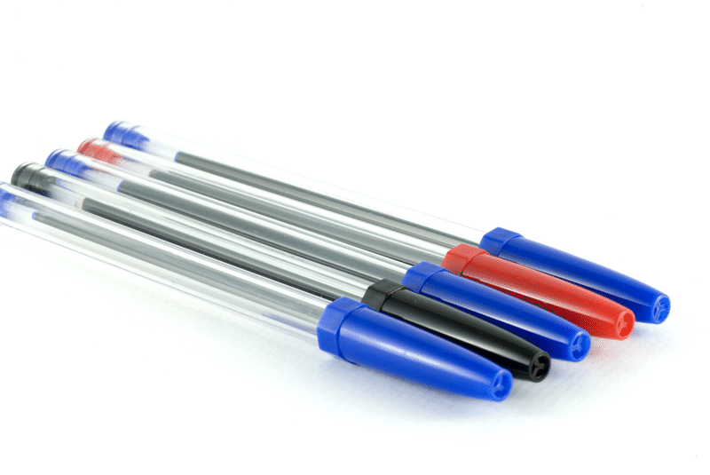

“Look at what?” Kelly asked.

Trevor stopped and put all of the boxes in the middle of the table. He was grinning from ear to ear.

“Look, Mr. Grimes the custodian found all of these boxes of pens in the store room. He said we can have them for free. We have $2 \frac{1}{2}$ boxes of pens here and another $\frac{3}{4}$ of a box,” Trevor said smiling.

“Great work! We also ordered a case of pens and there are 25 boxes in a case. Now we will have a lot of pens,” Kelly said.

“How many do we have altogether?” Mallory asked.

**It is time to learn about fraction addition. Solving this problem will rely on your ability to add fractions. In this lesson, you will learn how to add and subtract fractions. When finished, you will see this problem again so be sure to pay close attention!**

**_What You Will Learn_**

In this lesson you will learn how to complete the following skills.

* Add and subtract fractions and mixed numbers.
* Estimate sums and differences of fractions and mixed numbers.
* Identify and apply the properties of addition and subtraction in fraction operations, using numerical and variable expressions.
* Model and solve real-world problems using simple equations involving fraction addition and subtraction.

**_Teaching Time_**

I. **Add and Subtract Fractions and Mixed Numbers**

By this time in math class you have been working with fractions for a long time. Yet fractions are often a place of struggle for many students. We often think in terms of whole numbers and not in terms of fractions. In this lesson, we will work with adding and subtracting fractions. Let’s start by reviewing some basic information about fractions.

**A** **_fraction_** **is a number that names a part of a whole or a part of a group.** For example, if a rectangle is $\frac{1}{3}$ shaded, it means that if the rectangle were divided into three equal parts, one of those parts would be shaded. Most fractions will represents numbers less than 1, meaning that the numerator is less than the denominator. To represent a number greater than 1, we use an improper fraction or a mixed number. **An** **_improper fraction_** **has a numerator that is larger than its denominator, such as $\frac{5}{3}$.** This fraction can also be written as the mixed number $1 \frac{2}{3}$. **A** **_mixed number_** **is a number that has both wholes and parts, so you will see a whole number and a fraction with mixed numbers.**

Let's take a look at adding and subtracting fractions.

**How do we add and subtract fractions?**

Well, the first thing to look at is the bottom number of the fractions that you are adding or subtracting. **The bottom number or** **_denominator_** **tells you how many parts the whole is divided into.** If the denominator is a three, then we know that the whole is divided into three parts. **The top number or** **_numerator_** **tells you how many parts you have out of the whole.**

**If the denominators of the fractions being added are the same, then the wholes are divided the same way so we can simply add or subtract the numerators.**

Example

$\frac{1}{8}+ \frac{2}{8} = \frac{3}{8}$

Here you can see that both fractions have denominators of 8, so we can simply add the numerators.

**Our answer is three-eighths.**

Example

$\frac{10}{12}- \frac{3}{12} = \frac{7}{12}$

Once again our denominators are common. So we can simply subtract the numerators.

**Our answer is seven-twelfths.**

**What if the denominators are not the same?**

In this case, we have to find a common denominator and rename the fractions in terms of this common denominator. A way to think about this is as equal fractions. Look at the fractions below.

$$
\frac{1}{2}=\frac{4}{8}
$$

These two fractions are equal. This means that they both represent the same part of the whole. The fraction one-half has simply been renamed in terms of eighths. This is the same thing that we do when finding common denominators. We rename the fractions in terms of the common denominator.

Let’s look at an example.

Example

_Add: $\frac{1}{4}+\frac{2}{5}$_

**First, find a common denominator by finding the least common multiple of the denominators, 4 and 5.**

The first few multiples of 4 are 4, 8, 12, 16, 20. The first few multiples of 5 are 5, 10, 15, 20. So the least common multiple is 20.

**Now, find how to rename each fraction to a fraction with 20 as the denominator.**

For the first fraction, you need to multiply the denominator by 5 to get a denominator of 20. So, multiply the first fraction by the equivalent of 1, $\frac{5}{5}$.

$\frac{1}{4} \times \frac{5}{5} = \frac{5}{20}$

**Now do the same for the other fraction.**

You need to multiply the denominator by 4 to get a denominator of 20. So, multiply the second fraction by the equivalent of 1, $\frac{4}{4}$.

$\frac{2}{5} \times \frac{4}{4}=\frac{8}{20}$

**Next, add the fractions.**

$\frac{5}{20} \times \frac{8}{20}=\frac{13}{20}$

**Our answer is $\frac{13}{20}$.**

**We can also work with mixed numbers and fractions. There is an added step when working with this combination.**

Example

_Subtract: $2\frac{7}{8}-\frac{2}{3}$_

**First change the mixed number to an improper fraction.** To do this, multiply the denominator by the whole number, then add the numerator.

$$
\begin{align*}
8 \times 2+7 & =16+7=23\\
2\frac{7}{8} & = \frac{23}{8}
\end{align*}
$$

**Then find a common denominator.**

The first few multiples of 8 are 8, 16, 24. Since 24 is also divisible by 3, it is the least common multiple.

**Rename each fraction as a fraction with the common denominator.**

$$
\begin{align*}
\frac{23}{8} \times \frac{3}{3} &= \frac{69}{24}\\
\frac{2}{3} \times \frac{8}{8} &= \frac{16}{24}
\end{align*}
$$

**Now find the difference.**

$\frac{69}{24}-\frac{16}{24}=\frac{53}{24}$

Notice that the answer is an improper fraction. We can’t leave it this way.

**Finally, simplify the difference to a mixed number.**

$\frac{53}{24}=2\frac{5}{24}$

**This is our answer.**

II. **Estimate Sums and Differences of Fractions and Mixed Numbers**

When you estimate fraction sums and differences you will need to work with rounding fractions. You can work with rounding fractions in a couple of different ways. One way is to look at the relationship between the fraction and a whole.

**Here are some guiding questions:**

1.  **Is this fraction close to one-half or one-whole?**
2.  **If I simplify the fractions that I am adding or subtracting, will they have a common denominator?**
3.  **Is this fraction so close to one-whole that it would make sense to round up to a whole?**

Now let’s look at an example.

Example

_Estimate the sum: $\frac{4}{25}+\frac{11}{20}$_

The first fraction is close to $\frac{5}{25}$, or $\frac{1}{5}$.

The second fraction is close to $\frac{12}{20}$, or $\frac{3}{5}$.

Now you can easily add the rounded fractions.

$\frac{1}{5}+\frac{3}{5}=\frac{4}{5}$

**A good estimate for the sum is $\frac{4}{5}$.**

With this example, it made sense to round the fractions so that we could simplify them. The simplified fractions had a common denominator. This makes our work easier.

Example

_Estimate the difference: $\frac{24}{49}-\frac{7}{31}$_

This first fraction is about $\frac{1}{2}$.

The second fraction is about $\frac{1}{4}$.

$\frac{1}{2}-\frac{1}{4}=\frac{2}{4}-\frac{1}{4}=\frac{1}{4}$

**A good estimate for the difference is $\frac{1}{4}$.**

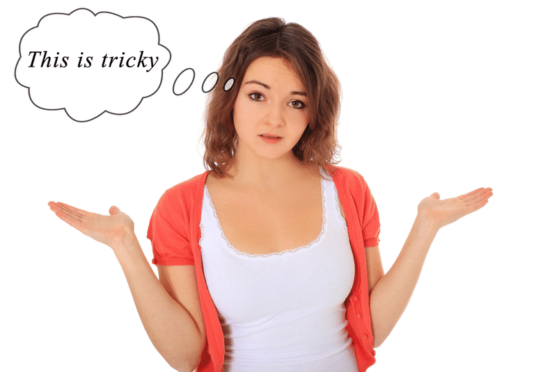

III. **Identify and Apply the Properties of Addition and Subtraction in Fraction Operations, using Numerical and Variable Expressions**

Now that we are working with fractions, you will have a chance to investigate how the different properties of addition and subtraction can help us when we work with fractions in expressions.

You have already learned the Commutative Property and the Associative Property. You should also be familiar with the following properties of addition and subtraction. Let’s review them for just a minute.

**_Additive Identity Property_**

**The sum of any number and zero is that number: $\frac{3}{11}+0=\frac{3}{11}$**

**_Additive Inverse Property_**

**The sum of any number and its inverse is zero: $\frac{3}{4}+ \left( - \frac{3}{4}\right)=0$**

Example

_Which of the following shows the Additive Inverse Property?_

a. $\frac{x}{y}+0=0$

b. $\frac{x}{y}+0=\frac{x}{y}$

c. $\frac{x}{y}+\left(-\frac{x}{y}\right)=0$

Consider choice a.

This equation states that a number added to zero is equal to zero. This is not necessarily correct, unless $\frac{x}{y}$ is also equal to zero.

Consider choice b.

This equation states that the sum of a number and zero is equal to that number. This is correct, but illustrates the additive identity, not the additive inverse property.

**Consider choice c.**

**This equation states that the sum of a number and its inverse is equal to zero. This illustrates the additive inverse property, so this is the correct equation.**

**We can also use these properties to help us when we simplify a numerical expression. Remember that a numerical expression is a group of numbers and operations. Because we are working with fractions, the numerical expressions in this section will be made up of fractions.** Let’s look at an example.

Example

_Simplify: $\frac{1}{8}+\left(\frac{1}{4}+\frac{3}{8}\right)$_

**You can use addition properties to reorganize this expression to make it easier to simplify.**

First apply the commutative property: $\frac{1}{8}+\left(\frac{1}{4} + \frac{3}{8}\right)=\frac{1}{8}+\left(\frac{3}{8}+\frac{1}{4}\right)$

Then apply the associate property: $\frac{1}{8}+\left(\frac{3}{8} + \frac{1}{4}\right)=\left ( \frac{1}{8}+\frac{3}{8}\right)+\frac{1}{4}$

Now you can easily simplify to find the sum.

$\left(\frac{1}{8}+\frac{3}{8}\right)+\frac{1}{4}=\frac{4}{8}+\frac{1}{4}=\frac{2}{4}+\frac{1}{4}=\frac{3}{4}$

**The answer is $\frac{3}{4}$.**

**Using properties to reorganize fractions can help us to work with these fractions. Notice that we reorganized the common denominators together and this simplified our work.**

IV. **Model and Solve Real – World Problems using Simple Equations Involving Fraction Addition and Subtraction**

Fractions, like decimals, show up in everyday life all the time. We can use fractions to solve some of our most basic problems. If you have ever cooked using a recipe, then you probably have used fractions. Often the measurements of tile or carpeting will require some work with fractions. The more that you can become comfortable with adding and subtracting fractions; the easier it will be to solve many of these problems.

Let’s look at an example.

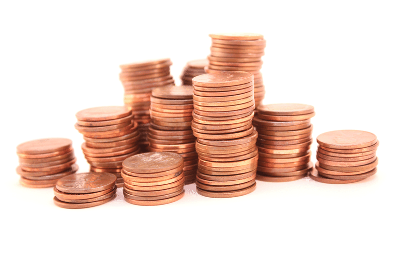

_Harriet and Matt have two identical jars. Harriet’s jar is $\frac{3}{10}$ full of pennies. Matt’s jar is $\frac{1}{4}$ full of pennies. If Matt and Harriet combine their pennies into one jar, how full will the jar be?_

To find the how full the jar will be, write a simple equation to represent the problem. Let $x$ represent the amount of the jar that has been filled.

$$
\begin{align*}
x &= \frac{3}{10}+\frac{1}{4}\\
&=\left(\frac{3}{10} \cdot \frac{2}{2}\right)+\left(\frac{1}{4}\cdot\frac{5}{5}\right)\\
&=\frac{6}{20}+\frac{5}{20}\\
&=\frac{11}{20}
\end{align*}
$$

**The jar will be $\frac{11}{20}$ full. Now let’s think about this logically. What information does this fraction tell you? Well, we can think in terms of halves or wholes. Since 10 is half of 20, we can say that this jar is a little more than half full.**

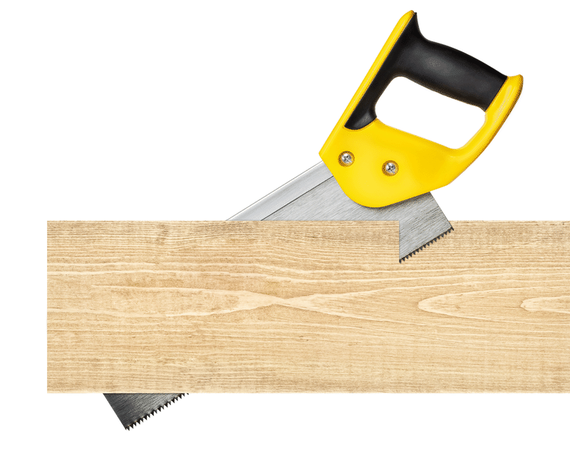

_Jill had a piece of wood 4 feet long. She cut of a piece that was $2 \frac{5}{8}$ feet long. How long was the piece of wood she had left?_

First convert the mixed number to an improper fraction: $2 \frac{5}{8}=\frac{16+5}{8}=\frac{21}{8}$

Then convert the first number to a fraction with a denominator of 8: $4 = \frac{4}{1} \times \frac{8}{8}=\frac{32}{8}$

Subtract to find the length of the piece of wood.

$\frac{32}{8}-\frac{21}{8}=\frac{11}{8}=1 \frac{3}{8}$

**The piece of wood is $1 \frac{3}{8}$ feet long.**

Real-Life Example Completed
---------------------------

**_Extras_**

**Here is the problem from the introduction. Reread it and then solve the problem. You will need to find one sum to complete this problem.**

“Look at this,” Trevor exclaimed rushing into student council meeting one afternoon. In his arms he held several boxes.

“Look at what?” Kelly asked.

Trevor stopped and put all of the boxes in the middle of the table. He was grinning from ear to ear.

“Look, Mr. Grimes the custodian found all of these boxes of pens in the store room. He said we can have them for free. We have $2 \frac{1}{2}$ boxes of pens here and another $\frac{3}{4}$ of a box,” Trevor said smiling.

“Great work! We also ordered a case of pens and there are 25 boxes in a case. Now we will have a lot of pens,” Kelly said.

“How many do we have altogether?” Mallory asked.

**_Solution to Real – Life Problem_**

**To solve this problem, we need to find a sum. A sum means addition, so we are going to figure out how many boxes of pens the student council has in all.**

**First, let’s find the sum of the extras.**

**The students were given $2 \frac{1}{2}$ boxes of pens and another $\frac{3}{4}$ of a box.**

$2 \frac{1}{2} + \frac{3}{4}$

**You might be able to complete this math in your head or you might need to do it out the long way.**

**For the long way, we rename each fraction. First, we make the mixed number into an improper fraction.**

$$
\frac{5}{2}+\frac{3}{4}
$$

**Next, we rename these in terms of fourths since four is the least common denominator.**

$\frac{10}{4}+\frac{3}{4} = \frac{13}{4} =3 \frac{1}{4}$

**Now we can take the sum of the extras and add it to the number of boxes in a case. Be careful that you don’t add it to the number of cases. We are talking about boxes here.**

**There are 25 boxes in 1 case.**

**The students will have a sum of $28 \frac{1}{4}$ boxes of pens.**

Vocabulary
----------

Here are the vocabulary words that are found in this lesson.

__Fraction__

represents a part of a whole.

__Improper fraction__

a fraction where the numerator is greater than the denominator. It means that we have more than one whole represented.

__Mixed Number__

a whole number and a fraction written together.

__Denominator__

the bottom number in a fraction tells you how many parts the whole has been divided into.

__Numerator__

the top number in a fraction. It tells you how many parts you have out of the whole.

__Additive Identity Property__

any number plus zero is still that number.

__Additive Inverse Property__

any number plus it’s opposite or inverse is equal to 0.

Time to Practice
----------------

Directions: Add or subtract the following fractions. Be sure that your answer is in simplest form.

1.  $\frac{3}{6}+\frac{1}{6}=\underline{\;\;\;\;\;\;\;\;\;\;}$
2.  $\frac{2}{5}+\frac{1}{5}=\underline{\;\;\;\;\;\;\;\;\;\;}$
3.  $\frac{6}{10}+\frac{1}{10}=\underline{\;\;\;\;\;\;\;\;\;\;}$
4.  $\frac{8}{12}+\frac{2}{12}=\underline{\;\;\;\;\;\;\;\;\;\;}$
5.  $\frac{9}{16}+\frac{1}{16}=\underline{\;\;\;\;\;\;\;\;\;\;}$
6.  $\frac{10}{20}+\frac{3}{20}=\underline{\;\;\;\;\;\;\;\;\;\;}$
7.  $\frac{18}{20}-\frac{3}{20}=\underline{\;\;\;\;\;\;\;\;\;\;}$
8.  $\frac{20}{21}-\frac{13}{21}=\underline{\;\;\;\;\;\;\;\;\;\;}$
9.  $\frac{16}{18}-\frac{10}{18} =\underline{\;\;\;\;\;\;\;\;\;\;}$
10. $\frac{24}{25}-\frac{9}{25}=\underline{\;\;\;\;\;\;\;\;\;\;}$
11. $\frac{18}{36}-\frac{2}{36}=\underline{\;\;\;\;\;\;\;\;\;\;}$
12. $\frac{28}{30}-\frac{10}{30}=\underline{\;\;\;\;\;\;\;\;\;\;}$

Directions: Add or subtract the following mixed numbers and fractions. Be sure that your answer is in simplest form.

13. $2\frac{1}{2}+3=\underline{\;\;\;\;\;\;\;\;\;\;}$
14. $6\frac{4}{5}-\frac{1}{5}=\underline{\;\;\;\;\;\;\;\;\;\;}$
15. $8\frac{1}{2}+\frac{1}{3}=\underline{\;\;\;\;\;\;\;\;\;\;}$
16. $9\frac{4}{5}-2\frac{1}{5}=\underline{\;\;\;\;\;\;\;\;\;\;}$
17. $6\frac{4}{9}-4\frac{1}{9}=\underline{\;\;\;\;\;\;\;\;\;\;}$
18. $5\frac{1}{2}+2\frac{1}{4}=\underline{\;\;\;\;\;\;\;\;\;\;}$
19. $8\frac{4}{6}+2\frac{2}{6}=\underline{\;\;\;\;\;\;\;\;\;\;}$
20. $12\frac{5}{8}-2\frac{1}{8}=\underline{\;\;\;\;\;\;\;\;\;\;}$

Directions: Add or subtract the following fractions with unlike denominators. Be sure that your answer is in simplest form.

21. $\frac{4}{5}+\frac{1}{2}=\underline{\;\;\;\;\;\;\;\;\;\;}$
22. $\frac{6}{8}+\frac{1}{4}=\underline{\;\;\;\;\;\;\;\;\;\;}$
23. $\frac{1}{3}+\frac{4}{9}=\underline{\;\;\;\;\;\;\;\;\;\;}$
24. $\frac{8}{9}-\frac{2}{3}=\underline{\;\;\;\;\;\;\;\;\;\;}$
25. $\frac{10}{12}-\frac{1}{2}=\underline{\;\;\;\;\;\;\;\;\;\;}$
26. $\frac{8}{10}-\frac{3}{4}=\underline{\;\;\;\;\;\;\;\;\;\;}$
27. $\frac{9}{11}-\frac{2}{11}=\underline{\;\;\;\;\;\;\;\;\;\;}$
28. $\frac{4}{6}+\frac{5}{8}=\underline{\;\;\;\;\;\;\;\;\;\;}$
29. $\frac{8}{10}+\frac{1}{3}=\underline{\;\;\;\;\;\;\;\;\;\;}$
30. $\frac{1}{2}+\frac{2}{5}=\underline{\;\;\;\;\;\;\;\;\;\;}$

</article>

### 2.4 Multiplying and Dividing Fractions

<article>

Introduction
------------

**_Opening Day Cookies_**

The students have ordered their supplies and on Monday they will have the grand opening of the school store. To attract students, they have decided to bake cookies in celebration of the grand opening day. Each student has decided to bake 5 batches of cookies. There are 24 cookies in a batch. So each student will be bringing 120 cookies in on Monday.

At his house, Trevor is actively working on baking his cookies. The problem is that he has found that he has only $6 \frac{1}{2}$ cups of flour. Each batch of cookies needs $1 \frac{1}{2}$ cups. Based on these numbers, Trevor will need to figure out how many batches he will need for the cookies.

Then, he will need to figure out how many cookies he will have baked with these supplies.

Trevor begins with some division.

**Do you know why he is dividing? Division is a way of splitting things up. Trevor needs to split up the flour. To accomplish this task, you will need to understand how to divide and multiply fractions and mixed numbers. Pay close attention and you will know how to solve this problem at the end of the lesson.**

**_What You Will Learn_**

In this lesson, you will learn how to use the following skills.

* Multiply and divide fractions and mixed numbers
* Estimate products and quotients of fractions and mixed numbers.
* Identify and apply the properties of multiplication and division in fraction operations, using numerical and variable expressions.
* Model and solve real-world problems using simple equations involving fraction multiplication and division.

**_Teaching Time_**

I. **Multiply and Divide Fractions and Mixed Numbers**

**In the last lesson, you learned how to add and subtract fractions and mixed numbers. The two operations that we worked with were addition and subtraction. In this lesson, we will work with fractions again, but this time we will work with the operations of multiplication and division.**

**Multiplying and dividing fractions is a lot less work then adding and subtracting them.**

To multiply two fractions, simply multiply the numerators to get the numerator of the product, and multiply the denominators to get the denominator of the product.

To divide two fractions, you first need to find the reciprocal of the divisor. That means that you need to flip the second fraction upside down. Then multiply the numerators and multiply the denominators.

**_Write these notes in your notebook._**

Let’s look at an example.

Example

_Multiply: $\frac{2}{7} \times \frac{3}{5}$_

Multiply the numerators and multiply the denominators.

$\frac{2}{7}\times\frac{3}{5}=\frac{2\times3}{7\times5}=\frac{6}{35}$

Example

$\frac{2}{3}\times\frac{4}{6}$

Multiply the numerators and the denominators.

$\frac{2}{3}\times\frac{4}{6}=\frac{8}{18}$

Now we need to simplify the product.

**That’s alright. We can review it here.**

When we simplify a fraction, we rewrite it as an equal fraction that is smaller than the fraction we have as our answer. We look for the **_greatest common factor_** that will divide into both the numerator and the denominator. **The** **_greatest common factor_** **is the largest number that will divide into both the numerator and the denominator.** This is how we will rewrite the fraction in simplest form.

**The greatest common factor of 8 and 18 is 2. We divide both the numerator and denominator by 2.**

$\frac{8}{18}=\frac{8\div2}{18\div2}=\frac{4}{9}$

**This is our answer.**

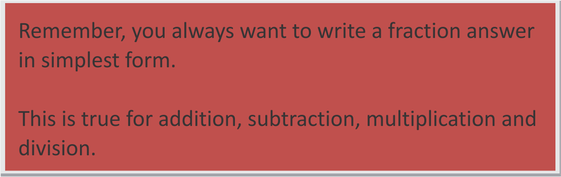

**Here’s one for practice.**

Example

_Simplify $\frac{9}{12}$_

First, we find the greatest common factor of 9 and 12. This is a number that will divide evenly into both the numerator and the denominator.

The greatest common factor of 9 and 12 is 3.

We divide the numerator and the denominator by 3.

$\frac{9}{12}=\frac{9\div3}{12\div3}=\frac{3}{4}$

**This is the answer.**

**Some of you may be able to simplify fractions in your head. That is terrific! If you can’t, then you can always figure them out the long way.**

**Now let’s look at dividing fractions.**

Example

_Divide: $4\frac{3}{10}\div \frac{1}{2}$_

**Wow! This one has a mixed number and a fraction. Don’t let that throw you! You can work with mixed numbers quite easily. Just remember to convert them to improper fractions first.**

First change the mixed number to an improper fraction.

$4\frac{3}{10}=\frac{4\times10+3}{10}=\frac{43}{10}$

Then flip the second fraction and multiply.

$\frac{43}{10}\div\frac{1}{2}=\frac{43}{10}\times\frac{2}{1}=\frac{86}{10}$

Finally, simplify the fraction.

$\frac{86}{10}=8\frac{6}{10}=8\frac{3}{5}$

**This is our answer.**

**Now let’s look at estimating products and quotients of fractions.**

II. **Estimate Products and Quotients of Fractions and Mixed Numbers**

**_Estimation_** is a useful strategy to use to check that your computation is reasonable. It is also a way to find an approximate answer to a solution. To estimate products and quotients of mixed numbers, round the fractions to the nearest whole number. If the fraction is less than $\frac{1}{2}$, round down. If the fraction is greater than $\frac{1}{2}$, round up.

Example

_Estimate the product: $8 \frac{4}{11} \times 7\frac{11}{12}$_

Round the first number.

Since $\frac{4}{11}$ is less than $\frac{1}{2},8\frac{4}{11}$ rounds down to 8.

Round the second number.

Since $\frac{11}{12}$ is greater than $\frac{1}{2},7\frac{11}{12}$ rounds up to 8.

Now multiply to find the estimated product.

$8\times8=64$

**A reasonable estimate is 64.**

Example

_Estimate the quotient: $22\frac{3}{10}\div 6\frac{9}{13}$_

Round the first number.

Since $\frac{3}{10}$ is less than $\frac{1}{2},22\frac{3}{10}$ rounds down to 22.

Round the second number.

Since $\frac{9}{13}$ is greater than $\frac{1}{2},6\frac{9}{13}$rounds up to 7.

Now divide to find the estimated product. Since 22 is not divisible by 7, round it down to 21 to make compatible numbers that are easier to divide.

$21\div 7=3$

**A good estimate for the quotient is 3.**

**Notice that you have to use some common sense and thinking to figure out that you had to round 22 down to 21 to find a good estimate. This is another example where thinking about how reasonable an answer is will help you in the long run.**

III. **Identify and Apply the Properties of Multiplication and Division in Fraction Operations, using Numerical and Variable Expressions**

Now let’s look at how the properties of multiplication and division can help us when working with fractions. You have already learned the Commutative Property, the Associative Property, and the Distributive Property. You should be familiar with the following properties of multiplication and division.

**_Multiplicative Identity_**

**The product of any number and one is that number: $\frac{3}{11}\times 1=\frac{3}{11}$**

**_Zero Property_**

**The product of any number and zero is zero: $\frac{4}{7}\times 0=0$**

**_Multiplicative Inverse_**

**The product of any number and its reciprocal is one: $\frac{3}{4}\times\frac{4}{3}=1$**

Example

_Which of the following shows the Multiplicative Inverse Property?_

a. $\frac{x}{y}\times 0=\frac{x}{y}$

b. $\frac{x}{y}\times \frac{y}{x}=0$

c. $\frac{x}{y}\times \frac{y}{x}=1$

Consider choice a.

This equation states that the product of a number and zero is equal to that number. This is not correct.

Consider choice b.

This equation states that the product of a number and its reciprocal is equal to zero. This is not correct.

**Consider choice c.**

**This equation states that the product of a number and its reciprocal is equal to one. This illustrates the multiplicative inverse property, so this is the correct equation.**

**Take a few minutes to write these properties down in your notebooks. Be sure to include an example of each.**

**You can also use properties to help you simplify numerical expressions.**

Example

_Simplify: $\frac{2}{3}\times\left(\frac{2}{7}\times\frac{3}{2}\right)$_

You can use multiplication properties to reorganize this expression to make it easier to simplify.

First apply the commutative property: $\frac{2}{3}\times\left(\frac{2}{7}\times\frac{3}{2}\right)=\frac{2}{3} \times \left(\frac{3}{2} \times \frac{2}{7}\right)$

Then apply the associate property: $\frac{2}{3}\times\left(\frac{3}{2}\times\frac{2}{7}\right)=\left(\frac{2}{3} \times \frac{3}{2}\right) \times \frac{2}{7}$

Then apply the multiplicative inverse property: $\left(\frac{2}{3}\times\frac{3}{2}\right)\times\frac{2}{7}=1\times\frac{2}{7}$

Finally, apply the multiplicative identity property: $1 \times \frac{2}{7}=\frac{2}{7}$

**This is our answer.**

**We could also use properties when working with a variable.** Look at the above example with a variable included.

Example

$\frac{2}{3}\times\left(a \times \frac{3}{2}\right)$

First, we can apply the commutative property: $\frac{2}{3} \times \frac{3}{2} \times a$

Now we apply the multiplication inverse property: $\frac{2}{3} \times \frac{3}{2} =1$

Our simplified expression is $a$.

If we had a value substituted in for $a$, then that would be our answer.

IV. **Model and Solve Real – World Problems Using Simple Equations Involving Fraction Multiplication and Division**

You will often need to divide and multiply fractions in real-world situations. You will see these problems often when you are working with quantities as in large recipes. Let’s look at a few examples and see how we can work with multiplying and dividing fractions within this real-world context.

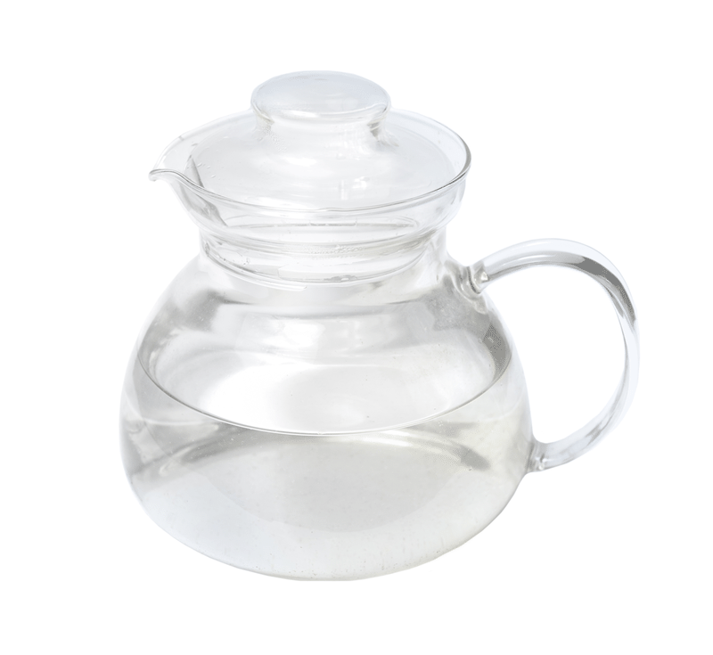

Example

_A certain jar holds $2 \frac{1}{2}$ cups of liquid. There is $\frac{1}{3}$ cup of water in the jar. What fraction of the jar is filled?_

To find what fraction of the jar is filled, write a simple equation to represent the problem. Let $x$ represent the fraction of the jar that is filled.

$$
\begin{align*}
\frac{1}{3}&=2\frac{1}{2} \cdot x\\
\frac{1}{3}&=\frac{5}{2}\cdot x\\
\frac{1}{3}\cdot\frac{2}{5}&=\frac{2}{5}\cdot\frac{5}{2}\cdot x\\
\frac{2}{15}&=x
\end{align*}
$$

The jar is $\frac{2}{15}$ full. Now if we think about this logically you could say that a very small part of this jar has been filled.

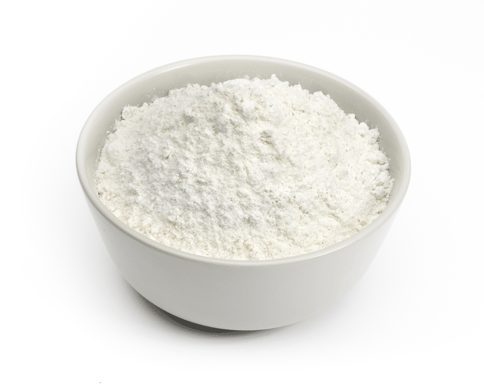

Example

_Adin has a recipe that calls for $3\frac{1}{4}$ cups of flour. He wants to divide the recipe by 3, since it is too large. How much flour should Adin use?_

Write an expression to find the amount of flour Adin should use: $3\frac{1}{4} \div 3$

Simplify the expression to find the answer.

$3\frac{1}{2} \div 3=\frac{7}{2}\div \frac{3}{1}=\frac{7}{2} \times \frac{1}{3}=\frac{7}{6}=1\frac{1}{6}$

**Adin should use $1 \frac{1}{6}$ cups of flour.**

**Now let’s apply what we have learned to the problem from the introduction.**

Real-Life Example Completed
---------------------------

**_Opening Day Cookies_**

**Here is the original problem about the cookies. Now that you have learned how to multiply and divide fractions and mixed numbers, you can put your knowledge to the test. You will need to find three different answers here. First, you will need to complete the division to figure out how many batches of cookies Trevor can bake given the flour he has. Next, you will need to find out how many cookies he will bake given the number of batches. Will he be able to bake 5 batches? Why or why not?**

The students have ordered their supplies and on Monday they will have the grand opening of the school store. To attract students, they have decided to bake cookies in celebration of the grand opening day. Each student has decided to bake 5 batches of cookies. There are 24 cookies in a batch. So each student will be bringing 120 cookies in on Monday.

At his house, Trevor is actively working on baking his cookies. The problem is that he has found that he has only $6 \frac{1}{2}$ cups of flour. Each batch of cookies needs $1 \frac{1}{2}$ cups. Based on these numbers, Trevor will need to figure out how many batches he will need for the cookies.

Then, he will need to figure out how many cookies he will have baked with these supplies.

Trevor begins with some division.

**_Complete the solutions to this problem in your notebook. Remember that you will need to find three different answers for your solution to be complete._**

**_Solution to Real – Life Problem_**

**Remember, there are three parts to this problem.**

**First, we need to figure out how many batches of cookies Trevor can make with amount of flour. We begin with division.**

$6 \frac{1}{2}\div 1 \frac{1}{2}= \frac{13}{2} \div \frac{3}{2} =\frac{13}{2}\times \frac{2}{3} = \frac{13}{3} = 4 \frac{1}{3}$

**There are 24 cookies in a batch. Let’s multiply the number of batches times the number of cookies per batch.**

$$
4 \frac{1}{3} \times 24= \frac{13}{3} \times \frac{24}{1}=104 \ cookies
$$

**Trevor is short $\frac{2}{3}$ of a batch of cookies. Because of this, he will need to bake another batch of cookies. This way he will have a total of 129 cookies.**

There will be 9 cookies for Trevor to each with his family.

Vocabulary
----------

Here are the vocabulary words that are found in this lesson.

__Greatest Common Factor__

a number that will divide evenly into both the numerator and the denominator of a fraction.

__Product__

the answer in a multiplication problem.

__Quotient__

the answer in a division problem.

__Fraction__

a part of a whole

__Mixed Number__

a number with a whole number and a fraction.

__Improper Fraction__

a number that is greater than a whole with a larger top number and a smaller bottom number.

__Estimation__

a reasonable answer

__Multiplicative Identity__

any number times 1 is the same number.

__Zero Property__

any number times 0 is zero.

__Multiplicative Inverse__

any number times it’s reciprocal is 1.

Time to Practice
----------------

Directions: Multiply the following fractions. Be sure to simplify your answer when necessary.

1.  $\frac{1}{2} \times \frac{3}{4} =\underline{\;\;\;\;\;\;\;\;\;\;}$
2.  $\frac{3}{4}\times\frac{5}{6}=\underline{\;\;\;\;\;\;\;\;\;\;}$
3.  $\frac{1}{6}\times\frac{1}{3}=\underline{\;\;\;\;\;\;\;\;\;\;}$
4.  $\frac{5}{6}\times\frac{10}{12}=\underline{\;\;\;\;\;\;\;\;\;\;}$
5.  $\frac{7}{8}\times\frac{1}{3}=\underline{\;\;\;\;\;\;\;\;\;\;}$
6.  $\frac{8}{9}\times\frac{1}{3}=\underline{\;\;\;\;\;\;\;\;\;\;}$
7.  $\frac{10}{11}\times\frac{2}{5}=\underline{\;\;\;\;\;\;\;\;\;\;}$
8.  $\frac{9}{10}\times\frac{4}{6}=\underline{\;\;\;\;\;\;\;\;\;\;}$
9.  $\frac{4}{7}\times\frac{1}{2}=\underline{\;\;\;\;\;\;\;\;\;\;}$
10. $\frac{1}{4}\times\frac{5}{6}=\underline{\;\;\;\;\;\;\;\;\;\;}$

Directions: Divide the following fractions. Be sure to convert any improper fractions to mixed numbers.

11. $\frac{3}{4} \div \frac{1}{2}=\underline{\;\;\;\;\;\;\;\;\;\;}$
12. $\frac{5}{6} \div \frac{1}{3}=\underline{\;\;\;\;\;\;\;\;\;\;}$
13. $\frac{8}{9} \div \frac{1}{2}=\underline{\;\;\;\;\;\;\;\;\;\;}$
14. $\frac{15}{16} \div \frac{1}{2}=\underline{\;\;\;\;\;\;\;\;\;\;}$
15. $\frac{8}{9} \div \frac{1}{3}=\underline{\;\;\;\;\;\;\;\;\;\;}$
16. $\frac{5}{10} \div \frac{1}{2}=\underline{\;\;\;\;\;\;\;\;\;\;}$
17. $\frac{6}{8} \div \frac{3}{4}=\underline{\;\;\;\;\;\;\;\;\;\;}$
18. $\frac{6}{7} \div \frac{1}{2}=\underline{\;\;\;\;\;\;\;\;\;\;}$
19. $\frac{10}{12} \div \frac{1}{3}=\underline{\;\;\;\;\;\;\;\;\;\;}$
20. $\frac{8}{10} \div \frac{1}{4}=\underline{\;\;\;\;\;\;\;\;\;\;}$

Directions: Multiply or Divide the following fractions and mixed numbers. Be sure to write your answer in simplest form.

21. $2\frac{1}{2} \div \frac{1}{3}=\underline{\;\;\;\;\;\;\;\;\;\;}$
22. $5\frac{1}{3} \div \frac{1}{2}=\underline{\;\;\;\;\;\;\;\;\;\;}$
23. $4\frac{1}{6} \div \frac{1}{3}=\underline{\;\;\;\;\;\;\;\;\;\;}$
24. $8\frac{2}{3} \div \frac{1}{2}=\underline{\;\;\;\;\;\;\;\;\;\;}$
25. $8\frac{1}{2} \div \frac{1}{2}=\underline{\;\;\;\;\;\;\;\;\;\;}$
26. $9\frac{1}{4} \div \frac{1}{3}=\underline{\;\;\;\;\;\;\;\;\;\;}$
27. $5\frac{1}{2} \div \frac{1}{4}=\underline{\;\;\;\;\;\;\;\;\;\;}$
28. $6\frac{2}{5} \div \frac{1}{3}=\underline{\;\;\;\;\;\;\;\;\;\;}$

</article>

### 2.5 Adding and Subtracting Integers

<article>

Introduction
------------

**_Three Days of Sales_**

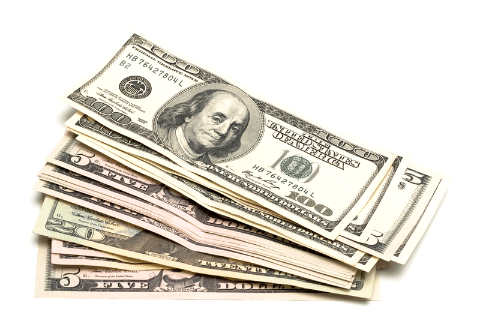

On the second day, Trevor worked in the store. He realized that the school store still owed Mr. Janus $20.00 from the day before and so he took that out of the total sales. Then he sold $45.00 more dollars in supplies to students.

On the third day, Kelly worked in the store and there were three returns for a total of $3.00. Then Kelly sold $25.00 in supplies.

When the students met with Mr. Janus on Wednesday afternoon, here were the numbers that they wrote on the board.

Monday +87.00

Tuesday -20.00

+45.00

Wednesday -3.00

\+ 25.00

The students began to figure out their total earnings for the week.

**This is where adding and subtracting integers can be very useful. In this lesson you will learn how to add and subtract integers. When finished with this lesson, you will know how to figure out the sum of the earnings of the school store.**

**_What You Will Learn_**

In this lesson you will learn to demonstrate the following skills.

* Add and subtract integers.
* Estimate sums and differences of integers.
* Identify and apply the properties of addition and subtraction in integer operations, using numerical and variable expressions.
* Model and solve real-world problems using simple equations involving integer addition and subtraction.

**_Teaching Time_**

I. **Add and Subtract Integers**

In this lesson you will be introduced to a new way of naming numbers. You are already familiar with whole numbers such as 0, 1, 2, 3 and so on. Well, in this lesson you will learn how to work with integers. First, let’s look at defining the term integer.

**What is an integer?**

**_Integers_** **include the set of whole numbers and their opposites: {... -3, -2, -1, 0, 1, 2, 3, ...}.** Notice that as we work with integers we are working with both positive and negative numbers. Sometimes, you will hear people talk about integers as only being negative numbers. The real thing to remember is that integers include the set of whole numbers this includes both positive and negative numbers.

We can work with integers when adding, subtracting, multiplying and dividing. In this lesson, you will learn to add and subtract integers. When working with integers and operations, it’s important to keep track of the sign of the number.

**Let’s look at adding and subtracting integers.**

When we think about adding and subtracting integers, it is helpful to think about money and this will help you to think in terms of losses and gains. We can think of a gain as positive and a loss as negative.

If you have two losses, then you have more loss and that is negative.

If you have two gains, then you have a gain and that is positive.

When you have a loss and then a gain, you will have to look at how much of a loss or how much of a gain is occurring to figure out whether your answer is positive or negative.

**You can think of these statements as some of the basic rules of working with integers. Let’s look at them with numerical examples.**

Example

$-5+ -6= -11$

Here we have a loss of five and another loss of six so we end up with a total loss of 11.

**Our answer is -11.**

Example

$8+22=30$

Here we have a gain of 8 and another gain of 22 so our total gain is 30.

**Our answer is 30.**

**Now let’s look at an example where we have gains and losses together. You will need to think through this example.**

Example

_Add:_ $-623+215$

Here we have a loss of 623 and then a gain of 215. If you think about this logically, the loss is greater than the gain. Therefore the answer will still be negative. We can find the difference between these two values to figure out how much of a loss we still have after a gain of 215.

**The answer is -408.**

Example

_Add:_ $-229+563$

Here we have a loss of 229 and a gain of 563. In this example, the gain is greater than the loss so we know that our answer is going to be positive. We can find the difference between the two values to find out how much of a gain we have.

**The answer is 334.**

**What about subtracting integers?**

When we subtract integers, we take away a loss or a gain. If you can keep thinking in terms of losses and gains then it will be a lot simpler when you work with the negative integers.

Example

_Subtract:_ $-412 - 244$

Here we have a loss of 412 and then we are going to take away a positive 244. If we take a positive 244 from a negative 412, then we will have a negative answer.

You can think of this as an addition problem in disguise.

$-412+(-244)$

A negative number plus a negative number equals a negative number. So, add the two numbers and write a negative sign.

$-412+(-244)=-656$

**The answer is -656.**

Example

$54- -789$

Let’s look at this problem. We start with a gain of 54. Then we are going to take away a loss of 789. If we take a loss away, then we are moving into the positive zone. We can think of this problem in terms of addition.

$54+789$

**Our answer is 843.**

II. **Estimate Sums and Differences of Integers**

We can estimate integer sums and differences by rounding. Rounding integers will make the problem simpler to work with simpler numbers. Make sure you round to the correct place value indicated in the problem.

Example

_Estimate to the nearest thousand:_ $52,426+12,702$

**Round the first number.** Since you are estimating to the nearest thousand, round to the nearest thousand by looking at the number in the hundreds place. Since there is a 4 in the hundreds place, 52,426 rounds down to 52,000.

**Round the second number.** Since there is a 7 in the hundreds place, 12,702 rounds up to 13,000.

Now add the rounded numbers to get an estimate.

$52,000+13,000=65,000$

**A good estimate for the sum is 65,000.**

**We can also round when working with negative integers. Remember about thinking in terms of losses and gains as you add and subtract these values.**

Example

_Estimate by rounding to the nearest hundred:_ $-893+ -769$

First, round each value. Let’s round the first number. To round to the nearest hundred we look at the tens place. We round up to 9.

$$
-900
$$

Now round the second number. We round by looking at the tens place and we round up to 8.

$$
-800
$$

Next, we can add our rounded values.

$$
-900+ -800= -1700
$$

**\-1700 is a reasonable estimate for this sum.**

**Now we can look at properties and how they can assist us when we add and subtract integers.**

III. **Identify and Apply the Properties of Addition and Subtraction in Integer Operations, using Numerical and Variable Expressions**

In the previous lessons, you learned about several addition and subtraction properties: **_the associative property, the commutative property, the additive identity property,_** and **_the additive inverse property._** You can use these properties to simplify integer expressions.

Example

_Simplify the following expression. Justify each step by identifying the property used._

$(-28+63)+28$

**First, think about this problem. It has losses and gains in it.**

Use properties to reorganize the expression.

The commutative property states that numbers can be added in any order and this does not change the sum. When working with negative numbers, keep the negative sign with the number it belongs to. Adding parentheses around the negative number can help you keep things organized.

Apply the commutative property: $(-28+63)+28=(63+(-28))+28$

The associative property states that the grouping of numbers does not change the sum.

Apply the associative property: $(63+(-28))+28=63+(-28+28)$

The additive inverse property states that any number added to its opposite equals zero.

Apply the additive inverse property: $63+(-28+28)=63+0$

The additive identity property states that the sum of any number and zero is that number.

Apply the additive identity property: $63+0=63$

**This is our answer.**

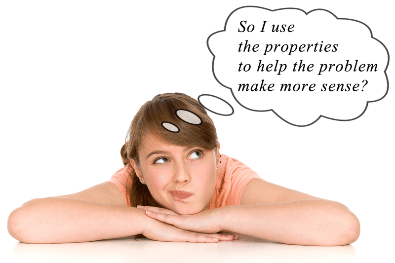

IV. **Model and Solve Real – World Problems Using Simple Equations Involving Integer Addition and Subtraction**

We already mentioned money as a real-life application for working with integers. In fact, losses and gains of any kind make the most sense when we apply integers to the operations. It can help us to keep track of what actually occurred. We will also be able to see whether or not we have a gain or a loss in our sum or in our difference.

Let’s look at an example of a real-life problem using integers.

")

\[Figure 5\]

Example

_Caitlin borrowed $950 to buy a computer. So far, she has paid back $175. How much does Caitlin still owe?_

Think of a debt like a negative number. For example, if you have $10, you have +10. If you give that away, you have 0. If you then owe another $10, you have -10.

To find the amount Caitlin still owes, write a simple equation to represent the problem. Let $x$ represent the amount Caitlin still owes.

$$
\begin{align*}
x &= -950+175\\
&=175-950\\
&=-775
\end{align*}
$$

**Caitlin still owes $775.**

_The population of a certain town in 2002 was 312,980. In 2006, the population increased to 391,740. To the nearest thousand, what was the population increase from 2002 to 2006?_

This is an estimation problem. Round each number to the nearest thousand, and then find the difference.

Round the first number. Since there is a 9 in the hundreds place, 312,980 rounds up to 313,000.

Round the second number. Since there is a 7 in the hundreds place, 391,740 rounds up to 392,000.

Now find the difference.

$392,000-313,000=79,000$

**The population increased by 79,000 people.**

Real-Life Example Completed
---------------------------

**_Three Days of Sales_**

**Here is the problem from the introduction. You are now ready to figure out the total earnings of the school store. Use what you have learned to find the sum. Write an equation, where $x$ is equal to the sum of the sales and show how each value is a loss or a gain by using positive or negative numbers. The equation and the sum are the two parts of your answer.**

The first day that the school store was open, the students had many, many customers. They sold pencils, erasers and pens to sixth, seventh and eighth graders. At the end of the first day, Mallory calculated the total amount of sales and found that the students had raised $87.00. Not bad for a first day.

On the second day, Trevor worked in the store. He realized that the school store still owed Mr. Janus $20.00 from the day before and so he took that out of the total sales. Then he sold $45.00 more dollars in supplies to students.

On the third day, Kelly worked in the store and there were three returns for a total of $3.00. Then Kelly sold $25.00 in supplies.

When the students met with Mr. Janus on Wednesday afternoon, here were the numbers that they wrote on the board.

Monday +87.00

Tuesday -20.00

+45.00

Wednesday -3.00

\+ 25.00

The students began to figure out their total earnings for the week.

**Solution to the Real – Life Example**

**First, we need to write an equation and then we can find a sum.**

**For the equation, we use $x$ as the sum of the earnings. This will include both losses and gains.**

**Now we write in the losses and gains. We use a + for a gain and a – for a loss.**

$$
x=87.00+(-20.00)+45.00+(-3.00)+25.00
$$

**Next we can find the value of $x$.**

$$
x=\$134.00
$$

**Not bad for the first three days of sales.**

Vocabulary
----------

Here are the vocabulary words that are found in this lesson.

__Integer__

the set of whole numbers and their opposites, this includes both positive and negative whole numbers.

__Estimate__

an answer that is reasonable but not exact.

__Associative Property__

states that the groupings of values can change and not affect the sum or difference.

__Commutative Property__

the order of the numbers being added can be changed and not affect the sum or the difference.

__Additive Identity Property__

any number and zero is still that original number.

__Additive Inverse Property__

any number and its opposite is equal to zero.

Time to Practice
----------------

Directions: Add the following integers.

1.  $6 + 7 = \underline{\;\;\;\;\;\;\;\;\;\;}$
2.  $5 + -8 =\underline{\;\;\;\;\;\;\;\;\;\;}$
3.  $8 + -8 =\underline{\;\;\;\;\;\;\;\;\;\;}$
4.  $6 + -10 =\underline{\;\;\;\;\;\;\;\;\;\;}$
5.  $8 + -2 =\underline{\;\;\;\;\;\;\;\;\;\;}$
6.  $9 + -4 =\underline{\;\;\;\;\;\;\;\;\;\;}$
7.  $-14 + -7 =\underline{\;\;\;\;\;\;\;\;\;\;}$
8.  $-12 + -14 =\underline{\;\;\;\;\;\;\;\;\;\;}$
9.  $-13 + -10 =\underline{\;\;\;\;\;\;\;\;\;\;}$
10. $-18 + -30 =\underline{\;\;\;\;\;\;\;\;\;\;}$

Directions: Subtract the following integers.

11. $-9 - 5 = \underline{\;\;\;\;\;\;\;\;\;\;}$
12. $-8 - 7 =\underline{\;\;\;\;\;\;\;\;\;\;}$
13. $-12 - 8 =\underline{\;\;\;\;\;\;\;\;\;\;}$
14. $6 - 9 =\underline{\;\;\;\;\;\;\;\;\;\;}$
15. $10 - 15 = \underline{\;\;\;\;\;\;\;\;\;\;}$
16. $18 - - 5 = \underline{\;\;\;\;\;\;\;\;\;\;}$
17. $12 - - 4 = \underline{\;\;\;\;\;\;\;\;\;\;}$
18. $23 - - 9 = \underline{\;\;\;\;\;\;\;\;\;\;}$
19. $-5 - - 2 = \underline{\;\;\;\;\;\;\;\;\;\;}$
20. $-8 - - 5 = \underline{\;\;\;\;\;\;\;\;\;\;}$

Directions: Find each sum or difference when working with integers.

21. $187 - 221 = \underline{\;\;\;\;\;\;\;\;\;\;}$
22. $456 - 200 = \underline{\;\;\;\;\;\;\;\;\;\;}$
23. $-187 - 134 = \underline{\;\;\;\;\;\;\;\;\;\;}$
24. $-800 - 232 = \underline{\;\;\;\;\;\;\;\;\;\;}$
25. $160 - 437 = \underline{\;\;\;\;\;\;\;\;\;\;}$
26. $-120 - 156 = \underline{\;\;\;\;\;\;\;\;\;\;}$
27. $8 - 567 = \underline{\;\;\;\;\;\;\;\;\;\;}$
28. $438 - 699 = \underline{\;\;\;\;\;\;\;\;\;\;}$

</article>

### 2.6 Multiplying and Dividing Integers

<article>

Introduction
------------

**_The Loan_**

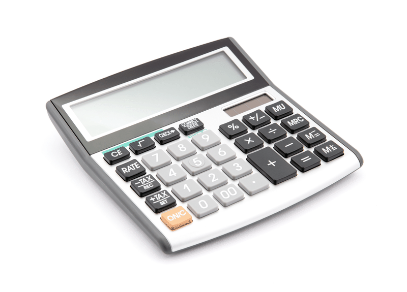

“We really need to buy some calculators,” Mallory said at the Wednesday afternoon meeting. “I have kids asking for them all the time.”

“I agree,” said Trevor. “But we have the big dance coming up and all of our funds are going to towards that, so we don’t really have the money for calculators.”

“But we will sell them, so we can make the money back within a few months,” Kelly said.

“Well, how about a loan?” Mr. Janus asked. “I could loan you $250.00 and you could pay it back over the next four months.”

“You can do that?” Kelly asked.

“Yes, I have some money in the student council account that you may borrow from. How’s that?”

“That is terrific. Now with $250.00 as a loan, we will have four months to pay it back. How much is that per month?” Trevor said taking out a notebook.

**We can think of the loan as a negative number. The students did not have the money for the calculators, so they were loaned the money for the purchase. This problem is asking how much the students will need to pay back each month to repay the loan. To work with this problem, you will need to divide integers. Pay close attention, you will see this problem again.**

**_What You Will Learn_**

In this lesson you will learn how to demonstrate the following skills.

* Multiply and divide integers.
* Estimate products and quotients of integers.
* Identify and apply the properties of multiplication and division in integer operations, using numerical and variable expressions.
* Model and solve real-world problems using simple equations involving integer multiplication and division.

**_Teaching Time_**

I. **Multiply and Divide Integers**

In the last lesson, you learned to add and subtract integers. In this lesson, you will learn how to multiply and divide integers. Because we are working with integers once again, remember the definition of an integer.

**_Integers_** **are the values in the set of whole numbers and their opposites, {... -3, -2, -1, 0, 1, 2, 3...}.**

**When you multiply and divide integers, there are some rules that need to be committed to memory.**

* When multiplying or dividing a positive integer by a positive integer, the product or quotient is positive.
* When multiplying or dividing a positive integer by a negative integer, or a negative integer by a positive integer, the product or quotient is negative.
* When multiplying or dividing a negative integer by a negative integer, the product or quotient is positive.

**You can remember these rules in a quicker way: if the signs are the same, the answer is positive. If the signs are different, the answer is negative.**

Example

$12(-5)$

Notice that this is a multiplication problem. We use the parentheses around a single value to show multiplication. Now we can multiply the two values and then add the sign.

$12 \times 5 = 60$

A negative value times a positive value is a negative value.

**Our answer is -60.**

Example

$\frac{-150}{-50}$

Notice that this is a division problem. We use the fraction bar to show division. We do the division itself first.

$150 \div 50 = 3$

A negative divided by a negative is a positive.

**The answer is 3.**

Example

$(8)(-5)(10)$

Here we have three values. Notice that the parentheses around single values means that we are going to multiply.

Multiply the values first to find the product then figure out the sign.

$8 \times 5 \times 10 = 400$

Now let’s work through the signs. A negative times a positive is negative and then times another positive is still negative.

**The answer is -400.**

Now let’s look at estimating integer products and quotients.

II. **Estimate Products and Quotients of Integers**

To estimate products and quotients with integers, round the numbers to the place value indicated in the problem. Follow the rules of rounding, but also try to round the numbers so that they are **_compatible numbers_** **which means easier to multiply or divide.**

Example

_Estimate the product to the nearest hundred:_ $289 \times 9$

Round the first number. Since there is an 8 in the tens place, 289 rounds to 300.

Now look at the second number. Since you can easily multiply 300 by 9 using mental math, there is no need to round this number.

Now multiply to find an estimate.

$300 \times 9=2,700$

**A good estimate for the product is 2,700.**

Example

_Estimate the quotient to the nearest hundred: $6,387 \div 9$_

Round the first number. If you follow the rules of rounding, you would round 6,387 up to 6,400, since there is an 8 in the tens place. But look at the second number. In order to make numbers that are easy to divide, it makes sense to round 6,387 down to 6,300, since 63 is easily divisible by 9. This makes 63 and 9 compatible numbers.

Now divide to find an estimate.

$6,300 \div 9=700$

**A good estimate for the quotient is 700.**

Now let’s look at how we can apply properties to finding products and quotients of integers.

III. **Identify and Apply the Properties of Multiplication and Division in Integer Operations, using Numerical and Variable Expressions**

You have already learned several properties of multiplication: **_the associative property, the commutative property, the distributive property, the multiplicative identity,_** and **_the zero property._** You can use these properties to simplify integer expressions.

Example

_Simplify the following expression. Justify each step by writing the property used._

$3+(-5)(-9x+6)$

**Now think about the properties that you know already. If you have these in your notebook, open up your notebook to look at the definitions of these properties. Let’s work through it.**

The distributive property states that a number multiplied by a sum is equal to the sum of the products of the number multiplied by each addend.

Apply the distributive property: $3+(-5)(-9x+6)-3=3+(-5)(-9x)+(-5)(6)$

Now simplify the multiplication: $3+(-5)(-9x)+(-5)(6)=3+45x+(-30)$

The commutative property states that numbers can be added in any order.

Apply the commutative property: $3+45x+(-30)=45x+3+(-30)$

Finally, simplify the addition: $45x+3+(-30)=45x+(-27)=45x-27$

**Our answer is $45x-27$.**

Because we don’t know the value of our variable this is as far as we can simplify this expression. Remember that simplifying doesn’t mean solve, it means make smaller.

Let’s look at integers in real – world situations.

IV. **Model and Solve Real – World Problems Using Simple Equations Involving Integer Multiplication and Division**

We have already talked about using integers in real-life situations that involve addition and subtraction. Now we can apply the multiplication and division of integers in real-life situations. Some possible examples include measurement and costs. Let’s look at an example.

_Yuri saved $215 each month for six months. About how much has Yuri saved? What is the exact amount that Yuri saved?_

Round the first number to a number that is easy to multiply. Then find the product.

215 rounds down to 200.

$200 \times 6=1,200$

Yuri saved about $1,200.

To find the exact amount Yuri saved, write a simple equation to represent the problem. Let $x$ represent the total amount Yuri saved.

$$
\begin{align*}
x &= 215 \times 6\\
&= 1,290
\end{align*}
$$

**Yuri saved exactly $1,290.**

_The student theater club borrowed a total of $354 to put on the school play. The loan will be divided among six students. Write an integer that represents the amount each student owes._

Write the total loan as an integer. Since it is a debt, it can be represented with a negative integer: -354.

Now divide to find the amount each student owes.

$-354 \div 6=-59$

**Each student owes $59.**

**Now let’s go back to the problem in the introduction and use what we have learned to solve this problem.**

Real-Life Example Completed
---------------------------

**_The Loan_**

**Here is the original problem once again. Reread it and then write an equation to show how the students will figure out the amount that needs to be repaid over the next four months. Your answer should have two parts to it, an equation and a quotient.**

After the first few weeks of sales, the students were very excited because the school store was a thriving success. Unfortunately, students often were asking for calculators and there weren’t any for purchase.

“We really need to buy some calculators,” Mallory said at the Wednesday afternoon meeting. “I have kids asking for them all the time.”

“I agree,” said Trevor. “But we have the big dance coming up and all of our funds are going to towards that, so we don’t really have the money for calculators.”

“But we will sell them, so we can make the money back within a few months,” Kelly said.

“Well, how about a loan?” Mr. Janus asked. “I could loan you $250.00 and you could pay it back over the next four months.”

“You can do that?” Kelly asked.

“Yes, I have some money in the student council account that you may borrow from. How’s that?”

“That is terrific. Now with $250.00 as a loan, we will have four months to pay it back. How much is that per month?” Trevor said taking out a notebook.

**_Solution to the Real – Life Example_**

**First, let’s write an equation and then solve for the quotient.**

**To write an equation, we can use $x$ to represent the amount of money that needs to be repaid each month for four months.**

**We know that the loan amount is $250.00. That is a negative number.**

**\-250.00**

**We can divide that amount by the four months that the students have to repay the loan.**

$x=\frac{-250}{4}$

**Next we complete the division.**

$x=\$62.50$

**If the students reimburse Mr. Janus $62.50 for each month for the next four months, then they will successfully pay back the loan.**

Vocabulary
----------

Here are the vocabulary words that are found in this lesson.

__Integer__

the set of whole numbers and their opposites {... -3, -2, -1, 0, 1, 2 ...}

__Estimate__

a reasonable answer that is not exact.

__Compatible Numbers__

Numbers that are easier to multiply or divide.

__Associative Property__

the groupings of numbers being multiplied does not impact the value of the product.

__Commutative Property__

the order of the numbers being multiplied does not impact the value of the product.

__Distributive Property__

a value outside of a set of parentheses can be multiplied by the values inside the parentheses to find a product.

__Multiplicative Identity__

any value multiplied by 1 is still that original value.

__Zero Property__

any value times zero is zero.

Time to Practice
----------------

Directions: Multiply the following integers.

1.  $-6(-8) = \underline{\;\;\;\;\;\;\;\;\;\;}$
2.  $5(-10) = \underline{\;\;\;\;\;\;\;\;\;\;}$
3.  $3(-4) = \underline{\;\;\;\;\;\;\;\;\;\;}$
4.  $-3(4) = \underline{\;\;\;\;\;\;\;\;\;\;}$
5.  $8(-9) = \underline{\;\;\;\;\;\;\;\;\;\;}$
6.  $-9(12) = \underline{\;\;\;\;\;\;\;\;\;\;}$
7.  $8(-11) = \underline{\;\;\;\;\;\;\;\;\;\;}$
8.  $(-5)(-9) = \underline{\;\;\;\;\;\;\;\;\;\;}$
9.  $-7(-8) = \underline{\;\;\;\;\;\;\;\;\;\;}$
10. $(-12)(12) = \underline{\;\;\;\;\;\;\;\;\;\;}$

Directions: Divide the following integers.

11. $-12 \div 2 = \underline{\;\;\;\;\;\;\;\;\;\;}$
12. $- 18 \div -6 =\underline{\;\;\;\;\;\;\;\;\;\;}$
13. $-24 \div 12 =\underline{\;\;\;\;\;\;\;\;\;\;}$
14. $-80 \div -4 =\underline{\;\;\;\;\;\;\;\;\;\;}$
15. $-60 \div -30 =\underline{\;\;\;\;\;\;\;\;\;\;}$
16. $\frac{28}{4}=\underline{\;\;\;\;\;\;\;\;\;\;}$
17. $\frac{-36}{4}=\underline{\;\;\;\;\;\;\;\;\;\;}$
18. $\frac{-45}{-9}=\underline{\;\;\;\;\;\;\;\;\;\;}$
19. $-75 \div 25 = \underline{\;\;\;\;\;\;\;\;\;\;}$
20. $-68 \div -2 = \underline{\;\;\;\;\;\;\;\;\;\;}$

Directions: Multiply each series of integers. Be careful to watch your signs here!

21. $(-8)(4)(-2)$
22. $(-7)(8)(9)$
23. $(12)(4)(2)$
24. $(-9)(-9)(-9)$
25. $(-4)(-3)(4)$
26. $(6)(7)(2)(-1)$
27. $(-5)(-4)(2)(-2)$
28. $(7)(-5)(-2)(-1)$

</article>

### 2.7 Rational Numbers

<article>

Introduction
------------

**_Boxes of Erasers_**

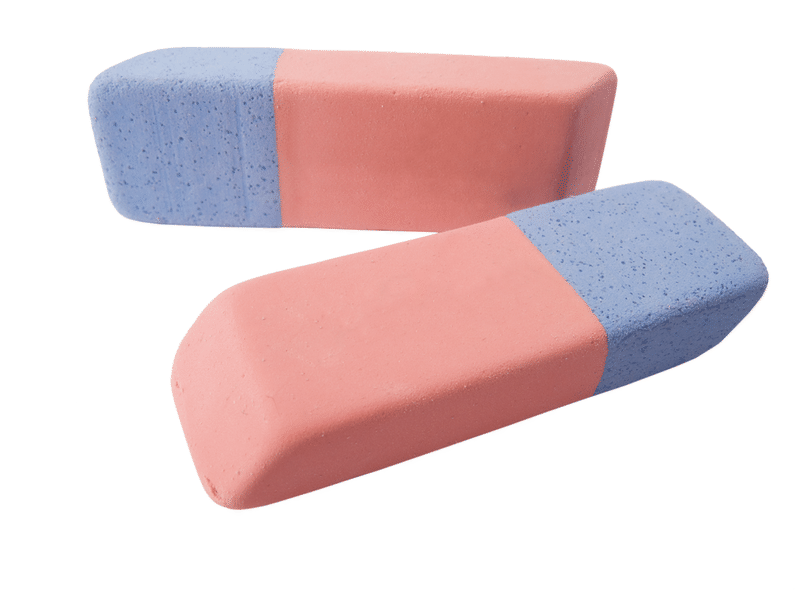

_Mallory sold 4 more boxes of erasers than the three-fourths that Kelly sold. If Mallory sold 13 boxes, how many boxes did Kelly sell?_

Trevor is puzzled. He knows that there has to be a variable because the number of boxes that Kelly sold is unknown. He also knows that he needs to write an equation and that this equation will have a rational number, three-fourths in it.

He starts to work.

**Using rational numbers is a skill that you will need as you approach higher levels of mathematics. To solve this problem, you will need to understand rational numbers. Let’s begin with this lesson and at the end, you can help Trevor with this problem.**

**_What You Will Learn_**

In this lesson you will learn how to complete the following skills.

* Find equivalent forms of rational numbers given in assorted forms.
* Compare and order rational numbers on a number line and with inequality symbols.
* Apply properties and use order of operations to evaluate numerical and variable expressions involving rational numbers.
* Model and solve real-world problems using simple equations involving rational numbers.

**_Teaching Time_**

I. **Find Equivalent Forms of Rational Numbers Given in Assorted Forms**

You have learned about different kinds of numbers. You have learned about decimals, fractions, integers and whole numbers, now we are going to investigate rational numbers.

**What is a rational number?**

**A** **_rational number_** **is a number that can be written in fraction form.**

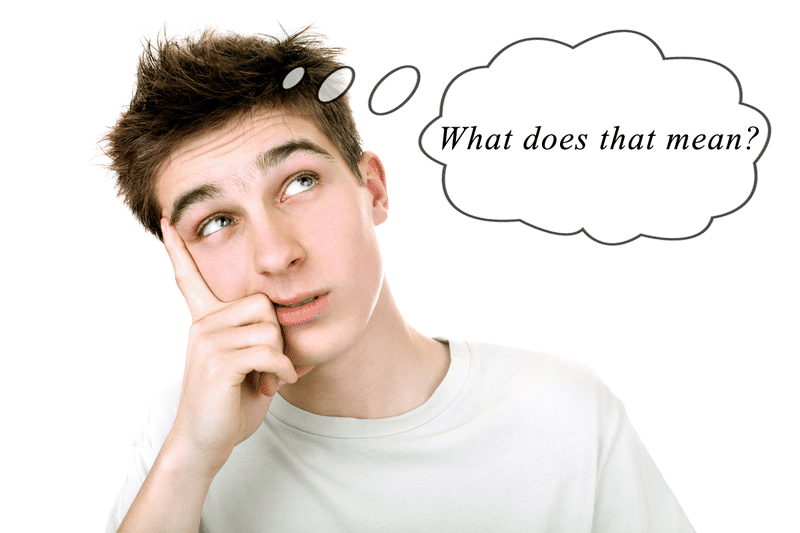

**We can think of fractions first. A fraction is a rational number because it is written in fraction form. Rational numbers can also be positive or negative. Think about if you had lost one-half. Then the number would be negative.**

$$
\frac{-1}{2} \ and \ \frac{1}{2}
$$

**Both of these are rational numbers.**

**What other numbers can be written in fraction form and are therefore rational numbers?**

**Well, you can think of integers. Remember that an integer is the set of whole numbers and their opposites. We can write any integer as a fraction over 1. This makes all integers rational numbers.**

$$
\begin{align*}
-4 &= \frac{-4}{1}\\
13 &= \frac{13}{1}
\end{align*}
$$

**These integers are rational numbers too.**

**What about decimals?**

**A decimal is related to a fraction. Most decimals can be written as fractions. When you understand how to convert a decimal to a fraction and a fraction to a decimal, you will be able to determine whether or not the decimal is a rational number. Let’s look at an example.**

Example

Is .34 a rational number?

**If you look at this example, what is the value of the decimal? It is 34 hundredths. We can write this decimal as a fraction with a denominator of 100.**

$.34 = \frac{34}{100}$

**This is a rational number. Regular decimals are also rational numbers.**

Example

Is .3434343434 a rational number?

**This is a tricky one because we have a** **_repeating decimal._** **However, because it has an end to it, we can find its fraction equivalent. All repeating decimals are also rational numbers.**

Example

Is .35678921 a rational number?

**This is not a repeating decimal, but it is a terminating decimal. A** **_terminating decimal_** **has an end to it. As long as it has an end, it is a rational number.**

**Which decimals are not rational numbers?**

**Decimals that do not have an end are not rational numbers. We can think of an irrational number in this way. An example of an irrational number is pi. We say pi is equal to 3.14, but really it goes on and on and on.**

**Pi or 3.14... . These values are not rational numbers.**

")

\[Figure 4\]

**_Take a few minutes and write these examples in your notebook._**

**We can also convert rational numbers into different forms.**

Example

_What decimal is equivalent to the fraction $\frac{7}{8}$?_

Divide to find the equivalent decimal.

$7 \div 8=0.875$

The decimal 0.875 is equivalent to $\frac{7}{8}$.

To convert from a decimal to a fraction, place the numbers in the decimal over the appropriate place value. For example, to convert 0.875 back to a fraction, count the decimal places. There are three decimal places, so there will be three zeros in the denominator.

$0.875=\frac{875}{1000}$

Now simplify the fraction to lowest terms.

$\frac{875}{1000}=\frac{175}{200}=\frac{35}{40}=\frac{7}{8}$

Example

_What fraction is equivalent to the decimal 0.3125?_

Place the numbers in the decimal over the appropriate place value. Count the decimal places. There are four decimal places, so there will be four zeros in the denominator.

$0.3125=\frac{3125}{10000}$

Now simplify the fraction to lowest terms.

$\frac{3125}{10000}=\frac{125}{400}=\frac{5}{16}$

The fraction $\frac{5}{16}$ is equivalent to 0.3125.

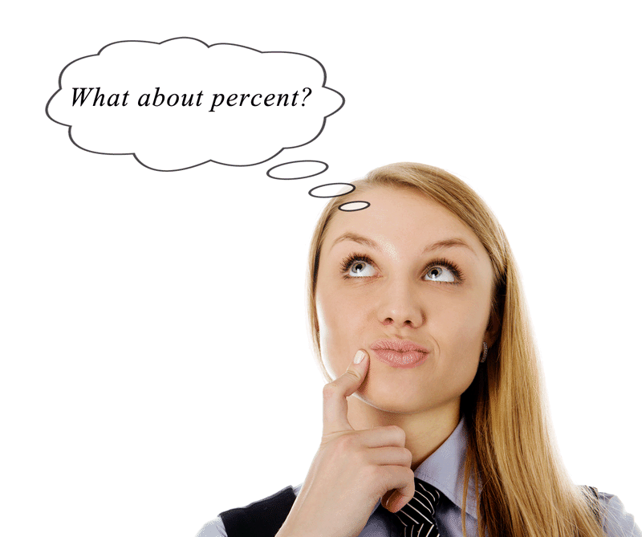

Example

What is 30% as a fraction? As a decimal?

We can start by knowing that 30% means 30 out of 100. Now we can write it as a fraction and as a decimal.

$30. = \frac{30}{100}=.30$

**Percents that have been converted to decimals and fractions can also be considered rational numbers.**

II. **Compare and Order Rational Numbers on a Number Line and with Inequality Symbols**

To compare and order rational numbers, you should first convert each number to the same form so that they are easier to compare. Usually it will be easier to convert each number to a decimal. Then you can use a number line to help you order the numbers.

Example

_Place the following number on a number line in their approximate locations:_ $8\%, \frac{1}{8}, 0.8$

**Convert each number to a decimal.**

$$
\begin{align*}
8. &= 0.08\\
\frac{1}{8} &= 1 \div 8=0.125\\
&0.8
\end{align*}
$$

**All of the numbers are between 0 and 1. You can use place value to find the correct order of the numbers. Since 0.08 has a 0 in the tenths place, 8% is the least number. Since 0.125 has a 1 in the tenths place, $\frac{1}{8}$ is the next greatest number. Since 0.8 has an 8 in the tenths place, it is the greatest number.**

**We wrote these three values on a number line. This is one way to show the different values. We can also use inequality symbols.**

**_Inequality symbols_** **are &lt; less than, &gt; greater than, $\le$ less than or equal to, and $\ge$ greater than or equal to.**

Example

_Which inequality symbol correctly compares 0.29% to 0.029?_

**Change the percent to a decimal. Then use place value to compare the numbers.**

**Move the decimal point two places to the left.**

$0.29\%=0.0029$

**Now compare the place value of each number. Both numbers have a 0 in the tenths place. 0.029 has a 2 in the hundredths place, while 0.0029 has a 0 in the hundredths place. So 0.0029 is less than 0.029.**

$0.29. < 0.029$

III. **Apply Properties and Use Order of Operations to Evaluate Numerical and Variable Expressions Involving Rational Numbers**

Let’s start by thinking back to the order of operations. The order of operations can help you simplify numerical and variable expressions. Here is a reminder of the order of operations.

* First evaluate expressions in parentheses.
* Then evaluate exponents.
* Then multiply and divide in order from left to right.
* Finally, add and subtract in order from left to right.

Now let’s look at an example.

Example

_If $x = 4.5$, what is the value of $4x(x-10)$?_

Substitute the value for $x$ into the expression.

$4(4.5)(4.5-10)$

Evaluate the expression in parentheses: $4(4.5)(4.5-10)=4(4.5)(-5.5)$

There are no exponents, so multiply in order from left to right: $4(4.5)(-5.5)=18(-5.5)=-99$

**The answer is -99.**

**Notice that in this example, we used the Distributive Property to work with the values outside of the parentheses. When we multiplied those values, we were able to get rid of the parentheses.**

**Also, you can see that we could use the Commutative Property of Multiplication at the end of the problem. It does not matter which order we multiply those values, the product is still the same.**

Now let’s look at an example with fractions.

Example

_If $x=\frac{1}{3}$ and $y=\frac{1}{2}$, what is $2xy-6x$?_

Look at the expression. Multiplying fractions several times can be difficult and time consuming. The Distributive Property can help you simplify the expression before substituting the values for $x$ and $y$.

$2xy-6x=2x(y-3)$

Now substitute the values for $x$ and $y$ into the expression.

$2 \left(\frac{1}{3}\right) \left(\frac{1}{2}-3\right)$

Now use the order of operations to simplify the expression.

Evaluate the expression in parentheses: $2 \left(\frac{1}{3}\right) \left(\frac{1}{2}-3\right)=2 \left(\frac{1}{3}\right) \left(-\frac{5}{2}\right)$

Multiply in order from left to right: $2 \left(\frac{1}{3}\right) \left(-\frac{5}{2}\right)=\frac{2}{3} \left(-\frac{5}{2}\right)=-\frac{5}{3}=-1\frac{2}{3}$

**The answer is $-1 \frac{2}{3}$.**

IV. **Model and Solve Real – World Problems Using Simple Equations Involving Rational Numbers**

You have seen how fractions, decimals, and integers can be used to solve real-world problems. You can use rational numbers to write and solve equations to represent real-world problems.

Example

_Candy is 5 years older than one-third Liam’s age. If Candy is 16, how old is Liam?_

Choose a variable to represent Liam’s age. Let $l$ represent Liam’s age.

Write an equation using the information in the problem.

The phrase “5 years older” translates to “+5.” The phrase “one-third Liam’s age” translates to “$\frac{1}{3} \cdot l$.” Since the problem tells you that Candy is 16, set the expression that shows Candy’s age equal to 16.

Put the parts together to form an equation.

$\frac{1}{3}l+5=16$

Now solve the equation for $l$. Remember that any operation you perform on one side of the equation must also be performed on the other side.

First, subtract 5 from both sides to isolate the variable term on one side of the equation.

$$
\begin{align*}
\frac{1}{3}l+5-5 &= 16-5\\
\frac{1}{3}l &= 11
\end{align*}
$$

Now you need to remove the $\frac{1}{3}$ from the variable term. In order to eliminate a fractional coefficient, multiply by the reciprocal.

$$
\begin{align*}
\frac{3}{1} \cdot \frac{1}{3} l &= 11 \cdot \frac{3}{1}\\
l &= 33
\end{align*}
$$

**Liam is 33 years old.**

**Now let’s go back to the problem in the introduction and use what we have learned to solve it.**

Real-Life Example Completed
---------------------------

**_Boxes of Erasers_**

**Here is the original problem once again. Use what you have learned to solve it. You will need to write an equation, solve it for the number of boxes that Kelly sold, and write an inequality comparing the two quantities. There are three parts to your answer.**

Kelly and Mallory are comparing the number of boxes of erasers that each one of them has sold. Kelly works in the store one day and Mallory works in the store the next day. They decide to write a riddle about their sales and give it to Trevor to figure out. When Trevor comes in the store on the day after Mallory has worked he finds this riddle.

_Mallory sold 4 more boxes of erasers than the three-fourths that Kelly sold. If Mallory sold 13 boxes, how many boxes did Kelly sell?_

Trevor is puzzled. He knows that there has to be a variable because the number of boxes that Kelly sold is unknown. He also knows that he needs to write an equation and that this equation will have a rational number, three-fourths in it.

He starts to work.

**_Solution to the Real – Life Example_**

**First, you need to write an equation. Here is how each part of the equation breaks down.**

$x =$ **Kelly’s boxes**

$+ 4 =$ **the four more boxes that Mallory sold**

$\frac{3}{4} =$ **three-fourths of Kelly’s boxes**

$13 =$ **the number that Mallory sold**

**Here is the equation.**

$\frac{3}{4} x+4=13$

**Next, we can solve it.**

**Start by subtracting four from both sides. This makes perfect sense in simplifying.**

$\frac{3}{4} x=9$

**Next, we want to get the variable alone, so we can multiply by the reciprocal. This is the Inverse Property of Multiplication. Any number multiplied by its inverse or reciprocal is equal to 1.**

$$
\begin{align*}
\frac{4}{3} \cdot \frac{3}{4} x & =9 \cdot \frac{4}{3}\\
x & = \frac{36}{3}=12
\end{align*}
$$

**Now we know that Kelly sold 12 boxes and Mallory sold 13 boxes.**

**We can write an inequality the compares Kelly’s boxes to Mallory’s boxes.**

$12 < 13$

Vocabulary
----------

Here are the vocabulary words that are found in this lesson.

__Rational Number__

number that can be written in fraction form.

__Integer__

the set of whole numbers and their opposites.

__Percent__

number representing a part out of 100.

__Terminating Decimal__

a decimal that has an ending even though many digits may be present.

__Repeating Decimal__

a decimal that has an ending even though many digits may repeat.

__Irrational Number__

a decimal that has no ending, pi or 3.14... is an example.

__Inequality Symbols__

symbols used to compare numbers using &lt; or &gt;.

Time to Practice
----------------

Directions: Identify whether each is a rational number or not. Write yes or no for your answer. Then identify the form of the number: integer, decimal, repeating decimal, fraction, terminating decimal, irrational number

1.  $.456$
2.  $\frac{2}{3}$
3.  $- 45$
4.  $567$
5.  $- 8,970$
6.  $.3434343434$
7.  $.234\ldots$
8.  $.234567$
9.  $-.876$
10. $-\frac{2}{7}$

Directions: Compare each pair of rational numbers using &lt; or &gt;.

11. $.34 \ \underline{\;\;\;\;\;\;\;\;\;\;} \ .87$
12. $-8 \ \underline{\;\;\;\;\;\;\;\;\;\;} \ -11$
13. $\frac{1}{6} \ \underline{\;\;\;\;\;\;\;\;\;\;} \ \frac{7}{8}$
14. $.45 \ \underline{\;\;\;\;\;\;\;\;\;\;} \ 50\%$
15. $66. \ \underline{\;\;\;\;\;\;\;\;\;\;} \ \frac{3}{4}$
16. $.78 \ \underline{\;\;\;\;\;\;\;\;\;\;} \ 77\%$
17. $\frac{4}{9} \ \underline{\;\;\;\;\;\;\;\;\;\;} \ 25\%$
18. $.989898 \ \underline{\;\;\;\;\;\;\;\;\;\;} \ .35$
19. $.67 \ \underline{\;\;\;\;\;\;\;\;\;\;} \ 32\%$
20. $.123000 \ \underline{\;\;\;\;\;\;\;\;\;\;} \ .87$

Directions: Use the order of operations to evaluate the following expressions.

21. $3x$, _when_ $x$ _is_ $.50$
22. $4y$, _when_ $y$ _is_ $\frac{3}{4}$
23. $5x+1$, _when_ $x$ _is_ $-12$
24. $6y-7$, _when_ $y$ _is_ $\frac{1}{2}$
25. $3x-4x$, _when_ $x$ _is_ $-5$
26. $6x+8y$, _when_ $x$ _is_ 2 _and_ $y$ _is_ $-4$

</article>

### 2.8 Number Properties

<article>

Introduction
------------

**_The Week of Sales_**

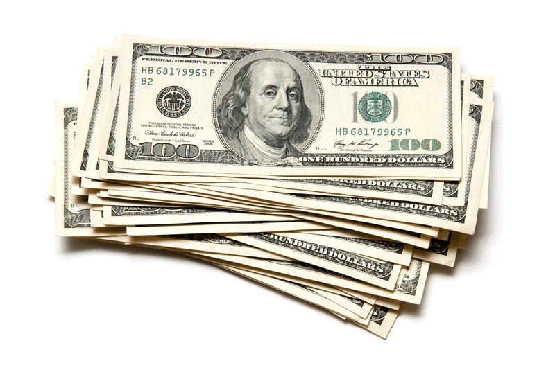

“We are doing terrific!” Kelly said at the meeting one week.

“Yes. Here are the total sales that we have done for the month.” Trevor said taking out his paper. “We made 130.25, 75.18, and 85.00 for a grand total of 380 dollars and 43 cents.”

“Wait a minute, there are four weeks in the month. You only said three amounts,” Mallory pointed out.

Trevor looked back down at his paper.

“You’re right. I missed week 3. But I know the total is correct.”

**This is where you come in. Based on the information that Trevor gave the group, you should be able to figure out how much money was made in the missing week. This lesson will show you how to use properties to work with variable and numerical expressions. At the end of this lesson, you will write an equation and use properties to figure out the sales for the third week.**

**_What You Will Learn_**

In this lesson, you will learn to use the following skills.

* Identify and apply the associative property of addition and multiplication in rational number operations, using numerical and variable expressions.
* Identify and apply the commutative property of addition and multiplication in rational number operations, using numerical and variable expressions.
* Identify and apply the distributive property in rational number operations, using numerical and variable expressions.
* Model and solve real-world problems using equations involving rational numbers.

**_Teaching Time_**

In this chapter, you have learned about all different kinds of rational numbers and the different number properties. It’s important to know how and when to use these properties when given a real-world situation. Let’s take a look at how properties can help you solve problems.

First, let’s review all of the properties you have learned.

**Associative Property of Addition**

The grouping of addends does not affect the sum: $4.5+(2.1+9.6)=(4.5+2.1)+9.6$

**Associative Property of Multiplication**

The grouping of numbers does not affect the product: $4.5 \times (2.1 \times 9.6)=(4.5 \times 2.1) \times 9.6$

**Commutative Property of Addition**

The order of addends does not change the sum: $6.3+8.7=8.7+6.3$

**Commutative Property of Multiplication**

The order of numbers does not change the product: $6.3 \times 8.7 = 8.7 \times 6.3$

**Distributive Property**

The product of a number and a sum is equal to the sum of the individual products of addends and the number: $3.2 (1.5 + 8.9)=(3.2 \times 1.5)+(3.2 \times 8.9)$

**Additive Identity**

The sum of any number and zero is that number: $\frac{3}{11}+0=\frac{3}{11}$

**Additive Inverse**

The sum of any number and its inverse is zero: $\frac{3}{4}+ \left(-\frac{3}{4}\right)=0$

**Multiplicative Identity**

The product of any number and one is that number: $\frac{3}{11} \times 1=\frac{3}{11}$

**Multiplicative Inverse**

The product of any number and its reciprocal is one: $\frac{3}{4} \times\frac{4}{3}=1$

**Zero Property**

The product of any number and zero is zero: $\frac{4}{7} \times 0=0$

**The Order of Operations**

* First evaluate expressions in parentheses.
* Then evaluate exponents.
* Then multiply and divide in order from left to right.
* Finally, add and subtract in order from left to right.

I. **Identify and Apply the Associative Property of Addition and Multiplication in Rational Number Operations, using Numerical and Variable Expressions**

**We can start by remembering that when we apply the associative property that we can move the parentheses in an expression to help us with our work.**

Let’s look at an example of a numerical expression.

Example

$\left(\frac{1}{3}+\frac{1}{4}\right)+\frac{2}{4}$

**Here we have an expression that has three rational numbers in it. We can see that there are two different denominators. However, look at the groupings. If we move the parentheses to group the fourths together, it will help us with the addition.**

**This is an example of the Associative Property of Addition.**

$\frac{1}{3}+\left(\frac{1}{4}+\frac{2}{4}\right)$

**Now we can find a solution.**

$\frac{1}{3}+\frac{3}{4}=\frac{4}{12}+\frac{9}{12}=\frac{13}{12}=1 \frac{1}{12}$

**This is our answer.**

Now let’s look at an example of a variable expression where the associative property would be useful.

Example

$\left(x+\frac{4}{5}\right)-\frac{2}{5}$, when $x$ is $\frac{3}{7}$

**First, we can substitute three-sevenths into the expression for the variable.**

$\left(\frac{3}{7}+\frac{4}{5}\right)-\frac{2}{5}$

**Next, you can see that it makes much more sense to work with the fifths and then the sevenths. Let’s regroup these fractions and find a solution.**

$$
\begin{align*}
& \frac{3}{7}+\left(\frac{4}{5}-\frac{2}{5}\right)\\
& \frac{3}{7}+\frac{2}{5}=\frac{15}{35}+\frac{14}{35}=\frac{19}{35}
\end{align*}
$$

**This is our answer.**

II. **Identify and Apply the Commutative Property of Addition and Multiplication in Rational Number Operations, using Numerical and Variable Expressions**

**We can also apply the Commutative Property when we evaluate expressions with rational numbers in them. Rearranging the numbers we are working with can help us to simplify our efforts.**

Let’s look at an example.

Example

$.56+\frac{1}{2}+.24$

**In this example, we have three rational numbers that we are adding. If you look, it doesn’t make sense to add the decimal and the fraction and then the decimal. It makes more sense to use the commutative property to rearrange the values. We add the decimals first and then deal with the fraction.**

$.56+.24.+\frac{1}{2}$

**Now we can add the decimals together.**

$$
\begin{align*}
& .56 + .24 = .80\\
& .80+\frac{1}{2}
\end{align*}
$$

**Here we are trying to add a decimal and a fraction. We need to convert the fraction to a decimal so that the rational numbers are in the same form. Then we can easily add them.**

$$
\begin{align*}
\frac{1}{2} &= .50\\
.80+.50 &= 1.3
\end{align*}
$$

**This is our answer.**

Now let’s look at an example with a variable expression and multiplication.

Example

$\frac{1}{2} \cdot (.56) \cdot \frac{1}{3}$

Here is a numerical expression with two fractions and a decimal. Notice that the decimal is in the middle. It makes the most sense to rearrange the fractions so that you can multiply them together, and then multiply the decimal.

$$
\frac{1}{2} \cdot \frac{1}{3}=\frac{1}{6}
$$

Now let’s convert .5 to a fraction and multiply it by one-sixth.

$$
\frac{1}{6} \cdot \frac{1}{2}=\frac{1}{12}
$$

**This is the answer.**

III. **Identify and Apply the Distributive Property in Rational Number Operations, using Numerical and Variable Expressions**

**We can use the Distributive Property to help us simplify expressions with parentheses and operations within the parentheses.** Let’s look at an example.

Example

$\frac{1}{2} \left(\frac{3}{6}+8\right)$

**In this example, we need to multiply the term outside of the parentheses with both of the terms inside the parentheses. Then we can simplify the expression further.**

$$
\begin{align*}
\frac{1}{2} \cdot \frac{1}{2} &= \frac{1}{4}\\
\frac{1}{2} \cdot 8 &= 4\\
4+\frac{1}{4} &= 4 \frac{1}{4}
\end{align*}
$$

**This is the answer.**

We can also use the Distributive Property to simplify variable expressions.

Example

$x(3+7)$

**Now we can distribute the variable to both of the terms in the parentheses and then we can simplify the expression.**

$$
\begin{align*}
& 3x+7x\\
& 10x
\end{align*}
$$

**This is the answer.**

IV. **Model and Solve Real – World Problems Using Equations Involving Rational Numbers**

**Let’s look at using what we have learned to solve some real-world problems with rational numbers.**

_Nina owns a printing shop. The expression $\frac{1}{2}x+\frac{22}{3}$ represents her profits each hour, where $x$ is the number of pages she prints. If she made $15 in the last hour, how many pages did she print?_

First set up the equation. You know the profit she made and the expression that represents the profit. Set them equal to each other.

$\frac{1}{3}x+\frac{22}{3}=15$

Now solve for $x$. The fractions make this equation more difficult to solve. So, use properties to take away the fractions. The reciprocal property states that any number multiplied by its reciprocal is equal to 1. Since both fractions are thirds, multiply both sides of the equation by the reciprocal, $\frac{3}{1}$, to take away the fraction.

$\frac{3}{1} \left(\frac{1}{3}x+\frac{22}{3}\right)=\frac{3}{1}(15)$

Now use the distributive property to simplify the left side of the equation.

$\left(\frac{3}{1}\right)\left(\frac{1}{3}x\right)+\left(\frac{3}{1}\right)\left(\frac{22}{3}\right)=\frac{3}{1}(15)$

$x+22=45$

Now you can easily solve the equation. Subtract 22 from both sides to isolate the variable.

$$
\begin{align*}
x+22-22 &= 45-22\\
x+0 &= 23\\
x &= 23
\end{align*}
$$

Note: By subtracting 22 from both sides, you are applying the additive inverse property to the left side of the equation. You can prove that this isolates $x$ because of the additive identity property.

_Ben bought one share of stock for $40. He watched the price of his stock every day for a week. On Monday, the stock moved 2.5 points up. On Tuesday, it moved 1.75 points down. On Wednesday, it moved p points. On Thursday and Friday, the stock moved 0.75 points up each day. If the price of the stock was $45 at the end of the week, what is the value of $p$?_

Use the information in the problem to write an equation to represent the price of the stock.

Use the order of operations to simplify the equation. First, multiply. Then add and subtract in order from left to right.

$40+2.5-1.75+p+2(0.75)=45$

Now apply the commutative property in order to combine the decimals.

$$
\begin{align*}
40+2.5-1.75+p+1.5 &= 45\\
42.5-1.75+p+1.5 &= 45\\
40.75+p+1.5 &= 45
\end{align*}
$$

Finally, isolate the variable by subtracting 42.25 from both sides. You can then apply the commutative and additive identity properties to the left side of the equation to solve for $p$.

$$
\begin{align*}
42.25+p-42.25 &= 45-42.25\\
p+42.25-42.25 &= 45-42.25\\
p+0 &= 2.75\\
p &= 2.75
\end{align*}
$$

The stock moved 2.75 points up on Wednesday.

**Now let’s go back to the original problem from the introduction and work on solving it.**

Real-Life Example Completed
---------------------------

**_The Week of Sales_**

**Here is the original problem once again. Reread it and then write an equation to show the information that Trevor reported on group sales. After writing the equation, solve it for the missing sales for week 3.**

Once the school store had been up and running for a few weeks, the students saw what a huge success it was. Students began to rely on getting their school supplies and school and the student council was overjoyed at the amount of money that they would have for events.

“We are doing terrific!” Kelly said at the meeting one week.

“Yes. Here are the total sales that we have done for the month.” Trevor said taking out his paper. “We made 130.25, 75.18, and 85.00 for a grand total of 380 dollars and 43 cents.”

“Wait a minute, there are four weeks in the month. You only said three amounts,” Mallory pointed out.

Trevor looked back down at his paper.

“You’re right. I missed week 3. But I know the total is correct.”

**_Solution to Real – Life Example_**

**To begin, we can write an equation that shows what we know and what we don’t know. We know the total sales for weeks one, two, and four. We are missing week 3, and we know the sum.**

$130.25 +75.18 + x + 85.00 = 380.43$

**Notice that we used a variable to represent the missing quantity.**

**Now we can solve the equation. You can use the commutative property of addition in this work. By rearranging the quantities that you have, you can find a sum that does not include the variable. Here it is.**

$290.43 + x = 380.43$

**Next, we can subtract the 290.43 from the 380.43.**

**The amount of sales in week 3 was $90.00.**

Time to Practice
----------------

Directions: Use what you have learned to work with each problem concerning rational numbers.

1.  Write an equation that shows the commutative property of addition.
2.  Write an equation that shows the zero property of multiplication.
3.  What is the difference between the additive identity and the multiplicative identity properties?
4.  The following shows a student’s work: $\left(\frac{3}{3}\right) \left(\frac{1}{5}\right)+ \left(\frac{5}{5}\right) \left(\frac{2}{3}\right)=\frac{3}{15}+\frac{10}{15}$. What property did the student use to find a common denominator?
5.  The expression $2p^3-4m$ can be used to find the sales profit of a company where $p$ is the number of products they sell and $m$ is the number of miles they travel. If they sold 5 products and traveled 10 miles, what was their profit?
6.  The expression $\frac{11s}{2}+7t$ can be used to find the group admission price, where $s$ is the number of students and $t$ is the number of teachers. If there are 20 students and 4 teachers, what is the group admission price?
7.  Brooke needs to save $146 for a trip. She has $35 in her savings account. She saves $15.75 each week. She also has to spend $15 to buy a present for a friend. How many weeks will Brooke need to save to have enough for her trip?
8.  Vinnie is $\frac{1}{2}$ as old as Julie. In 6 years, Julie will be 24. How old is Vinnie?
9.  Manuel starts with $30. He earns $8.50 per hour plus an additional bonus of $12 each day. He spends $7.50 for lunch. If he has $94 at the end of the day, for how many hours did he work?
10. A formula for the perimeter of a rectangle is $P=2(l+w)$, where $P$ is the perimeter, $l$ is the length, and $w$ is the width. If the perimeter of a rectangle is 312 centimeters and the width is 67.3 centimeters, what is the length?

</article>

## 3.0 Single Variable Equations and Inequalities

<article>

</article>

### 3.1 Solving Two Step Equations

<article>

Introduction
------------

**_The Marching Band_**

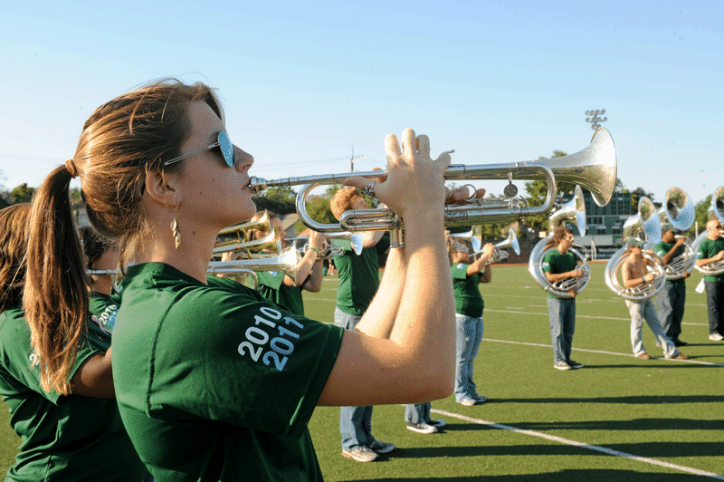

When the students gathered for their first rehearsal, Mrs. Kline the band director gathered them altogether for a few announcements.

“We will be marching in the big parade this year once again,” she said smiling from ear to ear.

“I am so glad,” Keri said leaning over to Anica. “I was hoping that we would.”

“We will also be adding four new students this year. We started with 140 students and we will add four. This means that we need to redo our formation for the big finale. We need to reorganize the band into eight even rows. Let’s take a look at what this will look like. Please take out a piece of paper and a pencil,” Mrs. Kline said turning to the blackboard.

“I can figure out the number of students in each row with an equation,” Anica said smiling.

“Yes, and don’t forget to count Jake as the Drum Major in the lead,” Keri added.

**Do you know what this equation needs to look like? We have been given the sum of the students, a Drum Major and we know that we need eight even rows. As Anica said, we will need an equation to figure out the number of students in each row. This lesson will teach you all that you need to know about two-step equations so that you will know how to solve this in the end.**

**_What You Will Learn_**

In this lesson you will learn how to complete the following skills.

* Solve equations involving inverse properties of addition and multiplication.
* Solve equations involving inverse properties of addition and division.
* Solve equations involving inverse properties of subtraction and multiplication.
* Solve equations involving inverse properties of subtraction and division.
* Model and solve real-world problems using two step equations.

**_Teaching Time_**

I. **Solve Equations Involving Inverse Properties of Addition and Multiplication**

Let’s start this lesson by thinking about what we already know about equations.

We know that an **_equation_** **is a statement with an equal sign where the quantity on one side of the equals is the same as the quantity on the other side of the equals.**

Example

$4 + 11 = 15$

This is an example of an equation. The quantity on one side of the equals is the same as the quantity on the other side.

If we don’t know one of the pieces of an equation, we can use a variable. **A** **_variable_** **is a letter used to represent an unknown quantity. An equation that includes at least one variable is called an** **_algebraic equation_****.**

Example

$x+11=15$

Here we have an equation with a variable where $x$ is the unknown quantity. To solve this, the natural thing to do is to perform **an** **_inverse operation_** **or opposite operation**. We subtract eleven from 15 which leaves us with 4. That is the value of the variable.

**Most of the time, you don’t even think about performing an inverse operation, your mind naturally solves the problem in this way.**

**When you have an equation with one variable, it is called a** **_one step equation_****. It only takes one operation or one inverse operation to solve it. You have had a lot of practice solving one step equations.**

In this lesson, you are going to learn how to solve two step equations. Let’s begin.

To solve a two-step equation, we will need to use more than one inverse operation. Let's take a look at how to solve a two-step equation now. When we perform inverse operations to find the value of a variable, we work to get the variable alone on one side of the equals. This is called isolating the variable. It is one strategy for solving equations. You can use isolating the variable whether you are solving one step or two step equations.

Let’s look at an example of a two step equation.

Example

_Solve for $a$: $3a + 12 = 45$._

**We can call each piece of the equation a** **_term_****.** There is a term with a variable and there is a term without a variable. Notice that there are two **_terms_** on the left side of the equation, $3a$ and 12.

**Our first step is to use inverse operations to get the term that includes a variable, $3a$, by itself on one side of the equal (=) sign. Because the three is connected to the variable, we perform the other inverse operation first. We work with the number connected with the variable last.**

**In the equation, 12 is** **_added_** **to $3a$. So, we can use the inverse of addition—subtraction. We can subtract 12 from both sides of the equation.**

**Let's see what happens when we subtract 12 from both sides of the equation.**

$$
\begin{align*}
3a + 12 & = 45\\
3a + 12 - 12 & = 45 - 12\\
3a + 0 & = 33\\
3a & = 33
\end{align*}
$$

**Now, the term that includes a variable, $3a$, is by itself on one side of the equation.**

**We can now use inverse operations to get the $a$ by itself. Since $3a$ means $3 \times a$, we can use the inverse of multiplication—division. We can divide both sides of the equation by 3. Let's see what happens when we divide both sides of the equation by 3.**

$$
\begin{align*}
3a & = 33\\
\frac{3a}{3} & = \frac{33}{3}\\
1a & = 11\\
a & = 11
\end{align*}
$$

**The value of $a$ is 11.**

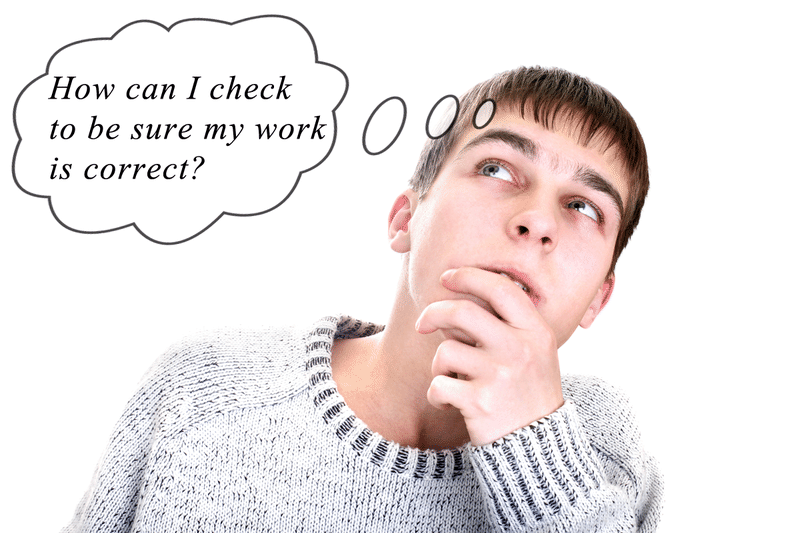

$$
\begin{align*}
3(11) + 12 & = 45\\
33 + 12 & = 45\\
45 & = 45
\end{align*}
$$

**Here our work is accurate because the quantity on one side of the equals is the same as the quantity on the other side of the equals. When in doubt, check it out!!**

Notice that this problem used addition and multiplication.

**Let's review the properties of equality that can help us understand the strategy used in the example.**

Notice that in the example, our first step was to subtract 12 from _both_ sides of the equation. We needed to subtract that number from _both_ sides of the equation because of the **_subtraction property of equality_****, which states:**

**if** $a = b$, **then** $a - c = b - c$.

So, if you subtract a number, $c$, from one side of an equation, you must subtract that same number, $c$, from the other side, too, to keep the values on both sides equal.

In the example, our second step was to divide _both_ sides of the equation by 3. We needed to divide _both_ sides of the equation by that number because of the **_division property of equality_****, which states:**

**if** $a = b$ **and** $c \neq 0$, **then** $\frac{a}{c} = \frac{b}{c}$.

So, if you divide one side of an equation by a nonzero number, $c$, you must divide the other side of the equation by that same number, $c$, to keep the values on both sides equal.

Let’s review our steps to solving this two step equation.

")

\[Figure 4\]

**_Take a few minutes to write these steps in your notebook._**

II. **Solve Equations Involving Inverse Properties of Addition and Division**

We can apply the same steps as we did when working with addition and multiplication when we work with other types of two step equations. **We will focus on isolating the variable and on using inverse operations to do that.** Let’s look at an example.

Example

_Solve for $c$: $5 + \frac{c}{4} = 15$._

Notice that there are two terms on the left side of the equation, 5 and $\frac{c}{4}$.

**Our first step should be to use inverse operations to get the term that includes a variable, $\frac{c}{4}$, by itself on one side of the equal (=) sign.**

**In the equation, 5 is** **_added_** **to $\frac{c}{4}$. So, we can use the inverse of addition—subtraction. We can subtract 5 from both sides of the equation.**

$$
\begin{align*}
5 + \frac{c}{4} & = 15\\
5 - 5 + \frac{c}{4} & = 15 - 5\\
0 + \frac{c}{4} & = 10\\
\frac{c}{4} & = 10
\end{align*}
$$

**Now, the term that includes a variable, $\frac{c}{4}$, is by itself on one side of the equation.**

**We can now use inverse operations to get the $c$ by itself. Since $\frac{c}{4}$ means $c \div 4$, we can use the inverse of division—multiplication. We can multiply both sides of the equation by 4.**

$$
\begin{align*}
\frac{c}{4} & = 10\\
\frac{c}{4} \times 4 & = 10 \times 4\\
\frac{c}{4} \times \frac{4}{1} & = 40
\end{align*}
$$

The number 4, or $\frac{4}{1}$, is the **_multiplicative inverse_**, or **reciprocal**, of $\frac{1}{4}$. You can find the multiplicative inverse of a number by flipping its numerator and its denominator. So, the multiplicative inverse of $\frac{4}{1}$ is $\frac{1}{4}$. When a number is multiplied by its multiplicative inverse, the product is 1.

$$
\begin{align*}
\frac{c}{4} \times \frac{4}{1} & = 40\\
c \times \left ( \frac{1}{4} \times \frac{4}{1} \right ) & = 40\\
c \times 1 & = 40\\
c & = 40
\end{align*}
$$

**The work above shows how multiplying each side of the equation by 4 isolates the variable.**

Because 4 is the multiplicative inverse, or reciprocal, of $\frac{1}{4}$, we could also have solved this problem by canceling out the 4's like this:

$$
\begin{align*}
\frac{c}{\bcancel{4}} \times \frac{\bcancel{4}}{1} & = 40\\
\frac{c}{1} & = 40\\
c & = 40
\end{align*}
$$

**The answer is that $c$ is equal to 40.**

$$
\begin{align*}
5 + \frac{40}{4} & = 15\\
5 + 10 & = 15\\
15 & = 15
\end{align*}
$$

**Both sides are equal, so our equation is balanced.**

In the first step of example, we subtracted 5 from _both_ sides of the equation because of the subtraction property of equality, which was reviewed in the first section of this lesson.

In the second step of Example 2, we multiplied both sides of the equation by 4. We must multiply _both_ sides of the equation by that number because of **_the multiplication property of equality_****, which states:**

**if $a = b$ and $c \neq 0$, then $a \times c = b \times c$.**

So, if you multiply one side of an equation by a nonzero number, $c$, you must multiply the other side of the equation by that same number, $c$, to keep the values on both sides equal.

III. **Solve Equations Involving Inverse Properties of Subtraction and Multiplication**

Now, let's take a look at another two-step equation. This one involves subtraction.

Example

_Solve for $x$: $2x - 9 = 17$._

**Notice that there are two terms on the left side of the equation, $2x$ and 9. Our first step should be to use inverse operations to get the term that includes a variable, $2x$, by itself on one side of the equal (=) sign.**

**In the equation, 9 is** **_subtracted_** **from $2x$. So, we can use the inverse of subtraction—addition. We can subtract 9 from both sides of the equation.**

$$
\begin{align*}
2x - 9 & = 17\\
2x(-9 + 9) & = 17 + 9\\
2x & = 26
\end{align*}
$$

**Notice how we rewrote the problem above. Since we are adding a positive number, 9, to a number that is being subtracted from $2x$, we can represent this as adding 9 to -9 as we did above: (-9 + 9).**

**The number 9 is the** **_additive inverse_****, or opposite, of -9.**

**We can now use inverse operations to get the $x$ by itself. Since $2x$ means $2 \cdot x$, we can use the inverse of multiplication—division. We can divide both sides of the equation by 2.**

$$
\begin{align*}
2x & = 26\\
\frac{2x}{2} & = \frac{26}{2}\\
x & = 13
\end{align*}
$$

**The value of $x$ is 13.**

**Now we can check our work too.**

$$
\begin{align*}
2 (13) - 9 & = 17\\
26 - 9 & = 17\\
17 & = 17
\end{align*}
$$

**Our work is accurate.**

IV. **Solve Equations Involving Inverse Properties of Subtraction and Division**

By now you are probably beginning to see some patterns for solving two step equations. You will notice that the steps really don’t change, the inverse operations do depending on the operations in the equations, but the steps to solving the equations remain the same.

Now let’s look at solving an equation that has subtraction and division in it.

Example

_Solve for $z$: $\frac{z}{6} - 7 = 3$._

**Notice that there are two terms on the left side of the equation, $\frac{z}{6}$ and 7. Our first step should be to use inverse operations to get the term that includes a variable, $\frac{z}{6}$, by itself on one side of the equal (=) sign.**

**In the equation, 7 is** **_subtracted_** **from $\frac{z}{6}$. So, we can use the inverse of subtraction—addition. We can add 7 to both sides of the equation, like this:**

$$
\begin{align*}
\frac{z}{6} - 7 & = 3\\
\frac{z}{6} - 7 + 7 & = 3 + 7\\
\frac{z}{6} + (-7 + 7) & = 10\\
\frac{z}{6} + 0 & = 10\\
\frac{z}{6} &= 10
\end{align*}
$$

Now, the term that includes a variable, $\frac{z}{6}$, is by itself on one side of the equation.

We can now use inverse operations to get the $z$ by itself. Since $\frac{z}{6}$ means $z \div 6$, we can use the inverse of division—multiplication. We can multiply both sides of the equation by 6, like this:

$$
\begin{align*}
\frac{z}{6} &= 10\\
\frac{z}{6} \times 6 & = 10 \times 6\\
\frac{z}{\bcancel{6}} \times \frac{\bcancel{6}}{1} & = 60\\
\frac{z}{1} & = 60\\
z & = 60
\end{align*}
$$

**The value of $z$ is 60.**

**Now let’s check our work.**

$$
\begin{align*}
\frac{60}{6} - 7 & = 3\\
10 - 7 & = 3\\
3 & = 3
\end{align*}
$$

**Our work is accurate.**

V. **Model and Solve Real – World Problems Using Two Step Equations**

We can also use equations to solve real-world problems. Not every problem or dilemma can be solved with only one operation. This is where solving two step equations can be very useful.

The key words in the chart below can help you translate words into algebraic language.

| **Key Words for Addition** | **Key Words for Multiplication** | **Key Words for Subtraction** | **Key Words for Division** |
| --- | --- | --- | --- |
| **sum of** 1 and $a$ $1 + a$ | **product** of 8 and $b$ $8b$ | 4 **less** $v$ $4 - v$ | 7 **divided into** $r$ equal groups $\frac{7}{r}$ |
| **10 plus $z$** $10 + z$ | 3 **times** $x$ $3x$ | 5 **less than** $t$ $t - 5$ | $p$ **shared equally** by 4 $\frac{p}{4}$ |
| **2 more than $y$** $2 + y$ | **twice** $w$ $2w$ | 6 **fewer than** $s$ $s - 6$ | **half of** $n$ $\frac{n}{2}$ |
| **9 and $b$** $9 + b$ |     |     | **one-third of** $m$ $\frac{m}{3}$ |

| **Other Words for Addition or Multiplication** | **Other Words for Subtraction** | **Other Words for Division** |
| --- | --- | --- |
| how many **total** | how many **left** | how many **in each** |
| how many **all together** | how many **more** |     |
| how many **in all** | how many **fewer** |     |
|     | how much **change** |     |

The bolded key words in the phrases above provide clues that can help you translate word problems into algebraic equations. Remember, key words can be a helpful guide, but you should always think about which operation makes sense for a particular situation. Key words alone will not always be enough to help you write an equation to represent a problem.

**Now let’s look at working with these key words while solving a problem.**

_Brandon and Felicia sold rolls of wrapping paper for a school fundraiser. Brandon sold 3 less than half the number of rolls that Felicia sold. Brandon sold a total of 9 rolls of wrapping paper._

_a. Write an algebraic equation to represent $f$, the number of rolls of wrapping paper that Felicia sold._

_b. Find the number of rolls of wrapping paper that Felicia sold._

**Consider part** **_a_** **first.**

Use a number, an operation sign, a variable, or an equal sign to represent each part of that problem. Since Brandon sold 9 rolls of wrapping paper, represent the number of rolls Brandon sold as 9. Use the key words from the chart to help you translate the rest of the problem into an equation. For example, you can translate “half the number of rolls...Felicia sold” as $\frac{f}{2}$.

$$
\begin{align*}
& \underline{Brandon} \ \underline{sold} \ \underline{3} \ \underline{less \ than} \ \underline{half \ the \ number \ldots \ Felicia \ sold.}\\
& \quad \ \downarrow \qquad \ \downarrow \quad \ \searrow \qquad \downarrow \qquad \qquad \quad \swarrow\\
& \quad \ \downarrow \qquad \ \downarrow \quad \ \searrow \qquad \downarrow \qquad \qquad \quad \swarrow\\
& \quad \ \downarrow \qquad \ \downarrow \quad \ \swarrow \qquad \downarrow \qquad \qquad \quad \searrow\\
& \quad \ \ 9 \qquad = \ \ \frac{f}{2} \qquad - \qquad \qquad \quad 3
\end{align*}
$$

So, this equation, $9 = \frac{f}{2} - 3$, represents $f$, the number of rolls of wrapping paper that Felicia sold.

**Next, consider part** **_b_****.**

Solve the equation for $f$ to find the number of rolls that Felicia sold.

Our first step should be to use inverse operations to get the term that includes a variable, $\frac{f}{2}$, by itself on one side of the equal (=) sign. In the equation, 3 is _subtracted_ from $\frac{f}{2}$. So, we can use the inverse of subtraction and add 3 to both sides of the equation, like this:

$$
\begin{align*}
9 &= \frac{f}{2}-3\\
9 + 3 & = \frac{f}{2} - 3 + 3\\
12 & = \frac{f}{2} + (-3 + 3)\\
12 & = \frac{f}{2} + 0\\
12 & = \frac{f}{2}
\end{align*}
$$

Now, the term that includes a variable, $\frac{f}{2}$, is by itself on one side of the equation.

We can now use inverse operations to get the $f$ by itself. Since $\frac{f}{2}$ means $f \div 2$, we can use the inverse of division and multiply both sides of the equation by 2, like this:

$$
\begin{align*}
12 &= \frac{f}{2}\\
12 \times 2 & = \frac{f}{2} \times 2\\
24 & = \frac{f}{\bcancel{2}} \times \frac{\bcancel{2}}{1}\\
24 & = \frac{f}{1}\\
24 & = f
\end{align*}
$$

**The value of $f$ is 24, so Felicia sold 24 rolls of wrapping paper for the fundraiser.**

_A gardener charges $20 for each gardening job plus $15 for each hour worked. He charged $80 for a gardening job he did yesterday._

_a. Write an algebraic equation to represent $h$, the number of hours that the gardener worked on that $80 job._

_b. Find the number of hours that the gardener worked on that $80 job._

**Consider part** **_a_** **first.**

Use a number, an operation sign, a variable, or an equal sign to represent each part of the problem. The gardener earned $15 for each hour worked on that job, so you could multiply $15 by $h$, the number of hours worked, to find how much money the gardener charged for his worktime.

$$
\begin{align*}
& \underline{\$ 20} \ for \ each \ gardening \ job \ \underline{plus} \ \underline{\$15 \ for \ each \ hour} \ worked \ldots \underline{charged} \ \underline{\$80} \ for \ one \ldots job.\\
& \downarrow \qquad \qquad \qquad \qquad \qquad \qquad \downarrow \qquad \qquad \qquad \downarrow \qquad \qquad \qquad \qquad \ \ \downarrow \qquad \downarrow\\
& 20 \qquad \qquad \qquad \qquad \qquad \quad \ + \qquad \qquad \quad 15h \qquad \qquad \qquad \qquad  = \quad \ 80
\end{align*}
$$

So, this equation, $20 + 15h = 80$, represents $h$, the number of hours the gardener worked on the $80 job.

**Next, consider part** **_b_****.**

Solve the equation to find the number of hours the gardener worked on that job.

Since 20 is added to the term that includes a variable, $15h$, we can use the inverse of addition—subtraction. We can subtract 20 from both sides of the equation, like this:

$$
\begin{align*}
20 + 15h & = 80\\
20 - 20 + 15h & = 80 - 20\\
0 + 15h & = 60\\
15h & = 60
\end{align*}
$$

Since 15 is multiplied by the variable, $h$, we can use the inverse of multiplication—division. We can divide both sides by 15 to solve for $h$, like this:

$$
\begin{align*}
15h & = 60\\
\frac{15h}{15} & = \frac{60}{15}\\
1h & = 4\\
h & = 4
\end{align*}
$$

**The gardener worked four hours on the job he did yesterday.**

**Now let’s go back to the problem from the introduction and work on writing and solving the equation.**

Real-Life Example Completed
---------------------------

**_The Marching Band_**

**Here is the original problem once again. First reread it. Then make some notes about the given information. Finally write an equation and then solve it for the number of students in each row. There will be two parts to your answer.**

The marching band at Floyd Middle School is excellent and well respected throughout the community. Each year the band continues to grow, and the students who participate make a huge commitment to practices, football games and parades.

When the students gathered for their first rehearsal, Mrs. Kline the band director gathered them altogether for a few announcements.

“We will be marching in the big parade this year once again,” she said smiling from ear to ear.

“I am so glad,” Keri said leaning over to Anica. “I was hoping that we would.”

“We will also be adding four new students this year. We started with 140 students and we will add four. This means that we need to redo our formation for the big finale. We need to reorganize the band into eight even rows. Let’s take a look at what this will look like. Please take out a piece of paper and a pencil,” Mrs. Kline said turning to the blackboard.

“I can figure out the number of students in each row with an equation,” Anica said smiling.

“Yes, and don’t forget to count Jake as the Drum Major in the lead,” Keri added.

**_Solution to Real – Life Example_**

**First, let’s look at what our given information is.**

**There are 144 students in the band.**

**There is also one Drum Major.**

**We need to organize the students into eight even rows.**

**Here is our equation.**

$8x=144$

**Now you may be wondering why we didn’t include the Drum Major. Well, as Keri points out, the Drum Major is in the lead. In this case, Jake is not included in the equation since he is not in the rows.**

**We have a one-step equation here. We can solve the equation now.**

$x=18 \ students$

**There will be 18 students in each row.**

Vocabulary
----------

Here are the vocabulary words that are found in this lesson.

__Equation__

a mathematical statement with an equal sign where the quantity on one side of the equation is equal to the quantity on the other side.

__Variable__

a letter used to represent an unknown quantity.

__Algebraic Equation__

An equation with at least one variable in it.

__One Step Equation__

An algebraic equation with one operation in it.

__Two Step Equation__

An algebraic equation with two operations in it.

__Term__

the different numbers/variables in an equation.

Time to Practice
----------------

Directions: Solve the following two step equations that have addition and multiplication in them.

1.  $3x + 4 = 22$
2.  $4y + 3 = 15$
3.  $6x + 5 = 35$
4.  $7x + 2 = 16$
5.  $9y + 8 = 80$
6.  $12x + 15 = 51$
7.  $14y + 2 = 30$
8.  $7y + 5 = 40$

Directions: Solve the following two step equations that have addition and division in them.

9.  $\frac{x}{3} + 4 = 8$
10. $\frac{x}{5} + 8 = 10$
11. $\frac{a}{6} + 7 = 13$
12. $\frac{a}{9} + 4 = 30$
13. $\frac{b}{8} + 6 = 15$
14. $\frac{c}{12} + 9 = 18$
15. $\frac{x}{7} + 7 = 21$
16. $\frac{x}{11} + 5 = 12$
17. $\frac{x}{12} + 9 = 16$
18. $\frac{a}{14} + 6 = 8$

Directions: Solve each two step equation that has multiplication and subtraction in it.

19. $4x - 3 = 13$
20. $5y - 8 = 22$
21. $7x - 11 = 31$
22. $8y - 15 = 25$
23. $9x - 12 = 42$
24. $12y - 9 = 99$

Directions: Solve each two step equation that has division and subtraction in it.

25. $\frac{x}{5} - 4 = 8$
26. $\frac{y}{6} - 3 = 8$
27. $\frac{x}{7} - 7 = 10$
28. $\frac{x}{8} - 4 = 12$
29. $\frac{y}{7} - 5 = 11$
30. $\frac{x}{4} - 10 = 12$

</article>

### 3.2 Solving Multi-Step Equations

<article>

Introduction
------------

**_Band Practice_**

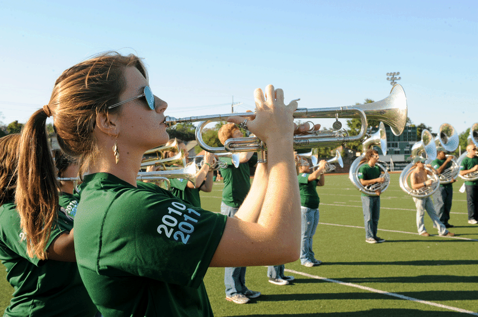

“I agree. I’m beat,” Anica said.

“We rehearsed for longer today than we did yesterday,” Jake said.

“Yes, 45 minutes longer. So we rehearsed for a total of five hours counting yesterday and today,” Anica said.

“Wait a minute you left me in the dust. How many minutes did we rehearse yesterday, and how many did we rehearse today?” Jake asked sitting down in a band chair.

“Okay, let me show you. You need an equation,” Anica said taking out a piece of paper and a pencil.

**Do you know how Anica can figure this out? You will once you know how to work with multi-step equations. Pay attention to this lesson and you will be able to figure out how long the rehearsals were at the end of the lesson.**

**_What You Will Learn_**

In this lesson you will learn how to complete the following skills.

* Solve equations involving the combining of like terms.
* Solve equations involving parentheses and the distributive property
* Solve equations involving both distributing and combining.
* Model and solve real-world problems using multi-step equations.

**_Teaching Time_**

I. **Solve Equations Involving the Combining of Like Terms**

")

\[Figure 3\]

**Consider this simple problem.**

**Suppose you bought 3 yellow peaches, 5 white peaches and 2 red apples at a fruit stand.** You could also say that you bought 8 peaches and 2 apples because:

$3 \ peaches + 5 \ peaches + 2 \ apples = 8 \ peaches + 2 \ apples$.

However, you couldn't say that bought 10 peaches. When you determine how many peaches you bought, you can add 3 yellow peaches to 5 white peaches, but you cannot add the 2 red apples to that total. That is because apples and peaches are _different_ kinds of fruit.

**When you add or subtract the terms in an expression, you can only combine** **_like terms_****.** Consider this expression:

$3p + 5 p + 2a$

This expression represents the problem above. The variable $p$ stands for peaches. The variable $a$ stands for apples.

Just as you can combine the yellow peaches with the white peaches because they are both peaches, you can combine $3p$ and $5p$ because they are like terms. Each of those terms includes the same variable, $p$. However, you could not combine $5p$ with $2a$, because they are not like terms. Each of those terms has a different variable.

**_Like terms_** **are terms that contain the same variable, and these terms can be combined.**

This shows how you could simplify the expression above by combining like terms:

$3p + 5p + 2a = 8p + 2a$.

**Let's take a look at how we can apply what we know about combining like terms to solving algebraic equations.**

Example

_Solve for $r$: $5r - r - 9 = 15$._

**First, combine the like terms—$5r$ and $r$ on the left side of the equation. It may help to remember that $r = 1r$.**

$$
\begin{align*}
5r - r - 9 & = 15\\
(5r - 1r) - 9 & = 15\\
4r - 9 & = 15
\end{align*}
$$

**Notice that 9 cannot be combined with $4r$ because they are** **_not_** **like terms.**

**Now that we have combined like terms, we can solve the equation as we would solve any two-step equation.**

**Our next step is to isolate the term with the variable, $4r$, on one side of the equation. Since 9 is** **_subtracted_** **from $4r$, we should add 9 to both sides of the equation to isolate that term.**

$$
\begin{align*}
4r - 9 & = 15\\
4r - 9 + 9 & = 15 + 9\\
4r +(-9 + 9) & = 24\\
4r + 0 & = 24\\
4r & = 24
\end{align*}
$$

Since $4r$ means $4 \times r$, we should divide each side of the equation by 4 to get the $r$ by itself on one side of the equation.

$$
\begin{align*}
4r & = 24\\
\frac{4r}{4} & = \frac{24}{4}\\
1r & = 6\\
r & = 6
\end{align*}
$$

**The value of $r$ is 6.**

Example

_Solve for $n$: $6n + 3 + 8n + 2 = 33$._

**First, combine the like terms on the left side of the equation. The terms $6n$ and $8n$ are like terms since each has the same variable, $n$. The numbers 3 and 2 are also like terms, so they can be combined as well.**

Use the **_commutative property of addition_** to help you reorder the terms being added. This property states that terms can be added in any order. Then use the **_associative property of addition_** to group the terms so like terms are being added. The associative property of addition states that the grouping of terms being added does not matter.

$$
\begin{align*}
6n + 3 + 8n + 2 & = 33\\
6n + (3 + 8n) + 2 & = 33\\
6n + (8n + 3) + 2 & = 33\\
(6n + 8n) + (3 + 2) & = 33
\end{align*}
$$

**Now, that the like terms are grouped together with parentheses, combine them.**

$$
\begin{align*}
(6n + 8n) + (3 + 2) & = 33\\
14n + 5 & = 33
\end{align*}
$$

**Now, we can solve as we would solve any two-step equation.**

**The next step is to isolate the term with the variable, $14n$, on one side of the equation. Since 5 is** **_added_** **to $14n$, we should subtract 5 from both sides of the equation to do this.**

$$
\begin{align*}
14n + 5 & = 33\\
14n + 5 - 5 & = 33 - 5\\
14n + 0 & = 28\\
14n & = 28
\end{align*}
$$

**Since $14n$ means $14 \times n$, we should divide each side of the equation by 14 to get the $n$ by itself on one side of the equation.**

$$
\begin{align*}
14 & = 28\\
\frac{14n}{14} & = \frac{28}{14}\\
1n & = 2\\
n & = 2
\end{align*}
$$

**The value of $n$ is 2.**

Let’s look at the last example.

$$
\begin{align*}
6n + 3 + 8n +2 &= 33\\
6(2) + 3 + 8(2) + 2 &= 33\\
12 + 3 + 16 + 2 &= 22\\
33 &= 33
\end{align*}
$$

**Our work is accurate and checks out.**

II. **Solving Equations Involving Parentheses and the Distributive Property**

You already know that some number properties can help you solve equations.

The **_distributive property_** may also help you solve some equations. This property states that when a factor is multiplied by the sum of two numbers, we can multiply each of the two numbers by that factor and then add them.

Examples: $7 \times (4+k) = (7 \times 4) + (7 \times k) = 28 + 7k$

$2(a + 3) = (2 \times a) + (2 \times 3) = 2a + 6$

Multiplication can also be distributed over subtraction.

Examples: $7 \times (4 - k) = (7 \times 4) - (7 \times k) = 28 - 7k$

$2(a - 3) = (2 \times a) - (2 \times 3) = 2a - 6$

Let's see how the distributive property can help us solve some multi-step equations.

Example

_Solve for $k$: $5(3 + k) = 45$_

Apply the distributive property to the left side of the equation. Multiply each of the two numbers inside the parentheses by 5 and then add those products.

$$
\begin{align*}
5(3 + k) &= 45\\
(5 \times 3) + (5 \times k) &= 45\\
15 + 5k &= 45
\end{align*}
$$

Now, solve as you would solve any two-step equation. To get $5k$ by itself on one side of the equation, subtract 15 from both sides.

$$
\begin{align*}
15+5k &= 45\\
15-15+5k &= 45-15\\
0+5k &= 30\\
5k &= 30
\end{align*}
$$

To get $k$ by itself on one side of the equation, divide both sides by 5.

$$
\begin{align*}
5k &= 30\\
\frac{5k}{5} &= \frac{30}{5}\\
1k &= 6\\
k &= 6
\end{align*}
$$

**The value of $k$ is 6.**

Example

$2(y - 9) = 40$

Now we can distribute the two by multiplying it by both of the terms inside the parentheses. Notice that the second term has a subtraction sign in front of it. Remember to include that sign when we multiply.

$2y - 18 = 40$

Next, we solve this for $y$ as we would with any two step equation.

$$
\begin{align*}
2y - 18 &= 40\\
2y - 18 + 18 &= 40 + 18\\
2y &= 58\\
y &= 29
\end{align*}
$$

**The value of $y$ is 29.**

Sometimes, there will be negative numbers that will need to be worked with in an equation. Let’s look at an example like this.

Example

_Solve for $x$: $3(3 - x) =12$_

Apply the distributive property to the left side of the equation. Multiply each of the two numbers inside the parentheses by 3 and then subtract those products. It may help you to remember that $x = 1x$.

$$
\begin{align*}
3(3-x) &= 12\\
3(3 - 1x) &= 12\\
(3 \cdot 3) - (3 \cdot 1x) &= 12\\
9 - 3x &= 12
\end{align*}
$$

Now, solve as you would solve any two-step equation. We need to first get the term that includes a variable, $3x$, by itself on one side of the equation. In the equation, $3x$ is subtracted from 9. Subtracting $9 - 3x$ is the same as adding $9 + (-3x)$. Rewrite the left side of the equation to show that 9 is being added to $-3x$, and then subtract 9 from both sides.

$$
\begin{align*}
9 - 3x &= 12\\
9 + (-3x) &= 12\\
9 - 9 + (-3x) &= 12 - 9\\
0 + (-3x) &= 3\\
-3x &= 3
\end{align*}
$$

To get $x$ by itself on one side of the equation, divide both sides by -3. You will need to use what you know about dividing integers to help you. For example, you know that when you divide two negative integers, the quotient will be positive. Since you know that $-3 \div (-3) = 1$, you also know that $-3x \div (-3) = 1x$. To review how to compute with integers, look back at Lessons 2.5 and 2.6.

$$
\begin{align*}
-3x &= 3\\
\frac{-3x}{-3} &= \frac{3}{-3}\\
1x &= -1\\
x &= -1
\end{align*}
$$

**The value of $x$ is -1.**

You can see that we apply the same steps when working with a negative term as we do when working with positive terms. The key is to keep everything straight and follow the steps.

III. **Solve Equations Involving Both Distributing and Combining**

To solve some multi-step equations you will need to use the distributive property and combine like terms. When this happens, you will see that there is more than one term with the same variable or there is more than one number in the equation. You always want to combine everything that you can before moving on to solving the equation. Let’s start by looking at an example.

Example

_Solve for $m$: $6(1 +2m) -3m = 24$_

Apply the distributive property to the left side of the equation. Multiply each of the two numbers inside the parentheses by 6 and then add those products.

$$
\begin{align*}
6(1 + 2m) - 3m &= 24\\
(6 \times 1) + (6 \times 2m) - 3m &=24\\
6 + 12m - 3m &= 24
\end{align*}
$$

Next, subtract the like terms—$12m$ and $3m$—on the left side of the equation.

$$
\begin{align*}
6 + 12m - 3m &= 24\\
6 + (12m - 3m) &= 24\\
6 + 9m &= 24
\end{align*}
$$

Finally, solve as you would solve any two-step equation. Subtract 6 from both sides of the equation.

$$
\begin{align*}
6 + 9m &= 24\\
6-6 + 9m &= 24-6\\
0 + 9m &= 18\\
9m &= 18
\end{align*}
$$

Now, divide both sides of the equation by 9.

$$
\begin{align*}
9m &= 18\\
\frac{9m}{9} &= \frac{18}{9}\\
1m &= 2\\
m &= 2\\
\end{align*}
$$

**The value of $m$ is 2.**

Example

_Solve for $b$: $-4(2 + 3b) + 5b = 13$_

Apply the distributive property to the left side of the equation. Multiply each of the two numbers inside the parentheses by -4 and then add those products.

$$
\begin{align*}
-4(2 + 3b) + 5b &= 13\\
(-4 \times 2) + (-4 \times 3b) + 5b &= 13\\
-8 + (-12b) + 5b &= 13
\end{align*}
$$

Next, add the like terms on the left side of the equation. To add those like terms, $-12b$ and $5b$, you will need to use what you know about adding integers. To review how to add and subtract integers, look back at Lesson 2.5.

$$
\begin{align*}
-8 + (-12b) + 5b &= 13\\
-8 + (-12b + 5b) &= 13\\
-8 + (-7b) &= 13
\end{align*}
$$

Finally, solve as you would solve any two-step equation. Since -8 is added to $(-7b)$, you can subtract -8 from both sides of the equation to solve it.

$$
\begin{align*}
-8 + (-7b) &= 13\\
-8 - (-8) + (-7b) &= 13 - (-8)\\
(-8 + 8) + (-7b) &= 13 + 8\\
0 + (-7b) &= 21\\
-7b &= 21
\end{align*}
$$

Now, divide both sides of the equation by -7.

$$
\begin{align*}
-7b &= 21\\
\frac{-7b}{-7} &= \frac{21}{-7}\\
1b &= -3\\
b &= -3
\end{align*}
$$

**The value of $b$ is -3.**

The skills you have learned in this lesson can also help you solve real-world problems. Let's take a closer look at that now.

IV. **Model and Solve Real World Problems Using Multi-Step Equations**

Sometimes, you can write a multi-step equation to represent a problem. If so, you can solve the problem by solving that equation. Think back to the key words necessary when writing equations. Then break down the problem one step at a time to write the equation. Then you can use what you have learned to solve the equation.

_Yesterday, Tanya biked 3 more miles than she biked today. She biked a total of 13 miles on both days._

_a. Let $t$ stand for the number of miles Tanya biked today. Write an algebraic equation to represent the number of miles Tanya biked on both days._

_b. Find the number of miles Tanya biked today._

_c. Find the number of miles Tanya biked yesterday._

**Consider part** **_a_** **first.**

You know that $t$ represents the number of miles Tanya biked today. Use that variable to write an expression for the number of miles Tanya biked yesterday.

$$
\begin{align*}
& Yesterday, \ Tanya \ biked \ \underline{3} \ \underline{more \ldots than} \ she \ biked \ \underline{today}.\\
& \qquad \qquad \qquad \qquad \qquad  \downarrow \qquad \ \ \downarrow \qquad \qquad \qquad \qquad  \downarrow\\
& \qquad \qquad \qquad \qquad \qquad  \ 3 \qquad  \ + \qquad \qquad \qquad \quad \ \ t
\end{align*}
$$

So, you know that Tanya biked $t$ miles today and $3 + t$ miles yesterday. You also know that she biked a _total_ of 13 miles on both days. Use this information to write an addition equation for this problem.

$$
\begin{align*}
&(\text{miles biked today}) + (\text{miles biked yesterday}) = (\text{total miles biked})\\
& \qquad \qquad \downarrow \qquad \qquad \downarrow \ \ \qquad \qquad \quad \downarrow \qquad \qquad \ \ \downarrow \qquad \qquad \ \ \downarrow\\
& \qquad \qquad \ t \qquad \quad \ \ + \qquad \qquad \ \ 3 + t \qquad \quad \ \ = \qquad \qquad 13
\end{align*}
$$

So, this problem can be represented by the equation, $t + 3 + t = 13$.

**Next, consider part** **_b_****.**

The variable $t$ represents the number of miles Tanya biked today. So, solve the equation for $t$.

First, use the commutative property of addition to rearrange the terms being added so it is easier to see how to add the like terms.

$$
\begin{align*}
t + (3 + t) &= 13\\
t + (t + 3) &= 13
\end{align*}
$$

Now, add the like terms on the left side of the equation.

$$
\begin{align*}
t + t + 3 &= 13\\
(t + t) + 3 &= 13\\
2t + 3 &= 13
\end{align*}
$$

Solve the equation for $t$ as you would solve any two-step equation. Subtract 3 from both sides of the equation.

$$
\begin{align*}
2t + 3 &= 13\\
2t + 3 - 3 &= 13 - 3\\
2t + 0 &= 10\\
2t &= 10
\end{align*}
$$

Then, divide both sides of the equation by 2.

$$
\begin{align*}
2t &= 10\\
\frac{2t}{2} &= \frac{10}{2}\\
1t &= 5\\
t &= 5
\end{align*}
$$

The value of $t$ is 5, so Tanya biked 5 miles today.

**Consider part** **_c_** **next.**

In part _a_, you determined that Tanya biked $3 + t$ miles yesterday. Since $t = 5$, substitute 5 for $t$ in the expression to find how many miles she biked yesterday.

$3 + t = 3 + 5 = 8$

**Tanya biked 8 miles yesterday.**

**Now let’s use what we have learned to work on the problem from the introduction.**

Real-Life Example Completed
---------------------------

**_Band Practice_**

**Here is the original equation once again. First, reread it. Then name the variable that you are looking to figure out and write an equation. Next, solve the equation and write the two rehearsal times down. Your answer will have three parts, an equation and two different rehearsal times.**

“Wow, that was quite a day rehearsal,” Jake said as he put his things away in the band room.

“I agree. I’m beat,” Anica said.

“We rehearsed for longer today than we did yesterday,” Jake said.

“Yes, 45 minutes longer. So we rehearsed for a total of five hours counting yesterday and today,” Anica said.

“Wait a minute you left me in the dust. How many minutes did we rehearse yesterday, and how many did we rehearse today?” Jake asked sitting down in a band chair.

“Okay, let me show you. You need an equation,” Anica said taking out a piece of paper and a pencil.

**_Solution to Real – Life Example_**

**First, we need to name the variable. We are looking to figure out times, so we can use $t$ as our variable.**

$t = time$

**Next, we can write an equation. We know that there are two times.**

$t + t$

**But also, one day was 45 minutes longer.**

$t + t + 45$

**The total sum of time is 5 hours. We need to make sure both our units are the same, so we convert 5 hours into minutes and write 300 minutes.**

$t + t + 45 = 300$

**Here is our equation.**

**Next, we solve it for the two times.**

$$
\begin{align*}
t + t + 45 &= 300\\
2t &= 300 - 45\\
2t &= 255\\
t &= 127.5 \ minutes
\end{align*}
$$

**This is the time that the band rehearsed yesterday. They rehearsed 45 more minutes today. We add 45 to the total time from yesterday.**

$127.5 + 45 = 172.5 \ minutes$

Vocabulary
----------

Here are the vocabulary words that are found in this lesson.

__Like Terms__

terms that include a common variable.

__Commutative Property of Addition__

states that the order that you add different numbers does not change the sum.

__Associative Property of Addition__

states that you can change the groupings of numbers being added without changing the sum.

__Distributive Property__

states that you can multiply a term outside of a set of parentheses with the terms inside the parentheses to simplify the set of parentheses.

Time to Practice
----------------

Directions: Practice combining like terms as you simplify each expression.

1.  $8x + 3x +2$
2.  $5y-3y+8$
3.  $9x+4x-8+2x$
4.  $2y-10y+16$
5.  $3x+4x+5-6+2x$

Directions: Combine like terms and solve each equation.

6.  $8x+3x+2=24$
7.  $5y+2y+6=48$
8.  $4x-6x+3=13$
9.  $7y-10y+6=9$
10. $5x+8x+4=30$
11. $9a+3a-4=44$
12. $7a+4a+6=73$
13. $12x-14x+3=19$
14. $10y-16y+5=35$

Directions: Use the distributive property to solve each equation.

15. $2(x+3)=10$
16. $5(x+4)=25$
17. $9(x-3)=27$
18. $7(x+5)=70$
19. $5(x-6)=35$
20. $8(y-4)=40$

Directions: Distribute and combine like terms and then solve each equation.

21. $x+8(x+2)=53$
22. $2y+6(y+3)=34$
23. $4y+2(y-2)=8$
24. $9y+3(y-6)=30$

</article>

### 3.3 Solving Equations with the Variable on Both Sides

<article>

Introduction
------------

**_Fundraising_**

“I really hope that we make enough to get the blue ones,” Josie said to Jake and Karen at lunch.

“Me too,” Karen said.

“I was sick a lot of the time, so I didn’t sell as many boxes as I’d hoped to,” Jake sighed.

“That’s okay Jake. Those things happen,” Karen said smiling.

That afternoon after practice, Karen went to sort through the orders that had come in. She began counting all of the sales that the students had made. She discovered that she and Josie had sold the same amount of boxes. Josie sold thirty-six more boxes than Jake after all, Jake had been sick. She sold three times as many as Jake did. Karen began to figure out how many boxes Jake had sold.

**Can you figure this out? You will need to understand how to work with variables in a new way to write an equation and solve it. Pay attention to this lesson and at the end of it you will be able to figure out how many boxes Jake sold as well as how many boxes the girls sold.**

**_What You Will Learn_**

In this lesson, you will learn how to complete the following tasks.

* Solve equations with the variable on both sides.
* Solve equations with the variable on both sides and parentheses on one or both sides.
* Recognize equations with infinite solutions and with no solutions.
* Model and solve real-world problems using equations with the variable on both sides.

**_Teaching Time_**

I. **Solve Equations with the Variable on Both Sides**

**You already know the basic strategy for solving an algebraic equation. Let’s review this for a moment.**

Consider the problem, $12 + t = 30$. **The strategy for solving this equation is to use inverse operations to isolate the variable, $t$, on one side of the equation. Since 12 is added to $t$, you would subtract 12 from both sides of the equation to get $t$ by itself.**

$$
\begin{align*}
12 + t & = 30\\
12 - 12 + t &= 30 - 12\\
0 + t &= 18\\
t &= 18
\end{align*}
$$

**What if you needed to solve an equation like this?**

$12 + t = 30 + 3t$

The variable, $t$, is on both sides of the equation. If you subtract 12 from both sides of the equation, the variable will _still_ be on both sides of the equation.

$$
\begin{align*}
12 + t &= 30 + 3t\\
12 - 12 + t &= 30 - 12 + 3t\\
0 + t &= 18 + 3t\\
t &= 18 + 3t
\end{align*}
$$

This lesson will introduce strategies for solving multi-step equations in which the variable is on both sides of the equation.

**How do we solve an equation with variables on both sides of the equation?**

To solve an equation that has the same variable on both sides of it, you will use the same basic strategy you already know. You will use inverse operations to isolate the variables on one side of the equation. You will do this by using inverse operations to get all the terms that include variables on one side of the equation and using inverse operations to get all the numerical terms on the other side. Once you do this, you will be able to solve for the variable.

**Think about it logically and it makes perfect sense. You get the variables together on one side of the equation, and then you get the numbers together on the other side of the equation. Once you have done this, you can combine like terms and solve for the value of the variable.**

Example

_Solve for $t$: $12 + t = 30 + 3t$._

The variable, $t$, is on both sides of the equation. We can treat terms with variables the same as we treat numbers. That is, we can use inverse operations to get all of the terms with the variable, $t$, on one side of the equation. So, just as we could subtract 12 from both sides of the equation to get all of the numerical terms on the right side of the equation, we could subtract $t$ from both sides of the equation to get all of the terms with variables on the _right_ side of the equation.

Alternatively, we could subtract $3t$ from both sides of the equation to get all of the terms with variables on the _left_ side of the equation. It does not matter which of these steps we take. Either will result in the correct answer. However, since it is easier to subtract $3t - t$ than it is to subtract $t - 3t$, let's subtract $t$ from both sides of the equation. Remember, $t = 1t$.

$$
\begin{align*}
12 + t &= 30 + 3t\\
12 + t - t &= 30 + 3t - t\\
12 + 0 &= 30 + 2t\\
12 &= 30 + 2t
\end{align*}
$$

Now, the only variable is on the right side of the equation. So, let's get all the numerical terms on the left side of the equation. Since 30 is added to $2t$, we can get $2t$ by itself on the right side of the equation by subtracting 30 from both sides of the equation. Remember, subtracting 30 from 12 is the same as adding -30 to 12.

$$
\begin{align*}
12 &= 30 + 2t\\
12 - 30 &= 30 -30 + 2t\\
12 + (-30) &= 0 + 2t\\
-18 &= 2t
\end{align*}
$$

Now, we can use inverse operations to get the $t$ by itself on one side of the equation. Let's divide both sides by 2 to do that. Doing so involves dividing a negative integer, -18, by a positive integer, 2.

$$
\begin{align*}
-18 &= 2t\\
\frac{-18}{2} &= \frac{2t}{2}\\
-9 &= 1t\\
-9 &= t
\end{align*}
$$

**The value of $t$ is -9.**

Example

$6x + 1 = 8x + 3$

Let’s break down working on this problem. First, we need to move the terms with variables to the same side of the equation. Let’s move the $6x$. We can do this by using an inverse operation. We subtract $6x$ from both sides of the equation.

$$
\begin{align*}
6x + 6x + 1 &= 8x - 6x + 3\\
1 &= 2x + 3
\end{align*}
$$

Here we performed the inverse operation and then simplified the equation. Now we can solve this just as we would any other two step equation. Take a look and be sure to watch out if you end up working with negative numbers. Don’t mix up the signs!

$$
\begin{align*}
1 &= 2x + 3\\
1 - 3 &= 2x + 3 - 3\\
-2 &= 2x\\
-1 &= x
\end{align*}
$$

**The value of $x$ is -1.**

II. **Solve Equations with Variables on Both Sides and Parentheses on One of Both Sides**

Remember the last lesson when you had to solve equations that had parentheses in them? Well, we can have parentheses in equations with variables on both sides of the equation too. The thing to remember is that the **_distributive property_** is very helpful in solving these equations.

Let’s look at an example.

Example

_Solve for $a$: $4a + 16 =13a - (2a + 3a)$_

**Our first step should be to simplify the expression on the right side of the equation. According the order of operations, we should combine the like terms inside the parentheses first. Then we can simplify the rest of that expression,** like this:

$$
\begin{align*}
4a + 16 &= 13a - (2a + 3a)\\
4a + 16 &= 13a - 5a\\
4a + 16 &= 8a
\end{align*}
$$

**Now, we notice that the variable, $a$, is on both sides of the equation. We can use inverse operations to get all of the terms with the variable, $a$, on one side of the equation. Since there is a number on the left side of the equation and there is no number on the right side of the equation, it is easier to try to get all of the variable terms on the right side of the equation. We can get all of the variable terms on the right side of the equation by subtracting $4a$ from both sides.**

$$
\begin{align*}
4a + 16 &= 8a\\
4a - 4a + 16 &= 8a -4a\\
0 + 16 &= 4a\\
16 &= 4a
\end{align*}
$$

**Now, the only term with a variable, $4a$, is on the right side of the equation. The only numerical term, 16, is on the left side of the equation. To solve for $a$, we can divide both sides of the equation by 4.**

$$
\begin{align*}
16 &= 4a\\
\frac{16}{4} &= \frac{4a}{4}\\
4 &= 1a\\
4 &= a
\end{align*}
$$

**The value of $a$ is 4.**

**Now, let's take a look at an equation that includes parentheses on both sides of the equation.** You will notice that this problem also requires us to use the distributive property. It states that when a factor is multiplied by the sum of two numbers, we can multiply each of the two numbers by that factor and then add them. In this way we eliminate the parentheses and simplify the expression or equation.

Example

_Solve for $s$: $3(s + 2) - 6 = 21 - (13s - 12s)$_

**We can simplify the expressions on both the left and right sides of the equation. So, our first step should be to apply the distributive property to the left side of the equation.**

$$
\begin{align*}
3(s + 2) - 6 &= 21 - (13s - 12s)\\
(3 \times s) + (3 \times 2) - 6 &= 21 - (13s - 12s)\\
6s + 6 - 6 &= 21 - (13s - 12s)
\end{align*}
$$

**Now, we can subtract like terms on the left side of the equation to simplify that expression. The two numbers—6 and 6—are like terms.**

$$
\begin{align*}
6s + (6-6) &= 21 - (13s - 12s)\\
6s + 0 &= 21 - (13s - 12s)\\
6s &= 21 - (13s - 12s)
\end{align*}
$$

**Now, we can simplify the expression on the right side of the equation. According the order of operations, we should do the computation that is inside the parentheses first, like this:**

$$
\begin{align*}
6s &= 21 - (13s - 12s)\\
6s &= 21 - s
\end{align*}
$$

**Now, we notice that the variable, $s$, is on both sides of the equation. We can use inverse operations to get all of the terms with the variable, $s$, on one side of the equation. Since there is a number on the right side of the equation and there is no number on the left side of the equation, we should try to get all of the variable terms on the left side of the equation. We can do this by adding $s$ to both sides of the equation.**

$$
\begin{align*}
6s &= 21 - s\\
6s + s &= 21 - s + s\\
7s &= 21 + (-s + s)\\
7s &= 21 + 0\\
7s &= 21
\end{align*}
$$

Now, the only term with a variable, $7s$, is on the left side of the equation. The only numerical term, 21, is on the right side of the equation. To solve for $s$, we can divide both sides of the equation by 7.

$$
\begin{align*}
7s &= 21\\
\frac{7s}{7} &= \frac{21}{7}\\
1s &= 3\\
s &= 3
\end{align*}
$$

**The value of $s$ is 3.**

In these examples, an equation has only one solution. Some equations have more than one solution and some equations don’t have a solution. Let’s examine this concept further.

III. **Recognize Equations with Infinite Solutions and with No Solutions**

Most of the time, if you are given an equation with only one variable, you will be able to find a single solution. That is, you will be able to find one number that describes the value of the variable.

Sometimes, though, you may solve an equation only to discover that it has no solution. By that, we mean that no value for the variable will make the equation true. Let's take a look at an example of one of these types of problems.

Example

_Does this equation have one solution or does it have no solution?_

$3(2x + 1) = 6(x + 1)$

**Since we are asked to determine if there is a solution for this equation, we can use the $\overset{?}=$ symbol instead of the equal sign. This symbol means that we do not yet know if the values on each side are equal or not.**

First, let's use the distributive property to simplify the expressions on both sides.

$$
\begin{align*}
3(2x + 1) & \overset{?}= 6(x + 1)\\
(3 \cdot 2x) + (3 \cdot 1) & \overset{?}= (6 \cdot x) + (6 \cdot 1)\\
6x + 3 & \overset{?}= 6x + 6
\end{align*}
$$

Now, we notice that the variable, $x$, is on both sides of the equation. Our next step would be to try to use inverse operations to get all of the terms with the variable, $x$, on one side of the equation. So, we would subtract $6x$ from both sides of the equation, like this:

$$
\begin{align*}
6x+3 & \overset{?}= 6x+6\\
6x - 6x + 3 & \overset{?}= 6x - 6x + 6\\
0 + 3 & \overset{?}= 0 + 6\\
3 & \overset{?}= 6\\
3 & \neq 6
\end{align*}
$$

**Something unusual happened when we tried to solve this equation. The $6x$ terms cancelled each other. This left no variables in the equation.** Also, the numbers that remained on either side of the equal sign were not equal, because 3 is not equal to 6. That is why we used the not equal to $(\neq)$ symbol.

The fact that the values on either side of the equation are not equal is a hint that this equation has no solution. That means that there is no value of $x$ that will make this equation true. Let's try substituting several values of $x$ into the original equation to see if you can find a number that makes the equation true. For example, try substituting a positive integer, such as 1, and a negative integer, such as -2, for $x$.

$$
\begin{align*}
& \text{Let's try substituting 1 for} \ x: \qquad \text{Let's try substituting -2 for} \ x:\\
& \ \ 3(2x + 1) \overset{?}= 6(x + 1) \qquad \qquad \qquad \quad \ 3(2x + 1) \overset{?}= 6(x + 1)\\
& 3(2 \cdot 1 + 1) \overset{?}= 6(1+1) \qquad \qquad \quad \ \ 3[2 \cdot (-2) + 1 \overset{?}= 6(-2 + 1)\\
& \quad \ 3(2+1) \overset{?}= 6(2) \qquad \qquad \qquad \qquad \quad 3(-4 + 1) \overset{?}= 6(-1)\\
& \qquad \quad 3(3) \overset{?}= 12 \qquad \qquad \qquad \qquad \qquad \quad \ \ 3(-3) \overset{?}= -6)\\
& \qquad \qquad \ 9 \overset{?}= 12 \qquad \qquad \qquad \qquad \qquad \qquad \ \ -9 \overset{?}= -6\\
& \qquad \qquad \ 9 \neq 12 \qquad \qquad \qquad \qquad \qquad \qquad \quad  -9 \neq -6
\end{align*}
$$

We could keep substituting integers—positive integers, negative integers, or zero—for $x$. We could even try substituting fractions or decimals for $x$. You may wish to try a few more values before continuing. However, no matter how many values you try, you will never find a value for $x$ that makes this equation true.

**For this reason, we can say that this equation has no solution.**

**Sometimes, we can have an equation that has an infinite number of solutions.**

Example

_Does this equation have one solution, no solution, or an infinite number of solutions?_

$2x - x + 1 = x + 1$

**Since we are asked to determine if there is a solution for this equation, we can use the $\overset{?}=$ symbol instead of the equal sign.**

First, let's combine like terms to simplify the expression on the left side.

$$
\begin{align*}
2x - x + 1 & \overset{?}= x + 1\\
x + 1 & \overset{?}= x + 1
\end{align*}
$$

Now, we notice that the variable, $x$, is on both sides of the equation. Our next step would be to try to use inverse operations to get all of the terms with the variable, $x$, on one side of the equation. So, we would subtract $x$ from both sides of the equation, like this:

$$
\begin{align*}
x + 1 & \overset{?}= x + 1\\
x - x + 1 & \overset{?}= x - x + 1\\
0 + 1 & \overset{?}= 0 +1\\
1 & \overset{?}= 1\\
1 & = 1
\end{align*}
$$

**Something unusual happened when we tried to solve this equation. The $x$ terms cancelled each other. This left no variables in the equation. However, unlike in the first example, the numbers that remained on either side of the equal sign were, in fact, equal, because 1 is equal to 1.**

**The fact that the values on either side of the equation are equal but that we did not find a single value for $x$ is a hint that this equation has an infinite number of solutions. That means that any value of $x$ will make this equation true.**

Let's try substituting several values of $x$ into the original equation to see if you can find a number that does not make the equation true. For example, try substituting a positive integer, such as 10, and a negative integer, such as -5.

$$
\begin{align*}
& \text{Let's try substituting 10 for} \ x: \qquad \text{Let's try substituting -5 for} \ x:\\
& \quad \ \ 2x - x + 1 \overset{?}= x + 1 \qquad \qquad \qquad \qquad \quad 2x - x + 1 \overset{?}= x + 1\\
& 2(10) - 10 + 1 \overset{?}= 10 + 1 \qquad \qquad \quad \ \ 2(-5) - (-5) + 1 \overset{?}= -5 + 1\\
& \quad 20 - 10 + 1 \overset{?}= 10 + 1 \qquad \qquad \qquad \quad \ \ -10 + 5 + 1 \overset{?}= -4\\
& \qquad \quad \ 10 + 1 \overset{?}= 11 \qquad \qquad \qquad \qquad \qquad \quad \ -5 + 1 \overset{?}= -4\\
& \qquad \qquad \quad 11 \overset{?}= 11 \qquad \qquad \qquad \qquad \qquad \qquad \quad \ -4 \overset{?}= -4\\
& \qquad \qquad \quad 11 = 1 \qquad \qquad \qquad \qquad \qquad \qquad \quad \ \ -4 = -4
\end{align*}
$$

We could keep substituting integers—positive integers, negative integers, or zero—for $x$. We could even try substituting fractions or decimals for $x$. You may wish to try a few more values before continuing. **If you do, you will find that no matter which number you substitute for $x$, it makes the equation true.**

**For this reason, we can say that this equation has an infinite number of solutions.**

IV. **Model and Solve Real – World Problems Using Equations with the Variable on Both Sides**

Sometimes, you can write an equation that has variables on both sides to represent a problem. If so, you can solve the problem by solving that equation.

_Joanna and her twin brother Julian are the same age. Joanna is 7 years older than her cousin William. Julian is twice as old as William. How old is William? How old are the twins?_

_a. Let $w$ represent William's age in years. Write an algebraic equation to represent this problem._

_b. Find William's age._

_c. Find the age of the twins Joanna and Julian._

**Consider part** **_a_** **first.**

You know that $w$ represents William's age in years. Use that variable to write an expression for Joanna's age.

$$
\begin{align*}
& Joanna \ is \ \underline{7} \ years \ \underline{older \ than} \ her \ cousin \ \underline{William}.\\
& \qquad \qquad \downarrow \qquad \qquad \quad \downarrow \qquad \qquad \qquad \quad \ \ \downarrow\\
& \qquad \qquad \ 7 \qquad \quad \quad \ \ + \qquad \qquad \qquad \quad \ w
\end{align*}
$$

Now, write an expression for Julian's age.

$$
\begin{align*}
& Julian \ is \ \underline{twice \ as \ old \ as \ William}.\\
& \qquad \qquad \qquad \qquad \downarrow\\
& \qquad \qquad \qquad \qquad 2w
\end{align*}
$$

Joanna's age in years can be represented as $7 + w$. Julian's age in years can be represented as $2w$. Since Joanna and Julian are the same age, you can write an equation by setting those two expressions equal.

$7 + w = 2w$

**Next, consider part** **_b_****.**

The variable $w$ represents William's age. To find William's age, solve the equation for $w$ as you would solve any equation in which the variable is on both sides.

Since there is a number on the left side of the equation and there is no number on the right side of the equation, it is easiest for us to try to get all of the variable terms on the right side of the equation. We can get all of the variable terms on the right side of the equation by subtracting $w$ from both sides.

$$
\begin{align*}
7 + w &= 2w\\
7 + w - w &= 2w - w\\
7 &= w
\end{align*}
$$

**The value of $w$ is 7, so William is 7 years old.**

**Consider part** **_c_** **next.**

In part _a_, you determined that Joanna's age in years can be represented as $7 + w$. Since $w = 7$, you can substitute 7 for $w$ in that expression to find Joanna's age.

$7 + w = 7 + 7 = 14$

So, Joanna is 14 years old. Julian has the same age as Joanna, so he is also 14 years old. You could check this answer by substituting 7 for $w$ into the expression, $2w$, which represents Julian's age.

$2w = 2 \times 7 =14$

**You found the same age for Joanna as you found for Julian, which makes sense since they are twins. Each is 14 years old.**

**Now let’s go back to the problem from the introduction and work on solving this problem by using an equation with variables on both sides.**

Real-Life Example Completed
---------------------------

**_Fundraising_**

**Here is the original problem once again. Reread it and then write an equation to represent the known and unknown information. Figure out how many boxes Jake sold and how many boxes the girls sold. There are three parts to your answer.**

The band is selling popcorn for a fundraiser. For the past few weeks, the students have been out there taking orders with the hope of raising enough money for new uniforms.

“I really hope that we make enough to get the blue ones,” Josie said to Jake and Karen at lunch.

“Me too,” Karen said.

“I was sick a lot of the time, so I didn’t sell as many boxes as I’d hoped to,” Jake sighed.

“That’s okay Jake. Those things happen,” Karen said smiling.

That afternoon after practice, Karen went to sort through the orders that had come in. She began counting all of the sales that the students had made. She discovered that she and Josie had sold the same amount of boxes. Josie sold thirty-six more boxes than Jake after all, Jake had been sick. She sold three times as many as Jake did. Karen began to figure out how many boxes Jake had sold.

**_Solution to Real – Life Example_**

**First, we write an equation.**

$x =$ **the number of boxes Jake sold-this is our unknown quantity.**

$x + 36 =$ **the number of boxes Josie sold.**

$3x =$ **the number of boxes Karen sold**

$x + 36 = 3x$

Now we solve it for $x$.

$$
\begin{align*}
x - x + 36 &= 3x - x\\
36 &= 2x\\
18 &= x
\end{align*}
$$

**Jake sold 18 boxes of popcorn.**

**Karen and Josie sold the same amount. We can use Karen’s information that she sold three times as many boxes as Jake did.**

$$
\begin{align*}
&3x\\
&3(18) = 54
\end{align*}
$$

**Josie and Karen each sold 54 boxes of popcorn.**

Vocabulary
----------

Here are the vocabulary words used in this lesson.

__Distributive Property__

states that we can simplify an expression with parentheses by multiply a term outside of the parentheses with each of the terms inside the parentheses.

__Inverse Operation__

the opposite operation

Time to Practice
----------------

Directions: Solve each equation with variables on both sides.

1.  $6x=2x+16$
2.  $5y=3y+12$
3.  $4y=y-18$
4.  $8x=10x+20$
5.  $7x=4x+24$
6.  $9y=2y-21$
7.  $-6x+22=5x$
8.  $15y=9y+36$
9.  $14x=10x-40$
10. $19y=4y-30$
11. $18x=2x-32$
12. $4x+1=2x+5$
13. $6x+4=4x+10$
14. $8x+3=5x+9$
15. $10y-4=6y-12$
16. $8x-5=10x-13$
17. $12y-8=14y+14$
18. $18x-5=20x+19$
19. $-20y+8=-8y-4$
20. $18x-4=30x+8$

Directions: Solve each equation with variables on both sides, by simplifying each equation first by using the distributive property.

21. $2(x+3)=8x$
22. $3(x+5)=-2x$
23. $9y=4(y-5)$
24. $7(x+3)=4x$
25. $8(y-2)=2y+14$
26. $9(x+4)=4x+6$

</article>

### 3.4 Solving Equations with Rational Numbers

<article>

Introduction
------------

**_The New Piece of Music_**

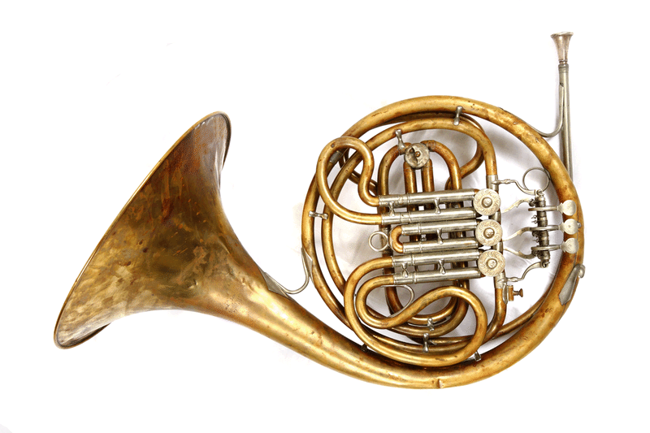

His best rehearsal was on Saturday, when he practiced for 90 minutes. On Sunday, he had a birthday party to go to, so he did not practice as long. On Monday, he had a math test to study for and so he practiced for half as long as he did on Monday.

When Jose went to band practice on Tuesday afternoon, he struggled through the piece.

“How long did you practice?” Mrs. Kline asked him.

“Well, from Saturday to Tuesday I practiced a total of 3 hours,” Jose said.

**If this is true, how long did Jose practice on Monday and Tuesday? You will need to write an equation and solve it to figure out the answer to this problem. Jose needs to practice his French horn a bit more and you will need to use the information taught in this lesson to help you figure out each dilemma.**

**_What You Will Learn_**

In this lesson, you will learn to perform the following skills.

* Solve multi-step equations involving decimals.
* Solve multi-step equations involving fractions.
* Solve multi-step equations involving multiple forms of rational numbers.
* Model and solve real-world problems using multi-step equations involving rational numbers.

**_Teaching Time_**

I. **Solve Multi-Step Equations Involving Decimals**

So far, we have focused on solving multi-step equations that contain integers. **_Integers_** **include positive whole numbers (1, 2, 3, 4, 5, $\ldots$), their opposites (-1, -2, -3, -4, -5, $\ldots$), and zero.**

Integers are examples of **_rational numbers_**. **A rational number is any number that can be written as the ratio of two integers or you can think of this in fraction form.** So, an integer such as -3, which can be written as the ratio $\frac{-3}{1}$, is a rational number.

**What are some other examples of rational numbers?**

A **_fraction,_** such as $\frac{1}{4}$, can obviously be written as the ratio of two integers. So, fractions are rational numbers.

**_A terminating decimal,_** such as 0.1, is also rational because it can be written as the ratio $\frac{1}{10}$. A **_repeating decimal,_** such as $0.\overline{3}$, is rational because even though the digit 3 repeats over and over in the decimal form, it can be expressed as the ratio of two integers: $\frac{1}{3}$.

**All integers, fractions, terminating decimals and repeating decimals are rational numbers.**

**Just as you have been solving equations with integers in them, we can also solve equations with other rational numbers in them.**

**Let’s start by looking at solving equations involving decimals.**

**You will use the same strategy to solve a multi-step equation that includes decimals that you would to solve a multi-step equation that includes only integers. You will first combine like terms or use the distributive property to simplify the equation. Then, you will use inverse operations to isolate the variable on one side of the equation.**

Example

_Solve for $x$: $3x - 2.5x + 0.5 = 4.5$_

**First, subtract the like terms—$3x$ and $2.5x$—on the left side of the equation. It may help to remember that $3x = 3.0x$.**

$$
\begin{align*}
3x - 2.5x + 0.5 &= 4.5\\
(3.0x - 2.5x) + 0.5 &= 4.5\\
0.5x + 0.5 &= 4.5
\end{align*}
$$

**_Notice that 0.5 cannot be combined with $0.5x$ because they are not like terms._**

**Now, we can solve as we would solve any two-step equation.**

The next step is to isolate the term with the variable, $0.5x$, on one side of the equation. Since 0.5 is _added_ to $0.5x$, we should subtract 0.5 from both sides of the equation.

$$
\begin{align*}
0.5x + 0.5 &= 4.5\\
0.5x + 0.5 - 0.5 &= 4.5 - 0.5\\
0.5x + 0 &= 4.0\\
0.5x &= 4
\end{align*}
$$

Since $0.5x$ means $0.5 \cdot x$, our next step is to divide each side of the equation by 0.5 to get the $x$ by itself on one side of the equation.

$$
\begin{align*}
0.5x &= 4\\
\frac{0.5x}{0.5} &= \frac{4}{0.5}\\
1x &= 8\\
x &= 8
\end{align*}
$$

**The value of $x$ is 8.**

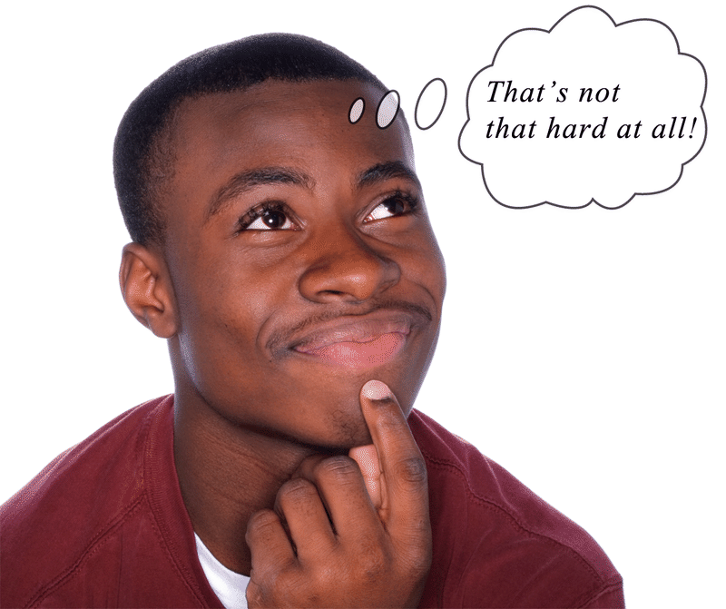

Example

_Solve for $x$: $0.1(z - 4.2) = 0.48$_

**First you can see that we have parentheses in this equation. Apply the distributive property to the left side of the equation. Multiply each of the two numbers inside the parentheses by 0.1 and then subtract those products.**

$$
\begin{align*}
0.1(z - 4.2) &= 0.48\\
(0.1 \times z) - (0.1 \times 4.2) &= 0.48\\
0.1z - 0.42 &= 0.48
\end{align*}
$$

**Now, solve as you would solve any two-step equation.** To get $0.1z$ by itself on one side of the equation, add 0.42 to both sides.

$$
\begin{align*}
0.1z - 0.42 &= 0.48\\
0.1z - 0.42 + 0.42 &= 0.48 + 0.42\\
0.1z +(-0.42 + 0.42) &= 0.9\\
0.1z + 0 &= 0.9\\
0.1z &= 0.9
\end{align*}
$$

To get $z$ by itself on one side of the equation, divide both sides by 0.1.

$$
\begin{align*}
0.1z &= 0.9\\
\frac{0.1z}{0.1} &= \frac{0.9}{0.1}\\
1z &= 9\\
z &= 9
\end{align*}
$$

**The value of $z$ is 9.**

Now that you know how to solve equations with decimals, let’s look at solving equations involving fractions.

II. **Solve Multi – Step Equations Involving Fractions**

**You will use the same strategy to solve a multi-step equation involving decimals that you would use to solve a multi-step equation involving integers or decimals. You will first combine like terms or use the distributive property to simplify the equation. Then, you will use inverse operations to isolate the variable on one side of the equation.**

Example

_Solve for $n$: $n - \frac{n}{2}-\frac{1}{12} = \frac{5}{6}$_

**First, subtract the like terms $n$ and $\frac{n}{2}$ on the left side of the equation.** It may help to remember that $\frac{n}{2} = \frac{1}{2}n$ and that $n = 1 n = \frac{2}{2}n$.

$$
\begin{align*}
n - \frac{n}{2} - \frac{1}{12} &= \frac{5}{6}\\
\left( \frac{2}{2}n - \frac{1}{2}n \right) - \frac{1}{12} &= \frac{5}{6}\\
\frac{n}{2} - \frac{1}{12} &= \frac{5}{6}
\end{align*}
$$

**The next step is to isolate the term with the variable, $\frac{n}{2}$, on one side of the equation. Since $\frac{1}{12}$ is subtracted from $\frac{n}{2}$, you should add $\frac{1}{12}$ to both sides of the equation.** In doing so, you will need to add $\frac{1}{12}$ and $\frac{5}{6}$, two fractions with unlike denominators. Before you add those fractions, you will need to give them a common denominator. That means you will need to find a common multiple of those two denominators and rewrite each fraction as an equivalent fraction with that denominator. Since the least common multiple of 12 and 6 is 12, you will need to rewrite $\frac{5}{6}$ as an equivalent fraction with a denominator of 12. You do not need to rewrite $\frac{1}{12}$ since it already has a denominator of 12.

$$
\begin{align*}
\frac{n}{2}-\frac{1}{12} &= \frac{5}{6}\\
\frac{n}{2} - \frac{1}{12} + \frac{1}{12} &= \frac{5}{6} + \frac{1}{12}\\
\frac{n}{2} + \left ( - \frac{1}{12} + \frac{1}{12} \right ) &= \frac{5}{6} + \frac{1}{12} && \frac{5}{6} = \frac{5 \times 2}{6 \times 2} = \frac{10}{12}\\
\frac{n}{2} + 0 &= \frac{10}{12} + \frac{1}{12}\\
\frac{n}{2} &= \frac{11}{12}
\end{align*}
$$

**Since $\frac{n}{2}$ means $n \div 2$, we should multiply each side of the equation by 2, or $\frac{2}{1}$, to get $n$ by itself on one side of the equation.**

$$
\begin{align*}
\frac{n}{2} &= \frac{11}{12}\\
\frac{n}{\bcancel{2}} \times \frac{\bcancel{2}}{1} &= \frac{11}{12} \times \frac{2}{1}\\
\frac{n}{1} &= \frac{22}{12}\\
n &= \frac{11}{6} = 1 \frac{5}{6}
\end{align*}
$$

**The value of $n$ is $1 \frac{5}{6}$.**

Some equations with fractions will also have a set of parentheses in them. To work with these problems, you will need to use the distributive property to simplify the equation.

Example

_Solve for $r$: $\frac{2}{3}(r + \frac{3}{5}) = 2$_

**Apply the distributive property to the left side of the equation. Multiply each of the two numbers inside the parentheses by $\frac{2}{3}$ and then add those products.**

$$
\begin{align*}
\frac{2}{3} \left ( r + \frac{3}{5} \right ) &= 2\\
\left ( \frac{2}{3} \times r \right ) + \left ( \frac{2}{\bcancel{3}} \times \frac{\bcancel{3}}{5} \right ) &= 2\\
\frac{2}{3}r + \frac{2}{5} &= 2
\end{align*}
$$

**Now, solve as you would solve any two-step equation. To get the term with the variable, $\frac{2}{3}r$, by itself on one side of the equation, subtract $\frac{2}{5}$ from both sides.** To do this, it will help to rename 2 as $\frac{10}{5}$.

$$
\begin{align*}
\frac{2}{3}r + \frac{2}{5} &= 2\\
\frac{2}{3}r + \left ( \frac{2}{5} - \frac{2}{5} \right ) &= 2 - \frac{2}{5}\\
\frac{2}{3}r + 0 &= \frac{10}{5} - \frac{2}{5}\\
\frac{2}{3}r &= \frac{8}{5}
\end{align*}
$$

Since $\frac{2}{3}r$ means $\frac{2}{3} \times r$, use the inverse of multiplication—division—and divide both sides of the equation by $\frac{2}{3}$. This will involve dividing $\frac{2}{3}r \div \frac{2}{3}$ on the left side of the equation. Remember, to divide two fractions, take the reciprocal of the divisor (the second fraction) and multiply that reciprocal by the dividend (the first fraction). So, $\frac{2}{3}r \div \frac{2}{3}r \times \frac{3}{2}$. Since you will be multiplying the left side of the equation by the reciprocal of $\frac{2}{3}$, which is $\frac{3}{2}$, you will need to multiply the right side of the equation by $\frac{3}{2}$ also.

$$
\begin{align*}
\frac{2}{3}r &= \frac{8}{5}\\
\frac{2}{3}r \div \frac{2}{3} &= \frac{8}{5} \div \frac{2}{3}\\
\frac{2}{3}r \times \frac{3}{2} &= \frac{8}{5} \times \frac{3}{2}\\
\frac{\bcancel 2}{\bcancel 3}r \times \frac{\bcancel 3}{\bcancel 2} &= \frac{24}{10}\\
1r &= \frac{12}{5}\\
r &= 2\frac{2}{5}
\end{align*}
$$

**The value of $r$ is $2 \frac{2}{5}$.**

Sometimes you will have equations with more than one type of rational number in the same equation. Let’s look at how we can work on solving these equations.

III. **Solving Multi-Step Equations Involving Multiple Forms of Rational Numbers**

You know that rational numbers include integers, fractions, and terminating decimals. Some equations may require you to work with a combination of these kinds of numbers.

Example

_Solve for $b$: $-6 \left( 1 - \frac{b}{12} \right) = \frac{2}{3}$_

**This problem involves two different kinds of rational numbers: integers (-6 and 1) and fractions $\left ( \frac{b}{12} \right .$ and $\left . \frac{2}{3} \right )$. You will need to know how to compute with fractions as well as how to compute with integers in order to solve this.**

**Apply the distributive property to the left side of the equation. Multiply each of the two numbers inside the parentheses by -6 and then subtract those products.**

$$
\begin{align*}
-6 \left (1 - \frac{b}{12} \right ) &= \frac{2}{3}\\
(-6 \times 1) - \left ( -6 \times \frac{b}{12} \right ) &= \frac{2}{3}\\
-6 - \left ( \frac{-6}{1} \times \frac{1}{12}b \right ) &= \frac{2}{3}\\
-6 - \left ( \frac{-6}{12}b \right ) &= \frac{2}{3}\\
-6 - \left ( - \frac{6}{12}b \right ) &= \frac{2}{3}\\
-6 + \left ( \frac{6}{12}b \right ) &= \frac{2}{3}
\end{align*}
$$

You may recognize immediately that the variable term, $\frac{6}{12}b$, could be simplified as $\frac{1}{2}b$ or $\frac{b}{2}$. You can wait until the problem is finished before simplifying, but if you recognize this fact, it makes sense to simplify that now. It will only make the computation easier, so simplify the variable term as $\frac{1}{2}b$.

$$
\begin{align*}
-6 + \frac{6}{12}b &= \frac{2}{3}\\
-6 + \frac{1}{2}b &= \frac{2}{3}
\end{align*}
$$

**Now, we can solve as we would solve any two-step equation. To get $\frac{1}{2}b$ by itself on one side of the equation, we can subtract -6 from both sides.**

$$
\begin{align*}
-6 + \frac{1}{2}b &= \frac{2}{3}\\
-6 - (-6) + \frac{1}{2}b &= \frac{2}{3} - (-6)\\
-6 + 6 + \frac{1}{2}b &= \frac{2}{3} + 6\\
0 + \frac{1}{2}b &= 6 \frac{2}{3}\\
\frac{1}{2}b &= 6 \frac{2}{3}
\end{align*}
$$

To get $b$ by itself, you will need to divide each side of the equation by $\frac{1}{2}$. Remember, that is the same as multiplying each side by $\frac{2}{1}$. Also, keep in mind that you will need to rewrite the mixed number $6 \frac{2}{3}$ as an improper fraction $\left ( \frac{20}{3} \right )$ before multiplying by $\frac{2}{1}$.

$$
\begin{align*}
\frac{1}{2}b &= 6 \frac{2}{3}\\
\frac{1}{2}b \times \frac{2}{1} &= 6 \frac{2}{3} \times \frac{2}{1}\\
\frac{\bcancel{1}}{\bcancel{2}}b \times \frac{\bcancel{2}}{\bcancel{1}} &= \frac{20}{3} \times \frac{2}{1}\\
1b &= \frac{40}{3}\\
b &= 13 \frac{1}{3}
\end{align*}
$$

**The value of $b$ is $13 \frac{1}{3}$.**

**Now, let's solve an algebraic equation that includes both decimals and fractions.**

Example

_Solve for $k$: $0.4k + 0.2k + \frac{3}{10} = \frac{9}{10}$._

**First, add the like terms $0.4k$ and $0.2k$ on the left side of the equation.**

$$
\begin{align*}
0.4k + 0.2k + \frac{3}{10} &= \frac{9}{10}\\
0.6k + \frac{3}{10} &= \frac{9}{10}
\end{align*}
$$

**The next step is to isolate the term with the variable, $0.6k$, on one side of the equation. We can do this by subtracting $\frac{3}{10}$ from both sides of the equation.**

$$
\begin{align*}
0.6k + \frac{3}{10} &= \frac{9}{10}\\
0.6k + \frac{3}{10} - \frac{3}{10} &= \frac{9}{10} - \frac{3}{10}\\
0.6k + 0 &= \frac{6}{10}\\
0.6k &= \frac{6}{10}
\end{align*}
$$

**Since $0.6k$ means $0.6 \times k$, we should divide each side of the equation by 0.6 to get the $k$ by itself on one side of the equation.** This will involve dividing a fraction, $\frac{6}{10}$, by a decimal, 0.6. To do this, you will need to convert both numbers to the same form. One way to do this would be to convert the fraction $\frac{6}{10}$ to a decimal. $\frac{6}{10}$ is read as “six tenths,” so the decimal form of $\frac{6}{10}$ is 0.6.

$$
\begin{align*}
0.6k &= \frac{6}{10}\\
0.6k &= 0.6\\
\frac{0.6k}{0.6} &= \frac{0.6}{0.6}\\
1k &= 1\\
k &= 1
\end{align*}
$$

**The value of $k$ is 1.**

Now let’s look at how these equations can be helpful when working with problems in the real world.

IV. **Model and Solve Real – World Problems Using Multi – Step Equations Involving Rational Numbers**

Sometimes, you can write a multi-step equation to represent a problem that involves rational numbers. If so, you can solve the problem by solving that equation.

_For a long-distance call, Guillermo's phone company charges $0.10 for the first minute and $0.05 for each minute after that. Guillermo was charged $1.00 for a long distance call he made last Friday._

_a. Write an algebraic equation that could be used to represent $m$, the length in minutes of Guillermo's $1.00 long-distance call._

_b. Determine how many minutes his $1.00 long-distance call lasted._

**Consider part** **_a_** **first.**

You know that the phone company charges $0.10 for the first minute and $0.05 for each minute after that. How could you represent that? If the company charged $0.05 for each minute the call lasted, you could represent that as $0.05 \times m$. However, the company charges $0.10 for the first minute and $0.05 for each minute _after_ that first minute.

So, a 1-minute call will cost: $\$0.10 + (\$0.05 \times 0) = \$0.10 + \$0.00 = \$0.10$.

A 2-minute call will cost: $\$0.10 + (\$0.05 \times 1) = \$0.10 + \$0.05 = \$0.15$.

A 3-minute call will cost: $\$0.10 + (\$0.05 \times 2) = \$0.10 + \$0.10 = \$0.20$.

Notice that the number you multiply by $0.05 is always 1 less than the length of the call, in minutes. If $m$ represents the length of a call in minutes, then this could be represented as: $\$0.10 + \$0.05 \times (m - 1)$.

**Write an equation that could be used to represent the cost of Guillermo's $1.00 call.**

$$
\begin{align*}
& (\text{cost of first minute}) + (\text{cost of each minute after first minute}) = (\text{total cost})\\
& \qquad \qquad \downarrow \ \ \qquad \qquad \downarrow \qquad \qquad \qquad \qquad \downarrow \qquad \quad \quad \quad \qquad \qquad \ \downarrow \qquad \ \downarrow\\
& \qquad \qquad 0.10 \qquad \ \quad + \qquad \qquad \qquad \quad 0.05(m-1) \quad \qquad \qquad \ = \quad 1.00
\end{align*}
$$

So, the equation $0.10 + 0.05(m-1) = 1.00$ represents the number of minutes that Guillermo's $1.00 phone call lasted.

**Next, consider part** **_b_****.**

To find the length of the $1.00 call in minutes, solve the equation for $m$. First, apply the distributive property to the right side of the equation.

$$
\begin{align*}
0.10 + 0.05(m-1) &= 1.00\\
0.10 + (0.05 \times m) - (0.05 \times 1) &= 1.00\\
0.10 + 0.05m - 0.05 &= 1.00
\end{align*}
$$

Use the commutative property to rearrange the terms being added so it is easier to see how to combine the like terms. Then combine the like terms.

$$
\begin{align*}
(0.10 + 0.05m) - 0.05 &= 1.00\\
(0.05m + 0.10) - 0.05 &= 1.00\\
0.05m + (0.10 - 0.05) &= 1.00\\
0.05m + 0.05 &= 1.00
\end{align*}
$$

**Now, solve as you would solve any two-step equation.** First, subtract 0.05 from both sides of the equation.

$$
\begin{align*}
0.05m + 0.05 &= 1.00\\
0.05m + 0.05 - 0.05 &= 1.00 - 0.05\\
0.05m + 0 &= 0.95\\
0.05m &= 0.95
\end{align*}
$$

Next, divide both sides of the equation by 0.05.

$$
\begin{align*}
0.05m &= 0.95\\
\frac{0.05m}{0.05} &= \frac{0.95}{0.05}\\
1m &= 19\\
m &= 19
\end{align*}
$$

**The value of $m$ is 19, so the $1.00 call lasted for 19 minutes.**

**Now let’s take a look at a problem that has fractions in it.**

_On Sunday, Leah walked 4 miles. On Monday, Leah walked one-third as many miles as she walked on Tuesday. She walked a total of 12 miles on those 3 days._

_a. Let $t$ represent the number of miles Leah walked on Tuesday. Write an algebraic equation to represent the total number of miles she walked on all 3 days._

_b. Find the number of miles Leah walked on Tuesday._

_c. Find the number of miles Leah walked on Monday._

**Consider part** **_a_** **first.**

You know that $t$ represents the number of miles Leah walked on Tuesday. Use that variable to write an expression for the number of miles Leah walked on Monday.

$$
\begin{align*}
& On \ Monday, \ Leah \ walked \ \underline{one-third \ as \ many \ miles \ as \ldots on \ Tuesday}.\\
& \qquad \qquad \qquad \qquad \qquad \qquad \qquad \qquad \qquad \qquad \downarrow\\
& \qquad \qquad \qquad \qquad \qquad \qquad \qquad \qquad \qquad \quad \frac{t}{3} \ or \ \frac{1}{3}t
\end{align*}
$$

So, you know that Leah walked 4 miles on Sunday, $\frac{1}{3}t$ miles on Monday, and $t$ miles on Tuesday. You also know that she walked a _total_ of 12 miles on all three days. Use this information to write an addition equation for this problem.

$$
\begin{align*}
& (\text{miles walked Sun.}) + (\text{miles walked Mon.}) + (\text{miles walked Tues.}) = (\text{total miles walked})\\
& \qquad \qquad \downarrow \qquad \qquad \downarrow \qquad \qquad \ \downarrow \qquad \quad \qquad \downarrow \qquad \qquad \ \downarrow \qquad \qquad \ \ \downarrow \qquad \qquad \ \ \downarrow\\
& \qquad \qquad \ 4 \qquad \quad \ \ + \qquad \qquad \frac{1}{3}t \qquad \qquad  + \qquad \qquad \ t \qquad \qquad \ = \qquad \quad \ \ 12
\end{align*}
$$

So, this problem can be represented by the equation, $4 + \frac{1}{3}t+t=12$.

**Next, consider part** **_b_****.**

The variable $t$ represents the number of miles Leah walked today. So, solve the equation for $t$. Start by adding the like terms on the left side of the equation.

$$
\begin{align*}
4 + \frac{1}{3}t + t &= 12\\
4 + \frac{1}{3}t + \frac{3}{3}t &= 12\\
4 + \frac{4}{3}t &= 12
\end{align*}
$$

Solve the equation for $t$ as you would solve any two-step equation. Subtract 4 from both sides of the equation.

$$
\begin{align*}
4 + \frac{4}{3}t &= 12\\
4 - 4 + \frac{4}{3}t &= 12-4\\
0 + \frac{4}{3}t &= 8\\
\frac{4}{3}t &= 8
\end{align*}
$$

Finally, you must divide both sides of the equation by $\frac{4}{3}$. Remember, that is the same as multiplying both sides of the equation by $\frac{3}{4}$.

$$
\begin{align*}
\frac{4}{3}t &= 8\\
\frac{4}{3}t \times \frac{3}{4} &= 8 \times \frac{3}{4}\\
\frac{\bcancel{4}}{\bcancel{3}}t \times \frac{\bcancel{3}}{\bcancel{4}} &= \frac{8}{1} \times \frac{3}{4}\\
1t &= \frac{24}{4}\\
t &= 6
\end{align*}
$$

**The value of $t$ is 6, so Leah walked 6 miles on Tuesday.**

**Consider part** **_c_** **next.**

In part _a_, you determined that Leah walked $\frac{1}{3}t$ miles on Monday. Since $t = 6$, substitute 6 for $t$ in the expression to find how many miles she walked on Monday.

$$
\frac{1}{3}t = \frac{1}{3} \times 6 = \frac{1}{3} \times \frac{6}{1} = \frac{6}{3} = 2
$$

**Leah walked 2 miles on Monday.**

**That may seem like a lot of steps, but if you just work through each part of the problem, you will be able to solve it. Now let’s go back and solve the problem from the introduction.**

Real-Life Example Completed
---------------------------

**_The New Piece of Music_**

**Here is the original problem once again. Remember that you are trying to figure out how long Jose practiced on Sunday and Monday. To do this, write an equation. Then solve it for the two times. You will have three parts to your answer.**

Jose has been playing the French horn for many years and until now, everything has been easy. Now Mrs. Kline, the band director has assigned him a new piece of music to work on and it is very tricky. Jose has been practicing the new piece.

His best rehearsal was on Saturday, when he practiced for 90 minutes. On Sunday, he had a birthday party to go to, so he did not practice as long. On Monday, he had a math test to study for and so he practiced for half as long as he did on Monday.

When Jose went to band practice on Tuesday afternoon, he struggled through the piece.

“How long did you practice?” Mrs. Kline asked him.

“Well, from Saturday to Tuesday I practiced a total of 3 hours,” Jose said.

**_Solution to the Real – Life Example_**

**First, write an equation to show what you know and what you don’t know.**

**Saturday = 90 minutes**

**$\text{Monday} = t - \text{missing time}$**

**$\text{Tuesday} = \frac{1}{2} t - \text{half the time of Monday}$**

**Total time = 3 hours**

$90 + t + \frac{1}{2} t = 3 \ hours$

**First, convert hours to minutes.**

$90 + t + \frac{1}{2} t = 180 \ minutes$

**Now we can solve the equation.**

**Monday’s time = 60 minutes**

**Tuesday’s time = 30 minutes**

Vocabulary
----------

Here are the vocabulary words that are found in this lesson.

__Integer__

the set of whole numbers and their opposites.

__Rational Numbers__

a set of numbers that includes integers, decimals, fractions, terminating and repeating decimals. These numbers can be written in fraction form.

__Fraction__

a part of a whole written using a numerator and a denominator.

__Decimal__

a part of a whole written using place value and a decimal point.

__Repeating Decimal__

a decimal where the digits repeat in a pattern and eventually end.

__Terminating Decimal__

a decimal where the digits eventually end, but where numbers do not repeat in a pattern.

Time to Practice
----------------

Directions: Solve each equation to find the value of the variable.

1.  $7n - 3.2n + 6.5 = 14.1$
2.  $0.2(3 + p) = 5.6$
3.  $s + \frac{s}{5} + \frac{2}{3} = \frac{5}{6}$
4.  $j - \frac{j}{7} - \frac{1}{2} = 11 \frac{1}{2}$
5.  $\frac{3}{4} \left( g - \frac{1}{2} \right ) = \frac{1}{8}$
6.  $-2 \left ( 1 - \frac{a}{4} \right ) = \frac{1}{8}$
7.  $0.09y - 0.08y + \frac{1}{10} = \frac{3}{10}$
8.  $.06x + .05x = .99$
9.  $\frac{1}{2}y + \frac{1}{3}y = 24$
10. $\frac{1}{4}x + \frac{1}{3} = \frac{2}{3}$
11. $\frac{1}{2}x = 18$
12. $.9x = 56$
13. $.6x + 1 = 19$
14. $\frac{1}{4}x + 2 = 19$
15. $9.05x = 27.15$

Directions: Solve each problem.

Maggie went to the mall with $d$ dollars in her wallet. She spent half of the money in her wallet at the music store. Then she spent another $6 at the book store. After going to both of those stores, she had $9 left in her wallet.

16. Remember, $d$ represents the number of dollars in Maggie's wallet when she went to the mall, before she purchased anything. Write an algebraic equation to represent this problem.
17. Find $d$, the number of dollars Maggie had in her wallet when she went to the mall.
18. Find the number of dollars Maggie spent at the music store. The cost of a taxi ride depends on the number of miles driven. The rider is charged $4.50 for the first mile and $2.50 for each mile after that. Mr. O'Connor paid $12.00 for a taxi ride last week.
19. Write an algebraic equation that could be used to represent $m$, the number of miles Mr. O'Connor traveled during his $12.00 taxi ride.
20. Determine how many miles Mr. O'Connor traveled during his $12.00 taxi ride. Each week, Darius saves some of his earnings and puts it in a bank. During week 1, Darius saved $x$ dollars. During week 2, Darius saved two-thirds as many dollars as he had during week 1. During week 3, Darius saved $10.
21. Darius saved a total of $60 during weeks 1, 2, and 3. Write an algebraic equation to represent $x$, the number of dollars Darius saved during week 1.
22. Find the number of dollars Darius saved during week 1.
23. Find the number of dollars Darius saved during week 2.

</article>

### 3.5 Solving Inequalities Using Addition or Subtraction

<article>

Introduction
------------

**_New Band Uniforms_**

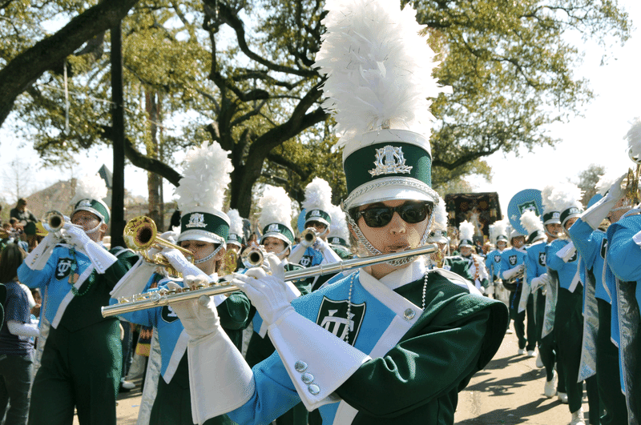

“We did very well,” she started. “We raised a total of $12,000 and we had $1,000 in our account, so we have $13,000 to spend on our uniforms. I know that may seem like a lot of money, but uniforms are expensive. We are only going to be able to purchase new jackets for everyone. If we have any money left over, we’ll buy new fingerless gloves because some of the ones we’re using look awful.”

“Mrs. Kline, did you already pick the design of the jacket?” Kayla asked from the second row.

“Yes. It was one of the ones we voted on last year,” she said holding up a picture of the shiny, new navy jacket. “Now I need a few people to figure out the cost and if we have enough for the gloves too.”

Kayla and Juan volunteered to work on the arithmetic. Here is the information Mrs. Kline gave them.

The jackets each cost $99.95.

The total budget is $13,000.

There are 144 students in the band.

“We will need to spend $11,512.80 on the jackets,” Kayla said to Juan.

“Wow, that’s a lot of money. How much can we spend on the gloves?”

**That is a great question. It is one that can be answered by writing an inequality. The students need their total to be equal to or less than $13,000. In this lesson, you will learn how to work with inequalities that have addition and/or subtraction in them. At the end of the lesson, you will use what you have learned to help Kayla and Juan with the band uniforms.**

**_What You Will Learn_**

In this lesson you will learn how to complete the following skills.

* Write and graph inequalities given verbal descriptions.
* Explain addition and subtraction properties of inequality using verbal and variable expressions.
* Solve inequalities using addition or subtraction.
* Model and solve real-world problems using inequalities involving addition or subtraction.

**_Teaching Time_**

I. **Write and Graph Inequalities Given Verbal Descriptions**

Up until this point, we have been working with equations or with quantities that are equal. Now we are going to begin working with **quantities that may or may not be equal.** These are called **_inequalities_**. Just like an equation is shown using an equal sign, an inequality is expressed through symbols too.

$>$ means “is greater than.”

$<$ means “is less than.”

$\ge$ means “is greater than or equal to.”

$\le$ means “is less than or equal to.”

Let’s begin by taking a look at some inequalities.

Example

$2 > x$

Here we have an inequality where we know that two is greater than the quantity of $x$. This problem has many different solutions. Any number that would make this a true statement can be substituted in for the variable. We know that we can have negative numbers here too. We can write our answer as a set of numbers that begins with one and goes down from there.

**The answer is {1, 0 , -1...}**

**It is good practice to always write three examples when writing a set of numbers.**

Example

$5 \le y$

Here we have an inequality that involves less than or equal to. We can substitute any value in for the variable that makes this a true statement. This means that we can start with five and go greater.

**The answer is {5, 6, 7...}**

**We can also graph inequalities on a number line.** We graph inequalities on a number line to visually show the set of numbers that would make the statement a true statement. Given that we can have less than, greater than, or less than or equal to, and greater than or equal to, we can have four different types of graphing. Here are some hints to help you with graphing inequalities.

* Use an open circle to show that a value is _not_ a solution for the inequality. You will use open circles to graph inequalities that include the symbols $>$ or $<$.
* Use a closed circle to show that a value _is_ a solution for the inequality. You will use closed circles to graph inequalities that include the symbols $\ge$ or $\le$.

Now let’s look at graphing an inequality on a number line.

Example

_Write an inequality to represent all possible values of $n$ if $n$ is less than 2. Then graph those solutions on a number line._

**First, translate the description above into an inequality. You can do this in the same way that you wrote equations. Just pay close attention to the words being used.**

$$
\begin{align*}
& \ \underline{n}, \underline{is \ less \ than} \ \underline{2}.\\
& \downarrow \qquad \quad \downarrow \quad \ \ \downarrow\\
& \ n \qquad \ < \quad \ \ 2
\end{align*}
$$

**Now, graph the inequality.**

Draw a number line from -5 to 5.

**You know that $n$ represents all numbers less than 2, and can be represented as $n<2$. So, the solutions for this inequality include all numbers less than 2. The number 2 is** **_not_** **a solution for this inequality, so draw an open circle at 2. Then draw an arrow showing all numbers less than 2. The arrow should face left because the lesser numbers are to the left on a number line.**

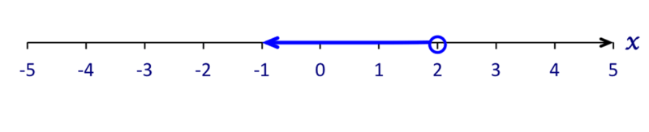

_Write an inequality to represent all possible values of $x$ if $x$ is greater than -1. Then graph those solutions on a number line._

**First, translate the description above into an inequality.**

$$
\begin{align*}
& \ \underline{x} \ \underline{is \ greater \ than} \ \underline{-1}.\\
& \downarrow \qquad \quad \ \downarrow \qquad \quad \ \ \downarrow\\
& \ x \qquad \quad > \qquad \quad -1
\end{align*}
$$

**Now, graph the inequality.**

**Draw a number line from -5 to 5.**

**You know that $x$ represents all numbers greater than -1, and can be represented as $x>-1$. So, the solutions for this inequality include all numbers greater than -1. The number -1 is** **_not_** **a solution for this inequality, so draw an open circle at -1. Then draw an arrow showing all numbers greater than -1. The arrow should face right because the greater numbers are to the right on a number line.**

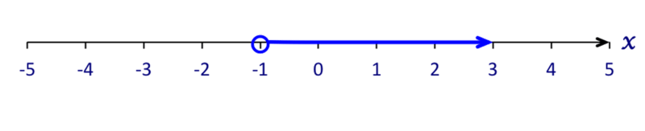

_Write an inequality to represent all possible values of $n$ if $n$ is greater than or equal to -4. Then graph those solutions on a number line._

**First, translate the description above into an inequality.**

$$
\begin{align*}
& \ \underline{n} \ \underline{is \ greater \ than \ or \ equal \ to} \ \underline{-4}.\\
& \downarrow \qquad \qquad \quad \ \ \downarrow \qquad \qquad \qquad \ \downarrow\\
& \ n \qquad \qquad \quad \ \ge \qquad \qquad \quad \ \ -4
\end{align*}
$$

**Now, graph the inequality.**

**Draw a number line from -5 to 5.**

**You know that $n$ represents all numbers greater than or equal to -4, and can be represented as $n \ge -4$. So, the solutions for this inequality include all numbers greater than or equal to -4. The number -4 is a solution for this inequality, so draw a closed circle at -4. Then draw an arrow showing all numbers greater than -4. The arrow should face right because the greater numbers are to the right on a number line.**

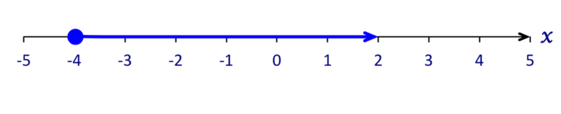

II. **Explain Addition and Subtraction Properties of Inequality, Using Verbal and Variable Expressions**

Sometimes, you will have an inequality that is not as straightforward as $x>4$. With this example, we know that the variable will be equal to any number that is greater than four. This is quite easy to work with and we can write a set of numbers to make this inequality a true statement.

**What if it isn’t that simple?**

Sometimes, you will see an inequality like this one.

$x+3>7$

Here we need to figure out the set of numbers that will make this a true statement. We are looking for a number that when added to three is greater than seven.

**To figure this out, we will need to solve this inequality.**

Solving an inequality is similar to solving an equation. Here are some number properties that can help you solve inequalities.

**The** **_addition property of inequality_** **states that if the same number is added to each side of an inequality, the sense of the inequality stays the same.** In other words, the inequality symbol does not change.

If $a>b$, then $a+c>b+c$. If $a \ge b$, then $a+c \ge b+c$.

If $a<b$, then $a+c<b+c$. If $a \le b$, then $a+c \le b+c$.

What about subtraction? Remember, subtracting a number, $c$, is the same as adding its opposite, $-c$. So, the addition property of inequality applies to subtraction as well. We can also state this as it’s own property.

**The** **_subtraction property of inequality_** **states that if the same number is subtracted from each side of an inequality, the sense of the inequality stays the same.** In other words, the inequality symbol does not change.

If $a>b$, then $a-c > b-c$. If $a \ge b$, then $a-c \ge b-c$.

If $a<b$, then $a-c < b-c$. If $a \le b$, then $a-c \le b-c$.

**Before we apply these properties to solving inequalities, let’s look at an example to see if you understand these properties and how they work.**

Example

_Identify the inequality symbol that goes in each blank._

a. 

$$
\begin{align*}
k & < m\\
k+14 & \ \underline{\;\;\;\;\;} \ k + 14
\end{align*}
$$

b. 

$$
\begin{align*}
x & \ge y\\
x - 8 & \ \underline{\;\;\;\;\;} \ y-8
\end{align*}
$$

**Consider the inequality in part** **_a_** **first.**

The number 14 is added to each side of the inequality $k<m$. The addition property of inequality states that when a number is added to both sides of the inequality, the inequality symbol does not change. So, the symbol $<$ goes in the blank. If $k<m$, then $k+14<m+14$.

**Consider the inequality in part** **_b_** **next.**

The number 8 is subtracted from each side of the inequality $x \ge y$. The subtraction property of inequality states that when a number is subtracted from both sides of an inequality, the inequality symbol does not change. So, the missing symbol is $\ge$. If $x \ge y$, then $x-8 \ge y-8$.

Now that you understand these inequality properties, let's apply them to solving some inequalities.

III. **Solve Inequalities Using Addition or Subtraction**

Applying these properties makes our work quite simple. You can think of solving inequalities in the same way that you thought of solving equations. The big difference is that your answer will be a set of numbers and not a single number. Just like with equations, you need to be sure that your answer makes the mathematical statement true. If it doesn’t, then you need to rethink your answer.

**Now let’s look at solving inequalities.**

Example

_Solve this inequality and graph its solution: $n-3<5$._

**Solve the inequality as you would solve an equation, by using inverse operations.** Since the 3 is subtracted from $n$, add 3 to both sides of the inequality to solve it. Since you are adding the same number to both sides of the inequality, the addition property of inequality applies. According to that property, we know that the inequality symbol should stay the same when we add the same number, 3, to both sides of the inequality.

$$
\begin{align*}
n-3 &< 5\\
n-3+3 &< 5+3\\
n+(-3+3) &< 8\\
n+0 &< 8\\
n &< 8
\end{align*}
$$

**Now, graph the solution. The inequality $n<8$ is read as “$n$ is less than 8.” So, the solution set for this inequality includes all numbers that are less than 8, but it does not include 8.**

Draw a number line from 0 to 10. Add an open circle at 8 to show that 7 is _not_ a solution for this inequality. Then draw an arrow showing all numbers less than 8.

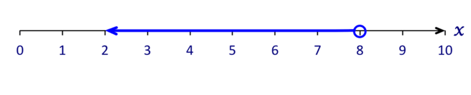

_Solve this inequality and graph its solution: $-2 \le x+4$_

**Use inverse operations to isolate the variable.** Since the 4 is added to $x$, subtract 4 from both sides of the inequality to solve it. Since you are subtracting the same number from both sides of the inequality, the subtraction property of inequality applies. According to that property, the inequality symbol should stay the same when we subtract the same number, 4, from both sides of the inequality.

$$
\begin{align*}
-2 & \le x+4\\
-2-4 & \le x+4-4\\
-2+(-4) &\le x+0\\
-6 & \le x
\end{align*}
$$

**Now, we should graph the solution.** However, before we can do that, we need to rewrite the inequality so the variable is listed first. The inequality $-6 \le x$ is read as “-6 is less than or equal to $x$.” If we list the $x$ first, we must reverse the inequality symbol. That means changing the “less than or equal to” symbol $(\le)$ to a “less than or equal to symbol” $(\ge)$.

So, $-6 \le x$ equivalent to $x \ge -6$.

This makes sense. If -6 is less than or equal to $x$, then $x$ must be greater than or equal to -6.

The inequality $x \ge -6$ is read as “$x$ is greater than or equal to -6.” So, the solutions of this inequality include -6 and all numbers that are greater than -6.

Draw a number line from -10 to 0. Add a closed circle at -6 to show that -6 _is_ a solution for this inequality. Then draw an arrow showing all numbers greater than -6.

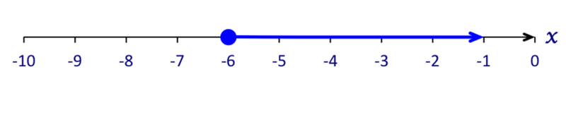

IV. **Model and Solve Real – World Problems Using Inequalities Involving Addition or Subtraction**

We can use inequalities to represent some real-world problem situations, too. Let’s look at some key words that can help us when we are faced with a real world problem.

| $>$ | $<$ | $\ge$ | $\le$ |
| --- | --- | --- | --- |
| greater than  more than | less than  fewer than | greater than or equal to  at least  no less than | less than or equal to  at most  no more than |

**The key words above provide clues about which inequality symbol you should use to represent a problem situation. While key words can be helpful, it is important not to rely on them completely. It is always most important to think about what translation of the problem makes the most sense. This is especially important because the same key words may mean different things.** For example, the key words “more than” may mean you should use a $>$ symbol or they may mean you should write an addition expression.

_Ajay is buying decorations for a school dance. He will spend $10 on balloons and $x$ dollars on streamers. At most, he could spend $18 on decorations._

_a. Write an inequality to represent $x$, the number of dollars he could spend on streamers._

_b. Could Ajay spend $8 on streamers for the dance? Explain._

**Consider part** **_a_** **first.**

Use a number, an operation sign, a variable, or an inequality symbol to represent each part of the problem. The key words “at most” indicate that you should use a $\le$ symbol.

$$
\begin{align*}
& \ \underline{\$10 \ on \ balloons} \ \underline{and} \ \underline{x \ dollars \ on \ streamers} \ \ldots \ \underline{At \ most}, \ he \ can \ spend \ \underline{\$18} \ldots \\
& \qquad \quad \ \downarrow \qquad \qquad \downarrow \qquad \qquad \quad \ \ \downarrow \qquad \qquad \qquad \qquad \downarrow \qquad \qquad \qquad \qquad  \downarrow\\
& \qquad \quad \ 10 \qquad \quad \ + \qquad \qquad \quad \ x \qquad \quad \qquad \qquad \ \ \le \qquad \quad \qquad \qquad  \ 18
\end{align*}
$$

So, the inequality $10+x \le 18$ represents $x$, the number of dollars Ajay spent on streamers.

**Next, consider part** **_b_****.**

Solve the inequality to help you.

$$
\begin{align*}
10+x & \le 18\\
10-10+x &\le 18-10\\
0+x & \le 8\\
x & \le 8
\end{align*}
$$

According to the inequality above, the number of dollars he could spend on streamers, $d$, must be less than or equal to 8.

**Since 8 is a solution for this inequality, Ajay could spend $8 on streamers.**

**You could also have found the answer for part** **_b_** **using a different strategy. Instead of solving the inequality, you could have substituted 8 for $x$ in the original inequality and checked to see if it made the inequality true or not, like this:**

$$
\begin{align*}
10+x & \le 18\\
10+8 & \le 18\\
18 & \le 18
\end{align*}
$$

Is the inequality $18 \le 18$ true? Yes, that inequality is read as “18 is less than or equal to 18.” Since 18 is indeed equal to 18, a value of 8 for $x$ makes the inequality true. This means that Ajay could spend $8 on streamers.

Example

_At the store, Talia bought one item—a $4.99 bottle of shampoo. Let $d$ represent the amount in dollars that she handed the clerk. She received more than $5 in change._

_a. Write an inequality to represent $d$, the number of dollars Talia handed the clerk to pay for the shampoo._

_b. List three possible values of $d$._

**Consider part** **_a_** **first.**

Use a number, an operation sign, a variable, or an inequality symbol to represent each part of the problem. The fact that this problem involves “change” may help you see that you should write a subtraction expression to represent the first part of this problem. To represent how much change Talia received, you will need to subtract the cost of the shampoo from the amount she handed the clerk. The key words “more than”, in this case, indicate that you should use a $>$ symbol. Use this information to write an inequality for this problem.

$$
\begin{align*}
& (\text{dollars handed to the clerk}) - (\text{cost of \$4.99 bottle of shampoo}) > (\text{\$5 in change})\\
& \qquad \qquad \qquad \downarrow \qquad \qquad \qquad \downarrow \qquad \qquad \qquad \qquad \downarrow \qquad \qquad \qquad \quad \downarrow \qquad \quad \downarrow\\
& \qquad \qquad \qquad d \qquad \qquad \qquad - \qquad \qquad \qquad \quad 4.99 \qquad \qquad \qquad > \quad \quad \ \ 5
\end{align*}
$$

So, this problem can be represented by the inequality $d-4.99 > 5$.

**Next, consider part** **_b_****.**

Solve the inequality to help you find three possible values for $d$. To solve this inequality, add 4.99 to both sides. Do not change the inequality symbol.

$$
\begin{align*}
d-4.99 & > 5\\
d - 4.99+4.99 &> 5+4.99\\
d+(-4.99+4.99) &> 5.00+4.99\\
d+0 &> 9.99\\
d &> 9.99
\end{align*}
$$

According to the inequality above, the amount Talia handed the clerk was more than $9.99.

**So, three possible values of $d$ are $10.00, $10.99, and $20.00. These are only 3 possible answers. You could choose any amount that is greater than $9.99.**

**Now let’s go back to the problem in the introduction. We can use an inequality to solve this problem.**

Real-Life Example Completed
---------------------------

**_New Band Uniforms_**

**Here is the problem from the introduction. Reread it first, then write an inequality that shows how the students can figure out the amount of money they have for the gloves. Then solve the inequality for this amount. There are two parts to your answer.**

The students at Floyd Middle School have been working hard fundraising. They sold popcorn, had a bake sale and a car wash. Finally with the time for purchasing band uniforms rapidly approaching, Mrs. Kline gathered the whole band together one afternoon to discuss their profit.

“We did very well,” she started. “We raised a total of $12,000 and we had $1,000 in our account, so we have $13,000 to spend on our uniforms. I know that may seem like a lot of money, but uniforms are expensive. We are only going to be able to purchase new jackets for everyone. If we have any money left over, we’ll buy new fingerless gloves because some of the ones we’re using look awful.”

“Mrs. Kline, did you already pick the design of the jacket?” Kayla asked from the second row.

“Yes. It was one of the ones we voted on last year,” she said holding up a picture of the shiny, new navy jacket. “Now I need a few people to figure out the cost and if we have enough for the gloves too.”

Kayla and Juan volunteered to work on the arithmetic. Here is the information Mrs. Kline gave them.

The jackets each cost $99.95.

The total budget is $13,000.

There are 144 students in the band.

“We will need to spend $11,512.80 on the jackets,” Kayla said to Juan.

“Wow, that’s a lot of money. How much can we spend on the gloves?”

**_Solution to Real – Life Example_**

**First, we write an inequality to represent the uniform cost, unknown cost of gloves, and the total budget for everything. The total of the uniforms and gloves must be less than or equal to the total budget.**

$\$ 11,512 = \text{cost of uniforms}$

$x = \text{budget for gloves}$

$\le$

$13,000

**Here is the inequality.**

$11,512 + x \le 13,000$

**We solve the inequality by using inverse operations.**

$$
\begin{align*}
x &\le 13,000 - 11,512\\
x & \le \$1487.20
\end{align*}
$$

**The students will have a maximum budget of $1487.20 to spend on the gloves.**

Vocabulary
----------

Here are the vocabulary words that are found in this lesson.

__Equation__

a mathematical statement using an equals sign where the quantity on one side of the equals is the same as the quantity on the other side.

__Inequality__

a mathematical statement where the value on one side of an inequality symbol can be less than, greater than and sometimes also equal to the quantity on the other side. The key is that the quantities are not necessarily equal.

__Addition Property of Inequality__

You can add a quantity to both sides of an inequality and it does not change the sense of the inequality.

__Subtraction Property of Inequality__

You can subtract a quantity from both sides of an inequality and it does not change the sense of the inequality.

Time to Practice
----------------

Directions: Write a solution set for each inequality. Include at least three values in your solution set.

1.  $x<13$
2.  $y>5$
3.  $x<2$
4.  $y> -3$
5.  $a>12$
6.  $x \le 4$
7.  $y \ge 3$
8.  $b \ge -3$
9.  $a \le -5$
10. $b \ge 11$

Directions: For problems 11 – 20, take each solution set for numbers and graph them on a number line.

11. $x<13$
12. $y>5$
13. $x<2$
14. $y> -3$
15. $a>12$
16. $x \le 4$
17. $y \ge 3$
18. $b \ge -3$
19. $a \le -5$
20. $b \ge 11$

Directions: Solve the following inequalities.

21. $x+4>10$
22. $y-11<20$
23. $a+2<1$
24. $b+3 \ge 5$
25. $y-2 \le -4$
26. $x+1 \ge -5$

</article>

### 3.6 Solving Inequalities Using Multiplication or Division

<article>

Introduction
------------

**_New Band Shoes_**

“Why is that? Have your feet grown?” her Mom asked taking a sip of coffee.

“I’m not sure, but I know that I have a blister on my toe from them.”

“Alright, must be time for new shoes. You don’t have band practice today, so let’s go after school and get new shoes. That will give you time to break them in before Friday’s game.”

After school, Kayla’s Mom picked her up and they went to the shoe store. Kayla first picked out a very fancy pair of shoes, but they weren’t on sale. Her Mom picked out a nice pair that would work fine, but were a little more economically priced.

“These are half-off. Let’s get them. They will work fine,” her Mom said.

Kayla agreed and they purchased the shoes. Kayla saw her Mom hand over $40.00 and get some change back.

The shoes that Kayla and her Mom bought were half off the original price. They spend less than $40.00 on the shoes. Can you figure out three possible original prices for Kayla’s shoes?

**Figuring this out will require you to use inequalities with multiplication and division. Take your time while working on this lesson. At the end of it, you will see this problem again.**

**_What You Will Learn_**

In this lesson you will learn the following skills.

* Explain multiplication properties of inequalities using verbal and variable expressions.
* Solve inequalities using multiplication.
* Explain division properties of inequalities using verbal and variable expressions.
* Solve inequalities using division.
* Model and solve real-world problems using inequalities involving multiplication and division.

**_Teaching Time_**

I. **Explain Multiplication Properties of Inequalities Using Verbal and Variable Expressions**

In the last lesson you learned all about inequalities. Remember an **_inequality_** **is a mathematical statement where a quantity may be equal to or less than or greater than another quantity.** You learned how to identify an inequality and how to solve inequalities using addition and subtraction. Now we are going to look at solving inequalities that involve multiplication and division.

Let’s look at this more closely.

Just as you sometimes need to multiply or divide both sides of an equation by the same number in order to solve an equation, you may sometimes need to multiply or divide both sides of an inequality by the same number in order to solve it. However, doing so may be a little more complicated.

**First, let’s take a look at a property that we can use to help us when solving an inequality that involves multiplication.**

**The** **_multiplication property of inequality_** **states that if each side of an inequality is multiplied by the same positive number, the sense of the inequality stays the same.** In other words, the inequality symbol does not change.

If $a>b$ and $c>0$, then $a \times c > b \times c$. If $a \ge b$ and $c > 0$, then $a \times c \ge b \times c$.

If $a < b$ and $c > 0$, then $a \times c < b \times c$. If $a \le b$ and $c > 0$, then $a \times c \le b \times c$.

**However, if each side of an inequality is multiplied by the same** **_negative_** **number, the sense of the inequality changes and the inequality symbol must be reversed.**

If $a > b$ and $d < 0$, then $a \times d < b \times d$. If $a \ge b$ and $d<0$, then $a \times d \le b \times d$

If $a < b$ and $d < 0$, then $a \times d > b \times d$. If $a \le b$ and $d < 0$, then $a \times d \ge b \times d$

Example

_Identify the inequality symbol that goes in each blank._

a. 

$$
\begin{align*}
k & \ > m\\
k \times 3 & \ \underline{\;\;\;\;\;} \ m \times 3
\end{align*}
$$

b. 

$$
\begin{align*}
m & \ \ge n\\
m \times \left(-\frac{1}{2}\right) & \ \underline{\;\;\;\;\;} \ m \times \left(-\frac{1}{2}\right)
\end{align*}
$$

c. 

$$
\begin{align*}
-1 & \ < 2\\
(-1) \times (-3) & \ \underline{\;\;\;\;\;} \ 2 \times (-3)
\end{align*}
$$

**Consider the inequality in part** **_a_** **first.**

Each side of the inequality $k>m$ is multiplied by a positive number, 3. Since each side is multiplied by a positive number, the inequality symbol does not change. So, the missing symbol is $>$ because $k \times 3 > m \times 3$.

**Consider the inequality in part** **_b_** **next.**

Each side of the inequality $m \ge n$ is multiplied by a negative number, $-\frac{1}{2}$. Since each side is multiplied by a negative number, the inequality symbol must be reversed. So, the symbol $\ge$ must be changed to $\le$. This means that $m \times \left(-\frac{1}{2}\right) \le m \times \left(-\frac{1}{2}\right)$.

**Consider the inequality in part** **_c_** **next.**

Each side of the inequality $-1 < 2$ is multiplied by a negative number, -3. Since each side is multiplied by a negative number, the inequality symbol must be reversed. So, the symbol $<$ must be changed to $>$. Do the computation to see why this makes sense:

$$
\begin{align*}
-1 & < 2\\
(-1) \times (-3) &> 2 \times (-3)\\
3 & > -6
\end{align*}
$$

3 is indeed greater than, not less than, -6.

Now let’s look at applying this property when we solve equations by using multiplication.

II. **Solve Inequalities Using Multiplication**

When you solve an inequality by using multiplication, you will see division in the original problem.

Let’s look at an example.

Example

_Solve this inequality: $1 < \frac{x}{2}$._

**Solve this inequality as you would solve an equation, by using inverse operations.** Notice the fraction bar is used here to show division. Since the $x$ is divided by 2, multiply both sides of the inequality by 2 to solve it. Since this involves multiplying both sides of the inequality by a positive number, the sense of the inequality will stay the same and you will not need to reverse the inequality symbol.

$$
\begin{align*}
1 &< \frac{x}{2}\\
1 \times 2 &< \frac{x}{2} \times 2\\
2 &< \frac{x}{\bcancel{2}} \times \frac{\bcancel{2}}{1}\\
2 &< x
\end{align*}
$$

**The answer is that $x$ is greater than 2 or you could say 2 is less than $x$.**

Example

_Solve this inequality: $\frac{a}{4} \le -12$._

**Use inverse operations to isolate the variable.** Since $a$ is divided by 4, multiply both sides of the inequality by 4 to solve for $a$. This involves multiplying by a positive number, 4, so you do not need to reverse the inequality symbol. Be careful! It is true that you will need to multiply 4 by -12 to find the solution. However, since you are not multiplying _both_ sides of the inequality by a negative number, you do not reverse the inequality symbol.

$$
\begin{align*}
\frac{a}{4} & \le 12\\
\frac{a}{4} \times 4 & \le -12 \times 4\\
\frac{a}{\bcancel{4}} \times \frac{\bcancel{4}}{1} & \le -48\\
\frac{a}{1} & \le - 48\\
a & \le -48
\end{align*}
$$

**The solution for this inequality is** $a \le - 48$.

Now you may be wondering about solving an inequality by using division, let’s take a look at the properties we would use to accomplish this task.

III. **Explain Division Properties of Inequalities using Verbal and Variable Expressions**

You may be wondering what happens if you divide both sides of an inequality by the same number. Remember, dividing by a number, $c$, is the same as multiplying by its reciprocal, $\frac{1}{c}$. So, the multiplication property of inequality applies to division as well. We can also state this as its own property.

**The** **_division property of inequality_** **states that if each side of an inequality is divided by the same** **_positive_** **number, the sense of the inequality stays the same.** In other words, the inequality symbol does not change.

If $a > b$ and $c > 0$, then $\frac{a}{c} > \frac{b}{c}$. If $a \ge b$ and $c > 0$, then $\frac{a}{c} \ge \frac{b}{c}$.

If $a < b$ and $c > 0$, then $\frac{a}{c} < \frac{b}{c}$. If $a \le b$ and $c > 0$, then $\frac{a}{c} \le \frac{b}{c}$.

**However, if each side of an inequality is divided by the same** **_negative_** **number, the sense of the inequality changes and the inequality symbol must be reversed.**

If $a > b$ and $d < 0$, then $\frac{a}{d} < \frac{b}{d}$. If $a \ge b$ and $d < 0$, then $\frac{a}{d} \le \frac{b}{d}$.

If $a < b$ and $d < 0$, then $\frac{a}{d} > \frac{b}{d}$. If $a \le b$ and $d < 0$, then $\frac{a}{d} \ge \frac{b}{d}$.

Let’s look at an example.

Example

_Identify the inequality symbol that goes in each blank._

a. 

$$
\begin{align*}
s &> t\\
s \div (-5) & \ \underline{\;\;\;\;\;} \ t \div (-5)
\end{align*}
$$

b. 

$$
\begin{align*}
p & \ge q\\
p \div 0.5 & \ \underline{\;\;\;\;\;} \ q \div 0.5
\end{align*}
$$

c. 

$$
\begin{align*}
-2 & < 2\\
\frac{-2}{-1} & \ \underline{\;\;\;\;\;} \ \frac{2}{-1}
\end{align*}
$$

**Consider the inequality in part** **_a_** **first.**

Each side of the inequality $s > t$ is divided by a negative number, -5. Since each side is divided by a negative number, the inequality symbol must be reversed. So, the symbol $>$ must be changed to $<$. This means that $s \div (-5) < t \div (-5)$.

**Consider the inequality in part** **_b_** **next.**

Each side of the inequality $p \ge q$ is divided by a positive number, 0.5. Since each side is divided by a positive number, the inequality symbol should stay the same. So, the missing symbol is $\ge$ because $p \div 0.5 \ge q \div 0.5$.

**Finally, consider the inequality in part** **_c_****.**

Each side of the inequality $-2 < 2$ is divided by a negative number, -1. Since each side is divided by a negative number, the inequality symbol must be reversed. So, the symbol $<$ must be changed to $>$. Do the computation to see why this makes sense:

$$
\begin{align*}
-2 & < 2\\
\frac{-2}{-1} & > \frac{2}{-1}\\
2 & < -2
\end{align*}
$$

2 is indeed less than, not greater than, -2.

Now we can look at applying this property when solving inequalities.

IV. **Solve Inequalities Using Division**

Remember, that to solve an inequality by using division, you will need to see multiplication in the problem. This is because the inverse of multiplication is division and we use inverse operations to solve inequalities. Let’s look at an example.

Example

_Solve this inequality: $-3n \ge 12$._

**Isolate the variable by using inverse operations.** Since -3 is multiplied by $n$, divide both sides of the inequality by -3 to solve it. Since this involves dividing both sides of the inequality by a negative number, the sense of the inequality will change and you will need to reverse the inequality symbol. This means changing the inequality symbol from a “greater than or equal to” symbol $(\ge)$ to a “less than or equal to” symbol $(\le)$.

$$
\begin{align*}
-3n & \ge 12\\
\frac{-3n}{-3} & \le \frac{12}{-3}\\
1n & \le -4\\
n & \le -4
\end{align*}
$$

**The answer is the $n$ is less than or equal to negative four.**

We can also use inequalities with division or multiplication to solve real – life problems.

V. **Model and Solve Real – World Problems Using Inequalities Involving Multiplication and Division**

Look at your notebooks for a moment. Look back at the section that has key words for multiplication and division in it. This is where you can go to review words that mean multiplication or words that mean division. When working with a real – world problem, you can use these key words to guide you. Remember that the key words are a guide; you will need to be sure that the problem makes sense too.

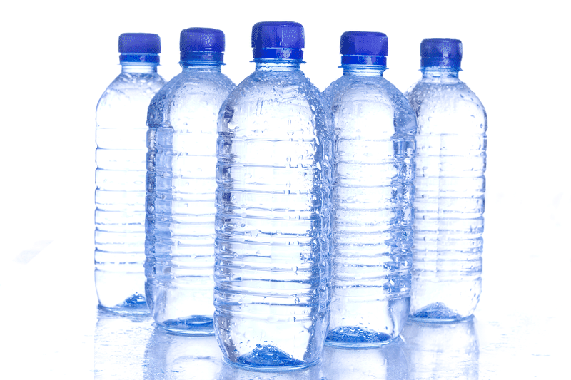

_Maddie is buying bottles of water for a school event. The store only sells bottles of water in six-packs. That is, bottles of water are only sold in packages of 6 bottles each. Maddie wants to make sure there are at least 72 bottles of water available at the event._

_a. Write an inequality to represent, $p$, the number of six-packs of water she could buy._

_b. If Maddie buys 11 six-packs of water for the event, will that be enough? Explain._

**Consider part** **_a_** **first.**

Use a number, an operation sign, a variable, or an inequality symbol to represent each part of the problem. Since bottles of water are sold in packages of 6, or six-packs, you can find the total number of bottles purchased by multiplying 6 by the number of packages purchased. The key words “at least” indicate that you should use a $\ge$ symbol.

$$
\begin{align*}
& \ldots \underline{sells \ bottles \ of \ water \ in \ six-packs} \ldots make \ sure \ there \ are \ \underline{at \ least} \ \underline{72 \ bottles \ of \ water} \ldots\\
& \qquad \qquad \qquad \qquad \quad \downarrow \qquad \qquad \qquad \qquad \qquad \qquad \qquad \qquad \qquad \ \ \downarrow \qquad \qquad \quad \quad \downarrow\\
& \qquad \qquad \quad \qquad \quad \ 6 \times p \qquad \qquad \qquad \qquad \qquad \qquad \qquad \qquad \quad \ \ \ge \qquad \qquad \quad \ 72
\end{align*}
$$

The equation $6 \times p \ge 72$ or $6p \ge 72$ represents this problem.

You may also want to consider that the value of $p$ must be an integer greater than or equal to 0. Think about why that is for a moment.

The reason that the value of $p$ must be greater than zero is because Maddie cannot buy a negative number of six-packs of water. The value of $p$ must be an integer because the problem also states that the store only sells bottled water in six-packs. That means it is not possible to buy a fraction of a six-pack at that particular store. When using inequalities to represent real-life situations, you should always think about which values would make sense for the variable and which values would not make sense. Sometimes a negative value or a fractional value make sense. Other times, they do not.

**Next, consider part** **_b_****.**

Solve the inequality to help you.

$$
\begin{align*}
6p & \ge 72\\
\frac{6p}{6} & \ge \frac{72}{6}\\
1p & \ge 12\\
p & \ge 12
\end{align*}
$$

Now, let's consider if Maddie could buy 11 six-packs of water and have enough for the event. According to the inequality above, the number of six-packs, $p$, that she should buy must be greater than or equal to 12. Since 11 is less than 12, it is not a solution for this inequality. That means that if Maddie bought only 11 six-packs of bottled water, she would not have enough water for the event.

**Now let’s go back to the problem from the introduction and work on solving it by using an inequality.**

Real-Life Example Completed
---------------------------

**_New Band Shoes_**

**Here is the original problem once again. First, reread it. Then write an inequality to show the information given in the problem. Next, solve the inequality and figure out three possible prices for Kayla’s shoes. There are four parts to your answer.**

“I think I need new band shoes,” Kayla said to her Mom at breakfast one morning.

“Why is that? Have your feet grown?” her Mom asked taking a sip of coffee.

“I’m not sure, but I know that I have a blister on my toe from them.”

“Alright, must be time for new shoes. You don’t have band practice today, so let’s go after school and get new shoes. That will give you time to break them in before Friday’s game.”

After school, Kayla’s Mom picked her up and they went to the shoe store. Kayla first picked out a very fancy pair of shoes, but they weren’t on sale. Her Mom picked out a nice pair that would work fine, but were a little more economically priced.

“These are half-off. Let’s get them. They will work fine,” her Mom said.

Kayla agreed and they purchased the shoes. Kayla saw her Mom hand over $40.00 and get some change back.

The shoes that Kayla and her Mom bought were half off the original price. They spend less than $40.00 on the shoes. Can you figure out three possible original prices for Kayla’s shoes?

**_Solution to Real – Life Example_**

**First, write an inequality to describe the values in the problem.**

**$x$ is the unknown original price of the shoes. This is what we are looking to figure out.**

**$\div 2$ is the sale price since the shoes were half off.**

$<$ **less than $40.00**

**Since Kayla’s Mom gave the clerk $40.00 and received change, we know that the shoes were less than $40.00.**

**Here is our inequality.**

$\frac{x}{2} < \$ 40.00$

**Now we can solve it for possible prices.**

$$
\begin{align*}
2 \cdot \frac{x}{2} & < \$ 40.00 \cdot 2\\
x &< \$ 80.00
\end{align*}
$$

**Three possible original prices could be $75.00, $60.00 or $55.00. But there are many possible options.**

Vocabulary
----------

Here are the vocabulary words that are found in this lesson.

__Inequality__

a mathematical statement where two quantities may or may not be equal. There are many possible answers to an inequality.

__Multiplication Property of Inequality__

multiplication of a positive number = inequality is the same. Multiplication of a negative number, the sense of the inequality changes and the sign is reversed.

__Division Property of Inequality__

Division by a positive number = inequality is the same. Division by a negative number, the sense of the inequality changes and the sign is reversed.

Time to Practice
----------------

Directions: Solve each inequality using multiplication.

1.  $\frac{x}{3} < 10$
2.  $\frac{x}{2} > 20$
3.  $\frac{x}{4} < 25$
4.  $\frac{x}{5} > 100$
5.  $\frac{x}{2} \le 20$
6.  $\frac{x}{7} > 6$
7.  $\frac{x}{9} \le 2$
8.  $\frac{x}{11} \ge 5$
9.  $\frac{x}{2} < 3$
10. $\frac{x}{8} \ge 7$

Directions: Solve each inequality using division.

11. $3x<12$
12. $5x>60$
13. $6x<72$
14. $9x>81$
15. $11x>121$
16. $12x \le 48$
17. $13x \ge 39$
18. $15x \le 60$
19. $22x>66$
20. $48x \le 192$

Directions: Solve each inequality.

21. $\frac{n}{-6} > -3$
22. $4x > -36$
23. $-9n \ge 63$
24. $\frac{x}{11} \ge 22$

Directions: Solve each problem.

Uncle Joe is baking brownies for his 5 nephews to share equally. At most, each nephew will receive 3 brownies.

25. Write an inequality to represent $b$, the total number of brownies Uncle Joe should bake.
26. What is the greatest possible value of $b$?

Carmen earns $9 for each hour she works at her job. Her goal is to earn more than $117 this week.

27. Write an inequality to represent $h$, the number of hours she worked today.
28. If Carmen works for 14 hours this week, will she reach her goal? Explain.

</article>

### 3.7 Solving Multi-Step Inequalities

<article>

Introduction
------------

**_Marching Times_**

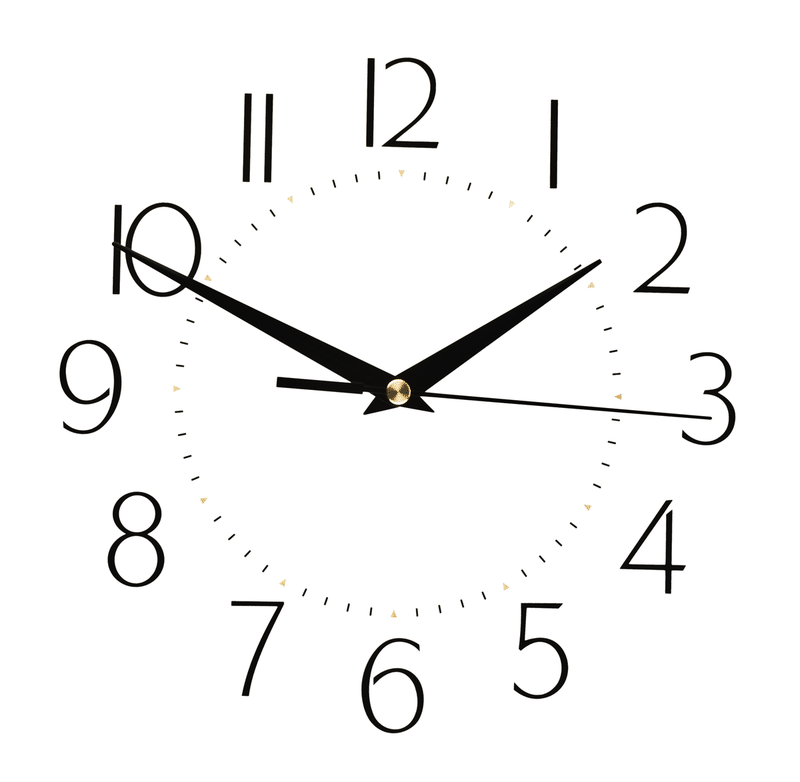

And Mrs. Kline was definitely correct. The students in the band had learned three new routines that they didn’t quite have down yet. It was going to take extra marching practice to put all of the pieces together. To do this, Mrs. Kline had the students outside marching for extra time.

On Tuesday, the band spent thirty fewer minutes marching than they did on Thursday. All in all, everyone was tired.

“We marched for more than three hours between Tuesday and today,” Juan said on the ride home on Thursday. His feet could definitely tell how long they had been marching, but all in all the hard work was paying off because the pieces were looking much better.

Given this information, what are three possible times that the band marched on Thursday?

**Once again, you will need to know about inequalities to solve this problem. This problem will require you to write and solve an inequality that will have more than one step. This lesson will give you all the information that you need to accomplish this task.**

**_What You Will Learn_**

In this lesson, you will learn how to complete the following skills.

* Solve inequalities involving combinations of like terms.
* Solve inequalities involving parentheses and the distributive property.
* Solve inequalities involving both distributing and combining.
* Model and solve real-world problems using multi-step inequalities.

**_Teaching Time_**

I. **Solve Inequalities Involving Combinations of Like Terms**

As you already know, some inequalities can be solved in a single step. For example, we could solve $b+4<10$ in one step—by subtracting 4 from each side.

However, two or more steps may be required to solve some inequalities. Inequalities that need more than one inverse operation to solve them can be called multi-step inequalities.

**Let’s start by looking at combining like terms when we solve an inequality.**

Example

$4x+3x<21$

First, you can see that we **have two terms that have the same variable.** These are **_like terms_**. To solve an inequality with like terms, we will need to combine the like terms and then we can solve the inequality using the methods that we have already learned.

$7x<21$

Here we divide both sides of the inequality by 7. Multiplication is the inverse operation of division.

$x<3$

**This is our answer.**

**Now let’s look at one that is a bit more complicated.**

Example

_Solve for $n$: $7n-8n-3>23$._

**First, subtract $7n-8n$ because $7n$ and $8n$ are like terms.** Remember, you will need the rules for working with positive and negative integers when solving these inequalities.

$$
\begin{align*}
7n-8n-3 &> 23\\
7n+(-8n)-3 &> 23\\
[7n+(-8n)]-3 &> 23\\
-1n-3 &> 23\\
-n-3 &> 23.
\end{align*}
$$

The expression on the left side of the inequality, $-n-3$, is now in simplest form. The 3 cannot be subtracted from the $-n$ because they are _not_ like terms.

**The next step is to isolate the term with the variable, $-n$, on one side of the inequality. Since 3 is** **_subtracted_** **from $-n$, we should add 3 to both sides of the inequality to do this.**

$$
\begin{align*}
-n-3 &> 23\\
-n-3+3 &> 23+3\\
-n+(-3+3) &> 26\\
-n+0 &> 26\\
-n &> 26
\end{align*}
$$

**Since $-n$ means $-1n$ or $-1 \times n$, we can divide each side of the inequality by -1 to get a positive $n$ by itself on one side of the equation. Since that involves dividing both sides of the inequality by a negative number, we must reverse the inequality symbol.**

$$
\begin{align*}
-n &> 26\\
-1n &> 26\\
\frac{-1n}{-1} &< \frac{26}{-1}\\
1n &< -26\\
n &< -26
\end{align*}
$$

**The solution for this inequality is** $n < -26$.

**Let’s look at an example of a two – step inequality.**

Example

_Solve for $b$: $3b+4<10$._

**Notice that there are two terms on the left side of the inequality, $3b$ and 4. Our first step should be to use inverse operations to get the term that includes a variable, $3b$, by itself on one side of the inequality.**

In the inequality, 4 is _added_ to $3b$. So, we can use the inverse of addition—subtraction. **We can subtract 4 from both sides of the inequality.** We do not need to change the inequality symbol during this step because we are subtracting a number, not multiplying or dividing by a negative number.

$$
\begin{align*}
3b+4 &< 10\\
3b+4-4 &< 10-4\\
3b+0 &< 6\\
3b &< 6
\end{align*}
$$

Now, the term that includes a variable, $3b$, is by itself on one side of the equation.

**We can now use inverse operations to get the $b$ by itself. Since $3b$ means $3 \times b$, we can divide both sides of the inequality by 3 to isolate the variable.** Since we are dividing by a positive number, not a negative number, the inequality symbol should not change.

$$
\begin{align*}
3b &< 6\\
\frac{3b}{3} &< \frac{6}{3}\\
1b &< 2\\
b &< 2
\end{align*}
$$

**The solution is $b<2$.**

Now let’s look at solving another multi-step equation.

Example

_Solve for $k$: $3k+20+2k+10 \le 5$._

**First, combine the like terms on the left side of the inequality. $3k$ and $2k$ are like terms since each has the same variable, $k$. The numbers 20 and 10 are also like terms, so they can be combined as well.**

Use the commutative property of addition to help you reorder the terms being added. This property states that terms can be added in any order. Then use the associative property to group the terms so like terms are being added. The associative property of addition states that the grouping of terms being added does not matter. Once you reordered the terms, combine the like terms.

$$
\begin{align*}
3k+20+2k+10 & \le 5\\
3k+(20+2k)+10 & \le 5\\
3k+(2k+20)+10 & \le 5\\
(3k+2k)+(20+10) & \le 5\\
5k + 30 & \le 5
\end{align*}
$$

**The next step is to get the term with the variable, $5k$, on one side of the inequality. Since 30 is** **_added_** **to $5k$, we should subtract 30 from both sides of the inequality to do this.**

$$
\begin{align*}
5k+30 & \le 5\\
5k+30-30 & \le 5-30\\
5k+0 & \le 5+(-30)\\
5k & \le -25
\end{align*}
$$

**Since $5k$ means $5 \times k$, we should divide each side of the inequality by 5—a positive number—to get the $k$ by itself on one side of the inequality. Be careful! It is true that you will need to divide -25 by 5 to find the solution. However, since you are not dividing** **_both_** **sides of the inequality by a negative number, you do not reverse the inequality symbol.**

$$
\begin{align*}
5k & \le -25\\
\frac{5k}{5} & \le \frac{-25}{5}\\
1k & \le -5\\
k & \le -5
\end{align*}
$$

**The solution is $k \le -5$ .**

Now let’s look at some other types of inequalities.

II. **Solve Inequalities Involving Parentheses and the Distributive Property**

The inequalities that you will see in this section involve parentheses. We know from our earlier work that we can simplify an equation with parentheses by using the distributive property. We can do this with inequalities as well. Using the distributive property can help you to simplify an inequality so that it is easier to solve.

Let’s look at an example.

Example

_Solve for $q$: $-9(q+3)<45$_

**Apply the distributive property to the left side of the inequality. Multiply each of the two numbers inside the parentheses by -9 and then add those products.**

$$
\begin{align*}
-9(q+3) &< 45\\
(-9 \times q)+(-9 \times 3) &< 45\\
-9q+(-27) &< 45
\end{align*}
$$

**Now, solve as you would solve any two-step inequality.** Since -27 is added to $-9q$, we can get $-9q$ by itself on one side of the inequality by subtracting -27 from both sides. Remember, subtracting -27 from a number is the same as adding its opposite, 27, to that number.

$$
\begin{align*}
-9q+(-27) &< 45\\
-9q+(-27)-(-27) &< 45-(-27)\\
-9q+(-27+27) &< 45+27\\
-9q+0 &< 72\\
-9q &< 72
\end{align*}
$$

**To get $q$ by itself on one side of the inequality, we need to divide both sides by -9. Since we are dividing both sides by a negative number, you need to reverse the inequality symbol.**

$$
\begin{align*}
-9q &< 72\\
\frac{-9q}{-9} &> \frac{72}{-9}\\
1q &> -8\\
q &> -8
\end{align*}
$$

**The solution is $q > -8$.**

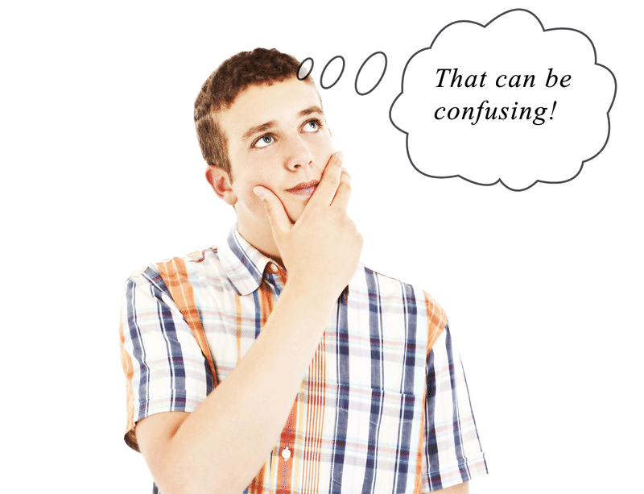

Example

$\frac{1}{2} (x+4) \le 10$

**First, we use the distributive property to multiply one-half with both of the terms inside the parentheses.**

$\frac{1}{2} x+2 \le 10$

Next, we subtract two from both sides of the inequality.

$\frac{1}{2} x \le 8$

Now we can multiply both sides by the reciprocal of one-half which will cancel out the one-half leaving our variable alone. This is an example of the multiplicative inverse property.

$\frac{2}{1} \left(\frac{1}{2}\right) x \le 8 \left(\frac{2}{1}\right)$

**The answer is that $x \le 16$.**

Some inequalities will require that you use combining like terms and the distributive property. Let’s take a look at these problems now.

III. **Solve Inequalities Involving Both Distributing and Combining**

Now let’s apply both combining like terms and the distributive property when working with the same inequality.

Example

_Solve for $w$: $-2(8+w)+18<28$._

**First, we should apply the distributive property to the left side of the inequality.** We can multiply each of the two numbers inside the parentheses by -2 and then add those products.

$$
\begin{align*}
-2(8+w)+18 &< 28\\
(-2 \times 8)+(-2 \times w)+18 &< 28\\
-16+(-2w)+18 &< 28
\end{align*}
$$

**Next, we can add the like terms (-16 and 18) on the left side of the inequality.** Using the commutative and associative properties to reorder the terms on the left side of the equation can make it easier to see how to do this.

$$
\begin{align*}
-16+(-2w)+18 &< 28\\
-16+[(-2w)+18] &< 28\\
-16+[18+(-2w)] &< 28\\
(-16+18)+(-2w) &< 28\\
2+(-2w) &< 28
\end{align*}
$$

**Finally, we solve as you would solve any two-step inequality. Since 2 is added to $-2w$, our first step should be to subtract 2 from both sides of the inequality.**

$$
\begin{align*}
2+(-2w) &< 28\\
2-2+(-2w) &< 28-2\\
0+(-2w) &< 26\\
-2w &< 26
\end{align*}
$$

**Now, we can isolate the variable, $w$, by dividing both sides of the inequality by -2. Since we are dividing both sides by a negative number, we need to reverse the inequality symbol.**

$$
\begin{align*}
-2w &< 26\\
\frac{-2w}{-2} &> \frac{26}{-2}\\
1w &> -13\\
w &> -13
\end{align*}
$$

**The solution is $w > -13$.**

All of these skills can help us when we work with real – world problems. Let’s look at solving real – world problems with multi – step inequalities.

IV. **Model and Solve Real – World Problems Using Multi-Step Inequalities**

Sometimes, we can write a multi-step inequality to represent a real-world problem situation. Once again, you will be using key words to work on these. Take a minute and refer back to your notebook. Then continue.

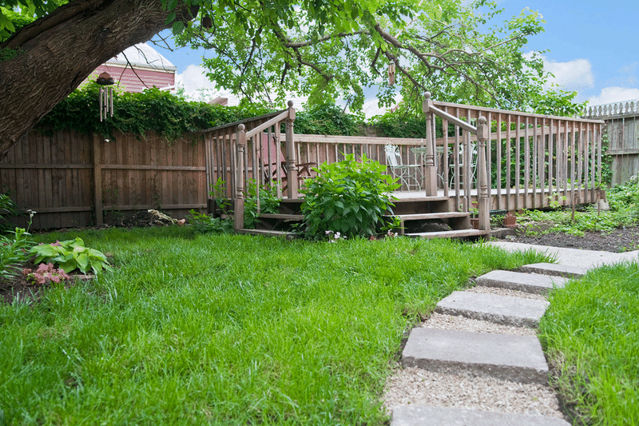

_Ms. Layne wants to build a rectangular deck in her back yard. She wants the length of the deck to be exactly 9 feet. She wants the perimeter of her deck to be, at most, 28 feet. The perimeter of any rectangle can be found by using the expression $P=2(l+w)$, where $l$ represents the length and $w$ represents the width._

_a. Write an inequality that could be used to represent $w$, the possible widths, in feet, she could use for her deck._

_b. Would a deck with a width of 6 feet result in a deck with the perimeter she wants?_

**Consider part** **_a_** **first.**

You know that the length is 9 feet, so substitute 9 for $l$ into the expression $2(l+w)$. This expression represents the actual perimeter of the deck.

$\text{actual perimeter}=2(l+w)=2(9+w)$

Since she wants the perimeter to be “at most” 28 feet, you should use the “less than or equal to” $(\le)$ symbol. Translate this problem into an inequality.

$$
\begin{align*}
& She \ wants \ the \ \underline{perimeter} \ of \ her \ deck \ to \ be, \ \underline{at \ most}, \ \underline{28 \ feet}.\\
& \qquad \qquad \qquad \quad \ \ \downarrow \qquad \qquad \qquad \qquad \qquad \quad \ \ \downarrow \qquad \quad \ \downarrow\\
& \qquad \qquad \qquad \ 2(9+w) \qquad \qquad \qquad \qquad \quad \ \ \le \qquad \quad 28
\end{align*}
$$

So, this problem can be represented by the inequality $2(9+w) \le 28$.

**Next, consider part** **_b_****.**

To find all the possible values of $w$, solve the inequality. First, apply the distributive property to the right side.

$$
\begin{align*}
2(9+w) & \le 28\\
(2 \times 9)+(2 \times w) & \le 28\\
18+2w & \le 28
\end{align*}
$$

Now, solve as you would solve any two-step inequality. First, subtract 18 from both sides of the inequality.

$$
\begin{align*}
18+2w & \le 28\\
18-18+2w & \le 28-18\\
0+2w & \le 10\\
2w & \le 10
\end{align*}
$$

Next, divide both sides of the inequality by 2. Since you are dividing by a positive number, the inequality symbol should stay the same.

$$
\begin{align*}
2w & \le 10\\
\frac{2w}{2} & \le \frac{10}{2}\\
1w & \le 5\\
w & \le 5
\end{align*}
$$

**The value of $w$ must be less than or equal to 5.** Since 6 is greater than, not less than, 5, it is not a possible value of $w$. So, if she built her deck so it was 6 feet wide, it would have a larger perimeter than she wants.

**Now let’s look at the problem from the introduction. We can use what we have learned to help us in writing and solving an inequality.**

Real-Life Example Completed
---------------------------

**_Marching Times_**

**Here is the original problem once again. First, reread it. Then write an inequality and solve it for three possible times for Thursday’s practice. There are four parts to your answer.**

“We have a lot to do to get ready for the big parade,” Mrs. Kline announced on Monday.

And Mrs. Kline was definitely correct. The students in the band had learned three new routines that they didn’t quite have down yet. It was going to take extra marching practice to put all of the pieces together. To do this, Mrs. Kline had the students outside marching for extra time.

On Tuesday, the band spent thirty fewer minutes marching than they did on Thursday. All in all, everyone was tired.

“We marched for more than three hours between Tuesday and today,” Juan said on the ride home on Thursday. His feet could definitely tell how long they had been marching, but all in all the hard work was paying off because the pieces were looking much better.

Given this information, what are three possible times that the band marched on Thursday?

**_Solution to Real – Life Example_**

**First, write an inequality using the given information.**

**$m - 30$ is the time that the students practiced on Tuesday**

**$m$ is the time that they practiced on Thursday**

**$>3$ hours is the time that they practiced in all.**

**Here is the inequality.**

**$m + m - 30 > 3$** **_hours or 180 minutes_**

**It makes sense to work with minutes because the given times are in minutes.**

**Now we solve the inequality.**

$$
\begin{align*}
2m - 30 &> 180\\
2m &> 210\\
m &> 105 \ minutes
\end{align*}
$$

**The band marched for more than 105 minutes on Thursday. You could assume that they marched for 110 minutes, 115 minutes or 120 minutes. There are many possible options.**

Vocabulary
----------

Here are the vocabulary words that are found in this lesson.

__Inequality__

a mathematical statement where one quantity can be less than, greater than or equal to another quantity.

__Inverse Operation__

the opposite operation. Inverse operations are used to solve equations.

__Like Terms__

terms in an equation or inequality that have common variables or no variables.

__Distributive Property__

a term outside of a set of parentheses can be multiplied by each of the terms inside the parentheses. This simplifies the parentheses.

Time to Practice
----------------

Directions: Solve each inequality.

1.  $2x+5>13$
2.  $4x-2<10$
3.  $6y+9>69$
4.  $2x-3 \le -4$
5.  $5x+2 \ge -8$
6.  $2x-9 \le -5$
7.  $\frac{x}{3}+1>5$
8.  $\frac{x}{2}-1<-3$
9.  $\frac{x}{5}+3>-9$
10. $\frac{x}{2}-5>-10$
11. $6k-3 > 15$
12. $11 - \frac{x}{4} \le 12$
13. $12+9j+j<72$
14. $12b-3b+5 \ge -31$
15. $18+7n+3+6n \le 86$
16. $3z-15z-30>54$
17. $-2(10+h)<-40$
18. $\frac{1}{3}(15+t) \le 26$
19. $8(p-3)-2 \ge 14$
20. $-3(2+4y)+y>16$

Directions: Use inequalities to solve each problem.

Lori went hiking last weekend. On Sunday, she hiked 8 more kilometers than she hiked on Saturday. The total number of kilometers she hiked on both days was less than 40 kilometers.

21. Let $s$ represent the number of kilometers she hiked on Saturday. Write an inequality to represent this problem.
22. Find three possible values of $s$.

Mr. Chang wants to use a rectangular section of his backyard for a vegetable garden. He wants the width of the garden to be exactly 7 feet. He wants the perimeter of the rectangular garden to be no less than 36 feet. The perimeter of any rectangle can be found by using the formula $P=2(l+w)$, where $l$ represents the length and $w$ represents the width.

23. Write an inequality that could be used to represent $l$, the possible lengths, in feet, Mr. Chang could use for his rectangular garden.
24. Would a rectangular garden with a length of 12 feet result in a garden with the perimeter he wants?

</article>

### 3.8 Using Inequalities

<article>

Introduction
------------

**_Half – Time Arrangements_**

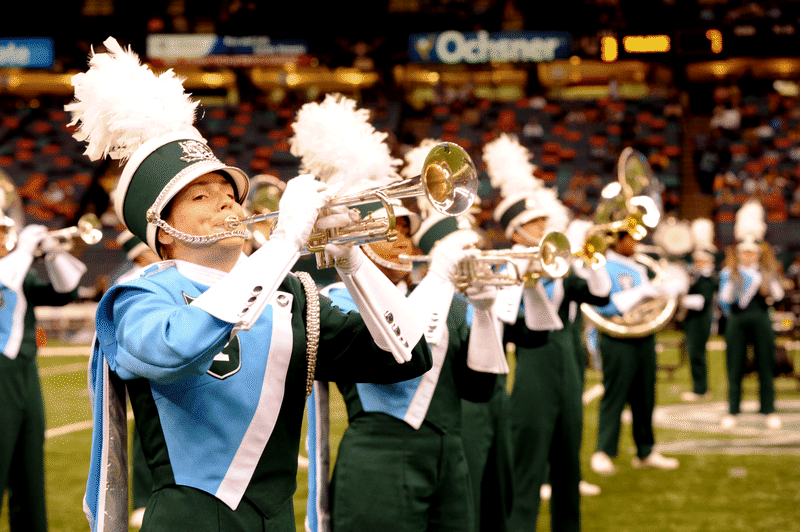

During the game, they always perform for at least 42 minutes but not more than 60 minutes. If the average time for each piece is 8 minutes, what is the least number of pieces that the band can perform? What is the greatest number of pieces that the band will perform?

**This problem has a compound inequality in it. You will notice that there are two different inequalities being mentioned. This lesson will teach you how to translate verbal language into a compound inequality so that you can solve the inequality. Pay close attention, because you will see this problem again at the end of the lesson.**

**_What You Will Learn_**

By the end of this lesson, you will be able to complete the following skills.

* Recognize common verbal sentences equivalent to the four types of inequalities.
* Translate compound verbal sentences into multi-step inequalities.
* Write and solve multi-step inequalities given problem situations.
* Model and solve real-world problems using combinations on inequalities.

**_Teaching Time_**

I. **Recognize Common Verbal Sentences Equivalent to the Four Types of Inequalities**

You have already learned how to work with an inequality that is represented by a mathematical statement. We have learned about four inequalities. Here are examples of each of them.

* $x < 5$
* $x > 5$
* $x \le 5$
* $x \ge 5$

When you look at verbal sentences, you will need to identify key words that will help you to write an inequality.

You have already been doing this a lot throughout this chapter. This section gives you a chance to recap what you have learned.

**Let’s look at verbal sentences for each of the four types of inequalities.**

When you see “less than” you know that you will be using the symbol $<$

When you see “greater than” you know that you will be using the symbol $>$

When you see “less than or equal to” you know that you will be using the symbol $\le$

When you see “greater than or equal to” you know that you will be using the symbol $\ge$

**Using these key words will help you to understand inequalities better.**

II. **Translate Compound Verbal Sentences into Multi – Step Inequalities**

Sometimes, however, to truly understand the values represented by a variable, we need consider two equalities _together_. **Two inequalities considered together form a** **_compound inequality._**

For example, suppose we know that $n>0$ _and_ we also know that $n<5$. In that case, we need to consider those two inequalities together. That means, we need to consider a compound inequality.

There are two types of compound inequalities you should know about.

* **A** **_conjunction_** **is a compound inequality that contains the word** **_and._** A conjunction is true only if both inequalities are true.

Example: $n>0$ _and_ $n < 5$

* **A** **_disjunction_** **is a compound inequality that contains the word** **_or._** A disjunction is true if either of the inequalities is true.

**We can write compound inequalities when we have words that describe more than one inequality. Let’s look at an example.**

Example

_The sum of a number, $n$, and 4 is at least 12 and at most 20._

_a. Translate the sentence above into a compound inequality._

_b. Solve the compound inequality._

**Consider part** **_a_** **first.**

Break the sentence into parts and translate each part into an inequality.

$$
\begin{align*}
& The \ \underline{sum \ of \ a \ number, \ n, \ and \ 4} \ is \ \underline{at \ least} \ \underline{12} \ldots\\
& \qquad \qquad \qquad \quad \ \downarrow \qquad \qquad \qquad \qquad \ \downarrow \quad \ \ \downarrow\\
& \qquad \qquad \quad \ \quad \ n+4 \qquad \qquad \qquad \quad \ \ge \ \ \ 12
\end{align*}
$$

$$
\begin{align*}
& The \ \underline{sum \ of \ a \ number, \ n, \ and \ 4} \ is \ldots \underline{at \ most} \ \underline{20}.\\
& \qquad \qquad \qquad \quad \ \downarrow \qquad \qquad \qquad \qquad \quad \ \downarrow \qquad \downarrow\\
& \qquad \qquad \qquad \ \ n+4 \qquad \qquad \qquad \quad \quad \ \le \quad \ 20
\end{align*}
$$

Look at the original sentence.

_The sum of a number, $n$, and 4 is at least 12 and at most 20._

The word _and_ which is underlined above shows that this sentence represents a conjunction.

So, the compound inequality could be written as: $n+4 \ge 12$ _and_ $n+4 \le 20$.

Or, we could rewrite $n+4 \ge 12$ as $12 \le n+4$ and put the two inequalities together like this: $12 \le n+4 \le 20$.

**Next, consider part** **_b_****.**

To solve the compound inequality, treat each inequality separately.

Subtract 4 from each side.

$$
\begin{align*}
n+4 & \ge 12 \qquad \qquad \quad \ \ n+4 \le 20\\
n+4-4 & \ge 12-4 \qquad \ n+4-4 \le 20-4\\
n+0 & \ge 8 \qquad \quad \quad \qquad n+0 \le 16\\
n & \ge 8 \qquad \quad \ \quad \qquad \quad \ n \le 16
\end{align*}
$$

**So, the solution could be written as: $n \ge 8$ and $n \le 16$.**

**It could also be written as: $8 \le n \le 16$.**

**_Notice that the key words from the beginning of this section will help you with compound inequalities._**

III. **Write and Solve Multi – Step Inequalities Given Problem Situations**

You already began writing and solving inequalities in the last section, now let’s continue with that work.

Example

_Six less than half of a number, $x$, is either less than -1 or greater than 10._

_a. Translate the sentence above into a compound inequality._

_b. Solve the compound inequality._

**Consider part** **_a_** **first.**

Break the sentence into parts and translate each part into an inequality.

$$
\begin{align*}
& \underline{Six} \ \underline{less \ than} \ \underline{half \ of \ a \ number, \ x,} \ is \ldots \underline{less \ than} \ \underline{-1} \ldots \\
&  \searrow \qquad \downarrow \qquad \qquad \qquad \swarrow \qquad \qquad \qquad \qquad \ \ \downarrow \qquad \downarrow\\
& \searrow \qquad \downarrow \qquad \qquad \qquad \swarrow \qquad \qquad \qquad \qquad \ \ \downarrow \qquad \downarrow\\
& \searrow \qquad \downarrow \qquad \qquad \qquad \ \swarrow \qquad \qquad \qquad \qquad \ \downarrow \qquad \downarrow\\
& \ \frac{x}{2} \qquad - \qquad \qquad \qquad 6 \qquad \qquad \qquad \quad \quad \ < \quad \ -1
\end{align*}
$$

$$
\begin{align*}
& \underline{Six} \ \underline{less \ than} \ \underline{half \ of \ a \ number, \ x}, \ is \ldots\underline{greater \ than} \ \underline{10}.\\
& \searrow \qquad \downarrow \qquad \qquad \qquad \swarrow \qquad \qquad \qquad \qquad \quad \ \downarrow \qquad \ \ \downarrow\\
& \searrow \qquad \downarrow \qquad \qquad \qquad \swarrow \qquad \qquad \qquad \qquad \quad \ \downarrow \qquad \ \ \downarrow\\
& \searrow \qquad \downarrow \qquad \qquad \qquad \ \swarrow \qquad \qquad \qquad \qquad \quad \downarrow \qquad \ \ \downarrow\\
& \ \frac{x}{2} \qquad - \qquad \qquad \qquad 6 \qquad \qquad \qquad \qquad \quad \ > \quad \ \ 10
\end{align*}
$$

Look at the original sentence.

_Six less than half of a number, $x$, is either greater than 10 or less than -1._

**The word** **_or_** **which is underlined above shows that this sentence represents a disjunction.**

So, the compound inequality could be written as: $\frac{x}{2}-6<-1$ _or_ $\frac{x}{2}-6>10$

**Next, consider part** **_b_****.**

To solve the compound inequality, treat each inequality separately.

First, add 6 to each side.

$$
\begin{align*}
\frac{x}{2}-6 &< -1 && \frac{x}{2}-6>10\\
\frac{x}{2}-6+6 &< -1+6 && \frac{x}{2}-6+6>10+6\\
\frac{x}{2}+(-6+6) &< 5 && \frac{x}{2}+(-6+6) > 16\\
\frac{x}{2}+0 &< 5 && \frac{x}{2}+0>16\\
\frac{x}{2} &< 5 && \frac{x}{2}>16
\end{align*}
$$

Next, multiply each side by 2.

$$
\begin{align*}
\frac{x}{2} &< 5 && \quad \ \ \frac{x}{2}>16\\
\frac{x}{2} \times 2 &< 5 \times 2 && \frac{x}{2} \times 2 > 16 \times 2\\
\frac{x}{\bcancel{2}} \times \frac{\bcancel{2}}{1} &< 10 && \frac{x}{\bcancel{2}} \times \frac{\bcancel{2}}{1} > 32\\
\frac{x}{1} &< 10 && \quad \ \ \frac{x}{1}>32\\
x &< 10 && \qquad x > 32
\end{align*}
$$

**So, the solution could be written as: $x<10$ or $x>32$.**

We can also use compound inequalities when dealing with real – world situations.

IV. **Model and Solve Real – World Problems Using Combinations of Inequalities**

Real world problems often have many different components to them. When we have a situation where two inequalities is represented, we can use a compound inequality to help us with the dilemma. Let’s look at an example.

_Brandon earns $7 per hour at his job. The number of hours he works varies from week to week. However, each week he always earns no less than $70 and no more than $140. Let $h$ represent the number of hours he works each week._

_a. Write a compound inequality to represent this problem situation._

_b. Solve the inequality to determine the range in the number of hours Brandon works each week._

_c. According to the problem, does Brandon ever work 25 hours in any given week? Explain._

**Consider part** **_a_** **first.**

Since Brandon earns $7 per hour, you can represent the number of dollars he earns each week by multiplying 7 by the number of hours he works. In other words, you can represent his total earnings as $7 \times h$ or $7h$.

Now, break the problem into parts and translate each part into an inequality.

$$
\begin{align*}
& \ldots \underline{each \ week \ldots earns} \ \underline{no \ less \ than} \ \underline{\$ 70} \ldots\\
& \qquad \qquad \quad \downarrow \qquad \qquad \qquad \ \downarrow \qquad \quad \downarrow\\
& \qquad \qquad \quad 7h \qquad \qquad \quad \ \ \ge \qquad \ \ 70
\end{align*}
$$

$$
\begin{align*}
& \ldots \underline{each \ week \ldots earns} \ \underline{no \ more \ than} \ \underline{\$ 140}.\\
& \qquad \qquad \quad \downarrow \qquad \qquad \qquad \ \ \downarrow \qquad \quad \ \ \downarrow\\
& \qquad \qquad \quad 7h \qquad \qquad \qquad \le \qquad \quad 140
\end{align*}
$$

Look at the original sentence.

_...each week he always earns no less than $70 and no more than $140._

Because of the word _and_, this compound inequality is an example of a conjunction.

We could represent this conjunction as: $7h \ge 70$ _and_ $7h \le 140$. We could also write this conjunction as: $70 \le 7h \le 140$.

**Next, consider part** **_b_****.**

To solve the compound inequality, treat each inequality separately.

Divide each side by 7.

$$
\begin{align*}
7h & \ge 70 \qquad \quad \ 7h \le 140\\
\frac{7h}{7} & \ge \frac{70}{7} \qquad \quad \frac{7h}{7} \le \frac{140}{7}\\
1h & \ge 10 \qquad \quad \ 1h \le 20\\
h & \ge 10 \qquad \quad \ \ h \le 20
\end{align*}
$$

**So, the solution could be written as: $h \ge 10$** **_and_** **$h \le 20$. It could also be written as: $10 \le h \le 20$.**

This solution shows that the number of hours Brandon works each week is greater than or equal to 10 _and_ less than or equal to 20. In other words, Brandon works 10 to 20 hours in any given week.

**Lastly, consider part** **_c_****.**

In part _b_, you determined that the number of hours Brandon works in any given week is always less than or equal to 20. This means he never works more than 20 hours in any given week. So, he would not work 25 hours during a particular week.

**Now let’s go back to the problem from the introduction and use what we have learned to solve that problem.**

Real-Life Example Completed
---------------------------

**_Half – Time Arrangements_**

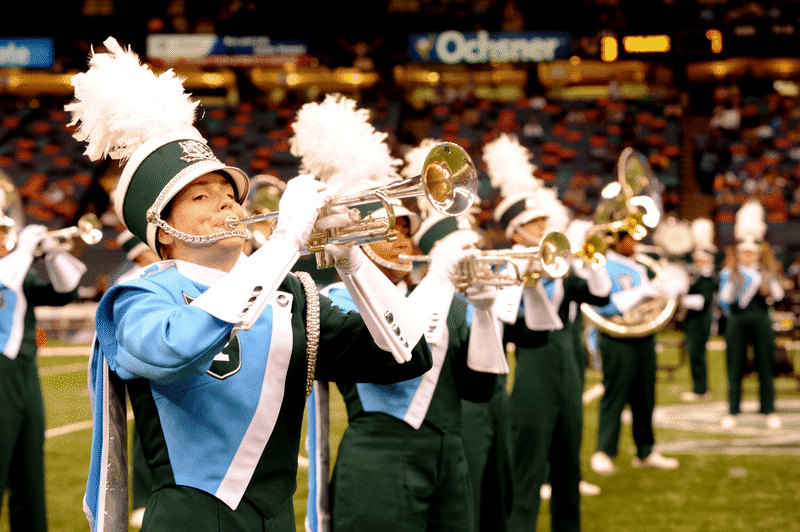

The marching band at Floyd Middle School always performs during half-time of the football games. The band usually performs different routines that are an average of 6 minutes for each arrangement. Mrs. Kline likes the students to have a variety of different pieces to perform.

During the game, they always perform for at least 42 minutes but not more than 60 minutes. If the average time for each piece is 8 minutes, what is the least number of pieces that the band can perform? What is the greatest number of pieces that the band will perform?

**_Solution to Real – Life Example_**

**First, let’s write down the given information.**

**The average length of each piece is 6 minutes.**

**The band performs for no less than 42 minutes.**

**The band performs for no more than 60 minutes.**

**We need to figure out the range of the number of pieces performed. This is our variable $p$.**

**Here is the inequality.**

$42 \le 6p \ge 60$

**Now we can solve each inequality for the range. We will have a low range and a high range for our number of pieces.**

$$
\begin{align*}
42 & \le 6p\\
7 &\le p\\
6p &\ge 60\\
p &\ge 10
\end{align*}
$$

**The band will perform between 7 and 10 pieces given the range of times that they are allowed to perform.**

Vocabulary
----------

Here are the vocabulary words that are found in this lesson.

__Compound Inequality__

an inequality that combines two inequalities when considering a problem.

__Conjunction inequality__

two inequalities joined by “and”.

__Disjunction Inequality__

two inequalities joined by “or”.

Time to Practice
----------------

Directions: Use each example to work with compound inequalities.

**Two less than a number, $x$, is at least 16 and at most 25**

1.  Translate the sentence into an inequality.
2.  Solve the inequality.
3.  Write a mathematical statement to show the range of possibilities for the answer.

**One-third of a number, $n$, is either less than -5 or greater than 3.**

4.  Translate the sentence into an inequality.
5.  Solve the inequality.
6.  Write a mathematical statement to show the range of possibilities for the answer.

**Seven more than twice a number, $n$, is either less than -5 or at least 9.**

7.  Translate the sentence into an inequality.
8.  Solve the inequality.
9.  Write a mathematical statement to show the range of possibilities for the answer.

Directions: Solve each problem.

**When Harriet goes to the diner for lunch, she buys exactly two items: a wrap sandwich and a $3 milkshake. The total cost of her lunch is always more than $8 and less than $12. Let $w$ represent the cost, in dollars, of any of the wrap sandwiches Harriet buys.**

10. Write a compound inequality to represent this problem situation.
11. Solve the inequality you wrote in part a.
12. According to the problem, is it possible that Harriet sometimes buys a wrap sandwich that costs $10?
13. Why? Explain.

Mr. Jameson pays $3 per gallon for gasoline. Each week, the amount he spends on gas for his car is always at least $30 on gas and at most $105. Let $g$ represent the number of gallons of gasoline he buys in any given week.

14. Write a compound inequality to represent this problem situation.
15. Solve the inequality you wrote in part a.
16. According to the problem, does Mr. Jameson ever buy 30 gallons of gasoline in any given week?
17. Explain why or why not.
18. Write a word problem inequality. Then write a compound inequality and solve it.
19. Write a word problem inequality. Then write a compound inequality and solve it.
20. Write a word problem inequality. Then write a compound inequality and solve it.

</article>

## 4.0 Applying Proportions

<article>

</article>

### 4.1 Ratios and Rates

<article>

Introduction
------------

**_The Top of the World - Mount Everest_**

“What are you reading?” she asked.

“I am reading a book about Mount Everest,” Josh said without looking up.

“Alright Josh, now put the book down and eat something,” their Mom instructed.

“It is terrific. Do you know that during the best year on Everest, and best meaning the year that the least number of people died, that 129 people summitted and only 8 died,” Josh said smiling.

“That hardly seems like something to smile about,” Mom said sipping her coffee.

“Yeah, how morbid,” Karen chimed in.

“Listen it may be morbid, but it is a fact. During the worst year, only 98 people summitted and 15 died. That is a lot of people. I mean we can compare the number of people who summitted and the number of people who didn’t make it,” Josh said.

“Well, it proves that Everest is a dangerous place and not a trip to be taken lightly,” Mom said.

“Yes, but think about how amazing it would be to stand on the top of the world!” Josh said.

“How do they figure out that the best year is the best and the worst year is the worst based on those numbers?” Karen asked.

“They compare the ratios,” Josh explained. “Let me tell you how.”

**Do you know how? Given this information, Josh is going to show Karen how to simplify and compare ratios. In this lesson, you will learn how to write ratios and how to understand them better. Pay close attention and you can work with the ratios of the best and worst years on Everest at the end of the lesson.**

**_What You Will Learn_**

In this lesson, you will learn how to execute the following skills.

* Write, compare and order ratios.
* Find and apply unit rates.
* Find and apply equivalent rates.
* Solve real-world problems involving ratios and rates.

**_Teaching Time_**

I. **Write, Compare and Order Ratios**

**A** **_ratio_** **is a comparison of two things or two quantities.** The key thing to notice about ratios is that we are comparing. There are many different ways to compare things in mathematics. For example, imagine that there are 25 students in a class; 12 boys and 13 girls. You could say that the ratio of boys to girls is 12 to 13. You could also write this ratio as 12 : 13 or $\frac{12}{13}$. The ratio of boys to total students can be written as 12 to 25, 12 : 25, or $\frac{12}{25}$. The ratio of girls to total students can be written as 13 to 25, 13 : 25, or $\frac{13}{25}$. You will also see that the order that you compare makes a difference. If you are comparing boys to total students, then the number of boys comes first or if you are using fraction form, it is the numerator.

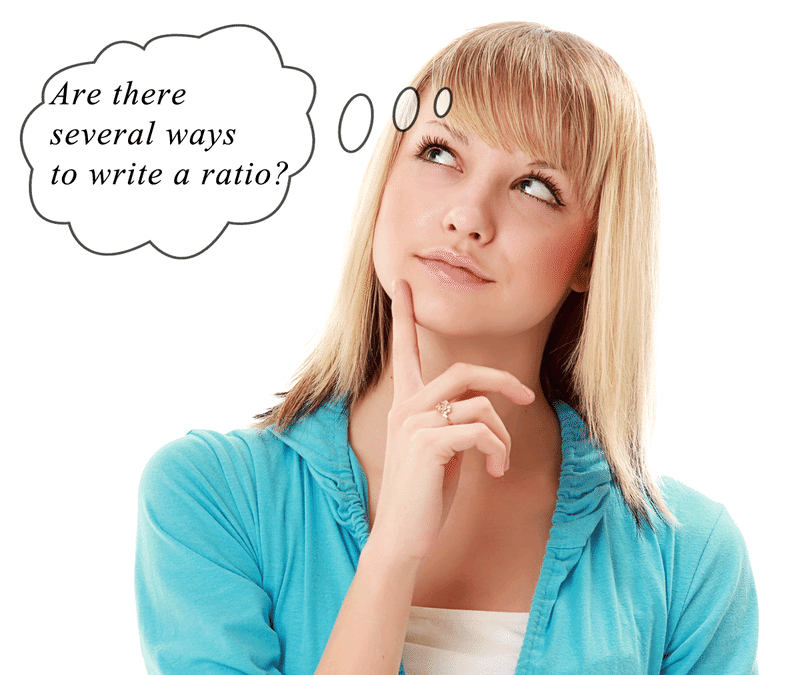

**We just looked at the three ways to write a ratio when you are making a simple comparison. Remember to read the information carefully so that you are clear what is being compared. Now let’s look at an example where you might need to figure something out to write the ratio.**

Example

_There are 32 red and yellow candies in a bag. There are 10 yellow candies. What is the ratio of red candies to total candies in the bag?_

We need the ratio of red candies to total candies. We know that there are 32 total candies. We need to find the number of red candies in the bag before writing the ratio.

$32-10 = 22$

Now write the ratio of red candies to total candies. **Because a ratio is a comparison, it can be simplified. Make sure to reduce the ratio to lowest terms. This makes it easier to understand the quantities that are being compared.**

$\frac{\text{red candies}}{\text{total candies}} = \frac{22}{32} = \frac{11}{16}$

**We also could have written this ratio in two other ways.**

**22 to 32 then simplified to 11 to 16**

**OR**

**22 : 32 then simplified to 11 : 16**

**All of these answers would have been correct. Remember that you can interchange the form that you choose to write a ratio.**

**We can also compare ratios. This is when we have two or more ratios and we want to figure out which ones are larger and which ones are smaller. Let’s look at an example.**

Example

_Mr. Collison’s class has 30 total students. Of these, 12 are boys. Mrs. Peterson’s class has 25 students. Of these, 11 are boys. Which class has a higher ratio of boys to total students?_

**First, find the ratio of boys to total students for both classes. You need to do this first because these are the quantities that you are comparing.**

Mr. Collison’s class: $\frac{12}{30} = \frac{2}{5}$

Mrs. Peterson’s class: $\frac{11}{25}$

**Now compare the ratios the same way you compare fractions. Find a common denominator and compare the numerators.**

The least common denominator is 25.

$\frac{2}{5} \left(\frac{5}{5} \right) = \frac{10}{25}$

$\frac{10}{25} < \frac{11}{25}$, since 10 is less than 11.

**Mrs. Peterson’s class has a higher ratio of boys to total students.**

**_Note: In Example 2, even though Mr. Collison’s class had a larger number of boys in the class, Mrs. Peterson’s class had a larger ratio of boys to total students._**

**We can also order ratios. When you have more than two ratios, you can write them in order from least to greatest or from greatest to least. Let’s look at an example.**

Example

Order the following ratios from least to greatest: 10 to 15, $\frac{16}{36}$, 12 : 48

**The first thing to notice is that these ratios are all in different forms. Let’s write them in the same form first of all. Let’s work with fraction form so that we can apply what we know about comparing and ordering fractions.**

$10 \ \text{to} \ 15 = \frac{10}{15}$

$$
\frac{16}{36}
$$

$12:48 = \frac{12}{48}$

**Now notice that none of these fractions are in simplest form. We can simplify them and that will make it much easier to order them.**

$$
\begin{align*}
\frac{10}{15} &= \frac{2}{3}\\
\frac{16}{36} &= \frac{4}{9}\\
\frac{12}{48} &= \frac{1}{4}
\end{align*}
$$

**If you understand fractions, we can simply order them right now. We know that one-fourth is the smallest part. That four is almost half of nine, so that would be the middle value, and that two-third would be the greatest part.**

**The answer is $\frac{1}{4}, \frac{4}{9}, \frac{2}{3}$.**

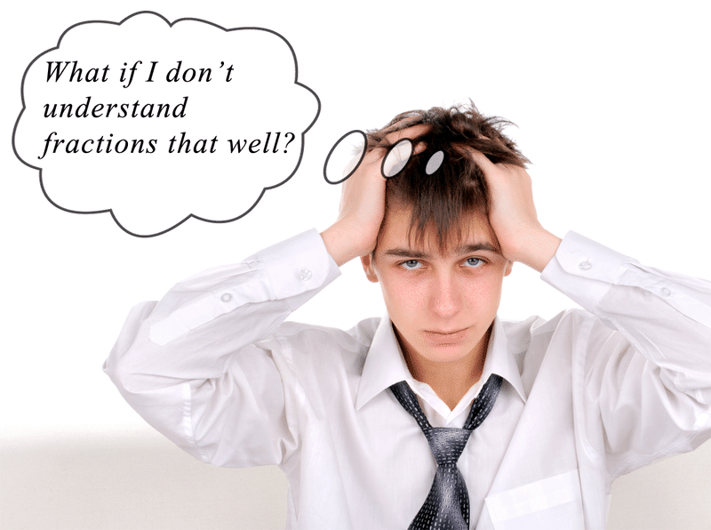

$$
\begin{align*}
\frac{1}{4} &= \frac{9}{36}\\
\frac{4}{9} &= \frac{16}{36}\\
\frac{2}{3} &= \frac{24}{36}
\end{align*}
$$

**You can see that our original work was correct.**

II. **Find and Apply Unit Rates**

**A** **_unit rate_** **is a special kind of ratio, where the second number, or the denominator, is equal to one. With a unit rate, you are comparing a quantity to one. Some common examples of unit rates are miles per gallon, price per pound, and pay rate per hour.**

**To find a unit rate, simplify the ratio so that you have a 1 in the denominator. You can simply divide the first number in the ratio by the second. Make sure you keep track of the units.**

_Kayla bought 5.5 pounds of apples. She paid a total of $7.15. What was the unit rate of the apples per pound?_

**A key word is here “per pound”. When you see the word “per”, you should know that you are working with unit rates.**

You need to find the price per pound. We can write the ratio of price to pounds using the information in the problem. That is what we are comparing, so that is how we write the ratio. Then we can fill in the given information.

$\frac{price}{pounds} = \frac{\$ 7.15}{5.5 \ pounds}$

Now divide to find the price per pound. We divide the price by the number of pounds that she bought.

${5.5 \overline{){7.15. }}}$

$\frac{\$7.15}{5.5 \ pounds} = \frac{\$ 1.30}{1 \ pound}$

**The unit rate is $1.30 per pound.**

Example

_Brian worked for 8 hours yesterday and made a total of $86. What is his pay rate?_

**Write a ratio comparing pay rate to hours worked. The rate that we are looking for is what Brian made “per” hour. Even though the problem doesn’t use the word “per” a pay rate is per hour.**

$\frac{\text{pay rate}}{\text{hours worked}} = \frac{\$ 86}{8 \ hours}$

Now divide to find the unit rate.

$\frac{\$86}{8 \ hours} = \frac{\$ 10.75}{1 \ hour}$

**Brian’s pay rate is $10.75 per hour.**

You may also see rates that are equal. Let’s look at equivalent rates.

III. **Find and Apply Equivalent Rates**

**An** **_equivalent rate_** **is a rate that is equal but is written in a different form.**'

**To think about equivalent rates, think about equal fractions.**

To find an equivalent rate, you need to write a fraction that is equivalent to the given fraction, or rate.

Example

Find an equivalent rate for this comparison.

$$
\frac{\$2.00}{1} = \frac{?}{8}
$$

**Notice that we have a unit rate here. We know that the unit rate is two dollars for every one thing. We want eight. We can figure out how to work on this problem by thinking mathematically.**

$1 \times 8 = 8$

**Just like when we worked with fractions, whichever operation we perform with the denominator must be performed with the numerator too. We multiplied by eight, so we need to do that with the numerator too.**

$$
\frac{\$2.00}{1} = \frac{\$ 16.00}{8}
$$

**These two rates are equivalent.**

**As long as you multiply the numerator and the denominator by the same value, you will always create an equivalent rate!**

IV. **Solve Real – World Problems Involving Ratios and Rates**

Now that you understand ratios and rates, we can look at applying this information when working with real – world problems. Let’s look at some examples.

_Myra’s team scored 10 goals in the last 3 games. At this rate, how many goals will Myra’s team score in 6 games?_

**First, write the ratio to show the team’s scoring rate.**

$\frac{goals}{games} = \frac{10 \ goals}{3 \ games}$

**You need to know the equivalent rate for 6 games. Notice that the second ratio has the games in the same spot of the denominator. Be sure that you write the ratios so that the same quantities are being compared. If you mix them up, you get a different result.**

$\frac{10 \ goals}{3 \ games} = \frac{? \ goals}{6 \ games}$

**Look at the two fractions. The denominator is doubled in the second fraction. So, multiply the first fraction by an equivalent of 1 in order to get the second fraction.**

$\frac{10 \ goals}{3 \ games} \left(\frac{2}{2}\right) = \frac{20 \ goals}{6 \ games}$

**An equivalent rate is 20 goals in 6 games. So at this rate, Myra’s team will score 20 goals.**

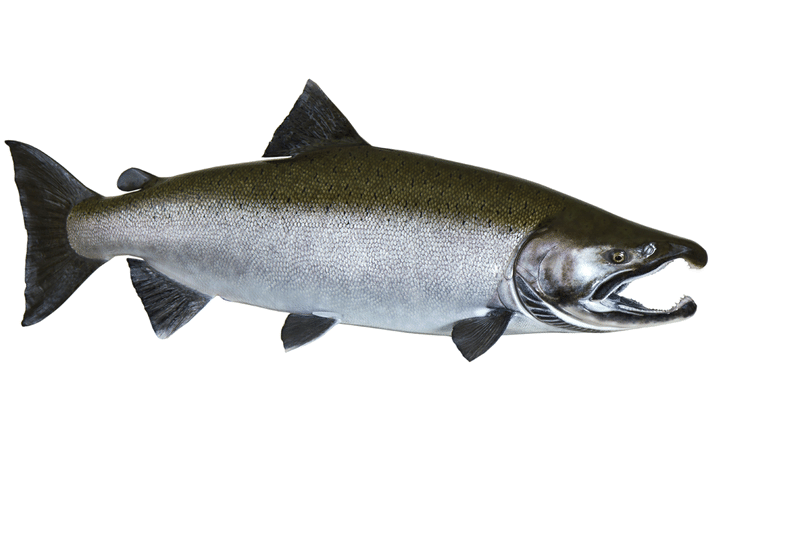

_A store sells salmon for $6.99 per pound. What is the rate for 6 pounds of salmon?_

**You know the rate per pound. You need to find the rate for 6 pounds. So you can multiply the unit rate by 6 to find the equivalent ratio.**

$\frac{\$6.99}{1 \ pound} \left(\frac{6}{6} \right) = \frac{\$41.94}{6 \ pounds}$

**The rate for 6 pounds of salmon is $41.94.**

**Now let’s go back to the problem from the introduction and work on solving that problem.**

Real-Life Example Completed
---------------------------

**_The Top of the World - Mount Everest_**

**Here is the original problem once again. First, reread it. Then you will need to write and simplify two ratios. One ratio will represent the numbers from the best year on Everest and one ratio will represent the numbers from the worst year on Everest. There are two parts to your answer.**

Josh sat at the breakfast table with his nose in a book. His Mom poured some cereal into a bowl and put it down in front of him. Karen, Josh’s sister came into the kitchen and sat down next to him.

“What are you reading?” she asked.

“I am reading a book about Mount Everest,” Josh said without looking up.

“Alright Josh, now put the book down and eat something,” their Mom instructed.

“It is terrific. Do you know that during the best year on Everest, and best meaning the year that the least number of people died, that 129 people summitted and only 8 died,” Josh said smiling.

“That hardly seems like something to smile about,” Mom said sipping her coffee.

“Yeah, how morbid,” Karen chimed in.

“Listen it may be morbid, but it is a fact. During the worst year, only 98 people summitted and 15 died. That is a lot of people. I mean we can compare the number of people who summitted and the number of people who didn’t make it,” Josh said.

“Well, it proves that Everest is a dangerous place and not a trip to be taken lightly,” Mom said.

“Yes, but think about how amazing it would be to stand on the top of the world!” Josh said.

“How do they figure out that the best year is the best and the worst year is the worst based on those numbers?” Karen asked.

“They compare the ratios,” Josh explained. “Let me tell you how.”

**_Solution to Real – Life Example_**

**We are going to write two ratios that we can compare. One ratio will represent the best year on Everest and one will represent the worst year on Everest.**

**First, let’s look at the numbers from the best year on Everest.**

**129 people summitted**

**8 died**

**The ratio is 129 : 8.**

**However, we want to simplify this ratio to get a better idea of the size of the ratio. Let’s rewrite it in fraction form and simplify it.**

$\frac{129}{8}= \frac{16}{1}$

**This means that for every 16 people who summitted one did not make it.**

**Now let’s look at the numbers for the worst year on Everest.**

**98 people summitted**

**16 people died**

$$
\frac{98}{16} = 6.5 \ to \ 1
$$

**This means that for every $6 \frac{1}{2}$ people who summitted, one did not make it.**

**From these ratios, you can see how the best year compares to the worst year on Everest.**

Vocabulary
----------

Here are the vocabulary words that are found in this lesson.

__Ratio__

a way of comparing two numbers or quantities. Ratios can be written in fraction form, with a colon or by using the word “to”.

__Unit Rate__

a ratio that is comparing a quantity to one. The word “per” is a key word with unit rates.

__Equivalent Rate__

two rates that are equal although different values are being used to represent the same quantities.

**_Resources_**

www.mnteverest.net

Time to Practice
----------------

Directions: Look at each ratio. Then write it in the other two ways that it can be written.

1.  16 to 3
2.  4 to 5
3.  1 : 4
4.  $\frac{12}{1}$
5.  6 : 11
6.  33 to 100
7.  $\frac{4}{9}$
8.  3 to 4
9.  45 to 12
10. 12 : 12

Directions: Simplify each ratio and write your answer in fraction form.

11. 4 to 12
12. 5 : 20
13. 36 to 6
14. 18 : 36
15. 20 to 100

Directions: Use what you have learned about ratios to solve each problem.

**In Kyle’s drawer, there are 14 pairs of white socks and 8 pairs of black socks**

16. Write the ratio of black socks to white socks.
17. Write the ratio of black socks to total socks.
18. Write the ratio of white socks to total socks.
19. There are 150 apartments in the Gray building. Of these, 60 are rented and the rest are owned. There are 65 apartments in the Black building. Of these, 45 are rented and the rest are owned. Which building has a larger ratio of owned apartments to total apartments, and by how much?
20. Susan drove a total of 182 miles in three and a quarter hours. If she drove the same speed the whole drive, what was her rate in miles per hour?
21. Holly works at a library reshelving books. She reshelved 960 books in 4 hours. What is Holly’s rate of reshelving in books per hour?
22. Sam bought 9.5 pounds of peaches to make a pie. The peaches cost $15.39. What was the unit rate of the peaches?
23. A vacation house costs $1,100 to rent per month. If there are 30 days in the month, what is the daily rate?
24. Julie can type 55 words per minute. What is the equivalent rate of typing 15 minutes?
25. Don can wrap 8 presents in an hour. What is Don’s rate for 12 presents?

</article>

### 4.2 Writing and Solving Proportions

<article>

Introduction
------------

**_Rapid Reading_**

Josh looked at the clock. He still had 18 minutes left to read. Josh opened the book and read about Sir Edmund Hillary and Tenzing Norgay and their first ascent up the mountain on May 29, 1953. He was so engrossed in his reading that he did not even hear the bell ring.

“Time to go,” his friend Evan said tipping the book a little as he went by.

Josh looked up at the clock and then down at this book. He had read 10 pages in 18 minutes. Josh was excited. He picked up the book and thought about silent reading time. He had read 10 pages in 18 minutes so he was sure that he would read more pages during silent reading time since that was a 30 minutes block of time. Josh began to think about the number of pages that he would read during silent reading time.

**Is this true? If Josh reads during silent reading time at the same rate that he did during math class, how many pages will he read? To figure this out, you will need to know how to write a proportion and solve it. This lesson will teach you all that you need to know so you can apply what you learn to this problem at the end of the lesson.**

**_What You Will Learn_**

In this lesson, you will learn how to complete the following skills.

* Write proportions given verbal descriptions.
* Write and solve proportions using equivalent ratios.
* Write and solve proportions using algebra or cross-products.
* Model and solve real-world problems using proportions.

**_Teaching Time_**

I. **Write Proportions Given Verbal Descriptions**

In the last lesson, you learned how to identify a ratio. Let’s review for just a moment. **A** **_ratio_** **is a comparison between two quantities or numbers. Ratios can be written in fraction form, with a colon or by using the word “to”.**

Sometimes, you will compare ratios. Sometimes one ratio will be greater than another, and other times they can be **equal or** **_equivalent_**. When you have two equal ratios, you have a proportion.

**A** **_proportion_** **is created when two ratios are equal, or we can say that two equal ratios form a proportion.**

We can write a proportion when we know that two ratios are equivalent.

Example

$1 : 2 = 2 : 4$

**These two ratios are equivalent. We can say that the two ratios form a proportion.**

Example

_Do these two ratios form a proportion?_

$\frac{3}{4}$ and 4 : 24

**To figure this out, we have to figure out if the two ratios are equivalent. If they are, then we know that they form a proportion. If not, then they don’t. To figure this out, we can simplify the ratios.**

$$
\begin{align*}
& \qquad \ \frac{3}{4} \ is \ in \ simplest \ form.\\
& 4 : 24 \ can \ be \ written \ as \ \frac{4}{24} = \frac{1}{6}\\
& \qquad \qquad \quad \ \ \frac{3}{4} \ne \frac{1}{6}
\end{align*}
$$

**These ratios do not form a proportion.**

**These proportions were given to you. You can also write your own proportions.**

**To write a proportion, set two equivalent fractions equal to each other, using the information in the problem.**

For example, if you know the ratio of girls to boys in a class is 2 : 3, and you know there are 24 boys in the class, you can write a proportion in order to find the number of girls in the class. **The most important thing to remember when writing a proportion is to keep the units the same in both ratios.**

$\frac{girls}{boys}: \frac{2}{3} = \frac{x}{24}$

**You know the fractions are equivalent because each shows the ratio of girls to boys in the class. The first fraction shows the known ratio of girls to boys. The second ratio shows the known number of boys in the class, 24, and uses a variable to stand for the unknown number of girls.**

Now you are ready to try another example.

Example

_The proportion of red paper to white paper in a stack is 2 to 7. If there are 32 red pieces of paper, what proportion could be used to find the number of pieces of white paper?_

Write the known ratio of red paper to white paper as the first fraction: $\frac{2}{7}$.

Now write the second ratio, using $x$ to stand for the unknown amount. Make sure to keep the units the same as in the first fraction. In this case, the unknown is the amount of white paper, which is in the denominator of the fraction.

$\frac{\text{red paper}}{\text{white paper}} : \frac{2}{7} = \frac{32}{x}$

**The proportion $\frac{2}{7} = \frac{32}{x}$ could be used to find the number of pieces of white paper in the stack.**

**You will learn how to solve proportions in another section, just work on writing them in this section.**

_Jimmy makes $12 per hour. If he makes a total of $84, what proportion could be used to find the number of hours he worked?_

In this case, you are given a unit rate. Write the unit rate as a ratio: $\frac{12}{1}$.

Now write the second ratio, using $x$ to stand for the unknown amount. Make sure to keep the units the same as in the first fraction.

$\frac{dollars}{hours} : \frac{12}{1} = \frac{84}{x}$

**The proportion $\frac{dollars}{hours} : \frac{12}{1} = \frac{84}{x}$ could be used to find the number of hours Jimmy worked.**

Now let’s look at using equivalent ratios with proportions.

II. **Write and Solve Proportions using Equivalent Ratios**

In the last section, you learned how to write proportions to describe situations involving ratios. Now you are going to use that information to write and solve proportions.

_The ratio of teachers to students in a certain school is 2 : 25. If there are 400 students in the eighth-grade class, how many teachers are there?_

**First set up a proportion. The problem gives a ratio of teachers to students, so set up two equivalent ratios comparing teachers to students.**

$$
\frac{teachers}{students} = \frac{8^{th} \ grade \ teachers}{8^{th} \ grade \ students}
$$

**You can see that we are comparing teachers to students in both ratios. The first one shows the ration in the whole school and the second ratio represents the eighth grade ratios. Next, we fill in the given information.**

$\frac{2}{25} = \frac{x}{400}$

**Now use what you know about equivalent ratios to solve the proportion.** Look at the denominators. You know that the first fraction, when the numerator and denominator are multiplied by some number, will equal the second fraction. What number, when multiplied by 25, will equal 400? Since $25 \times 16 = 400$, the denominator was multiplied by 16. That means you can multiply the numerator by the same number to find the value of $x$.

$2 \times 16 = 32$, so $x = 32$

**There are 32 teachers in the eighth-grade class.**

Note: You can check that your answer is correct by making sure that the two ratios are equivalent.

$\frac{32}{400} = \frac{8}{100} = \frac{2}{25}$

Since the second ratio simplifies to the first, the ratios are equivalent.

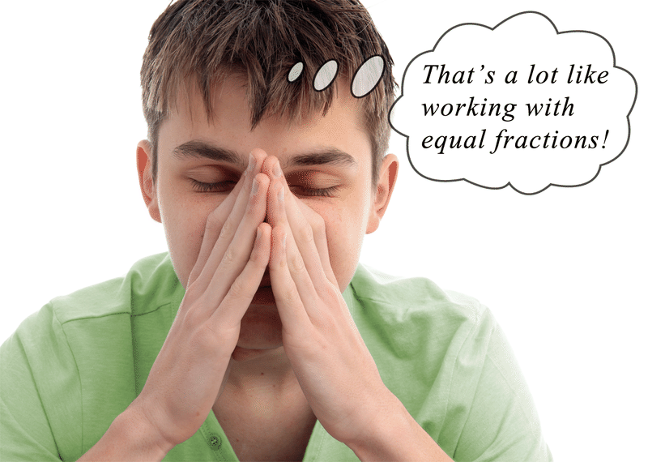

_The ratio of apples to bananas at a store is 3 to 8. If there are 90 apples, how many bananas are there?_

**Set up a proportion. Be sure that your units match up. Here apples are in the numerator position and bananas are in the denominator position. Be sure that this stays consistent throughout your work.**

$\frac{apples}{bananas} : \frac{3}{8} = \frac{90}{x}$

**Now use what you know about equivalent ratios to solve the proportion.** What number, when multiplied by 3, equals 90? Since $3 \times 30 = 90$, the numerator was multiplied by 30. So, multiply the denominator by 30 to find the value of $x$.

$8 \times 30 = 240$, so $x = 240$

**There are 240 bananas at the store.**

Now let’s look at another way to solve proportions.

III. **Write and Solve Proportions using Algebra or Cross-Products**

In the last section you worked on solving proportions. Most of the examples that you completed could be solved by using mental math and what you knew about equal ratios. Sometimes, you won’t be able to use mental math and prior knowledge to solve a proportion. When this happens, you will need to figure out a different strategy.

**Another way of solving a proportion is called cross-multiplying. Here is the rule you should know.**

**If $\frac{a}{b} = \frac{c}{d}$, then $ad = cb$.**

**This is also called “the product of the means is equal to the product of the extremes.” The values in the $b$ and $c$ positions are called the** **_means_****, and the values in the $a$ and $d$ positions are called the extremes.**

**However, you can just think of multiplying the values that are diagonal to each other, making an $X$. After cross-multiplying, you can use algebra to solve for the variable. Let’s apply this information now.**

Example

$\frac{x}{5} = \frac{9}{10}$

**With this example, we have been given a proportion that needs solving. To solve it, we can cross-multiply.**

$10(x) = 10x$

$9(5) = 45$

$$
10x = 45
$$

**Next, we can solve using algebra. We divide 45 by 10 to find the value of the variable.**

$$
x = 4.5
$$

**This is our answer.**

Example

$\frac{4}{5} = \frac{16}{x}$

**This proportion is written differently because the variable is in a different location. However, we can still solve it by using cross-products.**

$$
\begin{align*}
4x &= 80\\
x &= 20
\end{align*}
$$

**This is the answer.**

Now let’s look at how we can use proportions to solve real – world problems.

IV. **Model and Solve Real – World Problems using Proportions**

We can apply what we have learned about solving proportions to real-world problems too.

_Amanda read 18 pages in 23 minutes. At this rate, how many pages will she read in 45 minutes?_

**First, set up a proportion.**

$\frac{18}{23} = \frac{x}{45}$

**You cannot easily use equivalent fractions to solve this proportion. Cross-multiply to solve the proportion.**

$23x = 18(45)$

**Now simplify the equation and solve for $x$.**

$$
\begin{align*}
23x &= 810\\
x & \approx 35.2
\end{align*}
$$

**Amanda will read about 35.2 pages in 45 minutes.**

Example

_At a store, 3 pounds of chicken sells for $13.50. How many pounds of chicken can someone buy for $30?_

**Set up a proportion.**

$\frac{3}{13.50} = \frac{x}{30}$

**Cross-multiply and use algebra to solve for $x$.**

$$
\begin{align*}
13.5x &= 3(30)\\
13.5x &= 90\\
x & \approx 6.67
\end{align*}
$$

**You could buy about 6.67 pounds of chicken for $30.**

**Now let’s go back and work on solving the problem from the introduction.**

Real-Life Example Completed
---------------------------

**'Rapid Reading**

**Here is the original problem once again. Reread it and then write a proportion to show the reading time and pages during both math and silent reading. Finally, solve the proportion to show the number of pages Josh will read during silent reading time. There are two parts to your answer.**

Josh is very excited about his book on Mount Everest. He took the book to school and has been reading it every chance he can. In fact, he finished his work in math class so quickly that Ms. Henje made him check his work to be sure that it was accurate. Josh was very excited that it was accurate.

Josh looked at the clock. He still had 18 minutes left to read. Josh opened the book and read about Sir Edmund Hillary and Tenzing Norgay and their first ascent up the mountain on May 29, 1953. He was so engrossed in his reading that he did not even hear the bell ring.

“Time to go,” his friend Evan said tipping the book a little as he went by.

Josh looked up at the clock and then down at this book. He had read 10 pages in 18 minutes. Josh was excited. He picked up the book and thought about silent reading time. He had read 10 pages in 18 minutes so he was sure that he would read more pages during silent reading time since that was a 30 minutes block of time. Josh began to think about the number of pages that he would read during silent reading time.

**_Solution to Real – Life Example_**

**First, we need to write a proportion to show the comparison between time and pages read.**

**Let’s begin with math class.**

**Josh read 10 pages in 18 minutes. Let’s write the first ratio.**

$$
\frac{10}{18}
$$

**Next, Josh will read for 30 minutes during silent reading time. We need to figure out the number of pages, so that is our unknown.**

$$
\frac{x}{30}
$$

**Here is the proportion.**

$$
\frac{10}{18} = \frac{x}{30}
$$

**We can cross multiply and solve.**

$$
\begin{align*}
18x &= 300\\
x &= 16.6
\end{align*}
$$

**Josh will read about $16 \frac{1}{2}$ pages during silent reading time.**

Vocabulary
----------

Here are the vocabulary words that are found in this lesson.

__Ratio__

a comparison between two quantities. Ratios can be written in fraction form, with a colon or by using the word “to”.

__Equivalent__

means equal.

__Proportion__

formed when two ratios are equivalent. We compare two ratios, they are equal and so they form a proportion.

Time to Practice
----------------

Directions: Solve each proportion using equal ratios.

1.  $\frac{3}{4} = \frac{x}{12}$
2.  $\frac{5}{6} = \frac{x}{12}$
3.  $\frac{4}{7} = \frac{8}{y}$
4.  $\frac{2}{3} = \frac{12}{y}$
5.  $\frac{4}{5} = \frac{44}{y}$
6.  $\frac{12}{13} = \frac{x}{26}$
7.  $\frac{9}{10} = \frac{81}{y}$
8.  $\frac{6}{7} = \frac{18}{y}$
9.  $\frac{7}{8} = \frac{x}{56}$
10. $\frac{12}{14} = \frac{36}{x}$

Directions: Solve each proportion by using cross – multiplying with algebra. You may round to the nearest tenth when necessary.

11. $\frac{3}{5} = \frac{y}{2.5}$
12. $\frac{6}{7} = \frac{2.5}{y}$
13. $\frac{4}{5} = \frac{2}{x}$
14. $\frac{9}{11} = \frac{14}{x}$
15. $\frac{2}{3} = \frac{5}{y}$

Directions: Solve each problem.

16. The ratio of fiction to nonfiction books at a library is 5 to 3. If there are 480 nonfiction books, write a proportion that could be used to find $f$, the number of fiction books.
17. The ratio of cherry trees to apple trees at an orchard is 4 to 9. If there are 184 cherry trees, write a proportion that could be used to find $a$, the number of apple trees.
18. The ratio of cars to SUVs in a parking lot is 10 to 7. If there are 84 SUVs, write a proportion that could be used to find $c$, the number of cars in the lot.

Directions: Write a proportion and use equivalent ratios to solve the following problems.

19. Marco makes $25 for every 2 hours he works. If he works for 12 hours, how much will he make?
20. Corinne runs 2.8 miles in 30 minutes. If she runs for 150 minutes this week, how many miles will she have run?
21. Adam drives 45 miles per hour. If he drives for 3.5 hours, how many miles will he have driven?

Directions: Write a proportion and use cross-multiplying to solve the following problems.

22. Marni buys 2.5 pounds of grapefruit for $4.48. To the nearest cent, how much would 6 pounds of grapefruit cost?
23. Glenn can make 8 flyers in 35 minutes. How long will it take him to make 50 flyers?
24. A store sells 21 pieces of clothing every 45 minutes. How long will it take the store to sell 100 pieces of clothing?
25. The basketball team scored 85 points in the last 2 games. How many points can they expect to score after 5 games?

</article>

### 4.3 Unit Scale and Scale Factor

<article>

Introduction
------------

**_A Model of Everest_**

“Hi Josh, what are you working on?” she asked.

“Well, I am going to build a model of Mount Everest for my geography project. I am reading this really cool book about it. So I’m trying to figure out what scale to use for the model,” he explained grinning from ear to ear.

“What do you mean “scale”?”

“If you are going to build a model, you have to use a scale. You shrink down the real dimensions so that you can actually build a model that everyone will be able to see, think about it, Everest is 29,035 feet high, you can’t build that using the real dimensions,” Josh said.

“Oh I get it, so you use $1^{\prime\prime}$ for 1 foot.”

“That’s the right idea, but $1^{\prime\prime}$ is definitely too big. If I used $1^{\prime\prime}$ equals 1 foot for the scale, I would have a model that is 29,035 feet high. I need to use a smaller unit of measurement,” Josh said.

“What about $\frac{1}{4}$?” Sasha suggested.

“That’s possible, but it still will probably be too big,” he stopped talking to scribble some numbers down in his notebook. “I think that $\frac{1}{8}^{\prime\prime} = 2000 \ feet$ will be perfect.”

Sasha looked puzzled.

**Do you understand what Josh was working on? How did he come to that scale? Why do you think Sasha is puzzled? What will the actual dimensions of the model be? To answer these questions, you will need to understand scale, scale factor and ratios. Pay attention to the information presented in this lesson and you will be all ready to answer these questions by the end.**

**_What You Will Learn_**

In this lesson, you will learn the following skills.

* Express unit scale as the ratio between units of measure of scale dimensions to actual dimensions.
* Use unit scale to find actual dimensions or scale dimensions, given necessary information.
* Express scale factor as the ratio of scale dimensions to actual dimensions, without regard to units.
* Use scale factor to find actual dimensions or scale dimensions, given necessary information.

**_Teaching Time_**

I. **Express Unit Scale as the Ratio between Units of Measure of Scale Dimensions to Actual Dimensions**

In the past two lessons, you have been working with ratios. In this lesson, you are going to use ratios in a new way, but first let’s review what we mean when we talk about a ratio.

**A** **_ratio_** **is a comparison between two quantities. We can write a ratio in fraction form, by using a colon or by using the word “to”.**

Sometimes in life, we have a real-life object that we want to represent in a smaller form. Think about buildings. We can’t build an actual building to show the dimensions in a smaller way, so we build a model of the building. When we do this, we take the actual dimensions and shrink them down to build a model. When we do this, we create a **_unit scale_** for the model. **When we create a** **_unit scale_****, we decide on a measurement to represent an actual measurement.**

**1 inch = 3 feet**

This is an example of a unit scale. I have a unit represented by the one inch. Remember that when we talk about unit, we are talking about a relationship to one. We have one inch represented by three feet.

**The one inch is the scale dimension and the three feet is the actual dimension we are measuring.**

**Now, not all objects that you will create a model of will measure exactly what the unit scale does, so we have to use a unit scale to show the relationship between** **_scale dimensions_** **and** **_actual dimensions_****.** **_Scale dimensions_** **are the dimensions of the model, and** **_actual dimensions_** **are the real – life dimensions.**

Example

Using the unit scale above, what would be the relationship between the scale dimensions and the actual dimensions for an object 24 feet long?

**First, let’s think about our unit scale.**

**1 inch = 3 feet**

**If we have a building 24 feet long, that is the actual dimensions. We need to represent the dimensions using our unit scale.**

**We can say that 8 inches = 24 feet. This is our answer.**

II. **Use Unit Scale to Find Actual Dimensions or Scale Dimensions,**

**Given Necessary Information**

In the last section, we began using unit scale to find scale dimensions if we had been given the actual dimensions. We can also work the other way around. If we know the scale dimensions and the unit scale, then we can find the actual dimensions.

**Necessary Information**

1.  **To find the scale dimensions, we need the unit scale and the actual dimensions**
2.  **To find the actual dimensions, we need the unit scale and the scale dimensions.**

**Now let’s apply this information with a few examples.**

Example

What is the scale length of the object if the unit scale is 2 inches : 4 feet and the actual dimensions of the object is 20 feet?

**First, let’s make sure that we have been given all of the necessary information. First, the unit scale has been given.**

**2 inches : 4 feet**

**So for every four feet of the building, we are going to have 2 inches of our model.**

**The actual length of the building has also been given. It is 20 feet. We can figure this out using a proportion.**

$$
\frac{scale \ dimension}{actual \ dimension} = \frac{2 \ in}{4 \ ft} = \frac{x}{20 \ ft}
$$

**Notice that we used a different form of the ratio to solve this proportion. Now we can solve it. Four times five equals twenty, so we can do this to the top measurement. Two times five is equal to 10.**

**The scale dimension for length would be 10 inches.**

Example

Using a unit scale of 1 inch : 8 feet, what is the actual dimension of an object with a scale dimension for length of 5 inches?

**First, let’s make a note of the unit scale.**

**1 inch = 8 feet**

**We have been given the scale dimension and not the actual dimension. We are going to need to solve for the actual dimension. Let’s write a proportion to do this.**

$$
\frac{scale \ dimension}{actual \ dimension} = \frac{1 \ in}{8 \ ft} = \frac{5 \ in}{x}
$$

**We can see that one times five is equal to five. We can do this to the actual dimension as well. Eight times five is equal to forty.**

**The actual length of the building is 40 feet.**

III. **Express Scale Factor as the Ratio of Scale Dimensions to Actual Dimensions, without Regard to Units**

Once you know what information you need and what information you are looking for, you can work on figuring out the actual dimensions of different items. If we know the scale factor, or the relationship between the measurement and the actual size, we can figure out the missing measurements by using proportions. Notice that we don’t have to know the units to do this.

**For example, let’s say that the scale is 1 : 2.**

**We can use this information to determine the** **_scale factor_****. The** **_scale factor_** **is the relationship between the scale dimension and the measurement comparison between the scale measurement of the model and the actual length.**

**In this case, it is $\frac{1}{2}$.**

Example

What is the scale factor if 3 inches is equal to 12 feet?

**We can write a ratio to show the scale factor.**

$$
\frac{3}{12} = \frac{1}{4}
$$

**The scale factor is 1 : 4. It is expressed in simplest form.**

**Now let’s look at applying this information further.**

**If the scale dimension is 4, then we can figure out the actual dimension. Here is a proportion to show these two ratios.**

$1 : 2 = 4 : x$

**Let’s use fraction form of the ratios to make this clearer.**

$$
\frac{1}{2} = \frac{4}{x}
$$

See the units aren’t necessary for figuring out the missing part of the proportion. We can simply use what we have learned to find the actual dimension.

1 times 4 = 4

2 times 4 = 8

$$
\frac{1}{2} = \frac{4}{8}
$$

**This is the answer.**

Let’s look at another one.

Example

Find the missing actual dimension if the scale factor is 2 : 3 and the scale measurement is 6.

**First, we can set up a proportion.**

$$
2 : 3 = 6 : x
$$

**Now we can use fraction form to make it easier to solve this proportion.**

$$
\frac{2}{3} = \frac{6}{x}
$$

$2 \times 3 = 6$

$3 \times 3 = 9$

$$
\frac{2}{3} = \frac{6}{9}
$$

**This is the answer.**

**_Notice that while units such as inches, feet, etc are helpful, they aren’t necessary for figuring out a missing dimension as long as you know the scale factor._**

IV. **Use Scale Factor to Find Actual Dimensions or Scale Dimensions, Given Necessary Information**

Now we can look at applying scale factor to our work when we do know the units. To use scale factor to find actual dimensions or scale dimensions, we will need to know a few things.

**Necessary Information:**

1.  **Scale Factor**
2.  **One other dimension either the actual or the scale dimension must be given**

**So, if we have three parts of the proportion, we can solve for the last missing part. Let’s look at an example.**

The plans for a flower garden show that it is 6 inches wide on the plan. If the scale for the flower garden is 1 : 12, what is the actual width of the flower garden?

**To work on this problem, we first need to write two ratios that form a proportion. We have the scale factor and we have the scale measurement. We are missing the actual measurement. Let’s figure out the actual measurement of the garden.**

$$
1 : 12 = 6 : x
$$

**Now we have two ratios that form a proportion. Let’s write them both in fraction form so that we can work easily in solving for the missing measurement.**

$$
\frac{1}{3} = \frac{12}{x}
$$

**Now we can cross multiply or solve it by using equal ratios.**

$1 \times 12 = 12$

$3 \times 12 = 36$

**The measurement of the garden is 36 inches, which is the same as three feet.**

Example

A driveway has a length of 24 feet. If the scale is 2 inches : 4 feet, what is the scale factor? How many inches will be drawn to represent the driveway?

**Notice that there are two parts to this problem. First, we have to identify the scale factor.**

$$
\frac{2}{4} = \frac{1}{2}
$$

**The scale factor is 1 : 2.**

**Next, we need to figure out how many inches will be drawn to represent the driveway. To do this, we write a proportion.**

$$
\frac{2}{4} = \frac{x}{24}
$$

**We can cross multiply and divide or use equal ratios to solve this. Let’s use equal ratios. We work with the denominators.**

$4 \times 6 = 24$

$2 \times 6 = 12$

**The driveway will be represented by 12 inches or 1 foot.**

**Now let’s go back to the problem in the introduction and work on solving it with what we have learned.**

Real-Life Example Completed
---------------------------

**_A Model of Everest_**

**Here is the original problem once again. First, reread it. Then write a ratio to represent the scale that Josh has decided to use for the model. After that, figure out how many feet one inch will represent. Then use that scale to figure out the actual dimensions of Josh’s model using proportions. Notice that there are three parts to your answer.**

Josh is so excited about Mount Everest that he has decided to create a model of the mountain for his geography class. Mr. Watkins approved the project and so Josh is putting together all of the information. During lunch, instead of talking with his friends, he took out his notebook and began figuring out how to measure the mountain. His friend Sasha spotted him and came over.

“Hi Josh, what are you working on?” she asked.

“Well, I am going to build a model of Mount Everest for my geography project. I am reading this really cool book about it. So I’m trying to figure out what scale to use for the model,” he explained grinning from ear to ear.

“What do you mean “scale”?”

“If you are going to build a model, you have to use a scale. You shrink down the real dimensions so that you can actually build a model that everyone will be able to see, think about it, Everest is 29,035 feet high, you can’t build that using the real dimensions,” Josh said.

“Oh I get it, so you use $1^{\prime\prime}$ for 1 foot.”

“That’s the right idea, but $1^{\prime\prime}$ is definitely too big. If I used $1^{\prime\prime}$ equals 1 foot for the scale, I would have a model that is 29,035 feet high. I need to use a smaller unit of measurement,” Josh said.

“What about $\frac{1}{4}$?” Sasha suggested.

“That’s possible, but it still will probably be too big,” he stopped talking to scribble some numbers down in his notebook. “I think that $\frac{1}{8}^{\prime\prime} = 2000 \ feet$ will be perfect.”

Sasha looked puzzled.

**Solution to Real – Life Example**

**First, let’s write a ratio to show the scale that Josh has selected.**

$\frac{1}{8}^{\prime\prime} = 2000 \ feet$

$$
\frac{\frac{1}{8}^{\prime\prime}}{2000 \ ft}
$$

**Next, we write a ratio to show how many feet are in $1^{\prime\prime}$. We can use a proportion to complete this task.**

$$
\frac{\frac{1}{8}^{\prime\prime}}{2000 \ ft} = \frac{1^{\prime\prime}}{x}
$$

**If we cross multiply and divide, we can see that $1^{\prime\prime} = 16,000 \ feet$.**

**Now we can use this information to figure out the dimensions of the model. Once again, use a proportion.**

$$
\frac{1^{\prime\prime}}{12,000 \ ft} = \frac{x}{29,035 \ ft}
$$

**We cross multiply and divide.**

$$
\begin{align*}
12,000x &= 29,035\\
x &= 1.8 \ feet
\end{align*}
$$

**Josh’s model will be 1.8 feet tall, a workable size for a model.**

Vocabulary
----------

Here are the vocabulary words that are found in this lesson.

__Ratio__

a comparison between two quantities. Ratios can be shown using a colon, a fraction bar or by using the word “to”.

__Unit Scale__

the scale of measurement used to represent actual dimensions in a model or drawing. The scale includes units of measurement such as inches, feet, meters.

__Scale Dimension__

the measurement used to represent actual dimensions in a drawing or on a map.

__Actual Dimension__

the real – life dimension of the object or building.

__Scale Factor__

the ratio of scale to actual dimension written in simplest form.

Time to Practice
----------------

Directions: Find the scale dimension given the scale and the actual dimension using proportions. Write a proportion and an answer for each problem. There are two answers for each problem.

1.  Scale is $1^{\prime\prime} = 2 \ ft$, the actual dimension is 18 feet
2.  Scale is $1^{\prime\prime} = 5 \ feet$, the actual dimension is 20 feet
3.  Scale is $\frac{1}{2}^{\prime\prime} = 2 \ feet$, actual dimension is 10 feet
4.  Scale is $1^{\prime\prime} = 12 \ feet$, actual dimension is 72 feet
5.  Scale is $3^{\prime\prime} = 4 \ feet$, actual dimension is 16 feet

Directions: Using a scale of 1 to 2, figure out the actual dimensions given each scale.

6.  4 to \_\_\_\_\_
7.  6 to \_\_\_\_\_
8.  9 to \_\_\_\_\_
9.  12 to \_\_\_\_\_
10. 14 to \_\_\_\_\_

Directions: Using a scale of 3 to 4, figure out the actual dimensions given each scale.

11. 6 to \_\_\_\_\_
12. 9 to \_\_\_\_\_
13. 12 to \_\_\_\_\_
14. 18 to \_\_\_\_\_
15. 36 to \_\_\_\_\_

Directions: Figure out each scale factor.

16. $\frac{2 \ inches}{8 \ feet}$
17. $\frac{3 \ inches}{12 \ feet}$
18. $\frac{6 \ inches}{24 \ feet}$
19. $\frac{11 \ inches}{33 \ feet}$
20. $\frac{16 \ inches}{32 \ feet}$

Directions: Solve each problem.

21. A rectangle has a width of 2 inches. A similar rectangle has a width of 9 inches. What scale factor could be used to convert the larger rectangle to the smaller rectangle?
22. A drawing of a man is 4 inches high. The actual man is 64 inches tall. What is the scale factor for the drawing?
23. A map has a scale of 1 inch = 4 feet. What is the scale factor of the map?
24. A drawing of a box has dimensions that are 2 inches, 3 inches, and 5 inches. The dimensions of the actual box will be $3\frac{1}{4}$ times the dimensions in the drawing. What are the dimensions of the actual box?
25. A room has a length of 10 feet. Hadley is drawing a scale drawing of the room, using the scale factor $\frac{1}{50}$. How long will the room be in Hadley’s drawing?
26. The distance from Anna’s room to the kitchen is 15 meters. Anna is making a diagram of her house using the scale factor of $\frac{1}{150}$. What will be the distance on the diagram from Anna’s room to the kitchen?
27. On a map of Cameron’s town, his house is 9 inches from his school. If the scale of the map is $\frac{1}{400}$, what is the actual distance **in feet** from Cameron’s house to his school?

</article>

### 4.4 Scale in Two Dimensions

<article>

Introduction
------------

**_Drawing Everest_**

“What?”

“This is a picture of Everest from space. The space shuttle Endeavor took it on October 10, 1994. It was a clear day too, so it should be pretty accurate. They wanted to measure the area of the mountain,” Josh said smiling.

“You and Mount Everest, but it is pretty cool,” Carlo said looking at the picture.

“I’m going to make a drawing of this,” Josh said taking out a piece of paper to make some notes.

In looking at the website, Josh discovered that the space shuttle Endeavor figured out that the length of Mount Everest from space is 43 miles and the width of Everest from space is 24 miles long. Josh wrote down the measurement $\frac{1}{4}^{\prime\prime} = 1 \ mile$.

**If Josh uses this measurement, what will the dimensions of his drawing be? Will it fit on $11^{\prime\prime} \times 14^{\prime\prime}$ paper? What is the actual area of Everest according to the space shuttle?**

**This lesson is all about scale drawings. Use what you learn to help you to answer these questions.**

**If you want to see the pictures Josh and Carlo saw go to**

www.solarviews.com/cap/earth/everest2.htm

**_What You Will Learn_**

In this lesson, you will learn how to complete the following skills.

* Read and interpret scale drawings and floor plans.
* Read and interpret maps for distance and area.
* Compare scale relationships of distance and area.
* Solve real-world problems involving two-dimensional scale drawings and maps.

**_Teaching Time_**

I. **Read and Interpret Scale Drawings and Floor Plans**

In the last lesson, we looked at scale factors and how to use that ratio to find scale and actual dimensions. In this lesson, we’ll look at how you can set up a proportion using scale factors from scale drawings and maps.

**A** **_scale drawing_** **or floor plan is a representation of an actual object or space drawn in two-dimensions.** For a floor plan, you can imagine that you are directly above the building looking down. The lines represent the walls of the building, and the space in between the lines represents the floor.

**In order to find the actual dimensions from a floor plan, you can set up and solve a proportion. The scale given in the drawing is the first ratio. The unknown length and the scale length is the second ratio.**

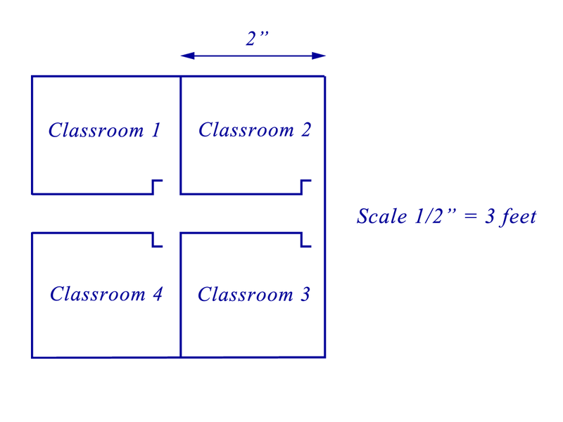

_This floor plan shows several classrooms at Craig’s school. The length of Classroom 2 in the floor plan is 2 inches. What is the actual length, in feet, of Classroom 2?_

**Set up a proportion.** The scale in the drawing says that $\frac{1}{2} \ inch = 3 \ feet$. So set up a ratio using these values: $\frac{0.5 \ inch}{3 \ feet}$.

**Now write the second ratio.** You know the scale length is 2 inches. The unknown length is $x$. Make sure that the second ratio follows the form of the first ratio: inches over feet.

$\frac{0.5 \ inch}{3 \ feet} = \frac{2 \ inches}{x \ feet}$

Now cross-multiply to solve for $x$.

$$
\begin{align*}
(0.5)x &= 2(3)\\
0.5x &= 6\\
x &= 12
\end{align*}
$$

**The actual length of the classroom is 12 feet.**

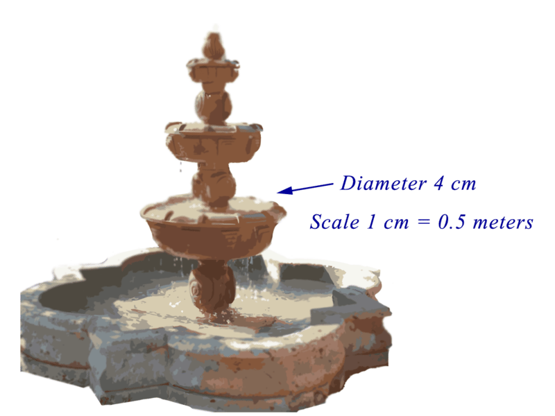

_This scale drawing shows the fountain in front of a hotel. The diameter of the fountain in the scale drawing is 4 centimeters. What is the actual diameter of the fountain?_

Set up a proportion. Write the scale as a ratio.

$\frac{1 \ cm}{0.5 \ m}$

Now write the second ratio, making sure it follows the form of the first ratio.

$\frac{1 \ cm}{0.5 \ m} = \frac{4 \ cm}{x \ m}$

Now cross-multiply and solve for $x$.

$$
\begin{align*}
(1)x &= 4(0.5)\\
x &= 2
\end{align*}
$$

**The actual diameter of the fountain is 2 meters.**

II. **Read and Interpret Maps for Distance and Area**

A map is another type of scale drawing of a region. Maps can be very detailed or very simple, showing only points of interest and distances. You can read a map just like any other scale drawing—by using the scale.

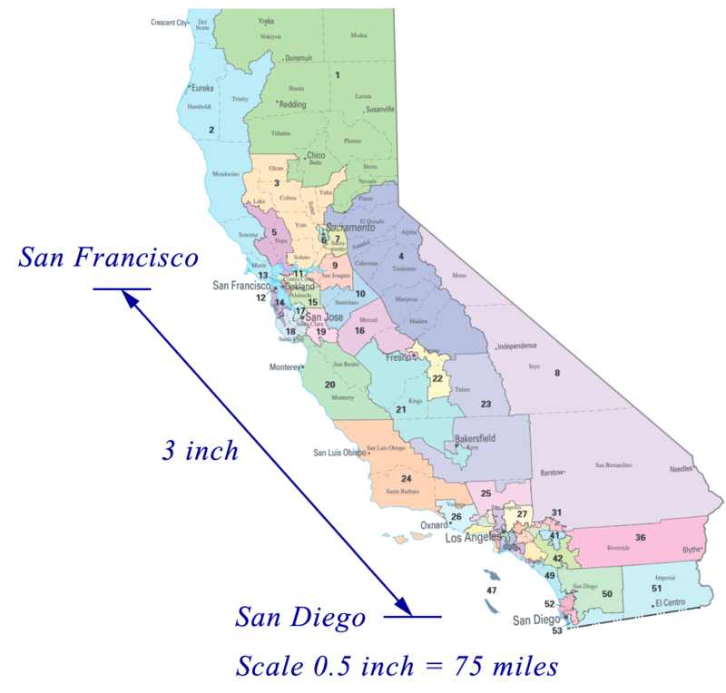

_On the map below, the straight-line distance between San Francisco and San Diego is 3 inches. What is the actual straight-line distance between San Francisco and San Diego?_

**Set up a proportion. Write the scale as a ratio.**

$\frac{0.5 \ inch}{75 \ miles}$

**Now write the second ratio, making sure it follows the form of the first ratio, inches over miles.**

$\frac{0.5 \ inch}{75 \ miles} = \frac{3 \ inches}{x \ miles}$

Now cross-multiply and solve for $x$.

$$
\begin{align*}
(0.5)x &= 3(75)\\
0.5x &= 225\\
x &= 450
\end{align*}
$$

**The straight-line distance between San Francisco and San Diego is 450 miles.**

**We can also use a scale to find the area of a space or region. First, we need to figure out the length and width then we can complete any necessary calculations.**

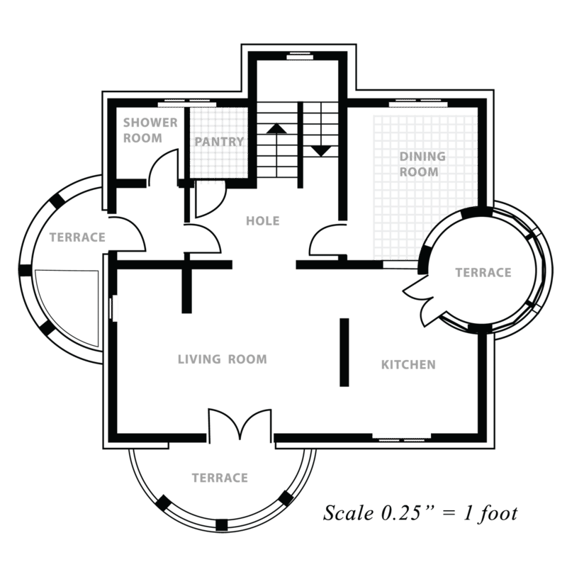

_This floor plan shows Bob’s apartment. The scale dimensions of the living room are 3 inches by 2.5 inches. What is the actual area of his living room?_

**First use a proportion to find the actual length of the living room.** Write the scale as the first ratio, and the scale and unknown actual length of the living room as the second ratio.

$$
\begin{align*}
\frac{0.25 \ inch}{1 \ foot} &= \frac{3 \ inches}{x \ feet}\\
(0.25)x &= 3(1)\\
0.25x &= 3\\
x &= 12
\end{align*}
$$

**Next find the actual width of the living room.**

$$
\begin{align*}
\frac{0.25 \ inch}{1 \ foot} &= \frac{2.5 \ inches}{x \ feet}\\
(0.25)x &= 2.5(1)\\
0.25x &= 2.5\\
x &= 10
\end{align*}
$$

**Now that you know the actual length and width of the room, you can find the area.**

$$
\begin{align*}
A &= lw\\
A &= (12 \ feet)(10 \ feet)\\
A &= 120 \ feet^2
\end{align*}
$$

**The area of the living room is 120 square feet.**

**_Note: Remember just like with any other word problem, you have to figure out what you are solving for and what information has already been given._**

III. **Compare Scale Relationship of Distance and Area**

Sometimes, we will have two different distances or areas that we are working to compare. When this happens, we can use proportions to compare the differences and similarities. Take a look at this example.

Example

_Marta has a square with a side length of 4 inches. She has a similar square with dimensions that are twice the first square. How does the area of the larger square compare to the area of the smaller square?_

**First, find the dimensions of the larger square. The problem states that the dimensions are twice the first square. We can use this information to figure out the scale factor, and this means they are scaled up by a factor of 2. The side length of the larger square is $4 \ inches \times 2 = 8 \ inches$.**

**Next find the area of both squares and compare.**

Area of smaller square:

$$
\begin{align*}
A &= lw\\
A &= (4 \ inches)(4 \ inches)\\
A &= 16 \ inches^2
\end{align*}
$$

Area of larger square:

$$
\begin{align*}
A &= lw\\
A &= (8 \ inches)(8 \ inches)\\
A &= 64 \ inches^2
\end{align*}
$$

**Now compare the two areas. You want to know how the area of the larger square compares to the area of the smaller square. Write a ratio comparing the two areas.**

$\frac{64 \ inches^2}{16 \ inches^2} = 4$

**The area of the larger square is 4 times larger than the area of the smaller square.**

In the previous example, the scale factor that changed the smaller square to the larger square was 2, but the area was 4 times as large. This leads to a rule when comparing areas of similar figures.

")

\[Figure 8\]

**_Write this rule down in your notebook._**

Let’s look at another example.

Example

_Sandy has a garden with a length of 6 feet and a width of 10 feet. He wants to scale up his garden by a factor of 3. How will the area of his new garden compare to the area of the original garden?_

**First, find the dimensions of the new garden.**

$$
\begin{align*}
6 \times 3 &= 18\\
10 \times 3 &= 30
\end{align*}
$$

The dimensions of the new garden will be 18 feet by 30 feet.

**Now find the area of both gardens and compare.**

Area of original garden:

$$
\begin{align*}
A &= lw\\
A &= (6 \ feet)(10 \ feet)\\
A &= 60 \ feet^2
\end{align*}
$$

Area of new garden:

$$
\begin{align*}
A &= lw\\
A &= (18 \ feet)(30 \ feet)\\
A &= 540 \ feet^2
\end{align*}
$$

**Next compare the two areas.**

$\frac{540 \ feet^2}{60 \ feet^2} = 9$

**The area of the new garden will be 9 times greater than the area of the original garden. You can check that your answer is correct using the rule: the ratio of areas of similar figures is the square of the scale factor.**

**The scale factor is 3, and $3^2 = 9$.**

IV. **Solve Real – World Problems Involving Two – Dimensional Scale Drawings and Maps**

We have been working with real-world examples now let’s look at another one.

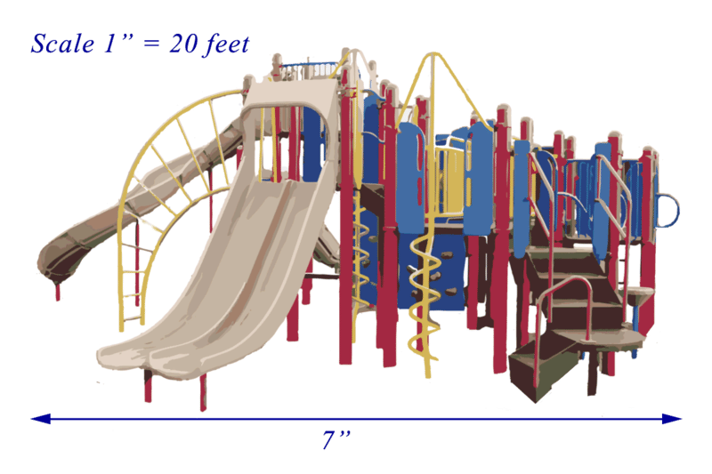

_The local community is planning to put a playground in the space provided. This is the drawing that they have created. You can see that the width of the playground is 7 inches wide in the drawing. If this is the case, what is the actual width of the playground?_

**To work on this problem, first, let’s write a ratio to show the scale.**

$$
\frac{1^{\prime\prime}}{20 \ ft}
$$

**Next, we can write a proportion showing the scale to the inches on the drawing.**

$$
\begin{align*}
\frac{1^{\prime\prime}}{20 \ ft} &= \frac{7^{\prime\prime}}{x}\\
x &= 140 \ feet
\end{align*}
$$

**The width of the playground is 140 feet.**

**Notice that whether you are working with floor plans, scale drawings or maps, you are still working to create a proportion and solve for the missing measurements.**

Real-Life Example Completed
---------------------------

**_Drawing Everest_**

**Here is the original problem once again. Reread it and then answer the three questions at the end of the problem. There are three parts to your answer.**

“Look at this!” Josh exclaimed to his friend Carlo while they were in the computer lab. Carlo rolled his chair over to Josh’s computer to see what he was looking at.

“What?”

“This is a picture of Everest from space. The space shuttle Endeavor took it on October 10, 1994. It was a clear day too, so it should be pretty accurate. They wanted to measure the area of the mountain,” Josh said smiling.

“You and Mount Everest, but it is pretty cool,” Carlo said looking at the picture.

“I’m going to make a drawing of this,” Josh said taking out a piece of paper to make some notes.

In looking at the website, Josh discovered that the space shuttle Endeavor figured out that the length of Mount Everest from space is 43 miles and the width of Everest from space is 24 miles long. Josh wrote down the measurement $\frac{1}{4}^{\prime\prime} = 1 \ mile$.

**If Josh uses this measurement, what will the dimensions of his drawing be? Will it fit on $11^{\prime\prime} \times 14^{\prime\prime}$ paper? What is the actual area of Everest according to the space shuttle?**

**Solution to Real – Life Example**

**First, let’s figure out the scale dimensions of the drawing. We will need to use the scale to calculate a length and a width.**

**The scale is $\frac{1}{4}^{\prime\prime} = 1 \ mile$.**

**Next, let’s write a proportion for length. We know that the actual length = 43 miles.**

$$
\begin{align*}
\frac{\frac{1}{4}^{\prime\prime}}{1 \ mile} &= \frac{x}{43 \ miles}\\
x &= 10.75^{\prime\prime}
\end{align*}
$$

**Now we can use a proportion for width. The actual width is 24 miles.**

$$
\begin{align*}
\frac{\frac{1}{4}^{\prime\prime}}{1 \ mile} &= \frac{x}{24 \ miles}\\
x &= 6 \ inches
\end{align*}
$$

**The dimensions of Josh’s drawing will be $10.75^{\prime\prime} \times 6^{\prime\prime}$**

**This drawing will fit on an $11 \times 14^{\prime\prime}$ piece of paper.**

**Finally, we can figure out the area of Everest according to the picture.**

$$
\begin{align*}
A &= lw\\
A &= (43 \ miles)(24 \ miles)\\
A &= 1032 \ square \ miles
\end{align*}
$$

Vocabulary
----------

Here are the vocabulary words that are found in this lesson.

__Ratio__

a way of comparing two quantities using a colon, fraction form or by using the word “to.”

__Proportion__

showing two equal ratios. Two equal ratios form a proportion.

__Similar Figures__

figures that are the same shape but different sizes.

__Scale Drawing__

a drawing that is done with a scale so that specific small units of measure represent larger units of measure.

Time to Practice
----------------

Directions: Using the scale $1^{\prime\prime} = 5.5 \ miles$, figure out the number of inches needed to map each number of miles. Use proportions to figure out your answers.

1.  16.5 miles
2.  11 miles
3.  27.5 miles
4.  8.25 miles
5.  33 miles
6.  60.5 miles
7.  13.75 miles

Directions: Using the scale $\frac{1}{2}^{\prime\prime} = 100 \ miles$, figure out the number of actual miles represented by each scale measurement.

8.  $1^{\prime\prime}$
9.  $2^{\prime\prime}$
10. $3^{\prime\prime}$
11. $\frac{1}{4}^{\prime\prime}$
12. $\frac{3}{4}^{\prime\prime}$
13. $1 \frac{1}{2}^{\prime\prime}$
14. $2 \frac{1}{2}^{\prime\prime}$
15. $5 \frac{1}{2}^{\prime\prime}$
16. $7^{\prime\prime}$

Directions: This floor plan shows Bonnie’s house. Use it to answer the following questions.

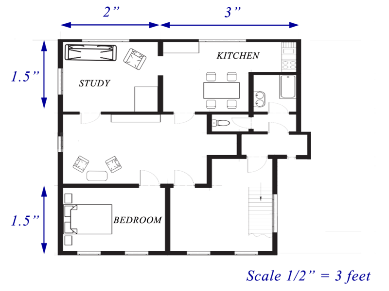
18. The length of the kitchen on the floor plan measures 3 inches. What is the actual length of the kitchen?
19. The study measures 2 inches by 1.5 inches on the floor plan. What is the actual area of the study?

Directions: In Gary’s town, 2 cm = 1 mile, use this information to answer these questions.

20. The map distance from the bank to the post office is 4 centimeters. What is the actual distance from the bank to the post office?
21. The map distance from the high school to the library is 5.5 centimeters. What is the actual distance from the high school to the library?
22. The park on the map measures 2 centimeters on all sides. What is the actual area of the park?

Directions: Answer each question.

23. The scale of a map of the United States is 2 cm = 500 km. The distance from New York City to Los Angeles is about 4,000 km. How far apart should the two cities be on the map?
24. A square measures 10 inches on each side. A similar square has dimensions that are 1.5 times as large. How does the area of the larger square compare to the area of the smaller square?
25. A classroom measures 21 feet by 15 feet. A second classroom has a similar size but the dimensions are $\frac{1}{3}$ as long. How does the area of the second classroom compare to the area of the first classroom?
26. Yuri’s backyard has an area of 1,000 square feet. The dimensions of Kyle’s backyard are all $\frac{1}{5}$ the size of Yuri’s. What is the area of Kyle’s backyard?

</article>

### 4.5 Scale in Three Dimensions

<article>

Introduction
------------

**_A New Kind of Map_**

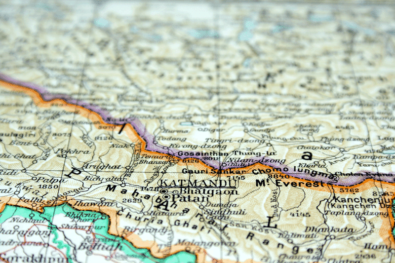

He began looking in books, but most of the maps weren’t drawn in very high detail. Finally, after a lot of searching, he began using the computer.

Right away, Josh discovered this map on a website.

http://upload.wikimedia.org/wikipedia/commons/6/66/MountEverestRelief.png

“What did you find?” his sister Karen asked. She had also been at the library writing a book report.

“I found this map. It is called a relief map,” Josh said.

“What a “relief” that you found it!” Karen joked.

“Not really. It is called a relief map because of what is on it. Look,” Josh began to explain all about the map.

**Have you ever seen a relief map? Before Josh explains about relief maps, use this lesson to learn all about them. When finished, you will be able to explain the difference between a relief map and a two-dimensional map.**

**_What You Will Learn_**

By the end of this lesson, you will be able to complete the following skills:

* Read and interpret plans and views of scale models.
* Read and interpret relief features of topographic maps.
* Compare scale relationship of distance, area and volume.
* Solve real-world problems involving three-dimensional scale models, perspective views and relief maps.

**_Teaching Time_**

I. **Read and Interpret Plans and Views of Scale Models**

In our last lesson, we worked on interpreting two-dimensional maps, scale drawings and floor plans. We used a scale to interpret measurements the actual dimensions and the scale dimensions. These were two – dimensional representations, this means that the things being represented could be easily shown in a flat plane.

**What happens is something can’t be shown in a two – dimensional way?**

When this happens, we have to use a **_three – dimensional_** method of display. Whereas a **_two – dimensional_** image takes into account length and width, **a three – dimensional figure contains the length, width and height or depth.**

When we wanted to represent a two – dimensional space, like a map, we used a scale drawing or a scale map. When we want to represent a three-dimensional space, we use a **_scale model_** to represent the space. **A scale model is a model used to represent a three – dimensional space.**

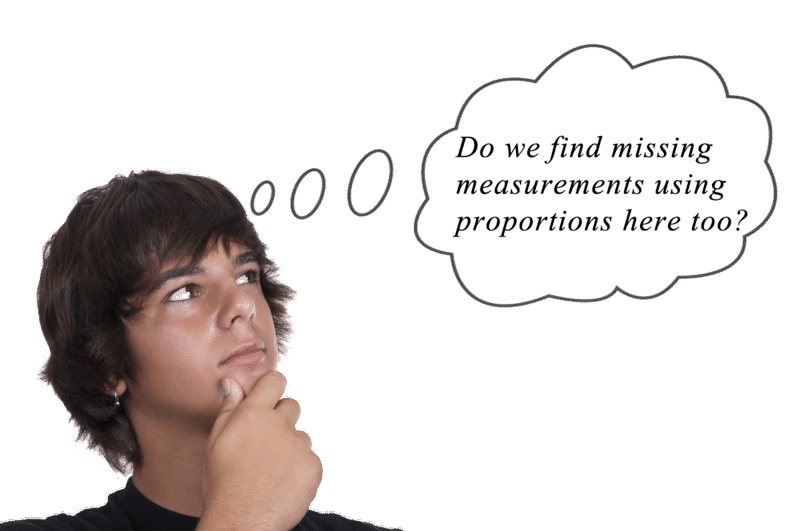

**First, let’s think about how we can find the actual dimensions.**

**In order to find the actual dimensions from a scale model, you can set up and solve a proportion. The scale given in the model is the first ratio. The unknown length and the scale length is the second ratio. We compare the scale in the first ratio and we compare the two lengths in the second ratio.**

Let’s look at an example.

_Brianna is making a scale model of the White House using the scale 1 cm = 0.5 m. If the height of Brianna’s model is 42 cm, what is the height of the actual White House?_

**Set up a proportion. Write the scale as a ratio.**

$\frac{1 \ cm}{0.5 \ m}$

**Now write the second ratio, making sure it follows the form of the first ratio.**

$\frac{1 \ cm }{0.5 \ m}=\frac{42 \ cm}{x \ m}$

**Next cross-multiply and solve for $x$.**

$$
\begin{align*}
(1)x &= 42(0.5)\\
x &= 21
\end{align*}
$$

**The actual height of the White House is 21 meters.**

**We can also use proportions to find the measurements of scale models. Let’s look at an example.**

_Mike is building a scale model of an airplane using the scale $\frac{1}{4} \ inch = 1 \ foot$. If the actual length of the airplane is 150 feet, what will the length of the scale model be?_

**Set up a proportion.** The scale for the model is $\frac{1}{4} \ inch = 1 \ foot$. So set up a ratio using these values: $\frac{0.25 \ inch}{1 \ foot}$.

**Now write the second ratio.** You know the actual length is 150 feet. The unknown length is $x$. Make sure that the second ratio follows the form of the first ratio: inches over feet.

$\frac{0.25 \ inch}{1 \ foot}= \frac{x \ inches}{150 \ feet}$

**Next cross-multiply to solve for $x$.**

$$
\begin{align*}
(1)x &= 150(0.25)\\
x &= 37.5
\end{align*}
$$

**The length of the scale model is 37.5 inches.**

Notice how once you understand how proportions work, you can compare and solve proportions when the measurements of different things have a relationship. The actual length has a relationship with the scale length, so they are related to each other. The scale is a comparison between a selected unit of measure and an actual unit of measure. There is a relationship here as well. These two ratios form a proportion and we have the basis for our problem solving.

II. **Read and Interpret Relief Features of Topographic Maps**

In the last lesson, you looked at two – dimensional maps. You will notice that if you look at a two – dimensional map, that while it is excellent for measuring distances, it isn’t as helpful when measuring mountains or other features. When we want to show a map in a three-dimensional way, we use a **_topographic map._**

A **_topographic map_** **is a type of map that shows not only the distances on the ground, but also the relief features of the area, such as mountains.** The map uses **_contour lines_** **to show the elevation of the area**. Each contour line is a line of equal **_elevation_** or height. They show the general shape of the **_terrain_** or land. When contour lines are spread farther apart, the elevation is not as steep. Where contour lines are bunched close together, the elevation is steeper.

**Topographic maps may also use colors to represent different features.** Blue represents water, green represents vegetation, and brown lines represent topographic contours.

**You can interpret these maps by using the scale. There will be a scale to show what each distance on the map represents, just like other maps. There will also be a scale to tell you what each contour line represents.**

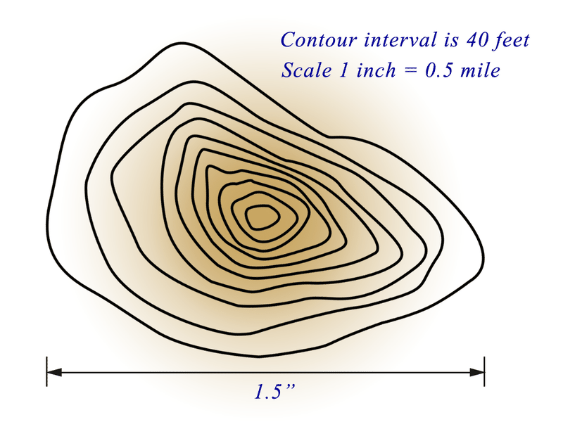

_This map shows a mountain from a national park in California. What is the height of the mountain?_

**First, look at the map scale. It states that the contour interval is 40 feet. That means that each contour line represents 40 feet of elevation.**

**Count the number of contour lines that make up the mountain. There are 10 contour lines.**

**Write a proportion to find the height of the mountain.**

$\frac{1 \ line}{40 \ feet}=\frac{10 \ lines}{x \ feet}$

**Now cross-multiply to solve for $x$.**

$$
\begin{align*}
(1)x &= 10(40)\\
x &= 400
\end{align*}
$$

**The mountain is 400 feet high.**

Example

_Using the map from last example, the width of the base of the mountain on the map is 1.5 inches. What is the actual distance of the base of the mountain?_

**For this problem, you don’t need the contour scale. You need the map scale. Write a proportion. First we write the scale as a ratio. Then we write the scale measurement compared to the actual measurement for the second ratio. Notice that we are looking for the actual measurement, so that is our missing value.**

$\frac{1 \ inch}{0.5 \ mile}=\frac{1.5 \ inches}{x \ miles}$

**Now cross multiply to solve for $x$.**

$$
\begin{align*}
(1)x &= 1.5(0.5)\\
x &= 0.75
\end{align*}
$$

**The distance of the base of the mountain is 0.75 mile.**

III. **Compare Scale Relationships of Distance, Area and Volume**

We can compare the scale relationships of distance, area and volume when looking at three – dimensional figures. If you think back to other math classes, you will remember some of these three – dimensional figures such as a prism or a pyramid. When you compare different measurements, you will see the proportional relationships between them. Let’s look at an example involving volume.

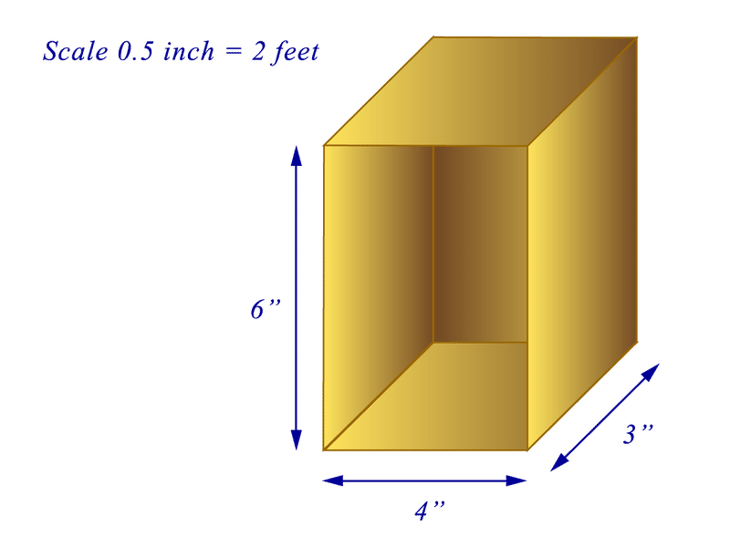

_Brooke has a scale model of a warehouse. A storage unit is shaped like a rectangular prism and has the dimensions 4 in. by 3 in. by 6 in. If the scale of the model is 0.5 in. = 2 ft, what are the actual dimensions of the storage unit? What is the volume?_

**First, notice that there are two parts to this problem. The first part is figuring out the actual dimensions given that Brooke has a scale model. The second part is figuring out the volume.**

**First use a proportion to find the actual dimensions of the storage unit.**

Write the scale as the first ratio, and the scale and unknown actual dimension of the storage unit as the second ratio.

$$
\begin{align*}
\frac{0.5 \ inch}{2 \ feet} &= \frac{4 \ inches}{x \ feet} \qquad \frac{0.5 \ inch}{2 \ feet} = \frac{3 \ inches}{x \ feet} \qquad \frac{0.5 \ inch}{2 \ feet} = \frac{6 \ inches}{x \ feet}\\
(0.5)x &= 4(2) \qquad \qquad \quad  (0.5)x = 3(2) \qquad \qquad \ \   (0.5)x = 6(2)\\
0.5x &= 8 \qquad \qquad \qquad \quad  0.5x =6 \qquad \qquad \qquad \quad   0.5x = 12\\
x &= 16 \qquad \qquad \qquad \quad \ \ x = 12 \qquad \qquad \qquad \quad \ \  x = 24
\end{align*}
$$

**The actual dimensions of the storage unit are 16 feet by 12 feet by 24 feet. This is the length, width and height of the storage unit.**

**Now that you know the actual dimensions, you can find the volume.**

$$
\begin{align*}
V &= lwh\\
V &= (16 \ feet)(12 \ feet)(24 \ feet)\\
A &= 4,608 \ feet^3
\end{align*}
$$

**The volume of the storage unit is 4,608 cubic feet.**

**Now think about how the area of the base of the prism relates to the volume of the prism.**

$$
\begin{align*}
A &= lw\\
A &= 16(12)\\
A &= 192 \ sq.feet
\end{align*}
$$

**If we write the volume as a ratio with the area of the base, we will find something very interesting.**

$$
\frac{4608}{192}
$$

**Now divide the numerator by the denominator.**

**The answer is 24 feet. This is the measurement of the height of the prism.**

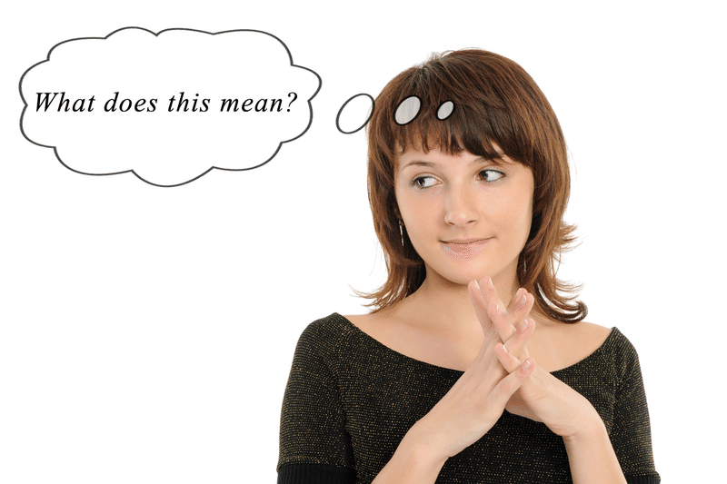

Example

_Tim has a cube with a side length of 4 inches. He has a similar cube with dimensions that are twice the first cube. How does the volume of the larger cube compare to the volume of the smaller cube?_

**First, find the dimensions of the larger cube.**

The problem states that the dimensions are twice those of the first cube. That means they are scaled up by a factor of 2. So the side length of the larger cube is $4 \ inches \times 2 = 8 \ inches$.

**Now find the volume of both cubes and compare.**

Volume of smaller cube:

$$
\begin{align*}
V &= lwh\\
V &= (4 \ inches)(4 \ inches)(4 \ inches)\\
V &= 64 \ inches^3
\end{align*}
$$

Volume of larger cube:

$$
\begin{align*}
V &= lwh\\
V &= (8 \ inches)(8 \ inches)(8 \ inches)\\
V &= 512 \ inches^3
\end{align*}
$$

**Next compare the two volumes.**

You want to know how the volume of the larger cube compares to the volume of the smaller cube.

**Write a ratio comparing the two volumes.**

$\frac{512 \ inches^3}{64 \ inches^3}=8$

**The volume of the larger cube is 8 times larger than the volume of the smaller cube.**

In the previous example, the scale factor that changed the smaller cube to the larger cube was 2, but the volume was 8 times as large. This leads to the following rule:

* **The ratio of volumes of similar figures is the cube of the scale factor.**

IV. **Solve Real – World Problems Involving Three – Dimensional Scale Models, Perspective Views and Relief Maps**

The problems that we have been working with in this lesson have all been real – world problems. You can see that working with maps, scale drawings and models have many real-life applications. Think about climbing a mountain! If you were going to climb a mountain it would be very helpful to read a topographic map. However, if you only wanted to know the distance from Cleveland to New York City, then a scale map would be most helpful.

Now let’s expand what we have learned to include **_perspective views_****. A perspective is a point of view. When you look at a figure from the top or the side or the back, we can say that we are looking at a three – dimensional figure in perspective.**

**Now let’s go back to the problem from the introduction and use what we have learned to answer the question posed at the beginning of the lesson.**

Real-Life Example Completed
---------------------------

**_A New Kind of Map_**

**Here is the original problem from the introduction. First, reread it and then answer the question. Explain the difference between a two – dimensional map and a relief map.**

Josh spent most of his Saturday morning at the library looking at different books on Mount Everest. After completing his drawings of the Mountain, and figuring out the scale for his model, Josh wanted to look at some maps that other people had created of the mountain.

He began looking in books, but most of the maps weren’t drawn in very high detail. Finally, after a lot of searching, he began using the computer.

Right away, Josh discovered this map on a website.

http://upload.wikimedia.org/wikipedia/commons/6/66/MountEverestRelief.png

“What did you find?” his sister Karen asked. She had also been at the library writing a book report.

“I found this map. It is called a relief map,” Josh said.

“What a “relief” that you found it!” Karen joked.

“Not really. It is called a relief map because of what is on it. Look,” Josh began to explain all about the map.

**_Solution to Real – Life Problem_**

**A two – dimensional map is created on a flat surface and only shows the dimensions length and width. There aren’t any other three-dimensional features included on the map. When Josh drew the area of the Everest from space in an earlier lesson, he drew it in a two – dimensional way. He only showed the length, width and area in the scale drawing.**

**A relief map uses a scale just like any other map, but other features are included on the map. A relief map uses different colors and textures to show the contour of the terrain. It also includes bodies of water and other landmarks. In addition, the map shows contour lines which measure the elevation of a natural land mass.**

Vocabulary
----------

Here are the vocabulary words that are found in this lesson.

__Two – Dimensional__

A figure drawn in two dimensions is only drawn using length and width.

__Three – Dimensional__

A figure drawn using length, width and height or depth.

__Scale Model__

a model that represents a three – dimensional space.

__Topographic Map__

a map that shows distances on the ground, but also relief features of the map such as mountains.

__Contour Lines__

lines on a map to show elevation. Each contour line represents the same measure of elevation.

__Elevation__

the measure of height

__Terrain__

the land

Time to Practice
----------------

Directions: Solve each problem.

Kevin built a scale model of a pool. He used the scale $\frac{1}{2}^{\prime\prime} = 5 \ ft$. Use this information to answer the following questions.

1.  The width of the pool on the scale model measures 1.5 inches. What is the actual width of the pool?
2.  The length of the pool on the scale model measures 2.5 inches. What is the actual length of the pool?
3.  The depth of the pool on the scale model measures 0.5 inches. What is the actual volume of the pool.

This is a map of a national park. Use this information to answer the following questions.

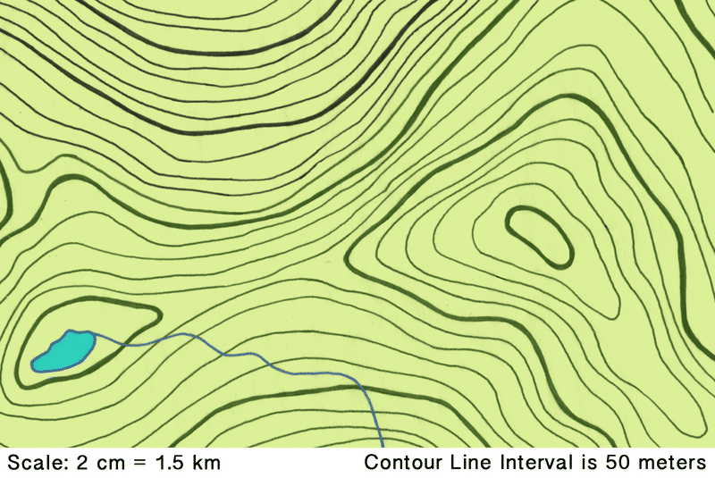
5.  The map distance of the length of the distance across the lake is 1.5 cm. What is the actual distance across the lake?
6.  Explain why the contour lines on the map are closer together at some points and farther apart at other points.

Directions: Solve each problem.

7.  A scale model of a sandbox has dimensions 0.5 inch by 3 inches by 4 inches. If the scale of the model is $\frac{1}{4} \ inch = 1 \ foot$, what is the volume of the actual sandbox?
8.  A cube measures 5 inches on each side. A similar cube has dimensions that are 3 times as large. How does the volume of the larger cube compare to the volume of the smaller cube?
9.  A shipping box measures 16 inches by 12 inches by 8 inches. A second box has a similar size but each dimension is $\frac{1}{4}$ as long. How does the volume of the second box compare to the volume of the first box?
10. Rina’s fish tank has a volume of 8,000 cubic inches. The dimensions of Ava’s fish tank are all $\frac{1}{2}$ the size of Rina’s. What is the volume of Ava’s fish tank?

Directions: Answer each of the following questions as true or false.

11. A topographic map would include lakes and rivers.
12. A two – dimensional map could also be a topographic map.
13. Three – dimensions means including length, width and height.
14. Depending on what you are measuring, height might be replaced by depth.
15. There is a proportional relationship between length and the area of a figure.
16. A two – dimensional map also includes contour lines.
17. Contour lines can be different sizes if there is a different elevation involved.
18. Elevation also means height.
19. A topographic map can be built in three dimensions.
20. Two – dimensional maps and three – dimensional maps both include the same information.

</article>

### 4.6 Customary Units of Measure

<article>

Introduction
------------

**_Everest in Miles_**

“Well, you don’t need to know the miles because you are climbing it. Doesn’t it make more sense to measure it in feet?” Josh asked while working on his map.

“It might, but if I wanted to know how many miles, how could I figure this out?” Teiyisha asked.

Josh thought about it for a minute.

“You would have to do a conversion. You would have to change feet to miles, and we can do that if we know how many feet are in 1 mile. It still makes more sense to use feet though. Think about it, you can’t exactly draw a straight line up Mount Everest. Miles would be very hard to measure.”

“I get that, but I still want to know how many miles high it is,” Teiyisha explained.

“Alright, first let’s think about miles and feet. There are 5,280 feet in 1 mile.”

**Let’s stop there. To accomplish Teiyisha’s task, we will need to create a proportion and convert feet to miles. We can do this by converting among customary units of measurement. Pay attention to this lesson and you will have it figured out by the end.**

**_What You Will Learn_**

In this lesson you will learn to complete the following skills.

* Convert among customary units of measure.
* Revise or interpret scale drawings, maps, recipes, and models involving the conversion of customary units of measure.
* Solve real-world problems involving scaling of customary units of measure.

**_Teaching Time_**

I. **Convert among Customary Units of Measure**

When we measure in the United States, we often use the **_customary system_** of measurement. **The** **_customary system_** **is made up of units such as inches, feet, cups, gallons and pounds.** You may have also heard of the **_Metric System_** of measurement. The metric system is often used in countries outside of the United States or in science measurements. You will learn more about the metric system in another lesson. In this lesson you will learn how to convert between different customary units of measurement. But first, let’s look at some of the units that you are probably already familiar with.

**Customary Units of Measurement**

")

\[Figure 3\]

")

\[Figure 5\]

**_Take a few minutes to copy all of these units of measurement down in your notebook._**

**Now let’s look at how we convert among customary units of measurement.** While you may be able to complete some of the mathematics in your head, it may make more sense to use a proportion. Because there is a relationship between different units of measure, you can use proportions to help you convert between customary units of measurement.

**First, set up the proportion in the same way you used to find actual measurements from scale drawings. Use the conversion factor as the first ratio, and the known and unknown units in the second ratio.**

Example

_How many feet are in 5 yards?_

**Set up a proportion.**

The conversion factor is the number of feet in 1 yard: $\frac{3 \ feet}{1 \ yard}$.

**Now write the second ratio.**

The known unit is 5 yards. The unknown unit is $x$ feet. Make sure that the second ratio follows the form of the first ratio: feet over yards.

$\frac{3 \ feet}{1 \ yard}=\frac{x \ feet}{5 \ yards}$

**Next cross-multiply to solve for $x$.**

$$
\begin{align*}
(1)x &= 3(5)\\
x &= 15
\end{align*}
$$

**There are 15 feet in 5 yards.**

Example

How many ounces are there is 20 pounds?

**First, set up a proportion.**

The scale of measurement is $\frac{1 \ pound}{16 \ ounces}$.

The proportion is: $\frac{1}{16}= \frac{20}{x}$

**Next, we cross multiply and solve for the number of ounces.**

**There are 320 ounces in 20 pounds.**

Now that you understand how to use a proportion to complete measurement conversions, we can apply this information to scale drawings, maps, recipes and models.

II. **Revise or Interpret Scale Drawings, Maps, Recipes and Models Involving Conversion of Customary Units of Measure**

Once you understand that we are going to be using a proportion to solve for missing measurements, you can apply this information when looking at different types of problems. Let’s look at a few examples.

**Let’s look at how we can apply our work with proportions when looking at a recipe.**

_Evan is making a recipe for fruit punch that uses 3 cups of pineapple juice. If he makes 5 batches of the recipe, how many quarts of pineapple juice will he need?_

**First find the total number of cups he needs.**

If there are 3 cups in one batch, and he is making 5 batches, then he will need $3 \times 5 = 15 \ cups$.

**Set up a proportion.**

The conversion factor is the number of cups in a quart: $\frac{4 \ cups}{1 \ quart}$.

**Now write the second ratio, making sure it follows the form of the first ratio.**

$\frac{4 \ cups}{1 \ quart} = \frac{15 \ cups}{x \ quarts}$

**Next cross-multiply and solve for $x$.**

$$
\begin{align*}
(4)x &= 1(15)\\
4x &= 15\\
x &= \frac{15}{4} = 3 \frac{3}{4}
\end{align*}
$$

**He will need $3 \frac{3}{4}$ quarts of pineapple juice.**

**We can also use this same method when working with a map. Look at the following example.**

_The distance from John’s house to Mike’s house on a map is 4.5 inches. The scale of the map is 1.5 inches = 2 miles. What is the actual distance from John’s house to Mike’s house in feet?_

**First, find the actual distance in miles. Then convert miles to feet.**

**Write a proportion to find the actual distance between the two houses.**

$\frac{1.5 \ inches}{2 \ miles} = \frac{4.5 \ inches}{x \ miles}$

**Now cross-multiply and solve for $x$.**

$$
\begin{align*}
(1.5)x &= 4.5(2)\\
1.5x &= 9\\
x &= 6
\end{align*}
$$

**So the two houses are 6 miles apart. Now convert miles to feet.**

$\frac{1 \ mile}{5280 \ feet} = \frac{6 \ miles}{x \ feet}$

**Now cross multiply to solve for $x$.**

$$
\begin{align*}
(1)x &= 6(5280)\\
x &= 31,680
\end{align*}
$$

**The two houses are 31.680 feet apart.**

**_In this example it would make sense to round up to 32 feet apart._**

**We can also work on problems involving scale models and measurement conversion. Let’s look at an example.**

Example

_A scale model of a building has a height of 3.5 feet. The scale of the model is $1 \frac{1}{2} \ inch = 10 \ feet$. What is the actual height of the building?_

**The scale is in inches, but the scale model height is given in feet. First convert the scale height to inches. Then find the height of the building.**

$$
\frac{1 \ foot}{12 \ inches} = \frac{3.5 \ feet}{x \ inches}
$$

**Now cross multiply to solve for $x$.**

$$
\begin{align*}
(1)x &= 3.5(12)\\
x &= 42
\end{align*}
$$

So the height of the scale model is 42 inches. Now find the height of the actual building.

$$
\frac{1.5 \ inch}{10 \ feet} = \frac{42 \ inches}{x \ feet}
$$

**Now cross multiply and solve for $x$.**

$$
\begin{align*}
(1.5)x &= 42(10)\\
1.5x &= 420\\
x &= 280
\end{align*}
$$

**The actual building is 280 feet tall.**

III. **Solve Real – World Problems Involving Scaling of Customary Units of Measure**

Now we can apply real – world problems to our work with customary units of measure. In this section, you will be using a scale to determine actual dimensions and scale dimensions. Be sure to convert customary units of measurement when necessary.

Jeff ran his weekly long run of 13 miles in 2 hours. If his rate is 9.23 per mile, how long would it take Jeff to run 5280 feet?

**To figure this out, you can use a proportion, but it might make more sense to think in terms of customary units of measurement. Here Jeff runs 9.23 per mile. How many feet are in one mile?**

**Yes, there are 5280 feet in one mile.**

**Therefore, Jeff runs 1 mile in 9.23.**

Example

A scale model of a building has a scale of 2 inches for every 20 feet. If the size of the model is 2.5 feet, what is the actual height of the building?

**First, write a proportion.**

$\frac{2^{\prime \prime}}{20 \ ft} = \frac{2.5 \ ft}{x}$

**Notice that our inches and feet are all over the place. We have to rewrite the feet of the model measurement into inches. To do this, we multiply by 12.**

$2.5 \times 12 = 30 \ inches$

**Now we can rewrite the proportion using the new measurements.**

$$
\frac{2^{\prime \prime}}{20 \ ft} = \frac{30^{\prime \prime}}{x}
$$

**Next, cross multiply and solve.**

$20 \times 30 = 600$

**The height of the building is 300 feet.**

**Now let’s go back to the problem from the introduction and work on solving it.**

Real-Life Example Completed
---------------------------

**_Everest in Miles_**

**Here is the original problem once again. Reread it and then write a proportion with a variable to show how you would complete this conversion. Then solve the proportion for the number of miles. There are two parts to your answer.**

“You keep telling me that Mount Everest is 29,035 feet high, but how many miles is that?” Teiyisha asked Josh during geography class.

“Well, you don’t need to know the miles because you are climbing it. Doesn’t it make more sense to measure it in feet?” Josh asked while working on his map.

“It might, but if I wanted to know how many miles, how could I figure this out?” Teiyisha asked.

Josh thought about it for a minute.

“You would have to do a conversion. You would have to change feet to miles, and we can do that if we know how many feet are in 1 mile. It still makes more sense to use feet though. Think about it, you can’t exactly draw a straight line up Mount Everest. Miles would be very hard to measure.”

“I get that, but I still want to know how many miles high it is,” Teiyisha explained.

“Alright, first let’s think about miles and feet. There are 5,280 feet in 1 mile.”

**_Solution to Real – Life Example_**

**First, we need to write a proportion to convert feet to miles. We know that there are 5,280 feet in 1 mile. This is the first part of the proportion. The second part of the proportion contains the unknown miles in a variable and the number of feet in Everest.**

$$
\frac{5280}{1}=\frac{29035}{x}
$$

**Next, we cross multiply and divide to solve for the variable.**

$$
\begin{align*}
5280x &= 29035\\
x &= 5.5 \ miles
\end{align*}
$$

Vocabulary
----------

Here are the vocabulary words that are found in this lesson.

__Customary System__

the system of measurement that includes inches, feet, miles, pounds, tons, cups, quarts, gallons, etc.

__Metric System__

The system of measurement including centimeters and kiloliters that is used outside of the United States and often in the area of science.

Time to Practice
----------------

Directions: Solve each problem by converting among customary units of measurement.

1.  102 inches = \_\_\_\_\_\_ feet
2.  25 pounds = \_\_\_\_\_\_ ounces
3.  160 cups = \_\_\_\_\_\_ gallons
4.  150 pounds = \_\_\_\_\_\_ tons
5.  6 feet = \_\_\_\_\_\_ inches
6.  360 inches = \_\_\_\_\_\_ feet
7.  5.5 feet = \_\_\_\_\_\_ inches
8.  900 inches = \_\_\_\_\_\_ feet
9.  32 ounces = \_\_\_\_\_\_ pounds
10. 320 ounces = \_\_\_\_\_\_ pounds
11. 6 pounds = \_\_\_\_\_\_ ounces
12. 15 pounds = \_\_\_\_\_\_ ounces
13. 6 cups = \_\_\_\_\_\_ pints
14. 3 gallons = \_\_\_\_\_\_ quarts
15. 8 quarts = \_\_\_\_\_\_ pints
16. 24 pints = \_\_\_\_\_\_ quarts

Directions: Solve each problem.

17. A recipe calls for 2 pints of milk. If Jorge cuts the recipe in half, how many cups of milk will he need?
18. Audrey is making brownies for a bake sale. The recipe calls for 8 ounces of flour for every 24 brownies. If she makes 96 brownies, how many pounds of flour will she need?
19. Two buildings are 5 inches apart on a map. The scale of the map is $\frac{1}{4} \ inch = 1 \ mile$. What is the actual distance between the two buildings in yards?
20. The length of a classroom on a floor plan is 2.5 inches. The scale of the map is $\frac{1}{2} \ inch = 5 \ feet$. What is the actual length of the classroom in inches?
21. A scale model of a mountain is 2.75 feet tall. The scale of the model is $\frac{1}{4} \ inch = 50 \ feet$. What is the actual height of the mountain in feet?
22. A scale drawing of a town includes a park that measures 0.5 inch by 1.5 inches. If the scale of the map is $\frac{1}{2} \ inch = 1 \ mile$, what is the area of the park in square feet?

</article>

### 4.7 Metric Units of Measure

<article>

Introduction
------------

**_Everest in Metrics_**

“What about meters?” Karen asked. “How many meters high is Mount Everest?”

“Why are you always thinking of things that cause me more work?” Josh asked, but then he smiled at Karen. “It’s alright. I was thinking of that today anyway.”

“How can we figure it out?” Karen asked.

“Well first, we need to know how many feet are in 1 meter. I already looked that up online, and I found out that there are 3.28 feet in 1 meter. Now I know that the height of Mount Everest is 29,035 feet high, so we can work from there,” Josh explained.

“Yeah, but how?”

“Well, we can use proportions.”

**Let’s stop right there. With everything that you have learned in this chapter, do you know how to use a proportion to figure out this metric conversion? Well, pay attention to this lesson and if you aren’t sure how to do it now, you will be by the end of the lesson.**

**_What You Will Learn_**

In this lesson you will learn how to do the following skills.

* Convert among metric units of measure.
* Revise or interpret scale drawings, maps, recipes and models involving conversion of metric units of measure.
* Solve real-world problems involving scaling of metric units of measure.
* Translate between metric and customary units of measure in scale drawings, maps, recipes and models using common benchmarks.

**_Teaching Time_**

I. **Convert among Metric Units of Measure**

**The** **_metric system_** **of measurement is the primary measurement system in many countries; it contains units such as meters, kilometers and liters.** You can remember the conversions by learning the prefixes: Milli-means thousandth, centi-means hundredth, and kilo-means thousand. So a millimeter is one-thousandth of a meter, and a kilometer is one thousand meters. You should know these common units of measurement.

")

\[Figure 3\]

")

\[Figure 5\]

**_Write these units of measurement down in your notebooks._**

**Now that you have reviewed these units of measurement, we can look at converting among the different units of measurement.** Just like we used proportions when we converted among customary units of measurement, we can use proportions and ratios here too.

**How do we use proportions to convert among metric units of measure?**

First, set up the proportion in the same way you used to find actual measurements from scale drawings. Use the conversion factor as the first ratio, and the known and unknown units in the second ratio.

Let’s look at an example.

Example

_How many centimeters are in 5 meters?_

**First, set up a proportion.** The conversion factor is the number of centimeters in 1 meter. We can look at the chart above and see that there are 100 centimeters in 1 meters. That is our first ratio: $\frac{100 \ centimeters}{1 \ meter}$.

**Now write the second ratio.** The known unit is 5 meters. The unknown unit is $x$ centimeters. Make sure that the second ratio follows the form of the first ratio: centimeters over meters.

$\frac{100 \ centimeters}{1 \ meters} = \frac{x \ centimeters}{5 \ meters}$

**Now cross-multiply to solve for $x$.**

$$
\begin{align*}
(1)x &= 100(5)\\
x &= 500
\end{align*}
$$

**There are 500 centimeters in 5 meters.**

_Henry is making a recipe for lemonade that uses 2 liters of water. If he makes 3 batches of the recipe, how many milliliters of water will she need?_

**First find the total number of liters she needs. If there are 2 liters in one batch, and she is making 3 batches, then she will need $2 \times 3 = 6 \ liters$.**

**Next, set up a proportion.** The conversion factor is the number of milliliters in a liter.

$\frac{1000 \ milliliters}{1 \ liter}$

**Now write the second ratio, making sure it follows the form of the first ratio.**

$\frac{1000 \ milliliters}{1 \ liter} = \frac{x \ milliliters}{6 \ liters}$

**Cross-multiply to solve for $x$.**

$$
\begin{align*}
(1)x &= 1000(6)\\
x &= 6000
\end{align*}
$$

**She will need 6000 milliliters of water.**

Once you know what you are comparing, you can easily set up a proportion and solve for the missing measurement. Now let’s look at how we can apply conversions to scale.

II. **Revise or Interpret Scale Drawings, Maps, Recipes and Models Involving Conversion of Metric Units of Measure**

In the last lesson, we used customary units of measurement when working with scale drawings, maps, recipes and models. Sometimes, especially when not in the United States, these same things will have metric units of measurement. We can use our conversions to work with the metric units of measure and figure out the missing measurements.

Let’s look at an example.

_A scale model of a building has a height of 1.5 meters. The scale of the model is 1 cm = 0.5 m. What is the actual height of the building?_

**The scale is in centimeters, but the scale model height is given in meters. First convert the scale height to centimeters. Then find the height of the building.**

$\frac{1 \ meter}{100 \ centimeters} = \frac{1.5 \ meters}{x \ centimeters}$

**Now cross multiply to solve for $x$.**

$$
\begin{align*}
(1)x &= 100(1.5)\\
x &= 150
\end{align*}
$$

**The height of the scale model is 150 centimeters. Now find the height of the actual building.**

$\frac{1 \ centimeter}{0.5 \ meter} = \frac{150 \ centimeters}{x \ meters}$

**Next cross multiply to solve for $x$.**

$$
\begin{align*}
(1)x &= 150(0.5)\\
x &= 75
\end{align*}
$$

**The actual building is 75 meters tall.**

Example

Jessica works in a science lab. She needs to convert the liquid measure that she is working with from liters to milliliters. She has been given 3.5 liters to convert. If each container that Jessica has holds 100 milliliters, how many containers will she need?

**First, notice that there are two parts to this problem. First, let’s figure out how many milliliters are equal to 3.5 liters.**

There are 1000 milliliters in one liter.

$$
\frac{1000 \ mL}{1 \ L}= \frac{x}{3.5 \ Liters}
$$

**Next, we cross multiply and solve for $x$.**

$3500 \ mL = x$

**Now we can work on figuring out the number of containers Jessica will need.** Each container holds 100 mL. We can divide 3500 mL by 100 mL.

$3500 \div 100 = 35 \ containers$

**Jessica will need 35 containers to hold all of the liquid.**

**Once you know how to complete the conversions using proportions and ratios, you can apply this skill to any item with a scale. Notice that even when went from units of measurement to units of capacity that the method of solving the problem did not change. Just be sure that you apply the correct units of measure to each problem you are solving.**

III. **Solve Real – World Problems Involving Scaling of Metric Units of Measure**

When we work with real – world problems, we sometimes need to create a scale to measure. This happens whether we use customary units of measurement or metric units of measurement. To create a scale, we first need to determine the correct unit of measurement that we need to use.

Look at this example.

Kyle is going to be traveling with his family over the winter holidays. He wants to figure out how many kilometers it is from his home in Cincinatti to his grandparents home in Chicago. Which unit of measurement should Kyle use?

**First, let’s think about the correct unit of measurement for Kyle to use.** If Kyle is measuring a far distance, he needs a measure of length. We know that the metric units for measuring length are millimeters, centimeters, meters and kilometers. Kyle is measuring the distance between two cities. It makes the most sense for him to use the largest unit for measuring length, and that is kilometers.

**Kyle would use kilometers to measure the distance.**

Marcy is making beef stew. Her recipe calls for 900 grams of beef. She looks in the refrigerator and sees that she has 1.5 kilograms of beef wrapped in a package. Marcy isn’t sure how much of the beef she should use. Figure out how much of the beef Marcy needs for her recipe.

**First, let’s think about the difference between grams and kilograms. We can call this scaling because we are comparing one measurement to another.**

There are 1000 grams in 1 kilogram. We can write that as our first ratio.

$$
\frac{1000 \ grams}{1 \ kilogram}
$$

Now we know that Marcy has 1.5 kilograms of beef and she needs 900 grams. Next, we need to convert the kilograms that Marcy has to grams so we can figure out how much of the whole she will need.

**We write a proportion.**

$$
\frac{1000 \ g}{1 \ kg} = \frac{x}{1.5}
$$

**Next, cross multiply and solve for $x$.**

$1500 \ g = x$

**Now let’s think about Marcy.** She has 1500 grams of meat, but only needs 900 grams. **She will have 600 grams of meat left over.**

IV. **Translate between Metric and Customary Units of Measure in Scale Drawings, Maps, Recipes and Models using Common Benchmarks**

**You should also know how to convert between the metric and the customary systems of measurement.** Any of these conversions will be estimates, because you cannot make an exact measurement when converting between systems of measurement.

**There are some common benchmarks you can use.**

**Length**

An inch is about 2.5 centimeters.

A meter is slightly longer than a yard.

A kilometer is about 0.6 of a mile.

**Capacity**

A liter is about the same as a quart.

**Mass**

A kilogram is a little more than 2 pounds.

Now let’s look at how we can apply these benchmarks to some real – life examples.

_Omar has a dog that weighs 30 pounds. About how many kilograms does Omar’s dog weigh?_

**Use an estimated conversion factor to write a ratio. We will compare kilograms to pounds.** One kilogram is about 2 pounds, or $\frac{1 \ kilogram}{2 \ pounds}$.

**Next, write a proportion and solve.**

$$
\begin{align*}
\frac{1 \ kilogram}{2 \ pounds} &= \frac{x \ kilograms}{30 \ pounds}\\
x(2) &= 1(30)\\
2x &= 30\\
x &= 15
\end{align*}
$$

**Omar’s dog weighs about 15 kilograms.**

Randy ran a 20 kilometer race. How many miles did Randy run?

**To figure this out, we have to use a comparison between kilometers and miles. A kilometer is about .6 of a mile. That is our first ratio.**

$$
\frac{1 \ km}{.6 \ mile}
$$

**Next, we have to look at how many kilometers, Randy actually ran. He ran 20 kilometers. We are looking for his miles. That forms our second ratio, and we can now write a proportion.**

$$
\frac{1 \ km}{.6 \ mile} = \frac{20 \ km}{x \ miles}
$$

**Lastly, we cross multiply and solve for $x$.**

$20 \times .6 = x \ miles$

**Randy ran 12 miles in his race.**

**_Once again notice that we solved these problems in the same way by using ratios and proportions. As long as you keep in mind what you are comparing, you can solve any measurement conversion problem in this way! Now let’s go and solve the problem from the introduction._**

Real-Life Example Completed
---------------------------

**_Everest in Metrics_**

**Here is the original problem once again. First reread it. Then write a proportion that you could use to solve the problem. Finally, solve it for the number of meters.**

Josh and his sister Karen were working on homework when the topic of Everest and the metric system came up.

“What about meters?” Karen asked. “How many meters high is Mount Everest?”

“Why are you always thinking of things that cause me more work?” Josh asked, but then he smiled at Karen. “It’s alright. I was thinking of that today anyway.”

“How can we figure it out?” Karen asked.

“Well first, we need to know how many feet are in 1 meter. I already looked that up online, and I found out that there are 3.28 feet in 1 meter. Now I know that the height of Mount Everest is 29,035 feet high, so we can work from there,” Josh explained.

“Yeah, but how?”

“Well, we can use proportions.”

**_Solution to Real – Life Problem_**

**First, let’s write a proportion. Josh told us that there are 3.28 feet in 1 meter. That is our first ratio in the proportion.**

$$
\frac{3.28}{1}
$$

**Next, we write the second ratio. That compares the unknown number of meters, our variable with the current height of Everest in feet.**

$$
\frac{29,035}{x}
$$

**Our proportion is:**

$$
\frac{3.28}{1}= \frac{29035}{x}
$$

**Next, we cross multiply and solve.**

**The answer is that Mount Everest is about 8852 meters high. We did need to round the answer, so that is why we used the word “about” in our answer.**

Vocabulary
----------

Here are the vocabulary words that are found in this lesson.

__Metric System__

a system of measurement commonly used outside of the United States. It contains units such as meters, milliliters and grams.

Time to Practice
----------------

Directions: Solve each problem.

1.  3 km = \_\_\_\_\_ m
2.  2000 m = \_\_\_\_\_ km
3.  5.5 km = \_\_\_\_\_ m
4.  2500 m = \_\_\_\_\_ km
5.  12000 m = \_\_\_\_\_ km
6.  500 cm = \_\_\_\_\_ m
7.  6000 cm = \_\_\_\_\_ m
8.  4 m = \_\_\_\_\_ cm
9.  11 m = \_\_\_\_\_ cm
10. 50 mm = \_\_\_\_\_ cm
11. 3 cm = \_\_\_\_\_ mm
12. 15 cm = \_\_\_\_\_ mm
13. 2000 g = \_\_\_\_\_ kg
14. 35000 g = \_\_\_\_\_ kg
15. 7 kg = \_\_\_\_\_ g
16. 56 meters = \_\_\_\_\_ centimeters
17. 41 milliliters = \_\_\_\_\_ liters
18. 857 grams = \_\_\_\_\_ kilograms
19. 4.7 kilometers = \_\_\_\_\_ millimeters

Directions: Solve each problem.

20. A recipe calls for 400 grams of flour. If Leena makes one quarter of the recipe, how many kilograms of flour will she need?
21. Two buildings are 9 centimeters apart on a map. The scale of the map is 0.5 centimeter = 2 kilometers. What is the actual distance between the two buildings in meters?
22. A scale model of a tower is 1.25 meters tall. The scale of the model is 0.5 cm = 5 meters. What is the actual height of the tower in meters?
23. A scale drawing of a conference center includes a meeting room that measures 1.5 centimeters by 2.5 centimeters. If the scale of the drawing is 1 centimeter = 2 meters, what is the area of the meeting room in square centimeters?
24. A shipping company uses boxes that are $2 \frac{1}{2} \ feet$ long. About how many centimeters long are the boxes?
25. Samir ran a race that was 10 kilometers long. About how many feet did Samir run?

</article>

### 4.8 Formulas and Unit Analysis

<article>

Introduction
------------

**_The Cost of a Climb_**

“Really?” his Dad said smiling. “Well son, you had better start saving now.”

Josh looked up from his oatmeal with a puzzled look on his face.

“What makes you say that?” Josh asked.

“What makes me say that is that the going rate for one climb on Everest is about $60,000. That’s what makes me say that,” his Dad explained taking a sip of his coffee.

“Really? Wow! I had no idea,” Josh said. “Well, I guess I’ll just have to make a lot of money!” Josh said leaving the table.

He kept thinking about what his Dad had said all the way to school. Sixty thousand dollars was a lot of money to climb a mountain, but what really amazed Josh was thinking about the numbers of people who had climbed the mountain more than once. When he got to class, he looked up in his book that Apa Sherpa a man from Nepal had successfully climbed Everest 19 times. Now he was often a guide who was paid, but still, Josh couldn’t help thinking about how much money Apa Sherpa would have spent if he had paid to climb Everest 19 times at the rate his father spoke about.

**How much would it have cost? We can use ratios and proportions to solve this. By thinking of one trip as a unit, we can look at the proportion and solve for the correct amount of money. Use this lesson to learn even more about how to work with proportions and then solve this problem at the end of the lesson.**

**_What You Will Learn_**

In this lesson, you will learn how to complete the following tasks using different skills.

* Solve various rate problems using given formulas and conversions of units of measure.
* Use unit analysis to check results.
* Write and evaluate variable expressions involving change in measurable units over time, and confirm by unit analysis.
* Solve real-world problems involving formulas for rates and other derived measurements suitable for unit analysis.

**_Teaching Time_**

I. **Solve Various Rate Problems using Given Formulas and Conversions of Units of Measure**

Think back a few lessons ago when we talked about rates and unit rates. **When we work with a** **_rate_** **we examine speed or a rate can refer to the amount of money someone makes per hour.** When we talk about a **_unit rate,_** **we look at comparing a rate to 1. A key word when working with unit rate is the word “per”.**

**We can use ratios and proportions to solve problems involving rates and unit rates.** Let’s look at an example.

Example

_Jeff makes $150.00 an hour as a consultant. What is his rate per minute?_

**To figure this out, we have to think about the unit rate that Jeff is paid as a consultant. You will see that we have “an hour” written into the problem. This is the unit rate. Let’s write the unit rate as a ratio compared to 1.**

$$
\frac{\$ 150.00}{1}
$$

**Next, we need to think about what the problem is asking for. It is asking for his rate per minute. The given information is in hours, so we need to write a ratio that compares hours to minutes.**

$$
\frac{1 \ hour}{60 \ minutes}
$$

**Now we can write a proportion.**

$$
\frac{\$ 150}{1 \ hour} = \frac{1 \ hour}{60 \ minutes}
$$

**Next, we can solve.** Notice that because 1 hour is diagonal from 1 hour, we can cross cancel the hours. That leaves us with a ratio that compares money to minutes.

$$
\frac{\$ 150}{60 \ minutes}
$$

This also helped us to convert hours to minutes making it easier to figure out the answer to the problem. Now we can divide to figure out our answer.

**Jeff makes $2.50 per minute.**

_If William drives at a rate of 55 miles per hour (mph), how far will he travel in 3.5 hours?_

**This problem requires a formula. If you think back, you will remember that when we work with distance, speed and time, we can use the following formula.**

$d = rt$

**To solve this problem, we substitute the known values for the variables in the formula.** The rate is 55 miles per hour, and the time is 3.5 hours. Be sure to include the units when substituting.

$$
\begin{align*}
d &= rt\\
d &= \left( \frac{55 \ miles}{1 \ hour}\right)(3.5 \ hours)
\end{align*}
$$

The unit of hours cancels out.

$$
d = \left( \frac{55 \ miles}{1 \ hour}\right)(3.5 \ hours) = 192.5 \ miles
$$

**William will travel 192.5 miles in 3.5 hours.**

**Here is a new formula that you will use as you work on higher levels of math and science. It is the formula for velocity. Let’s look at an example that uses this formula.**

Example

_The formula for the velocity of an object is $v=\frac{d}{t}$, where $v$ represents velocity, $d$ represents distance, and $t$ represents time. If an object travels 1000 meters in 2 seconds, what is its velocity in kilometers per second?_

**First, substitute the known values for the variables in the formula. The distance is 1000 meters and the time is 2 seconds.**

$v = \frac{d}{t} = \frac{1000 \ meters}{2 \ seconds} = 500 \ meters \ per \ second$

**So the velocity of the object is 500 meters per second. Now use unit analysis to find the velocity in kilometers per second. Notice that we use the measurement that you learned in the last lesson that 1000 meters is equal to 1 kilometer.**

$\frac{500 \ meters}{1 \ second} \times \frac{1 \ kilometer}{1000 \ meters}$

**The meters in the first ratio cancels out the meters in the second ratio and you are left with kilometers per second.**

$\frac{500 \ kilometers}{1000 \ seconds} = \frac{1}{2} \ kilometer \ per \ second$

**The object has a velocity of 0.5 kilometer per second.**

II. **Use Unit Analysis to Check Results**

What is unit analysis? **_Unit analysis_** **is when we look at how to measure individual units in different measurement amounts and it is used to convert units of measurement.** When we use unit analysis, we convert different measurement units by comparing the units using ratios and proportions. Unit analysis is very helpful when checking results.

Let’s look at an example.

Example

Juanita worked for 18 hours. She made $116.00 at the end of her shift. Juanita was sure that her manager had made a mistake and that she should have made more money. Juanita makes $9.00 per hour. Did Juanita make the correct amount of money or was there a mistake?

**To work on this problem, we can use unit analysis. Let’s start by writing a ratio to compare how much Juanita made for the hours worked.**

$$
\frac{18 \ hours}{\$ 116.00}
$$

**Next, we can use her hourly rate to work with. She makes $9.00 per hour.**

$$
\frac{\$ 9}{1 \ hour}
$$

**If Juanita makes $9.00 per hour, we can multiply $18 \times 9$. We have an answer of $162.00. Juanita was only paid $116.00, so there definitely was an error in her payment.**

The Travis family went to Florida on their vacation. They decided to drive verses fly so that they could save some money. The family figured that they traveled 300 miles in the first part of the day. They drove for 5 hours. If they were traveling 60 mph, would their distance and time be accurate?

**To solve this problem, we can check our work using the formula $d = rt$. Once we have the formula, we can substitute the given values into the problem. If the quantity on the left side of the equation is equal to the quantity on the right side of the equation, then the values are equal and our work is accurate.**

**Let’s sort this out.**

$$
\begin{align*}
d &= rt\\
300 \ miles &= (60)(5)\\
300 &= 300
\end{align*}
$$

**The calculations that the Travis family made were correct.**

III. **Write and Evaluate Variable Expressions Involving Change in Measurable Units over Time, and Confirm by Unit Analysis**

Sometimes, we will have a value that changes over time. We can use variable expressions and unit analysis to work with values that change. An example of this would be gasoline prices. During a month, the price of one gallon of gasoline can vary greatly. When this happens, the price to fill up a tank of gas can change week to week. The number of gallons in the tank does not change, but the cost of the fill-up does change.

Let’s look at an example.

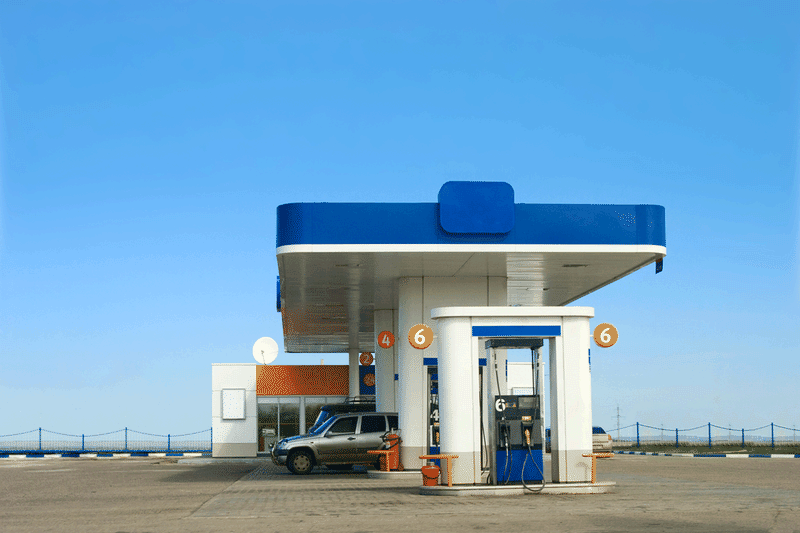

Jesse has a car that holds 14 gallons of gasoline. During the first week of the month, gasoline cost $2.75 per gallon. During the second week of the month, gasoline cost $2.50 per gallon. How much was the total cost for the 28 gallons of gasoline?

**Let’s start by writing a variable expression to work on this problem.** We know that the number of gallons of gasoline does not change. That can be our variable.

$x =$ number of gallons of gasoline

The other parts of the expression include the different prices for the gasoline.

$$
2.75x+2.50x
$$

This expression will help us to determine how much money Jesse spent on 28 gallons of gasoline. Each full tank is 14 gallons. We can substitute 14 for our variable $x$.

$$
\begin{align*}
2.75(14)&+ 2.50(14)\\
\$ 38.50 &+ \$ 35.00
\end{align*}
$$

**The total amount of money spent was $73.50.**

**We can check our work by using unit analysis.**

$$
\begin{align*}
\frac{2.75}{1 \ gallon} &= \frac{x}{14 \ gallons} = \$ 38.50\\
\frac{2.50}{1 \ gallon} & = \frac{x}{14 \ gallons} = \$ 35.00
\end{align*}
$$

**The sum of the money spent was $73.50.**

IV. **Solve Real – World Problems Involving Formulas for Rates and**

**Other Derived Measurements Suitable for Unit Analysis**

Money exchange is a way that we use unit analysis in everyday life. If you have ever traveled to a foreign country where you needed to exchange your money for money from another country, then you have used unit analysis. Let’s look at an example.

Tanya is traveling to Mexico. She wants to exchange $500 for Mexican pesos. By looking at the current exchange rate, she sees that 12.5 pesos is equal to 1 dollar. How many pesos will Tanya receive when she exchanges her money?

**First, think about the units. Our units are in pesos. We know that we want to exchange $500.00 for pesos. Let’s start with the unit rate.**

$$
\frac{12.5}{1 \ dollar}
$$

**We are converting $500.00 so we can multiply that times our unit exchange rate.**

$$
\$ 500 \left( \frac{12.5}{1} \right)
$$

**Tanya will receive 6250 pesos for her $500.00.**

Real-Life Example Completed
---------------------------

**_The Cost of a Climb_**

**Here is the original problem once again. Reread it and then write a proportion to solve the problem. There are two parts to your answer.**

“I would LOVE to climb Mount Everest!” Josh exclaimed at breakfast one morning.

“Really?” his Dad said smiling. “Well son, you had better start saving now.”

Josh looked up from his oatmeal with a puzzled look on his face.

“What makes you say that?” Josh asked.

“What makes me say that is that the going rate for one climb on Everest is about $60,000. That’s what makes me say that,” his Dad explained taking a sip of his coffee.

“Really? Wow! I had no idea,” Josh said. “Well, I guess I’ll just have to make a lot of money!” Josh said leaving the table.

He kept thinking about what his Dad had said all the way to school. Sixty thousand dollars was a lot of money to climb a mountain, but what really amazed Josh was thinking about the numbers of people who had climbed the mountain more than once. When he got to class, he looked up in his book that Apa Sherpa a man from Nepal had successfully climbed Everest 19 times. Now he was often a guide who was paid, but still, Josh couldn’t help thinking about how much money Apa Sherpa would have spent if he had paid to climb Everest 19 times at the rate his father spoke about.

**_Solution to Real – Life Example_**

**Now let’s look at solving this problem.**

**We know that it costs $60,000 for 1 trip up Mount Everest.**

$$
\begin{align*}
\frac{\$ 60,000}{1} &= \frac{x}{19}\\
x &= \$ 1,140,000
\end{align*}
$$

**We can also use unit analysis to solve this problem.**

$60,000 _dollars_ $\left( \frac{19}{x \ dollars}\right)$

$60,000 \times 19 = \$ 1,140,000$ **is the cost of the nineteen trips.**

Vocabulary
----------

Here are the vocabulary words that are found in this lesson.

__Rate__

is a method of converting different units of measurement by using ratios and proportions to compare and convert the units.

Time to Practice
----------------

Directions: Use what you have learned to solve each problem.

1.  Peter runs at a rate of 10 kilometers per hour. What is his rate in centimeters per second, to the nearest centimeter?
2.  A cheetah can run at a speed of 60 miles per hour. What is this rate in feet per second?
3.  What is the distance formula?
4.  If a car travels at a rate of 65 miles per hour for 30 minutes, how far will it travel?
5.  A train travels at a rate of 50 miles per hour. If it needs to travel 320 miles, how many minutes will it take?
6.  A car travels 65 mph for 12 hours. How many miles will it travel?
7.  A bus traveled 300 miles at an average speed of 50 miles per hour. How long did this trip take the bus?
8.  A car traveled at an average speed of 40 miles per hour through a construction zone. If the car traveled 20 miles at this rate, how many minutes did it take to travel the 20 miles?
9.  What is velocity?
10. What is the formula for velocity?
11. What is the velocity of an object that travels 500 miles in 2.5 hours?
12. If an object has a velocity of 125 miles per hour, how long will it take to travel 4,375 miles?
13. If an object has a velocity of 7 kilometers per minute, how far will it travel in 2 hours?
14. If an object has a velocity of 4 meters per second, how many kilometers will it travel in 2 days?
15. The formula for density is $D = \frac{m}{v}$ where $D$ represents the density of an object, $m$ represents the mass of the object, and $v$ represents the volume of the object. What is the density of a brick that weighs 9 pounds and has a volume of 36 cu. in.?
16. If the mass of an object is 9 kilograms and the volume is 40 cu. cm, what is the density of the object in grams per cubic centimeter?

Directions: Write six different problems and solve them. Use money exchange, time exchange, the velocity formula and the distance formula in your problems.

</article>

## 5.0 Applying Percents

<article>

</article>

### 5.1 Fractions, Decimals and Percents

<article>

Introduction
------------

**_Fabulous Football_**

“I love football season. Those Friday night games are so much fun!” Mario said biting into his sandwich.

“Definitely, and we did so much better this year than last year. This year we won 10 out of 12 games. Last year, we only won eight out of 12 games,” Carla said.

“Yes, so this year the percentage of games that we won definitely increased,” Cinda commented.

“Well that is obvious,” Mario said. “What was last year’s percentage compared to this year’s?”

“To figure that out, we have to change the fraction of games that we won to a percentage and we have to do that with both last year’s statistics and this year’s statistics,” Carla explained.

**Carla is on the right track. To understand the percentage of wins, you need to know how to convert fractions to percentages. This lesson is all about fractions, decimals and percentages and how to work with them. You will also see how proportions can be very helpful when doing this work. Pay attention to this lesson and you will be able to use what you have learned at the end of the lesson.**

**_What You Will Learn_**

In this lesson, you will learn how to do the following tasks:

* Recognize percent as a ratio whose denominator is 100.
* Write percents as decimals and decimals as percents.
* Write percents as fractions and fractions as percents.
* Find the percent of a number using fraction or decimal multiplication.

**_Teaching Time_**

I. **Recognize Percent as a Ratio Whose Denominator is 100**

We see percents all around us every day. If you walk into a store of any kind, you will often see a percent sign. Whether it is a sale sign for 10% off or a sign on a bank for a new mortgage rate, by looking all around you, you will see percents.

**What is a percent?**

Simply, **a** **_percent_** **is a part of a whole.** It is a part of a whole that is being compared to 100. In this way, we can also think of a percent as a ratio. Remember that **a** **_ratio_** **is a comparison between two quantities.** **_Fractions_** **and** **_decimals_** **are also parts of a whole.** We can say that fractions, decimals and percents are all related.

**Let’s think about percents in a little more detail.**

**If 25% of the people want chocolate cake, then 25 out of every 100 want chocolate cake. For this reason, percent can be written as a fraction with the denominator being 100.**

$25. = \frac{25}{100}$

**Now think about this again. Anytime you see a percent, you know that the amount is being compared to 100, or is “out of” 100.**

Example

18% means 18 out of 100

**We are comparing the quantity of 18 to the whole of 100.**

Example

125% means 125 out of 100

**Here we have a percent that is greater than 100. This means that we have greater than the total whole included in our percent.**

II. **Write Percents as Decimals and Decimals as Percents**

In the first section, we talked about how a percent is a part of a whole and that fractions and decimals are parts of a whole too. If this is true, then we can interchange the form that we write these quantities in. We can write a fraction as a decimal and as a percent. We can also write a percent as a decimal or a decimal as a percent and we can do the same with the fractions too.

**Let’s start by writing percents as decimals and decimals as percents.**

**We can start by thinking about decimals. Decimal places represent powers of ten. The second decimal place is the hundredths place. The decimal .18 means eighteen-hundredths.**

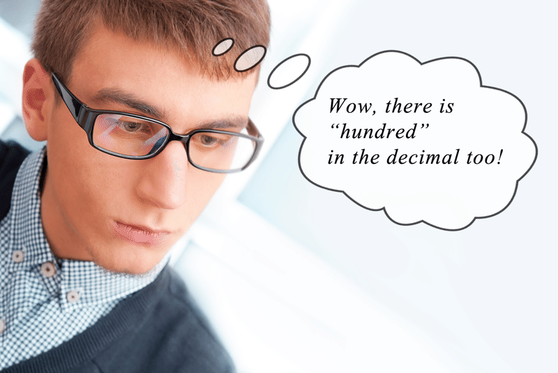

Example

_Write_ 56% as a decimal.

**To do this, we know that the % sign means “out of 100” we can say that decimal places represent tens and hundreds too. Two decimal places represents hundreds, just like the percent sign, %, represents hundreds.**

**To change a percent to a decimal, we drop the percent sign and move the decimal point two places to the left.**

56% = .56

")

\[Figure 7\]

**_Write this down in your notebook._**

Example

_Write_ 88% as a decimal.

**To do this, we drop the percent sign and move the decimal point two places to the left.**

88% = .88

Example

_Write_ 125% as a decimal.

**Even though this percent is greater than 100, we still follow the same steps.**

125% = 1.25

**We can work the other way around too and write decimals as percents. Here we will move the decimal point two places to the right and add a percent sign.**

Example

_Write_ .45 as a percent.

**First, we move the decimal point two places to the right and add a percent sign.**

.45 = 45%

Example

_Write_ .345 as a percent.

**Follow the same rule here. Just move the decimal point two places to the right and add a percent sign.**

.345 = 34.5%

")

\[Figure 9\]

**_Write this rule down in your notebook._**

III. **Write Percents as Fractions and Fractions as Percents**

You have seen that percents can be written as ratios with a denominator of 100 or they can be written as decimals. Well, if they can be written as a ratio with a denominator of 100, then those ratios can be simplified as we would simplify any fraction. Likewise, any fraction can be written as a percent using reverse operations.

**To write a percent as a fraction rewrite it as a fraction with a denominator of 100. Then reduce the fraction to its simplest form.**

Example

22%

**First, write this as a fraction with a dominator of 100.**

$22. = \frac{22}{100}$

**Next, simplify the fraction.**

$\frac{22}{100} = \frac{11}{50}$

**This is our answer.**

**How can we convert a fraction to a percent?**

To convert a fraction to a percent, we need to be sure that the fraction is being compared to a quantity of 100. Let’s look at an example.

Example

$\frac{28}{100}$

**This means that we have 28 out of 100. This fraction is being compared to 100, so we can simply change it to a percent.**

$\frac{28}{100} = 28\%$

Example

$\frac{3}{5}$

**This fraction is not being compared to 100. It is being compared to 5. We have three out of 5. To convert this fraction to a percent, we need to rewrite it as an equal ratio out of 100. We can use proportions to do this.**

**First, write this ratio compared to a second ratio out of 100.**

$$
\frac{3}{5} = \frac{\boxed{}}{100}
$$

**We don’t know what the part out of 100 is, so we need to solve the proportion. We can use multiplication to create equal ratios or a proportion.**

$$
\begin{align*}
5 \times 20 &= 100\\
3 \times 20 &= 60\\
\frac{3}{5} &= \frac{60}{100} = 60 \%
\end{align*}
$$

**This is our answer.**

Sometimes, you will be able to complete this step in your head using mental math. That is terrific! But if not, you can always create proportions and then write percents based on these equal fractions.

IV. **Find the Percent of a Number using Fraction or Decimal Multiplication**

We said that percent are very useful. Part of the usefulness is being able to find percentages of a number. In other words, if you are planning a barbecue and the butcher tells you that 30% of the people want chicken…well, how many people is that? For how many people should you buy chicken?

**The key words here are “of a number” this means that you multiply to solve the problem. We can convert the percent to a decimal and multiply or convert it to a fraction and multiply.**

Let’s suppose that you invited 58 people to the barbecue. If 30% prefer chicken, then we need to know how many people that is.

**First, convert 30% to either a decimal or a fraction**

$$
30. = .30 \ or \ 30. = \frac{30}{100} = \frac{3}{10}
$$

**Using the decimal or fraction, you now multiply by the number of people you invited: $.30 \times 58 = 17.4$ or about 17 people**

Or

$\frac{3}{10} \times 58 = \frac{174}{10} = 17.4$ or about 17 people.

**This is the answer.**

**Now let’s go back to the problem from the introduction and look at applying percents to this dilemma.**

Real-Life Example Completed
---------------------------

**_Fabulous Football_**

**Here is the original problem once again. First, reread it. There will be four parts to your answer. First, write two fractions to show the fraction of games won last year and this year. Then convert each fraction to a percent.**

The local high school’s football season has just ended. At lunch, Carla, Mario and Cinda spent some time talking about the season and how the Springstead Raiders had finally made the play-offs.

“I love football season. Those Friday night games are so much fun!” Mario said biting into his sandwich.

“Definitely, and we did so much better this year than last year. This year we won 10 out of 12 games. Last year, we only won eight out of 12 games,” Carla said.

“Yes, so this year the percentage of games that we won definitely increased,” Cinda commented.

“Well that is obvious,” Mario said. “What was last year’s percentage compared to this year’s?”

“To figure that out, we have to change the fraction of games that we won to a percentage and we have to do that with both last year’s statistics and this year’s statistics,” Carla explained.

**_Solution to Real – Life Example_**

**First, let’s write two fractions to represent the given data for games won last year and this year by the football team.**

**Last year: 8 out of 12 games were won.**

$$
\frac{8}{12}
$$

**This year: 10 out of 12 games were won.**

$$
\frac{10}{12}
$$

**Now we can take these two fractions and create proportions to determine the correct percent of games won.**

$$
\frac{8}{12} = \frac{x}{100}
$$

**Next, we cross multiply and solve for the percent.**

$$
12x = 800
$$

$x = 66.6\%$ **or 67% is last year’s percentage of games won.**

**Now let’s figure out this year’s scores.**

$$
\begin{align*}
\frac{10}{12} &= \frac{x}{100}\\
12x &= 1000
\end{align*}
$$

$x = 83.3\%$ **_or_** **83% of this year’s games were won.**

Vocabulary
----------

Here are the vocabulary words that are found in this lesson.

__Ratio__

a comparison between two quantities.

__Percent__

a ratio that is being compared to the quantity of 100. Percent means out of 100.

__Fraction__

a part of a whole written using a numerator and a denominator.

__Decimal__

a part of a whole written in base ten place value.

__Proportion__

two equal ratios form a proportion.

Time to Practice
----------------

Write the following percents as a ratio with a denominator of 100.

1.  64%
2.  3%
3.  119%
4.  4.7%

Write the following percents as decimals.

5.  18%
6.  35.7%
7.  6.09%
8.  .008%

Write the following decimals as percents.

9.  .52
10. .02
11. 1.17
12. 5

Write the following percents as fractions in simplest form.

13. 16%
14. 40%
15. 2%
16. 450%

Write the following fractions as percents. Round to the nearest tenths place.

17. $\frac{2}{3}$
18. $\frac{23}{30}$
19. $\frac{4}{75}$
20. $\frac{21}{2}$

Find the percent of the given number by converting the percent to a fraction or decimal.

21. 30% of 90
22. 2% of 800
23. 150% of 21
24. 45% of $\frac{5}{7}$

Read the following situations carefully and answer the questions accordingly.

25. For every paycheck you receive, your employer pays 6% to social security. Write this percent as a ratio with a denominator of 100.
26. Jimmy’s height is 1.78m. Write his height as a percent of a meter.
27. A store did a survey and found that $\frac{4}{5}$ of its customers have shopped at its competitors’ stores within in the previous month. What percent is that?
28. At an amusement park there is an average of 30,000 visits daily. Over 75% of those people ride on the biggest roller coasters. About how many people ride the roller coasters?

</article>

### 5.2 Percents and Proportions

<article>

Introduction
------------

**_Football Game Attendance_**

“40% of our students attend football games on Friday nights! Let’s try to get this number up to 50% next seasons so that we can really support the high school players!”

“Wow, forty percent is still pretty high,” Cameron commented to Carla during homeroom.

“Yes, but 50 percent would be even better since there are 380 students at our school.”

“How many students attend the game then?” Cameron asked.

**That is a good question. If you understand percents and proportions, you can use the information provided to figure out how many students attend the games if 40% attend. Use the information in this lesson to figure out how to solve this problem. Then you will see it again at the end of the lesson.**

**_What You Will Learn_**

In this lesson, you will learn how to demonstrate the following skills.

* Use the proportion $\frac{a}{b}$ to find the percent $p$.
* Use the proportion to find the part $a$.
* Use the cross product property of proportions to find the base $b$.
* Solve real-world problems involving percents using proportions.

**_Teaching Time_**

I. **Use the Proportion $\underline{\frac{a}{b}}$ to find the percent $\underline{p}$**

In the last section, you began using proportions to figure out a percent when writing fractions as percents. Remember that proportions involve comparing quantities. **A** **_proportion_** **is a comparison between two equal ratios.** **_Percents_** **are also written to compare a quantity to 100.** Because both of these are comparing, we can use proportions to help us figure out a percent.

$$
\frac{a}{b}
$$

This is equal to the percent which is out of 100.

$$
\frac{p}{100}
$$

**Here is the proportion:**

$$
\frac{a}{b} = \frac{p}{100}
$$

Example

_15 out of 30 is what percent?_

**To work on this problem, first, we write a ratio comparing our given values to the missing percent.**

$$
\frac{15}{30} = \frac{p}{100}
$$

**We know that fifteen is half of thirty, and 50 is half of 100.**

**Our answer is 50%.**

Let’s look at using this proportion to solve a problem.

A senator wants to start a program to encourage more people to vote in his state. In County A, 32,100 people voted. In neighboring County B, 57,800 people voted. Which county needs the program more?

Well, it depends on how many people are in each of the counties. **We can’t compare the polling rates unless you use a percent.** If we know that the first county has a population of 39,150 people and the second county has a population of 81,400 people, we can now find what percent of the people voted. **We are comparing the number of people who voted with the population of each county. We are actually going to find two percents here.** For each county, we will use the proportion $\frac{a}{b} = \frac{p}{100}$ where $a$ is the number of people that voted and $b$ is the total population.

$$
\begin{align*}
& \text{County A} \qquad \qquad \qquad \text{County B}\\
& \ \frac{32100}{39150} = \frac{p}{100} \qquad \qquad \ \frac{57800}{81400} = \frac{p}{100}\\
& 39150p = 32100 \cdot 100 \quad 81400p = 57800 \cdot 100\\
& 39150p = 3210000 \qquad \ 81400p = 5780000\\
& \qquad \ \ p = 82 \% \qquad \qquad \qquad \  p=71 \%
\end{align*}
$$

In order to find the percent in each case, we used cross products as we would for any proportion. Now we can see that in County A, 82% of the people voted, while in County B only 71% of the people voted.

**The senator should push the program more in County B.**

II. **Use the Proportion to Find the Part $\underline{a}$**

Proportions can be used to compare any equal quantity. Because of this, proportions can be used to find any missing piece. In the last section we found a percent using a proportion. If we know a percent, we can also find a part of the whole.

Let’s look at an example.

At Big Town Middle School, 37% of the students participate in athletic programs. If there are 968 students at the school, how many uniforms do they need to purchase?

**Although 37% is a useful number, it does not tell us how many students need uniforms. We know that for every 100 students, 37 will need a uniform. But that is still not enough information to make a purchase. If there are 968 students at the school, use the proportion $\frac{a}{b} = \frac{p}{100}$ again to find the missing value. If we are given the percent, $p$, then the missing value is not the percent but the part of the student body that need uniforms.**

$\frac{a}{968} = \frac{37}{100}$ Use cross products now to solve for $a$.

$$
\begin{align*}
\frac{a}{968} &= \frac{37}{100}\\
100a &= 968 \cdot 37\\
100a &= 35816\\
a &= 358
\end{align*}
$$

**358 uniforms need to be purchased.**

A forest range discovered that 25% of the trees in his area were infected with a parasite. If there are 3060 trees in his area, how many trees are infected?

$$
\begin{align*}
\frac{a}{3060} &= \frac{25}{100}\\
100a &= 3060 \cdot 25\\
100a &= 76500\\
a &= 765
\end{align*}
$$

**765 trees were infected with the parasite.**

III. **Use the Cross Product Property of Proportions to Find the Base $\underline{b}$**

**Since we can use a proportion to solve for any missing variable, we can also find the whole if we know a percent and its corresponding part.**

Example

At Big Town High School, 58% participate in athletic programs. If 1670 students are involved in an athletics program, then how many students are there in the school?

**This time we know the part $a$ and we know the percent $p$. We do not know the whole, $b$. We need to adjust the proportion.**

$\frac{1670}{b} = \frac{58}{100}$ Use cross products to solve for $b$.

$$
\begin{align*}
58b &= 1670 \cdot 100\\
58b &= 167000\\
b &= 2879
\end{align*}
$$

**There are about 2879 students.**

Sometimes, you won’t have a word problem to solve you will just simply have a proportion that needs to be solved for a missing value. Look at this example.

Example

$\frac{90}{b} = \frac{30}{100}$

**We use cross products to solve for $b$.**

$$
\begin{align*}
30b &= 90(100)\\
30b &= 9000\\
b &= 300
\end{align*}
$$

We can also use proportions and percents to solve other real – world problems.

IV. **Solve Real – World Problems Involving Percents Using Proportions**

As you can see, percents apply to countless real-life situations. When we solve them, we can create a proportion that will help us to find the answer.

**However, we must be careful to place the appropriate values in the $\frac{a}{b} = \frac{p}{100}$ proportion. The $p$ value will always be the percentage which is always placed over 100. The $a$ value will be the part that the percent represents and the $b$ value will always be the whole.**

Jared needs to get 92% on his test in order to maintain his A in history. If there are 60 points on the test, how many does he need to earn to keep his A?

**We can use the proportion $\frac{a}{b}=\frac{p}{100}$ to solve this problem. The variable $p$ will be the percent, $b$ is the whole test, and $a$ is our unknown.**

$$
\begin{align*}
\frac{a}{b} & = \frac{p}{100} \longrightarrow \frac{a}{60}=\frac{92}{100}\\
\frac{a}{60} &= \frac{92}{100}\\
100a &= 60 \cdot 92\\
100a &= 5520\\
a &= 55.2
\end{align*}
$$

**The proportion shows that he needs 55.2 points. In the context of a test, he could most likely receive only whole number points. If he gets 55 points, it would be too low—it wouldn’t be 92%. We must round up, then, to 56 points.**

**Jared needs 56 points to maintain his grade.**

**Now let’s go back and apply what we have learned to the problem from the introduction.**

Real-Life Example Completed
---------------------------

**_Football Game Attendance_**

**Here is the original problem once again. First, reread the problem. Then write a proportion to show how you would solve this problem. Finally, figure out how many students attend the football game given the 40% statistic. There are two parts to your answer.**

The student council decided to conduct a survey to see how many middle school students attend football games on Friday nights. They asked each student when they entered the stadium what grade they were in and then recorded the results. The student council members did this for three weeks and figured that this was enough of a sample for a good estimate on how many middle school students attend the games. This is the report that they announced during morning announcements after their survey was completed.

“40% of our students attend football games on Friday nights! Let’s try to get this number up to 50% next seasons so that we can really support the high school players!”

“Wow, forty percent is still pretty high,” Cameron commented to Carla during homeroom.

“Yes, but 50 percent would be even better since there are 380 students at our school.”

“How many students attend the game then?” Cameron asked.

**_Solution to Real – Life Example_**

**Now let’s write a proportion using the given information.**

**40% of students attend. We can change this to a ratio out of 100.**

$$
\frac{40}{100}
$$

**There are 380 students in the middle school. That is our whole. We need to figure out what part of whole is 40%. Here is the second ratio.**

$$
\frac{x}{380}
$$

**Now we can write this as a proportion.**

$$
\frac{40}{100} = \frac{x}{380}
$$

**Next, we solve the proportion for the number of students who attend the football games.**

$$
100x=15,200
$$

**152 students attend Friday night football games.**

Vocabulary
----------

Here are the vocabulary words that are found in this lesson.

__Proportion__

two equal ratios form a proportion.

__Percent__

a part of a whole out of 100.

Time to Practice
----------------

Directions: Find $p$ in the given problems using cross products. Round to the nearest tenths place.

1.  $\frac{7}{15}=\frac{p}{100}$
2.  $\frac{52}{3810}=\frac{p}{100}$
3.  $\frac{16}{17}=\frac{p}{100}$
4.  $\frac{3}{4}=\frac{p}{100}$
5.  $\frac{3}{5}=\frac{p}{100}$
6.  $\frac{1}{5}=\frac{p}{100}$
7.  A dentist filled cavities in 8 of his 30 patients on Tuesday. What percent of his patients had cavities filled?

Directions: Solve the following proportions for the $a$ value.

8.  $\frac{a}{23}=\frac{85}{100}$
9.  $\frac{a}{1500}=\frac{7}{100}$
10. $\frac{a}{5}=\frac{61}{100}$
11. $\frac{a}{4}=\frac{75}{100}$
12. $\frac{a}{5}=\frac{40}{100}$
13. A small car company sold 65,000 cars last year. Ninety-five percent of those cars had airbags. How many cars had airbags?

Directions: Solve the following proportions for the $b$ value. Round to the nearest tenths place.

14. $\frac{88}{b}=\frac{22}{100}$
15. $\frac{600}{b}=\frac{74}{100}$
16. $\frac{1}{b}=\frac{85}{100}$
17. $\frac{2}{b}=\frac{66}{100}$
18. A recent government survey shows that in New City, people spend 35% of their income on rent. If average rent is $780, what is the average income?

Directions: Use the proportion $\frac{a}{b}=\frac{p}{100}$ to solve the following problems.

19. A fluorescent light bulb uses 35% as much energy as an incandescent bulb. If an incandescent uses 75 watts, how much does the fluorescent use?
20. An average human weighs 1.3% as much as an average elephant. If an average human weighs 160lbs, how much does an average elephant weigh?
21. An average elephant eats about 350lbs of food per day. Using your calculation from problems #14, what percent of its own weight does it consume each day?

</article>

### 5.3 Using the Percent Equation

<article>

Introduction
------------

**_Football Figures_**

The other four kids at the table looked up from their work to discuss the suggestion. Carla was the first to speak.

“I think that’s a good point. I mean if we attend their games, maybe other middle school kids will do the same thing when we are at the high school.”

“Yes, but some kids need a ride or have other things to do,” Jeremy argued.

“Well I’m not saying everyone. I am saying 55 or 60 %,” Cameron said.

“How many is that?” Jeremy asked.

“I can figure it out easy,” Cameron said.

On his paper he wrote these equations:

What is 55% of 380?

What is 60% of 380?

**Before Cameron solves these problems, let’s look at what he wrote. Cameron used the a statement that could be written into a “percent equation”. We can use the percent equation instead of a proportion. The percent equation can be helpful when you look for a percent, a base or a part of the base. Let’s look at how we can use the percent equation before we solve this problem.**

**_What You Will Learn_**

By the end of this lesson, you will be able to complete the following skills.

* Use the Percent Equation $a = p \% \cdot b$ to find part $a$.
* Use the Percent Equation to find percent $p$.
* Use the Percent Equation to find the base $b$.
* Solve real-world problems involving percents using equations.

**_Teaching Time_**

I. **Use the Percent Equation $\underline{a = p \% \cdot b}$ to find part $\underline{a}$**

In the previous lesson, we used the proportion $\frac{a}{b}=\frac{p}{100}$ to solve percent problems. For most every problem, we solved the proportion using cross products. We can also solve problems by using an equation. In this lesson, we will use the same proportion to create a different kind of equation that will help us solve percent problems differently.

**When we solve the proportion $\frac{a}{b}=\frac{p}{100}$, we use cross products to find the missing variable. However, even if we leave it in terms of the variables, we can still use cross multiply.**

$$
\begin{align*}
\frac{a}{b} &= \frac{p}{100}\\
100 a &= pb\\
a &= \frac{pb}{100}\\
a &= .01pb
\end{align*}
$$

If we change the percent to a decimal by moving the decimal point two places to the left, then there is no need to multiply $p$ by .01 as we will have already accounted for the coefficient of .01 by moving the decimal point.

Let’s look at an example.

Example

_What is 85% of 90?_

**To figure this out, first we change the 85% into a decimal. “OF” is a key word meaning multiply, so we multiply the decimal .85 times 90.**

$.85 \times 90 = 76.5$

**This is our answer.**

**_Some of you may find that this is much simpler than using a proportion! Either way is correct just be sure that you know what are looking for with each equation._**

Example

What is 7% of 900?

**First, let’s change 7% into a decimal.**

7% = .07

**Next, we multiply it by 900. Notice the key word “of” which means that we multiply.**

$900 \times .07 = 63$

**Our answer is 63.**

II. **Use the Percent Equation to Find the Percent $\underline{p}$**

In the last section we were looking for the part of the whole that equaled the given percent. Now we are going to use the percent equation to find the percent. This means that we will know the value of the part and the whole, $a$ and $b$, and we will be looking for the percent.

Example

What percent of 32 is 18?

**Let’s look at this problem in some detail. First, we know that we are looking for a percent. We want to use the percent equation to solve this.**

We know that the percent is what is missing, so we can make that $p$. Then we know that “of” means multiply. The word “is” means equals. Now we can write the equation.

$32p = 18$

Next, we solve for the value of $p$ by dividing both sides by 32.

$$
\begin{align*}
\frac{32p}{32} &= \frac{18}{32}\\
p &= .5625
\end{align*}
$$

Now this is the decimal, so we need to convert it to a percent.

$p = 56.25 \%$

**This is the answer.**

Example

10 is what percent of 12?

**This problem is worded differently, but we are still looking for a percent. Notice that the “is” is in a different spot, but that still means equals. Let’s write the equation.**

$10 = p12$

**Or**

$10 = 12p$

Next, we divide both sides by 12 to solve for the value of $p$.

$$
\begin{align*}
\frac{10}{12} &= \frac{12p}{12}\\
.833 &= p
\end{align*}
$$

This is the decimal once again, so we need to convert it to a percent by moving the decimal point.

$83.3 \% = p$

**This is the answer.**

III. **Use the Percent Equation to Find the Base $\underline{b}$**

Sometimes, you will know the percent and the part of the ratio, or part $a$, but you will need to find the whole or the base, $b$. When this happens, you can use the same key words as before and simply figure out the base by using the percent equation. Let’s look at an example.

Example

78 is 65% of what number?

**Here we know that the word “is” means equals. The numbers may be in a different location, but just pay attention to the key words and you will know what to do. Notice that we have been given the percent and we are missing the “of what number” that is the value of the base. Let’s write the equation.**

$78 = 65. b$

To work with the 65%, it makes sense to convert it to a decimal. We do this by dropping the percent sign and moving the decimal two places to the left.

$78 = .65b$

Now we can solve it for the value of $b$. Divide both sides of the equation by .65.

$$
\begin{align*}
\frac{78}{.65} &= \frac{.65b}{.65}\\
120 &= b
\end{align*}
$$

**This is the answer.**

Example

11 is 77% of what number?

**Once again, pay attention to the key words. You can see that we are once again going to be looking for the value of the base. Let’s write the equation.**

$11 = 77 \% b$

Convert the percent to a decimal and solve.

$$
\begin{align*}
11 &= .77b\\
\frac{11}{.77} &= b\\
14.28 &= b
\end{align*}
$$

**In this example, you could round to the nearest hundredths place as we did here. Sometimes, you may be asked to round to the nearest tenths place. In that case, the answer would have been 14.3.**

IV. **Solve Real – World Problems Involving Percent using Equations**

Because percents are all around us in the real – world, you will need to know how to use the percent equation to solve many different types of practical problems. Remember the key words that we talked about.

“Of” means multiply

“what percent” means you are looking for a percent-you will need to convert the decimal to a percent at the end of the problem.

“Is” means equals

“Of what number” means the base is missing-it means you look for the whole.

Now let’s look at applying what we have learned to solve problems.

By mid-September, 50% of the trees lose their leaves. If 850 trees in a grove lost their leaves, how many trees are there in all?

**Let’s start by breaking apart this problem. We have a percent, so we know that we won’t be looking for the percent. We know that 850 trees in a grove lost their leaves, but we don’t know the total number of trees in the grove. The total could be thought of as the whole and this is the base. We are going to be looking for the base.**

**Let’s write the equation.**

$850 = .50b$

Now we solve by dividing both sides of the equation by .50.

$$
\begin{align*}
\frac{850}{.50} &= \frac{.50b}{.50}\\
1700 &= b
\end{align*}
$$

**There are 1700 trees in the grove.**

In 2007, a local football team won 14 of the 16 regular season games that they played. What percent did they win?

**First, let’s look at which information we have been given. We know that 14 out of 16 were won. The fourteen is the number of games that is the part. The whole of the games is 16 this is the base. We need to find the percent.**

We could say we want to know what percent 14 is of 16. Let’s write the equation.

$14 = 16p$

Divide both sides by 16.

$$
\begin{align*}
\frac{14}{16} &= p\\
.875 &= p
\end{align*}
$$

Now we convert the decimal into a percent by moving the decimal point.

**87.5% is the answer.**

**We can apply this information about percents to the problem from the introduction. Let’s go back and look at that problem once again.**

Real-Life Example Completed
---------------------------

**_Football Figures_**

**Here is the original problem once again. First, reread it. Then write two percent equations for each question and solve each. There are four parts to your answer.**

“You know,” Cameron started to say in study hall. “I think we should shoot for 55 or 60% attendance at football games and not just 50%. I mean think about it, we should all go and support the team. After all, some of us hope to play football at the high school someday!”

The other four kids at the table looked up from their work to discuss the suggestion. Carla was the first to speak.

“I think that’s a good point. I mean if we attend their games, maybe other middle school kids will do the same thing when we are at the high school.”

“Yes, but some kids need a ride or have other things to do,” Jeremy argued.

“Well I’m not saying everyone. I am saying 55 or 60 %,” Cameron said.

“How many is that?” Jeremy asked.

“I can figure it out easy,” Cameron said.

On his paper he wrote these equations:

What is 55% of 380?

What is 60% of 380?

**_Solution to Real – Life Example_**

**Now let’s take the two questions and write two equations that we can use to solve those equations.**

**What is 55% of 380? Becomes $x= .55(380)$**

**What is 60% of 380? Becomes $x= .60(380)$**

**Next, we solve each equation for the part of the whole.**

**55% of 380 = 209 students**

**60% of 380 = 228 students**

**These are our two answers.**

Vocabulary
----------

Here are the vocabulary words found in this lesson.

__Percent__

a part of a whole out of 100.

Time to Practice
----------------

Directions: Solve each percent problem. You may round your answers to the nearest tenth when necessary.

1.  How much is 15% of 73?
2.  What is 70% of 5?
3.  What is 3% of 4 million?
4.  What is 18% of 30?
5.  What is 22% of 56?
6.  What is 19% of 300?
7.  What is 21% of 45?
8.  What is 34% of 250?
9.  What is 33% of 675?
10. What is 30% of 455?
11. What percent of 600 is 82?
12. What percent of 18 is 17?
13. 150 is what percent of 175?
14. 200 is what percent of 450?
15. 34 is what percent of 70?
16. 12 is what percent of 88?
17. 15 is what percent of 90?
18. 230 is what percent of 600?
19. 334 is what percent of 1000?
20. 256 is what percent of 800?
21. 23 is 9% of what number?
22. 10 is 35% of what number?
23. 580 is 82% of what number?
24. A farmer works on a 3200 acre farm. If he plowed 600 acres, what percent of the farm did he plow?
25. In a race across the desert, a buggy has driven 343 miles. This is 45% of the race. How long is the total race?

</article>

### 5.4 Percent Increase and Decrease

<article>

Introduction
------------

**_An Attendance Prediction_**

“We know that 100% attendance is nearly impossible, but we could get to 55 or 60%, I think,” Cameron suggested.

“Then we could really show the high school that we support their efforts,” Carla chimed in.

“I think it is a great idea,” Avery, the President of the student council said. “We could conduct a survey and see how many students anticipate attending. Then we could try to predict the number of students who will attend next fall.”

That is exactly what they did. The students conducted a survey and asked students if they would be willing to attend next year’s football games to support the high school team. Out of their survey, they learned that 198 students said they planned on attending. That is an increase from 152 students. What is the percent of the increase?

**This is the question for this lesson. Percents of increase and decrease are often used in real – life situations such as the example presented in this lesson. Work through the content of this lesson and by the end you will be able to figure out the percent of the increase if the survey proves true.**

**_What You Will Learn_**

In this lesson you will learn how to do the following skills.

* Find a percent of increase given an original amount and amount of increase.
* Find percent of decrease given an original amount and amount of decrease.
* Use percent of change to find a new amount.
* Solve real-world problems involving percents of change.

**_Teaching Time_**

I. **Find a Percent of Increase Given an Original Amount and Amount of Increase**

Many times in the real world, things change—prices go up and down, your bank account balances go up and down, your weight goes up and down, businesses get more or less business, we have more hurricanes and typhoons than before, etc. Interpreting the amount of change as a percent is oftentimes useful to understand a situation and compare it to others.

**Let’s look at percent of increase first.**

Two years ago, Mingh was 116 cm tall. She is now 132 cm tall. Her height increased by 16 cm in two years. Two years ago, her little brother Charlie was only 80 cm tall. He has grown to 95 cm... almost a full meter! He grew 15 cm. Which one grew more?

**Let’s start to work on this problem. In the beginning, it might seem obvious that Mingh grew more—she grew 16 cm and Charlie only grew 15 cm. But if we consider the percent of increase, we might have a different argument.**

**What is the percent of increase?**

**The** **_percent of increase_** **is the percent that something value increased.**

**How does that apply to this problem?**

First, we have to figure out what the percent of increase was in growth for both children. Mingh grew 16cm. Her original height was 116cm. What percent did she increase?

If we consider 16cm the part of her original height that she increased, we can find percent of increase by using the ratio $\frac{16}{116}=.138$ or 13.8%. We divide the amount of increase by the original amount and change to a percent by multiplying by 100 (or moving the decimal point two places to the right). Mingh’s height increased by 13.8%.

What was Charlie’s percent of increase? His height increased by 15cm but his original height was only 95cm. So his percent of increase was $\frac{15}{95}=.158$ or 15.8%. So although Mingh grew 1cm more than Charlie, Charlie increased by 15.8% while Mingh increased by only 13.8%.

**So we might argue that Charlie grew more than Mingh because his percent of increase was greater.**

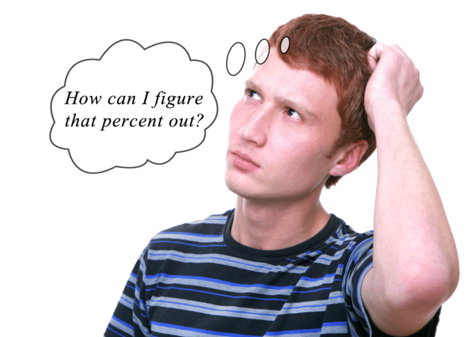

Now let’s look at another example.

Example

In the last 3 years, the price of gas has risen from an average of $1.89 per gallon to an average of $2.95 per gallon. This is an increase of $1.06 per gallon. What is the percent of increase?

**To solve for this percent of increase, we divide the amount of the increase by the original amount and multiply by 100. In this case, the increase was $1.06.**

$\frac{1.06}{1.89} = .561 = 56.1 \% \ increase$

**56.1% is our answer.**

**_Notice that we multiply by 100 to convert the decimal into a percent since we are looking for the “percent of increase.”_**

II. **Find a Percent of Decrease Given the Original Amount and the Amount of Increase**

Many numbers in the real world increase. You know that many numbers decrease, too. Calculating the percent of decrease will be almost the same procedure as calculating the percent of increase. **The** **_percent of decrease_** **is the percent that a value decreases.**

**To find the** **_percent of decrease,_** **divide the amount of decrease by the original amount and multiply by 100.**

Now let’s look at an example.

A helicopter’s altitude went from 350 feet to 38 feet. This was a different of 312 feet. By what percent did the altitude decrease?

$\frac{312}{350} = .891 = 89.1 \%$

**The percent of the decrease is 89.1%.**

III. **Use Percent of Change to Find a New Amount**

We can find the percent of change if we know an original amount and how much it either increased or decreased. At times, however, we are given the percent of increase or decrease and need to calculate a new amount. Let’s look at how we can calculate this new amount.

Example

A restaurant manager has noticed an increase in the cost of utilities of 4%. In order to pay for the increased costs, he decides to increase prices by 4% as well. Not all items are priced the same. The chicken platter currently costs $5.99 and the steak platter cost $7.99. If the prices are increased by 4%, what will the new prices be?

**First, we can notice that we are going to create two new amounts. We are going to create a new cost for the chicken platter, and we are going to create a new cost for the steak platter. We have original amounts and the percent of the increase, so now we need to calculate a new amount.**

**First we must calculate how much the change will be. The prices are increasing by 4% so we must know how much 4% is of each price.**

$$
\begin{align*}
& \text{Chicken Platter} && \text{Steak Platter}\\
& \text{Price}: \$ 5.99 && \text{Price}: \$ 7.99\\
& 4 \% \ \text{of price} = 5.99 \times 4 \% && 4 \% \ \text{of price} = 7.99 \times 4 \%\\ 
& or \ 5.99 \times .04 && or \ 7.99 \times .04\\
& \text{Price change} = .24 && \text{Price change} = .32
\end{align*}
$$

Now we know how much each platter’s price is going to change? Since this is an increase, we will add the price change to the price. If it were a decrease, we would subtract the decrease from the price.

$$
\begin{align*}
& \text{Previous price}: \quad  \$ 5.99 && \text{Previous price}: \quad \$ 7.99\\
& \qquad \qquad \qquad \quad \quad \ \underline{\;\;\; .24 \;} && \qquad \qquad \qquad \quad \quad \ \underline{\;\;\; .32 \;}\\
& \text{New Price} \qquad \quad \ \ \$ 6.23 && \text{New Price} \qquad \quad \ \ \$ 8.31
\end{align*}
$$

**Let’s summarize. In order to find the new amount, we calculate the change amount by multiplying the original amount by the percent of change. We then add the change amount to the original amount for an increase or we subtract the change amount from the original amount for a decrease.**

Example

Find the new amount if 60 is decreased by 27%.

amount of change: $60 \times .27 = 16.2$

subtract the amount of change from the original amount: $60 - 16.2= 43.8$

**The answer is 43.8.**

IV. **Solve Real – World Problems Involving Percents of Change**

Throughout this lesson, you have been working with many real – world problems. Let’s continue working with percents of change in some practical dilemmas. Make sure to understand the situation completely and respond to the question that is being posed.

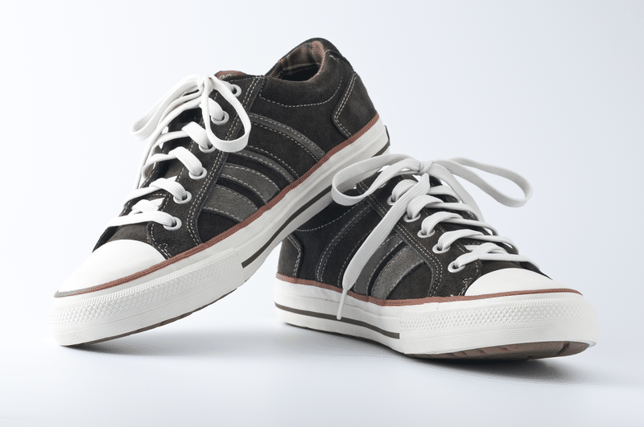

A pair of sneakers costs $165. They’re on sale for 30% off. What is the sale price of the sneakers?

**First, let’s look at this problem carefully to understand what they are asking us to find. Because the shoes are 30% off, this is a percent decrease.**

**Now we find the amount of change.**

Amount of change: $165 \times .30 = 49.5$

**For decrease, we subtract, so we subtract the amount of change from the original amount.**

$165 - 49.5 = 115.5$

**The sale price is $115.50.**

A gym’s membership went from 2100 members one year to 2410 members the next. This is a difference of 310 members. What was the percent of change?

**This percent is increasing, so we want to find the percent of the increase. We know the difference so now we can divide and multiply.**

$\frac{310}{2100}=.148=14.8 \%$

**The gyms membership increased by 14.8%.**

**Now let’s go back to the problem from the introduction and apply these skills to solving that problem.**

Real-Life Example Completed
---------------------------

**_An Attendance Prediction_**

**Here is the original problem once again. Reread it and then figure out the percent of the increase.**

Cameron and Carla decided to bring their proposal of increased attendance to the student council. They thought that if the student council suggested an increase in attendance to the student body that students might really want to help out.

“We know that 100% attendance is nearly impossible, but we could get to 55 or 60%, I think,” Cameron suggested.

“Then we could really show the high school that we support their efforts,” Carla chimed in.

“I think it is a great idea,” Avery, the President of the student council said. “We could conduct a survey and see how many students anticipate attending. Then we could try to predict the number of students who will attend next fall.”

That is exactly what they did. The students conducted a survey and asked students if they would be willing to attend next year’s football games to support the high school team. Out of their survey, they learned that 198 students said they planned on attending. That is an increase from 152 students. What is the percent of the increase?

**_Solution to Real – Life Example_**

**To solve for the percent of increase, we first need to figure out the difference between the old attendance and the predicted new attendance.**

**The old attendance = 152 students**

**The new attendance = 198 students**

$198 - 152 = 46$

**Next, we put that difference over the original attendance.**

$$
\frac{46}{152}
$$

**Now we divide.**

.302 = 30.2%

**If the prediction of the students is true, than it would be a 30% increase in attendance.**

Vocabulary
----------

Here are the vocabulary words found in this lesson.

__Percent__

a part of a whole out of 100.

__Percent of Increase__

the percent of change that a value increased.

__Percent of Decrease__

the percent of change that a value decreased.

Time to Practice
----------------

Directions: Calculate the percent of increase. You may round to the nearest tenth.

1.  From 7 to 12, an increase of 5
2.  From 31 to 50, an increase of 19
3.  From 7805 to 10510, an increase of 2705
4.  From 16 to 30, an increase of 14
5.  From 200 to 230, an increase of 30
6.  From 180 to 200
7.  From 330 to 400
8.  From 695 to 1000
9.  From 1200 to 1500
10. From 90 to 120

Directions: Calculate the percent of decrease. You may round to the nearest tenth.

11. From 74 to 35, a decrease of 39
12. From 4 to 1, a decrease of 3
13. From 576 to 476, a decrease of 100
14. From 200 to 175, a decrease of 25
15. From 150 to 100, a decrease of 50
16. From 325 to 290, a decrease of 35
17. From 45 to 18, a decrease of 27
18. From 19 to 1, a decrease of 18
19. From 22 to 10
20. From 34 to 20

Directions: Use percent to find the new amount.

21. 82 increased by 90%
22. 64 decreased by 10%
23. 9 increased by 55%
24. 25,470 decreased by 77%

</article>

### 5.5 Consumer Percent

<article>

Introduction
------------

**_A Student Council Meal_**

The sales tax is 7%. The food server was particularly attentive so Cameron’s Mom decided to give her an 18% tip. Cameron began to work through the math in his head. How much was the total bill?

**That is an excellent question. This lesson is all about different consumer percents. Pay close attention and you will be able to solve this problem at the end of the lesson.**

**_What You Will Learn_**

By the end of this lesson, you will know how to complete the following tasks.

* Find retail prices given wholesale prices, markups and sales tax.
* Find sale prices given regular prices, discounts and sales tax.
* Find original prices given total receipt amounts.
* Solve real-world problems involving discounts, markups, sales tax and tips.

**_Teaching Time_**

I. **Find Retail Prices Given Wholesale Prices, Markups and Sales Tax**

We’ve now seen on many occasions how practical percent is in everyday life. In most things you purchase, percent is used in one way or another to calculate a final price, a discount, tax or a tip. Your understanding of this is important in making sure that you get charged the right price and that you tip appropriate amounts as well.

**Let’s start by looking at wholesale prices and markups.**

Most companies are in business to make a profit. Companies generally offer goods or services or both. Stores that sell you products like hairspray, potato chips, and video games, buy those products from the companies that make them. Because they buy so many of the same products, they get special prices called **_wholesale prices_**. They figure out how much each piece or unit costs them and then they charge you a certain amount more for each product. The difference is called the gross profit. After they pay all of their other expenses like wages, utility bills, insurance, etc., they hope to have some money left over. This is their profit.

Knowing just how much to charge for each product is sometimes tricky. If a company charges you too much, you may not purchase products from them. Companies have to study the market and their true costs in order to calculate the best price to charge to remain competitive but still make a profit. After studying the market, they decide on a markup—a percent by which they will increase the wholesale price to get the retail price. So the wholesale price is what the companies pay for the product and the retail price is what the company charges for the same product. The percent increase from the wholesale price to the **retail price is the** **_markup_**.

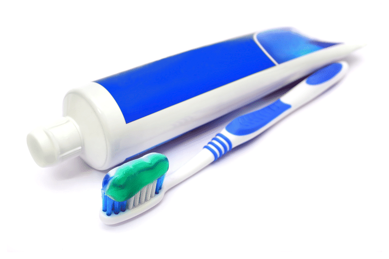

Let’s suppose a company sells toothpaste. They buy the toothpaste for $1.10 per tube; this is the wholesale price. Remember, they may buy a case of 200 tubes all at once. In order to make a profit, they mark the price up by 65%; this is their markup. So in order to calculate the retail price, they increase the wholesale price by 65%.

**Let’s figure out the retail price given the wholesale cost and the percent of the increase.**

Amount of change: $1.10 \times .65 = .715$

Add increase to the wholesale price: $1.10 + .715 = 1.815$

Round off the price to the nearest whole cent: retail price is $1.82.

**The retail price of the toothpaste is $1.82.**

A florist gets a dozen roses for $15. They charge a markup of 120%. What is the retail price of a dozen roses?

Amount of change: $15 \times 1.20 = 18$

Add increase to the wholesale price: $15 + 18 = 33$

**The florist charges $33 for a dozen roses.**

**To calculate the retail price:**

1.  **Find the amount of change by multiplying the wholesale cost with the % of increase. Remember to convert the percent to a decimal to multiply.**
2.  **Then add the increase to the wholesale price.**
3.  **This is the new retail price.**

**Sometimes, you will also have to deal with sales tax.**

On most products that you purchase, stores also charge you **a** **_sales tax_** **which is determined by the government.** This money is paid to the government so that they can provide services to the people. Tax is usually a percent increase that is added to the retail price.

If you were to buy a dozen roses from the company in the previous example, you would pay $33. Let’s suppose there is a tax of 6%. This would be an increase of 6% so we would use a similar process to find the final price. Because this deals with money, we round the calculations to the nearest cent (or hundredths place).

Amount of tax: $33 \times .06 = 1.98$

Add tax to the retail price: $33 + 1.98 = 34.98$

**The total price with tax is $34.98.**

**To calculate sales tax:**

1.  **Multiply the retail by the percent of the sales tax. You will need to convert this percent to a decimal first.**
2.  **Then add that amount to the retail price.**
3.  **This is the final cost to the customer.**

II. **Find Sale Prices Given Regular Prices, Discounts and Sales Tax**

Fortunately for the consumer, price changes aren’t always increases. In order to reduce inventories or motivate buyers, stores often have sales in which they discount prices by a percent. Instead of a percent increase, this is a percent decrease. We can calculate these **_sale prices._**

At the end of the summer, a clothing store puts all swimwear on sale. They offer a discount of 60%. If the regular price is $29.99 on a bikini, what is the sale price?

**Amount of discount:** $29.99 \times .60 = 17.99$

**Subtract discount from original price:** $29.99 - 17.99 = 12.00$

**The sale price is only $12.00.**

**Not so fast. We almost forgot to pay the tax. If the sales tax is 6.25%, we must now add the tax to the sale price.**

**Amount of tax:** $12 \times .0625 = .75$

**Add tax to the sale price:** $12 + .75 = 12.75$

**The sale price with tax is $12.75.**

A local bookstore has a 30% off everything sale. The sales tax is 5%. What is the total price on a book whose cover price is $15.99?

Amount of discount: $15.99 \times .30 = 4.80$

Subtract discount from original price: $15.99 - 4.80 = 11.19$

The sale price is $11.19.

**Don’t forget the sales tax!**

Amount of tax: $11.19 \times .05 = .56$

Add tax to the sale price: $11.19 + .56 = 11.75$

**The sale price with tax is $11.75.**

**_Notice that with a discount you subtract the amount and with sales tax you add the cost._**

III. **Find Original Prices Given Total Receipt Amounts**

Calculating a price with tax is the same as increasing by a percent. **What if you know the total price including the tax and want to know the original price of a product?**

Example

A store clerk charges you $78.75 for a DVD player. The tax in your area is 5%. So how much was the original price of the DVD player?

**We can find this out by using an equation.**

In order to get the total cost, the cash register computes the 5% tax and adds the tax to the original price like we did three sections ago. In other words:

$$
\text{original price} + 5. \ \text{of original price} = \text{total cost}
$$

Now let’s use variables and convert the percent to decimal.

$p+.05p = c$

In this equation, we $p$ and $.05p$ are like terms so they can be combined.

$1.05p = c$

In this case, if we are given $p$, we can solve for $c$. Or if we are given $c$, we can solve for $p$. In our example, we paid a total cost $c$ of $78.75. Substitute $c$ in the equation and solve for $p$.

$$
\begin{align*}
1.05p &= 78.75\\
1.05p \div 1.05 &= 78.75 \div 1.05\\
p &= 75
\end{align*}
$$

**The original price was $75.00.**

Example

You are charged $29.10 for an item with 7% tax included. What was the original price of the item?

$$
\begin{align*}
1.07p &= 29.10\\
p &= 27.20
\end{align*}
$$

**The original price of the item was $27.20.**

IV. **Solve Real – World Problems Involving Discounts, Markups, Sales Tax and Tips**

Now let’s see more examples from the real-world where discounts and markups, tax and tips all come together.

You purchase some plants for your gardens. Two trees have a price of $55.00 each. Six tulips cost $2.50 each. The tax on your purchase is 5.75% but there is an early-bird special of 10% off your entire purchase to those who show up before 10am. What is the total cost?

**Add up all of the products:** $55.00 \cdot 2 = 110.00$

$2.50 \cdot 6 = 15.00$

**Total price of products:** 125.00

**Calculate the tax of 5.75%:** $125 \times .0575 = 7.19$

**Add the tax to the price:** $125.00 + 7.19 = 132.19$

**Calculate the 10% discount:** $132.19 \times .10 = 13.22$

**Subtract the discount from the price: $132.19 - 13.22 = 118.97$**

**The grand total is $118.97.**

**Now let’s return to the problem in the introduction and use what we have learned.**

Real-Life Example Completed
---------------------------

**_A Student Council Meal_**

**Here is the original problem once again. Reread it and then solve the problem for the total cost of the meal. Show your work for each piece.**

After the student council meeting, Cameron’s Mom offered to take all of the students out for lunch. They went to their favorite restaurant, “Howie’s Burger Place” for a lunch of burgers and fries. From the restaurant menu, each student ordered the burger special which costs $12.95 each but includes a drink, and a dessert. After eating, Cameron looked at the bill. He saw that 5 students ordered the burger special.

The sales tax is 7%. The food server was particularly attentive so Cameron’s Mom decided to give her an 18% tip. Cameron began to work through the math in his head. How much was the total bill?

**_Solution to Real – Life Example_**

**Here is the solution to the problem. Notice each part of the bill and how it is calculated.**

**First, add up all of the meals. $12.95 \times 7 = \$90.65$**

**Calculate the tax of 7%:** $90.65 \times .07 = 6.35$

**Add the tax to the price:** $90.65 + 6.35 = 97.00$

**Calculate the 18% tip:** $97.00 \times .18 = 17.46$

**Add the tip to the price:** $97.00 + 17.46 = \$114.46$

**The total bill is $114.46. You could round up to $114.50 to make the numbers even too.**

Vocabulary
----------

Here are the vocabulary words used in this lesson.

__Wholesale price__

the price that a merchant pays when they purchase a product from a manufacturer.

__Markup__

the amount that the merchant charges retail to the customer. The difference between wholesale and retail is the markup and also the profit.

__Sales Tax__

a percentage charged on purchases, and that goes to the government.

__Discounts__

when merchants have a sale a percent of the decrease is calculated to sell the product at a lower price.

Time to Practice
----------------

Directions: Calculate the retail price given the wholesale price and percent markup.

1.  Wholesale price: $6.43 markup: 38%
2.  Wholesale price: $612.00 markup: 70%
3.  Wholesale price: $.22 markup: 55%

Directions: Find the total cost after adding the tax.

4.  Retail price: $76.50 tax: 8%
5.  Retail price: $399 tax: 4.75%
6.  Retail price: $8.79 tax: 7.25%
7.  Retail price $44.56 tax: 5%
8.  Retail price $345.00 tax 11%

Directions: Find the total cost after computing the wholesale price and the tax.

9.  wholesale price: $4.15 markup: 100% tax: 6%
10. wholesale price: $116.21 markup: 33% tax: 5.5%
11. wholesale price: $51.55 markup: 61.3% tax: 3.75%

Directions: Find the price after a discount and the tax.

12. original price: $3.29 discount: 50% tax: 0%
13. original price: $108.75 discount: 25% tax: 5.25%
14. original price: $45 discount: 33.3% tax: 7.5%

Directions: If your food bill at a restaurant is $85.77, what your total cost be after the tip for:

15. service 10%
16. decent service 15%
17. great service 20%

Directions: What was the original price given total cost and tax rate?

18. total cost: $1475.68 tax rate: 7%
19. total cost: $63.80 tax rate: 4.5%

Directions: Solve each problem. There are several steps to solving each problem.

20. You take a taxi ride in a foreign country where they add 20% to your total for late night travel. The driver expects an additional 15% tip. How much do you owe for the taxi ride if the meter shows $45?
21. You take your mother out for lobster for Mother’s Day. The lobster platters are $24.95 each but include the drink and dessert buffet. Your waitress is a mother, too, so you leave her a 20% tip. However, you did bring a coupon for 25% off. What is your total cost for 2 people?

</article>

### 5.6 Percent and Statistics

<article>

Introduction
------------

**_A Question of Seating_**

“Yes, but that isn’t anything compared to National football stadiums,” Cameron said.

“I agree,” Carla chimed in. “I heard that some of those stadiums can seat 70,000 people. My Uncle Tim is a huge fan and he was recently telling us all about it. Think about that, 70,000 is a lot of people.”

“It is, but the new stadium that the Dallas Cowboys is building can beat even that,” Jeremy said.

“Really? How?” Carla asked.

“Well, the previous stadium seated 80,000 people. This new one will seat 100,000 people and it will become the number one largest stadium that there is!” Jeremy said.

**80,000 to 100,000 is quite an increase. We can find the percent of an increase or decrease when working with large numbers too. This lesson will teach you how to work with large numbers or with really small numbers. When finished, you will be able to figure out the percent of the increase in seating for the stadium.**

**_What You Will Learn_**

In this lesson you will learn how to complete the following skills.

* Solve statistics-based problems involving percents greater than one hundred.
* Solve statistics-based problems involving percents less than one.
* Solve statistics-based problems involving scientific notation and percents.
* Solve statistics-based problems involving very large and very small numbers.

**_Teaching Time_**

I. **Solve Statistics – Based Problems Involving Percents Greater Than One Hundred**

**_Statistics_** **refers to mathematics involved with data and its interpretation.** Oftentimes we accumulate large sets of data like from a survey, a poll, an experiment, formal observations, etc. In order to draw any conclusion from the data, we must be able to interpret it. You have seen some statistical measures like mean, median, and mode. You have also used scientific notation to work with large and small numbers. Based on these statistical measures, we might make inferences that reach beyond the set of data or experiment. As we make inferences, percents will be useful. Sometimes percents will be greater than 100 or less than 1 so we will perform operations carefully.

**Let’s start with percents that are greater than one hundred.**

We have worked extensively with percent. We have recognized percent as a ratio with a denominator of 100 and said that the percent represents a part of a whole. One-hundred percent represent one whole. If you have 100% of a pizza, you have an entire pizza—delicious! What if you have 200% of a pizza? Then that is 2 whole pizzas, even better. 300% would be 3 whole pizzas. 1000% is 10 times 100% so that would be 10 whole pizzas. You can see, then, that percents do not stop at 100. **Whenever percents represent more than a whole, they will be greater than 100%.**

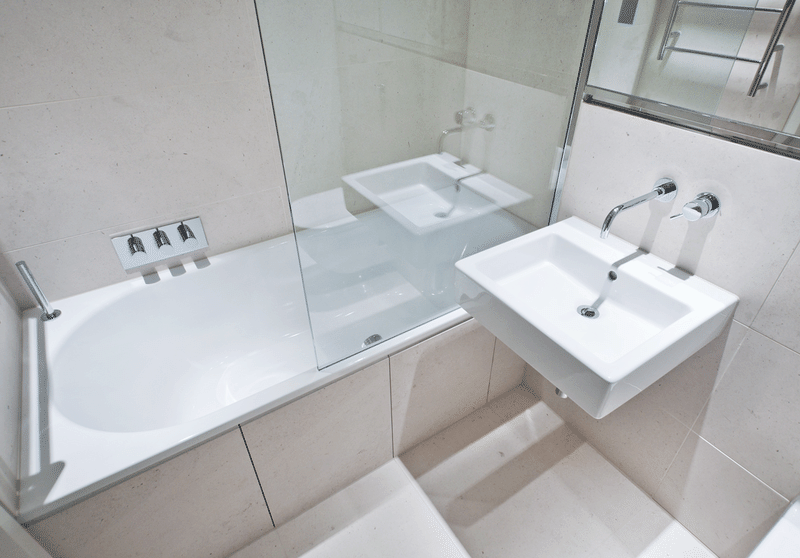

A nation-wide survey found that the average home in 1907 had 1.2 bathrooms. A hundred years later, the average home had 2.6 bathrooms. What was the percent of change in the number of bathrooms per home?

**This is a percent of change problem which we will compute as we did in previous lessons—find the amount of change, divide by the original amount, and multiply by 100 to find the percent.**

**Amount of change:** $2.6 - 1.2 = 1.4$

**Divide by original amount:** $\frac{1.4}{1.2} = 1.167$

**Multiply by 100 to get percent:** $1.167 \cdot 100 = 116.7\%$

**The number of bathrooms in the average home increased by 116.7% in 100 years. This indicates that the number of bathrooms per home more than doubled.**

You can see how useful it is to have percents that are greater than 100. They give us a whole new way to measure increases. Let’s look at another example.

Example

What percent of 55 is 70?

**With this problem, we can go back to our key words from earlier lessons. We know that we need to find a percent and that is multiplied by 100. But here, the part is larger than the whole. We have 70 of 55. Here is the problem.**

$$
\frac{70}{55}(100) = 127.3\%
$$

**This is our answer.**

II. **Solve Statistics – Based Problems Involving Percents Less Than One**

Sometimes a percent can be well over 100. Percents can also be very small. The operations do not change but we must be more careful in using decimal places correctly. Scientists often work with very small percents. Let’s look at an example.

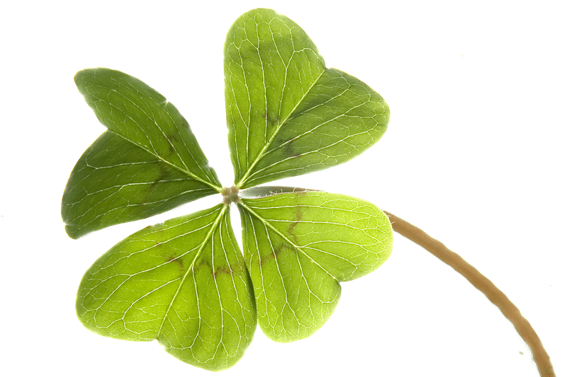

A researcher was interested in the truth about lucky four-leaf clovers. He surveyed 34,810 clover plants and found that only 18 of them actually had four leaves. All of the others had only 3 leaves. What percent of the plants had four leaves?

**Here we have a ratio of four-leaf plants to all of the plants:**

$\frac{18}{34810} = .0005$

**Multiply by 100 to get percent:** $.0005 \times 100 = .05\%$

**Only .05% of the plants actually had four leaves. I guess you are lucky if you find one.**

Example

What percent of 75 is .3?

$\frac{.3}{75} \times 100 = .4\%$

**The answer is .4%.**

III. **Solve Statistics – Based Problems Involving Scientific Notation and Percent**

**_Scientific notation_** is another useful mathematical tool that allows us to work with very large or very small numbers.

**What is scientific notation?**

**_Scientific notation_** **is when a number is written as a factor and a power of 10. This means that we are using exponents to represent the power of 10.**

Remember that any rational number can be written in scientific notation.

**It follows the form:**

$a \times 10^b$

**where $a$ is a number greater than or equal to 1 but less than 10 and $b$ is an exponent of 10**

When we conduct operations involving percent with numbers in scientific notation, we can use any operation with the $a$ value as we have seen in these sections. Then we will be sure to write our answer in scientific notation. We may need to adjust the $a$ and $b$ values. Let’s look at how this works.

On certain dates, Mars is about $4.9 \times 10^7$ miles from Earth. If a spacecraft is headed toward Mars and has traveled 30% of the distance, how many miles has it gone?

**To solve this, we need to find 30% of $4.9 \times 10^7$. The $a$ value is our factor that is 4.9 so we will find 30% of that and the power $10^7$ is included in the product once we have multiplied the factor with the percent.**

30% of $a$ value: $.30 \times 4.9 \times 10^7 = 1.47 \times 10^7$

**The spacecraft has traveled $1.47 \times 10^7 \ miles$. We can leave our answer in the form of scientific notation**

Our $a$ value is now 1.47 which is greater than or equal to 1 and less than 10. There is no need to adjust it.

Example

Find 25% of $3 \times 10^{12}$.

$.25 \times 3 \times 10^{12} = .75 \times 10^{12}$

Our $a$ value is .75 which is not greater than or equal to 1.

We move the decimal point 1 place to the right on .75 to get 7.5.

Then adjust the exponent 1 integer less—if we make the $a$ value bigger by a factor of 10, then we make the exponent 1 less.

$7.5 \times 10^{11}$

**This is our answer.**

IV. **Solve Statistics – Based Problems Involving Very Large or Very Small Numbers**

Very large and very small numbers are not always written in scientific notation. **Writing numbers “normally” is called** **_standard notation._** We can still work with numbers that are very large but again must be most careful of decimal places. Making an error of 1 decimal place is like multiplying or dividing a number by 10. You would probably agree that there is a big difference between $50 and $500 even though the decimal place is only different by 1 place or we could say by multiplying by 10.

$50 \times 10 = 500$

Let’s look at an example.

Example

In the year 2000, the United States had a population of about 280,000,000 people. By 2010, the population is expected to be 308,000,000. What will the percent increase have been in those 10 years?

$$
\begin{align*}
\text{Difference}: 308,000,000 - 280,000,000 &= 28,000,000\\
\text{Divide difference by original}: \frac{28,000,000}{280,000,000} &= .10 = 10\%
\end{align*}
$$

**The population will have grown by 10% in those 10 years.**

**Let’s review the steps we did here.**

1.  **We identified that we are looking for a percent.**
2.  **We found the difference between the original population and the new population.**
3.  **Then we divided the difference by the original population.**
4.  **Finally, we converted this decimal into our percent.**

Example

Find 32% of .00000054.

**To work on this problem, we have to change the percent into a decimal first.**

32% = .32

**Then we notice the key word “of” which means multiply. We are going to multiply the percent times that decimal, which represents a very, very small number.**

$.32 \times .00000054 = .0000001728$

**This is our answer.**

**Now let’s apply what we have learned to the original problem from the introduction.**

Real-Life Example Completed
---------------------------

**_A Question of Seating_**

**Here is the original problem once again. First, reread it. Then use what you have learned to figure out the percent of the increase in seating.**

“Wow! We can set 4000 people in our high school football stadium,” Jeremy said while reading the school newspaper.

“Yes, but that isn’t anything compared to National football stadiums,” Cameron said.

“I agree,” Carla chimed in. “I heard that some of those stadiums can seat 70,000 people. My Uncle Tim is a huge fan and he was recently telling us all about it. Think about that, 70,000 is a lot of people.”

“It is, but the new stadium that the Dallas Cowboys is building can beat even that,” Jeremy said.

“Really? How?” Carla asked.

“Well, the previous stadium seated 80,000 people. This new one will seat 100,000 people and it will become the number one largest stadium that there is!” Jeremy said.

**_Solution to Real – Life Example_**

**To find the percent of the increase, first, find the difference between the old seating number and the new seating number.**

$100,000 - 80,000 = 20,000$

**Now compare the difference to the original number of seats.**

$$
\frac{20,000}{80,000}
$$

.25 = 25%

**The new seating is a 25% increase over the previous seating.**

Vocabulary
----------

Here are the vocabulary words that are found in this lesson.

__Statistics__

mathematical that involves data collection and interpretation.

__Percent of Change__

the percentage that a value changes to increase or decrease over time.

__Scientific Notation__

writing a number as a factor and a power of 10. This involves the use of exponents.

__Standard Notation__

writing numbers in the usual way with all of the zeros accounted for in the value.

Time to Practice
----------------

Directions: Answer each question and round your answers to the nearest tenth.

1.  What percent of 110 is 450?
2.  What percent of 32 is 100?
3.  What percent of 50 is 200?
4.  What percent of 88 is 400?
5.  What percent of 10 is 18?
6.  What percent of 2 is 4?
7.  What percent of 45 is 60?

Directions: Answer each question and round your answers to the nearest hundredth.

8.  What percent of 50,980 is 325?
9.  What percent of 85 is .25?
10. What percent of 90 is 15?
11. What percent of 10 is 4?
12. What percent of 30 is 6?

Directions: Round the $a$ values to the nearest hundredth and place your answers in scientific notation.

13. Find 62% of $3.5 \times 10^9$.
14. Find 5% of $9.1 \times 10^{13}$.
15. Find 180% of $6.3 \times 10^{-17}$.

Directions: Answer each question and leave your answers in standard form.

16. What percent of 8,570,000 is 152?
17. Find 230% of .00000488
18. The number .00036 is 45% of what number?
19. A technology company made a great new discovery. It then saw its stock price go from $3.75 in March to $75.52 in May. What was the percent of increase of the stock in those two months?
20. A rival company got hit with a big law suit after a scandal was discovered. Its highest stock price was $210. Its stock is now worth $1.62. What percent value does the stock currently have compared to its highest price?
21. Margaret loves to watch sad movies. She cries 200 tears in a movie. A single tear has about $1.2 \times 10^{18}$ atoms in it. So she’ll cry about $2.4 \times 10^{20}$ atoms during the whole movie. About how many atoms will she have cried after only 13% of the movie?
22. The Earth is about 92,960,000 miles from the Sun. Light travels about 186,000 miles per second. What percent of the distance from the Sun to Earth does light travel in 1 second?
23. A light year is about 5,880,000,000,000 miles. In one month, it travels about 8.2% of that distance. About how far does it travel in one month?

</article>

### 5.7 Simple Interest

<article>

Introduction
------------

**_Student Council Investment_**

“I think it will help make it a priority for students,” Jeremy said at the weekly student council meeting.

“It will be a lot of fun too. We could even host a pep rally to help get the kids charged up,” Candice suggested.

“We put $4000 in the bank in the sixth grade. Now that we are $8^{th}$ graders that money has been sitting in the bank for two years at a 4% interest rate,” Jeremy explained.

Candice began working out the math in her head. If they did put $4000 in the bank for two years and they had a 4% interest rate, then there definitely is more money in there now. She began to complete the calculations in her head.

**Do you have an idea how to figure this out? This problem involves principal, interest rates and time. This lesson will teach you all about calculating simple interest. Pay close attention and you will see this problem again at the end of the lesson.**

**_What You Will Learn_**

In this lesson you will learn how to use the following skills.

* Use the simple interest formula $I = Prt$ to find an interest rate.
* Use the equation to find the time required to earn a given amount.
* Use the equation to find the new balance after a given time.
* Solve real-world problems involving simple interest.

**_Teaching Time_**

I. **Use the Simple Interest Formula $\underline{I = Prt}$ to Find an Interest Rate**

Money is a necessary part of everyday life, and as you get older, your relationship to money will change. In this lesson, we will explore some of the ways in which you will relate to money as you get older.

Saving money and making wise investments will be an important part of your financial planning. Part of making investing is earning interest. **When you save money in the bank, the bank uses that money for its own investments. In return for using your money, the bank pays you a certain percent. This percent is your** **_interest_****. Interest is the percent that a bank pays you for using keeping your money in their bank.**

Banks compete with each other for your money because they want you to put your money in their bank. They try to give you the best “interest rate” that they can. This means that they will pay you a greater percentage than another bank to try to get your business. The greater the interest rate that they pay you; the more likely you are to invest your money with them in a savings account. The more money you save, the more they have to invest. **They publish an interest rate $r$ which tells you what percent they will pay you per year $t$. The principal, $p$ is the amount of money that you have put into the bank.**

**You can use this information in the formula $I = prt$ in order to calculate the interest that you will earn on your principal $p$.**

Now let’s look at how we can use this formula to calculate interest.

You invest $5,000 in a bank for 2 years at a 4% interest rate. What is the interest you have earned after this time?

**We start by looking at the given information. Then use the formula to calculate interest.**

$p = 5000, r = .04, t = 2$.

**Use the formula to calculate interest.**

$$
\begin{align*}
I &= prt\\
I &= 5000 \cdot .04 \cdot 2\\
I &= 400
\end{align*}
$$

**The bank will pay you $400 in interest over two years at that rate.**

Example

An investor places $15,000 in a savings account that pays 4.5% interest. She will leave the money there for 6 years. What will her interest be?

$$
\begin{align*}
p &= 15000, r = .045, t = 6\\
I &= prt\\
I &= 15000 \cdot .045 \cdot 6\\
I &= 4050
\end{align*}
$$

**Her interest after 6 years will be $4,050.**

Now that you know how to calculate the interest, let’s look at figuring out the time.

II. **Use the Equation to Find the Time Required to Earn a Given Amount**

Many investors may have specific goals—they want to earn a certain amount of interest on their investments. Because of this, they need to figure out the time that it takes to earn a certain amount of money. The formula $I = prt$ is an equation. We can use the Multiplication Property of Equations to solve for $t$ if we know $I, r$, and $p$.

Let’s look at an example.

Example

Mrs. Duarte has $20,000 to invest. She wants to earn $10,000 in interest. She is considering a savings and loans bank that is offering her 5.6% interest per year. For how long will she have to leave her money in the bank in order to reach her goal of $10,000?

**Start by looking at the given information.**

$I = 10000, p = 20000, r = .056$ Solve for $t$.

**Next, we substitute the given values into the formula and solve the equation.**

$$
\begin{align*}
I &= prt\\
10000 &= 20000 \cdot .056 \cdot t\\
10000 &= 1120t\\
\frac{10000}{1120} &= \frac{1120t}{1120}\\
8.93 &= t
\end{align*}
$$

**She will have to leave her money in the bank for nearly 9 years.**

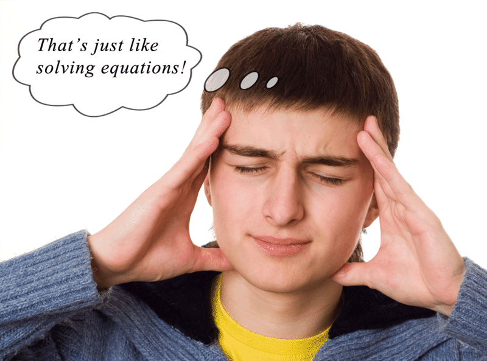

Example

A bank is offering an interest rate of 4.75%. How long would it take to earn $500 if you invested $12,000 in the bank?

$I = 500, p = 12000, r = .0475$ Solve for $t$.

$$
\begin{align*}
I &= prt\\
500 &= 12000 \cdot .0475 \cdot t\\
500 &= 570t\\
\frac{500}{570} &= \frac{570t}{570}\\
.88 &= t
\end{align*}
$$

**It would take .88 years or about $10\frac{1}{2}$ months.**

**_Notice that we have a decimal part of a year here. We can estimate how many months that is based on the decimal. A whole would be represented by 12 months or one year._**

III. **Use the Equation to Find the New Balance after a Given Time**

You can use the simple interest formula $I = prt$ to find any of the missing variables if you are given values of the others. We have used it to solve for $I$ and $t$. **Of course, once the bank pays you interest, your account balance grows. You start of with your principal $p$ and then you add your interest $I$. Now let’s see how much a bank balance would be after a given time at a given interest rate.**

Example

Jessica invests $3,000 in a credit union at an interest rate of 3.9%. She leaves the money there for 5 years. What is her balance after that time?

**To answer this question, we will need to do two things. First, we will need to figure out the amount of the interest. Then we can add this amount to the principal that Jessica first invested. This will give us the new balance.**

First find the interest that she earned:

$$
\begin{align*}
p &= 3000, r = .039, t = 5\\
I &= prt\\
I &= 3000 \cdot .039 \cdot 5\\
I &= 585
\end{align*}
$$

She earned $585 in interest. Her principal was $3,000. How much does she have now?

$585 + 3000 = 3585$

**She has $3,585. This is the new balance.**

Now let’s look at using this formula with some other real – world problems.

IV. **Solve Real – World Problems Involving Simple Interest**

Using the simple interest formula $I = prt$, we can calculate the interest rate $r$ if we are given the $I, p$ and $t$ values. As before, we will substitute the known values and then use inverse operations to find the missing value.

A nurse put $22,000 in the bank 15 years ago. She has earned $21,450 in interest—nearly as much as her initial investment. What was the interest rate that the bank was paying her?

$$
\begin{align*}
I &= 21450, p = 22000, t = 15\\
I &= prt\\
21450 &= 22000 \cdot r \cdot 15\\
21450 &= 330000r\\
\frac{21450}{330000} &= \frac{330000r}{330000}\\
.065 &= r
\end{align*}
$$

Because we are looking for a percent-an interest rate, we have to change the decimal to a percent.

.065 = 6.5%

**The bank was paying 6.5%.**

A bank uses the same formula $I = prt$ to calculate the interest that you owe on a credit card. Normally, the interest rates are substantially higher than for a savings account. If you charge $7,000 on a credit card and you bank charges you 15.9%, how much would you owe after a year?

**First, look at the given information and then use the formula.**

$$
\begin{align*}
p &= 7000, r = .159, t = 1\\
I &= prt\\
I &= 7000 \times .159 \times 1\\
I &= 1113
\end{align*}
$$

**Next, we add the interest to the balance. Because you owe on a credit card, this gives us the new balance that you need to pay.**

$1113 + 7000 = 8113$

**You would owe $8,113.**

**Now let’s go back to the dilemma in the introduction and apply what we have learned to this problem.**

Real-Life Example Completed
---------------------------

**_Student Council Investment_**

**Here is the original problem once again. First, reread it. Then figure out the amount of the interest and the total amount in the student council bank account. There are two parts to your answer.**

With a goal of boosting student attendance at football games, the student council has decided to invest a portion of their savings for middle school decorations. They figure that when the games are happening that they can decorate the middle school with balloons, banners and flyers.

“I think it will help make it a priority for students,” Jeremy said at the weekly student council meeting.

“It will be a lot of fun too. We could even host a pep rally to help get the kids charged up,” Candice suggested.

“We put $4000 in the bank in the sixth grade. Now that we are $8^{th}$ graders that money has been sitting in the bank for two years at a 4% interest rate,” Jeremy explained.

Candice began working out the math in her head. If they did put $4000 in the bank for two years and they had a 4% interest rate, then there definitely is more money in there now. She began to complete the calculations in her head.

**_Solution to Real – Life Example_**

**Now we need to figure out the interest and the final balance in the student council bank account.**

**First, let’s find the amount of the interest.**

$$
\begin{align*}
I &= PRT\\
I &= (4000)(.04)(2)\\
I &= \$320.00
\end{align*}
$$

**Next, we add this to the original amount invested.**

$\$4000 + \$320 = \$4320.00$

**This is the new balance in the student council account.**

Time to Practice
----------------

Directions: Use the simple interest formula $I = prt$ to solve for the Interest.

1.  Find $I$ if $p = 62,300, r = .0525, t = 14$.
2.  Find $I$ if $p = 9800, r = .028, t = 9$.
3.  Find $I$ if $p = \$600, r = .05, t=8$
4.  Find $I$ if $p = \$2300, r = .06, t=12$
5.  Find $I$ if $p = \$5500, r = .08, t=7$
6.  Find $I$ if $p = \$400, r = .05$ _and_ $t=5$
7.  Find $I$ if $p = \$700, r = .03$ _and_ $t=9$
8.  Find $I$ if $p = \$500, r = .06$ _and_ $t=12$
9.  Find $I$ if $p = \$800, r = .09$ _and_ $t=7$
10. Find $I$ if $p = \$950, r = .06$ _and_ $t=4$

Directions: Find the new interest and then find the new balance with the given information. There are two steps to solving these problems.

11. $p = 43000, r = .0365, t = 11$
12. $p = 7000, r = .079, t = 4$
13. $p = 8000, r = .06, t = 3$
14. $p = 18000, r = .04, t = 5$
15. $p = 25000, r = .05, t = 3$
16. $p = 3000, r = .05, t = 7$
17. $p = 12000, r = .04, t = 5$
18. $p = 9000, r = .06, t = 10$
19. $p = 7500, r = .03, t = 8$
20. $p = 27500, r = .04, t = 6$

Directions: Solve each problem.

21. Antonio receives a savings bond from his uncle for his birthday. It will be worth $1,000 in $8\frac{1}{2}$ years but only cost his uncle $500. What was the interest rate paid on the bond?
22. Henrietta is thinking of investing a $10,000 inheritance in a savings account for 6 years that pays 4.3% interest. She owes $7,200 on a credit card which is charging her 11.9% interest. In how much time would the interest on the credit card be the same as the interest in the savings account after 6 years?
23. A mother wants to save money for her child’s education. Her child just turned 1 year old. She wants to have at least $80,000 in the bank by the time she is 18. She has placed $35,000 in the bank at 6.5%. Will she reach her goal?

</article>

### 5.8 Compound Interest

<article>

Introduction
------------

**_A Question of Banking_**

“It is great,” Marcus commented, “But I think we would have made out better if the interest had been compounded monthly.”

“Really, what does that mean?” Jeremy asked.

“It means that the interest is earned and then reinvested and you earn interest on the earned interest,” Marcus explained.

“Really?” Candice asked.

“Yes, let me explain,” Marcus said.

**Before Marcus explains, it is time to learn about compound interest. Once you have learned the information in this lesson you will be ready to figure out if Marcus is correct.**

**_What You Will Learn_**

By the end of this lesson, you will be able to demonstrate the following skills.

* Use the compound interest formula $A = p(1 + r)^t$ to find the new balance after a given time.
* Compare balances after a given time at the same rate of simple interest and compound interest.
* Compare amounts earned at the same rate compounded at different periods over the same time.
* Solve real – world problems involving compound interest.

**_Teaching Time_**

I. **Use the Compound Interest Formula $\underline{A = p(1 + r)^t}$ to find the New Balance After a Given Time**

In the last section, we discussed the importance of interest. It is not only big business for banks and investors but it is a way of securing a comfortable retirement and reaching financial goals. Understanding interest helps you to make the best decisions. The last section dealt with simple interest which illustrates the basic idea of interest.

In most cases in the real world, however, interest is calculated not with the **_simple interest_** formula $I = prt$ but with the **_compound interest_** formula $A = P(1+r)^t$. **Basically, this formula accounts for the fact that as you invest and earn interest, your balance grows. You are not only due interest, then, on your original balance, but on the new balance which includes the first installment(s) of interest. You get paid interest on the interest.**

Let’s look at an example.

Example

You invest $100 for 3 years at 10% interest. After one year, you’d have the original amount plus the 10% interest. You’d have $110. Then, in the second year, you’d get paid the same 10% interest but not on just $100 but on $110. In the second year you’d earn $11 in interest and you’d have $121. In the third year you’d earn $12.10 and your ending balance would be $133.10. You got paid interest on interest and this made a difference in your final balance.

**The example above shows compounding every year. That means that you get paid interest once a year on your balance. In the real world, interest is oftentimes compounded monthly or daily. For compound interest, we’ll use the formula $A = P(1+r)^t$ where $A$ is your final balance, $P$ is the principal amount, $r$ is the interest rate for the period (daily, monthly, semi-annually, annually, etc.) and $t$ is the number of time periods for which the money is invested. If compounding occurs monthly, there will be 12 periods per year.**

In the example above, $P$ was $100, $r$ was 10%, and $t$ was 3 periods since the interest was compounded yearly. We would substitute these values in the compound interest formula:

$$
\begin{align*}
A &= P(1+r)^t\\
A &= 100(1+.10)^3\\
A &= 100(1.10)^3\\
A &= 100(1.331)\\
A &= 133.10
\end{align*}
$$

Using the formula we arrive at the same quantity discussed in the example.

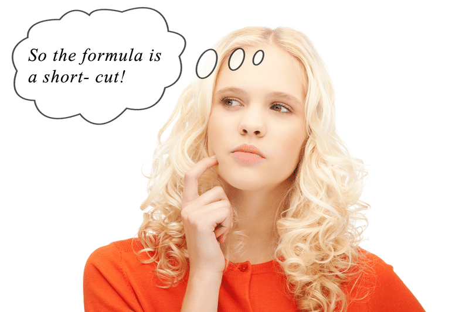

Example

What is the final balance on a savings account that earns 4.5% interest per year that is compounded annually (once per year) for 9 years if the beginning balance is $2,500?

**Let’s start by taking the information that we have been given and substitute it into the formula.**

$$
\begin{align*}
P &= 2500, r = .045, t = 9\\
A &= 2500(1+.045)^9\\
A &= 2500(1.045)^9\\
A &= 2500(1.486)\\
A &= 3715
\end{align*}
$$

**The final balance is $3,715.**

**Oftentimes, the interest is compounded more frequently. For example, it could be compounded monthly instead of annually. In this case, the time period is only one month and the rate must be computed for each month, too.**

A fireman invests $40,000 in a retirement account for 2 years. The interest rate is 6%. The interest is compounded monthly. What will his final balance be?

**Notice that we divide by 12 because there are twelve months in a year and the interest is compounded monthly.**

$$
\begin{align*}
r &= \frac{.06}{12} = .005\\
P &= 40000, t = 24\\
A &= 40000(1+.005)^{24}\\
A &= 40000(1.005)^{24}\\
A &= 40000(1.127)\\
A &= 45080
\end{align*}
$$

**Final balance is $45,080.**

II. **Compare Balances After a Given Time at the Same Rate of Simple Interest and Compound Interest**

You may be wondering what the big difference is between simple interest and compound interest. At first glance, it doesn’t seem like there is a big difference, however, if you figure out the math, the difference will become clear.

**Let’s see how different it might be using the same principal for the same amount of time at the same rate. However, one account will be paid simple interest and the other will be compounded yearly.**

| **Account 1—Simple Interest** | **Account 2—Compound Interest** |
| --- | --- |
| Principal Amount: $20,000 | Principal Amount: $20,000 |
| Interest Rate: 8% per year | Interest Rate: 8% per year |
| Time Frame: 20 years | Time Frame: 20 years |
| Simple Interest formula $I = prt$ | Compound Interest formula $A = P(1+r)^t$ |
| $p = 20000, r = .08, t = 20$ | $P = 20000, r = .08, t = 20$ |
| $I = prt$ | $A = P(1+r)^t$ |
| $I = 20000 \cdot .08 \cdot 20$ | $A = 20000(1+.08)^{20}$ |
| $I = 32000$ | $A = 20000(1.08)^{20}$ |
| $20000+32000 = 52000$ | $A = 20000(4.661)$ |
|     | $A = 93220$ |

**Simple interest gives you a balance of $52,000...not bad. Compound interest gives you a final balance of $93,220. That’s a huge difference! The total is over $40,000 more by compounding the interest.**

Example

Compare the final balances on a principal of $10,000 paid simple interest of 5% for a year or compound interest of 5% per year compound monthly. Then compare after 5 years and 10 years.

|     |     |     |
| --- | --- | --- |Balance after given years
| **Years** | **Simple Interest** | **Compound Interest** |
| --- | --- | --- |
| 1   | $10,500 | $10,512 |
| 5   | $12,500 | $12,834 |
| 10  | $15,000 | $16,470 |

**So you can see that there is big difference between the simple interest calculation and the compound interest calculation.**

III. **Compare Amounts Earned at the Same Rate Compounded at Different Periods over the Same Time**

Compounding interest certainly makes a big difference compared to simple interest. What about the frequency of compounding? In some of the examples above, we saw annual compounding, quarterly compounding, and monthly compounding. With the ease of modern technology, most banks actually compound daily. Let’s see an example.

**Compare the same principal invested for the same amount of time at the same rate with compounding annually and compounding daily.**

George invests $15,000 for 10 years in a bank that pays 6% and compounds annually.

David invests $15,000 for 10 years in a bank that pays 6% and compounds daily.

What will the difference be in their ending balances?

**Let’s substitute the given information into the formulas and then calculate the balances.**

| **George:** | **David:** |
| --- | --- |
| $r = .06$ | $r = \frac{.06}{365} = .0001643$ |
| $P = 55000, t = 120$ | $P = 15000, t = 3650$ |
| $A = 15000(1+.06)^{10}$ | $A = 15000(1+.0001643)^{3650}$ |
| $A = 15000(1.06)^{10}$ | $A = 15000(1.0001643)^{3650}$ |
| $A = 15000(1.79085)$ | $A = 15000(1.8215)$ |
| $A = 26862.75$ | $A = 27322.50$ |

**George’s ending balance is $26,862.75 while David’s is $27,322.50, a difference of $459.75 because of daily compounding.**

**You can see that amounts that are compounded at different periods create different amounts of income.**

III. **Solve Real – World Problems Involving Compound Interest**

When you consider real-world problems, be sure to understand the situation completely. Answer all parts of the question that is being posed. Also, you may have noticed in the examples that rounding occurred at different decimal place levels. It is important to choose the rounding based on the situation. In other words, if you are working with money, it is appropriate to round to the hundredths place because that is the place to which we have coins and make prices. In some cases, more decimal places are needed to compare numbers accurately while in yet other cases having too many decimal places is cumbersome and unnecessary.

Mr. Tomkins wants to invest a $10,000 bonus that he received from work. He will be investing it for 10 years and has two options: 1) a 6% interest rate compounded monthly or 2) an 8% simple interest rate. Which one will yield him a greater ending balance?

$$
\begin{align*}
&\underline{\text{Option} \ 1} \qquad \qquad \qquad \qquad \qquad \quad \underline{\text{Option} \ 2}\\
& A = P(1+r)^t\\
& A = 10000(1+.005)^{120} \qquad \qquad \quad \ \ I = prt\\
& A = 10000(1.005)^{120} \qquad \qquad \qquad \quad I = 10000 \cdot .08 \cdot 10\\
& A = 10000(1.8194) \qquad \qquad \qquad \quad \ \ I = 8000\\
& A = 18194 \qquad \qquad \qquad 10000+8000 = 18000
\end{align*}
$$

**Option 1 is better because he would have an ending balance of $18,194. In option 2, he would have $194 less.**

**Now let’s go back to the problem from the introduction and work on figuring it out using what we have learned about compound interest.**

Real-Life Example Completed
---------------------------

**_A Question of Banking_**

**Here is the original problem once again. Reread it and then solve it for the balance if the interest had been compound interest. Then compare it with the simple interest balance to see which method is more profitable.**

“Wow! $4320 is a terrific amount!” Jeremy exclaimed when Candice filled him in on the balance in the savings account.

“It is great,” Marcus commented, “But I think we would have made out better if the interest had been compounded monthly.”

“Really, what does that mean?” Jeremy asked.

“It means that the interest is earned and then reinvested and you earn interest on the earned interest,” Marcus explained.

“Really?” Candice asked.

“Yes, let me explain,” Marcus said.

**_Solution to Real – Life Example_**

**First, let’s figure out the balance if the interest had been compound interest.**

$$
\begin{align*}
A &= P(r + 1)^t\\
A &= 4000(.04 + 1)^{24}\\
A &= 4000 (1.04)^{24}\\
A &= 4000(2.56)\\
A &= \$10,240
\end{align*}
$$

**In this case, the amount of the balance with compounded interest would have been more than double the balance with simple interest. Marcus was correct after all!**

Vocabulary
----------

Here are the vocabulary words that are found in this lesson.

__Simple Interest__

interest calculated by only considering the principal times the rate times the time.

__Compound Interest__

when interest is earned, it is reinvested and you earn interest on the interest which is then added to the balance.

Time to Practice
----------------

Directions: Calculate the simple interest by using $I = PRT$.

1.  Principal = $2000, Rate = 5%, Time = 3 years
2.  Principal = $12,000, Rate = 4%, Time = 2 years
3.  Principal = $10,000, Rate = 5%, Time = 5 years
4.  Principal = $30,000, Rate = 2.5%, Time = 10 years
5.  Principal = $12,500, Rate = 3%, Time = 8 years
6.  Principal = $34,500, Rate = 4%, Time = 10 years
7.  Principal = $16,000, Rate = 3%, Time = 5 years
8.  Principal = $120,000, Rate = 5%, Time = 4 years

Directions: Calculate the following compound interest calculated yearly.

9.  Principal = $3000, Rate = 4%
10. Principal = $5000, Rate = 3%
11. Principal = $12,000, Rate = 2%
12. Principal = $34,000, Rate = 5%
13. Principal = $18,000, Rate = 3%
14. Principal = $7800, Rate = 4%
15. Principal = $8500, Rate = 3%

Directions: Calculate the following compound interest calculated quarterly. You may round when necessary.

16. Principal = $300, Rate = 3%
17. Principal = $500, Rate = 4%
18. Principal = $7000, Rate = 3%
19. Principal = $2000, Rate = 2%
20. Principal = $4000, Rate = 3%

Directions: Calculate the following compound interest calculated monthly.

21. Principal = $2000, Rate = 2%
22. Principal = $300, Rate = 3%
23. Principal = $4000, Rate = 2%
24. Principal = $1600, Rate = 3%
25. Principal = $5000, Rate = 4%

</article>

## 6.0 Geometry and Transformations

<article>

</article>

### 6.1 Angle Pairs

<article>

Introduction
------------

**_House building and Tipis_**

Jaime is very excited. She has always been interested in Native Americans, so she has chosen to work on a tipi. Jaime selected one of the books that Mrs. Patterson brought in and began to leaf through the pages looking at all of the different types of tipis constructed.

“Tipis?” Mrs. Patterson asked looking over Jaime’s shoulder.

“Yes, I want to design and build one for part of my project,” Jaime explained.

“That’s wonderful. You will need to use a lot of math to accomplish that too,” Mrs. Patterson stated.

Jaime hadn’t thought about the math involved in building a tipi. But as she looked through the pages on designing and building tipis, she noticed that there were a lot of notes on different angles.

One of the types of angles mentioned was a complementary pair of angles. Another was a supplementary pair of angles. These angles were important to figure out when stitching the liner of the tipi together.

Jaime is puzzled. She can’t remember how to identify a complementary or a supplementary pair of angles.

**This lesson is all about angle pairs and relationships. Pay close attention to the information in the lesson and at the end you will be able to help Jaime to identify these angle pairs.**

**_What You Will Learn_**

In this lesson you will learn how to understand the following skills.

* Identify angle pairs as complementary, supplementary or neither.
* Identify adjacent and vertical angles formed by intersecting lines.
* Identify intersecting, parallel or perpendicular lines in a plane.
* Find measures of angle pairs using known relationships and sufficient given information.

**_Teaching Time_**

I. **Identify Angle Pairs as Complementary, Supplementary or Neither**

In this lesson, we will begin to examine angles that are formed by different types of lines.

**An** **_angle_** **is measurement of the space created when lines intersect.** Here is an example of the angles formed when two lines intersect. You can see that there are four angles created in this drawing and that they are labeled 1 – 4.

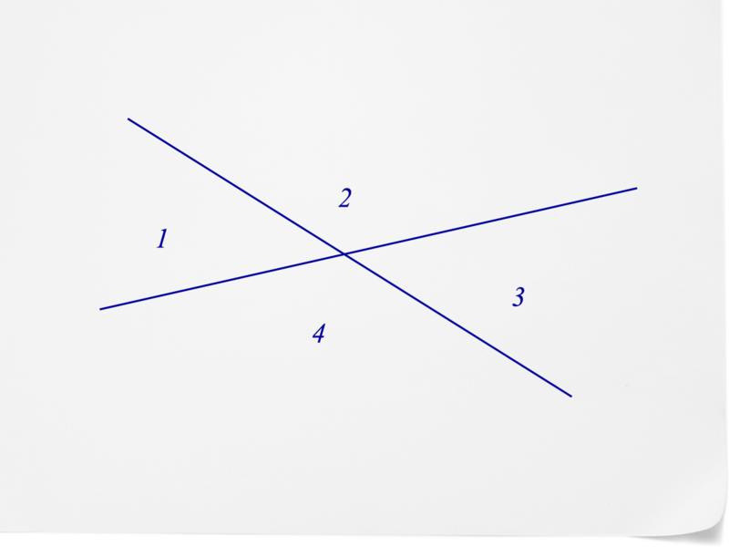

The two basic forms of angle pairs are called **_complementary_** and **_supplementary_** angles.

**_Complementary angles_** **are two angles whose measurements add up to exactly $90^{\circ}$.** In other words, when we put them together they make a right angle. Below are some pairs of complementary angles.

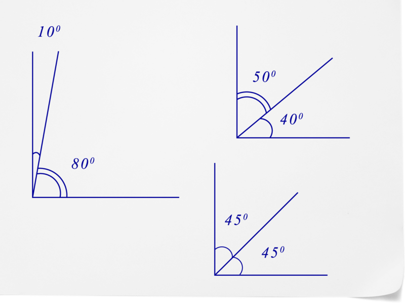

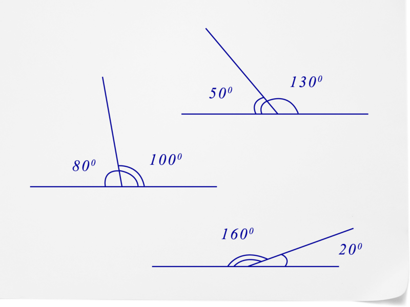

Example

_Classify the following pairs of angles as either complementary or supplementary._

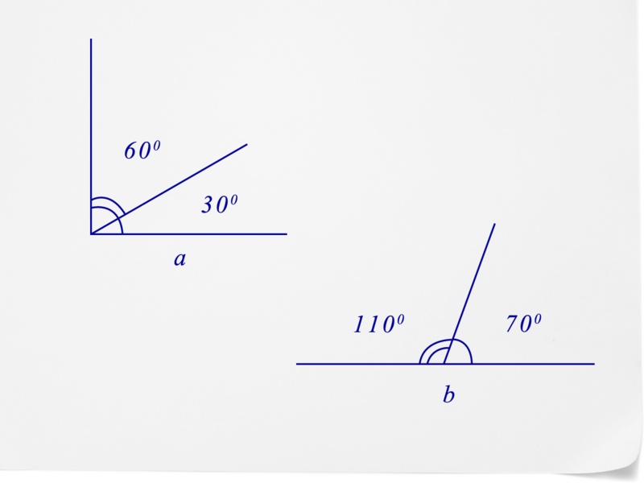

**First, look at the first pair of angles labeled $a$.** We can see that the measure of the angles in this pair is 30 and 60 degrees. We know that the sum of complementary angles is $90^{\circ}$. Therefore, we can identify this angle pair as complementary angles.

**Now look at the second angle pair labeled $b$.** We can see that the measure of the angles in this pair is 110 and 70. The sum of these two angles is $180^{\circ}$. These angles are supplementary angles.

**_Note: The word “supplementary” or “complementary” refers to the relationship between the two angles._**

Sometimes, a pair of angles will be neither complementary nor supplementary. Let’s look at an example.

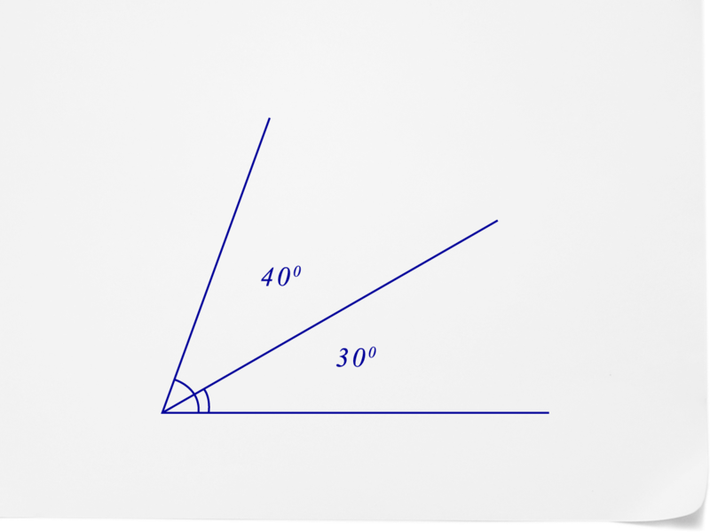

II. **Identify Adjacent and Vertical Angles Formed by Intersecting Lines**

When lines intersect, they create special relationships between the angles that they form. Once we understand these relationships, we can use them to find the measure of angles formed by the intersecting lines.

**_Adjacent angles_** **are angles that share the same vertex and one common side. If they combine to make a straight line, adjacent angles must add up to $180^{\circ}$.** The word “adjacent” means “next to” that can help you to remember adjacent angles.

Below, angles 1 and 2 are adjacent. Angles 3 and 4 are also adjacent.

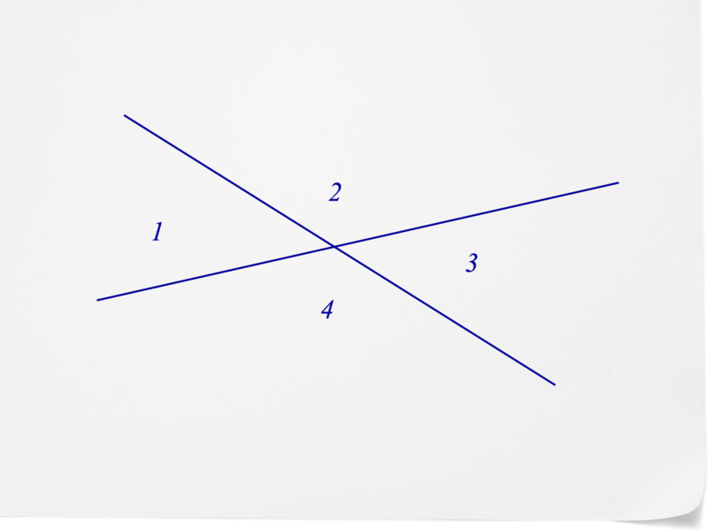

We can find the sums in this way.

$$
\angle{1} + \angle{2} = 180^{\circ}\\
\angle{3} + \angle{4} = 180^{\circ}\\
$$

**As you work through this lesson, you will find that some information leads you to other information. Here is the first example of that. Whenever adjacent angles form a straight line, they are also supplementary. The sum of their angles will be $180^{\circ}$.**

Notice that when there are two angles next to each other, there are also two angles diagonally across from each other. These are called **_vertical angles._** **_Vertical angles_** **are angles that are diagonally across from each other and have the same measure.**

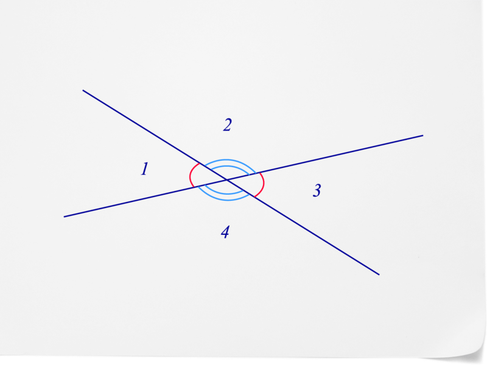

Example

_Identify the vertical angles and the adjacent angles in the diagram below._

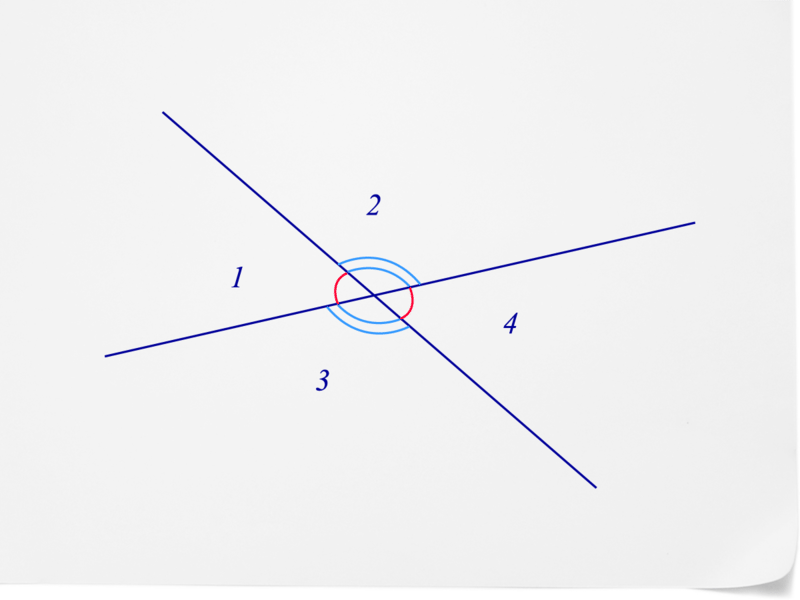

**Adjacent angles are next to each other. If they form a straight line then they are supplementary angles. We can see from the diagram that angles 1 and 3 are adjacent. Angles 2 and 4 are also adjacent.**

**Vertical angles are diagonal from each other and have the same measure. In this case, angles 1 and 4 are vertical. Angles 2 and 3 are also vertical angles.**

You will use this information again when problem solving, but now, let’s look at types of lines.

III. **Identify Intersecting, Parallel and Perpendicular Lines in a Plane**

In other math classes, you learned about different types of lines. Lines exist in space. Two lines intersect when they cross each other. Because all lines are straight, intersecting lines can only cross each other once.

There are **_parallel lines, intersecting lines_** and **_perpendicular lines._** Let’s start by briefly reviewing these terms and then we can look at the **_angles_** formed when these lines intersect.

**Types of Lines**

**_Parallel Lines_** **are lines that are an equal distance apart. This means that these lines will never intersect.**

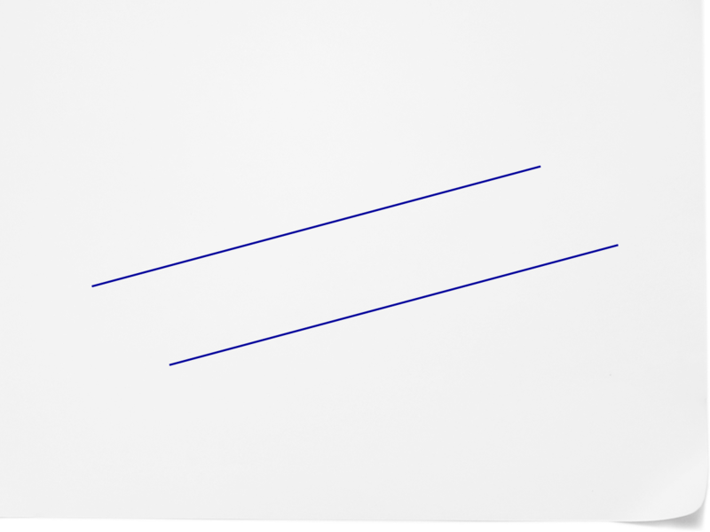

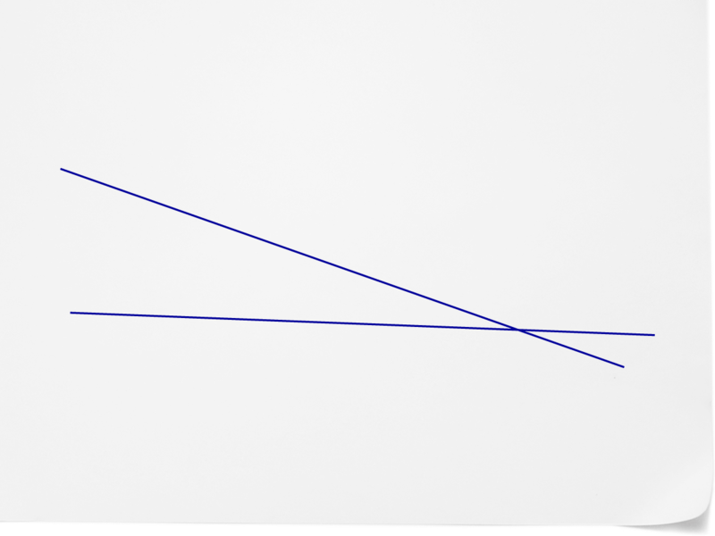

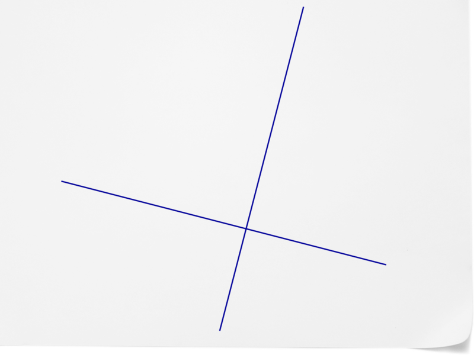

IV. **Find Measures of Angle Pairs using Known Relationships and Sufficient Given Information**

Now that you have learned some information about angle pairs and their relationships, you can use what you have learned to find the measures of missing angles. Let’s review what we have just learned.

* **Supplementary angles are two angles that form a straight line, and their sum is always $180^{\circ}$. Complementary angles together form a right angle and have a sum of $90^{\circ}$.**
* **Adjacent angles are next to each other. When they form a line, their sum is $180^{\circ}$.**
* **Vertical angles are directly opposite each other. They are equal.**

Here is our first example.

Example

_Fill in the figure below with the angle measures for all of the angles shown._

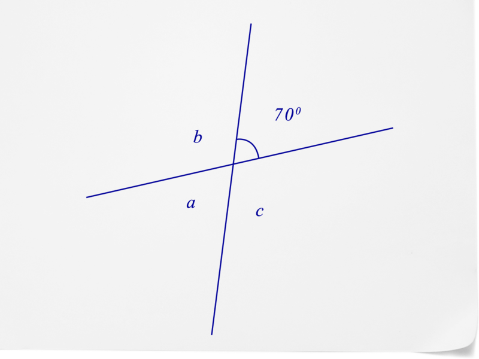

Let’s begin with adjacent angles. Angle $b$ is adjacent to the 70 degree angle. Since we know that adjacent angles form a straight line, the sum of the two angles is $180^{\circ}$.

We can write this equation.

$180 = 70 + b$

**We know that $b$ is equal to $110^{\circ}$.**

**Next, we can work on the vertical angles. Angle $c$ is vertical with angle $b$. Vertical angles have the same measure, so the measure of angle $c$ is also $110^{\circ}$.**

**Angle $a$ is vertical with the $70^{\circ}$ given angle, we know that this one is also $70^{\circ}$.**

**Using our known information, we have figured out the measures of all of the missing angles.**

**Now let’s take what we have learned and apply it to the problem from the introduction.**

Real-Life Example Completed
---------------------------

**_House building and Tipis_**

**Here is the original problem once again. Reread it and then write a definition to describe both complementary and supplementary angles. There are two parts to your answer.**

In Mrs. Patterson’s World Cultures class the students have just started studying house building. Mrs. Patterson explained that house building doesn’t just pertain to the kinds of houses that we live in, but to houses around the world both past and present. The students are going to work on a project on a specific type of house.

Jaime is very excited. She has always been interested in Native Americans, so she has chosen to work on a tipi. Jaime selected one of the books that Mrs. Patterson brought in and began to leaf through the pages looking at all of the different types of tipis constructed.

“Tipis?” Mrs. Patterson asked looking over Jaime’s shoulder.

“Yes, I want to design and build one for part of my project,” Jaime explained.

“That’s wonderful. You will need to use a lot of math to accomplish that too,” Mrs. Patterson stated.

Jaime hadn’t thought about the math involved in building a tipi. But as she looked through the pages on designing and building tipis, she noticed that there were a lot of notes on different angles.

One of the types of angles mentioned was a complementary pair of angles. Another was a supplementary pair of angles. These angles were important to figure out when stitching the liner of the tipi together.

Jaime is puzzled. She can’t remember how to identify a complementary or a supplementary pair of angles.

**_Solution to Real – Life Example_**

**Jaime needs to understand the difference between complementary and supplementary angle pairs. First, notice that the word “pair” refers to two, so we are talking about two angles.**

**Here are the definitions.**

**Complementary Angles – are two angles whose sum is $90^{\circ}$.**

**Supplementary angles – are two angles whose sum is $180^{\circ}$.**

**Complementary angles form a right angle and supplementary angles form a straight line.**

Vocabulary
----------

Here are the vocabulary words that are found in this lesson.

__Parallel lines__

lines that are an equal distance apart and will never intersect.

__Intersecting lines__

lines that cross at one point.

__Perpendicular lines__

lines that intersect at a $90^{\circ}$ angle and form two or more $90^{\circ}$ angles.

__Angle__

the measure of the space formed by two intersecting lines.

__Straight angle__

is a straight line equal to $180^{\circ}$.

__Angle Pairs__

the relationship formed by two angles.

__Complementary Angles__

two angles whose sum is $90^{\circ}$.

__Supplementary Angles__

two angles whose sum is $180^{\circ}$.

__Adjacent Angles__

angles that are next to each other.

__Vertical Angles__

angles that are diagonally across from each other.

Time to Practice
----------------

Directions: Write the definitions for the following types of lines.

1.  Parallel lines
2.  Intersecting lines
3.  Perpendicular lines

Directions: Answer the following questions about different types of lines.

4.  What is the symbol for parallel lines?
5.  What is the symbol for perpendicular lines?
6.  An intersection on a highway is an example of what type of lines?
7.  A four way stop is an example of what type of lines?
8.  Is it possible for intersecting lines to also be considered parallel or perpendicular?

Directions: If the following angle pairs are complementary, then what is the measure of the missing angle?

9.  $$
    \begin{align*}
    \angle{A}&=55^{\circ}\\
    \angle{B}&= ?
    \end{align*}
    $$
    
10. $$
    \begin{align*}
    \angle{C}&=33^{\circ}\\
    \angle{D}&= ?
    \end{align*}
    $$
    
11. $$
    \begin{align*}
    \angle{E}&=83^{\circ}\\
    \angle{F}&= ?
    \end{align*}
    $$
    
12. $$
    \begin{align*}
    \angle{G}&=73^{\circ}\\
    \angle{H}&= ?
    \end{align*}
    $$
    

Directions: If the following angle pairs are supplementary, then what is the measure of the missing angle?

13. $$
    \begin{align*}
    \angle{A}&=10^{\circ}\\
    \angle{B}&= ?
    \end{align*}
    $$
    
14. $$
    \begin{align*}
    \angle{A}&=80^{\circ}\\
    \angle{B}&= ?
    \end{align*}
    $$
    
15. $$
    \begin{align*}
    \angle{C}&=30^{\circ}\\
    \angle{F}&= ?
    \end{align*}
    $$
    
16. $$
    \begin{align*}
    \angle{D}&=15^{\circ}\\
    \angle{E}&= ?
    \end{align*}
    $$
    
17. $$
    \begin{align*}
    \angle{M}&=112^{\circ}\\
    \angle{N}&= ?
    \end{align*}
    $$
    
18. $$
    \begin{align*}
    \angle{O}&=2^{\circ}\\
    \angle{P}&= ?
    \end{align*}
    $$
    

Directions: Define the following types of angle pairs.

19. Vertical angles
20. Adjacent angles
21. Corresponding angles
22. Interior angles
23. Exterior angles

</article>

### 6.2 Triangles and Angles

<article>

Introduction
------------

**_Tipi Decoration_**

“That is very cool,” her sister Lily said admiring Jaime’s sketch.

“I think so too. It should look very pretty on the brown material,” Jaime added.

“Yes. How do you know that the triangles will be the exact same size?”

“That’s easy. I can measure the top angle of the triangle using a protractor and then create each one by tracing. This one will have an angle of $120^{\circ}$. when I am done,” Jaime explained to Lily.

“What kind of triangle is that?” Lily asked.

**Do you know? This lesson is all about different types of triangles. As you learn all about the different types of triangles, think about this problem. What type of triangle is in the pattern? Can you justify your answer?**

**_What You Will Learn_**

In this lesson, you will learn how to complete the following skills and tasks.

* Classify triangles by angle measures (acute, right, obtuse) and by side lengths (equilateral, isosceles, scalene)
* Confirm that the sum of any angles of a triangle is equal to $180^{\circ}$.
* Describe and analyze triangles and associated angle measures using known information, variable expressions and including triangles formed by two lines intersecting parallel lines.
* Describe and classify triangles found in real-world objects and architecture.

**_Teaching Time_**

I. **Classify Triangles by Angle Measures (Acute, Right, Obtuse) and by Side Lengths (Equilateral, Isosceles and Scalene)**

In this lesson we will examine different kinds of triangles. As we know, triangles are geometric figures that have three sides and three angles. There are different types of triangles too. We can classify or identify them in different ways. One way is by their angles measures and one way is by their sides lengths.

**Let’s start with angle measures first.**

We all know that triangles have three angles. The corners where each of the line segments connects form an angle. When we know the measures of these angles, we can use this information to name and identify the triangles. Let’s look at some of the different types of triangles according to angle measure.

**_Acute Triangles_** **are triangles that have three angles that are less than $90^{\circ}$. The word “acute” when applied to angles means less than $90^{\circ}$, so an acute triangle has three angles where all three angles are less than $90^{\circ}$.**

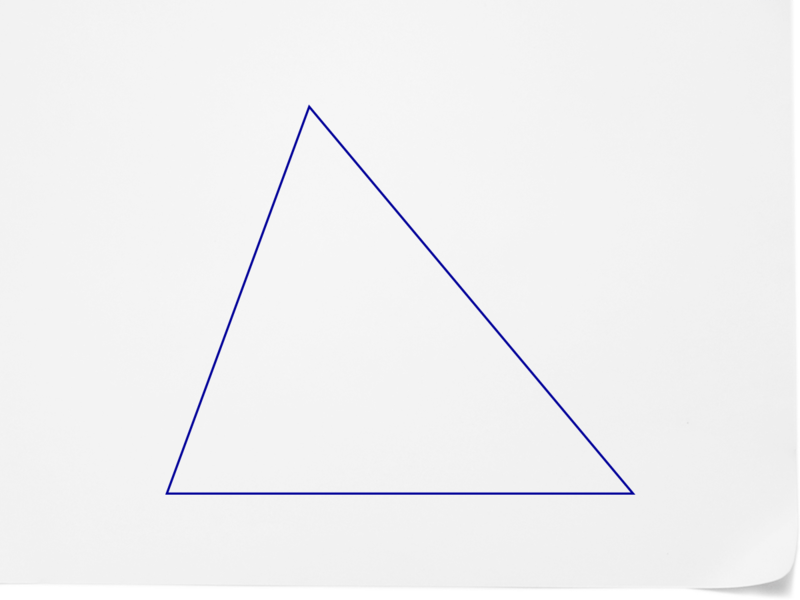

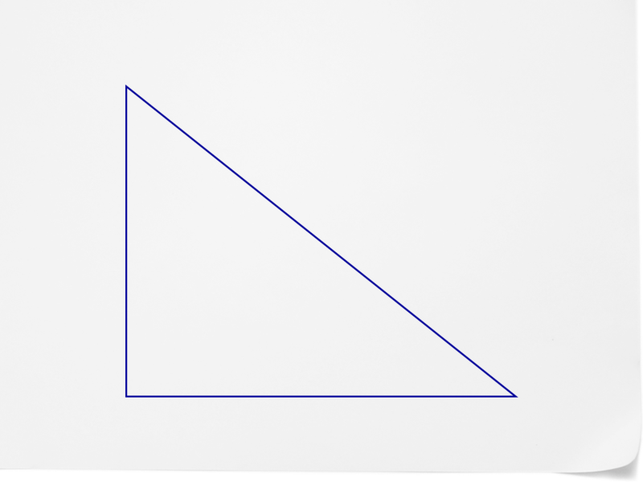

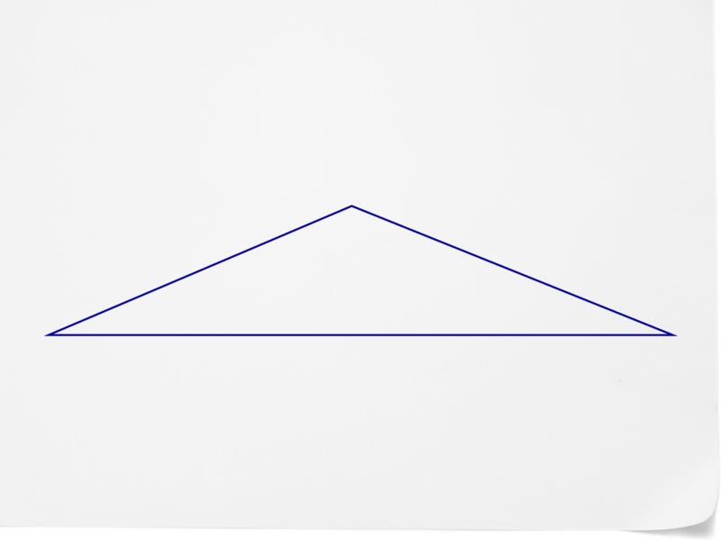

Example

_Identify whether each of the following triangles is acute, obtuse or right._

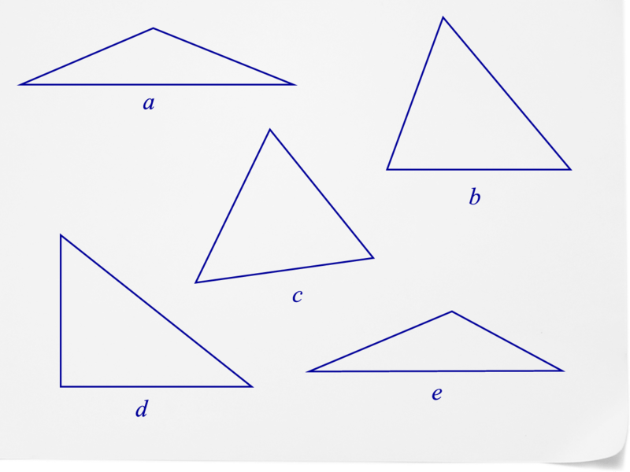

With the first triangle, triangle $a$, we can see that one of the angles is greater than 90 degrees. This is an obtuse triangle.

The second triangle has three angles that are less than 90 degrees, this is an acute triangle.

The third triangle also has three angles that are less than 90 degrees. This is also an acute triangle.

The fourth triangle has a right angle. You can see that because it forms a nice neat corner so perfectly. This is a right triangle.

The fifth triangle has an angle greater than 90 degrees. This is an obtuse triangle.

**We can also classify or identify triangles by the length of their sides. This means that we look at the line segments that create the triangle.**

**_Equilateral Triangle_** **is a triangle with all three sides equal.**

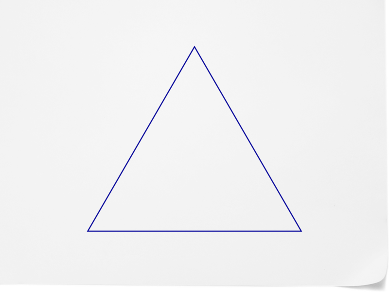

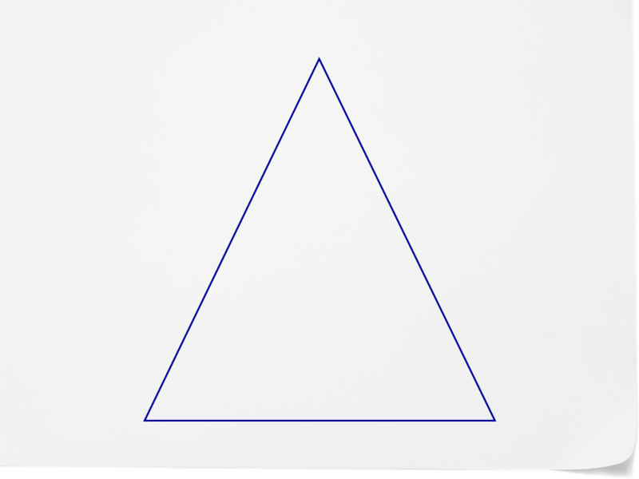

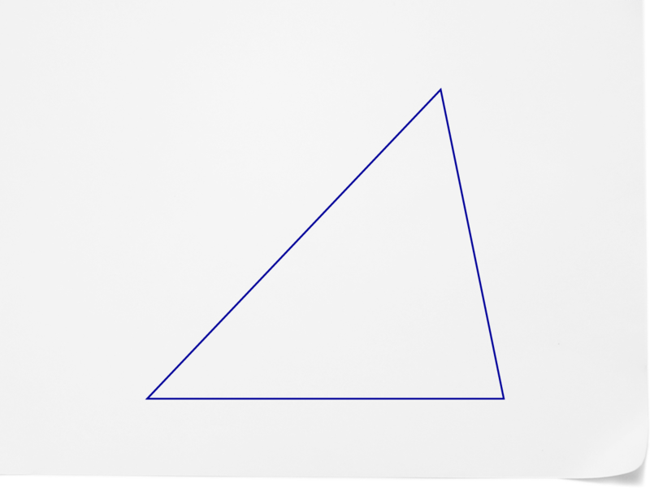

Example

_Classify each triangle as equilateral, isosceles, or scalene._

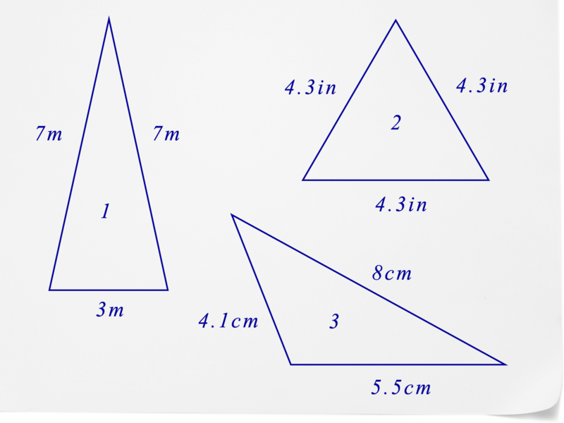

In the first triangle, two sides are 7 meters long, but the third side is shorter. Which kind of triangle has two congruent sides? **This is an isosceles triangle.**

Now let’s look at the second triangle. All three sides are the same length, so this must be an **equilateral triangle.**

The last triangle has sides of 5.5 cm, 4.1 cm, and 8 cm. None of the sides are congruent, so this is a **scalene triangle.**

**Sometimes, we can classify a triangle by both its sides and its angles.**

Example

_Identify each triangle by both its sides and angles._

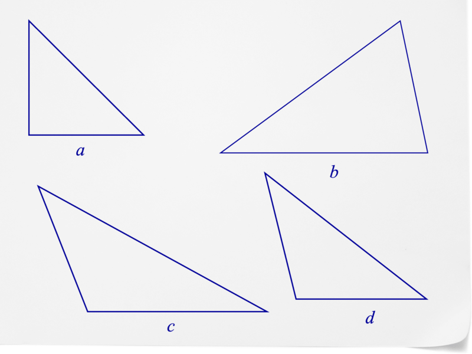

**The second triangle is an acute scalene triangle. All three sides are different lengths and all three angle measures are acute.**

**The third triangle is an obtuse scalene triangle. It has one obtuse angle and three different side lengths.**

**The last triangle is an obtuse isosceles. It has one obtuse angle and two side lengths that are the same.**

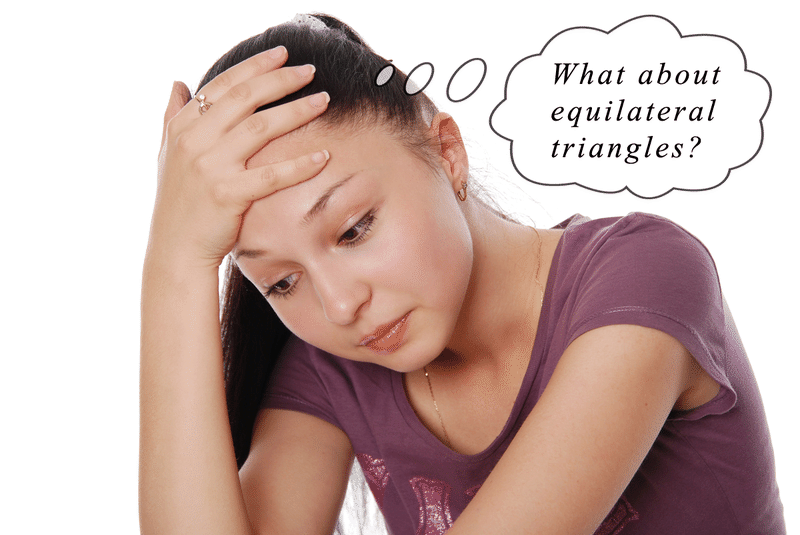

There is one more thing to know about classifying triangles by their angles and sides. We can also tell whether a triangle is isosceles, scalene, or equilateral by its angles. Every angle is related to the side opposite it. Imagine a book opening. The wider you open it, the greater the distance between the two flaps. In other words, the wider an angle, the longer the side opposite it is. Therefore we can say that if a triangle has two congruent angles, it must have two congruent sides, and thus it must be isosceles. If it has three angles of different measures, then its sides are also all of different lengths, so it is scalene. Finally, an equilateral triangle, as we have seen, always has angles of $60^{\circ}$, and these angles are opposite congruent sides.

**_Notice that the word “congruent” means exactly the same._**

II. **Confirm that the Sum of any Angles of a Triangle is $\underline{180^{\circ}}$**

If you look at all of the angles in a triangle, you will notice something consistent about each one of them. If we add up the number of degrees in each angle of a triangle, you will see that the sum of the angle measures is equal to $180^{\circ}$.

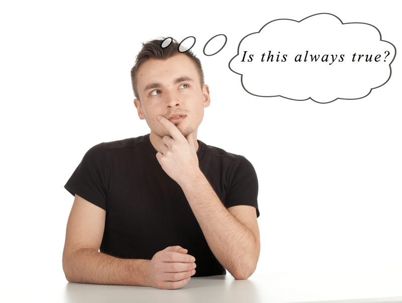

**We can start by looking at an equilateral triangle. The three angles of an equilateral triangle are all equal. We know from the last section, that each of these angles is 60 degrees. Here is an example of an equilateral triangle.**

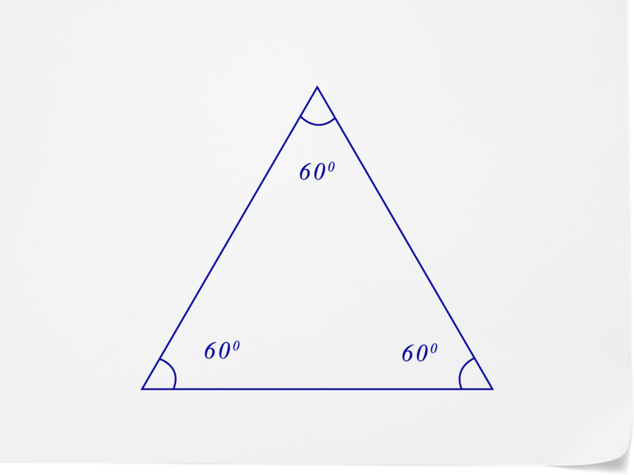

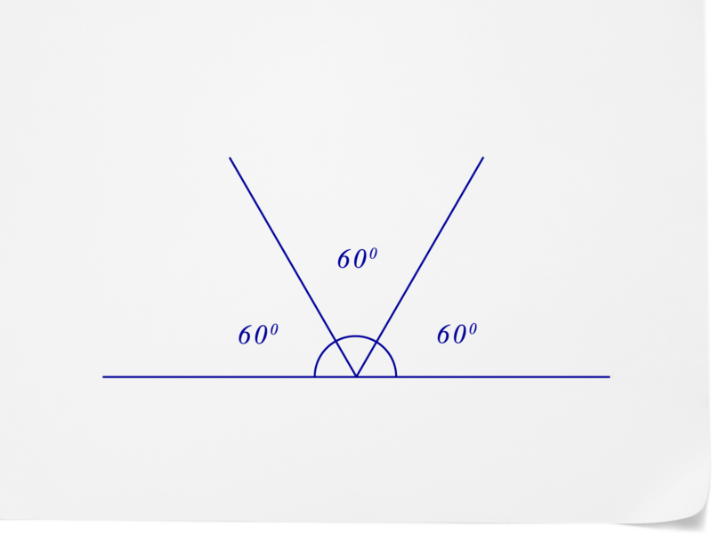

III. **Describe and Analyze Triangles and Associated Angle Measures Using Known Information, Variable Expressions and Triangles Formed by Two Lines Intersecting Parallel Lines**

Now that we have looked at how to identify triangles by angle measures and side lengths, we can look at how we can work with missing angle measures. We identify missing angle measures using what we know about triangles and by writing variable expressions. Let’s take a look at how we can problem solve in an example.

Example

_What is the missing angle measure of this triangle?_

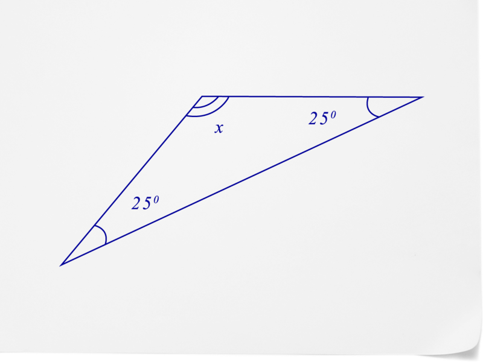

**Next, we can write an expression to help us to figure out the missing measure.**

$$
25+25+x
$$

**Now, we can write this expression into an equation with a sum of 180 degrees. Then we can solve it for the value of $x$.**

$$
\begin{align*}
25+25+x &= 180\\
50+x &= 180\\
x &= 180-50\\
x &= 130^{\circ}
\end{align*}
$$

**The measure of the missing angle is $130^{\circ}$.**

Now let’s look at another example.

Example

_What is the measure of the two missing angles if this is an isosceles triangle?_

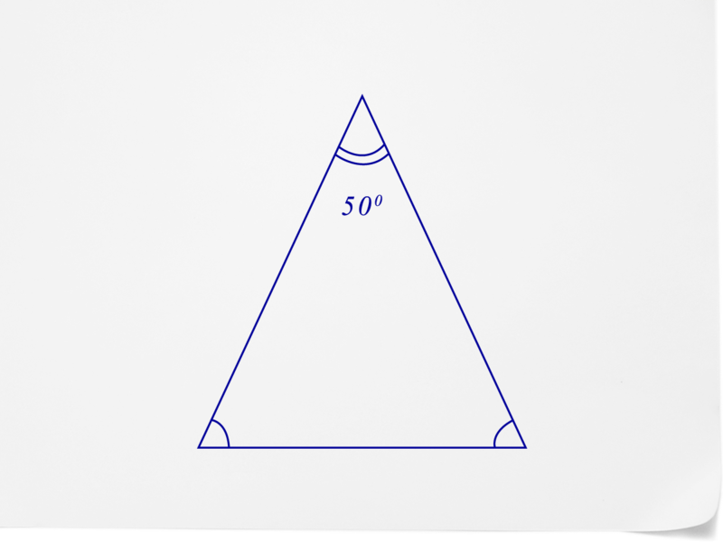

$$
x+x+50
$$

**We can expand this expression to an equation that is equal to 180 degrees.**

$$
x+x+50=180
$$

**Next, we combine the like terms before solving this.**

$$
\begin{align*}
2x+50 &= 180\\
2x &= 130\\
x &= 65^{\circ}
\end{align*}
$$

**Each of the base angles is equal to $65^{\circ}$.**

Sometimes, we will have triangles that are created by intersecting lines. When this happens, we can use the information that we know about intersecting lines to figure out the missing angle measures. Let’s look at an example.

Example

_Find the value of the missing angles $x$ and $y$_

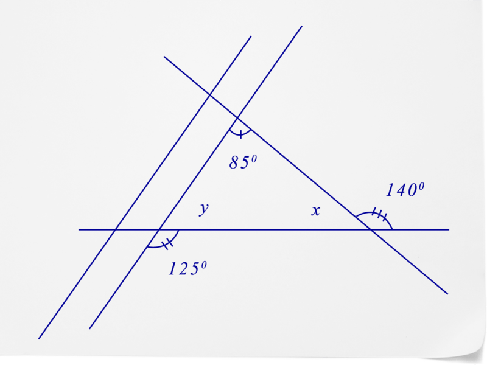

**Let’s start by looking at angle $x$.**

**You can see that angle $x$ is an acute angle. It is also an adjacent angle with the 140 degree angle already labeled. We know that the sum of adjacent angles is $180^{\circ}$. Now we can write an equation and solve for the missing angle measure.**

$$
\begin{align*}
140 + x &= 180\\
x &= 40^{\circ}
\end{align*}
$$

**There are two ways to find the measure of angle $y$. One is to use the sum of the angle measures given that we know the measure of $x$. Let’s do that one first.**

$$
\begin{align*}
y+40+85 &= 180\\
y+125 &= 180\\
y &= 55^{\circ}
\end{align*}
$$

**The second way is to use vertical angles. You can see that the angle $125^{\circ}$ is labeled. This means that the angle vertical to this labeled angle is also $125^{\circ}$. The angle $y$ forms a straight line with that angle and therefore is $55^{\circ}$.**

**See if you can figure out one more way to solve for this missing angle.**

IV. **Describe and Classify Triangles Found in Real – World Objects and Architecture**

There are many triangles out there in the real – world. One of the big places that you will see triangles is in bridge construction. Look at this picture of a truss bridge.

We can also see triangles in roof design. Take a look at this picture.

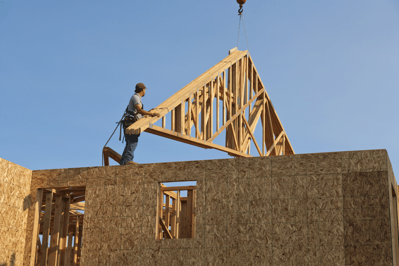

**Look around your home and neighborhood-where are some other places where triangles are very useful? Make a short list of five other places where you can find triangles.**

Real-Life Example Completed
---------------------------

**_Tipi Decoration_**

**Here is the original problem once again. Reread it and then answer the questions for the solution.**

Jaime has been working hard on her tipi. She has decided to use the following pattern as part of the design on the material. She thinks that if she uses cloth triangles, that she can sew them onto the cloth of the tipi to make a pattern. This red, black, red pattern is going to stretch along the outside bottom edge of the tipi.

“That is very cool,” her sister Lily said admiring Jaime’s sketch.

“I think so too. It should look very pretty on the brown material,” Jaime added.

“Yes. How do you know that the triangles will be the exact same size?”

“That’s easy. I can measure the top angle of the triangle using a protractor and then create each one by tracing. This one will have an angle of $120^{\circ}$ when I am done,” Jaime explained to Lily.

“What kind of triangle is that?” Lily asked.

**_Solution to Real – Life Example_**

**Here are the questions from the introduction. What type of triangle is in the pattern? Can you justify your answer?**

The triangle in the pattern is an obtuse triangle. It is an obtuse triangle because it has an angle that is greater than $90^{\circ}$. The other two angles are less than $90^{\circ}$. Because the largest angle is $120^{\circ}$, it is an obtuse triangle.

Vocabulary
----------

Here are the vocabulary words that are found in this lesson.

__Acute Triangle__

A triangle where all three angles are less than $90^{\circ}$.

__Right Triangle__

A triangle with one $90^{\circ}$ angle and two acute angles.

__Obtuse Triangle__

a triangle with one angle that is greater than $90^{\circ}$.

__Equilateral Triangle__

all three side lengths and all three angles are congruent.

__Isosceles Triangle__

two side lengths are the same.

__Scalene Triangle__

all three side lengths are different

__Congruent__

means exactly the same, having the same measure.

Time to Practice
----------------

Directions: Classify each triangle by the describe angle measures as acute, obtuse or right.

1.  A triangle with three $60^{\circ}$ angles.
2.  A triangle with one $110^{\circ}$ angle.
3.  A triangle with one right angle and two acute angles.
4.  A triangle with one $130^{\circ}$ angle.
5.  A triangle with three acute angles.
6.  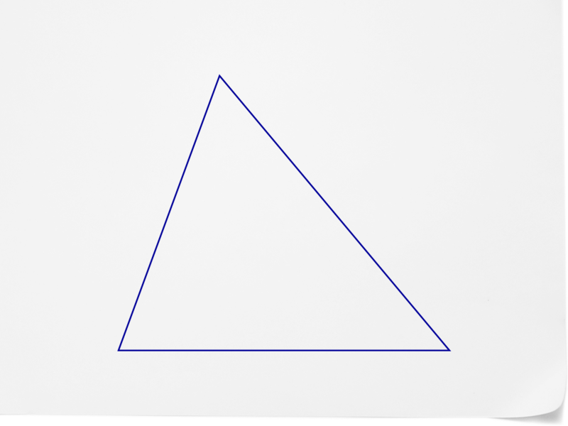
    
    \[Figure 21\]
    
7.  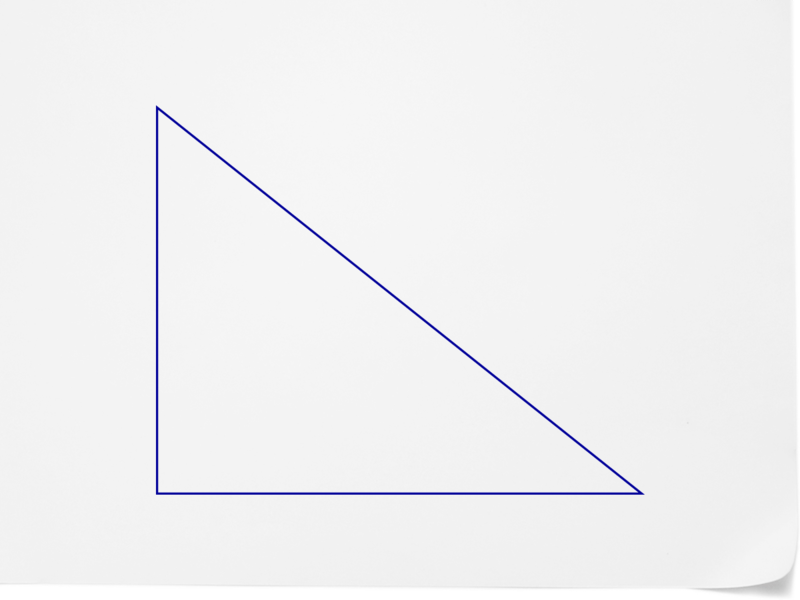
    
    \[Figure 22\]
    
8.  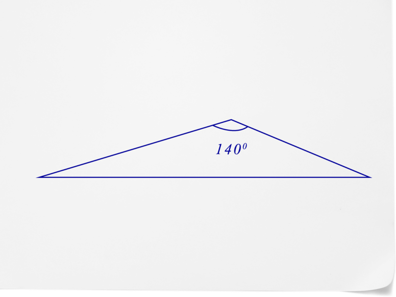
    
    \[Figure 23\]
    

Directions: Identify each triangle by the side lengths described. Identify them as equilateral, isosceles or scalene.

9.  A triangle with side lengths of 6 in, 6 in and 4 inches.
10. A triangle with side lengths of 3 ft, 4 ft, and 5 ft.
11. A triangle with side lengths of 8 inches.
12. A triangle with side lengths of 7 inches, 8 inches and 8 inches.
13. A triangle with side lengths of 6 meters, 8 meters and 10 meters.
14. A triangle with side lengths of 10 mm.

Directions: Using what you have learned about the interior angles of a triangle, determine the missing angle in each triangle.

15. $45^{\circ}, 45^{\circ}, ?$
16. $60^{\circ}, 60^{\circ}, ?$
17. $90^{\circ}, 50^{\circ}, ?$
18. $100^{\circ}, 40^{\circ}, ?$
19. $110^{\circ}, 30^{\circ}, ?$
20. $50^{\circ}, 10^{\circ}, ?$

Directions: Identify three triangles in the room around you.

21. ­
22. ­
23. ­

</article>

### 6.3 Quadrilaterals and Angles

<article>

Introduction
------------

**_Figuring out a Yurt_**

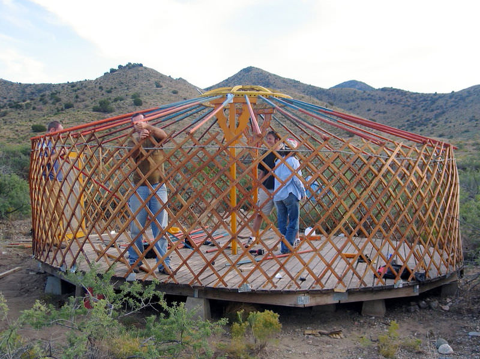

“What do you see?” Lynne asked leaning over her desk to look at the book that Marcus was holding.

Lynne and Marcus are both students in Mrs. Patterson’s World Cultures class. Like Jaime, they are also working on projects. Marcus has discovered a yurt. A yurt is a type of home common in Mongolia. There is a lattice structure that is build and then a canvas is used to cover the frame.

“That is cool, what is it?” Lynne asked.

“It’s called a yurt. I think that this is what I am going to do my project on,” Marcus said studying the picture.

Marcus took out a piece of paper and a pencil and he began to draw the lattice of the yurt.

**As Marcus draws his design, take a look at the lattice and hunt for the quadrilaterals that are used in the design. In this lesson you will learn all about different types of quadrilaterals so that by the end of the lesson, you will be able to identify the ones that Marcus will need to use.**

**_What You Will Learn_**

In this lesson, you will learn how to do the following skills.

* Classify quadrilaterals (trapezoid, parallelogram, rhombus, rectangle and square)
* Confirm that the sum of the angle measures of any quadrilateral is $360^\circ$, using two triangles formed by the diagonal of the quadrilateral.
* Describe and analyze quadrilaterals and associated angle measures using known classifications and sufficient given info, using variable expressions.
* Describe and classify quadrilaterals found in real-world objects and architecture.

**_Teaching Time_**

I. **Classify Quadrilaterals (Trapezoid, Parallelogram, Rhombus, Rectangle and Square)**

In the last lesson, we learned all about triangles. You learned how to identify different types of triangles and how to problem solve angle measures. In this lesson, we are going to work with **_quadrilaterals_**.

**What is a quadrilateral?**

**A** **_quadrilateral_** **is any four-sided figure.** In the word “quadrilateral”, we find the word “quad” which means four. This means that any four-sided figure is considered a quadrilateral. Now, there are different types of quadrilaterals that we are going to learn about in this lesson.

**We can say that a quadrilateral is any four-sided figure. We could consider this an umbrella category meaning that there are different types of quadrilaterals that we can identify in a specific way even though they are still quadrilaterals too.** Let’s look at identify the types of quadrilaterals.

**The first type of quadrilateral to learn about is called a parallelogram. A** **_parallelogram_** **is a quadrilateral with opposite sides parallel and congruent.** Here is a picture of a parallelogram.

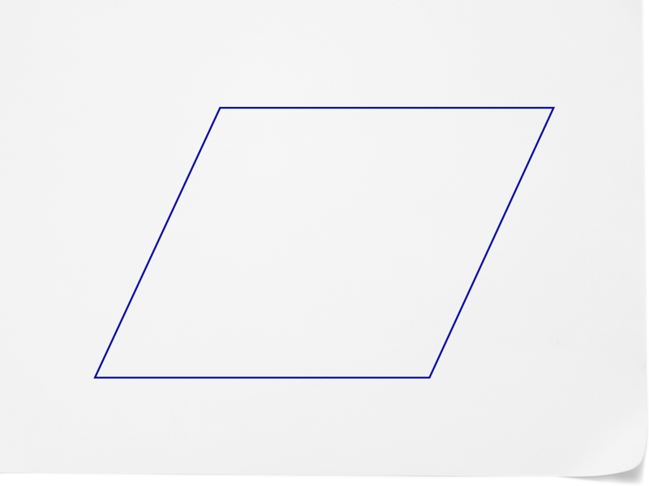

**There are three main kinds of parallelograms.** Parallelograms can be plain old parallelograms like the one in the picture. They can also be rectangles, squares and rhombi.

**A** **_rectangle_** **is a parallelogram with four right angles, where opposite sides are congruent and parallel.** You have been looking at rectangles for a long time, but now you need to notice that there are specific properties that make a rectangle a rectangle.

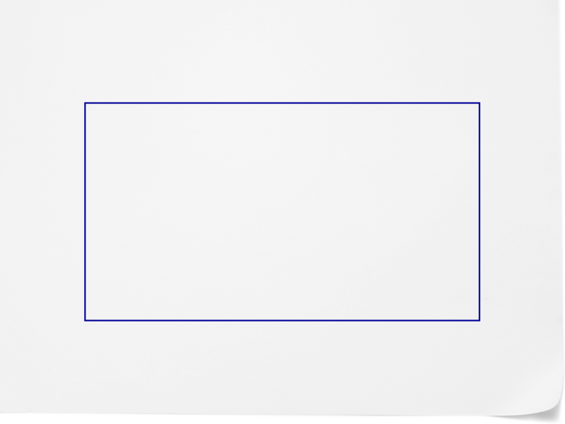

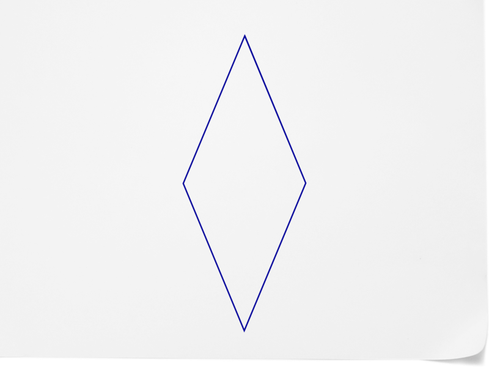

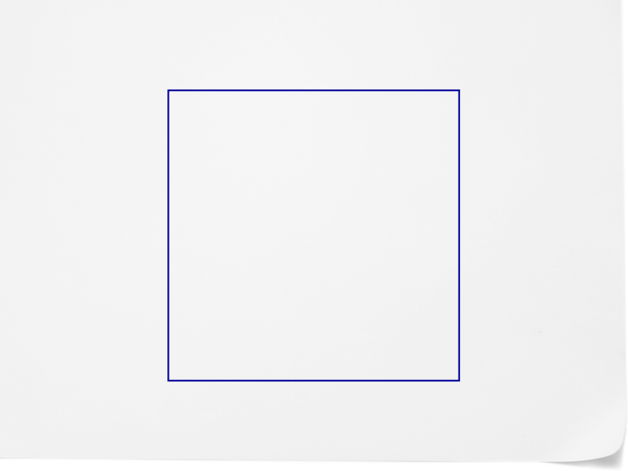

")

\[Figure 7\]

**_Write these definitions and draw a picture of each figure in your notebook._**

The best way to remember the different types of quadrilaterals is to spend a little time studying the definitions. Then you will be able to identify them and answer questions about the different types with ease.

II. **Confirm that the Sum of the Angle Measures of any Quadrilateral is $\underline{360^\circ,}$ using Two Triangles Formed by the Diagonal of the Quadrilateral**

In the last lesson on triangles, you discovered that the sum of the angles of any triangles will always add up to be $180^\circ$. We can find a similar rule with quadrilaterals. Take a look.

**One important thing to remember about quadrilaterals is that their four angles always have a sum of $360^\circ$. This is true no matter what shape or size the quadrilateral is.**

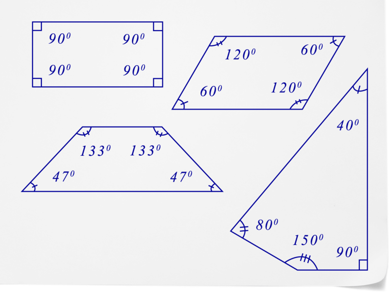

$. When we add these together, we get a sum of $360^\circ$: $60^\circ + 120^\circ + 60 + 120^\circ = 360^\circ$. This will be true no matter what size each angle in the quadrilateral measures.")

III. **Describe and Analyze Quadrilaterals and Associated Angle Measures Using Known Classifications and Sufficient Given Information, using Variable Expressions**

We can use what we know about quadrilaterals to analyze them. When we analyze quadrilaterals, we can find the measure of an unknown angle or side. Remember, one of the most important things to know about quadrilaterals is that their angles always add up to $360^\circ$. That means that if we know the measure of any three angles, we can set up an equation to solve for the measure of the fourth. Let’s see how this works.

Example

_Find the measure of the unknown angle in the quadrilateral below._

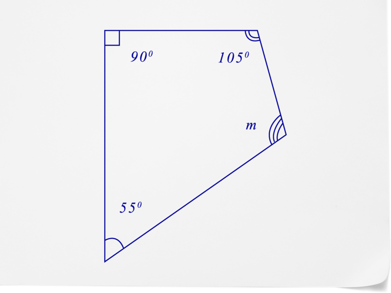

$$
\begin{align*}
55+90+105+m &= 360\\
250+m &= 360\\
m &= 360-250\\
m &= 110^\circ
\end{align*}
$$

**By solving for $m$, we have found that the fourth angle has a measure of $110^\circ$.**

**We can check our work by adding the four angles to see if they total $360^\circ$.**

$55^\circ + 90^\circ + 105^\circ + 110^\circ = 360^\circ$

**Our calculation was correct. We can always use this method when given three out of the four angles in a quadrilateral.**

Example

_Find the measures of the unknown angles in the quadrilateral below._

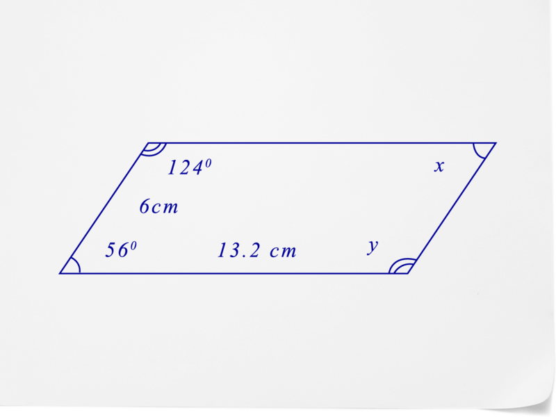

**Now, what do we know about the angles of parallelograms? Not only do they add up to $360^\circ$, they fall into two congruent pairs.** The congruent angles are opposite each other. Take a look back at the figure.

**Angle $x$ is opposite the $56^\circ$ angle. Therefore it must also be $56^\circ$. Angle $y$ is opposite the $124^\circ$ angle, so it must also be $124^\circ$. This gives us two pairs of congruent angles.**

**Let’s check to make sure these are the correct measurements by adding them to see if they total $360^\circ$.**

$124^\circ + 124^\circ + 56^\circ + 56^\circ = 360^\circ$

**They do, so our answers are correct.**

Often we can use what we know about the properties of quadrilaterals to find unknown measures without having to set up an equation. We can simply use reasoning to put the pieces together.

IV. **Describe and Classify Quadrilaterals Found in Real – World Objects and Architecture**

We can use these methods to analyze and classify any quadrilateral, including quadrilaterals we see around us every day. Let’s take a look at a few examples.

Example

_Name the quadrilateral pictured below._

Example

_Name the quadrilateral pictured below._

**Now let’s go back to the problem from the introduction.**

Real-Life Example Completed
---------------------------

**_Figuring out a Yurt_**

**Here is the original problem once again. Reread it and then identify the types of quadrilaterals used in the lattice design. Explain how you have identified each quadrilateral. There are two parts to your answer.**

“This is very cool!” Marcus exclaimed when looking through a book on different types of houses.

“What do you see?” Lynne asked leaning over her desk to look at the book that Marcus was holding.

Lynne and Marcus are both students in Mrs. Patterson’s World Cultures class. Like Jaime, they are also working on projects. Marcus has discovered a yurt. A yurt is a type of home common in Mongolia. There is a lattice structure that is build and then a canvas is used to cover the frame.

“That is cool, what is it?” Lynne asked.

“It’s called a yurt. I think that this is what I am going to do my project on,” Marcus said studying the picture.

Marcus took out a piece of paper and a pencil and he began to draw the lattice of the yurt.

**_Solution to Real – Life Example_**

**Now look at the picture of the yurt once again.**

**This is the answer.**

Vocabulary
----------

Here are the vocabulary words that are found in this lesson.

__Quadrilateral__

any four-sided figure.

__Trapezoid__

a quadrilateral with one pair of parallel sides.

__Parallelogram__

a quadrilateral with two pairs of opposite sides that are congruent and parallel.

__Rhombus__

a parallelogram with four congruent sides.

__Rectangle__

a parallelogram with opposites congruent and four right angles.

__Square__

a parallelogram with four congruent sides and four right angles.

__Congruent__

means exactly the same.

Time to Practice
----------------

Directions: Identify each quadrilateral based on the description provided.

1.  A figure with four equal sides and four right angles.
2.  A figure with opposite sides congruent and parallel.
3.  A figure with opposite sides congruent and parallel and four right angles.
4.  A figure with four sides.
5.  A figure with four equal sides which may or may not have four right angles.

Directions: Use what you have learned about quadrilaterals to answer each of the following questions true or false.

6.  A quadrilateral can be any four sided figure.
7.  A rectangle is also a parallelogram, but a parallelogram is not necessarily a rectangle.
8.  A square is never a parallelogram.
9.  A rhombus can be a square.
10. A square is always a rhombus.
11. A rhombus is a parallelogram.
12. A quadrilateral is a type of parallelogram.
13. A trapezoid has opposite sides parallel and congruent.
14. What does the sum of the angles of a quadrilateral add up to be?
15. What are all four angle measures of a rectangle?
16. What are all four angle measures of a square?

Directions: Use what you have learned about quadrilaterals to figure out the missing angle measure of each quadrilateral based on three given angles.

17. $120^\circ, 120^\circ, 60^\circ,?$
18. $50^\circ, 70^\circ, 130^\circ,?$
19. $52^\circ, 128^\circ, 52^\circ,?$
20. $47^\circ, 55^\circ, 120^\circ,?$

</article>

### 6.4 Polygons and Angles

<article>

Introduction
------------

**_The Geodesic Dome_**

“What do you mean?” Kelsey inquired.

“A dome made of triangles. How’s that for an idea!” Dylan said grinning from ear to ear.

“It’s great,” Kelsey agreed, “But it already exists. It is called a “geodesic dome”.”

Dylan looked at Kelsey as she pulled open a book and showed Dylan the exact page where there was information written on the geodesic dome. He shrugged his shoulders.

“Well, I am going to do it anyway,” he said.

Dylan began to explore the geodesic dome. He figured out that the average dome has isosceles triangles in it. These triangles, like all triangles, have a sum of $180^\circ$ for angle measures. Dylan wants to construct a geodesic dome.

As he begins to draw his design, he figures out that he will need a variety of hexagons and pentagons. Dylan is stuck. He can’t figure out how many degrees there will be in each hexagon and how many degrees there will be in each pentagon.

**This is where you come in. Pay attention to this lesson on polygons and angles. By the end of the lesson, you will be able to help Dylan with his geodesic dome.**

**_What You Will Learn_**

In this lesson you will learn how to complete the following skills.

* Distinguish among polygons, regular polygons and closed figures that are not polygons, and classify polygons by the number of sides.
* Create or complete a table showing number of sides, diagonals, triangles formed, and sum of angle measures for polygons through decagon.
* Derive and apply the formula for angle measures of regular polygons.
* Describe and classify polygons in real-world objects and architecture.

**_Teaching Time_**

I. **Distinguish among Polygons, Regular Polygons and Closed Figures that are not Polygons and Classify Polygons by the Number of Sides**

In this lesson we will examine polygons. **_Polygons_** **are two-dimensional figures that have three or more sides. Any figure with straight edges, such as a triangle or rectangle, is a polygon.** If a figure has any curved sides or is open, it is not a polygon.

Here is an example of a figure that is not a polygon.

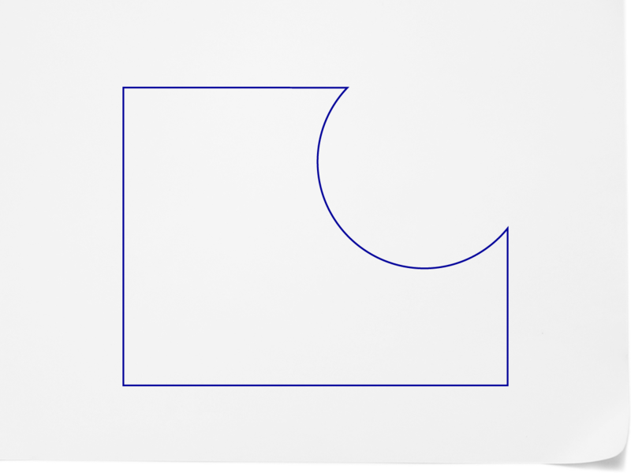

Now that we can distinguish polygons from other figures, let’s take a closer look at them. In general, there are two kinds of polygons: regular polygons and irregular polygons.

**_Regular polygons_** **have sides and angles that are all congruent.** It doesn’t matter how many sides and angles they have. As long as the sides are congruent and the angles are congruent, the figure is a regular polygon.

**_Irregular polygons_****, you may have guessed, are polygons that do** **_not_** **have congruent sides and angles.** They are still polygons because they have straight, closed sides. Their sides are simply different lengths.

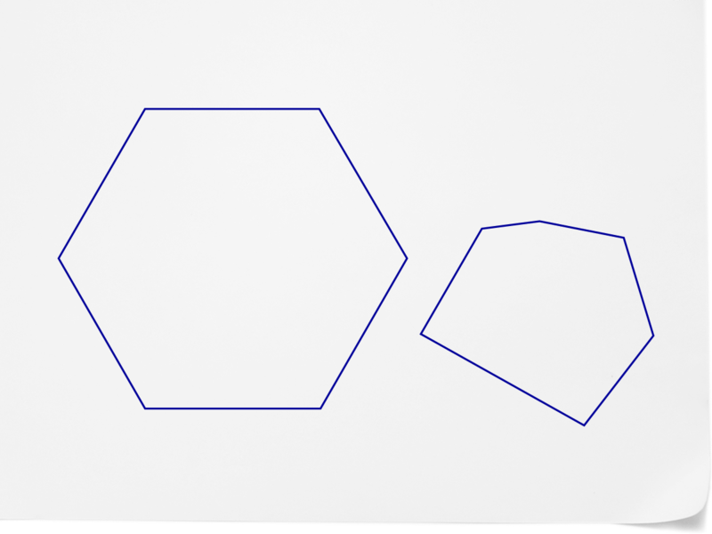

This last example is a good example of a type of polygon. While we can have different triangles and different quadrilaterals, we can also have different types of polygons besides regular and irregular. We can further identify polygons according to the number of sides that they have. The hexagon (6 sides) is an example of one of these types of polygons. Other examples include: triangles, pentagons, octagons and decagons. Let’s look at the different types of polygons in more detail.

II. **Create or Complete a Table Showing Number of Sides, Diagonals, Triangles Formed, and Sum of Angle Measures for Polygons through Decagon**

As we just talked about in the last section, we can distinguish between different types of polygons according to the number of sides that each has. This is how we can name the polygon. We can also look at different characteristics of each type of polygon. We can look at the number of sides, the number of diagonals that can be drawn in a figure, the number of triangles in the polygon and the sum of the angle measures.

The easiest way to approach this is through the use of a table. Let’s begin with naming polygons, looking at images of polygons, examining the number of angles and sides and the sum of the interior (inside) angles.

| **Polygon Name** | **Polygon** | **Number of Angles and Sides** | **Sum of Interior Angles** |
| --- | --- | --- | --- |
| triangle | 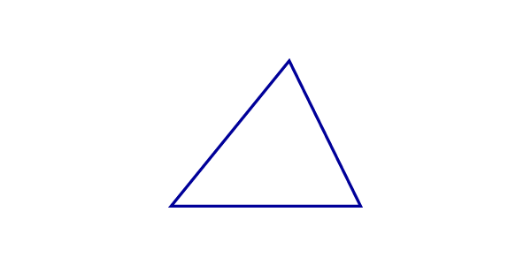  \[Figure 4. | 3   | $180^\circ$ |
| rectangle/square | 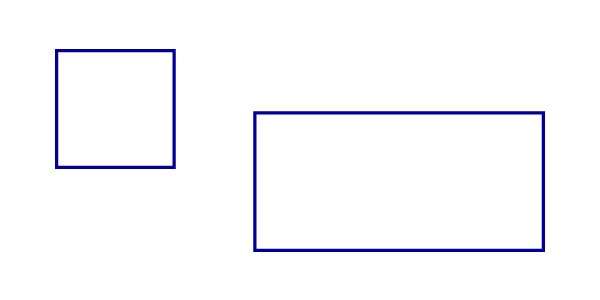  \[Figure 5. | 4   | $360^\circ$ |
| pentagon | 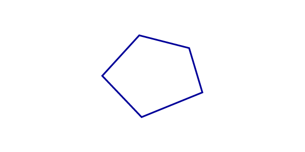  \[Figure 6. | 5   | $540^\circ$ |
| hexagon | 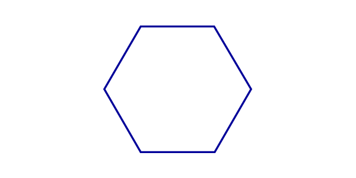  \[Figure 7. | 6   | $720^\circ$ |
| heptagon | 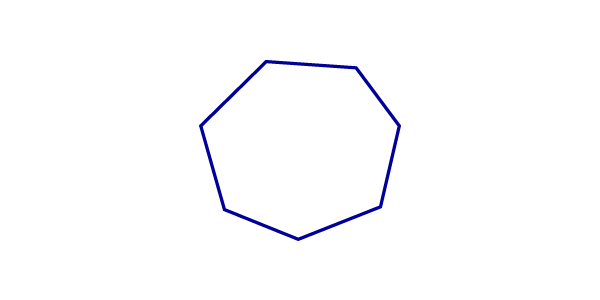  \[Figure 8. | 7   | $900^\circ$ |
| octagon | 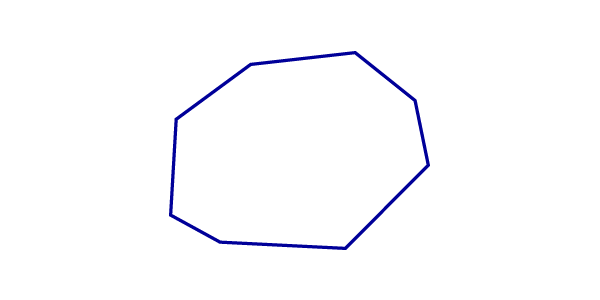  \[Figure 9. | 8   | $1,080^\circ$ |
| nonagon | 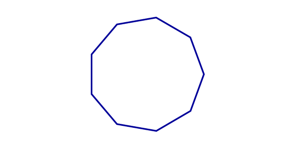  \[Figure 10. | 9   | $1,260^\circ$ |
| decagon | 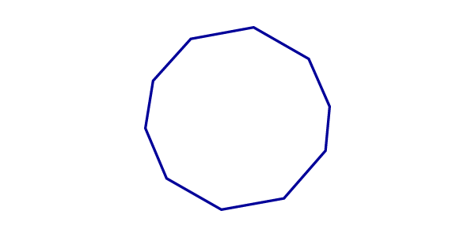  \[Figure 11. | 10  | $1,440^\circ$ |

You can see that polygons have similar names. **In the word** **_polygon, poly_****\-means “many” and-****_gon_** **means “angle.” So** **_polygon_** **means “having many angles.”** Now look at the name for the shape that has eight angles and sides. It is called an _octagon_. In _octagon_, _oct_\-means “eight.” An octopus, for example, has eight arms. In _pentagon_, _pent_\-means “five,” so this is a shape with five angles and sides.

**One thing to notice about these polygons is that they can all be divided by diagonals. We can figure out how many diagonals there are and by doing this divide them up into triangles. We know that the sum of the angle measures of a triangle is $180^\circ$, and we can use this information to figure out the sum of the angle measures of the different polygons. Look at this example.**

Example

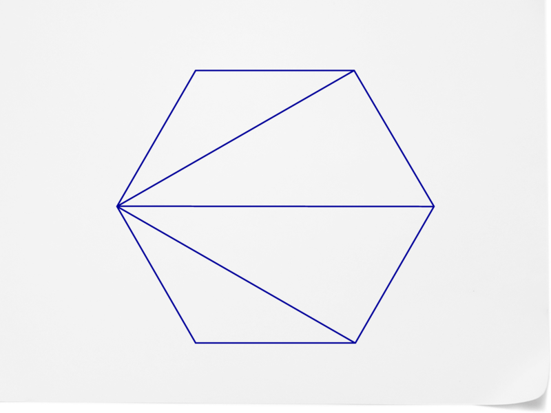

$180 \times 4 = 720^\circ$

**This is the answer and you can see how this corresponds to the number of degrees in the chart.**

**We can apply this information to any of the polygons. Simply divide the polygon into triangles and multiply the number of triangles by 180.**

III. **Derive and Apply the Formula for Angle Measures of Regular Polygons**

In the last section, we used diagonals and triangles to figure out the sum of the interior angles of a polygon. **We can also use a formula to find the sum of a polygon’s interior angles.** Knowing the total is helpful because we often can use it to find the measure of a particular angle in the polygon. Remember, in a regular polygon, all of the angles are congruent. We can find the angle of all of them if we know the total and how many angles there are.

**As we have seen, we can find the total number of degrees in a polygon by using triangles. The formula sums this up nicely and gives us a shortcut:**

$(n - 2) \times 180^\circ$

The letter $n$ represents the number of angles (or sides) in the polygon. In other words, we subtract 2 from the number of angles and then multiply by 180. Think about the different polygons, the number of triangles in a polygon is always 2 less than the number of sides. The formula is simply giving us a shortcut to find the number of triangles in the polygon. Then, as we know, we multiply by $180^\circ$.

We can use the formula to find the sum of the angles in any polygon. Let’s practice.

Example

_Find the sum of the angles a hexagon._

**First, count the number of angles or sides. This polygon has six sides and six angles. We will put 6 in for $n$ in the formula and solve.**

$$
\begin{align*}
(n - 2) &\times 180^\circ\\
(6 - 2) &\times 180^\circ\\
4 \times 180^\circ &= 720^\circ
\end{align*}
$$

**The formula tells us that a hexagon contains 4 triangles. When we multiply by $180^\circ$, we find that the sum of the interior angles in a hexagon is $720^\circ$. This is true for any hexagon, regular or irregular.**

**What if the hexagon were a regular hexagon?** Then its six angles would have to be congruent. If we know the sum of the angle measures, then we can find the measure of each if we divide the total by 6:

$720^\circ \div 6 = 120^\circ$

Every angle in a regular hexagon, no matter how long its sides are, will always be $120^\circ$.

**This is true for any regular polygon. We can always divide the total number of degrees by the number of angles to find the measure of each angle. This is a way of working backwards. We start with the number of degrees and then divide by the number of sides to figure out each angle measure.**

Let’s look at an example.

Example

_What is the measure of each angle in a regular octagon?_

**If it is a regular octagon, all of the angles are congruent. We need to find the total number of degrees in an octagon and then divide by 8, because an octagon has 8 angles. Let’s use the formula to find the total of the angles.**

$$
\begin{align*}
&(n - 2) \times 180^\circ\\
&(8 - 2) \times 180^\circ\\
&6 \times 180^\circ\\
&1,080^\circ
\end{align*}
$$

The 8 angles in an octagon must have a sum of $1,080^\circ$. Check your table to be sure. Now that we know the total, we divide by 8 to find the measure of each angle.

$1,080^\circ \div 8 = 135^\circ$

**Each angle in a regular octagon, no matter how big or small, always measures $135^\circ$.**

Great job! We can use this method to find the measure of the angles in any regular polygon.

IV. **Describe and Classify Polygons in Real – World Objects and Architecture**

We can use what we know about the properties of polygons to analyze and classify them in the real world. We still count the number of sides and angles to classify the polygon.

Example

Example

**Now that you have become more familiar with the different types of polygons, you will see them everywhere in the world around you!**

Real-Life Example Completed
---------------------------

**_The Geodesic Dome_**

**Here is the original problem once again. Reread it and then use what you have learned from this lesson to write the sum of the angles measures in hexagon and in a pentagon. Remember, there are two parts to your answer.**

“I am going to design a house that no one has ever even thought of before,” Dylan said during Mrs. Patterson’s class on Tuesday.

“What do you mean?” Kelsey inquired.

“A dome made of triangles. How’s that for an idea!” Dylan said grinning from ear to ear.

“It’s great,” Kelsey agreed, “But it already exists. It is called a “geodesic dome”.”

Dylan looked at Kelsey as she pulled open a book and showed Dylan the exact page where there was information written on the geodesic dome. He shrugged his shoulders.

“Well, I am going to do it anyway,” he said.

Dylan began to explore the geodesic dome. He figured out that the average dome has isosceles triangles in it. These triangles, like all triangles, have a sum of $180^\circ$ for angle measures. Dylan wants to construct a geodesic dome.

As he begins to draw his design, he figures out that he will need a variety of hexagons and pentagons. Dylan is stuck. He can’t figure out how many degrees there will be in each hexagon and how many degrees there will be in each pentagon.

**_Solution to Real – Life Example_**

**Now let’s break down the solution to the problem. Let’s start with hexagons.**

We know that there are six triangles in a hexagon. We know that the sum of the angle measures of a triangle is $180^\circ$. However, we have to take the number of sides into consideration. We can use the following formula to help us. The letter $n$ represents the number of sides.

$$
\begin{align*}
(n - 2) &\times 180\\
(6 - 2) &\times 180 = 720^\circ
\end{align*}
$$

**Now let’s look at the pentagon.** The pentagon is comprised of 5 triangles. We know that the sum of the angle measures of each triangle is $180^\circ$. We can use the same formula as we did with the hexagon.

$$
\begin{align*}
(n - 2) &\times 180\\
(5 - 2) &\times 180 = 540^\circ
\end{align*}
$$

Vocabulary
----------

Here are the vocabulary words found in this lesson. In addition to these words, you need to familiarize yourself with the different types of polygons by knowing the number of sides and angles in each.

__Polygon__

a simple closed figure made up of line segments.

__Regular Polygon__

a polygon with all sides congruent and all angles congruent.

__Irregular Polygon__

a polygon where all sides are not congruent, but all angle measures are congruent.

Time to Practice
----------------

Directions: Answer true or false to each question about regular and irregular polygons.

1.  The angles of a regular polygon are all the same size.
2.  A regular hexagon has six sides that are different lengths.
3.  An irregular pentagon has sides that are the same length.
4.  An irregular polygon is one that has one side open.
5.  A regular triangle could also be called an equilateral triangle.
6.  The side lengths of a regular octagon are all the same length.

Directions: Identify each figure as regular or irregular. Then identify the type of polygon that it is too.

7.  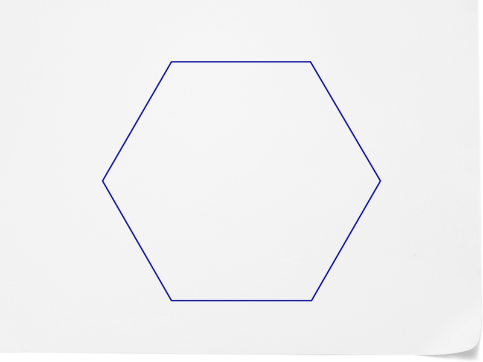
    
    \[Figure 17\]
    
8.  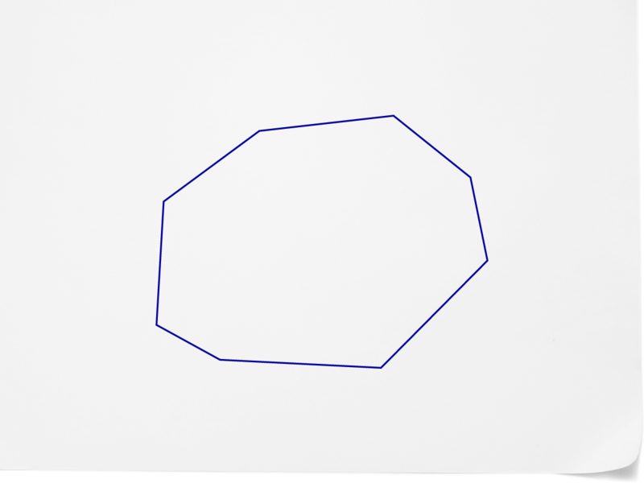
    
    \[Figure 18\]
    
9.  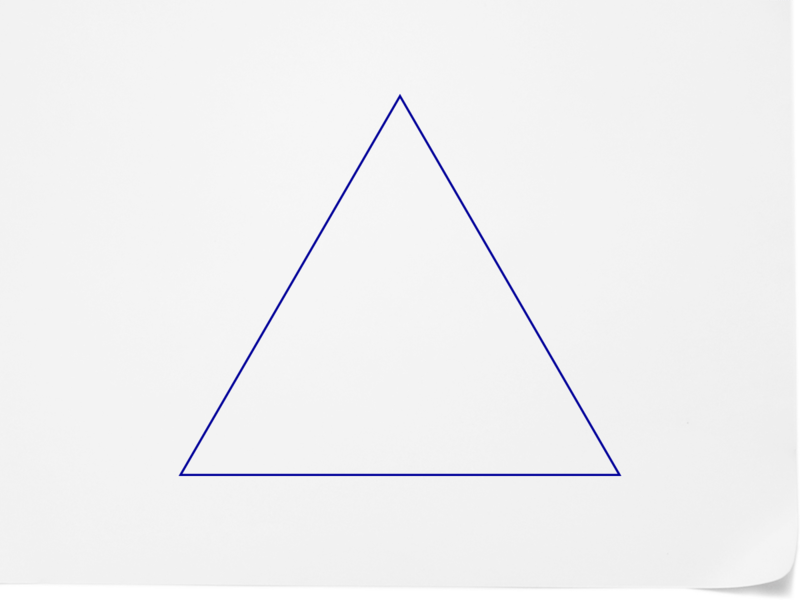
    
    \[Figure 19\]
    
10. 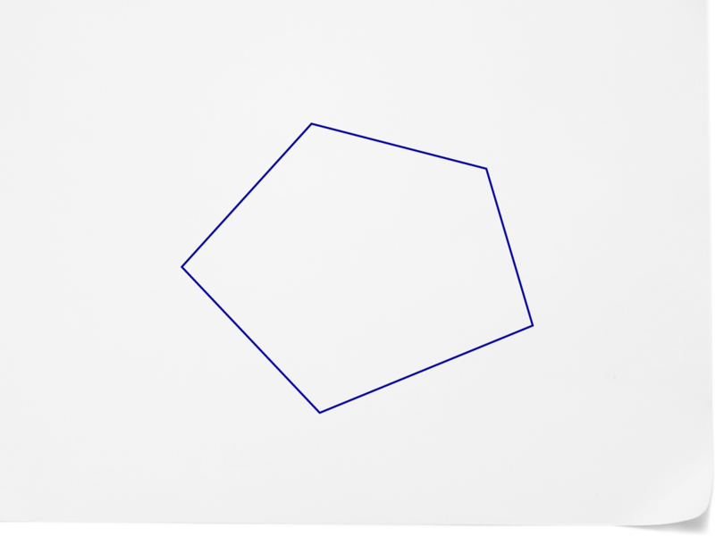
    
    \[Figure 20\]
    
11. 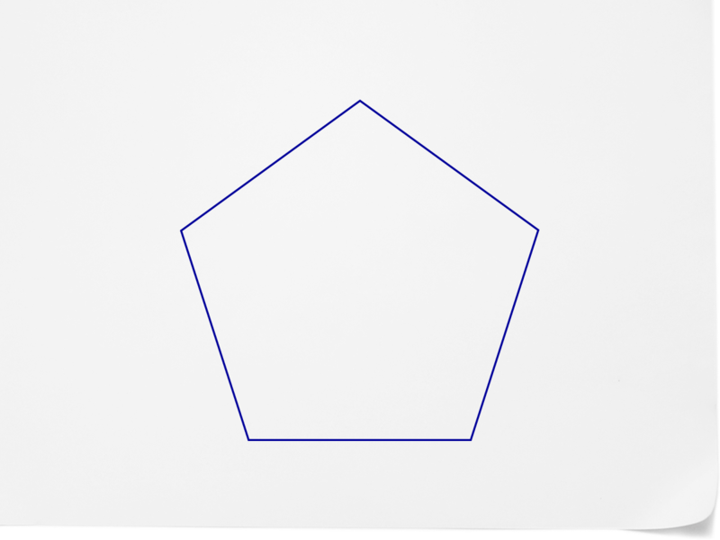
    
    \[Figure 21\]
    
12. 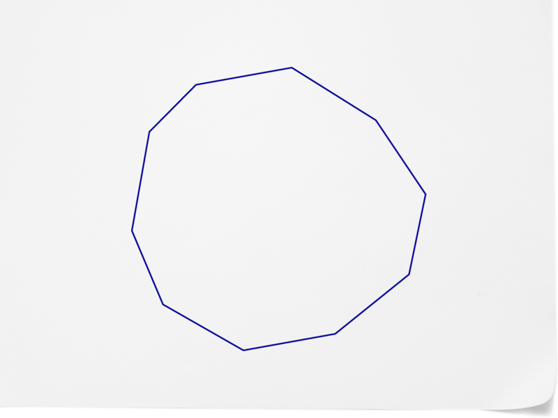
    
    \[Figure 22\]
    

Directions: Use the formula $(n - 2) \times 180$ to figure out the sum of the angle measures of each polygon.

13. Regular hexagon
14. Regular octagon
15. Triangle
16. Trapezoid
17. Decagon
18. Nonagon
19. Heptagon
20. Pentagon

Directions: Now use the measures that you just found to figure out the measure of each angle in each regular polygon.

21. What is the measure of each angle in a regular heptagon?
22. A regular decagon?
23. A regular octagon?
24. A regular hexagon?
25. A regular pentagon?

</article>

### 6.5 Congruent Polygons

<article>

Introduction
------------

**_Geodesic Trouble_**

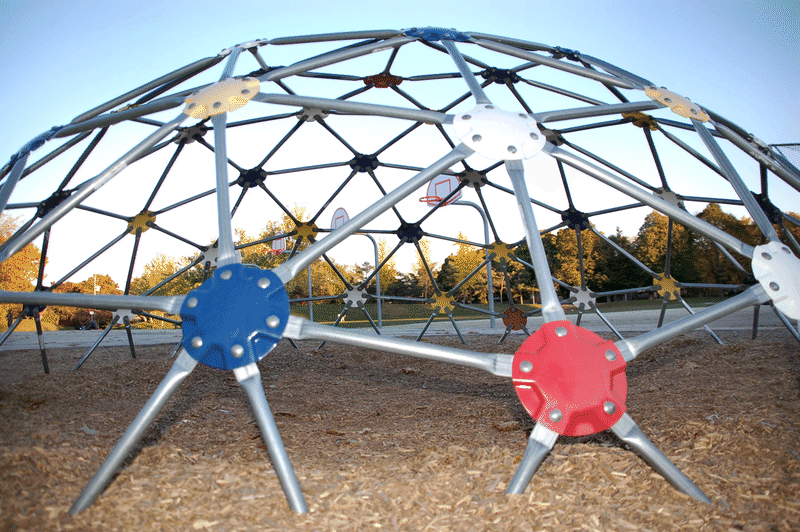

“It doesn’t look right,” Sarah, Dylan’s sister commented as he was putting the structure together in the living room.

“What do you mean?” Dylan asked tearing off another piece of duct tape.

“It is crooked and I think it will collapse.”

“You don’t know anything,” Dylan snapped turning his back on his sister.

However, when Dylan actually went to connect the triangles together, the structure began to collapse. His sister came back into the room.

“Can I help?” she asked.

“Maybe.”

“Are the triangles congruent?” Sarah asked.

**Congruent? Dylan had to think about that one. What would it mean if the triangles weren’t congruent? What does it mean “congruent?” How can one tell if a figure is congruent or not?**

**In this lesson, you will learn all about the importance of congruence and how to determine congruence.**

**_What You Will Learn_**

In this lesson you will learn how to do the following skills.

* Recognize congruence of segments and angles, and name congruent polygons by vertices.
* Name all pairs of congruent corresponding parts of given congruent polygons.
* Recognize and apply side–side–side (SSS), side–angle–side (SAS) and angle–side–angle (ASA) rules for triangle congruence.
* Identify congruence of polygons found in real – world objects and architecture.

**_Teaching Time_**

I. **Recognize Congruence of Segments and Angles, and Name Congruent Polygons**

**What do we mean when we say that two figures are congruent?** To complete all of the work in this lesson, you must first understand what the word “congruent” means. **_Congruent_** **means exactly the same.**

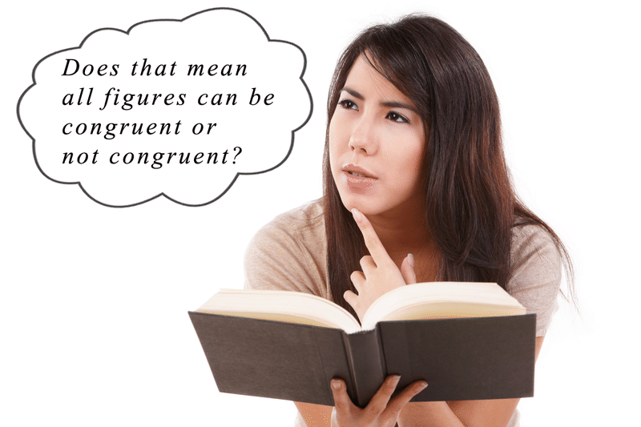

**Let’s look at an example.**

Example

_Are these two angles congruent?_

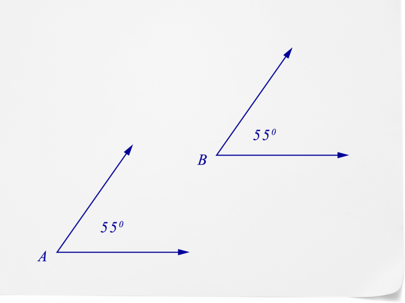

$\angle A \cong \angle B$

**This is the way we would write a statement about congruence using mathematical notation. Notice the symbol that we used for congruent.**

Just as we said that any two figures can be congruent, we can use this when we look at different types of polygons too. Two polygons can be considered congruent or not congruent. Let’s look at an example and see if we can determine congruence.

Example

Are these two octagons congruent?

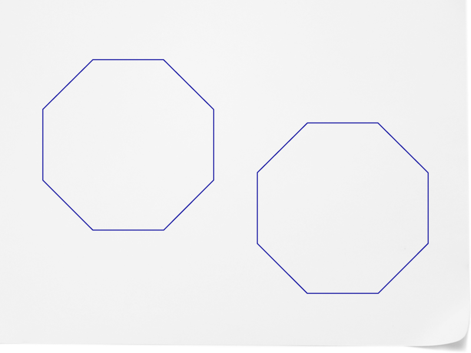

Example

_Are these two hexagons congruent?_

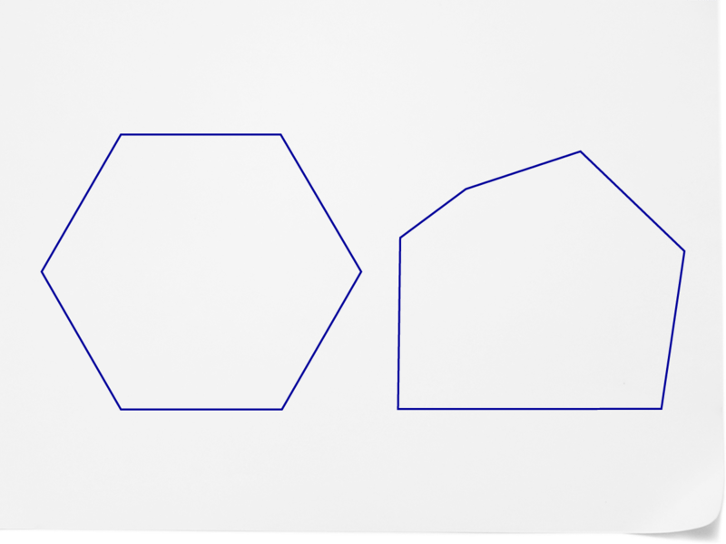

II. **Name all Pairs of Congruent Corresponding Parts of Given Congruent Polygons**

Now that you know how to identify whether or not two figures are congruent, we can look at figuring out congruent parts and angles. First, let’s think again about the four characteristics of congruent polygons.

**Congruent Polygons have:**

1.  **Same size**
2.  **Same shape**
3.  **Common angle measures**
4.  **Common side lengths**

**_Be sure that you have these notes written down in your notebook._**

The last two characteristics can be a bit tricky. Sometimes, you will have two congruent figures, but all of the angles measures won’t be exactly the same. For example, if you had two irregular congruent hexagons, that means that there are different angle measures in the two hexagons - however, they are congruent so there are “matching” angles between the two figures.

Look at this example.

Example

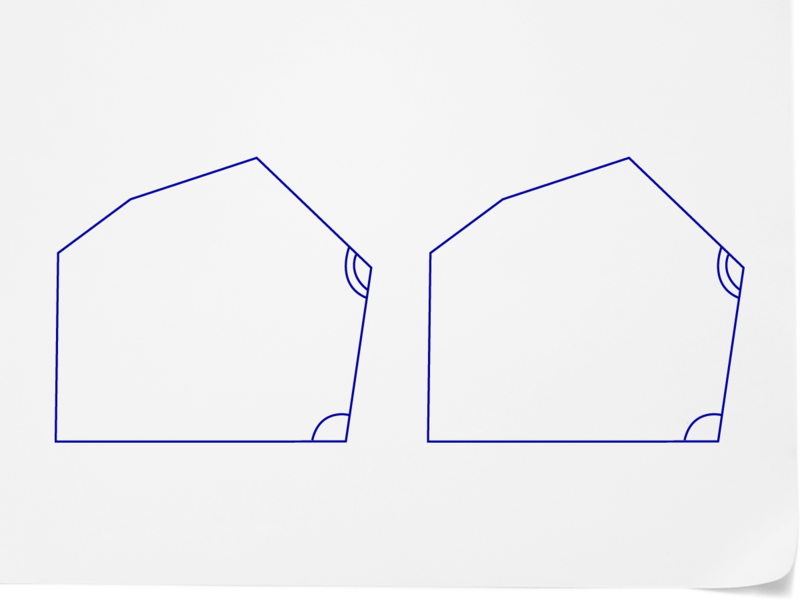

**We can identify** **_corresponding parts_** **of congruent figures. Corresponding parts can include side lengths and angle measures. When two figures are congruent, then there are corresponding parts.**

Let’s look at applying this to our work.

Example

_Name each pair of corresponding side lengths for these congruent figures._

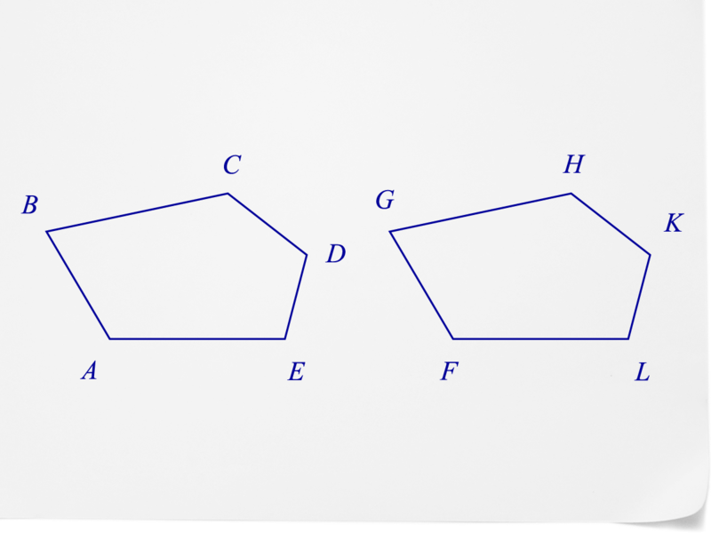

$$
\begin{align*}
BA & \cong GF\\
BC & \cong GH\\
CD & \cong HK\\
AE & \cong FL\\
ED & \cong LK
\end{align*}
$$

**We can also look at the corresponding angles for two congruent figures. When two figures are congruent, then the matching angles will also be congruent.**

Example

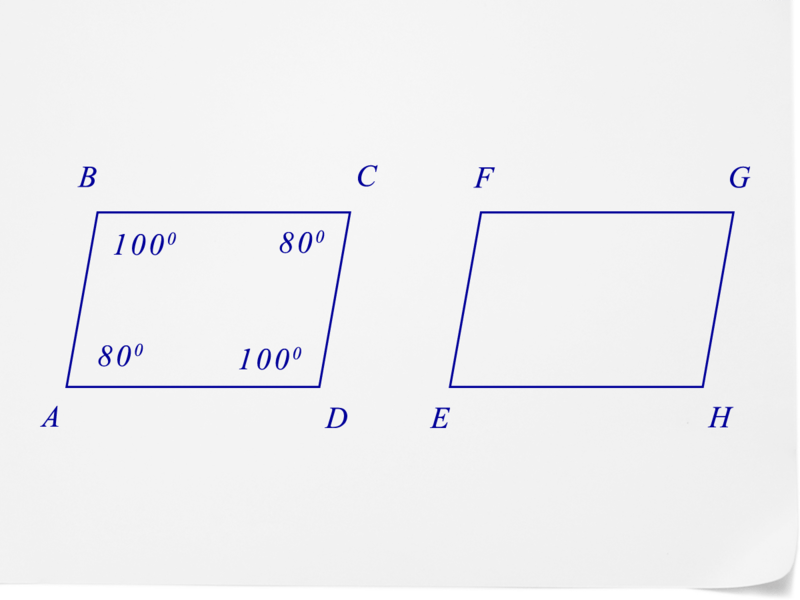

III. **Recognize and Apply Side-Side-Side (SSS), Side – Angle Side (SAS) and Angle – Side – Angle (ASA) Rules for Triangle Congruence**

We just worked on identifying the congruent sides and angles of polygons. **If the sides and the angles of any two polygons are congruent, then we know that the two polygons are also congruent.**

We can also work with triangles, because after all a triangle is also a polygon. Triangles are unique because there are a few rules that we can use to help us to identify whether or not two triangles are congruent. You will notice that if you learn these rules, that you won’t have to compare every angle and every side to determine whether or not two triangles are congruent.

**The first rule represents the side-side-side, or** **_SSS_****, relationship.** It says that if each of the three sides of one triangle is congruent to a side in a second triangle, then the two triangles are congruent. We do not need to check the angles. In triangles, angles are always in a fixed relationship with the side opposite them. The wider the angle, the longer the side opposite it must be. If we know the sides are congruent, then we know the angles must be also.

**The second rule says that if one angle and the sides adjacent to it in one triangle are congruent to an angle and its adjacent sides in the second triangle, the triangles will be congruent. We call this the side-angle-side (****_SAS_****) rule.** In other words, this time we only need to make sure one angle and two sides are congruent to know that all parts of the triangles are congruent. However, remember that the angle you use must be located between the two sides.

**The third rule tells us that if two angles and the side between them in one triangle are congruent to two angles and the side between them in the second triangle, the two triangles are congruent. This is the angle-side-angle (****_ASA_****) rule.** We can determine congruence just by knowing two angles and one side.

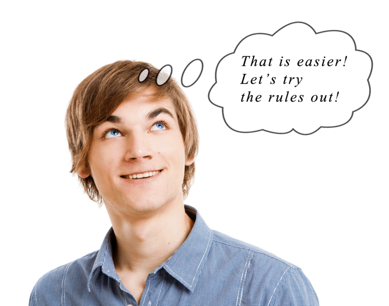

Example

_Are the triangles below congruent? Explain your reasoning._

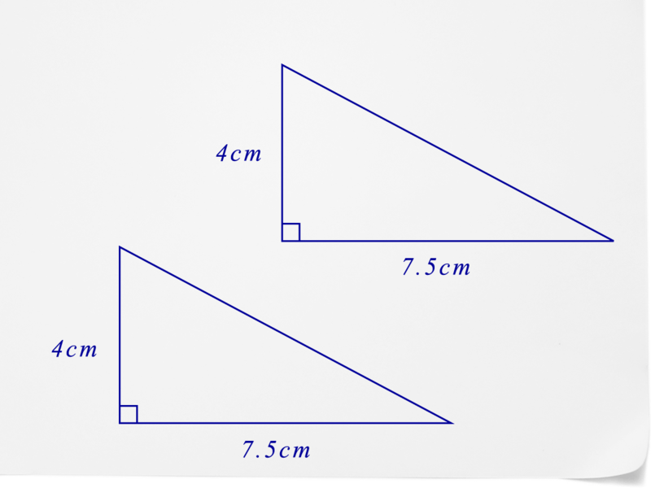

**We know that two pairs of sides match: one pair is 7.5 centimeters and the other is 4 centimeters. This is not enough information to know for sure that the triangles themselves are congruent, because the sides may be in different places. Which rule can we use to check for congruence? We cannot use SSS because we only know the lengths of two sides.**

**We can use SAS, however. Remember, to use SAS, the angle must be between the two sides. In the first triangle, the angle between the two sides is a right angle, so we know that it is $90^\circ$. Does the second triangle also have a right angle? It sure does, and the right angle is between the 7.5 and 4 centimeter sides. Using the SAS rule, we can compare the triangles: 7.5 centimeters (side), $90^\circ$ (angle), 4 centimeters (side). The triangles must be congruent.**

Example

_Are these two triangles congruent? Explain your reasoning._

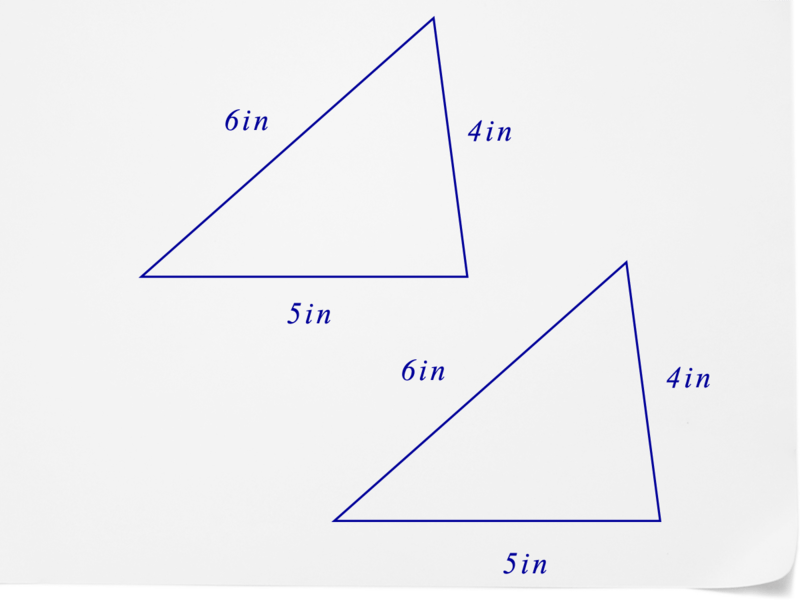

You can see how helpful these rules are in thinking about triangles and their congruence.

IV. **Identify the Congruence of Polygons Found in Real – World Objects and Architecture**

We can see congruent polygons in the world around us all the time. If you think about it, the idea of congruence is very important. If you build steps and each rise of the step is not congruent to the next step, then you will have a very crooked set of stairs. This set of stairs can be dangerous to climb up and down.

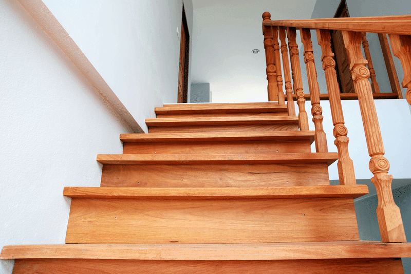

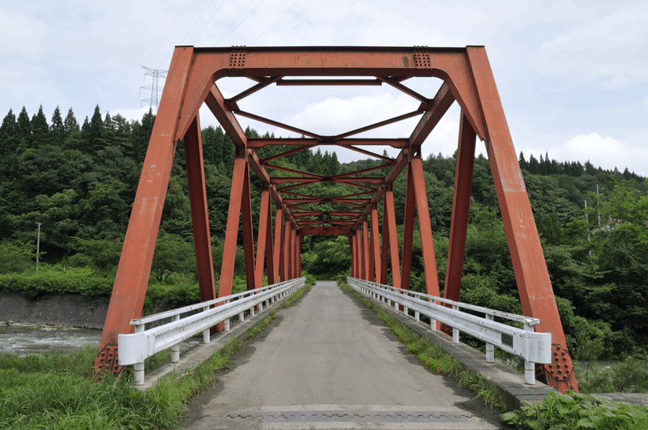

**Now you will begin to see how important congruent figures are in our world.**

Real-Life Example Completed
---------------------------

**_Geodesic Trouble_**

**Reread this problem. When finished, define congruent and explain why congruent triangles are necessary to have a structure stay balanced. Then give at least one way that Dylan could check and make sure his triangles are congruent. There are three parts to your answer.**

After doing all of his research and drawing a design, Dylan began working on the construction of his geodesic dome. He decided to use a combination of rolled newspaper tubes and duct tape. He rolled tubes of newspaper, created triangles with duct tape and then worked on connecting them together.

“It doesn’t look right,” Sarah, Dylan’s sister commented as he was putting the structure together in the living room.

“What do you mean?” Dylan asked tearing off another piece of duct tape.

“It is crooked and I think it will collapse.”

“You don’t know anything,” Dylan snapped turning his back on his sister.

However, when Dylan actually went to connect the triangles together, the structure began to collapse. His sister came back into the room.

“Can I help?” she asked.

“Maybe.”

“Are the triangles congruent?” Sarah asked.

**_Solution to Real – Life Example_**

**First, let’s think about what the word congruent means. Congruent means exactly the same. For an object to be congruent, the side lengths have to be the same. The triangles in the geodesic dome have to be congruent for it to stand up because the triangle is a structure that is well balanced to help with structure and security. Triangles are used in all kinds of construction like roofs and bridges.**

**Dylan can test the congruence of his triangles in a couple of different ways. First, he can be sure that the side lengths are the same. This is the side-side-side method of testing congruence. He can also test side-angle-side measurements of each triangle to determine congruence.**

Vocabulary
----------

Here are the vocabulary words found in this lesson.

__Congruent__

exactly the same, having the same size, shape and measurement.

__Corresponding parts__

When two figures are congruent, there are matching parts for each of the two figures.

__SSS__

determining triangle congruence by comparing the three side lengths of two triangles.

__SAS__

determining triangle congruence by comparing the side, angle, side of two triangles.

__ASA__

determining triangle congruence by comparing the angle, side, angle of two triangles.

Time to Practice
----------------

Directions: Answer each question true or false.

1.  Congruent means that a figure has the same side lengths but not the same angle measures.
2.  Congruent means exactly the same in every measure.
3.  Similar means having the same shape, but not the same size.
4.  Two congruent figures would have the same size and shape.
5.  Corresponding parts are parts that are in the same figure.
6.  You need to understand corresponding parts before you can determine if two figures are congruent.
7.  You can determine if two figures are congruent without knowing any of their measurements.
8.  Similar figures are also congruent.
9.  If two triangles are equilateral triangles, then they are automatically congruent.
10. If two quadrilaterals have measures of $360^\circ$, then they are congruent.

Directions: Use the given information to figure out each congruence statement.

$\Delta ABC \cong \Delta DEF$

11. $\angle A \cong \underline{\;\;\;\;\;\;\;\;\;\;}$
12. $\angle B \cong \underline{\;\;\;\;\;\;\;\;\;\;}$
13. $\angle C \cong \underline{\;\;\;\;\;\;\;\;\;\;}$
14. $\overline{AB} \cong \underline{\;\;\;\;\;\;\;\;\;\;}$
15. $\overline{BC} \cong \underline{\;\;\;\;\;\;\;\;\;\;}$
16. $\overline{AC} \cong \underline{\;\;\;\;\;\;\;\;\;\;}$
17. If line segment $AC$ has a length of 8, which other segment also has a length of 8?
18. If angle $A$ has a measure of $55^\circ$, which other angle has a measure of $55^\circ$?
19. If angle $B$ has a measure of $45^\circ$, which other angle has a measure congruent to that?
20. If these two triangles are congruent, are the side lengths and angle measures the same?
21. Would these two triangles look identical?

</article>

### 6.6 Reflections and Symmetry

<article>

Introduction
------------

**_Building the Teepee_**

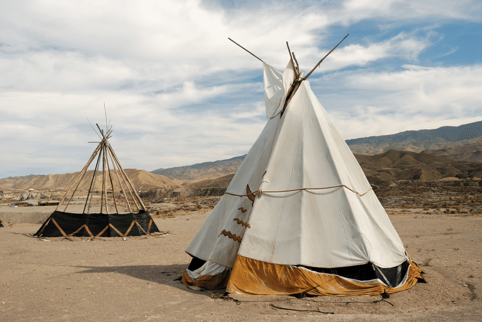

“What seems to be the trouble?” Dylan asked Marcus as he saw Marcus sit down frustrated next to his sticks and cloth covering.

“This thing won’t stand up. I put the sticks together. They are all the same length, then I try to put the canvas over the sticks and it doesn’t fit. I am so frustrated!” Marcus exclaimed putting his head in his hands.

Dylan looked at the sticks and then as the canvas. As soon as he looked at the canvas, he knew what was wrong with Marcus’ design.

“I know how to fix it.”

“How?” Marcus asked puzzled.

“Symmetry is the key here, not the length of the sticks.” Dylan said.

**Do you know what Dylan means? What is symmetry? How does a teepee have symmetry? What would Marcus have to do to be sure that his canvas was symmetrical?**

**Pay attention during this lesson and you will learn all that you need to know to solve this problem and help Marcus with his teepee.**

**_What You Will Learn_**

In this lesson you will learn how to complete the following skills.

* Recognize reflection transformations (flips) and lines of reflection.
* Use coordinate rotation to describe reflections, given figures and their resulting images reflected in either the $y-$axis or the $x-$axis.
* Use coordinate notation to reflect given figures in either or both axes.
* Identify lines of symmetry in real – world objects.

**_Teaching Time_**

I. **Recognize Reflection Transformations (Flips) and Lines of Reflection**

In the last lesson, you learned how to determine whether or not two polygons were congruent. When you did this, you were given two polygons to work with. In this lesson, we are going to create congruent figures by using **_transformations_****. A** **_transformation_** **is moved in some way. One kind of transformation is called a** **_reflection_** **or a flip.**

To understand transformations, we first need to review the **_coordinate plane_**. We examine and perform reflections in the coordinate plane. **The** **_coordinate plane_** **is a representation of two-dimensional space. It has a horizontal axis, called the $x-$axis, and a vertical axis, called the $y-$axis.**

**We can graph and move geometric figures on the coordinate plane.** Here is a picture of the coordinate plane.

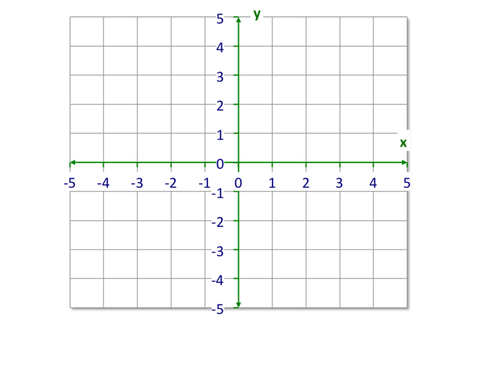

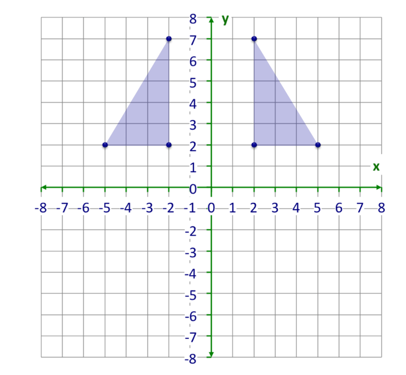

**We can reflect an image over the $x-$axis or over the $y-$axis.**

II. **Use Coordinate Notation to Describe Reflections, Given Figures and Their Resulting Images**

We can draw reflections on the coordinate plane, and we can also write about the reflections that we draw using something called **_coordinate notation._**

**Think back to when you plotted points on the coordinate plane.**

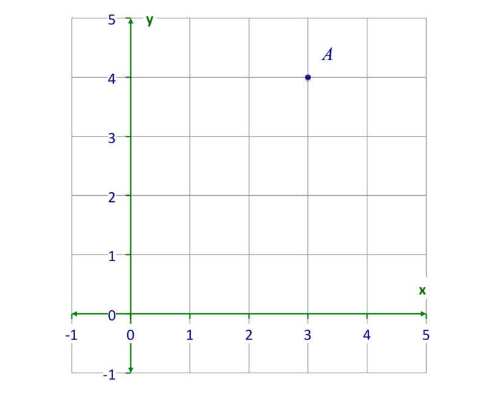

Point $A = (3, 4)$

**This is an example of coordinate notation.**

When a figure is drawn on the coordinate plane, we can use coordinate notation to describe the figure drawn. If we draw a triangle, then there will be three sets of ordered pairs to represent each vertex that has been drawn.

Look at this example.

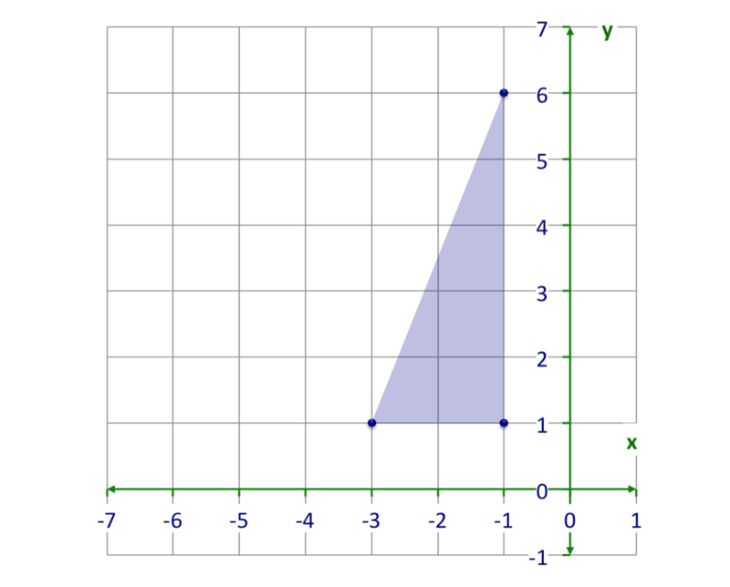

**(-1, 1)**

**(-3, 1)**

**(-1, 6)**

**What if we reflected this triangle over the $y-$axis?**

If we did this, then the coordinates of the first triangle would change. Let’s look at this reflection and examine the new coordinates. As with all things in math, look for a pattern first.

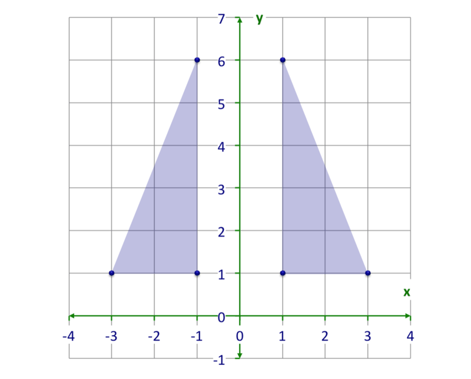

**(1, 1)**

**(3, 1)**

**(1, 6)**

**Do you see any patterns?**

If you look carefully, you will see that the $x-$coordinates of the reflected triangle are opposite those of the first triangle. This is a rule to help you.

")

\[Figure 9\]

**_Write these two rules down in your notebooks._**

III. **Use Coordinate Notation to Reflect Given Figures in Either or Both Axes**

Now that you know the two rules for figuring out the coordinates of a figure reflected on the coordinate plane, so you can use those rules to figure out new reflections whether you have been given an image or not.

Let’s look at an example.

Example

_What would be the new coordinates of a figure reflected over the $x-$axis?_

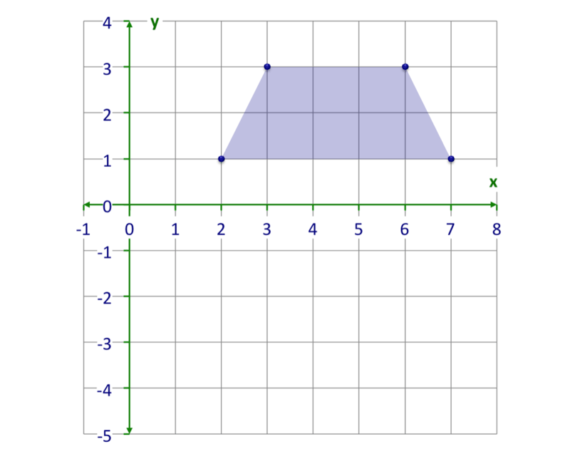

**(2, 1)**

**(7, 1)**

**(3, 3)**

**(6, 3)**

**Next, we can use the rule to figure out the new coordinates of the reflected trapezoid. We are going to reflect this trapezoid over the $x-$axis, so the $y-$coordinates will become the opposite and the $x-$coordinates will remain the same. Here are the new coordinates.**

**(2, -1)**

**(7, -1)**

**(3, -3)**

**(6, -3)**

**Now we can graph the reflected trapezoid on the coordinate plane.**

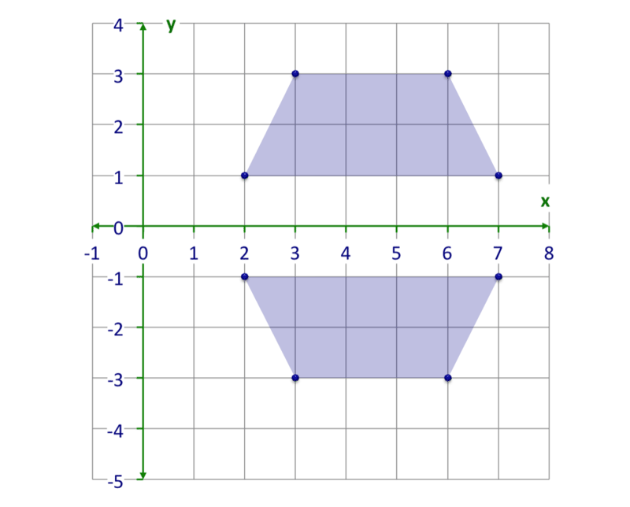

IV. **Identify Lines of Symmetry in Real – World Objects**

Throughout this lesson you have learned how to reflect figures on the coordinate plane. When this happens, we can see a mirror of two figures. We reflected figures over the $x-$axis and over the $y-$axis. Sometimes, a figure will have parts that mirror themselves within one object. In this case, parts of the object match other parts of the picture. This is called **_symmetry_**. Let’s look at an example.

We can determine other lines of symmetry by looking at other objects.

**We can find symmetry all around us. There is symmetry in real – world objects that we see all the time. Look around you today and locate three different things that have lines of symmetry.**

**Here are some butterflies to think about.**

---------------------------

**_Building the Teepee_**

**Here is the original problem from the introduction. Reread it and then answer the questions at the end of the problem.**

Dylan looked at the work his friend Marcus was doing in class. Marcus had decided to design and build a tepee. Like Dylan’s geodesic dome, Marcus was having a difficult time with the construction aspect of the teepee.

“What seems to be the trouble?” Dylan asked Marcus as he saw Marcus sit down frustrated next to his sticks and cloth covering.

“This thing won’t stand up. I put the sticks together. They are all the same length, then I try to put the canvas over the sticks and it doesn’t fit. I am so frustrated!” Marcus exclaimed putting his head in his hands.

Dylan looked at the sticks and then as the canvas. As soon as he looked at the canvas, he knew what was wrong with Marcus’ design.

“I know how to fix it.”

“How?” Marcus asked puzzled.

“Symmetry is the key here, not the length of the sticks.” Dylan said.

**Do you know what Dylan means? What is symmetry? How does a teepee have symmetry? What would Marcus have to do to be sure that his canvas was symmetrical?**

**_Solution to Real – Life Example_**

**Here are the three questions posed at the end of the problem in the introduction. Reread them and then answer them.**

**What is symmetry?**

**Symmetry is when two halves of an object match. In other words, you can divide the object into parts and the parts are congruent. A heart is a symmetrical object, so is a teepee.**

**How does a teepee have symmetry?**

**A teepee has symmetry because it can be divided in half so that one half of the teepee matches the other half.**

**What would Marcus have to do to be sure that his canvas was symmetrical?**

**While Marcus was sure that his sticks were all the same length that is only half of the necessary piece. Marcus also needs to be sure that the canvas is the same all the way around. If he does, then all sides will match or be symmetrical, if not then one side will be different that the other.**

Vocabulary
----------

Here are the vocabulary words found in this lesson.

__Transformation__

a way of shifting or moving a geometric figure on the coordinate plane.

__Coordinate Plane__

a representation of two – dimensional space with an $x-$axis, a $y-$axis and a coordinates.

__Reflection__

a transformation known as a flip where a mirror image of a figure is created.

__Line of Reflection__

the $x$ or $y-$axis which is the mirror for the reflected figure on the coordinate plane.

__Coordinate Notation__

using ordered pairs to represent the vertices of a figure on the coordinate plane.

__Symmetry__

when an object has the ability to be divided into matching parts.

__Line of Symmetry__

the line that divides an object into matching parts.

Time to Practice
----------------

Directions: Define the following terms.

1.  Reflection
2.  Coordinate Plane
3.  $\underline{x-}$axis
4.  $\underline{y-}$axis

Directions: Write each set of coordinates for a reflection of each figure over the $x-$axis.

5.  (1,3) (2,5) (3, 2)
6.  (2, 1) (5, 1) (2, 4)
7.  (-1, 1) (-1, 3) (-4, 1)
8.  (1, 2) (1, 5) (5, 2) (5, 5)
9.  (1, 2) (6, 1) (6, 3) (2, 3)
10. (-1, 3) (-3, 1) (-5, 1) (-4, 6)

Directions: Write a new series of coordinates for a figure reflected over the $y-$axis.

11. (1, 3) (2, 5) (3, 2)
12. (-1, 1) (-1, 3) (-4, 1)
13. (2, 1) (5, 1) (2, 4)
14. (1, 2) (1, 5) (5, 2) (5, 5)
15. (-1, 3) (-3, 1) (-5, 1) (-4, 6)

Directions: Now go back and identify each figure that was reflected.

16. ­
17. ­
18. ­
19. ­
20. ­
21. ­
22. ­
23. ­
24. ­
25. ­
26. ­

</article>

### 6.7 Translations, Rotations and Tessellations

<article>

Introduction
------------

**_The Dome_**

“What is the matter?” his Mom asked sitting down at the table.

“Well, I made this great geodesic dome. It is finished and doing great, but Mrs. Patterson wants me to investigate other shapes that you could use to make a dome. I don’t want to do it. I feel like my project is finished,” Dylan explained.

“Maybe Mrs. Patterson just wanted to give you an added challenge.”

“Maybe, but what other shapes can be used to form a dome? The triangle makes the most sense,” Dylan said.

“Yes, but to figure this out, you need to know what other shapes tessellate,” Mom explained.

“What does it mean to tessellate? And how can I figure that out?”

**These are both good questions that will be answered in this chapter. Use the lesson to learn about tessellations. At the end of the lesson, you can help Dylan to answer these questions.**

**_What You Will Learn_**

In this lesson you will learn how to do the following skills.

* Recognize translation transformations (slides) and rotation transformations (turns).
* Use coordinate notation to describe translations of given figures and their resulting images.
* Use coordinate notation to describe rotations around the origin of given figures and their resulting images, $90^\circ$ clockwise, $90^\circ$ counterclockwise and $180^\circ$.
* Identify rotational symmetry and the least angle of rotation in given images.
* Use any combination of transformations (flips, slides, turns) to create tessellations, and identify polygons that do not tessellate.

**_Teaching Time_**

I. **Recognize Translation Transformations (Slides) and Rotation Transformations (Turns)**

In the last lesson, you learned all about a **_transformation_** called a **_reflection_****. A** **_transformation_** **is the movement of a geometric figure on the coordinate plane. Remember that a** **_reflection_** **is the flip or mirror image of a geometric figure over the $x$ or $y-$axis.** There are other kinds of transformations too.

**Two other types of transformations are** **_translations_** **and** **_rotations_****. A** **_translation_** **is when a geometric figure slides up, down, left or right on the coordinate plane. The figure moves its location, but doesn’t change its position. A** **_rotation_** **is a turn. A figure can be turned clockwise or counterclockwise on the coordinate plane. In both transformations the size and shape of the figure stays exactly the same.**

Now let’s look at these two types of transformations in more detail.

II. **Use Coordinate Notation to Describe Translations of Given Figures and Their Resulting Images**

**When we perform translations, we slide a figure left or right, up or down. This means that, in the coordinate plane, the coordinates for the vertices of the figure will change.**

Take a look at the example below.

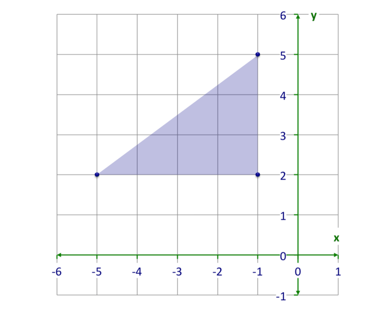

(-1, 5)

(-1, 2)

(-5, 2)

These are the coordinates of the vertices of the triangle.

**If we slide this triangle 3 places down, all of its vertices will shift 3 places down the $y-$axis. That means that the ordered pairs for the new vertices will change. Specifically, the $y-$coordinate in each pair will decrease by 3.**

Look at this example.

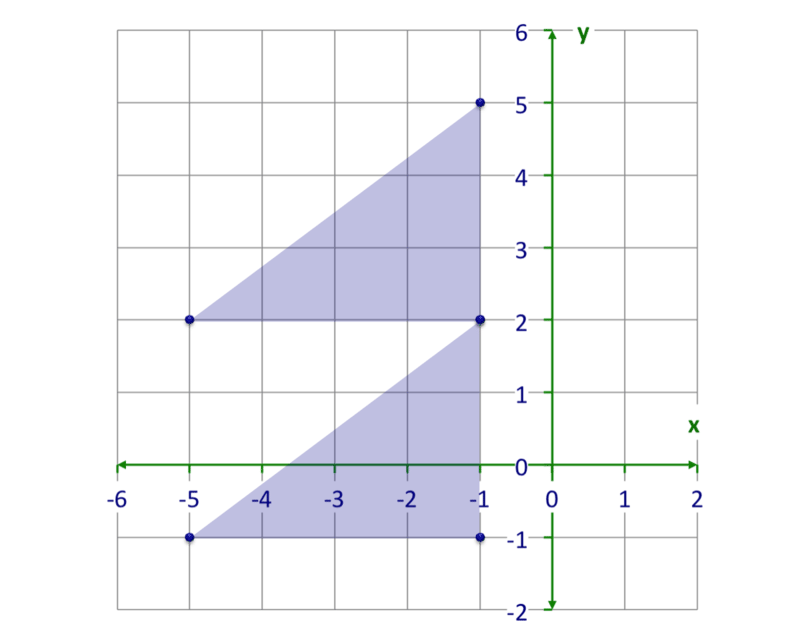

$$
\begin{align*}
(-1, 5) & \rightarrow (-1, 2)\\
(-1, 2) & \rightarrow (-1, -1)\\
(-5, 2) & \rightarrow (-5, -1)
\end{align*}
$$

**The $y-$coordinate changed from 5 to 2, from -1 to 2 and from 2 to -1. As we move down, the value of the coordinate also moved down.**

**If we were to move the image up three units on the $y-$axis, then we would increase the value of the $y-$coordinate by three units.**

**If we were to move the image to the right then we would increase the $x-$coordinate. If we were to move it to the left, then we would decrease the $x-$coordinate.**

**We can translate figures in other ways too. We can move figures diagonally by changing both their $x-$ and $y-$coordinates. One way to recognize translations, then, is to compare their points. The $x-$coordinates will all change the same way, and the $y-$coordinates will all change the same way.**

**To graph a translation, we perform the same change for each point. Let’s try graphing a translation.**

Example

_Graph the following translation five places to the right._

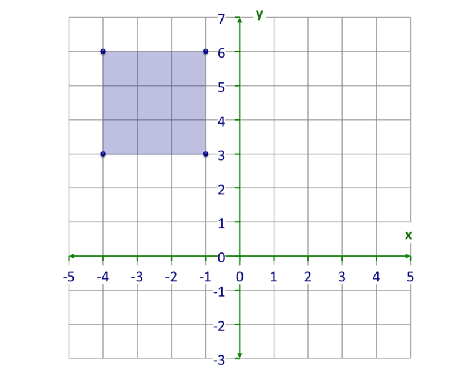

**(-4, 3)**

**(-1, 3)**

**(-1, 6)**

**(-4, 6)**

**The translation is to move the square five places to the right. That means that we are going to change the $x-$coordinate and not the $y-$coordinate.**

$$
\begin{align*}
(-4, 3) + 5 &= (1, 3)\\
(-1, 3) + 5 &= (4, 3)\\
(-1, 6) + 5 &= (4, 6)\\
(-4, 6) + 5 &= (1, 6)
\end{align*}
$$

**Now let’s look at the graph of the translation.**

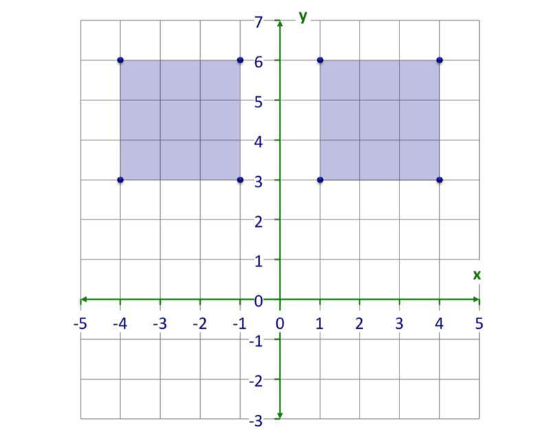

Example

_A triangle with the coordinates (0, 2), (2, 2) and (2, 5) is graphed on the coordinate grid. Find the coordinates of a translation moved three units down._

**To work through this one, first notice the direction of the translation. It is to move the triangle three units down. Down means that we will be subtracting three and down also means that we will be changing the $y-$coordinate since up and down involves the $y-$axis. Here is our action.**

$$
\begin{align*}
(0, 2) - 3 &= (0, -1)\\
(2, 2) - 3 &= (2, -1)\\
(2, 5) - 3 &= (2, 2)
\end{align*}
$$

**If we were to graph the translation, here is what we would see.**

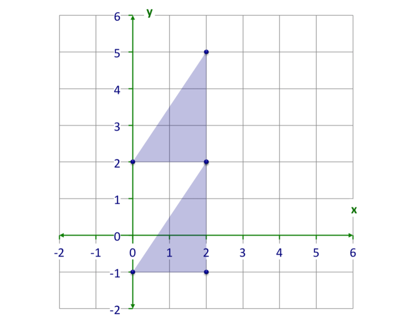

Now let’s look at another kind of transformation: rotations. **A** **_rotation_** **is a transformation that turns the figure in either a clockwise or counterclockwise direction.** We can turn a figure $90^\circ$, a quarter turn, either clockwise or counterclockwise. When we spin the figure exactly halfway, we have rotated it $180^\circ$. Turning it all the way around rotates the figure $360^\circ$.

Example

_Rotate this figure $90^\circ$ clockwise on the coordinate plane._

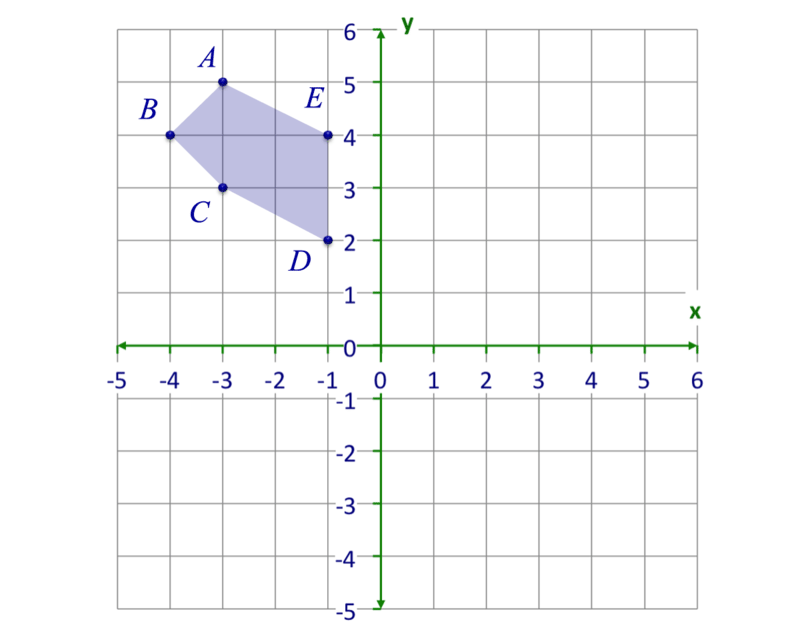

$$
\begin{align*}
& A (-3, 5)\\
& B (-4, 4)\\
& C (-3, 3)\\
& D (-1, 2)\\
& E (-1, 4)
\end{align*}
$$

**Now we have the points. The easiest way to think about rotating any figure is to think about it moving around a fixed point. In the case of graphing figures on the coordinate plane, we will be rotating the figures around the center point or origin.**

**If we rotate a figure clockwise $90^\circ$, then we are going to be shifting the whole figure along the $x-$axis. To figure out the coordinates of the new rotated figure, we switch the coordinates and then, we need to multiply the second coordinate by -1. This will make perfect sense given that the entire figure is going to shift.**

**Let’s apply this to the coordinates above.**

$$
\begin{align*}
A (-3, 5) &= A^\prime (5, -3) = (5, 3)\\
B (-4, 4) &= B^\prime (4, -4) = (4, 4)\\
C (-3, 3) &= C^\prime (3, -3) = (3, 3)\\
D (-1, 2) &= D^\prime (2, -1) = (2, 1)\\
E (-1, 4) &= E^\prime (4, -1) = (4, 1)
\end{align*}
$$

**Now we can graph this rotated figure. Notice that we use $A^\prime$ to represent the rotated figure. Here is the graph of this rotation.**

")

\[Figure 11\]

**That is a great question. Let’s think about what would happen to the figure if we were to rotate it counterclockwise. To do this, the figure would move across the $y-$****_axis_** **in fact, the $x-$coordinates would change completely. In actuality, we would switch the original coordinates around. The $x-$coordinate would become the $y-$coordinate and the $y-$coordinate would become the $x-$coordinate. Then, we need to multiply the new $x-$coordinate by -1.**

Here is what that would look like.

$$
\begin{align*}
& A (-3, 5) \rightarrow A^\prime (-5, -3)\\
& B (-4, 4) \rightarrow B^\prime (-4, -4)\\
& C (-3, 3) \rightarrow C^\prime (-3, 3)\\
& D (-1, 2) \rightarrow D^\prime (-2, -1)\\
& E (-1, 4) \rightarrow E^\prime (-4, -1)
\end{align*}
$$

**Now we can graph this new rotation.**

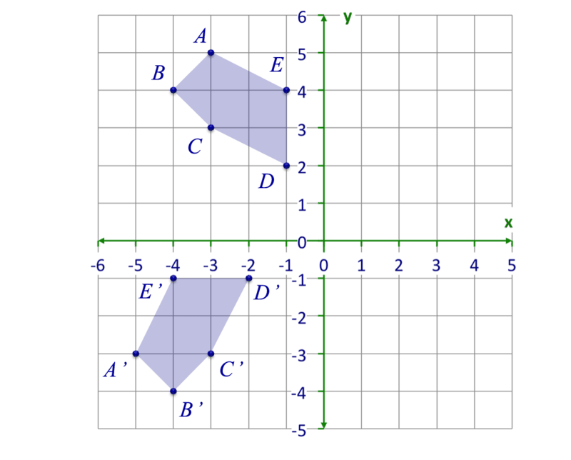

**Let’s see what this looks like.**

$$
\begin{align*}
A (-3, 5) &= A^\prime (3, -5)\\
B(-4, 4) &= B^\prime (4, -4)\\
C (-3, 3) &= C^\prime (3, -3)\\
D (-1, 2) &= D^\prime (1, -2)\\
E (-1, 4) &= E^\prime (1, -4)
\end{align*}
$$

**Now we can graph this image.**

")

\[Figure 14\]

**_Write the three ways to figure out new coordinates for rotating $90^\circ$ clockwise and counterclockwise and for rotating a figure $180^\circ$. Put these notes in your notebook._**

IV. **Identify Rotational Symmetry and the Least Angle of Rotation in Given Images**

In the last section you learned how to rotate a figure. Now let’s think about symmetry and rotations. **We can call this** **_rotational symmetry_****. A figure has rotational symmetry if, when we rotate it, the figure appears to stay the same. The outlines do not change even as the figure turns.** Look at the figure below.

Example

_Does this figure have rotational symmetry?_

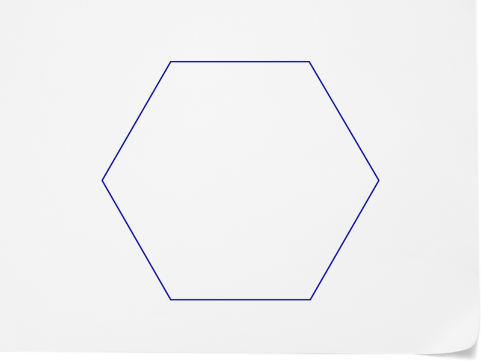

**Now look carefully at the hexagon. We could rotate it less than $90^\circ$ too and it still has rotational symmetry. We can also look at the angles to determine rotational symmetry. Each time we turn the figure, it has two parallel sides on the top and bottom and four other sides at the same angles. It has rotational symmetry.**

V. **Use any Combination of Transformations (flips, slides, turns) to Create Tessellations, and Identify Polygons that Do Not Tessellate**

We can use translations and reflections to make patterns with geometric figures called **_tessellations._** **A tessellation is a pattern in which geometric figures repeat without any gaps between them.** In other words, the repeated figures fit perfectly together. They form a pattern that can stretch in every direction on the coordinate plane. Take a look at the tessellations below.

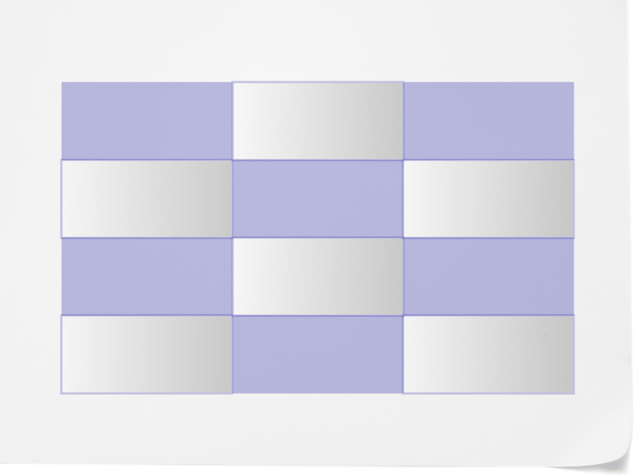

We can create tessellations by moving a single geometric figure. We can perform translations such as translations and rotations to move the figure so that the original and the new figure fit together.

**How do we know that a figure will tessellate?**

**If the figure is the same on all sides, it will fit together when it is repeated. Figures that tessellate tend to be regular polygons. Regular polygons have straight sides that are all congruent. When we rotate or slide a regular polygon, the side of the original figure and the side of its translation will match. Not all geometric figures can tessellate, however. When we translate or rotate them, their sides do not fit together.**

**_Remember this rule and you will know whether a figure will tessellate or not! Think about whether or not there will be gaps in the pattern as you move a figure._**

Example

_Create a tessellation by repeating the following figure._

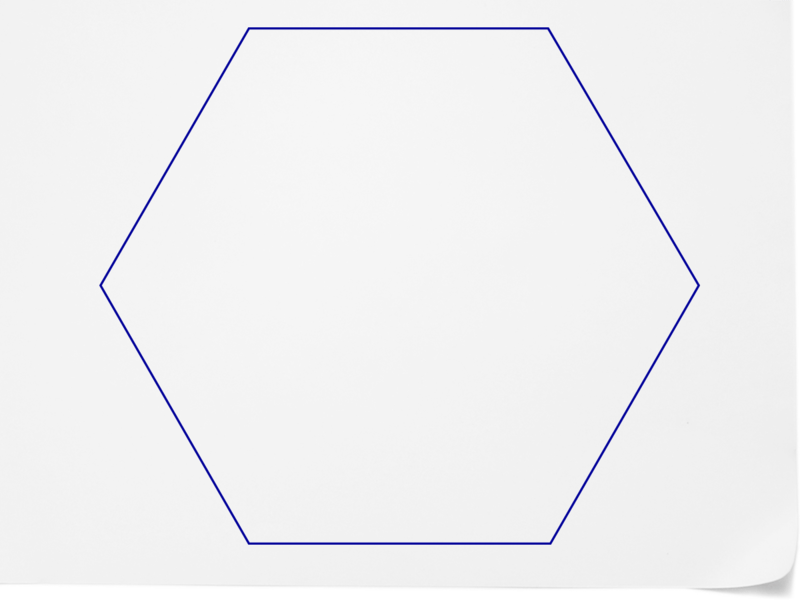

This figure is exactly the same on all sides, so we do not need to rotate it to make the pieces fit together. Instead, let’s try translating it. Trace the figure. Then slide the cutout so that one edge of it lines up perfectly with one edge of the figure you drew. Trace the cutout again. Now line the cutout up with another side of the original figure and trace it. As you add figures to the pattern, the hexagons will start making themselves!

Check to make sure that there are no gaps in your pattern. All of the edges should fit perfectly together. You should be able to go on sliding and tracing the hexagon forever in all directions. You have made a tessellation!

Real-Life Example Completed
---------------------------

**_The Dome_**

**Here is the original problem once again. Reread it and then answer the questions at the end that Dylan asks his Mom.**

Dylan came storming in the door after a busy day at school. He slammed his books down on the kitchen table.

“What is the matter?” his Mom asked sitting down at the table.

“Well, I made this great geodesic dome. It is finished and doing great, but Mrs. Patterson wants me to investigate other shapes that you could use to make a dome. I don’t want to do it. I feel like my project is finished,” Dylan explained.

“Maybe Mrs. Patterson just wanted to give you an added challenge.”

“Maybe, but what other shapes can be used to form a dome? The triangle makes the most sense,” Dylan said.

“Yes, but to figure this out, you need to know what other shapes tessellate,” Mom explained.

“What does it mean to tessellate? And how can I figure that out?”

**_Solution to Real – Life Example_**

**First, let’s answer the question about tessellations. What does it mean to tessellate?**

To tessellate means that congruent figures are put together to create a pattern where there aren’t any gaps or spaces in the pattern. Figures can be put side by side and/or upside down to create the pattern. The pattern is called a tessellation.

**How do you figure out which figures will tessellate and which ones won’t?**

Figure that will tessellate are congruent figures. They have to be exactly the same length on all sides. They also have to be able to fit together. A circle will not tessellate because there aren’t sides to fit together. A hexagon, on the other hand, will tessellate as long as the same hexagon is used to create the pattern. 

Vocabulary
----------

Here are the vocabulary words that are found in this lesson.

__Transformation__

moving a geometric figure on the coordinate plane.

__Coordinate Notation__

using ordered pairs to represent the vertices of a figure that has been graphed on the coordinate plane.

__Reflection__

A flip of a figure on the coordinate plane.

__Translation__

A slide – when a figure moves up, down, left or right on the coordinate plane, but does not change position.

__Rotation__

A turn – when a figure is turned $90^\circ, 180^\circ$ on the coordinate plane.

__Rotational Symmetry__

when a figure can be rotated but appears exactly the same no matter how you rotate it.

__Tessellation__

a pattern made by using different transformations of geometric figures. A figure will tessellate if it is a regular geometric figure and if the sides all fit together perfectly with no gaps.

Time to Practice
----------------

Directions: Answer the following questions about rotations, translations and tessellations.

1.  What is a translation?
2.  What is a rotation?
3.  What is a tessellation?
4.  True or false. A figure can be translated up or down only.
5.  True or false. A figure can be translated $180^\circ$.
6.  True or false. A figure can be rotated $90^\circ$ clockwise or counterclockwise.
7.  True or false. A figure can’t be translated $180^\circ$.
8.  When rotating a figure $90^\circ$ counterclockwise, we switch the $x$ and $y$ coordinates and multiply which one by -1?
9.  When rotating a figure $90^\circ$ clockwise, we multiply which coordinate by -1?
10. True or false. When rotating a figure $180^\circ$, we multiply both coordinates by -1.

Directions: Write the new coordinates for each rotation given the directions.

A Triangle with the coordinates (-4, 4) (-4, 2) and (-1, 1)

11. Rotate the figure $90^\circ$ clockwise
12. Rotate the figure $90^\circ$ counterclockwise
13. Rotate the figure $180^\circ$

A Triangle with the coordinates (1, 3) (5, 1) (5, 3)

14. Rotate the figure clockwise $90^\circ$
15. Rotate the figure counterclockwise $90^\circ$
16. Rotate the figure $180^\circ$

A Triangle with the coordinates (1, -1) (3, -4) (5, -1)

17. Rotate the figure clockwise $90^\circ$
18. Rotate the figure counterclockwise $90^\circ$
19. Rotate the figure $180^\circ$

Directions: Answer the following questions.

20. Will a regular pentagon tessellate?
21. What characteristics does a figure have to tessellate?
22. Can a tessellation have any gaps?

</article>

### 6.8 Similarity and Dilations

<article>

Introduction
------------

**_The Log Cabin_**

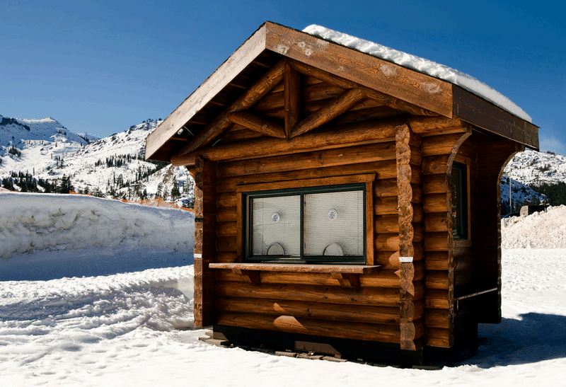

“Mrs. Patterson, I am going to focus on a log cabin from the 1800’s,” Sherri said taking out a book that she found at the library on log cabins.

“That is a great idea. What was the average size of a log cabin in 1800?” Mrs. Patterson asked.

“What do you mean?”

“I mean the square footage. How many feet wide was the average house and how many feet long?” Mrs. Patterson explained.

“Oh, I get it. The average house was $20 \times 40 \ feet$. So the average was 800 square feet,” Sherri said.

“Terrific, now make sure that your plan shows that,” Mrs. Patterson said walking away.

Sherri is puzzled. She knows that the shape of the log cabin is a rectangle given the length and width. She knows the area of the house. To create a plan, she will need to create a dilation. Sherri decides that she will use a scale factor of $\frac{1}{16}$. Given this information, what will the dimensions be of her house plan?

**Use this lesson to learn about dilations and figure out the dimensions of the house by the end of the lesson.**

**_What You Will Learn_**

In this lesson, you will learn how to demonstrate the following skills.

* Recognize similar polygons as having congruent corresponding angles and proportional corresponding side lengths.
* Use similar triangles to find unknown lengths or distances using indirect measurement.
* Recognize dilation transformations (stretch or shrink) and scale factors.
* Use coordinate notation to describe dilations of given figures and their resulting images.

**_Teaching Time_**

I. **Recognize Similar Polygons as Having Congruent Corresponding Angles and Proportional Corresponding Side Lengths**

We have spent a lot of time identifying and working with congruent figures. **Remember that** **_congruent_** **means exactly the same, having the same size and shape.** Sometimes, a figure will have the same shape, but not the same size. It will be either smaller or larger than the original figure. When this happens, we say that the two figures are **_similar. Similar_** **figures have the same shape, but not the same size.**

**In this lesson you will learn all about how to work with similarity in figures.** Think about it for a minute, if a figure has the same shape, but not the same size, then there is still a relationship between the two figures. The relationship is created based on the shape being the same.

**Let’s start by thinking about angles. With similar figures, each angle of one figure in a similar pair corresponds and is congruent to an angle in the other.** For instance, the top point of one triangle corresponds to the top point of the other triangle in a similar pair. We call these corresponding parts.

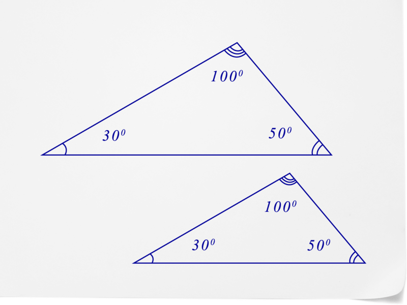

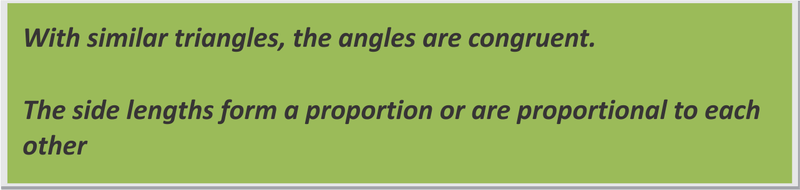

**The sides in similar pairs also correspond to each other (such as the base of each triangle), but they are not congruent; they are proportional.** We can determine whether figures are similar to each other by comparing their corresponding parts. Corresponding parts are especially helpful when one figure is rotated so that it is not clear which angles and sides correspond to which in the other figure.

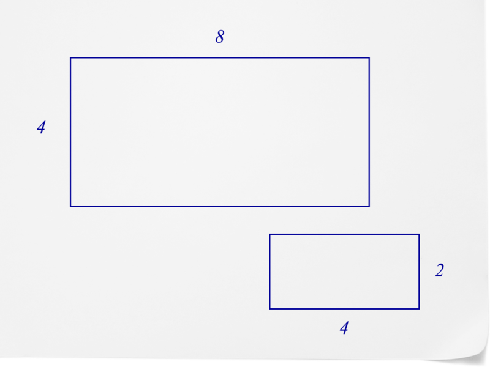

Let’s write a proportion to compare the corresponding sides.

$$
\begin{align*}
\frac{short \ side}{short \ side} &= \frac{long \ side}{long \  side}\\
\frac{4}{2} &= \frac{8}{4}
\end{align*}
$$

**You can see that these two ratios form a proportion. You can use this information to prove whether or not two figures are similar as well. Remember, the angle measures must be the same, and the side lengths must be proportional.**

II. **Use Similar Triangles to Find Unknown Lengths or Distances Using Indirect Measurement**

Now that you understand how to identify whether or not two figures are similar, we can look similar triangles. Similar triangles are very useful because we can use them to figure out measurements. Many years ago, this is how people used to figure out the measurements for things that were too high or big to measure. They used **_indirect measurement._** **Indirect measurement uses similar triangles and proportions to figure out lengths or distances.**

**But first, let’s think about similar triangles.**

**Similar triangles have the same properties as other similar figures. The angle measures are the same and the corresponding side lengths are proportional. Let’s look at this diagram to understand this.**

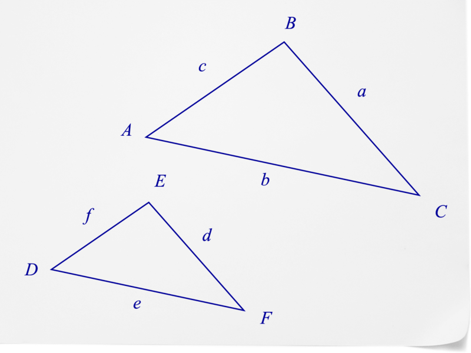

$$
\begin{align*}
\angle A & \cong \angle D\\
\angle B & \cong \angle E\\
\angle C & \cong \angle F
\end{align*}
$$

Next, we can look at the corresponding side lengths. In the diagram, we haven’t been given any measurements, but we can use the lowercase letters to show which sides correspond.

$\frac{a}{d}=\frac{b}{e}=\frac{c}{f}$

This shows that the side lengths form a ratio and that each of these is proportional to the other.

**We can use this information when problem solving for missing side lengths.**

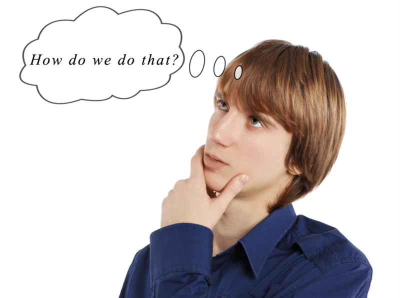

$$
\begin{align*}
a &= 12\\
b &= ?\\
c &= 3\\
d &= 4\\
e &= 3\\
f &= 1
\end{align*}
$$

**Now we can take these given measures and substitute them into the proportion that we wrote earlier. Notice that we don’t have the measure of side $b$, so we will need to solve for that missing measurement.**

$\frac{12}{4}=\frac{b}{3}=\frac{3}{1}$

Next, we can use two of the three ratios to solve the proportions. We have three ratios, but we don’t need all three because two equal ratios form a proportion. This means that we only need to work with two ratios to solve for the value of $b$.

$\frac{12}{4}=\frac{b}{3}$

Now we can cross - multiply and solve the proportion.

$$
\begin{align*}
4b &= 36\\
b &= 9
\end{align*}
$$

**The value of $b$ is 9.**

**We can also use this kind of indirect measurement to figure out lengths and distances.** To do this, we will rely on what we have already learned about similar figures and proportions.

Example

_A person is five feet tall and casts a shadow of 2 feet. A tower casts a shadow that is 10 feet long. What is the height of the tower?_

**This may seem like a very challenging problem to solve, however if you think about people and shadows as they are related to triangles it becomes much easier. Look at this picture.**

**To solve this one, let’s figure out how to use similar triangles to figure out the height of the tower.** First, think about what is being compared. We are comparing the height of the person with the length of the shadow. That is the first ratio.

$\frac{person}{shadow}=\frac{5 \ ft}{2 \ ft}$

Next, we look at the tower. We don’t know the height of the tower that is our variable. We do know the length of the shadow. Here is our second ratio.

$\frac{tower}{shadow}=\frac{x}{10 \ ft}$

We can say that these two triangles are similar and that similar triangles are proportional. Therefore, these two ratios form a proportion. Let’s write them as a proportion.

$\frac{5 \ ft}{2 \ ft}=\frac{x}{10 \ ft}$

Now we can cross - multiply and solve the proportion.

$$
\begin{align*}
2x &= 50 \ ft\\
x &= 25 \ ft
\end{align*}
$$

**The tower is 25 feet tall.**

**The key to working with indirect measurement is to always be clear about what is being compared. You write your ratios and then form a proportion and solve for the missing length or distance.**

III. **Recognize Dilation Transformations (stretch or shrink) and Scale Factors**

We have talked about transformations of many different kinds. We can also stretch or shrink a figure to create a new one. This is called a **_dilation_****. A dilation is a transformation created by a scale factor. We can create a dilation that is smaller or larger than the original figure. Either way, a similar figure is created through a dilation.**

Let’s think about scale factors for a minute. **The** **_scale factor_** **is the ratio that determines the proportional relationship between the sides of similar figures.** For the pairs of sides to be proportional to each other, they must have the same scale factor. In other words, similar figures have congruent angles and sides with the same scale factor. A scale factor of two means that each side of the larger figure is exactly twice as long as the corresponding side in the smaller figure.

When we compare the corresponding sides of a figure, we can figure out the scale factor of that figure.

Example

_A figure has a side length of 3 feet. What would be the corresponding side length of the next figure is the scale factor was 4?_

**Let’s think about this. We know the length of one of the sides of the first figure and we know the scale factor. To figure out the new length, we can multiply the scale factor times the first length.**

$3 \times 4 = 12$

**The length of the corresponding side of the second figure is 12 feet.**

**When we have a figure that is larger than the original, we have a scale factor that is greater than one. If we have a figure that is smaller than the original, then we have a scale factor that is less than one or a fraction.**

Example

_A figure has a side length of 5 meters. What would be the corresponding side length of the new figure if the scale factor is $\frac{1}{2}$?_

**To figure this out, we have to take the given length of the first figure and divide it in half. This will give us the corresponding length of the second figure.**

$5 \left(\frac{1}{2}\right) = 2.5$

**The length of the corresponding side will be 2.5 meters.**

IV. **Use Coordinate Notation to Describe Dilations of Given Figures and Their Resulting Images**

Now that you understand dilations, we can look at how to work with them on the coordinate plane. Once again, we will be using coordinate notation to describe the different dilations that are created on the coordinate plane.

Let’s look at this figure and then see how we can graph the dilation of it.

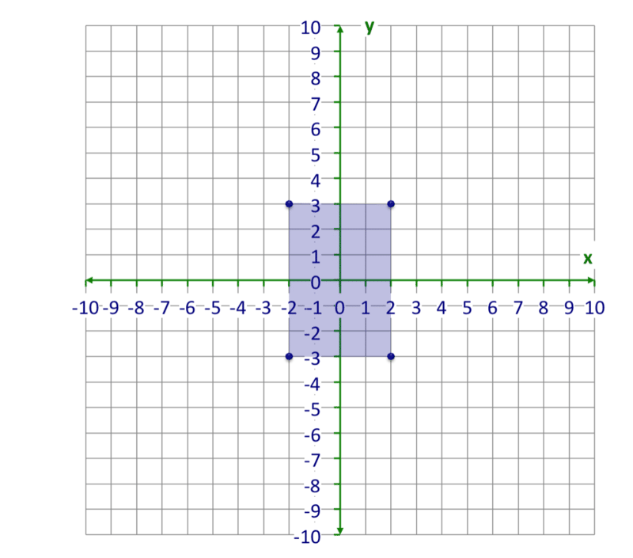

Suppose we want to make an enlargement of the rectangle above using a scale factor of 3. We need to multiply each coordinate by 3.

$$
\begin{align*}
& (-2,-3) \ (-2,3) \ (2,3) \ (2,-3)\\
& \times 3\\
& (-6,-9) \ (-6,9) \ (6,9) \ (6,-9)
\end{align*}
$$

**Now we can graph it on the coordinate plane.**

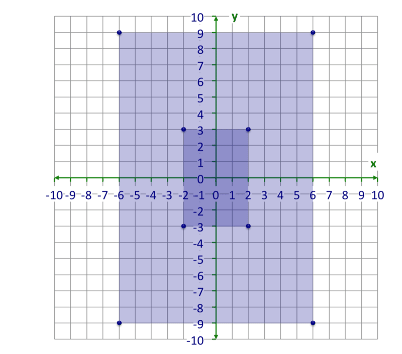

Example

_Graph a reduction of the following figure if the scale factor is 2._

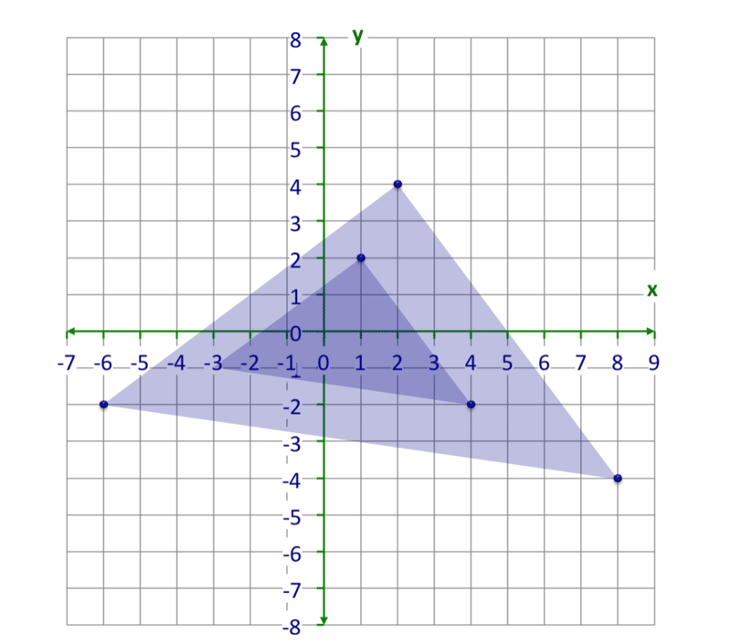

$$
\begin{align*}
(2, 4) \div 2 &= (1, 2)\\
(8, -4) \div 2 &= (4, -2)\\
(-6, -2) \div 2 &= (-3, -1)
\end{align*}
$$

Now let’s look back at the problem from the introduction and see how similar figures can help us to solve this problem.

Real-Life Example Completed
---------------------------

**_The Log Cabin_**

**Here is the original problem once again. Reread it and then solve the problem for the plan dimensions.**

Sherri decided to do her project on a log cabin. Mrs. Patterson suggested that she choose a time period to work with because log cabins have been being built for a long time. Years ago, they were quite small, but today, log cabins can be designer homes too.

“Mrs. Patterson, I am going to focus on a log cabin from the 1800’s,” Sherri said taking out a book that she found at the library on log cabins.

“That is a great idea. What was the average size of a log cabin in 1800?” Mrs. Patterson asked.

“What do you mean?”

“I mean the square footage. How many feet wide was the average house and how many feet long?” Mrs. Patterson explained.

“Oh, I get it. The average house was $20 \times 40 \ feet$. So the average was 800 square feet,” Sherri said.

“Terrific, now make sure that your plan shows that,” Mrs. Patterson said walking away.

Sherri is puzzled. She knows that the shape of the log cabin is a rectangle given the length and width. She knows the area of the house. To create a plan, she will need to create a dilation. Sherri decides that she will use a scale factor of $\frac{1}{16}$. Given this information, what will the dimensions be of her house plan?

**_Solution to Real – Life Example_**

**To solve this problem, we begin with the actual dimensions of the log cabin. The log cabin has real – world dimensions of $20 \times 40 \ feet$.**

**Sherri is using a scale factor of $\frac{1}{16}$. That means that the dilation will be a reduction. We divide both dimensions by 16.**

$$
\begin{align*}
20 \div 16 &= 1.25 \ ft.\\
40 \div 16 &= 2.5 \ ft
\end{align*}
$$

**The dimensions of Sherri’s plan will be $1.25 \ ft \ wide \times 2.5 \ ft \ long$.**

Vocabulary
----------

Here are the vocabulary words that are found in this lesson.

__Congruent__

having the same size, shape and measure.

__Similar__

having the same shape, but not the same size. Angle measures are the same and side lengths are proportional.

__Proportional__

the side lengths create ratios that form a proportion.

__Indirect Measurement__

using similar triangles to figure out challenging distances or lengths.

__Dilation__

to reduce or enlarge a figure according to a scale factor.

__Scale Factor__

the ratio that compares the lengths of corresponding sides to each other. That comparison is the scale factor.

Time to Practice
----------------

Directions: Identify whether or not each pair of triangles is similar based on the ratios of their sides.

1.  Triangle $A$ has side lengths of 2, 4, and 6. Triangle $B$ has side lengths of 6, 12 and 24. Are these triangles similar?
2.  Triangle $C$ has side lengths of 4, 5, and 10. Triangle $B$ has side lengths of 2, 2.5 and 5. Are these two triangles similar?
3.  Triangle $D$ has side lengths of 5, 8, and 12. Triangle $B$ has side lengths of 10, 16 and 24. Are these two triangles similar?
4.  Triangle $A$ has side lengths of 10, 12, and 14. Triangle $B$ has side lengths of 5, 7 and 9. Are these two triangles similar?
5.  Triangle $B$ has side lengths of 8, 14, and 20. Triangle $C$ has side lengths of 4, 7 and 10. Are these two triangles similar?
6.  Triangle $E$ has side lengths of 20, 11 and 8. Triangle $F$ has side lengths of 10, 5.5 and 5. Are these two triangles similar?
7.  Triangle $G$ has side lengths of 6, 8 and 12. Triangle $H$ has side lengths of 18, 24 and 36. Are these two triangles similar?
8.  Triangle $I$ has side lengths of 8, 12, and 16. Triangle $J$ has side lengths of 4, 8 and 10. Are these two triangles similar?

Directions: Find the missing length by looking at each series of ratios. The top value represents the side lengths of the first similar triangle. The bottom value represents the side lengths of the second similar triangle.

9.  $\frac{1}{2}=\frac{3}{6}=\frac{9}{x}$
10. $\frac{3}{6}=\frac{6}{12}=\frac{10}{x}$
11. $\frac{4}{2}=\frac{10}{x}=\frac{12}{6}$
12. $\frac{6}{2}=\frac{9}{x}=\frac{12}{4}$
13. $\frac{5}{10}=\frac{10}{20}=\frac{15}{x}$
14. $\frac{12}{6}=\frac{20}{10}=\frac{15}{x}$
15. $\frac{16}{x}=\frac{20}{5}=\frac{24}{6}$

Directions: Use each scale factor to determine the new dimensions of each figure.

16. A triangle with side measures of 4, 5, 9 and a scale factor of 2.
17. A triangle with side measures of 8, 10, 14 and a scale factor of 3.
18. A triangle with side measures of 2, 4, 6 and a scale factor of 2.
19. A quadrilateral with side measures of 4, 6, 8, 10 and a scale factor of $\frac{1}{2}$
20. A quadrilateral with side measures of 9, 12, 18, 24 and a scale factor of $\frac{1}{3}$

</article>

## 7.0 Using Real Numbers and Right Triangles

<article>

</article>

### 7.1 Radical Expressions

<article>

Introduction
------------

**_The Food Drive_**

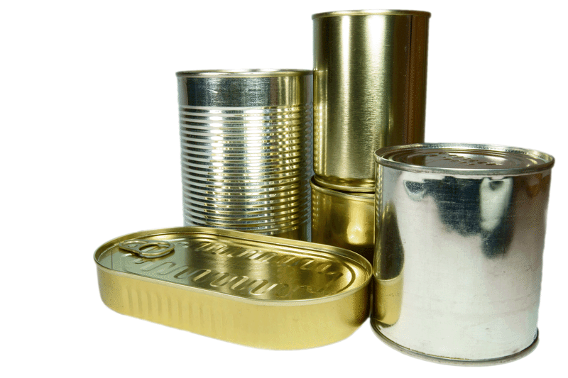

Mrs. Garibaldi’s class held a canned-food drive to aid a local relief shelter. Juan was the team leader. He sent out a notice for each family to begin gathering food in the beginning of November. He figured that they could collect all of their cans by Thanksgiving and provide some families with extra food for the holidays.

They collected 121 cans for the shelter. Many different types of canned food was collected. Juan calculated that the number of cans containing vegetables was equal to $121^{\frac{1}{2}}+14$.

“How many cans contained vegetables?” Margaret asked Juan at lunch.

Juan simply smiled and wrote his expression on a piece of paper.

“That is a weird way to write it!” she said. “I still don’t know how many cans contained vegetables!”

**Do you know? This lesson will work with fractional exponents and radicals. At the end of the lesson, you will know how to help Margaret figure things out.**

**_What You Will Learn_**

In this lesson you will learn how to execute the following skills.

* Evaluate radical expressions involving perfect squares and perfect cubes.
* Approximate square roots and cube roots using rounding, calculators or tables.
* Recognize the equivalence of radical expressions and fractional powers.
* Solve equations involving radicals.
* Model and solve real – world problems involving radical expressions.

**_Teaching Time_**

I. **Evaluate Radical Expressions Involving Perfect Squares and Perfect Cubes**

Do you remember **_exponents?_** **An exponent is a number that raises a base to a power.** We can recognize exponents because they are little numbers next to larger numbers. The little number is the **_exponent_** and the large number is the **_base_**. The exponent tells you how many times to multiply a base by itself.

Look at this example.

Example

$7^2$

**This means that we multiply the base of 7 by itself two times. This is how we evaluate a power.**

$7 \times 7 = 49$

**This is the answer.**

**We can also perform an operation that is the opposite of raising a number to a power; we can find the root of a number. This is an expression that is the opposite of raising a number to a power. We call it a** **_root_** **or a** **_radical._**

When you see a number that looks like this, $\overset{}{\overline{ ) {16}}}$, this means that we are looking for the root of the number that is inside the radical symbol.

**Now let’s look at how we can work with roots and radicals.**

Think about the example above.

Example

$7^2 = 7 \times 7 = 49$

**If we use verbal language to explain this, we can say that seven** **_squared_** **is equal to 49. When the exponent is a 2, we can say that the number is squared because it is multiplied by itself.**

**We can work in the opposite of squaring, and find the square root of a number.**

Example

$\overset{}{\overline{ ) {49}}}$

**When we see a number inside the radical symbol, we are looking to figure out the square root of that number. In other words, what times itself two times is equal to the value inside the radical symbol.**

**The answer is 7 because 7 squared is equal to 49.**

**We can also cube a number. When a number is** **_cubed_****, the exponent is a 3. This means that we multiply the base by itself three times.**

Example

$2^3$

**This means that we multiply the base two by itself three times.**

$2 \times 2 \times 2 = 8$

**We can also find the** **_cube root_** **of a number.**

Example

$\sqrt[3]{8}$

**When looking for a cube root, we are looking for a value that we can multiply by itself three times.**

**The cube root of 8 is 2.**

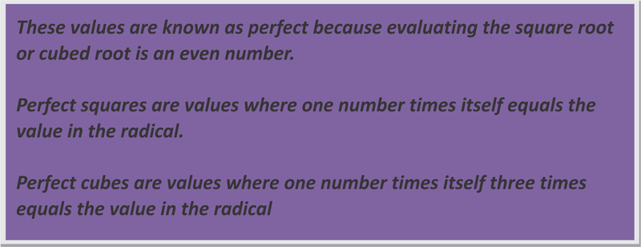

Example

_Is 64 a perfect square? Is it a perfect cube?_

**To figure this out, we need to look and see if there is one number that we can multiply by itself to equal 64. This means that we are looking for the square root of 64.**

**Let’s evaluate this radical expression.**

$\overset{}{\overline{ ) {64}}}=8$

**Since $8^2 = 64$, 64 is a perfect square.**

**Now is it a perfect cube? To figure this out, we need to see if there is a value that when cubed is equal to 64.**

$\sqrt[3]{64}=4$

**Since $4 \times 4 \times 4 = 64$, 64 is a perfect cube.**

**64 is a perfect square and a perfect cube.**

Example

_Is 40 a perfect square?_

**To figure this out, we need to figure out the square root of 40.**

**Let’s evaluate this radical expression.**

$\overset{}{\overline{ ) {40}}}$

**There is not a number that when squared is equal to 40 without any remainders, so 40 is not a perfect square.**

II. **Approximate Square Roots and Cube Roots Using Rounding, Calculators or Tables**

Roots are pretty easy to find when the numbers are perfect squares or perfect cubes. When you can’t find a root that easily squares or cubes, you will need to use a different method. If you just need to estimate a square root, you can identify which two numbers a root would be between.

If you need more information, you can refer to a table that shows square roots, or use a calculator to find an exact decimal point.

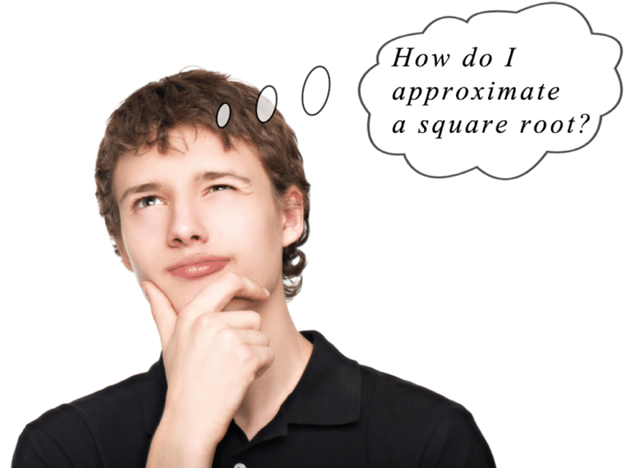

Example

_Evaluate_ $\sqrt{30}$

**We know by looking at 30 that it is not a perfect square. Therefore, we will need to approximate the square root. We can do this by figuring out the two values that the square root will be between.**

**Which values squared will equal a number close to 30?**

$$
\begin{align*}
5^2 &= 25\\
6^2 &= 36
\end{align*}
$$

**We can say that the square root of 30 is between 5 and 6. Since 25 and 36 are almost the same number of units apart, we can say that an approximate answer for the square root of 30 is 5.5.**

Example

_Evaluate_ $\overset{}{\overline{ ) {62}}}$

**Let’s think about the two values that the square root of 62 will be between because 62 is not a perfect square.**

$$
7 \times 7 = 49\\
8 \times 8 = 64
$$

**We can say that the answer will be between 7 and 8, but very close to 8 because 64 is very close to 62.**

**Sometimes, you will want an answer that is exact. An approximate answer will not work, when this happens, you will need to use a calculator or a table. There are tables that will tell you the exact square root of a number.**

Example

_Use your calculator to find the value of $\sqrt{42}$._

Type the square root symbol and 42 to find the square root of 42 on your calculator.

**The result shown is 6.48074069840786. You can round this to the nearest hundredth and record the value as 6.48.**

**If you wanted to use a table, you can find one in a textbook or on the computer. There are many websites where they will give the square root of numbers from 1 to 100. Here is one such website, http://www.factmonster.com/ipka/A0875883.html.**

Now let’s look at an example.

Example

_Evaluate_ $\overset{}{\overline{ ) {11}}}$.

**Using the table, we can see that the square root of 11 is 3.317.**

III. **Recognize the Equivalence of Radical Expressions and Fractional Powers**

We began this lesson by looking at statements of equivalence.

Example

$$
\begin{align*}
7^2 &= 49\\
\overset{}{\overline{ ) {49}}}&=7
\end{align*}
$$

**We can also make a connection between radical expressions and** **_fractional powers._** **A** **_fractional power_** **is when the exponent is in the form of a fraction. Square roots and cube roots can also be represented by fractional exponents. If a number is raised to the power of $\frac{1}{3}$, it is the same as taking the cube root. Similarly, if a number is raised to the power of $\frac{1}{2}$, it is the same as taking the square root.**

Example

_Elena was asked to find the value of $27^{\frac{1}{3}}$. How should Elena find this value?_

**The first step Elena should take is to convert the fractional exponent to a root. Since the fraction is $\frac{1}{3}$, she will need to find the cube root of 27 to solve the problem.**

$27^{\frac{1}{3}}=\sqrt[3]{27}$

**To simplify the cube root, Elena should think of a number that, when multiplied three times in a row, yields 27.**

**If you multiply $3 \times 3 \times 3$, the product is 27. So, the cube root of 27 is 3.**

$27^{\frac{1}{3}}=\sqrt[3]{27}=3$

**The answer is 3.**

Example

_Birgit needs to solve the equation $x=81^{\frac{1}{2}}$. How can she find the value of $x$?_

**Birgit should realize that raising something to the power of $\frac{1}{2}$ is the same as taking the square root. So, Birgit simply needs to find the square root of 81 to find the value of $x$.**

**To find the square root of 81, Birgit could use her calculator, or think about what number, when multiplied by itself, will yield a product of 81.**

**Since $9 \times 9=81$, the square root of 81 is 9.**

**In the equation $x=81^{\frac{1}{2}}, x=9$.**

IV. **Solve Equations Involving Radicals**

We can also see radicals in an equation. When we have a radical in an equation, we can solve the equation by using what we have learned about squares and square roots. Let’s look at an example.

Example

$x^2=100$

**To solve this equation let’s think about what we know. We know that a value times itself is going to equal 100. Up until this point we have solved equations by using the inverse operation. We can use that again here too. The variable is squared; we want to get it by itself by using an inverse operation. The inverse of squaring a number is to find the square root of the number. Let’s see what happens if we find the square root of both sides of the equation.**

$\sqrt{x^2}= \sqrt{100}$

**The exponent 2 and the radical cancel each other out because they are inverses of each other. Let’s cross them out.**

$\sqrt{x^2}=\sqrt{100}$

**Now are left with:**

$$
\begin{align*}
x&=\sqrt{100}\\
x&=10
\end{align*}
$$

**This is the answer.**

V. **Model and Solve Real – World Problems Involving Radical Expressions**

We can find radical expressions in real – world problems too. As always, when you face complicated word problems, carefully identify the important information and set up an equation. Remember to translate phrases into mathematical expressions carefully. Always use common sense when figuring out complicated situations. Once you have an equation, use inverse operations to solve for the variable.

_Mario and his brother have built a garden bed with an area of 144 square feet. If the shape of the garden is a square, then what is the length of one side of the garden? What is the perimeter of this garden?_

**First, we have to break down what we know about the garden. We know the area.**

$A = 144 \ sq.feet$

**We also know that the formula for area is $s^2$.**

**Now we can write an equation to figure out the first part of the problem, the length of one of the sides.**

$s^2=144 \ sq.feet$

**If we take the square root of both sides, then we will be able to solve for the value of the side of the garden.**

$$
\begin{align*}
sqrt{s^2} &= \sqrt{144}\\
s&=12 \ feet
\end{align*}
$$

**The length of one of the sides of the garden is 12 feet.**

**Next, we need to figure out the perimeter of the garden.**

$P=4s$

**Let’s substitute in the known value for the side of the garden.**

$P=4(12)$

**The perimeter of the garden is 48 square feet.**

**Now let’s go back and figure out the problem from the introduction.**

Real-Life Example Completed
---------------------------

**_The Food Drive_**

**Here is the problem from the introduction. Reread it and then solve the problem at the end.**

The eighth grade student council decided that the theme for the school year would be “Helping Hands.” With this theme, the whole year would focus the eighth graders around different community service projects. When the president of the class, Margaret, proposed this to the student body, the students were all very excited. They decided to let each home room figure out what project they were each going to focus on.

Mrs. Garibaldi’s class held a canned-food drive to aid a local relief shelter. Juan was the team leader. He sent out a notice for each family to begin gathering food in the beginning of November. He figured that they could collect all of their cans by Thanksgiving and provide some families with extra food for the holidays.

They collected 121 cans for the shelter. Many different types of canned food was collected. Juan calculated that the number of cans containing vegetables was equal to $121^{\frac{1}{2}}+14$.

“How many cans contained vegetables?” Margaret asked Juan at lunch.

Juan simply smiled and wrote his expression on a piece of paper.

“That is a weird way to write it!” she said. “I still don’t know how many cans contained vegetables!”

**_Solution to Real – Life Example_**

**To create an equation for this scenario, it is important to first identify the variable. The unknown in this problem is the number of cans that contain vegetables. We can name that quantity $c$.**

**The problem tells us that $c$ is equal to the expression $121^{\frac{1}{2}}+14$. So we can write an equation with $c$ on one side and $121^{\frac{1}{2}}+14$ on the other.**

$c=121^{\frac{1}{2}}+14$

**To solve this equation, you can simplify the exponent and add. We know that when a number is raised to the power of $\frac{1}{2}$, it is the same as finding the square root. So, the equation can be rewritten.**

$c=\sqrt{121}+14$

**The square root of 121 is 11, since $11 \times 11=121$. So, the equation becomes even simpler.**

$c=11+14$

**Since $11+14=25$, the value of $c$ is 25.**

$c=25$

**The number of cans that contained vegetables in Mrs. Garibaldi’s class was 25.**

Vocabulary
----------

Here are the vocabulary words from this lesson.

__Exponent__

the little number that represents a power. It tells you how many times to multiply the base by itself.

__Base__

the number being raised to a power. It is the large number next to an exponent.

__Radical Expression__

a number inside a radical where you will need to find the root of a number.

__Squared__

an exponent of 2, tells you to multiply the base by itself.

__Cubed__

an exponent of 3, tells you to multiply the base by itself three times.

__Cube Root__

to find a value that when multiplied by itself three times is equal to the value inside the radical.

__Perfect Square__

A number that is a square of a whole number.

__Perfect Cube__

a number that is the cube of a whole number.

__Fractional Power__

an exponent in fraction form. A fractional exponent of $\frac{1}{2}$ is the same as the square root of a number. A fractional exponent of $\frac{1}{3}$ is the same as the cube root of a number.

Time to Practice
----------------

Directions: Evaluate each radical expression.

1.  $\overset{}{\overline{ ) {16}}}$
2.  $\overset{}{\overline{ ) {25}}}$
3.  $\overset{}{\overline{ ) {81}}}$
4.  $\overset{}{\overline{ ) {121}}}$
5.  $\overset{}{\overline{ ) {36}}}$
6.  $\overset{}{\overline{ ) {169}}}$
7.  $\sqrt[3]{125}$
8.  $\sqrt[3]{64}$
9.  $\sqrt[3]{27}$
10. $\overset{}{\overline{ ) {144}}}$

Directions: Approximate each square root by listing the two values that the square root can be found between.

11. $\overset{}{\overline{ ) {12}}}$
12. $\overset{}{\overline{ ) {15}}}$
13. $\overset{}{\overline{ ) {20}}}$
14. $\overset{}{\overline{ ) {22}}}$
15. $\overset{}{\overline{ ) {31}}}$
16. $\overset{}{\overline{ ) {90}}}$
17. $\overset{}{\overline{ ) {99}}}$

Directions: Evaluate each fractional power.

18. $64^{\frac{1}{3}}$
19. $16^{\frac{1}{2}}$
20. $144^{\frac{1}{2}}$
21. $81^{\frac{1}{2}}$
22. $9^{\frac{1}{2}}$

Directions: Solve each equation involving radical expressions.

23. $x^2=121$
24. $x^3=27$
25. $x^2+3=147$
26. $x^2-2=23$
27. $x^2+11=47$

</article>

### 7.2 Rational and Irrational Numbers

<article>

Introduction
------------

**_The Circular Garden_**

“We need more dirt,” Sam said soon after the clean-up had begun.

“I think so too,” said Kyle.

Candice went out to assess the situation. The rain and snow of the winter and early spring had left the ground sparse. There definitely was not enough dirt to plant in. Candice began to figure out the area of the circular garden.

She knew that the formula for area is $A = \pi r^2$. The diameter of the garden is 16 feet.

**That is as far as Candice got. She couldn’t remember the next step. This is where you come in. Using irrational numbers is necessary to solve this problem. But first, you should understand what we mean when we say “irrational number”.**

**_What You Will Learn_**

In this lesson you will learn how to complete the following skills.

* Classify real numbers as whole numbers, integers, rational numbers (including terminating and repeating decimals) or irrational numbers.
* Compare and order real numbers on a number line.
* Approximate solutions to equations involving irrational numbers.
* Solve real – world problems involving rational and irrational numbers.

**_Teaching Time_**

I. **Classify Real Numbers as Whole Numbers, Integers, Rational Numbers (Including Terminating and Repeating Decimals) or Irrational Numbers**

There are many different ways to classify or name numbers. **All numbers are considered** **_real numbers._** When you were in the lower grades, you worked with **_whole numbers._** **Whole numbers are counting numbers. We consider whole numbers as the set of numbers $\{0, 1, 2, 3, 4 \ldots \}$**. In middle school, you may also have learned about **_integers_**. **The set of integers includes whole numbers, but also includes their opposites.** Therefore, we can say that whole positive and negative numbers are part of the set of integers $\{ \ldots -2, -1, 0, 1, 2, 3 \ldots \}$.

We can’t stop classify numbers with whole numbers and integers because sometimes we can measure a part of a whole or a whole with parts. These numbers are called **_rational numbers._** **A rational number is any number that can be written as a fraction where the numerator or the denominator is not equal to zero.** Let’s think about this. A whole number or an integer could also be a rational number because we can put it over 1. Look at this example.

Example

\-4 could be written as $-\frac{4}{1}$, therefore it is an integer, but also a rational number.

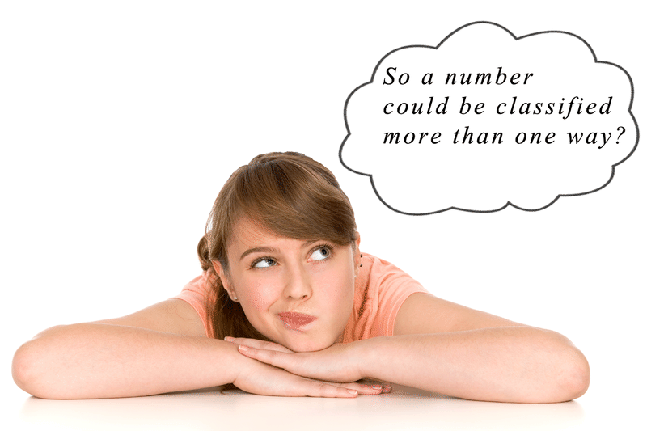

**There are two special types of decimals that are considered rational numbers and one kind of decimal that is NOT a rational number. A** **_terminating decimal_** is a decimal that is considered to be a rational number. **A terminating decimal is a decimal that looks like it goes on and on, but at some point has an end.** It terminates or ends somewhere.

.3456798

This is a terminating decimal. It goes on for a while, but then ends.

A **_repeating decimal_** is also considered a rational number. **A repeating decimal has values that repeat forever.**

.676767679...

This is a repeating decimal.

$. We use 3.14 to represent $\pi$, but you should know that $pi$ is an irrational number meaning that it goes on and on and on forever.**")

**How can we determine if a fraction or a decimal is rational or irrational?**

If a number can be written in fraction form then it is rational. If a number cannot be written in fraction form then it is irrational. Besides $\pi$, roots of many numbers are also examples of irrational numbers. For example, $\sqrt{2}$ and $\sqrt{3}$ are both irrational numbers.

Example

_Is $\frac{23}{4}$ rational or irrational?_

Because the number is written as a fraction, it must be **a rational number.**

Example

_Is $\sqrt{7}$ a rational or an irrational number?_

To figure this out, we convert this fraction to a decimal on our calculator.

$\sqrt{7}=2.645751311...$

This decimal doesn't end or repeat. **This is an irrational number.**

II. **Compare and Order Rational Numbers on a Number Line**

You have used number lines to compare numbers before. They can be extremely helpful in comparing the values of different numbers, including irrational numbers. The best strategy is to convert each individual value to a decimal. In the case of irrational numbers, you will have to round them to a reasonable place value. Once the numbers are decimals, you can easily compare them on a number line. Remember when you find the solutions to these types of problems that after you order the values, you should convert them back into their original form.

Example

_Place the following values on a number line: $-3.2, \sqrt{2}, 2.\overline{3}, \sqrt{9}$._

**First find the decimal values of each number.**

The number -3.2 is already a decimal.

The number $\sqrt{2}$ is an irrational number. Its decimal, rounded to the nearest thousandth, is 1.414.

The number $2.\overline{3}$ is a rational number because it is a repeating decimal. It is equivalent to the fraction $\frac{7}{3}$.

The number $\sqrt{9}$ simplifies to 3, since $3^2$ is equal to 9.

**Then you can place these values on a number line.**

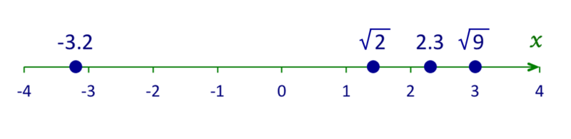

III. **Approximate Solutions to Equations Involving Irrational Numbers**

Sometimes, you will need to find estimates of irrational numbers to solve an equation. The easiest way to do this is to find a decimal value on your calculator that is close to the irrational number. Remember that the more decimal points you include, the more accurate your answer will be. For these purposes, it is usually okay to round an irrational number to the nearest hundredth or thousandth. Once you have found the decimal approximate, solve the equation normally. It is crucial to use words or signage to show that your answer is approximate, not exact. The symbol $\approx$ means approximately equal to, and is more appropriate than an equals sign in these situations.

Example

_Solve for $a$: $a=4 \pi$._

**First find a decimal approximation for $\pi$ using your calculator. The value of $\pi$ is 3.1415927... This can be rounded to 3.14 for these purposes.**

**To solve the equation, multiply 3.14 by 4. This will be the approximate value of $a$.**

$3.14 \times 4=12.56$

**So the value of $a$ is approximately 12.56. $a \approx 12.56$**

Example

_Solve for $y$: $12-\sqrt{7}=y$._

**First find a decimal approximation for $\sqrt{7}$ using your calculator. The value of $\sqrt{7}$ is 2.64575... This can be rounded to 2.65 for these purposes.**

**To solve the equation, subtract 2.65 from 12. This will be the approximate value of $y$.**

$12-2.65=9.35$

**So, the value of $y$ is approximately 9.35.** $y \approx 9.35$

IV. **Solve Real – World Problems Involving Rational and Irrational Numbers**

Irrational and rational numbers will show up in real-world problems just like any other mathematical concept. Remember to translate the phrases carefully into mathematical expressions and equations. If necessary, you can convert the irrational numbers into approximated decimals to find the missing values. Remember to solve equations carefully and always keep them balanced.

**A common place where you will see irrational numbers is when you are working with circles or spheres. Since pi is related to a circle, you will need to work with irrational numbers when solving problems involving circles.**

Example

_Henrietta knew that to find the circumference of a circle, she needed to multiply the diameter by $\pi$. If the diameter of Henrietta’s circle is 6 inches, what is the approximate circumference of the circle?_

First, translate the information in the problem into an equation. Let $C$ equal the circumference.

$$
C=\pi \times 6
$$

The value of $\pi$ is 3.1415927... Rounded to the nearest hundredth, this value is 3.14. You can substitute this value back into the equation to find the value of $C$. Remember to use the approximately equals sign after you make this estimation.

$$
\begin{align*}
C&=\pi \times 6\\
C &\approx 3.14 \times 6\\
C &\approx 18.84
\end{align*}
$$

**The circumference of Henrietta’s circle is approximately 18.84 inches.**

**Now let’s use what we have learned on the problem from the introduction.**

Real-Life Example Completed
---------------------------

**_The Circular Garden_**

**Here is the original problem from the introduction. Reread it and then solve the problem for the area of the circle.**

In the front of Kenneth Graham Middle School there is a flag with a circular garden beneath it. The students in Mr. Kennedy’s homeroom decided that this circular garden would be their community service project. The students elected Candice the leader of the project and she got right to work organizing the decorating. She asked for a group of students to plant flowers and rake the leaves left from last autumn. It was a perfect spring project.

“We need more dirt,” Sam said soon after the clean-up had begun.

“I think so too,” said Kyle.

Candice went out to assess the situation. The rain and snow of the winter and early spring had left the ground sparse. There definitely was not enough dirt to plant in. Candice began to figure out the area of the circular garden.

She knew that the formula for area is $A = \pi r^2$. The diameter of the garden is 16 feet.

**_Solution to Real – Life Example_**

**First, let’s take the measurement for the diameter and figure out the measurement of the radius. The radius is one-half of the diameter.**

$$
\begin{align*}
16 \ feet &= diameter\\
8 \ feet &= radius
\end{align*}
$$

**Now we can substitute this into the formula and solve. We will use 3.14 for $\pi$ because it is an irrational number.**

$$
\begin{align*}
A &= \pi r^2\\
A &= (3.14)(8^2)\\
A &= 200.96 \ sq. feet
\end{align*}
$$

Vocabulary
----------

Here are the vocabulary words that are found in this lesson.

__Whole Numbers__

the set of positive counting numbers.

__Integers__

the set of whole numbers and their opposites.

__Rational Numbers__

any number that can be written in fraction form including terminating and repeating decimals.

__Irrational Numbers__

any number that cannot be written in fraction form. Numbers that do not have an end point when written in decimal form – the decimal values continue indefinitely. These numbers do not fit into the set of rational numbers.

__Pi__

$\pi$, the ratio of the diameter to the circumference of a circle. We use 3.14 to represent this irrational number.

__Real Numbers__

the set of rational and irrational numbers make up the set of real numbers.

Time to Practice
----------------

Directions: Classify each of the following numbers as real, whole, integer, rational or irrational. Some numbers will have more than one classification.

1.  3.45
2.  \-9
3.  1,270
4.  1.232323
5.  $\frac{4}{5}$
6.  \-232,323
7.  \-98
8.  1.98
9.  $\sqrt{16}$
10. $\sqrt{2}$

Directions: Answer each question as true or false.

11. An irrational number can also be a real number.
12. An irrational number is a real number and an integer.
13. A whole number is also an integer.
14. A decimal is considered a real number and a rational number.
15. A negative decimal can still be considered an integer.
16. An irrational number is a terminating decimal.
17. A radical is always an irrational number.
18. Negative whole numbers are integers and are also rational numbers.
19. Pi is an example of an irrational number.
20. A repeating decimal is also a rational number.

Directions: Approximate the solution for each equation given the irrational numbers.

21. $\sqrt{2}+5=x$
22. $8 = \sqrt{2} + x$
23. $t=\pi-5.3$
24. $\sqrt{h}=\sqrt{6}-\frac{3}{4}$
25. Mrs. DeFazio wrote the following equation on the board. $w=\sqrt{11}-2^2$ What is the value of $w$ in Mrs. DeFazio’s equation?

</article>

### 7.3 The Pythagorean Theorem

<article>

Introduction
------------

**_The Painting Project_**

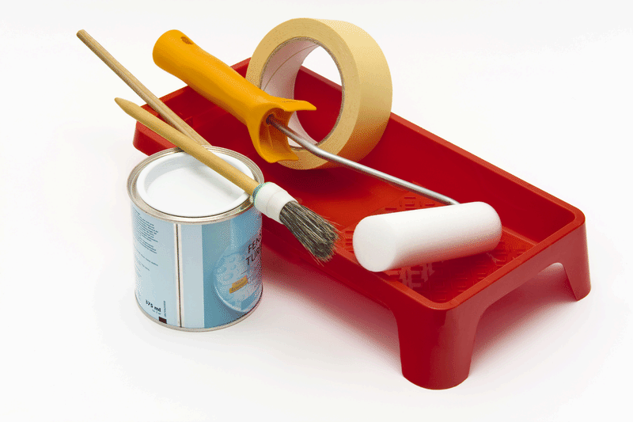

“That thing hasn’t been painted in decades,” Karen said in the first meeting.

“I agree, it does look awful,” Cameron added.

“Well, I don’t know about decades, but it does need to be painted, so that is what we are going to do. Now to work on this project, we will need to choose a ladder that will reach up high enough. How can we figure this out?” Ms. Richardson asked.

The class was silent.

“I have an idea,” Veria said smiling. “It has to do with triangles. We need to figure out the height of the ladder, compared to the height of the building.”

“Yes, but don’t forget that the ladder reaches out from the building, not up against it. So we have to consider that measurement too,” Aran chimed in.

“What can we use to figure that out?” Karen asked.

Once again, the group was silent.

**A mathematical formula is needed to solve this problem. The students have their work cut out for them. So do you. Pay attention to this lesson so that you can explain the formula that they will need and why they will need it.**

**_What You Will Learn_**

By the end of this lesson, you will be able to perform the following skills.

* Derive the Pythagorean Theorem.
* Use the Pythagorean Theorem to find missing dimensions of right triangles.
* Derive the converse of the Pythagorean Theorem.
* Use the converse of the Pythagorean Theorem to identify right triangles.

**_Teaching Time_**

I. **Derive the Pythagorean Theorem**

You have probably already studied many different types of triangles. **_Acute triangles_** **have angles that are all less than $90^{\circ}$.** **_Obtuse triangles_** **have one angle that is between $90^{\circ}$ and $180^{\circ}$.** **_Right triangles_** **have one angle that measures exactly $90^{\circ}$—in other words, it has one right angle.**

This lesson focuses entirely on properties specific to right triangles. While all of the equations and strategies you are about to learn are helpful, they apply only to right triangles – they will not work with acute or obtuse triangles.

**To begin, let’s look at the parts of a right triangle.**

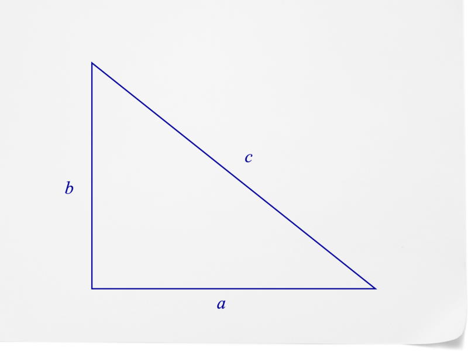

One of the special characteristics of right triangles is described by the **_Pythagorean Theorem_**, thought to have been developed around 500 B.C.E. It states that the squared value of the hypotenuse will equal the sum of the squares of the two legs. In the triangle above, the sum of the squares of the legs is $a^2 + b^2$ and the square of the hypotenuse is $c^2$. So, the Pythagorean theorem is commonly represented as $a^2 + b^2 = c^2$ where $a$ and $b$ are the legs of the right triangle and $c$ is the hypotenuse.

**The** **_Pythagorean Theorem_** **is known as** $a^2 + b^2 = c^2$.

You may be asking yourself why that is the case. Well, we can think about the Pythagorean Theorem in terms of a square. We know that there is a relationship between a square and a right triangle. We can divide a square with a diagonal and because a square has four right angles, the diagonal will divide the square into two right triangles. Now because a right triangle comes from the square, the sides will also be related to the square. This is where the Pythagorean Theorem comes from.

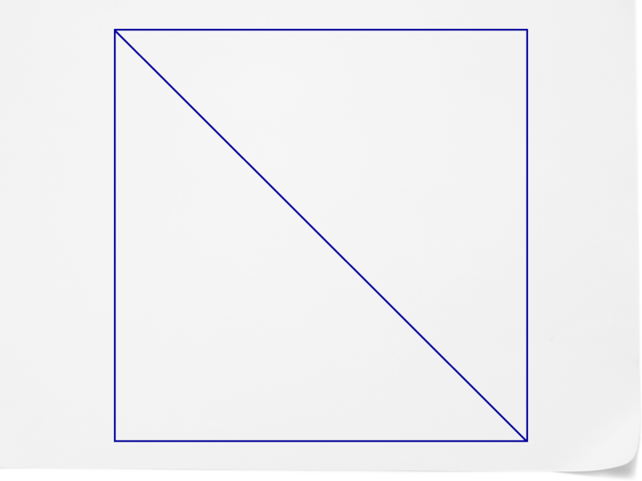

Example

_Use the measures of the triangle below to test the Pythagorean theorem._

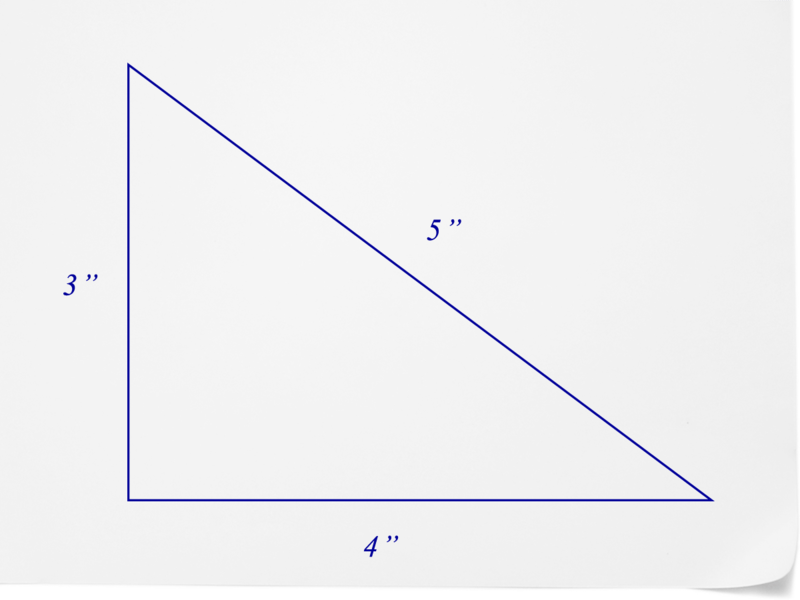

$$
\begin{align*}
a^2 + b^2 &= c^2\\
3^2 + 4^2 &= 5^2\\
(3 \times 3) + (4 \times 4) &= (5 \times 5)\\
9 + 16 &= 25\\
25 &= 25
\end{align*}
$$

Since both sides of the equation equal 25, the equation is true. Therefore, the Pythagorean theorem worked on this right triangle.

**This combination of numbers (3, 4, 5) is referred to as a** **_Pythagorean triple_****. In other words, these three numbers work together to make the Pythagorean Theorem true.** Throughout this chapter, you will learn about other Pythagorean triples as well.

II. **Use the Pythagorean Theorem to Find Missing Dimensions of Right Triangles**

Now that you have learned how to derive and execute the Pythagorean Theorem, there are many different ways to apply it. Any time you have two out of three sides in a right triangle, you can find the third using the equation $a^2 + b^2 = c^2$, where $a$ and $b$ are the lengths of the legs of the triangle and $c$ is the length of the hypotenuse.

When applying the Pythagorean Theorem, be sure to use exponents and square roots accurately.

Example

_What is the length of $b$ in the triangle below?_

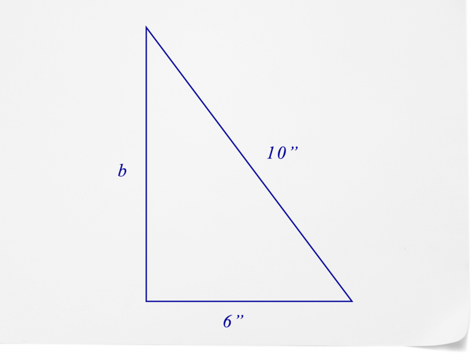

$a^2 + b^2 = c^2,$ where $a = 6$ and $c = 10$

$$
\begin{align*}
6^2 + b^2 &= 10^2\\
36 + b^2 &= 100\\
36 + b^2 - 36 &= 100-36\\
b^2 &= 64\\
\sqrt{b^2} &= \sqrt{64}\\
b &= 8
\end{align*}
$$

**The length of the missing side is 8 inches.**

You already know about the Pythagorean triple 3:4:5. Notice that this triangle is proportional to that ratio. If you divide the lengths of the triangle in the example by two, you find the same proportion—3:4:5. Whenever you find a Pythagorean triple, you can apply those ratios with greater factors as well. So, 6, 8, 10 is another Pythagorean triple.

Example

_Find the length of the missing side in the triangle below._

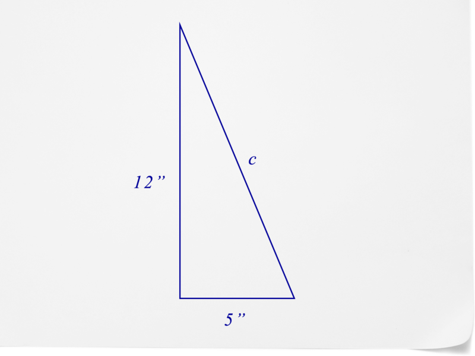

$a^2 + b^2 = c^2,$ where $a = 5$ and $b = 12$

$$
\begin{align*}
5^2 + 12^2 &= c^2\\
25 + 144 &= c^2\\
169 &= c^2\\
\sqrt{169} &= \sqrt{c^2}\\
13 &= c
\end{align*}
$$

**The length of the missing side is 13 centimeters.**

Notice that as long as you use the Pythagorean Theorem you can figure out the missing length of any of the three sides of a right triangle.

III. **Derive the Converse of the Pythagorean Theorem**

If you use logic when thinking about the Pythagorean Theorem, there are many ways that you might find it useful. Always see how your knowledge might be applied to help you on a tough problem.

Example

_Classify the triangle below as acute, right, or obtuse._

 are relatively close in length. The third side (8) is about half the length of the two longer sides.**")

**To see if the triangle might be right, try plugging the values into the Pythagorean theorem to see if it makes it true. The hypotenuse is always the longest side, so 17 should be set equal to $c$. The other two values can represent $a$ and $b$.**

$$
\begin{align*}
a^2 + b^2 &= c^2\\
8^2+15^2&=17^2\\
(8 \times 8) + (15 \times 15) &= (17 \times 17)\\
64 + 225 &= 289\\
289 &= 289
\end{align*}
$$

**Since both sides of the equation are equal, the Pythagorean Theorem is true.**

Therefore, the triangle described in the problem is a right triangle. We can use this logic to determine whether a triangle is a right triangle or not. **Using this logic is referred to as using the converse of the Pythagorean Theorem. The Pythagorean theorem states that in a right triangle, $a^2 + b^2 = c^2$. The converse of the Pythagorean theorem states that if $a^2 + b^2 = c^2$, the triangle is a right triangle.**

IV. **Use the Converse of the Pythagorean Theorem to Identify Right Triangles**

In the last example we derived the converse of the Pythagorean Theorem to figure out whether or not the triangle pictured was a right triangle or an acute triangle or an obtuse triangle. We can use the converse to prove whether or not a triangle is a right triangle. **Remember, if the Pythagorean Theorem works for the values of the triangle, then the triangle is a right triangle. If not, then the triangle is not a right triangle.**

Example

_Identify whether the triangle below is a right triangle._

 are relatively close in length. The third side (12) is longer.**")

**To see if the triangle might be right, try plugging the values into the Pythagorean theorem to see if it makes it true. The hypotenuse is always the longest side, so 12 should be set equal to $c$. The other two values can represent $a$ and $b$.**

$$
\begin{align*}
a^2 + b^2 &= c^2\\
5^2 + 8^2 &= 12^2\\
(5 \times 5) + (8 \times 8) &= (12 \times 12)\\
25 + 64 &= 144\\
89 &\ne 144
\end{align*}
$$

**At the end of the solution, you can see that the result on the left side was 89, and the result on the right side was 144. Therefore, the sum of the squares of the legs did not equal the square of the hypotenuse. So, the triangle is not a right triangle.**

Remember to use the Pythagorean Theorem whenever you want to prove that a triangle is or is not a right triangle. Now let’s use what we have learned on the problem from the introduction.

Real-Life Example Completed
---------------------------

**_The Painting Project_**

**Here is the problem from the introduction. Reread it and then explain the mathematical formula and why it is needed.**

While Mr. Kennedy’s class was working on the garden, the students in Ms. Richardson’s class decided to paint the equipment shed where all of the sports equipment was kept.

“That thing hasn’t been painted in decades,” Karen said in the first meeting.

“I agree, it does look awful,” Cameron added.

“Well, I don’t know about decades, but it does need to be painted, so that is what we are going to do. Now to work on this project, we will need to choose a ladder that will reach up high enough. How can we figure this out?” Ms. Richardson asked.

The class was silent.

“I have an idea,” Veria said smiling. “It has to do with triangles. We need to figure out the height of the ladder, compared to the height of the building.”

“Yes, but don’t forget that the ladder reaches out from the building, not up against it. So we have to consider that measurement too,” Aran chimed in.

“What can we use to figure that out?” Karen asked.

Once again, the group was silent.

**_Solution to Real – Life Example_**

**The students will need to use the Pythagorean Theorem to figure out this problem.**

$$
a^2 + b^2 = c^2
$$

**Why? They will need to use the Pythagorean Theorem because the ladder against the shed forms a right triangle with the ground. The shed and the distance that the ladder is placed from the shed form the sides $a$ and $b$ of the right triangle. The ladder is the $c$ side of the triangle.**

**Look at the diagram below.**

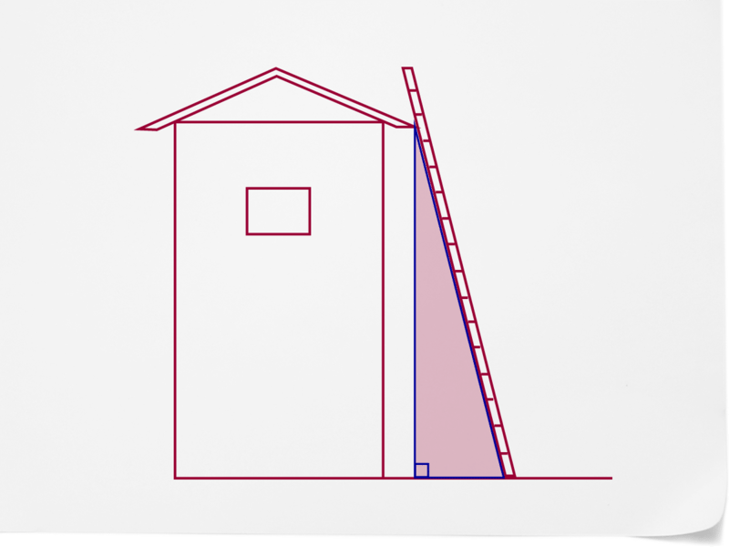
----------

Here are the vocabulary words that are found in this lesson.

__Right Triangle__

one angle is equal to $90^{\circ}$.

__Legs__

the two shorter sides of a right triangle.

__Hypotenuse__

the longest side of a right triangle.

__Pythagorean Theorem__

$a^2 + b^2 = c^2$

__Pythagorean Triple__

values that work perfectly in the Pythagorean Theorem. The ratio always simplifies to 3:4:5.

__Converse of the Pythagorean Theorem__

If $a^2 + b^2 = c^2$, then the triangle is a right triangle.

Time to Practice
----------------

Directions: Use the Pythagorean Theorem to find the missing dimensions of right triangles.

1.  $a=3,b=4,c=?$
2.  $a=6,b=8,c=?$
3.  $a=9,b=12,c= ?$
4.  $a=27,b=36,c= ?$
5.  $a=15,b=20,c= ?$
6.  $a=18,b=24,c= ?$
7.  $a= ?,b=16,c= 20$
8.  $a= ?,b=28,c=35$
9.  $a=30,b= ?,c=50$
10. $a=33,b= ?,c=55$
11. $a=1.5,b= ?,c=2.5$
12. $a=36,b= ?,c=60$

Directions: Think about what you have learned about the Pythagorean Theorem and answer true or false for the following questions.

13. The Pythagorean Theorem will work for an acute triangle with all $60^{\circ}$ angles.
14. The Pythagorean Theorem will work for a right triangle.
15. The Pythagorean Theorem will only work if the triangle is a right triangle.
16. The legs of a right triangle are considered the two shorter sides of the right triangle.
17. The hypotenuse is the longest side of a right triangle.
18. The converse of the Pythagorean Theorem is used to find the angle measures of an obtuse triangle.
19. A Pythagorean Triple is when you multiply all of the angle measures by three.
20. You can use the Pythagorean Theorem to figure out if the side lengths of a triangle make it a right triangle or not.

Directions: Identify whether or not each of the following values is a Pythagorean Triple. Write yes or no for your answer.

21. 4, 5, 6
22. 6, 8, 10
23. 5, 6, 9
24. 9, 12, 15
25. 30, 40, 55
26. 21, 28, 35
27. 12, 16, 20

</article>

### 7.4 Using the Pythagorean Theorem

<article>

Introduction
------------

**_The Ladder Dilemma_**

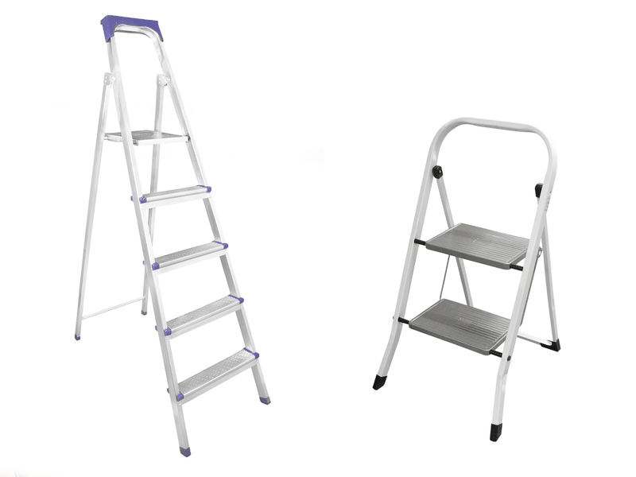

They have the choice of two different ladders. One ladder is 20 feet long and one ladder is 25 feet long.

“If we choose the 20 foot ladder and it is about 4 feet from the shed, how high up will it go?” Aran asked taking out a piece of paper and a pencil.

“I don’t know. We also have to think about the 25 foot ladder. If it is also 4 feet from the shed, how high up will it reach?” Amy said. “We need the Pythagorean Theorem for this one,” Aran said.

Both students took out a piece of paper and a pencil and began to work.

**Learning to use the Pythagorean Theorem in real – world problems is important because of its many uses. Pay attention to this lesson and you will be able to figure out how high each ladder will reach by the end of the lesson.**

**_What You Will Learn_**

In this lesson, you will how to execute the following skills.

* Use the Pythagorean Theorem to measure indirectly.
* Use the Pythagorean Theorem to find the perimeter and area of right triangles with a missing dimension.
* Use the converse of the Pythagorean Theorem to identify Pythagorean triples.
* Solve real – world problems involving applications of the Pythagorean Theorem.

**_Teaching Time_**

I. **Use the Pythagorean Theorem to Measure Indirectly**

Now that you are familiar with the Pythagorean Theorem, there are many different ways you can use it. Math questions will often require you to use the theorem even if it isn’t mentioned specifically in the text. **Whenever you look at a shape, think about whether or not a right angle is present. If there is a right triangle in the shape, you may need to use the Pythagorean Theorem.**

There are many situations in which you may need to use the Pythagorean Theorem on objects that don’t even appear (at first) to be right triangles. Often, you will find that measurement involves a figure that looks like a right triangle. You can use the Pythagorean Theorem in these situations. This skill is called **_indirect measurement_**, and it is important to be comfortable using it in many situations. **Indirect measurement allows you to figure out lengths or distances that would be difficult by using logic and mathematical knowledge.** The example below requires indirect measurement to solve the problem.

Example

_The diagram below shows the distance on roads to get from point $A$ to point $B$. If you bike, however, you can travel in a straight line between those two points. What is the shortest possible distance between points $A$ and $B$?_

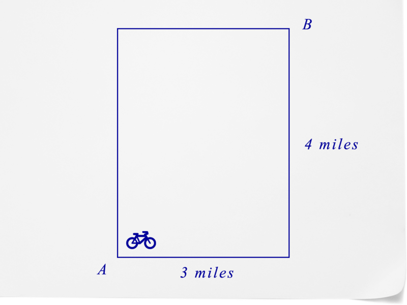

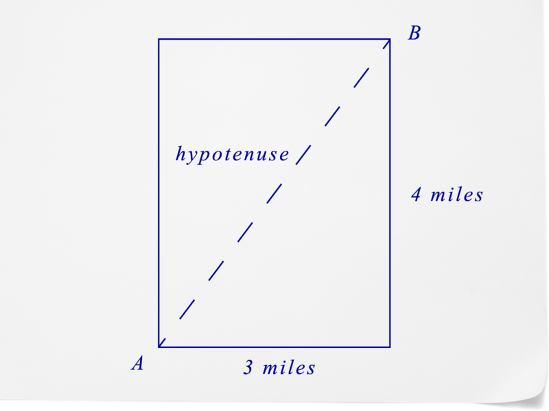

$$
\begin{align*}
a^2 + b^2 & = c^2\\
3^2 + 4^2 & = c^2\\
(3 \times 3) + (4 \times 4) & = c^2\\
9 + 16 & = c^2\\
25 & = c^2\\
\sqrt{25} & = \sqrt{c^2}\\
5 & = c
\end{align*}
$$

**Five miles is the correct answer. If you bike between points $A$ and $B$ on the map, and you can go in a straight line, the distance will be 5 miles.**

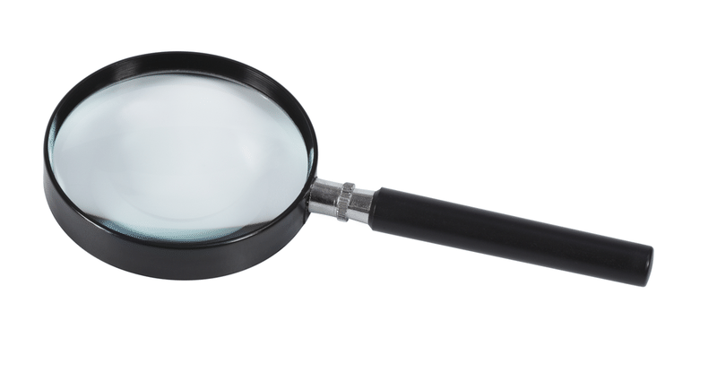

II. **Use the Pythagorean Theorem to Find the Perimeter and Area of Right Triangles with a Missing Dimension**

You should already be familiar with the terms **_perimeter_** and **_area_**. **The perimeter of an object is the distance around the outside of it.** So, for a triangle, it would be the sum of the two legs and the hypotenuse. **The area of an object is the amount of space it occupies, or how many square it would cover on a grid.** The area formula for a triangle is $A = \frac{1}{2} bh$ where $b$ is the length of the base of the triangle, and $h$ is the height. In a right triangle, the product $bh$ can always be found by multiplying the two legs together.

Sometimes, you won’t know all of the dimensions of a right triangle. In order to find the perimeter of a right triangle, you have to know all three sides. In order to find the area of a right triangle, you have to know the base and the height. If you don’t know all of the dimensions that you need to solve a problem, you can use the Pythagorean Theorem to help you in problem solving.

Let’s look at an example.

Example

_What is the perimeter and area of the triangle below?_

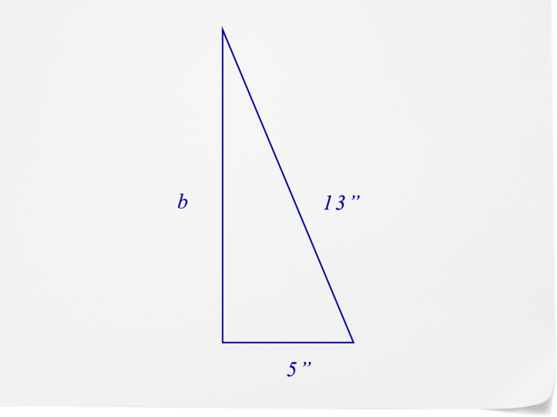

$a^2 + b^2 = c^2$, where $a = 5$ and $c = 13$

$$
\begin{align*}
5^2 + b^2 & = 13^2\\
25 + b^2 & = 169\\
25 + b^2 - 25 & = 169 - 25\\
b^2 & = 144\\
\sqrt{b^2} & = \sqrt{144}\\
b & = 12
\end{align*}
$$

**The length of the missing side is 12 inches.**

**Now, to find the perimeter $(P)$ of the triangle, add up the lengths of the three sides.**

$$
\begin{align*}
P & = leg + leg + hypotenuse\\
P & = 5 + 12 +13\\
P & = 30
\end{align*}
$$

**The perimeter of the triangle is 30 inches.**

**To find the area, use the area formula shown above. Remember that in this triangle, $b=5$ and $h=12$. The height is the other leg because it is a right triangle.**

$$
\begin{align*}
A & = \frac{1}{2}bh\\
A & = \frac{1}{2} (5)(12)\\
A & =\frac{1}{2} (60)\\
A & = 30
\end{align*}
$$

**The area of the triangle is 30 square inches. Remember to use square units when measuring area.**

This triangle is unique in that the numerical value for both the perimeter and the area are the same. Remember however, that the true values are different because the units are different.

III. **Use the Converse of the Pythagorean Theorem to Identify Pythagorean Triples**

In the previous lesson, you practiced using the converse of the Pythagorean Theorem. **That is, if three numbers make the Pythagorean Theorem true, they can represent the three sides of a right triangle.** We can use the converse to determine Pythagorean triples too.

Example

_Is 5:12:13 a Pythagorean triple?_

**These numbers may look familiar, but you may not know off the top of your head whether or not they comprise a Pythagorean triple. Use the theorem to evaluate whether they are correct.**

$a^2 + b^2 = c^2$, where $a = 5, b = 12,$ and $c = 13$

$$
\begin{align*}
5^2 + 12^2 & = 13^2\\
25 + 144 & = 169\\
169 & = 169
\end{align*}
$$

**So, 5:12:13 is a true Pythagorean triple.**

**How can we find more triples?**

**Now that you know the ratio of all Pythagorean triples originate at 3:4:5, if you multiply each value in the triple by the same number, you will find more triples.** For example, if you multiply each number by 2, you get the triple 10:24:26. If you multiply each number by 3, you get 15:36:39. Each of these sets of numbers are Pythagorean triples and can be used to solve problems of many different types.

Let’s look at using the Pythagorean Theorem when problem solving.

IV. **Solve Real – World Problems Involving Applications of the Pythagorean Theorem**

Pythagorean Theorem concepts will show up in real-world problems just like any other mathematical concept. Remember to solve problems carefully. Look for Pythagorean triples that can save you time in calculations.

_Bethany’s mom made her a sandwich with a length of 8 cm and a height of 6 cm. If she cuts it in half diagonally as shown, what is the length of the cut edge?_

**This question is asking you to find the hypotenuse of a triangle with legs 6 cm and 8 cm. You may recognize those numbers as belonging to the Pythagorean triple 6:8:10, so the answer is probably 10 cm. You can check your answer using the Pythagorean Theorem.**

$a^2 + b^2 = c^2$, where $a = 6$ and $b = 8$

$$
\begin{align*}
6^2 + 8^2 & = c^2\\
36 + 64 & = c^2\\
100 & = c^2\\
\sqrt{100} & = \sqrt{c^2}\\
10 & = c
\end{align*}
$$

**The length of the cut side of the sandwich is 10 cm.**

Example

_Lena had a piece of poster board that measured 12 inches by 16 inches. She cuts the poster board in half diagonally and wants to know the perimeter of one piece. What is the perimeter of half of Lena’s board?_

**To find the perimeter, you must find the length of the missing side (the hypotenuse). You may recognize 12 and 16 as being multiples of 3 and 4 (greater by a factor of 4) and could conclude that the hypotenuse will be four times five, or 20. However, you can solve this using the Pythagorean Theorem even if you don’t notice the Pythagorean triple.**

$a^2 + b^2 = c^2$, where $a = 12$ and $b = 16$

$$
\begin{align*}
12^2 + 16^2 & = c^2\\
144 + 256 & = c^2\\
400 & = c^2\\
\sqrt{400} = & \sqrt{c^2}\\
20 & = c
\end{align*}
$$

**The missing side is 20 inches.**

**Don’t stop here, though! You have to find the perimeter of the triangle, so add the three sides together.**

$$
\begin{align*}
P & = leg + leg + hypotenuse\\
P & = 12 + 16 + 20\\
P & = 48
\end{align*}
$$

**The perimeter of half of Lena’s poster board is 48 inches.**

Now let’s apply what we have learned to the problem from the introduction.

Real-Life Example Completed
---------------------------

**_The Ladder Dilemma_**

**Here is the problem from the introduction. Reread it and then solve for the heights of each ladder.**

Now that the students in Mrs. Richardson’s class understand that they will need to use the Pythagorean Theorem, they are left with the question of which ladder to use. Mrs. Richardson has told them that the height of the shed is 23 feet.

They have the choice of two different ladders. One ladder is 20 feet long and one ladder is 25 feet long.

“If we choose the 20 foot ladder and it is about 4 feet from the shed, how high up will it go?” Aran asked taking out a piece of paper and a pencil.

“I don’t know. We also have to think about the 25 foot ladder. If it is also 4 feet from the shed, how high up will it reach?” Amy said.

“We need the Pythagorean Theorem for this one,” Aran said.

Both students took out a piece of paper and a pencil and began to work.

**_Solution to Real – Life Example_**

**First, let’s start with the ladder that is 20 feet long. We use the ladder length as the $c$ in the Pythagorean Theorem. It is the long side of the triangle. The height that the ladder will reach on the shed is what we are looking to solve, we will call that $a$ and that is our unknown value. We know that the ladder is four feet from the shed, and so this is our $b$ value.**

$$
\begin{align*}
a^2+b^2&=c^2 \\
a^2+4^2 & =20^2 \\
a^2+16&=400 \\
a^2&=400-16=384 \\
a&=19.59 \ feet
\end{align*}
$$

**Now we can look at the ladder that is 25 feet long.**

$$
\begin{align*}
a^2+b^2&=c^2 \\
a^2+4^2&=25^2 \\
a^2+16&=625 \\
a^2&=625-16 \\
a&=24.5 \ feet
\end{align*}
$$

**If the shed is 23 feet high, then the students should use the ladder that is 25 feet long so that they can paint all the way to the top of the shed.**

Vocabulary
----------

Here are the vocabulary words that are found in this lesson.

__Indirect Measurement__

using geometric properties to figure out distances and lengths that would otherwise be challenging to measure.

__Perimeter__

the distance around a figure.

__Area__

the measure of the space inside a figure.

__Pythagorean Theorem__

the formula for figuring out the side lengths of a right triangle - $a^2+b^2=c^2$

__Pythagorean triple__

different forms of the ratio 3:4:5 which represent the side lengths of a right triangle.

Time to Practice
----------------

Directions: Identify whether or not each set of measurements indicates a Pythagorean Triple.

1.  3, 4, 5
2.  6, 8, 12
3.  6, 8, 10
4.  15, 20, 25
5.  5, 9, 14
6.  9, 12, 15
7.  18, 24, 30
8.  1.5, 2, 4
9.  1.5, 2, 2.5
10. 21, 28, 35

Directions: Find the missing side length of each right triangle by using the Pythagorean Theorem. You may round to the nearest tenth when necessary.

11. $a = 6, b = 10, c = \underline{\;\;\;\;\;\;\;\;\;\;}$
12. $a = 5, b = 7, c = \underline{\;\;\;\;\;\;\;\;\;\;}$
13. $a = 7, b = 9, c = \underline{\;\;\;\;\;\;\;\;\;\;}$
14. $a = 6, b = 8, c = \underline{\;\;\;\;\;\;\;\;\;\;}$
15. $a = 9, b = 12, c = \underline{\;\;\;\;\;\;\;\;\;\;}$
16. $a = 10, b = 14, c = \underline{\;\;\;\;\;\;\;\;\;\;}$
17. $a = 6, b = \underline{\;\;\;\;\;\;\;\;\;\;}, c = 10$
18. $a = \underline{\;\;\;\;\;\;\;\;\;\;}, b = 12, c = 15$
19. $a = 15, b = \underline{\;\;\;\;\;\;\;\;\;\;}, c = 25$
20. $a = \underline{\;\;\;\;\;\;\;\;\;\;}, b = 32, c = 40$

Directions: Answer each question.

21. What is the area of a right triangle that has one leg of 6 yards and a hypotenuse of 10 yards?
22. A television is measured by the length of the diagonal from one corner to another. If the screen is 8 inches by 15 inches, what is the length of the diagonal?
23. Do the numbers 15, 20 and 25 comprise a Pythagorean triple?
24. What is the perimeter of a right triangle with a hypotenuse of 30 inches and a leg of 18 inches?

</article>

### 7.5 The Distance Formula

<article>

Introduction
------------

**_The Vegetable Garden_**

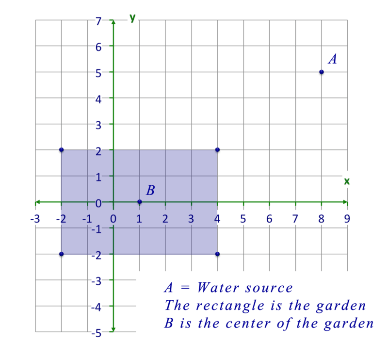

The students have drawn a map of the garden plan. The biggest obstacle is where to put the garden. They know that it needs to be a level area free of obstructions, but it also needs to be accessible to a water source.

“This is my plan. We can figure out the distance from the water source to the center of the garden. Then if we can buy a hose the correct length and a sprinkler, we should be able to water the garden,” Belinda said to the class.

“It’s a good idea. Why did you put it on a grid?” Carmen asked.

“Because that way we can figure out the exact distance between the two points and each square on the grid represents one foot. I measured it out yesterday. But the exact distance from the water to the center was a little too tough to figure out using a tape measure. That is why I drew it on the grid. Now we can use the distance formula,” Belinda explained.

The class looked puzzled.

**Are you puzzled? The distance formula is a great way to figure out exact distances using coordinates and a coordinate grid. Use this lesson to learn all about it and then you can figure out the distance from the water source to the center of the garden at the end.**

**_What You Will Learn_**

By the end of this lesson you will be able to demonstrate the following skills.

* Recognize the Distance Formula as an application of the Pythagorean Theorem.
* Find the distance between two points on a coordinate grid.
* Find a missing coordinate value for a point, given the other coordinate value, another point and the distance.
* Solve real-world problems involving applications of the Distance Formula.

**_Teaching Time_**

I. **Recognize the Distance Formula as an Application of the Pythagorean Theorem**

When working with points and lines on coordinate grids, there are many different ways to solve problems. You can use your knowledge of algebra, rational numbers, and the **_Pythagorean Theorem_** to help you. In this lesson you will learn to use the distance formula to understand the relationship between points on a coordinate grid. In the first lesson, you will learn how to derive this formula mathematically. While it is helpful to memorize the distance formula, it is even better to understand how and why it works. That way, you can always check your work to make sure you have used it properly.

You learned in the last lesson that you can use the Pythagorean Theorem to understand different types of right triangles, find missing lengths, and identify Pythagorean triples. In this lesson, you will apply the Pythagorean Theorem to a coordinate grid and learn how to use it to find distances between points.

Example

_Look at the points on the grid below. Then find the distance of the line represented._

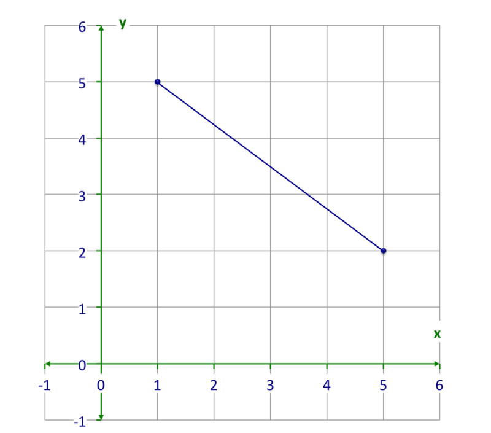

 to (1,5), so it is 3 units long. The horizontal leg extends from (1,2) to (5,2), so it is 4 units long. Use the Pythagorean Theorem with these values to identify the length of the hypotenuse.**")

$$
\begin{align*}
a^2+b^2 &= c^2\\
3^2+4^2 &= c^2\\
(3 \times 3)+(4 \times 4) &= c^2\\
9+16 &= c^2\\
25 &= c^2\\
\sqrt{25} &= \sqrt{c^2}\\
5 &= c
\end{align*}
$$

**The hypotenuse is 5 units long.**

Mathematicians have simplified this process and created a formula which uses these steps to find the distance. **This formula is called the** **_distance formula_**. If you use the distance formula, you don’t have to draw the extra lines.

Example

_Use the distance formula $D=\sqrt{(x_2-x_1)^2+(y_2-y_1)^2}$ to find the distance between the points (1,5) and (5,2) on a coordinate grid._

**You already know from the first example that the distance will be 5 units, but you can practice using the Distance formula to make sure it works. In this formula, substitute 1 for $x_1$, 5 for $y_1$, 5 for $x_2$, and 2 for $y_2$ because (1,5) and (5,2) are the two points in question.**

$$
\begin{align*}
D &= \sqrt{(x_2-x_1)^2+(y_2-y_1)^2}\\
D &= \sqrt{(5-1)^2+(2-5)^2}\\
D &= \sqrt{(4)^2+(-3)^2}\\
D &= \sqrt{16+9}\\
D &= \sqrt{25}\\
D &= 5
\end{align*}
$$

**So you see, no matter which way you solve this problem, you find that the distance between (1,5) and (5,2) on a coordinate grid is 5 units.**

**Notice that the distance formula helps you eliminate the need to graph the line and count all the units. We can use the formula to solve the problem mathematically.**

II. **Find the Distance between Two Points on a Coordinate Grid**

Now let’s practice using the distance formula to solve problems. It is important to become comfortable applying the distance formula to many types of problems and situations. Remember that either points can be considered $(x_1, y_1)$ or $(x_2, y_2)$, but it crucial to keep your assignments consistent through the problem. The most common error students make when using the distance formula is in incorrect substitution. Keep your variables straight and your algebra careful and you’ll be fine.

Example

_Use the distance formula to find the distance between the points (-3,2) and (4,-5) on a coordinate grid._

**Because we know the distance formula, we don’t even have to draw this out on a coordinate grid. All you have to do is substitute the values in the problem into the distance formula and solve. In this formula, substitute -3 for $x_1$, 2 for $y_1$, 4 for $x_2$, and -5 for $y_2$ because (-3,.2) and (4,-5) are the two points in question.**

$$
\begin{align*}
D &= \sqrt{(x_2-x_1)^2+(y_2-y_1)^2}\\
D &= \sqrt{(4-(-3))^2+((-5)-2)^2}\\
D &= \sqrt{(7)^2+(-7)^2}\\
D &= \sqrt{49+49}\\
D &= \sqrt{98}
\end{align*}
$$

**You can leave the answer as the radical as shown, or use your calculator to find the approximate value of 9.899 units.**

**_Notice that this answer is not a Pythagorean Triple, so finding a perfect square root is not possible. When this happens, you can either leave the answer in the radical form or find an approximate answer by using a calculator and rounding._**

Example

_Use the distance formula to find the distance between the points (2,3) and (7,15) on a coordinate grid._

**All we have to do is substitute the values in the problem into the distance formula and solve. In this formula, substitute 2 for $x_1$, 3 for $y_1$, 7 for $x_2$, and 15 for $y_2$ because (2,3) and (7,15) are the two points in question.**

$$
\begin{align*}
D &= \sqrt{(x_2-x_1)^2+(y_2-y_1)^2}\\
D &= \sqrt{(7-2)^2+(15-3)^2}\\
D &= \sqrt{(5)^2+(12)^2}\\
D &= \sqrt{25+144}\\
D &= \sqrt{169}\\
D &= 13
\end{align*}
$$

**The distance between the two points in the problem is 13 units.**

Now let’s look at how we can use the distance formula to solve problems when we are missing some of the necessary information.

III. **Find a Missing Coordinate Value for a Point, Given the Other Coordinate Value, another Point and the Distance**

Now that you are comfortable using the distance formula to find the space between two points on a coordinate grid, there is a slightly different type of problem you can learn to solve. You may be given the distance between two points, the coordinates to one point, and one value in the coordinate pair of the second point. You can simply substitute into the distance formula all the values that are provided, and solve algebraically for the missing value.

Example

_The distance between two points on a grid is 17 units. If one of the points has the coordinates (-2, 10) and the other point has an $x-$coordinate of 13, what is the $y-$coordinate of the second point?_

**Use the distance formula, substituting 17 for $D$, -2 for $x_1$, 10 for $y_1$, and 13 for $x_2$. You will have to leave $y_2$ as a variable and solve for its numerical value.**

$$
\begin{align*}
D &= \sqrt{(x_2-x_1)^2+(y_2-y_1)^2}\\
17 &= \sqrt{(13-(-2))^2+(y_2-10)^2}\\
17^2 &= \sqrt{\left((13-(-2))^2+(y_2-10)^2\right)}^2\\
289 &= (15)^2+(y_2-10)^2\\
289 &= 225+(y_2-10)^2\\
289-225 &= 225+(y_2-10)^2-225\\
64 &= (y_2-10)^2\\
\sqrt{64} &= \sqrt{(y_2-10)^2}\\
8 &= y_2-10\\
8+10 &= y_2-10+10\\
18 &= y_2
\end{align*}
$$

**The other missing point is 18.**

**_There are a few steps to note as we solved this problem. First, notice that we used squaring to cancel out a radical. If we have a radical around values and we want to cancel the radical, then we can square both sides of the equation to cancel out the radical._**

**_Similarly, when we had a value squared, we could use the inverse or square root of both sides of the equation to cancel out the exponent._**

**_Go back through the last problem and make a note of the places where square roots and squaring was used to cancel and simplify._**

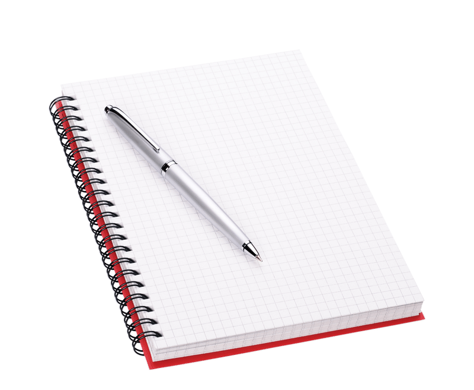

IV. **Solve Real – World Problems Involving Applications of the Distance Formula**

Just like any other mathematical concept, you may be tested on this material in a real-world context. Just translate the information into mathematical data and proceed as usual. No new tools or skills are required to solve these problems.

Example

_The map below shows the location of various points in Helene’s town._

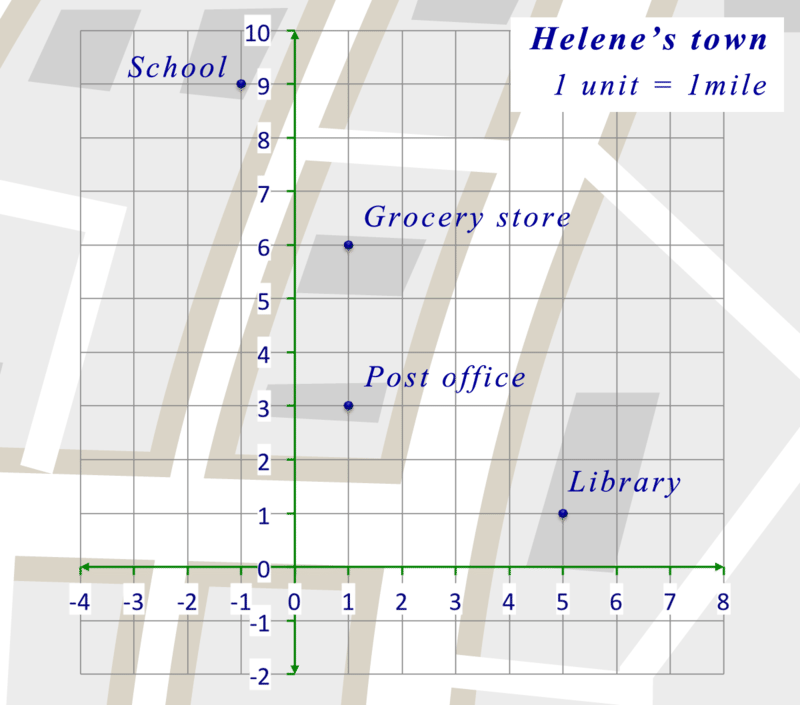

All you have to do for this problem is identify the coordinates of the school (-1,9) and the library (5,1) on the map and substitute them into the distance formula. Then solve as usual.

$$
\begin{align*}
D &= \sqrt{(x_2-x_1)^2+(y_2-y_1)^2}\\
D &= \sqrt{(5-(-1))^2+(1-9)^2}\\
D &= \sqrt{(6)^2+(-8)^2}\\
D &= \sqrt{36+64}\\
D &= \sqrt{100}\\
D &= 10
\end{align*}
$$

**So, the distance between the two places is 10 units. You can see on the scale that one unit is equal to one mile, so the real distance is 10 miles.**

Now let’s apply the distance formula to the problem from the introduction.

Real-Life Example Completed
---------------------------

**_The Vegetable Garden_**

**Here is the problem from the introduction. Reread it and then use the distance formula to figure out the distance from the water source to the center of the garden. Remember that each unit represents 1 foot.**

The community service project is in full swing and all the eighth grade homeroom classes have selected their projects. Mr. Henry’s class has decided to make a vegetable garden. They hope that if they are successful that the seventh graders will help them and that they can give a percentage of the food grown to charity.

The students have drawn a map of the garden plan. The biggest obstacle is where to put the garden. They know that it needs to be a level area free of obstructions, but it also needs to be accessible to a water source.

“This is my plan. We can figure out the distance from the water source to the center of the garden. Then if we can buy a hose the correct length and a sprinkler, we should be able to water the garden,” Belinda said to the class.

“It’s a good idea. Why did you put it on a grid?” Carmen asked.

“Because that way we can figure out the exact distance between the two points and each square on the grid represents one foot. I measured it out yesterday. But the exact distance from the water to the center was a little too tough to figure out using a tape measure. That is why I drew it on the grid. Now we can use the distance formula,” Belinda explained.

The class looked puzzled.

**To solve this problem, first you will need the coordinates of each point on the grid. This is the distance that you are measuring. In this problem, you will be measuring from point $A$ to point $B$.**

**Water Source** $= A (8, 5)$

**Center of Garden** $= B (1, 0)$

**Now substitute these values into the distance formula and solve.**

$$
\begin{align*}
D &= \sqrt{(x_2-x_1)^2+(y_2-y_1)^2}\\
D &= \sqrt{(1-8)^2+(5-0)^2}\\
D &= \sqrt{7^2+5^2}\\
D &= \sqrt{74}\\
D &= 8.6 \ feet
\end{align*}
$$

**The students will need a hose that is at least 9 feet long.**

Vocabulary
----------

Here are the vocabulary words that are found in this lesson.

__The Pythagorean Theorem__

$a^2+b^2=c^2$ - a way of solving for any leg of a right triangle given the lengths of the other two.

__The Distance Formula__

a formula designed to measure the distance between points on a coordinate grid without drawing all of the lines and counting units, $D=\sqrt{(x_2-x_1)^2+(y_2-y_1)^2}$

Time to Practice
----------------

Directions: Use the distance formula to find the distance between the following pairs of points. You may round to the nearest tenth when necessary.

1.  What is the distance between (3, 6) and (-1, 3)?
2.  What is the distance between (-2,-2) and (10, 3)?
3.  What is the distance between (1,9) and (9,1)?
4.  What is the distance between (-5,-5) and (-2,-1)?
5.  What is the distance between (2, 12) and (3,7)?
6.  What is the distance between (2, 2) and (8, 2)?
7.  What is the distance between (-3, 4) and (2, 0)?
8.  What is the distance between (3, 4) and (3, -4)?
9.  What is the distance between (-4, -3) and (1, -1)?
10. What is the distance between (-6, 2) and (-3, 1)?
11. What is the distance between (6, -1) and (6, 3)?
12. What is the distance between (1, 5) and (6, 4)?

Directions: Answer each of the following questions. Notice that some problems have two answers. Please provide both possible answers.

13. The map below shows Bryan’s town. What is the distance between the pet store and town hall? 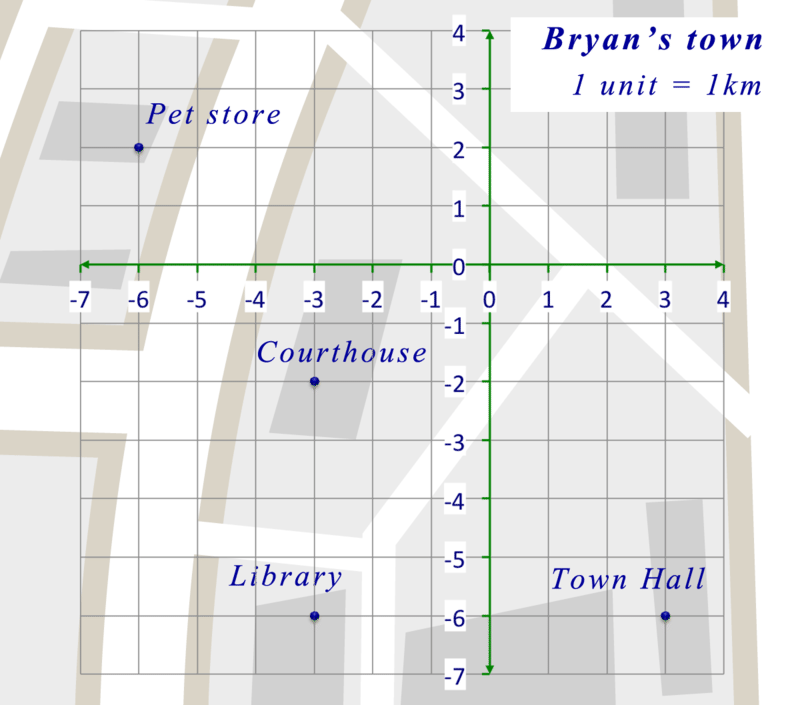
    
    \[Figure 7\]
    
14. Malik knows that the distance between two points is 10. One point is (-4,8) and the $x-$coordinate for the other is 4. What is the missing $y-$coordinate? There are two possible answers for this problem.
15. Louise knows that the distance between two points is 13. One point is (-2,-1) and the $y-$coordinate for the other is 4. What is the missing $x-$coordinate? There are two possible answers for this problem.
16. The distance between two points is 17. If one point is (10,5) and the other has an $x-$coordinate of -5, what is the missing $y-$coordinate? There are two possible answers for this problem.
17. Tinsley plots a point at (3,9). She wants to find another point that is 20 units away and has an $x-$coordinate of 15. What will be the $y-$coordinate of Tinsley’s second point? There are two possible answers for this problem.

</article>

### 7.6 Special Right Triangles

<article>

Introduction
------------

**_The Square Rock Garden_**

Ms. Kino’s class decided to do a community service project that everyone could enjoy. They decided to create a meditation garden that would be a rock garden.

Chas and Juanita took charge of the project. They drew a sketch of the rock garden and the rest of the class loved it so much that they instantly agreed to use the sketch that the pair had created. Here is their sketch.

“That’s a great idea, how long will the path be?” Chas asked.

The class wants to add a diagonal path. If they do that from one corner to another, how long will the path be?

**This lesson will teach you all that you need to know to solve this problem. You will have a chance to solve it at the end of the lesson.**

**_What You Will Learn_**

By the end of this lesson, you will have an understanding of the following skills.

* Recognize that a $45^\circ-45^\circ-90^\circ$ triangle is an isosceles triangle and that the length of the hypotenuse is the product of the length of either leg and $\sqrt{2}$.
* Recognize that a $30^\circ-60^\circ-90^\circ$ triangle is half of an equilateral triangle, that the length of the hypotenuse is twice the length of the shorter leg, and that the longer leg is the product of the shorter leg and $\sqrt{3}$.
* Find exact values of the indicated variable lengths in special right triangles, and check using the Pythagorean Theorem.
* Solve real – world problems involving applications of special right triangles.

**_Teaching Time_**

I. **Understanding $\underline{45^\circ-45^\circ-90^\circ}$ Triangles**

There are a few types of right triangles it is particularly important to study. Their sides are always in the same ratio, and it is crucial to study the $45^\circ-45^\circ-90^\circ$ and the $30^\circ-60^\circ-90^\circ$ triangles and understand the relationships between the sides. It will save you time and energy as you work through math problems both straight-forward and complicated. Let’s start by learning about the $45^\circ-45^\circ-90^\circ$.

**First, think about that $45^\circ-45^\circ-90^\circ$ refers to. Those values refer to the angle measures in the right triangle. We can see that there is one 90 degree angle and that the other two angles have the same measure. This particular triangle is also** **_isosceles_****. An isosceles triangle has two side lengths that are the same. An isosceles right triangle will always have the same angle measurements: $45^\circ,45^\circ$, and $90^\circ$ and will always have two side lengths that are the same. These characteristics make it a special right triangle.**

**Because these angles will always remain the same, the sides will always be in proportion. To find the relationship between the sides, use the Pythagorean Theorem.**

Example

_The isosceles right triangle below has legs measuring 1 centimeter. Use the Pythagorean Theorem to find the length of the hypotenuse._

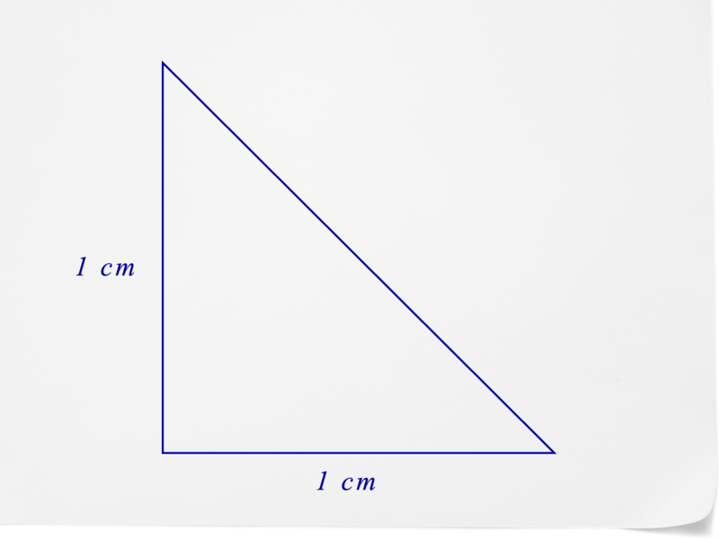

$$
\begin{align*}
a^2+b^2 &=c^2\\
(1)^2+(1)^2 &= c^2\\
1+1 &= c^2\\
2 &= c^2\\
\sqrt{2} &= \sqrt{c^2}\\
\sqrt{2} &= c
\end{align*}
$$

We can look at this and understand that there is also a 1 in front of the square root of two. This shows that the relationship between one side length and the length of the hypotenuse will always be the same. **The hypotenuse of an isosceles right triangle will always equal the product of one leg and $\sqrt{2}$.**

Now let’s use this information to solve the problem in the next example.

Example

_What is the length of the hypotenuse in the triangle below?_

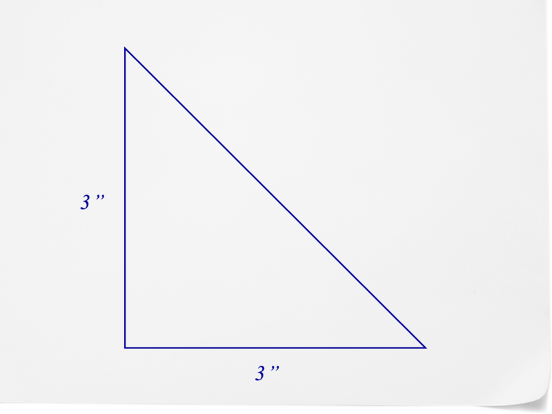

**One leg is 3 inches, so the hypotenuse will be $3 \sqrt{2}$, or about 4.24 inches.**

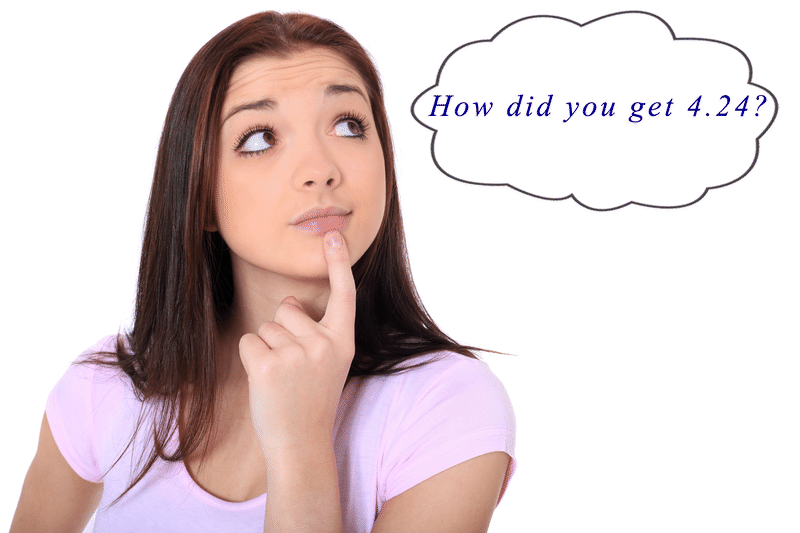

$3 \times 1.414 = 4.242$

We rounded to get the answer.

II. **Understanding $\underline{30^\circ-60^\circ-90^\circ}$ Triangles**

Another important type of right triangle has angles measuring $30^\circ,60^\circ$, and $90^\circ$. These triangles are exactly one half of **_equilateral triangles._** Do you remember what an equilateral triangle is? **An equilateral triangle is a triangle with equal angle measures.** The equal angle measures of an equilateral triangle are $60^\circ-60^\circ-60^\circ$. If we divide an equilateral triangle in half, then we have a $30^\circ-60^\circ-90^\circ$ triangle.

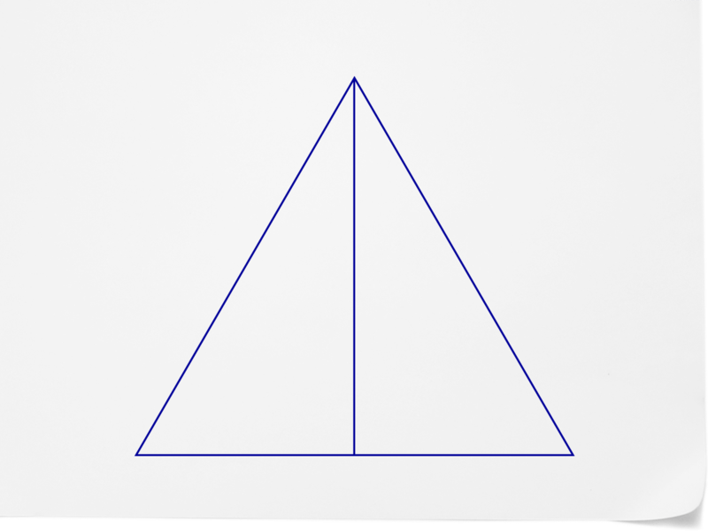

Example

_Find the length of the missing leg in the triangle below. Use the Pythagorean theorem to find your answer._

$ is 2 feet and the shorter leg $(a)$ is 1 foot. Find the length of the missing leg $(b)$.")

$$
\begin{align*}
a^2+b^2 &= c^2\\
(1)^2+b^2 &= (2)^2\\
1+b^2 &=4\\
1+b^2-1 &= 4-1\\
b^2 &= 3\\
\sqrt{b^2} &= \sqrt{3}\\
b &= \sqrt{3}
\end{align*}
$$

**You can leave the answer as the radical as shown, or use your calculator to find the approximate value of 1.732 feet.**

**So, just as there is a constant proportion relating the sides of the $45^\circ-45^\circ-90^\circ$ triangle, there is also one relating the sides of the $30^\circ-60^\circ-90^\circ$ triangle. The hypotenuse will always be twice the length of the shorter leg, and the longer leg is always the product of the shorter leg and $\sqrt{3}$.**

Example

_What is the length of the missing leg in the a 30/60/90 degree right triangle with a short leg of 5 and a hypotenuse of 10?_

**Since the length of the longer leg is the product of the shorter leg and $\sqrt{3}$, you can easily calculate this length. The short leg is 5 inches, so the hypotenuse will be $5 \sqrt{3}$, or about 8.66 inches.**

III. **Find Missing Values in Special Right Triangles**

In this section you can find exact values of the indicated variable lengths in special right triangles, and check using the Pythagorean Theorem. You now know the special proportions of the side lengths of certain right triangles, now you can use this information to solve problems involving these special right triangles. If you use these relationships correctly, you can solve a lot of problems about right triangles without too much time on calculation.

Example

_What is the length of one leg in the triangle below?_

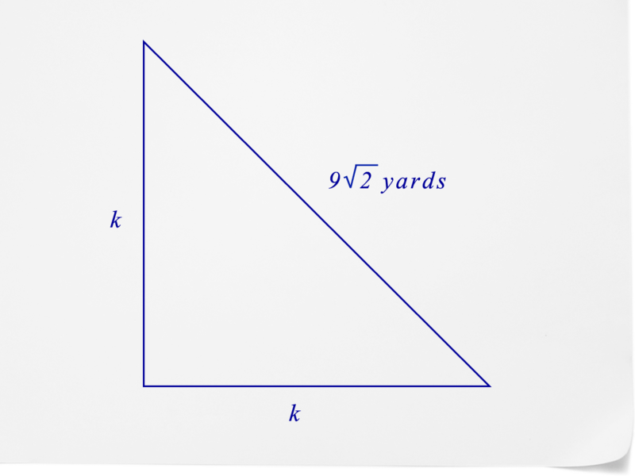

**So, the hypotenuse is the product of one leg and $\sqrt{2}$. Set up an equation to find the length of $k$.**

$$
\begin{align*}
k \times \sqrt{2} &= 9 \sqrt{2}\\
k \times \sqrt{2} \div \sqrt{2} &= 9 \sqrt{2} \div \sqrt{2}\\
k &= 9
\end{align*}
$$

**The length of one leg in this triangle is 9 yards.**

Example

_What is the length of one leg in the triangle below?_

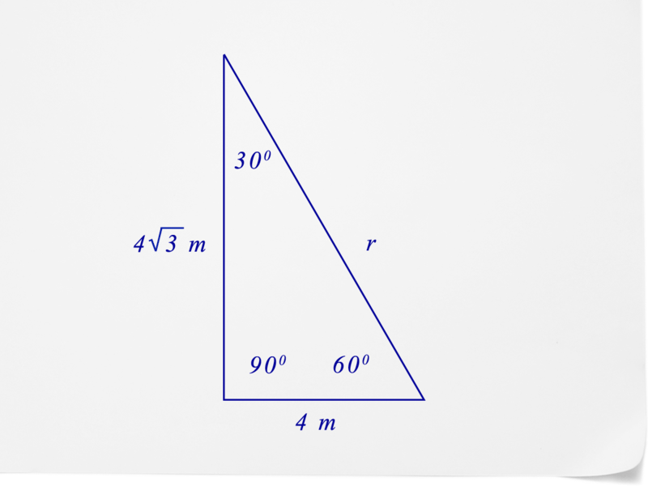

**The hypotenuse will be $4 \times 2$, or 8 meters long.**

Now we can look at how special right triangles appear in real – world situations.

IV. **Solve Real – World Problems Involving Applications of Special Right Triangles**

Just like any other mathematical concept, you may be tested on this material in a real-world context. Just translate the information into mathematical data and proceed as usual. No new tools or skills are required to solve these problems.

Example

_The diagram below shows the shadow a flagpole casts at a certain time of day. If the height of the flagpole is $7 \sqrt{3} \ feet$, what is the length of the hypotenuse of the triangle formed by the flagpole and its shadow?_

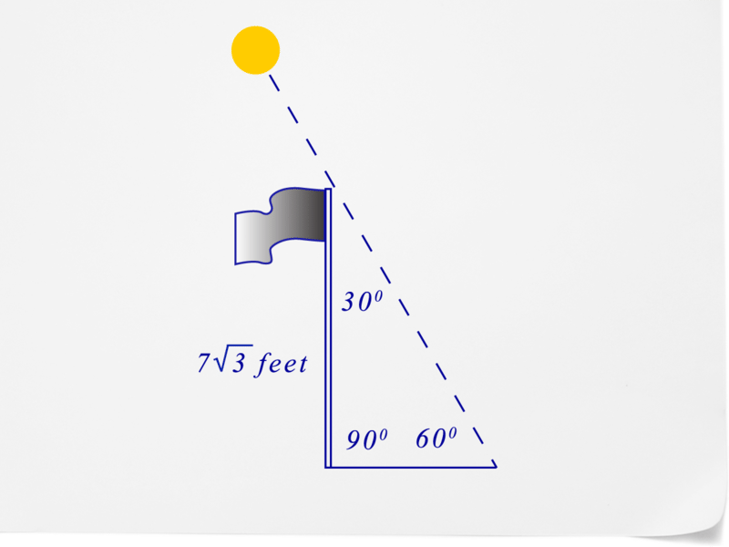

**The longer leg is the product of the shorter leg and $\sqrt{3}$. So, the length of the shorter leg will be 7 feet.**

**The hypotenuse in a $30^\circ-60^\circ-90^\circ$ triangle will always be twice the length of the shorter leg, so it will equal $7 \times 2$, or 14 feet.**

**The answer is 14 feet.**

Now let’s apply what we have learned to the problem from the introduction.

Real-Life Example Completed
---------------------------

**_The Square Rock Garden_**

**Here is the original problem once again. Reread it and then answer the question about the length of the diagonal path.**

Ms. Kino’s class decided to do a community service project that everyone could enjoy. They decided to create a meditation garden that would be a rock garden.

Chas and Juanita took charge of the project. They drew a sketch of the rock garden and the rest of the class loved it so much that they instantly agreed to use the sketch that the pair had created. Here is their sketch.

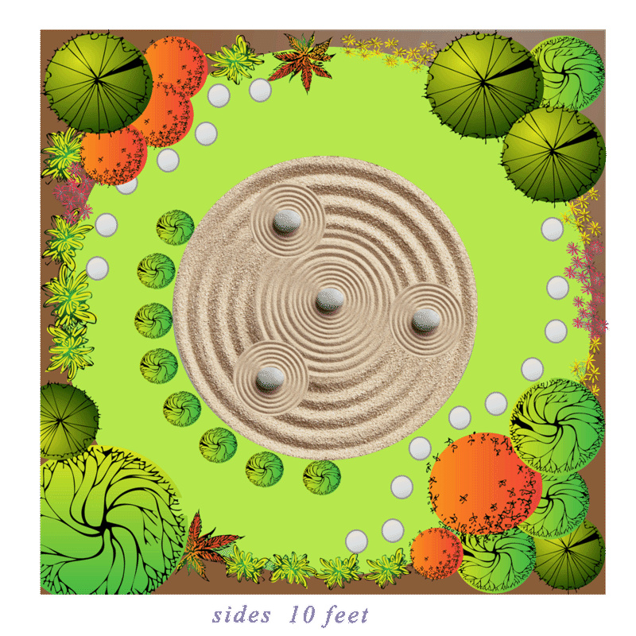

“That’s a great idea, how long will the path be?” Chas asked.

The class wants to add a diagonal path. If they do that from one corner to another, how long will the path be?

**_Solution to Real – Life Example_**

**The first step in a word problem of this nature is to add important information to the drawing. Because the problem asks you to find the length of a path from one corner to another, you should draw that path in.**

, this is an isosceles right triangle. The angles in an isosceles right triangle are $45^\circ,45^\circ$, and $90^\circ$.**")

**In an isosceles right triangle, the hypotenuse is always equal to the product of the length of one leg and $\sqrt{2}$. So, the length of the path will be the product of 10 and $\sqrt{2}$, or $10 \sqrt{2} \ feet$. This value is approximately equal to 14.14 feet.**

Vocabulary
----------

Here are the vocabulary words that are found in this lesson.

__Isosceles Triangle__

a triangle with two sides the same length.

__45/45/90 Triangle__

a special right isosceles triangle.

__Equilateral Triangle__

a triangle with all three angles $60^\circ$.

__30/60/90 Triangle__

a special right triangle that is created when an equilateral triangle is divided in half.

Time to Practice
----------------

Directions: Find the missing hypotenuse in each $45^\circ-45^\circ-90^\circ$ triangle.

1.  Length of each leg = 5
2.  Length of each leg = 4
3.  Length of each leg = 6
4.  Length of each leg = 3
5.  Length of each leg = 7

Directions: Now use a calculator to figure out the approximate value of each hypotenuse. You may round to the nearest hundredth.

6.  $5 \sqrt{2}$
7.  $4 \sqrt{2}$
8.  $6 \sqrt{2}$
9.  $3 \sqrt{2}$
10. $7 \sqrt{2}$

Directions: Find the missing length of the longer leg in each $30^\circ-60^\circ-90^\circ$ triangle.

11. short leg = 3
12. short leg = 4
13. short leg = 2
14. short leg = 8
15. short leg = 10

Directions: Now use a calculator to figure out the approximate value of each longer leg. You may round your answer when necessary.

16. $3 \sqrt{3}$
17. $4 \sqrt{3}$
18. $2 \sqrt{3}$
19. $8 \sqrt{3}$
20. $10 \sqrt{3}$

Directions: Use what you have learned to solve each problem.

21. Janie had construction paper cut into and equilateral triangle. She wants to cut it into two smaller congruent triangles. What will be the angle measurement of the triangles that result?
22. Madeleine has poster board in the shape of a square. She wants to cut two congruent triangles out of the poster board without leaving any leftovers. What will be the angle measurements of the triangles that result?
23. A square window has a diagonal of $2 \sqrt{2} \ feet$. What is the length of one of its sides?
24. A square block of cheese is cut into two congruent wedges. If a side of the original block was 9 inches, how long is the diagonal cut?
25. Jerry wants to find the area of an equilateral triangle but only knows that the length of one side is 4 centimeters. What is the height of Jerry’s triangle?

</article>

### 7.7 Exploring Trigonometric Ratios

<article>

Introduction
------------

**_The Ramp Dilemma_**

Mr. Watson’s homeroom decided to do a community service repairing the ramp outside the shed. The fresh coat of paint shone in the bright sunlight and Mr. Watson walked across the grass with all of his students to look at the ramp outside the door of the shed.

“Has that always been there?” asked Dan.

“No, in fact it was just brought out here yesterday,” Mr. Watson explained.

“Well if it’s brand new, then why do we need to fix it?” Emily asked.

“Because it doesn’t fit neatly under the door.”

Sure enough, the students looked and could see that the back of the ramp was too tall and the students would need to fix the back to make it fit beneath the doorway. Fixing this ramp would help everyone because it would make it easy to push or pull the cart with the athletic equipment out onto the field and since the equipment was used by local kid’s teams as well as the school, this was a definite way to give back to the community.

“What do we need to do?” Dan asked.

They looked at the ramp. Mr. Watson drew the following sketch.

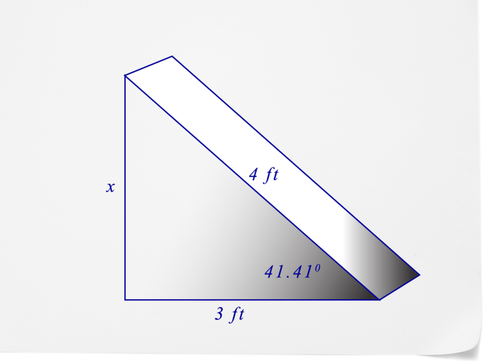

“Well that’s not very helpful,” Dan commented.

“Sure it is,” Emily said.

**Who is right? Is it possible to figure out the length of the missing side using Mr. Watson’s diagram? What kind of math will you need?**

**_What You Will Learn_**

In this lesson, you will learn how to complete and understand the following tasks.

* Recognize the sine of a given acute angle of a right triangle as the ratio of the length of the opposite leg to the length of the hypotenuse.
* Recognize the cosine of a given acute angle of a right triangle as the ratio of the length of the adjacent leg to the length of the hypotenuse.
* Recognize the tangent ratio of a given acute angle of a right triangle as the ratio of the length of the opposite leg to the length of the adjacent leg.
* Find sine, cosine, and tangent ratios for each of the acute angles of right triangles with given side lengths.
* Use tables to identify and understand patterns of sine, cosine and tangent ratios as angles increase from 0 to $90^\circ$.

**_Teaching Time_**

I. **Understanding and Recognize the Sine of a Right Triangle**

One way to analyze right triangles is through **_trigonometric ratios_**. **There are three trigonometric ratios and they help us to understand the proportions between the sides and the angles.** Pay special attention to the specifics of each ratio, as you will have to remember these.

Let’s look at the first trigonometric ratio. It is called the **_sine_**. **A sine refers to a particular angle in a right triangle. The sine of an angle is the ratio of the length of the leg opposite the angle we are focusing on to the length of the hypotenuse.** Remember that in a ratio, you list the first item on top of the fraction and the second item on the bottom. So, the ratio of the sine will be $\frac{opposite}{hypotenuse}$.

Let’s look at how we can find the sine of a particular angle.

Example

_What are the sines of $\angle A$ and $\angle B$ in the triangle below?_

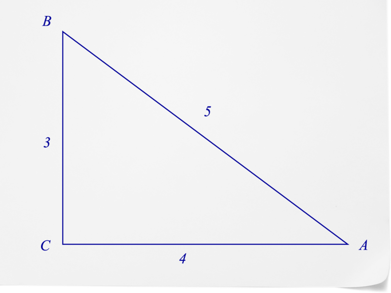

**To find the sine, all you have to do to is build the ratio carefully.**

$$
\begin{align*}
\sin e \angle A & = \frac{opposite}{hypotenuse} = \frac{3}{5} = 0.6\\
\sin e \angle B & = \frac{opposite}{hypotenuse} = \frac{4}{5} = 0.8
\end{align*}
$$

**Notice that once we have the ratio, that we can divide the numerator by the denominator to convert it to a decimal. The decimal is the answer that we are looking for with regard to the trigonometric ratio.**

**The sine of $\angle A$ is 0.6 and the sine of $\angle B$ is 0.8.**

**As you could see in example, the side opposite an angle is the one that an angle opens up to. An opposite side will never be one of the rays that forms and angle.**

II. **Recognize the Cosine of a Given Acute Angle of a Right Triangle as the Ratio of the Length of the Adjacent Leg to the Length of the Hypotenuse**

The next ratio to examine is called the **_cosine_**. **The cosine is the ratio of the adjacent side of an angle to the hypotenuse.** Use the same techniques you used to find sines to find cosines.

Example

_What are the cosines of $\angle M$ and $\angle N$ in the triangle below_

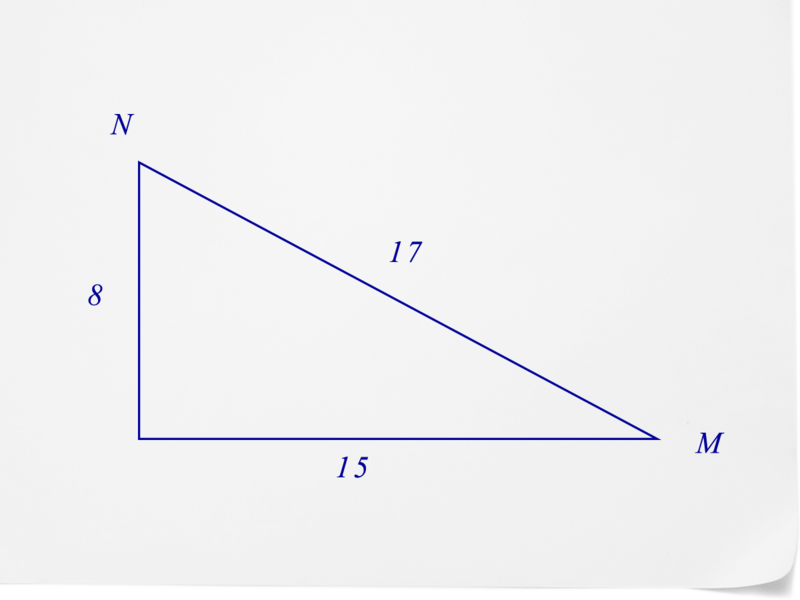

**To find these ratios, identify the sides adjacent to each angle and the hypotenuse. Remember that an adjacent side is the one that does create the angle and is not the hypotenuse.**

$$
\begin{align*}
\cos ine \angle M & = \frac{adjacent}{hypotenuse} = \frac{15}{17} \approx 0.88\\
\cos ine \angle N & = \frac{adjacent}{hypotenuse} = \frac{8}{17} \approx 0.47
\end{align*}
$$

**Once again notice that we divided the numerator by the denominator to find a decimal representation of the cosine of each of the angles. You can figure these ratios out on your calculator.**

**The cosine of $\angle M$ is about 0.88 and the cosine of $\angle N$ is about 0.47.**

III. **Recognize the Tangent Ratio of a Given Acute Angle of a Right Triangle as the Ratio of the Length of the Opposite Leg to the Length of the Adjacent Leg**

The final ratio to examine when studying right triangles is the **_tangent_**. **The tangent is the ratio of the opposite side to the adjacent side of an angle.** The hypotenuse is not involved in the tangent at all.

Example

_What are the tangents of $\angle X$ and $\angle Y$ in the triangle below?_

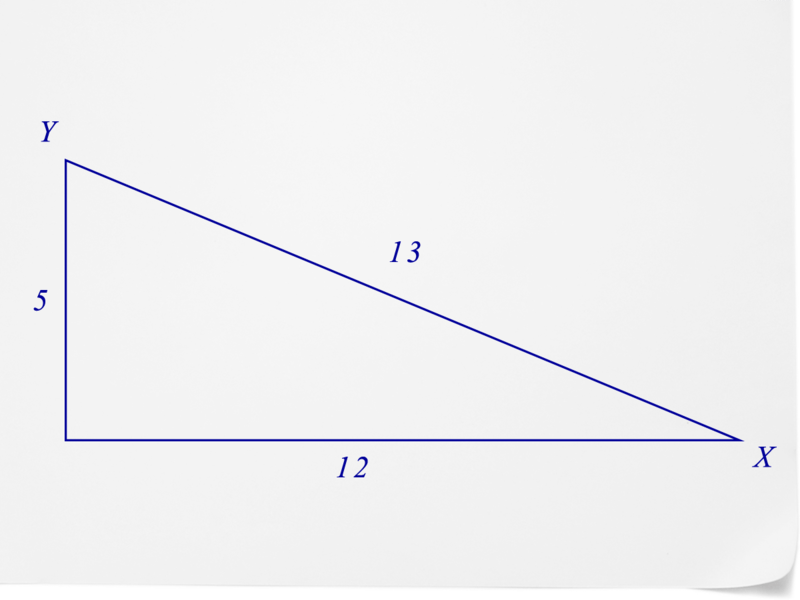

**To find these ratios, first identify the sides opposite and adjacent to each angle.**

$$
\begin{align*}
\tan gent \angle X & = \frac{opposite}{adjacent} = \frac{5}{12} \approx 0.417\\
\tan gent \angle Y & = \frac{opposite}{adjacent} = \frac{12}{5} = 2.4
\end{align*}
$$

**The tangent of $\angle X$ is about 0.417 and the tangent of $\angle Y$ is 2.4.**

IV. **Find Sine, Cosine and Tangent Ratios for Each of the Acute Angles of Right Triangles with Given Side Lengths**

Now that you understand how to find the sine, cosine and tangent of a right triangle, we can use this information to find the sine, cosine and tangent of each of the acute angles of right triangles.

Let’s look at an example.

Example

_Find the sine, cosine and tangent of each acute angle in the triangle below._

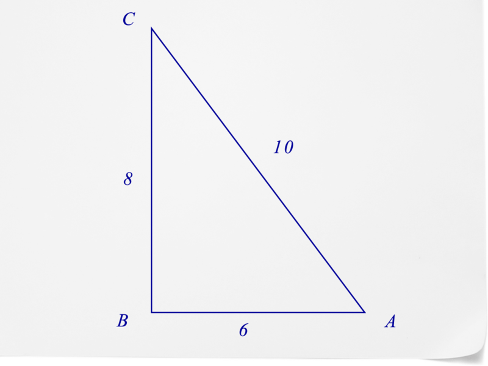

**First, we need to identify the acute angles. We know that an acute angle is less than $90^\circ$, so in this example, $\angle A$ and $\angle C$ are the acute angles. We will find the sine, cosine and tangent of each of these angles.**

**Let’s start with the sine ratio for each.** We know that the sine is the opposite over the hypotenuse. Here are the sine ratios.

$$
\begin{align*}
\text{Sine} \angle A & = \frac{8}{10} = .8\\
\text{Sine} \angle C & = \frac{6}{10} = .6
\end{align*}
$$

**Now let’s look at the cosine of each.** Cosine is the ratio of the adjacent side to the hypotenuse. Here are the cosine ratios.

$$
\begin{align*}
\text{Cosine} \angle A & = \frac{6}{10} = .6\\
\text{Cosine} \angle C &= \frac{8}{10} = .8
\end{align*}
$$

**Next, we can find the tangent ratios.** Tangent is the ratio of the opposite side to the adjacent side. Here are the tangent ratios.

$$
\begin{align*}
\text{Tangent} \angle A & = \frac{8}{6} = 1.333\\
\text{Tangent} \angle C & = \frac{6}{8} = .75
\end{align*}
$$

Notice that figuring out the ratios is not that difficult. The key is to be sure that you have memorized the different ratios.

**_Write each of these ratios down in your notebook._**

V. **Use Tables to Identify and Understand Patterns of Sine, Cosine and Tangent Ratios as Angles Increase from 0 to $\underline{90^\circ}$**

You’ll learn in the next lesson how to best use table and calculators to understand trigonometric ratios. Here you can get a preview about how the values change. This lesson focused primarily on how to identify the different ratios, but each ratio will have a constant value for a specific angle. In any right triangle, the sine of the $30^\circ$ angle will always be 0.5. You can use that information to find missing lengths in triangle where you know the angles, or to identify the measure of an angle if you know two of the sides.

Examine the table below for trends and patterns. This table shows the sine, cosine, and tangent values for eight different angles measures.

|     | $10^\circ$ | $20^\circ$ | $30^\circ$ | $40^\circ$ | $50^\circ$ | $60^\circ$ | $70^\circ$ | $80^\circ$ |
| --- | --- | --- | --- | --- | --- | --- | --- | --- |
| sine | 0.174 | 0.342 | 0.5 | 0.643 | 0.766 | 0.866 | 0.940 | 0.985 |
| cosine | 0.985 | 0.940 | 0.866 | 0.766 | 0.643 | 0.5 | 0.342 | 0.174 |
| tangent | 0.176 | 0.364 | 0.577 | 0.839 | 1.192 | 1.732 | 2.747 | 5.671 |

Example

_Using the table above, which value would you expect to be greater: the sine of $25^\circ$ or the cosine of $25^\circ$?_

You can use the information in the table to solve this problem. The sine of $20^\circ$ is 0.342 and the sine of $30^\circ$ is 0.5. So, the sine of $25^\circ$ will be between the values 0.342 and 0.5. The cosine of $20^\circ$ is 0.940 and the cosine of $30^\circ$ is 0.866. So, the cosine of $25^\circ$ will be between the values of 0.866 and 0.940. Since the range for the cosine is greater, than the range for the sine, it can be assumed that the cosine of $25^\circ$ will be greater than the sine of $25^\circ$.

Notice that as the angle measures approach $90^\circ$, sine approaches the value of 1. Similarly, as the value of the angles approaches $90^\circ$, the cosine approaches the value of 0. In other words, as the sine gets greater, the cosine loses value.

The tangent, on the other hand, increases rapidly from a small value to a large value approaching $90^\circ$.

Real-Life Example Completed
---------------------------

**_The Ramp Dilemma_**

Mr. Watson’s homeroom decided to do a community service repairing the ramp outside the shed. The fresh coat of paint shone in the bright sunlight and Mr. Watson walked across the grass with all of his students to look at the ramp outside the door of the shed.

“Has that always been there?” asked Dan.

“No, in fact it was just brought out here yesterday,” Mr. Watson explained.

“Well if it’s brand new, then why do we need to fix it?” Emily asked.

“Because it doesn’t fit neatly under the door.”

Sure enough, the students looked and could see that the back of the ramp was too tall and the students would need to fix the back to make it fit beneath the doorway. Fixing this ramp would help everyone because it would make it easy to push or pull the cart with the athletic equipment out onto the field and since the equipment was used by local kid’s teams as well as the school, this was a definite way to give back to the community.

“What do we need to do?” Dan asked.

They looked at the ramp. Mr. Watson drew the following sketch.

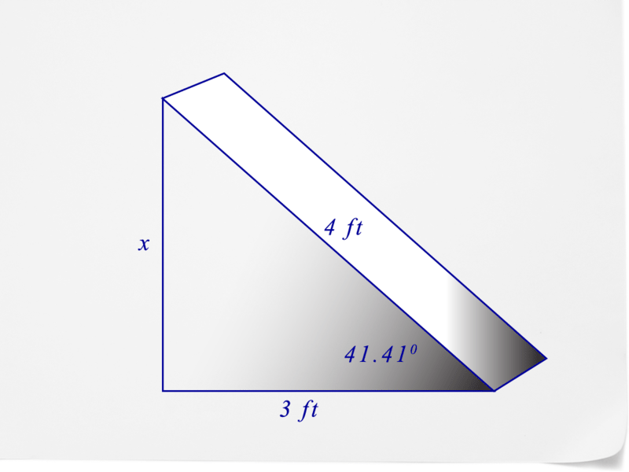

“Well that’s not very helpful,” Dan commented.

“Sure it is,” Emily said.

**Who is right? Is it possible to figure out the length of the missing side using Mr. Watson’s diagram? What kind of math will you need?**

**_Answer these three questions._**

**_Solution to Real – Life Example_**

**In thinking about this problem, Emily is correct. You can use the diagram to solve the problem. To do this, you will need to use trigonometric ratios. In fact, you will need to use the sine ratio to figure out the height of the ramp. That is the work of the next lesson.**

Vocabulary
----------

Here are the vocabulary words that are found in this lesson.

__Trigonometric Ratios__

ratios that help us to understand the relationships between sides and angles of right triangles.

__Sine__

the ratio of the opposite side to the hypotenuse.

__Cosine__

the ratio of the adjacent side to the hypotenuse.

__Tangent__

the ratio of the opposite side to the adjacent.

Time to Practice
----------------

Directions: solve each problem.

Use the following diagram for problems 1-9

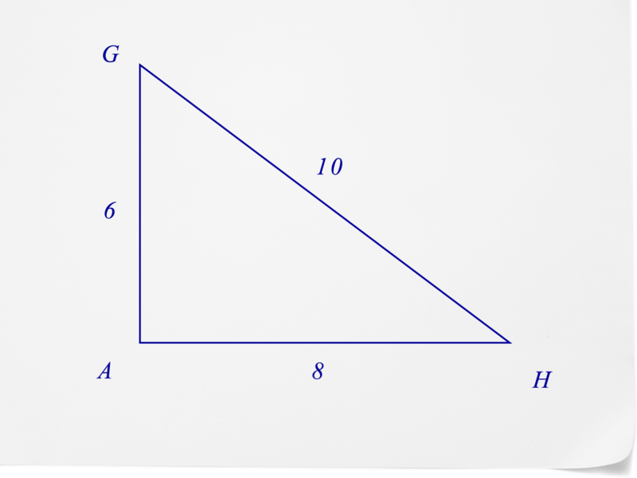

1.  What is the sin of $\angle G$?
2.  What is the cosine of $\angle G$?
3.  What is the tangent of $\angle H$?
4.  What is the sin of $\angle H$?
5.  What is the cosine of $\angle H$?
6.  What is the tangent of $\angle G$?
7.  What is the sine of $\angle A$?
8.  What is the cosine of $\angle A$?
9.  What is the tangent of $\angle A$?

Use the following diagram for problems 10-13.

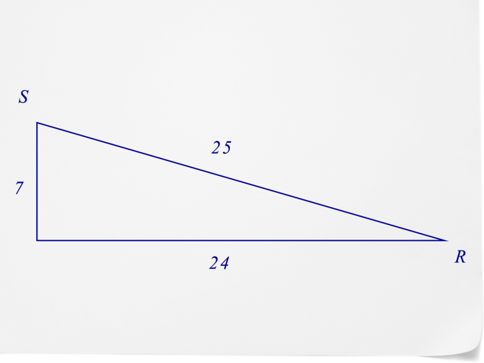

10. What is the tangent of $\angle R$?
11. What is the tangent of $\angle S$?
12. What is the sine of $\angle R$?
13. What is the cosine of $\angle S$?

Use the following table for problems 14 - 21.

|     | $10^\circ$ | $20^\circ$ | $30^\circ$ | $40^\circ$ | $50^\circ$ | $60^\circ$ | $70^\circ$ | $80^\circ$ |
| --- | --- | --- | --- | --- | --- | --- | --- | --- |
| sine | 0.174 | 0.342 | 0.5 | 0.643 | 0.766 | 0.866 | 0.940 | 0.985 |
| cosine | 0.985 | 0.940 | 0.866 | 0.766 | 0.643 | 0.5 | 0.342 | 0.174 |
| tangent | 0.176 | 0.364 | 0.577 | 0.839 | 1.192 | 1.732 | 2.747 | 5.671 |

14. Which value will be greater, the tangent of $45^\circ$ or the cosine of $45^\circ$?
15. Which value will be greater, the tangent of $55^\circ$ or the sine of $55^\circ$?
16. Which value will be greater, the sine of $85^\circ$ or the cosine of $85^\circ$?
17. What is the tangent of a $60^\circ$ angle?
18. What is the sine of a $60^\circ$ angle?
19. What is the cosine of a $10^\circ$ angle?
20. What is the cosine of a $30^\circ$ angle?
21. What is the sine of an $80^\circ$ angle?

Directions: Answer each question.

22. What is the ratio for sine?
23. What is the ratio for cosine?
24. What is the ratio for tangent?

</article>

### 7.8 Using Trigonometric Ratios

<article>

Introduction
------------

**_The Ramp Dilemma (Part 2)_**

**Here is the problem from the last lesson. Now that you know the math needed, think about this problem and the sine ratio.**

Mr. Watson’s homeroom decided to do a community service repairing the ramp outside the shed. The fresh coat of paint shone in the bright sunlight and Mr. Watson walked across the grass with all of his students to look at the ramp outside the door of the shed.

“Has that always been there?” asked Dan.

“No, in fact it was just brought out here yesterday,” Mr. Watson explained.

“Well if it’s brand new, then why do we need to fix it?” Emily asked.

“Because it doesn’t fit neatly under the door.”

Sure enough, the students looked and could see that the back of the ramp was too tall and the students would need to fix the back to make it fit beneath the doorway. Fixing this ramp would help everyone because it would make it easy to push or pull the cart with the athletic equipment out onto the field and since the equipment was used by local kid’s teams as well as the school, this was a definite way to give back to the community.

“What do we need to do?” Dan asked.

They looked at the ramp. Mr. Watson drew the following sketch.

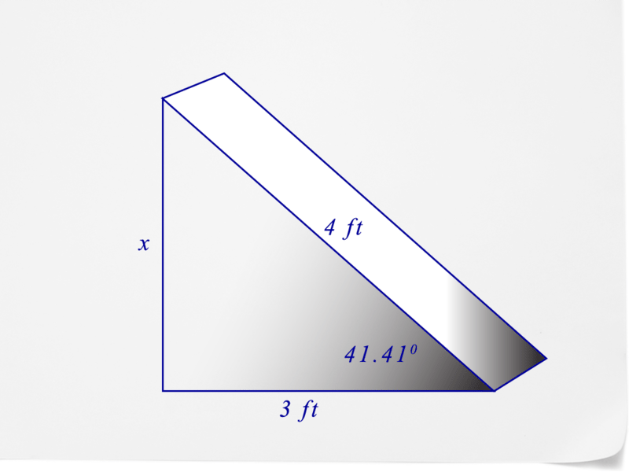

“Sure it is,” Emily said.

**This lesson is about using trigonometric ratios. By the end of the lesson, you will know how to figure out the height of the ramp.**

**_What You Will Learn_**

By the end of this lesson, you will be able to complete the following skills.

* Use calculator or tables to find sine, cosine and tangent ratios for each of the acute angles of right triangles with given side lengths.
* Determine and use the sine ratio to find the length of an opposite side of a right triangle, given the angle and the hypotenuse.
* Determine and use the cosine ratio to find the length of an adjacent side of a right triangle, given the angle and hypotenuse.
* Determine and use the tangent ratio to find the height of a right triangle, given the angle and the base.
* Use calculators or tables to solve real – world problems involving right triangles and trigonometric ratios.

**_Teaching Time_**

I. **Use Calculator or Tables to Find Sine, Cosine and Tangent Ratios for Each of the Acute Angles of Right Triangles with Given Side Lengths**

Now that you have a basic understanding of trigonometric ratios and how they are formed, it is time to learn more about how they can be used. **You now know that a trigonometric ratio for a specific angle will remain constant no matter how large or small the triangle is. The idea is that the sides will always be in proportion to each other. So, if you know the measure of an angle (and can therefore identify the value of a trigonometric ratio) and the value of one side, you can use trigonometry to calculate the lengths of other sides.** The trick is to use good algebra technique, and make sure that every time you set up a ratio, you are putting the values and variables in the correct places.

**You can find trigonometric ratios by using your calculator.**

You understand trigonometric ratios and have had a chance to practice reading specific values out of a table. **You can find the ratio for any trigonometric value using your calculator. Take a moment to locate the buttons for sine, cosine, and tangent on the calculator. Keep in mind that usually, sine is abbreviated as** **_sin_****, cosine is usually abbreviated as** **_cos_****, and tangent is usually abbreviated as** **_tan._** Press the key of the ratio you want to find, and enter the angle in question. If you hit enter, or calculate, the calculator will show you the value of that specific ratio.

Example

_Use your calculator to find the values of the following ratios._

$\text{sine} \ 47^{\circ}$

$\text{cosine} \  23^{\circ}$

$\text{tangent} \ 82^{\circ}$

**You can find the values for each ratio using your calculator. When dealing with large decimals values, it is usually best to round the numbers to the nearest thousandth. It gives you a reasonably accurate value without being too long of a number to work with.**

**The sine of $47^{\circ}$ is 0.73135370161917..., or about 0.731.**

**The cosine of $23^{\circ}$ is 0.92050485345244..., or about 0.921.**

**The tangent of $82^{\circ}$ is 7.11536972238419..., or about 7.115.**

**_Notice that because we are using a calculator, that we don’t need to know the side lengths. The calculator figures out the trigonometric ratio based on proportions and the given angle. Figuring out sine, cosine and tangents using a calculator is as easy as pressing a button!_**

II. **Determine and Use the Sine Ratio to Find the Length of an Opposite Side of a Right Triangle, Given the Angle and the Hypotenuse**

You have already learned how to write and determine the sine ratio, now we are going to use what we have learned in problem solving.

As you recall, the ratio of sine is $\frac{opposite}{hypotenuse}$. If you know the sine value of the angle in question, and the length of the hypotenuse, you can find the measure of the opposite side. Look at the algebraic manipulation below.

$$
\begin{align*}
\sin e \angle X&=\frac{opposite}{hypotenuse}\\
\sin e \angle X \times hypotenuse&=\frac{opposite}{hypotenuse} \times hypotenuse\\
\sin e \angle X \times hypotenuse&=opposite
\end{align*}
$$

**If you multiply the sine of any angle $X$ and the length of the hypotenuse, the result is the length of the opposite side.**

Now let’s apply this to an example.

Example

_What is the length of side $AC$ in the triangle below?_

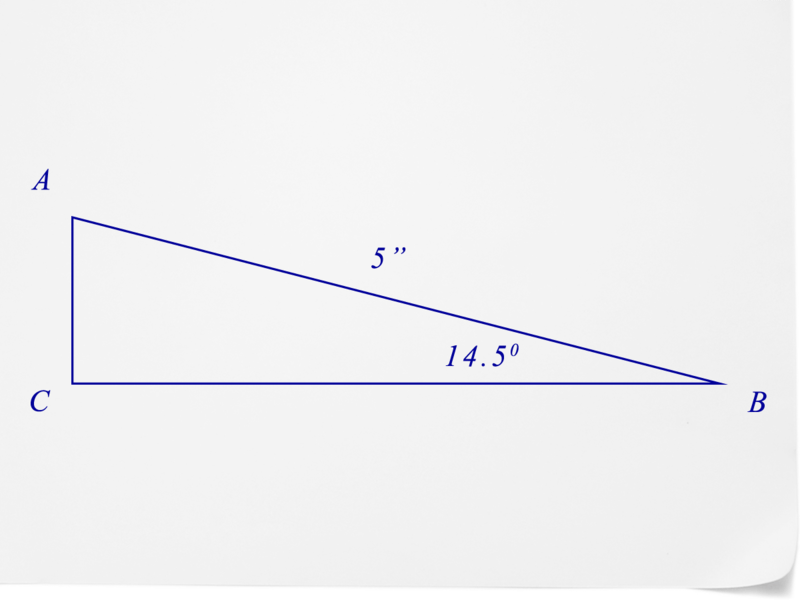

$$
\begin{align*}
\sin e \angle B \times hypotenuse&=opposite\\
\sin e 14.5 \times 5&=opposite\\
0.250 \times 5&=opposite\\
1.25 &=opposite
\end{align*}
$$

**The length of side $AC$ is 1.25 units.**

We can apply a similar rule when we work with cosines. Let’s take a look.

III. **Determine and Use the Cosine Ratio to Find the Length of an Adjacent Side of a Right Triangle, given the Angle and the Hypotenuse**

Now as we work with cosines, we will be using given information to find the length of the adjacent side of a right triangle. Remember that the adjacent side is the side next to the angle that we are working with. As you recall, the ratio of cosine is $\frac{adjacent}{hypotenuse}$. If you know the cosine value of the angle in question, and the length of the hypotenuse, you can find the measure of the adjacent side. Look at the algebraic manipulation below.

$$
\begin{align*}
\cos ine \angle X&=\frac{adjacent}{hypotenuse}\\
\cos ine \angle X \times hypotenuse&=\frac{adjacent}{hypotenuse} \times hypotenuse\\
\cos ine \angle X \times hypotenuse&=adjacent
\end{align*}
$$

**If you multiply the cosine of any angle $X$ and the length of the hypotenuse, the result is the length of the adjacent side.**

Example

_What is the length of side $BC$ in the triangle below?_

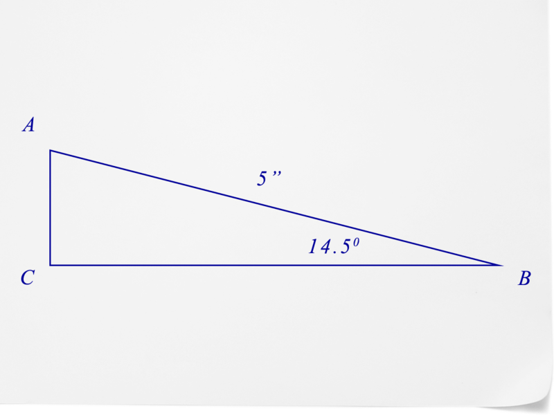

$$
\begin{align*}
\cos ine \angle B \times hypotenuse&=adjacent\\
\cos ine 14.5 \times 5&=adjacent\\
0.968 \times 5 &=adjacent\\
4.84 &=adjacent
\end{align*}
$$

**The length of side $BC$ is 4.84 units.**

Finally, let’s look at tangents.

IV. **Determine and Use the Tangent Ratio to Find the Height of a Right Triangle, Given the Angle and the Base**

Now we can use the tangent ratio to find the length of the height of a right triangle. We can see that the height in a right triangle looks like side $a$. This is because of the type of triangle that a right triangle is. As you recall, the ratio of tangent is $\frac{opposite}{adjacent}$. If you know the tangent value of the angle in question, and the length of the adjacent side, you can find the measure of the opposite side. Look at the algebraic manipulation below.

$$
\begin{align*}
\tan gent \angle X&=\frac{opposite}{adjacent}\\
\tan gent \angle X  \times adjacent &= \frac{opposite}{adjacent} \times adjacent\\
\tan gent \angle X \times adjacent &=opposite
\end{align*}
$$

**If you multiply the tangent of any angle $X$ and the length of the adjacent side, the result is the length of the opposite side.**

Example

_What is the length of side $QR$ in the triangle below?_

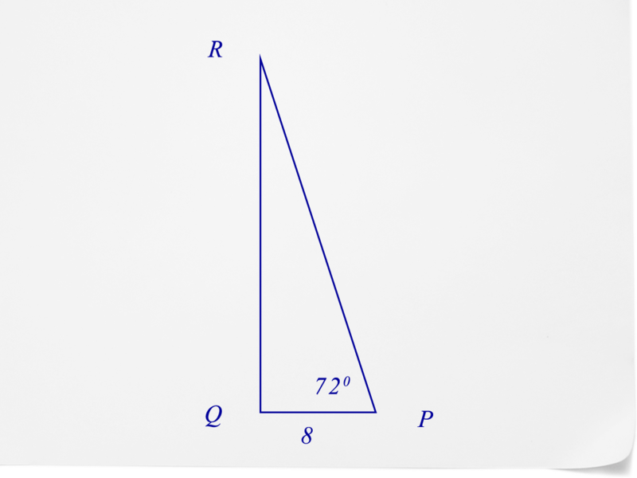

$$
\begin{align*}
\tan gent \angle P \times adjacent &=opposite\\
\tan gent \ 72 \times 8 &=opposite\\
3.078 \times 8 &= opposite\\
24.624 &= opposite
\end{align*}
$$

**The length of side $QR$ is 24.624 units.**

Now let’s look at how we can apply this information to real – life problems.

V. **Use Calculators or Tables to Solve Real – World Problems Involving Right Triangles and Trigonometric Ratios**

All of the ratios that you have been using are connected to Trigonometry. We can use trigonometry in real – world situations to solve real problems. It is important to think of trigonometry as a tool you have to solve different types of problems. Just as you know how to use the Pythagorean to find the third side of a right triangle when you know two, **use trigonometry to find missing sides when you know specific angle measurements in a triangle.** As you are given values in a problem, either create or add to a diagram to represent the information in the clearest possible way.

")

\[Figure 9\]

**_Write this statement down in your notebook._**

Now let’s look at an example.

Example

_Craig launched a model rocket and wanted to calculate how high it went. He stood 10 feet away from the launch site and used a tool to calculate the angle between the ground and his line of sight to the rocket at its highest point. His data is shown in the diagram below._

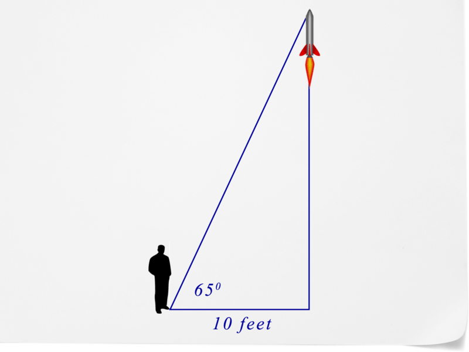

**In this problem, you have a lot of information, but the only important data is the shape of the triangle, the length of the base, and the measurement of the angle. The base is the side adjacent to where Craig is standing, and you want to find the value of the side opposite where Craig was standing. For these purposes, the hypotenuse of the triangle is irrelevant. Since you have the angle, and the adjacent side, you can find a tangent to discover the height of the triangle.**

$$
\begin{align*}
\tan gent &=\frac{opposite}{adjacent}\\
\tan 65^{\circ} &= \frac{opposite}{10 \ feet}\\
2.145 &=\frac{opposite}{10 \ feet}\\
2.145 \times 10 \ feet &= \frac{opposite}{10 \ feet} \times 10 \ feet\\
21.45 \ feet &=opposite
\end{align*}
$$

**Craig’s rocket reached it’s highest height at 21.45 feet, almost 21 and $\frac{1}{2}$ feet high!**

Real-Life Example Completed
---------------------------

**_The Ramp Dilemma (Part 2)_**

**Here is the original problem once again, be sure to reread it one last time.**

Mr. Watson’s homeroom decided to do a community service repairing the ramp outside the shed. Tache fresh coat of paint shone in the bright sunlight and Mr. Watson walked across the grass with all of his students to look at the ramp outside the door of the shed.

“Has that always been there?” asked Dan.

“No, in fact it was just brought out here yesterday,” Mr. Watson explained.

“Well if it’s brand new, then why do we need to fix it?” Emily asked.

“Because it doesn’t fit neatly under the door.”

Sure enough, the students looked and could see that the back of the ramp was too tall and the students would need to fix the back to make it fit beneath the doorway. Fixing this ramp would help everyone because it would make it easy to push or pull the cart with the athletic equipment out onto the field and since the equipment was used by local kid’s teams as well as the school, this was a definite way to give back to the community.

“What do we need to do?” Dan asked.

They looked at the ramp. Mr. Watson drew the following sketch.

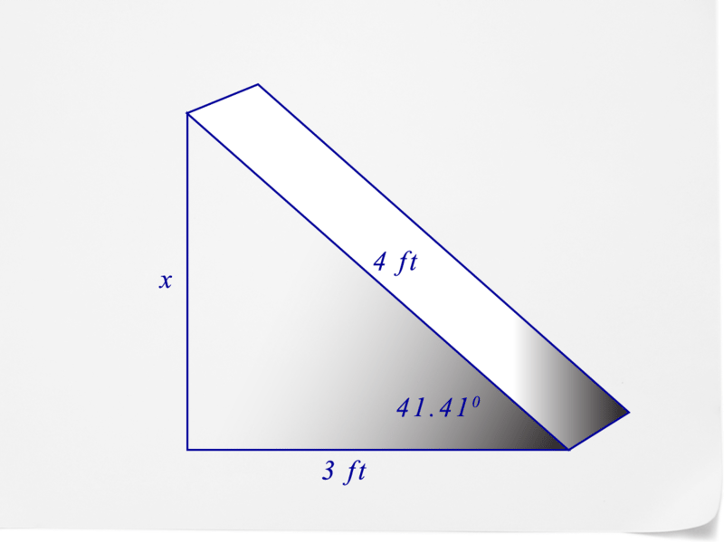

“Sure it is,” Emily said.

**_Solution to Real – Life Example_**

**First, we take the measurements and use the sine ratio.**

$\text{Sine} \ 15^{\circ} = \frac{Opposite}{Hypotenuse}$

**The opposite in this example is the missing side. We use $x$ to represent this unknown measure. This is the measure that we are searching for.**

$\text{Sine} \ 15^{\circ} = \frac{opposite}{hypotenuse}=\frac{x}{4 \ ft}$

**Now we can multiply both sides by 4 to find the measure.**

$$
\begin{align*}
4 \ \text{Sine} \ 15 &= x\\
2.6 & = x
\end{align*}
$$

**The height of the ramp is 2.6 feet**

Vocabulary
----------

Here are the vocabulary words that are found in this lesson.

__Sine__

a ratio between the opposite side and the hypotenuse of a given angle.

__Cosine__

a ratio between the adjacent side and the hypotenuse of a given angle.

__Tangent__

a ratio between the opposite side and the adjacent side of a given angle.

__Trigonometric Ratio__

used to find missing side lengths of right triangles when angle measures have been given.

Time to Practice
----------------

Directions: Answer each question about trigonometric ratios.

1.  True or false. There are three trigonometric ratios.
2.  True or false. The sine ratio is the opposite compared to the adjacent.
3.  True or false. The tangent ratio is the opposite compared to the adjacent.
4.  True or false. The sine ratio is the opposite compared to the hypotenuse.
5.  True or false. The cosine ratio is the adjacent compared to the hypotenuse.

Directions: Use the information given and what you have learned about trigonometric ratios to figure out the measure of each missing side.

6.  Tangent angle $A \ 45^{\circ}$, adjacent side length – 5, what is the length of the opposite side?
7.  Tangent angle $B \ 12^{\circ}$, adjacent side length – 6, what is the length of the opposite side?
8.  Tangent angle $C \ 20^{\circ}$, adjacent side length – 15, what is the length of the opposite side?
9.  Sine angle $D \ 2^{\circ}$, hypotenuse – 12, what is the length of the opposite side?
10. Sine angle $E \ 65^{\circ}$, hypotenuse – 8, what is the length of the opposite side?
11. Sine angle $F \ 45^{\circ}$, hypotenuse – 2, what is the length of the opposite side?

Directions: Answer each of the following questions.

12. What is the tangent ratio?
13. What is the cosine ratio?
14. What is the sine ratio?

Directions: Draw a diagram for each problem and then solve each problem using trigonometric ratios. Each problem has two parts, a diagram and an answer.

15. Mary wants to find out how tall a tree is. She knows if she measures the angle to from the ground to the tip of the tree 8 feet away, it is $85^{\circ}$. How tall is the tree?
16. Barry ties one end of string to the top of his apartment building, drops it to the ground, and then pulls it out from the building. If the angle the string makes with the ground is $75^{\circ}$ and the length of the string is 125 feet, how tall is the building?
17. A suspension bridge has a large metal pipe connecting the roadway to the top of the tower. The angle the pipe makes with the road is $40^{\circ}$ and the length of the pipe is 75 yards. What is the distance between the place where the roadway and pipe intersect and the base of the tower?

</article>

## 8.0 Measurement, Area and Volume

<article>

</article>

### 8.1 Area of Polygons

<article>

Introduction
------------

**_The School Olympics_**

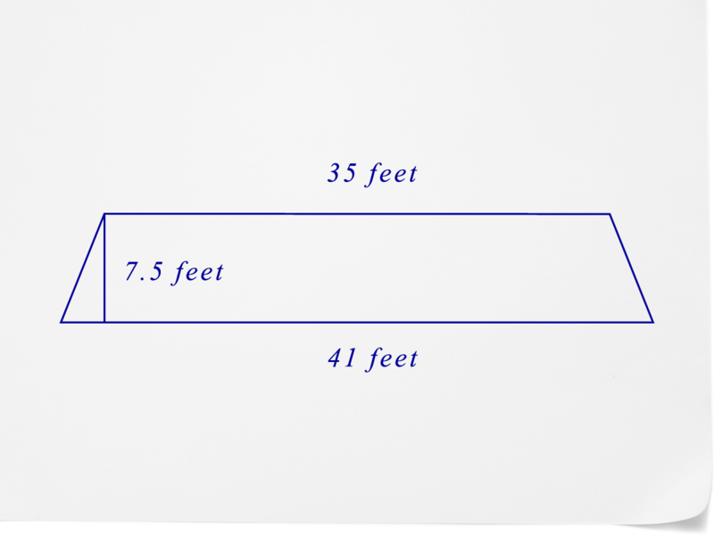

Mrs. Hamilton’s class is going to prepare an area for students to be awarded prizes after the competition. The area is in the shape of a trapezoid. Mr. Samuels the custodian dug out a great spot for a platform and the students will need to use cement to fill in the area for the award area.

“How are we going to do this?” Kelly asked Mrs. Hamilton.

“Well, let’s think it through. We know that the area will be level and Mr. Samuels already helped us with that piece. Now we need to figure out the area of the trapezoid and how much cement we will need.”

“We can start with the area,” Casey said smiling.

“Probably a good idea,” Mrs. Hamilton agreed.

**If the bases of the trapezoid are 35 feet and 41 feet and the height of the trapezoid is 7.5 feet, what is the area of the trapezoid?**

**If one bucket of cement covers 25 square feet, how many buckets will the students need?**

**This is the work that you will learn about in this lesson. Pay close attention and you will be able to solve this dilemma very soon.**

**_What You Will Learn_**

In this lesson, you will learn how to complete the following skills.

* Find areas and linear dimensions of any triangle.
* Find areas and linear dimensions of any quadrilateral.
* Find areas and linear dimensions of any polygon.
* Solve real – world problems involving area of polygons, including metric and customary units of length and area.

**_Teaching Time_**

I. **Find Areas and Linear Dimensions of any Triangle**

In this lesson we will explore the area of **_polygons_**. **Polygons can have any number of angles and sides, but their sides are always straight.** **_Triangles_** **are polygons that have three angles and sides.** **_Quadrilaterals_** **(including squares, rectangles, and parallelograms) have four angles and sides.** **_Other polygons_****, such as pentagons, hexagons, and octagons, have even more angles and sides.**

**_Area_** **is the amount of two-dimensional space a figure covers.** In this lesson we will learn how to find the area of polygons using formulas and other concepts. We will see how we can break a polygon into triangles to find its area. Let’s see how this works by first understanding the formula for the area of triangles.

**How do we find the area of a triangle?**

Area, as we have said, is the amount of space a figure covers. To find area, we multiply the dimensions, or sides, of the figure. In a triangle, those dimensions are its height, $h$, and its base, $b$. The area formula for triangles is

$A  =\frac{1}{2} bh$

**The** **_base_** **is the area at the bottom of the triangle opposite the vertex or top point.** When finding the area of triangles, remember that the **_height_** **of a triangle is always perpendicular to the base.** The height is not necessarily a side of the triangle; this happens only in right triangles, because the two sides joined by a right angle are perpendicular.

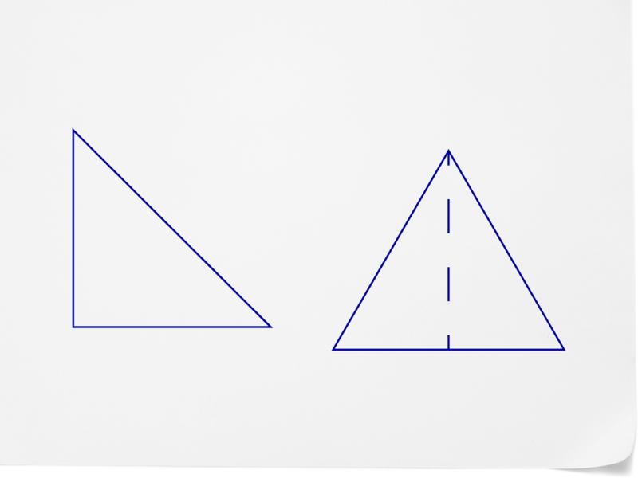

Example

_Find the area of the triangle below._

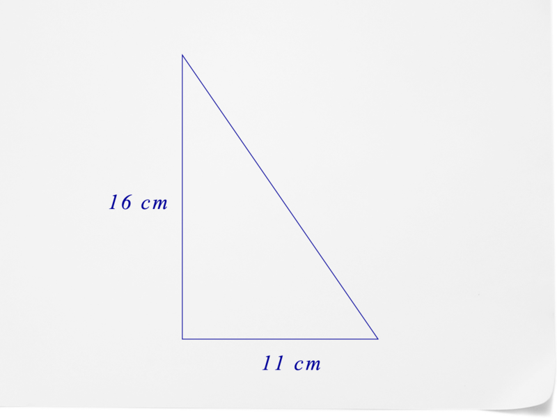

$$
\begin{align*}
A &=\frac{1}{2} bh\\
A &=\frac{1}{2}11(16)\\
A &=\frac{1}{2}(176)\\
A &=88 \ cm^2
\end{align*}
$$

**Remember that we always measure area in square units because we are combining two dimensions.**

**The area of this triangle is 88 square centimeters.**

Finding the area of a triangle is just that simple. We can also use this same formula to figure out a missing dimension of the triangle. This is possible if we are given the area and one dimension to start with. Then we can use the formula, substitute the values and solve for the missing dimension. Let’s take a look.

Example

_A triangle has an area of $44 \ {m^2}$. The base of the triangle is 8 m. What is its height?_

**In this problem, we know the area and the base of the triangle. We put these numbers into the formula and solve for the height, $h$.**

$$
\begin{align*}
A &=\frac{1}{2} bh\\
44 &=\frac{1}{2} 8h\\
44 \div \frac{1}{2} &=8h\\
44 \left (\frac{2}{1} \right) &=8h\\
88 &=8h\\
11 \ m &=h
\end{align*}
$$

**Remember, when you divide both sides by a fraction, you need to multiply by its reciprocal. To divide by $\frac{1}{2}$, then, we multiply by 2. Keep this in mind when you use the area formula.**

**By solving for $h$, we have found that the height of the triangle is 11 meters.**

Now that we understand how area works for triangles, let’s see how we can use this information to find the area of quadrilaterals.

II. **Find Areas and Linear Dimensions of any Quadrilateral**

**_Quadrilaterals_** **are four-sided polygons. Rectangles, squares, parallelograms, rhombi, and trapezoids are all quadrilaterals.** Each of these has its own area formula. We can also find the area of any of these quadrilaterals by using what we know about triangles, because we can divide them all into two triangles. Take a look.

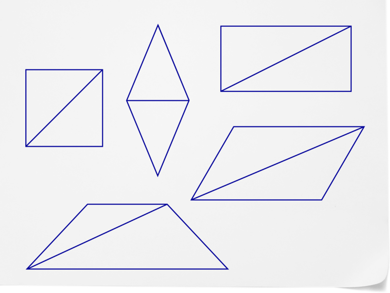

**Let’s start by looking at rectangles.**

To find the area of a rectangle, we multiply the length times the width. Let’s apply it with an example.

$A=lw$

Example

_What is the area of a rectangle with a length of 6 inches and a width of 4 inches?_

**To figure this out, we substitute the values for length and width into the formula.**

$$
\begin{align*}
A &=lw\\
A &=(6)(4)\\
A &=24 \ sq.in.
\end{align*}
$$

**This is the answer.** Notice that we write the units for measurement as square inches because we are solving for area.

**What about parallelograms?**

Parallelograms are very similar to rectangles. In fact, a rectangle is a type of parallelogram. However, some parallelograms do not have four right angles. Because of this, we have to use a different formula for them. To find the area of a parallelogram, we multiply the base times the height.

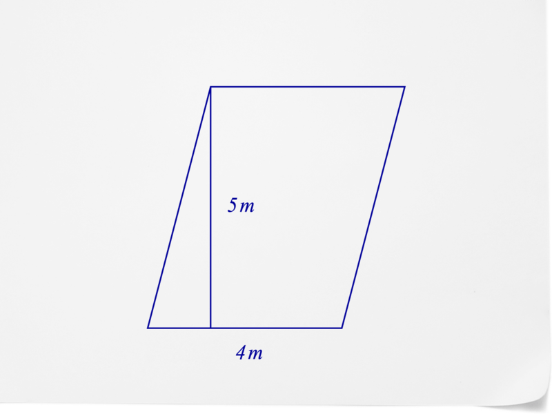

$$
\begin{align*}
A &=bh\\
A &=(5)(4)\\
A &=20 \ sq.meters
\end{align*}
$$

**This is the answer.**

**What about trapezoids?**

**A trapezoid is an interesting figure because it has two bases and a height. We have to consider the lengths of both of the bases and the height of the trapezoid to figure out its area. Here is the formula that we can use for finding the area of a trapezoid.**

$A=\frac{1}{2}({b_1}+{b_2})h$

**If we substitute the given values into this formula, then we can find the area of any trapezoid.**

Now let’s look at applying some of this formula

Example

Find the area of this trapezoid.

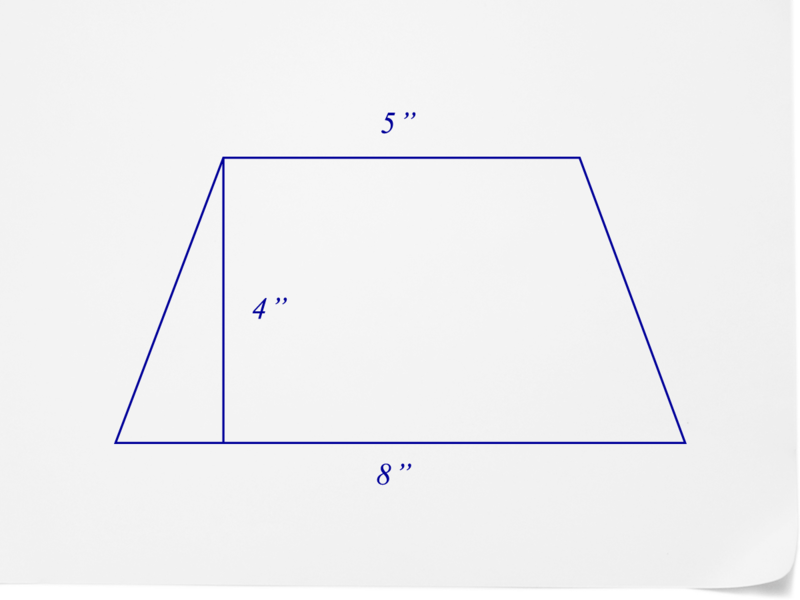
\begin{align*}
A &=\frac{1}{2}(5+8)(4)\\
A &=\frac{1}{2}(13)(4)\\
A &=\frac{1}{2}(52)\\
A &=26 \ sq.inches
\end{align*}
$$

**This is the answer.**

In the same way that we did for triangles, we can use the area formulas of quadrilaterals to solve for unknown dimensions. We simply fill the information we have been given into the appropriate formula and solve for the unknown variable. Let’s give it a try.

Example

_A parallelogram has an area of $105 \ m^2$ The height of the parallelogram is 7 m. What is its base?_

First of all, what kind of quadrilateral are we dealing with in this problem? It tells us that the figure is a parallelogram, so we will need to use the formula $A = bh$. We know the area and the height of the parallelogram, so we can put these numbers into the formula and solve for the base, $b$.

$$
\begin{align*}
A &=  bh\\
105 &=  b (7)\\
105 \div 7 &=  b\\
15 \ m &=  b
\end{align*}
$$

**By solving for $b$, we have found that the base of the parallelogram is 15 meters.**

Let’s check our calculation to be sure. We can check by putting the base and height into the formula and solving for area:

$$
\begin{align*}
A &=  bh\\
A &=  15 (7)\\
A &=  105 \ m^2
\end{align*}
$$

We know the area is $105 \ m^2$, so our calculation is correct.

**We can follow this same process whenever we are given the area of a quadrilateral and need to solve for an unknown dimension. Just be sure you know what kind of quadrilateral you’re dealing with so that you know which area formula to use.**

III. **Find Areas and Linear Dimensions of Any Polygon**

We can use this same method for even larger polygons. Every regular polygon can be divided into congruent triangles. A regular polygon has congruent sides and congruent angles. Take a look below.

")

\[Figure 9\]

We can divide any regular polygon into smaller triangles by drawing **_diagonals_**. **A diagonal is a line drawn from one vertex, or angle, to any other vertex in the polygon.** The number of diagonals depends on the number of angles and sides in the polygon. The dotted lines in the polygons above represent diagonals.

**As you can see, the diagonals divide each polygon into congruent triangles. Therefore if we can find the area of one triangle, we can multiply it to find the area of the whole figure. Let’s see how this works with an example.**

Example

_What is the area of the figure below?_

. The line inside the pentagon is called an** **_apothem_****. It is perpendicular to one side of the pentagon and connects that side to the center. We can use this as the height of our triangle.**")

**Now let’s work with only one of the triangles. We have a triangle with a base of 6 inches and a height of 4 inches. We can use the formula to calculate its area.**

$$
\begin{align*}
A & =\frac{1}{2} bh\\
A &= \frac{1}{2} (4) (5.81)\\	
A &= 2 (5.81)\\
A &= 11.62 \ in.^2
\end{align*}
$$

**The area of the triangle is 11.62 square inches.**

**Next, we can think about the five congruent triangles that make up the pentagon, so we can find its area by multiplying the area of one triangle by 5: $11.62 \times 5 = 58.1$.**

**The area of the whole pentagon is 58.1 square inches.**

You can work with any polygon in this way. Think about a hexagon or an octagon. The number of triangles will change, but as long as you have the apothem and the length of one side, you can calculate the area of the polygon.

We can work the other way around too. If you know the area of a figure and one other dimension, either the apothem or the base you can figure out the missing dimension by working backwards. First, you will have to divide the area by the number of triangles in the figure, and then you will have to use the formula to work backwards.

Take a look at this example.

Example

The area of a hexagon is 105 sq.inches. The length of the base is 7 inches, what is the height or apothem of the figure?

**To work on this problem, we first have to figure out the area of each individual triangle in the hexagon. There are six triangles in this hexagon, so we can divide the total area by six.**

$105 \div 6=17.5 \ sq.inches$

**Now we can use the formula for area of a triangle to figure out the missing height.**

$$
\begin{align*}
17.5 &=\frac{1}{2}(7h)\\
17.5 &=3.5h\\
5 \ inches &=h
\end{align*}
$$

**The height of the figure is 5 inches.**

IV. **Solve Real – World Problems involving Area of Polygons, including Metric and Customary Units of Length and Area**

We have seen that we can find the area of different polygons and use area formulas in different kinds of situations. Sometimes we need to solve for the area, but other times we may need to find the height or the base of a figure. We can also use area formulas when we are given measurements of real objects.

Let’s try a few problems involving finding area in the real world.

Example

_Mr. Okada is buying new carpet to redecorate his parallelogram-shaped shop. To determine how much carpet he needs, he measured the length of the room and found it was 36 meters. Then he measured across the room with a line perpendicular to the first and found it was 16 meters across. How many square meters of carpet does Mr. Okada need to buy?_

**First, let’s decide which kind of polygon is involved in the problem. It tells us that Mr. Okada’s shop is in the shape of a parallelogram, so now we know what we are dealing with. Now we need to figure out what the problem is asking us to find. We need to find how much carpet Mr. Okada needs to cover the floor of his shop, so we have to find the area of the shop. That means we will use the area formula for parallelograms to solve for $A$. In order to use the formula, we need to know the base and height of the shop.**

We know that one side of the shop is 36 meters. Let’s call this the base. We also know that Mr. Okada made a perpendicular line in order to measure the height, or the distance across the room. The height given in the problem is 16 meters. Let’s put this information into the formula and solve for area.

$$
\begin{align*}
A &=  bh\\
A &=  36(16)\\
A &=  576 \ m^2
\end{align*}
$$

**Mr. Okada will need to buy 576 square meters of carpet.**

**Now let’s look at how we can apply what we have learned about area to the problem from the introduction.**

Real-Life Example Completed
---------------------------

**_The School Olympics_**

**Here is the original problem once again. Reread it and then solve both parts of the problem.**

Montgomery Middle School is going to host a school wide Olympics for the first time. The students have been studying the Greek Olympics. There has been so much enthusiasm over the content that the administration has decided to promote this event. Each class is taking on one piece of the project. The initial preparations have already started and a fantastic two day Olympic event will take place in six weeks.

Mrs. Hamilton’s class is going to prepare an area for students to be awarded prizes after the competition. The area is in the shape of a trapezoid. Mr. Samuels the custodian dug out a great spot for a platform and the students will need to use cement to fill in the area for the award area.

“How are we going to do this?” Kelly asked Mrs. Hamilton.

“Well, let’s think it through. We know that the area will be level and Mr. Samuels already helped us with that piece. Now we need to figure out the area of the trapezoid and how much cement we will need.”

“We can start with the area,” Casey said smiling.

“Probably a good idea,” Mrs. Hamilton agreed.

**If the bases of the trapezoid are 35 feet and 41 feet and the height of the trapezoid is 7.5 feet, what is the area of the trapezoid?**

**If one bucket of cement covers 25 square feet, how many buckets will the students need?**

**_Solution to Real – Life Example_**

**The first thing we need to do is decide which kind of polygon we are dealing with. The driveway in the picture has two parallel sides, but one is shorter than the other. This is a trapezoid, so we know we’ll need to use the area formula for trapezoids.**

**What is the problem asking us to find? We need to find the number of buckets of cement necessary to cover the award area. In order to figure this out, though, we first need to find the area of the trapezoid so we know how much space needs to be covered. We will use the formula to solve for the area of the trapezoid.**

**What information have we been given? We know that one base, the long side of the trapezoid, is 41 feet. The shorter base is 35 feet. In this case the height of the trapezoid is the distance across the platform, and this is 7.5 feet. Let’s put this information into the formula and solve for $A$:**

$$
\begin{align*}
A &= \frac{1}{2}(b_{1}+b_{2})h\\
A &=  \frac{1}{2}(41 +  35)(7.5)\\
A &=  \frac{1}{2}(76) (7.5)\\
A &=  38 (7.5)\\
A &=  285 \ ft^2
\end{align*}
$$

**The area of the platform is 285 square feet.**

**But we’re not done yet! Remember, we need to find a number of buckets of cement. What information have we been given about the cement? We know that one bucket of cement covers 25 square feet.**

**To find the number of buckets of cement necessary to cover the whole driveway, we need to divide the area by 25.**

$285 \div 25= 11.4$

**The students therefore must buy 12 buckets of cement to pave the award area.**

Vocabulary
----------

Here are the vocabulary words that are found in this lesson.

__Polygon__

a simple closed figure made up of at least three line segments.

__Triangle__

a three-sided polygon.

__Quadrilateral__

a four-sided polygon.

__Pentagon__

a five-sided polygon.

__Hexagon__

a six-sided polygon.

__Octagon__

an eight sided polygon.

__Area__

the two-dimensional space that a figure occupies.

__Height of the triangle__

the line perpendicular to the base.

__Base of a triangle__

the line perpendicular to the height.

__Diagonal__

a line that connects one vertex to another.

__Apothem__

the height of a triangle in a polygon-it is a perpendicular to the base that is connected to the center of the figure.

Time to Practice
----------------

Directions: Find the area of each triangle described below.

1.  $b=10 \ inches, \ h=5 \ inches$
2.  $b=7 \ inches, \ h=5.5 \ inches$
3.  $b=8 \ feet, \ height=6 \ feet$
4.  $b=9 \ feet, \ height=7.5 \ feet$
5.  $b=12 \ meters, \ h=9 \ meters$
6.  $b=15 \ feet, \ h=12 \ feet$

Directions: Find the missing dimension for each triangle given the area and one other dimension.

7.  $A=4.5 \ sq.in, \ b=4.5 \ in, \ h= ?$
8.  $A=21 \ sq.ft, \ b=7 \ ft, \ h= ?$
9.  $A=60 \ sq.in, \ h=10 \ in, \ b= ?$
10. $A=97.5 \ sq.ft, \ h=13 \ ft, \ b= ?$
11. $A=187 \ sq.ft, \ b=22 \ ft, \ h= ?$
12. $A=405 \ sq.ft, \ b=30 \ ft, \ h= ?$

Directions: Find the area of the following rectangles.

13. $l=10 \ in, \ w=7.5 \ in$
14. $l=12 \ ft, \ w=9 \ ft$
15. $l=14 \ ft, \ w=11 \ ft$
16. $l=21 \ ft, \ w=19 \ ft$

Directions: Find the area of each parallelogram.

17. $b=11 \ ft, \ h=9 \ ft$
18. $b=13 \ in, \ h=11 \ in$
19. $b=22 \ ft, \ h=19 \ ft$
20. $b=31 \ meters, \ h=27 \ meters$

Directions: Find the area of each trapezoid.

21. $Bases=5 \ in \ and \ 8 \ in, \ height=4 \ inches$
22. $Bases=6 \ in \ and \ 8 \ in, \ height=5 \ inches$
23. $Bases=10 \ feet \ and \ 12 \ feet, \ height=9 \ feet$

</article>

### 8.2 Area of Circles

<article>

Introduction
------------

**_The Discus Ring_**

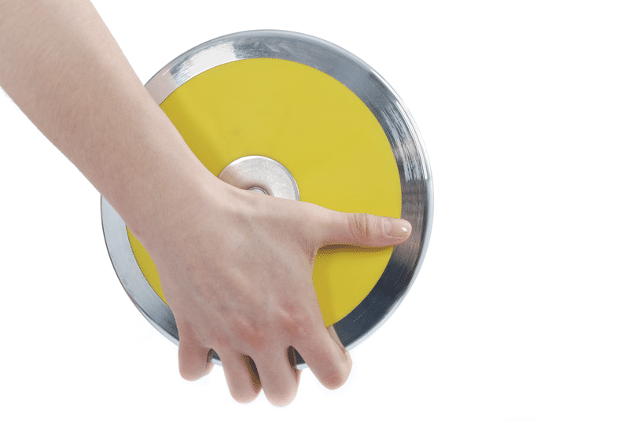

“Figure what out?” Emory inquired.

“I have to figure out the area of the discus ring. That is what Mrs. Henry asked me to figure out,” Jesse said.

“Well, what do you know?”

“I know that the shape of it is a circle. I also know that the diameter of the circle is 8 feet. I need the area of the ring now and that is where I am stuck,” Jesse explained.

“That’s not so hard,” Emory said.

Jesse looked at his friend puzzled.

**Do you know what Emory knows? In this lesson you will learn all about area and circles. At the end of the lesson, you will see this problem again. Then you will need to help Jesse solve for the area of the discus ring.**

**_What You Will Learn_**

By the end of this lesson, you will understand how to perform the following skills.

* Identify the radius, diameter and circumference of circles.
* Model the area of a circle as the sum of the areas of several congruent sectors reformed to approximate a parallelogram.
* Find areas and linear dimensions of circles and sectors of circles.
* Solve real – world problems involving areas of circles and sectors of circles, including metric and customary units of length and area.

**_Teaching Time_**

I. **Identify the Radius, Diameter and Circumference of Circles**

**_Circles_** are unique geometric figures. **A circle is the set of points that are equidistant from a center point.**

**The** **_radius_** **of a circle is the distance from the center to any point on the circle. The diameter is the distance across the circle through the center. The** **_diameter_** **is always twice as long as the radius.**

**We also use the special number** **_pi_** **when dealing with circle calculations.** **_Pi_** **is a decimal that is infinitely long (3.14159265...), but in our calculations we round it to 3.14. We use the symbol $\pi$ to represent this number.**

Pi is the ratio of the **_circumference_**, or **distance around a circle**, to the diameter. In other words, these two measurements are related. If we change the diameter, the circumference changes proportionally. For example, if we double the length of the diameter, the circumference doubles also.

**Let’s review working with the radius and diameter while finding the circumference.**

As the diameter of the circle grows, the circumference of the circle grows at the same rate. In other words, however the diameter of the circle changes, the circumference of the circle must change exactly the same way. This is a proportional relationship.

We express this proportional relationship as a ratio. A ratio simply means that two numbers are related to each other. Circles are special in geometry because this ratio of the circumference and the diameter always stays the same.

We can see this when we divide the circumference of a circle by its diameter. No matter how big or small the circle is, we will always get the same number. Let’s try it out on the circles below.

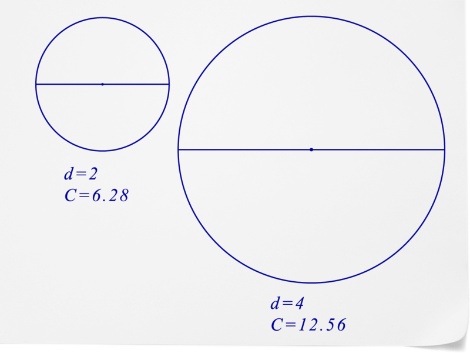
\begin{align*}
\frac{Circumference}{Diameter} &=\frac{6.28}{2}=3.14\\
\frac{Circumference}{Diameter} &=\frac{12.56}{4}=3.14
\end{align*}
$$

**Even though we have two different circles, the result is the same. Therefore the circumference and the diameter always exist in equal proportion, or a ratio, with each other. Whenever we divide the circumference by the diameter, we will always get 3.14,** **_pi_****.**

Using the equations above, we can write a general formula that shows the relationship between _pi_, circumference, and diameter. When we rearrange it, we get the formula for the circumference of a circle.

$\pi=\frac{C}{d}$ so $C=\pi d$

If we divide the circumference by the diameter to find pi, then we can use the formula circumference equals pi times the diameter to find the circumference of any circle.

Example

_What is the circumference of a circle that has a diameter of 3 inches?_

**To find the circumference, we can substitute these values into the formula.**

$$
\begin{align*}
C &=\pi(3)\\
C &=3.14(3)\\
C &=9.42 \ inches
\end{align*}
$$

**What about if we were given the measurement for the radius instead of the diameter?**

Well, we know that the radius is one – half of the diameter, so we can use the following formula or you can figure out the measurement for the diameter by using mental math.

$C=2 \pi r$

Example

_What is the circumference of a circle if the radius is 2.5 feet?_

**First, we can find the diameter using this measurement. If the radius is 2.5 feet, then the diameter is 5 feet. Let’s find the circumference using this measurement.**

$$
\begin{align*}
C &=3.14(5)\\
C &=15.7 \ feet
\end{align*}
$$

**We could also have used the radius alone to find the circumference. We just use a different formula.**

$$
\begin{align*}
C &=2(3.14)(2.5)\\
C &=15.7 \ feet
\end{align*}
$$

**You can see that we can use either the measurement for the radius or for the diameter to find the measurement for the circumference.**

II. **Model the Area of a Circle as the Sum of the Areas of Several Congruent Sectors Reformed to Approximate a Parallelogram**

**_Area_** **is the amount of two-dimensional space a figure takes up. In other words, area is the space contained within a circle’s circumference.**

In rectangles, we know that area is a measure of the length times the width (the two dimensions). Circles are curved, so how can we measure its length and width?

Well, we can cut up a circle into smaller portions, called **_sectors_**. **A sector is a part of a circle with radii for two sides and part of the curved circumference as another. Sectors look like pie slices.**

We can arrange the sectors of a circle to approximate a rectangle. Take a look at this picture.

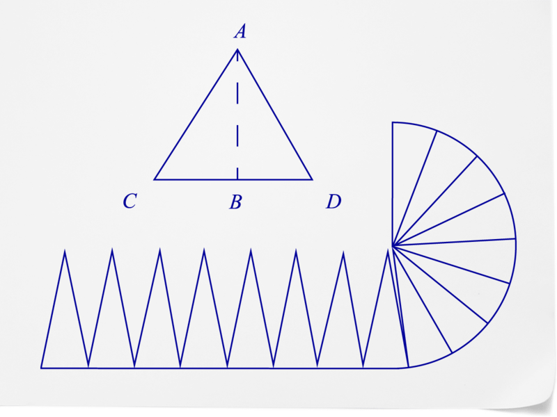

$A=\pi r^2$

We already know that the symbol $\pi$ represents the number 3.14, so all we need to know to find the area of a circle is its radius. We simply put this number into the formula in place of $r$ and solve for the area, $A$.

We can use this formula whether we have been given the radius or the diameter of the circle.

III. **Find Areas and Linear Dimensions of Circles and Sectors of Circles**

Now that you have the formula for finding the area of a circle, we can apply it when working with examples. Let’s try out the formula.

Example

_What is the area of the circle below?_

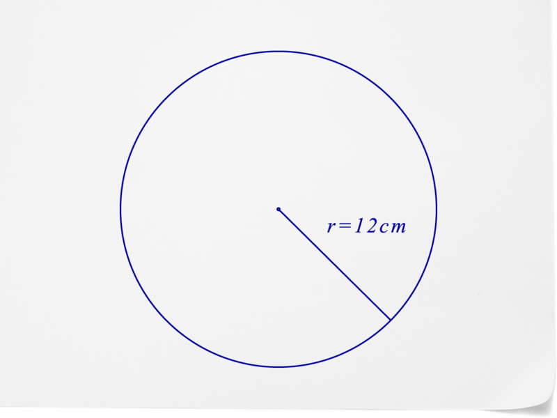

$$
\begin{align*}
A & =\pi r^2\\
A &=\pi (12^2)\\
A &=  144 \pi\\
A & =  452.16 \ {cm^2}
\end{align*}
$$

Remember that squaring a number is the same as multiplying it by itself. The area of a circle with a radius of 12 centimeters is 452.16 square centimeters when we approximate pi as 3.14. We always show area in square units. Let’s try another.

Example

_What is the area of a circle with a diameter of 45 centimeters?_

**Read the problem carefully! We need to find the area, but what information is given in the problem? This time we know the diameter, not the radius. How can we find the radius so that we can use the area formula?**

**We know that the diameter of a circle is always twice the length of the radius. If the diameter is 45 centimeters, then the radius must be $45 \div 2 = 22.5 \ centimeters$. Now we can put this number into the formula.**

$$
\begin{align*}
A &=\pi r^2\\
A &=\pi(22.{5^2})\\
A  &=  506.25 \pi\\
A  &=  1,589.63 \ {cm^2}
\end{align*}
$$

The area of a circle with a diameter of 45 centimeters (and a radius of 22.5 centimeters) is 1,589.63 square centimeters when we approximate pi as 3.14.

Nice work! We can also use the formula to find the radius or diameter if we know the area. Let’s see how this works.

Example

_The area of a circle is 113.04 square inches. What is its radius?_

This time we know the area and we need to find the radius. We can put the value for area into the formula and use it to solve for the radius, $r$.

$$
\begin{align*}
A &=\pi r^2\\
113.04 &= \pi r^2\\
113.04 \div \pi & =   r^2\\
36 & = r^2\\
\sqrt{36} &= r\\
6 \ in.& =  r
\end{align*}
$$

**To solve this problem, we need to isolate the variable $r$. First we divide both sides by $\pi$, or 3.14. Then, to remove the exponent, we take the square root of both sides. A square root is a number that, when multiplied by itself, gives the number shown. We know that 6 is the square root of 36 because $6 \times 6 = 36$.**

**The radius of a circle with an area of 113.04 square inches is 6 inches.**

**Using what we have learned, can we find the area of a sector?**

Sometimes we may be asked to find the area of a sector, or portion, of a circle, such as a quarter or half of the circle. As long as we know the radius, we can find the area of the whole circle. Then we can divide that area into smaller pieces or subtract a portion to find the area of part of the circle. Let’s try this out.

Example

_What is the area of the figure below?_

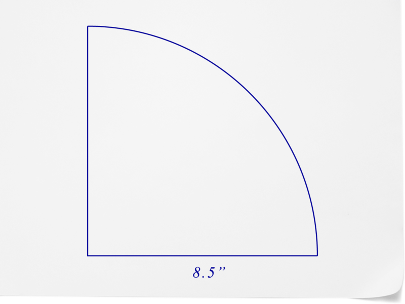

$$
\begin{align*}
A & =\pi r^2\\
A &= \pi (8.5^2)\\
A  &=  72.25 \pi\\
A  &=  226.87 \ in.^2
\end{align*}
$$

**We know that the area of a whole circle with a radius of 8.5 inches is 226.87 square inches.**

**Therefore the quarter circle formed by the $90^\circ$ angle must have $\frac{1}{4}$ of this area. We can divide the area by 4 to find the area of the sector: $226.87 \div 4 = 56.72$ square inches. As long as we can find the area of a whole circle, we can divide or subtract to find the area of a sector of a circle.**

We can use this formula to find the area of a sector when we know the measure of the angle too. Let’s think about how we can do this in the following example.

Example

_What is the area of the sector below?_

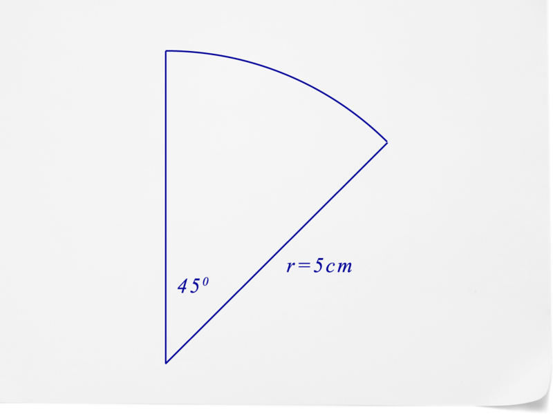

$$
\begin{align*}
A &=\frac{degrees \ in \ angle}{degrees \ in \ circle} \times \pi {r^2}\\
A & =\frac{45}{360} \pi  {(5^2)}\\	
A &=\frac{1}{8} (25) \pi \\
A & =\frac{25}{8} \pi \\ 
A &=3.125 \pi \\
A &=9.81 \ {cm^2}
\end{align*}
$$

**The area of this sector is 9.81 square centimeters.**

**The sector makes up exactly $\frac{1}{8}$ of the circle, so we know that 9.81 must be $\frac{1}{8}$ of the circle’s total area. Let’s check to make sure by finding the area of the circle.**

$$
\begin{align*}
A &=\pi {r^2}\\
A & =\pi {(5^2)}\\
A &= 25 \pi \\
A &= 78.5 \ {cm^2}
\end{align*}
$$

**Our work is accurate and correct.**

IV. **Solve Real – World Problems Involving Areas of Circles and Sectors of Circles, Including Metric and Customary Units of Length and Area**

We can use the formula we have learned to solve real-world problems involving the area of circles. First, be sure you understand what the question is asking. Do you need to find the area of a circle or a sector, or the radius or diameter? Second, make sure you know what the radius of the circle is. If you have been given the diameter, divide it in half to find the radius.

Let’s start with an example.

Example

_Some students have formed a circle to play dodge ball. The radius of the circle is 21 feet. What is the area of their dodge ball circle?_

**The dodge ball court forms a circle, so we can use the formula to find its area. We know that the radius of the circle is 21 feet, so let’s put this into the formula and solve for area, $A$.**

$$
\begin{align*}
A &=\pi {r^2}\\
A &=\pi {(21)^2}\\
A &= 441 \pi \\
A &= 1,384.74 \ ft^2
\end{align*}
$$

**Notice that a circle with a large radius of 21 feet has a large area: 1,384.74 square feet.**

**Now let’s use what we have learned to solve the problem from the introduction.**

Real-Life Example Completed
---------------------------

**_The Discus Ring_**

**Here is the original problem once again. Reread it and then solve for the area of the discus ring.**

“I don’t know how to figure this out,” Jesse said to his friend Emory one morning.

“Figure what out?” Emory inquired.

“I have to figure out the area of the discus ring. That is what Mrs. Henry asked me to figure out,” Jesse said.

“Well, what do you know?”

“I know that the shape of it is a circle. I also know that the diameter of the circle is 8 feet. I need the area of the ring now and that is where I am stuck,” Jesse explained.

“That’s not so hard,” Emory said.

Jesse looked at his friend puzzled.

**_Solution to Real – Life Example_**

**To solve this problem, let’s begin by looking at the known information. We know that the circle is the shape of the discus ring. We also know the diameter of the ring is 8 feet. This information is all that we need.**

**Let’s look at the formula for finding the area of a circle.**

$A=\pi {r^2}$

**We know that the diameter of the circle is 8 feet. The radius is unknown. Radius is $\frac{1}{2}$ of the diameter so the radius of the discus ring is 4 feet.**

**Now we can substitute the given information into the formula and solve.**

$$
\begin{align*}
A &= \pi {r^2}\\
A &= (3.14)(4^2)\\
A &= (3.14)(16)\\
A &= 50.24 \ sq. feet
\end{align*}
$$

**This is the area of the discus ring.**

Vocabulary
----------

Here are the vocabulary words that are found in this lesson.

__Circle__

all points are equidistant from a center point.

__Radius__

the distance half-way across a circle.

__Diameter__

the distance across a circle.

__Circumference__

the distance around a circle.

__Area__

the measurement of the two – dimensional space inside a circle.

__Sector__

the measurement of a section of a circle.

Time to Practice
----------------

Directions: Find the circumference of each circle given the radius or diameter.

1.  $d=10 \ in$
2.  $d=5 \ in$
3.  $d=7 \ ft$
4.  $d=12 \ mm$
5.  $d=14 \ cm$
6.  $r=4 \ in$
7.  $r=6 \ meters$
8.  $r=8 \ ft.$
9.  $r=11 \ in$
10. $r=15 \ cm$

Directions: Find the area of each circle given the radius.

11. $r=4 \ in$
12. $r=3 \ ft$
13. $r=2.5 \ in$
14. $r=5 \ cm$
15. $r=3.5 \ in$
16. $r=9 \ mm$
17. $r=11 \ cm$
18. $r=10 \ in$
19. $r=7 \ ft$
20. $r=8 \ in$

Directions: Find the area of each sector given the radius and the angle measure. You may round to the nearest hundredth as needed.

21. $45^\circ$ _angle with a radius of 3 in._
22. $55^\circ$ _angle with a radius of 4 mm_
23. $60^\circ$ _angle with a radius of 5 cm_
24. $43^\circ$ _angle with a radius of 6 in_
25. $70^\circ$ _angle with a radius of 2 in._

</article>

### 8.3 Solid Figures

<article>

Introduction
------------

**_The Awards_**

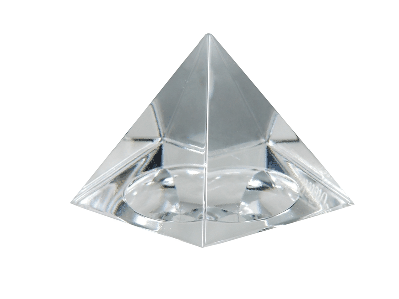

“I don’t. A medal is what is traditional and I think we should stick with medals,” Travis disagreed.

“Well, medals are so flat. I like the idea of being different. Besides, this is our first Olympics we could make our award interesting and unique,” Marcy added in.

“What about a prism instead? Something cool like pentagonal prism. I’ll draw my idea out and then we can take a look at it,” Jose said taking out a piece of paper and pencil.

“What is that?” Marcy asked leaning over his shoulder.

“A pentagonal prism,” Jose said.

“Nope, you have the faces and edges all wrong.”

**How many faces and edges are there in a pentagonal prism? When working with solid figures, there are patterns that can help you to figure out this information. At the end of this lesson you will need to figure out the parts of a pentagonal prism.**

**_What You Will Learn_**

In this lesson you will learn how to do the following skills.

* Classify solid figures.
* Identify and count faces, edges and vertices of solid figures.
* Sketch representations of solid figures as perspective or top – front – side views.
* Identify patterns and describe relationships among the number of edges, vertices and faces of solid figures.

**_Teaching Time_**

I. **Classify Solid Figures**

In this lesson we will examine **_solid figures_**. **Solid figures are shapes that exist in three-dimensional space.** Unlike plane shapes, which have only length and width, **solid figures have length, width, and height**. We will learn to identify solid figures and their properties. Let’s take identifying solid figures.

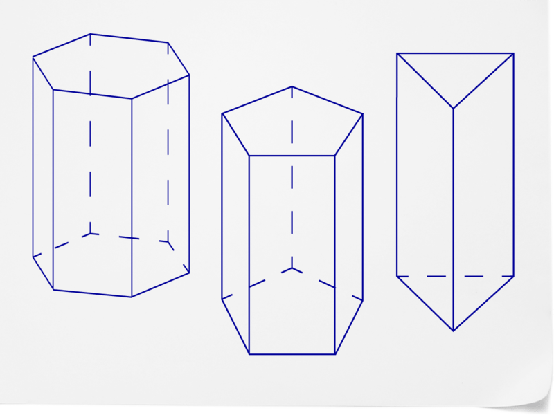

Another type of solid figure is called a **_pyramid_**. **A pyramid has a base and triangular sides that meet at a single vertex.** We identify a pyramid according to its base. Here are some pyramids.

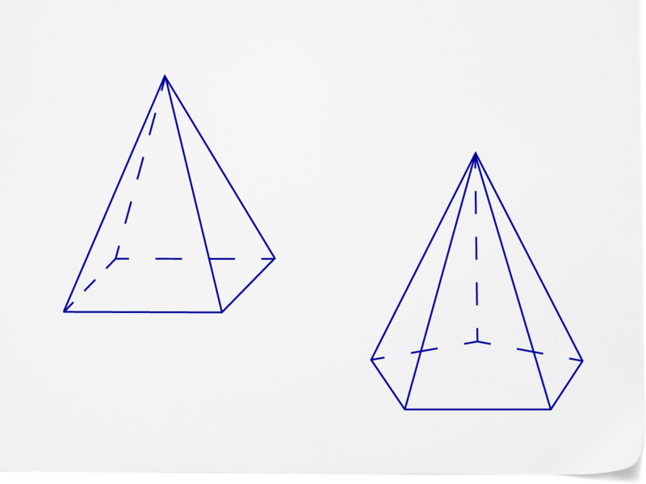

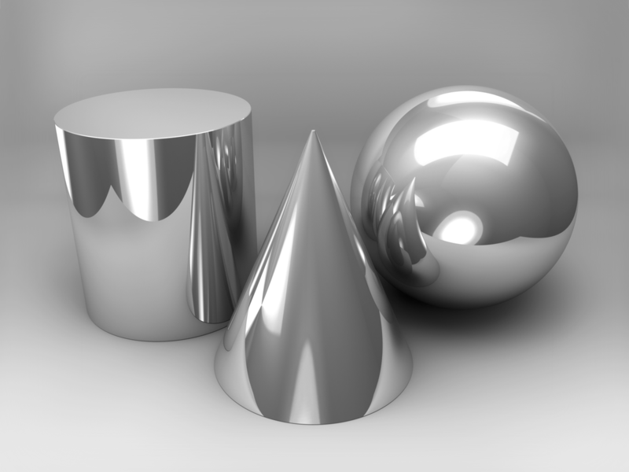

Solid figures have **_faces_**, **_edges_** and **_vertices_**. We can use the number of faces, edges and vertices to identify the solid figures.

**What is a face?**

**A** **_face_** **is the flat side of a solid figure.** Faces are in the form of plane shapes, such as triangles, rectangles, and pentagons.

**What is an edge?**

**An** **_edge_** **is the place where two faces meet. Edges are straight; they cannot be curved.**

**What is a vertex?**

**_Vertices_** **or a** **_vertex_** **is the point where edges meet. We often think of them as the points of a figure.**

We can identify the three parts of a solid by looking at the following diagram.

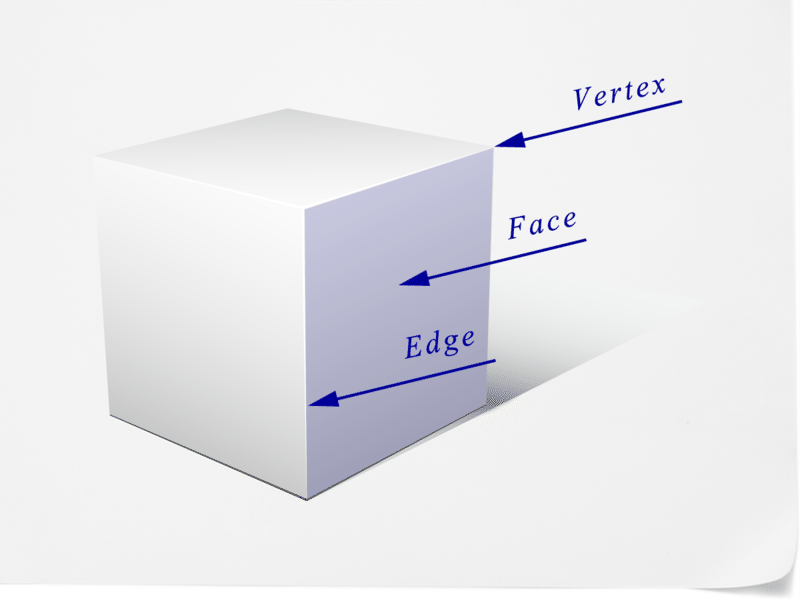

Example

_How many faces, edges, and vertices does the figure below have?_

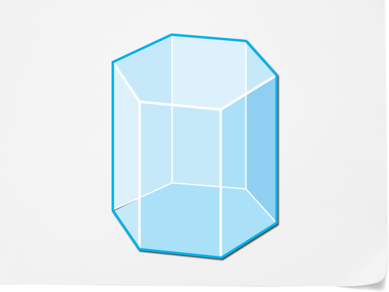

**Next let’s count the edges where each face meets another.** There are six around the top hexagon where it meets each side, and six more around the bottom hexagon where it meets each side. And there are six more where each side meets another. This figure has 18 edges.

**Now let’s find the vertices.** Remember, a vertex is like a corner. This figure has six corners, or vertices, on the top and six on the bottom. It has twelve vertices in all.

**We can count faces, edges and vertices of all the solids.** This information can also help us to classify them. If you think about prisms and pyramids, you can think about the number of edges, faces and vertices. However, if you think about a sphere, a cone and a cylinder, you will notice that faces, edges and vertices don’t apply to all of theses. Let’s look at a chart to help us classify solid figures according to their faces, edges and vertices.

| **Figure Name** | **Number of Faces** | **Number of Edges** | **Number of Vertices** |
| --- | --- | --- | --- |
| sphere | 0   | 0   | 0   |
| cone | 1   | 0   | 0   |
| cylinder | 2   | 0   | 0   |
| triangular pyramid | 4   | 6   | 4   |
| square pyramid | 5   | 8   | 5   |
| prism | at least 5 | at least 9 | at least 6 |

III. **Sketch Representations of Solid Figures as Perspective or Top-Front-Side Views**

Now that we understand faces and how they fit together, let’s try combining them to draw solid figures. Now instead of analyzing their components, we will be putting the pieces together. Let’s see how this works with a few examples.

Example

_Draw a triangular prism._

**We know that a triangular prism has two bases shaped like triangles. To draw the triangular prism, let’s begin by drawing its base.**

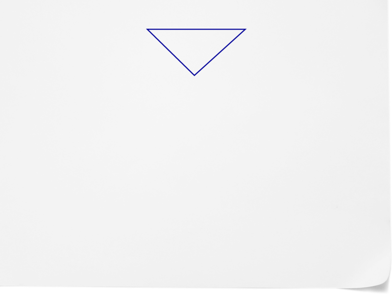

**Now we have shown the width and height of the prism. Let’s draw the top face next. The top face is exactly the same size and shape as the base, only it is connected to a top edge of the rectangular side. Imagine you could slide the base triangle up and put it on top of the rectangle.**

**We now have shown the front and top views of the prism. All we need to do is connect any other vertices in the top face with the corresponding vertices in the base. In this case, we only need to draw one more edge connecting the top and bottom triangles**

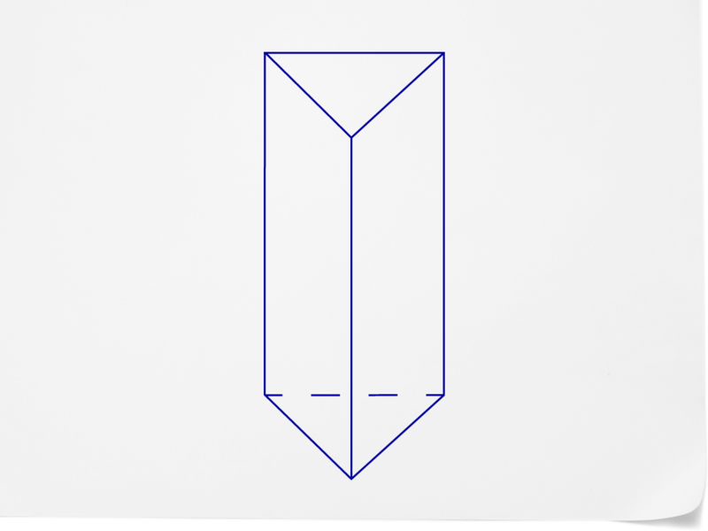

Example

_Sketch a cylinder._

**Again, let’s think about the bases first. Cylinders have two circular bases. Therefore we’ll need to draw a circular base and a circular top face. Let’s draw the base first.**

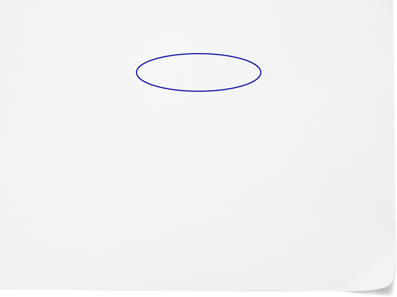

**Now we can add the top face. Remember, in a cylinder, the top and bottom face are exactly the same. Imagine you could slide the base up to the top of the rectangle and draw it again. This gives us the top face. There aren’t any vertices to connect between the top and bottom faces since they are round, so we’re done. We have drawn a cylinder that looks like this.**

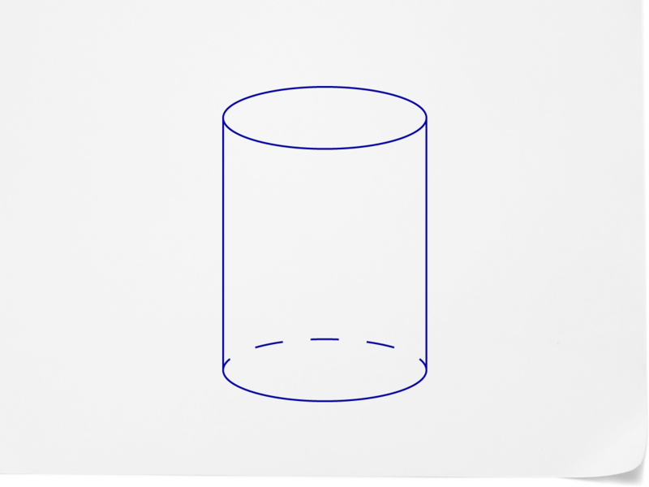

**Here are the steps:**

**Begin with the base, then draw the front (which is a side face), then the top, and, finally, connect the remaining vertices between the top and the bottom. Curved figures such as cylinders and cones can be especially tricky. From the side, a cylinder looks like it has a rectangular side face, and a cone looks like it has a triangular side face. Hold up some cylindrical and conical objects to see for yourself.**

IV. **Identify Patterns and Describe Relationships among the Number of Edges, Vertices, and Faces of Solid Figures**

Now that we can classify and draw solid figures, let’s analyze them in another way. **By examining solid figures, we can find patterns and relationships among them. The patterns and relationships, in turn, help us to understand the similarities and differences among solid figures.**

**We can see one pattern in spheres, cones, and cylinders.** To understand the pattern, we need to think about the number of faces, edges, and vertices each figure has. All of these figures are curved in some way, so they have no edges or vertices. What about their faces? A sphere has no faces, a cone has one circular face, and a cylinder has two circular faces. Therefore the number of faces increases by 1 from one figure to the next. This is a pattern.

**Another important relationship to recognize in solid figures is parallelism. We can identify prisms, for example, by their pair of parallel faces.** In fact, we can say that opposite sides are always parallel.

Let’s look at a few examples where we can see these patterns.

Example

_Identify the parallel faces in each solid figure._

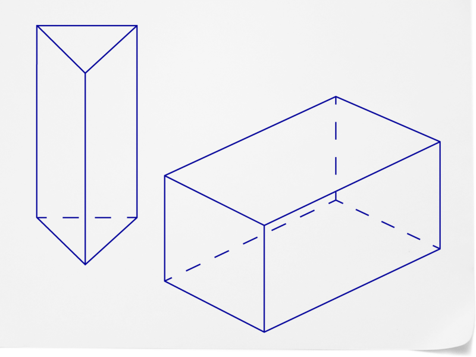

**The next figure, however, has more than one pair of parallel sides. In fact, it has three pairs. Can you find them all? Its base and top are parallel rectangles. The front and back faces are also parallel because they are opposite each other. The smaller side faces are opposite each other, so these, too, are parallel. We can see these pairs of opposites if we look at the rectangular base alone. A rectangle has two pairs of parallel sides. A rectangular prism has faces along those sides, so the faces must be parallel. Then we have one more pair for the third dimension of height (the base and top).**

**We can conclude that prisms whose base has an even number of sides have more than one pair of opposite parallel sides. Prisms whose base has an odd number of sides will only have a parallel relationship between the top and bottom, not any of the sides.**

**We can also understand one more relationship in prisms from this example. As the number of sides in the base and top faces increases, the number of side faces increases the same amount. A triangular prism therefore has 3 sides plus the base and top, or 5 in all.**

Example

_A prism has a base with $n$ number of sides. How many faces does the prism have?_

**A base with $n$ number of sides? This means that we can put in any number for $n$. This is where patterns can be used in problem solving.**

**If we put in 3 and make this a triangular prism, how many faces will the prism have? As we said, it will have 3 side faces, a top, and a base, or 5 faces. What if we put 6 in for $n$ and make it a hexagonal prism? The figure will have 6 side faces plus the base and top, or 8 faces in all. If we put 9 in for $n$, the figure would have 9 side faces, a top, and a base, or 11 faces in all. Do you see the pattern?**

**In a prism, we always have a number of side faces determined by the number of sides in the polygon that is the base. Then we add two, because there is always a base and top. In other words, to find the total number of faces we add 2 to the number of the base’s sides. If the base has n number of sides, then the prism will have $n + 2$ number of faces.**

Real-Life Example Completed
---------------------------

**_The Awards_**

**Here is the original problem once again. Reread it and then figure out the faces, edges and vertices of a pentagonal prism. Then draw a picture of one.**

“Rather than medals, I think it would be really cool if we used a pyramid as an award,” Jose said at lunch on Monday.

“I don’t. A medal is what is traditional and I think we should stick with medals,” Travis disagreed.

“Well, medals are so flat. I like the idea of being different. Besides, this is our first Olympics we could make our award interesting and unique,” Marcy added in.

“What about a prism instead? Something cool like pentagonal prism. I’ll draw my idea out and then we can take a look at it,” Jose said taking out a piece of paper and pencil.

“What is that?” Marcy asked leaning over his shoulder.

“A pentagonal prism,” Jose said.

“Nope, you have the faces and edges all wrong.”

**_Solution to Real – Life Example_**

**To figure out the faces, edges and vertices of a pentagonal prism, we can look at patterns. First, we know that $n + 2$ gives us the pattern for the number of faces in a prism. In this pattern, $n$ represents the number of sides in the base. The pentagon has five sides, so we know that $n$ is 5.**

$$
\begin{align*}
Faces &= n + 2\\
Faces &= 7 \ faces
\end{align*}
$$

**Now we can draw a picture of a pentagonal prism.**

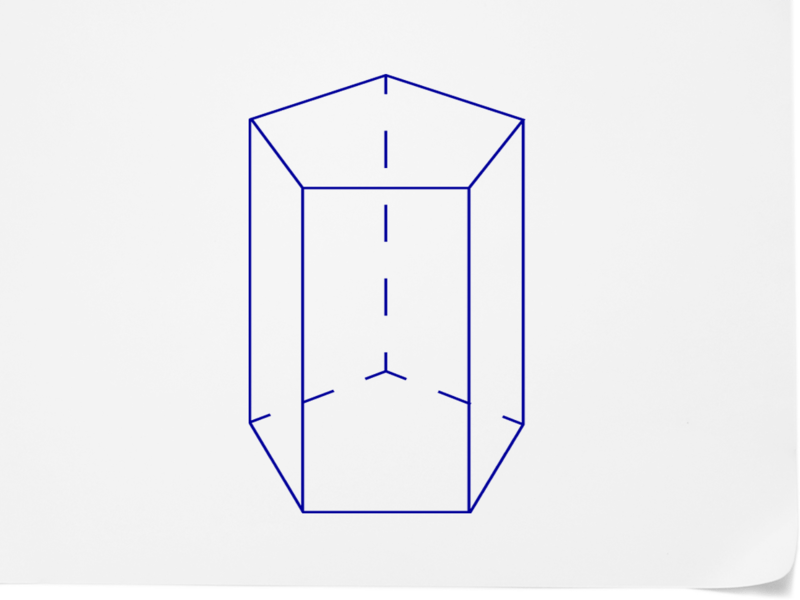

**There are 10 vertices in the pentagonal prism.**

Vocabulary
----------

Here are the vocabulary words that are found in this lesson.

__Solid Figures__

three-dimensional figures with length, width and height.

__Prisms__

three-dimensional figures with polygons as bases and rectangles for side faces.

__Pyramid__

three-dimensional figures with a polygon as a base and side triangular faces that meet in a single vertex.

__Face__

the flat surfaces of a three-dimensional figure.

__Edge__

the place where two line segments meet in a three-dimensional figure.

__Vertex__

the point where edges meet in a three-dimensional figure.

Time to Practice
----------------

Directions: Answer the following questions about each solid figure.

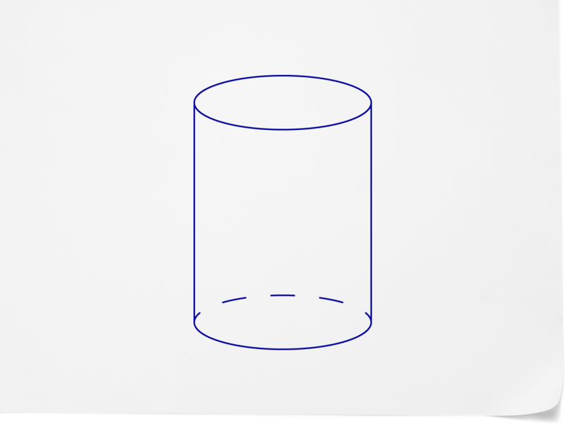
2.  How many faces does it have?
3.  How many vertices does it have?
4.  How many edges does it have?

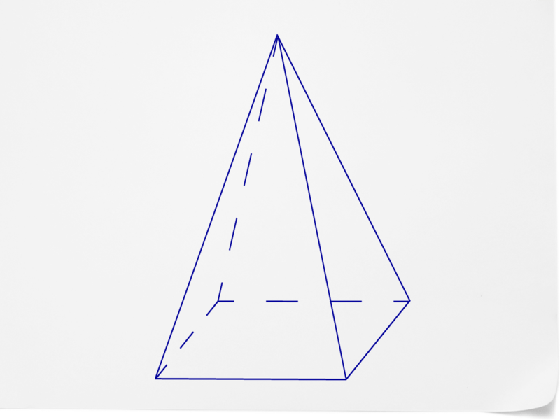
6.  How many faces does it have?
7.  How many edges does it have?
8.  How many vertices does it have?

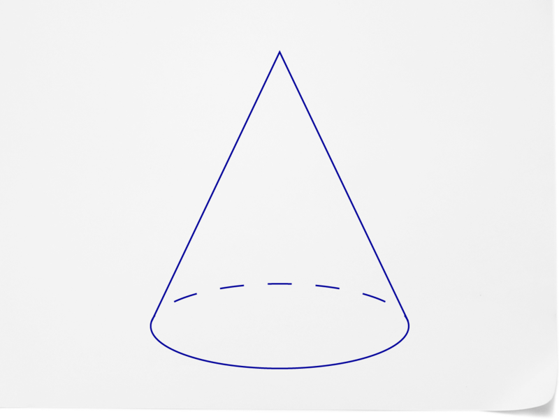
10. How many faces, edges and vertices does it have?

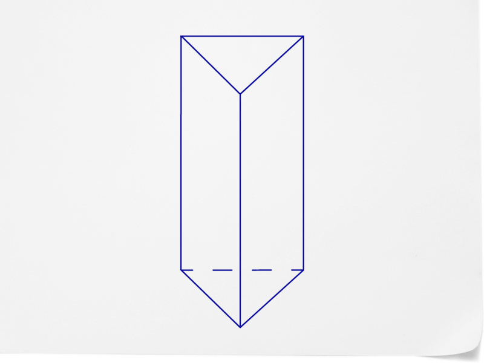
12. How many faces does it have?
13. How many edges does it have?
14. How many vertices does it have?
15. A figure has one circular face, no edges, and no vertices. What kind of figure is it?
16. A figure has one pair of parallel sides that are circular. What kind of figure is it?
17. Sketch a cone.
18. Sketch a pentagonal prism.
19. How many pairs of parallel faces does an octagonal prism have?
20. How many pairs of parallel faces does a pentagonal prism have?
21. Dodecagons are polygons that have twelve sides. How many faces does a dodecagonal prism have?

</article>

### 8.4 Surface Area of Prisms and Cylinders

<article>

Introduction
------------

**_A Special Gift_**

Mr. Samuels the custodian has been working overtime getting ready for the Olympics at Montgomery Middle School. To help the students, he has been creating long jump fields, bringing in tons of sand and offering to help out afterschool and on weekends.

“I think that we should do something nice for Mr. Samuels,” Crystal said at lunch.

“I agree. But what?” Kenneth responded.

“How about giving him one of our prism awards? I could wrap it up and we could present it to him at the Olympics,” Crystal suggested.

Kenneth, Marcy and Dylan all agreed. So that week, Crystal found a box for the prism award and began to wrap it. Because of the size of the award, she needed a good sized box.

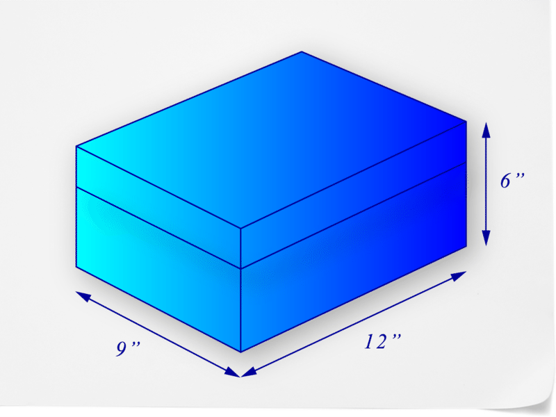

**Surface area is the topic for this lesson, and Crystal’s wrapping paper is all about surface area. By the end of this lesson, you will know how much wrapping paper she will need to cover this box.**

**_What You Will Learn_**

In this lesson you will learn how to complete the following skills.

* Recognize surface area of prisms and cylinders as the sum of areas of faces using nets.
* Find surface areas and linear dimensions of right prisms with any polygonal base.
* Find surface areas and linear dimensions of cylinders and truncated cylinders.
* Solve real – world problems involving surface area of prisms and cylinders.

**_Teaching Time_**

I. **Recognize Surface Area of Prisms and Cylinders as the Sum of Areas of Faces using Nets**

In the last lesson we learned about **_three-dimensional figures_**. **Remember that a three–dimensional or solid figure has length, width and depth.** It is not simply a flat two–dimensional plane figure. We learned about all of the different types of three–dimensional figures. In this lesson, you will learn how to calculate some very specific measurements when working with **_prisms_** and **_cylinders_**.

**What is a prism?**

A prism is a three–dimensional figure with two parallel congruent polygons as bases. The side faces of a prism are rectangular in shape.

**What is a cylinder?**

A cylinder has two parallel congruent circular bases with a curved rectangle as its side.

**One of the things that we can measure when working with three–dimensional figures is called** **_surface area_****. Surface area is the total of the areas of each face of a solid figure. Imagine you could wrap one of the figures above in wrapping paper, like a present.** The amount of wrapping paper needed to cover the figure represents its surface area. To find the surface area, we must be able to calculate the area of each face and then add these areas together.

There are several different ways to calculate surface area. One way is to use a **_net_**.

**A net is a two-dimensional diagram of a three-dimensional figure.** Imagine you could unfold a box so that it is completely flat. You would have something that looks like this.

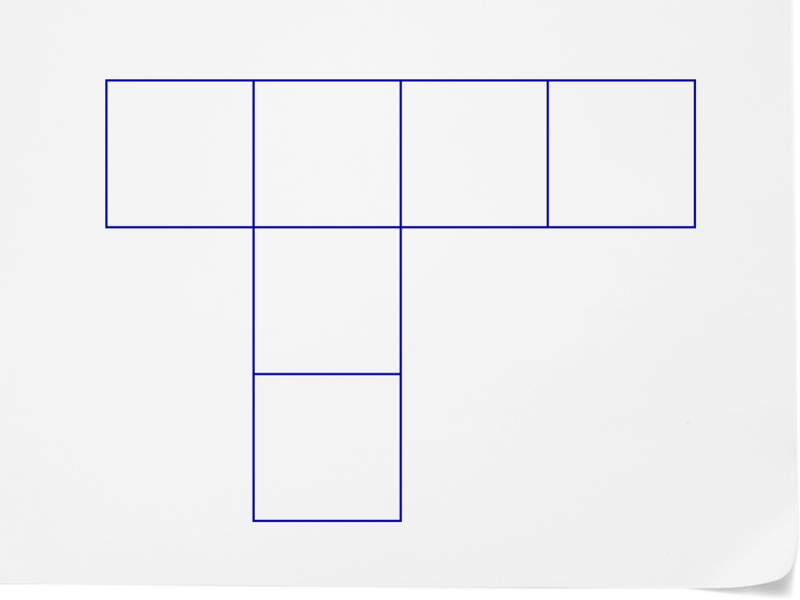

We could also look at a net of a rectangular prism.

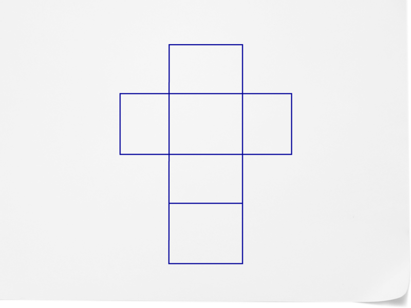

We can look at the net of a cylinder too.

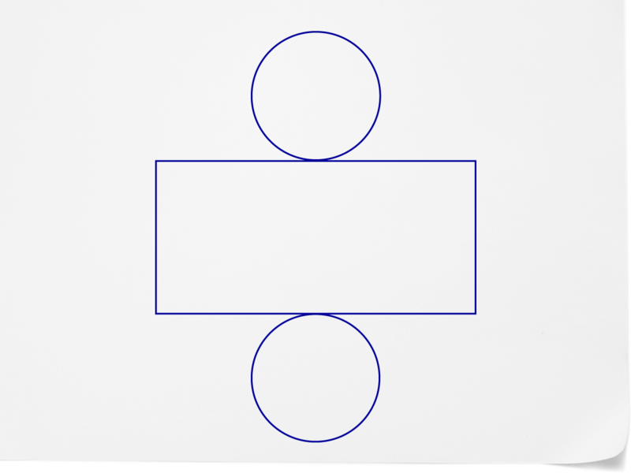

To find the area of a rectangle, we use the formula $A = lw$. If we know the length and width of each rectangle, we can calculate its area. Let’s put in the measurements for all the rectangles. Remember, each face represents two dimensions of the box: length and width, length and height, or width and height.

**Let’s begin by calculating the area of a rectangular prism.**

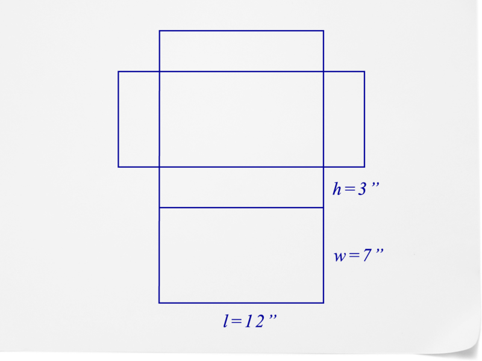

$$
\begin{align*}
& \mathbf{bottom \ face} && \mathbf{top \ face} && \mathbf{long \ side} && \mathbf{long \ side} && \mathbf{short \ side} && \mathbf{short \ side}\\
& A=lw && A=lw && A=lh && A=lh && A=wh && A=wh\\
& 12 \times 7 \quad + && 12 \times 7 \quad + && 12 \times 3 \quad + && 12 \times 3 \quad + && 7 \times 3 \quad  + && 7 \times  3\\
& 84 \qquad \ \ + && 84 \qquad \ \ + && 36 \qquad \ \  + && 36 \qquad \ \  + && 21 \qquad \ + && 21 \qquad \ \ = \ 282 \ in.^2
\end{align*}
$$

**We found the area of each rectangular face and then added all of these areas together. The total surface area of the rectangular prism is 282 square inches. Using a net helped us to locate all of the faces and find the measurements of each side.**

**We follow a similar process to find the surface area of a cylinder from a net.**

To find the surface area, we need to calculate the area for each circle in the net. We use the formula $A =\pi r^2$ to find the area of a circle. If we know the radius or diameter of each circle, we can calculate its area. Look closely again at the cylinder above. The two circular faces are congruent, so they must have the same radius and diameter. Let’s calculate the area for each face.

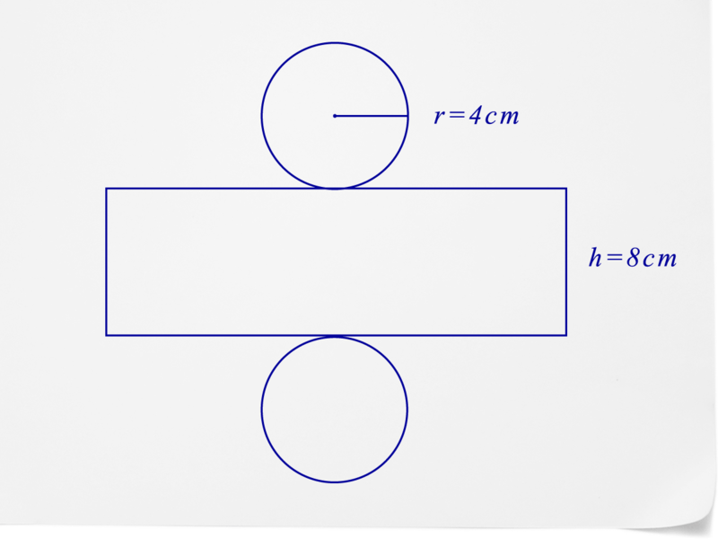
\begin{align*}
& \mathbf{bottom \ face} && \mathbf{top \ face}\\
& A=\pi {r^2} && A=\pi {r^2}\\
& A=\pi {(4^2)} && A=\pi {(4^2)}\\
& A=16 \pi && A=16 \pi \\
& A=50.24 \ cm^2 && A=50.24 \ cm^2
\end{align*}
$$

**The area of each circular face is 50.24 square centimeters when we use 3.14 to approximate pi.**

Now we need to find the area of the side. The net shows us that, when we “unroll” the cylinder, the side is actually a rectangle. Recall that the formula we use to find the area of a rectangle is $A = lw$. For cylinders, the width of the rectangle is the same as the height of the cylinder. In this case, the height of the cylinder is 8 centimeters.

What about the length? The length is actually the same as the perimeter of the circle, which we call its circumference. When we “roll” up the side, it fits exactly once around the circle. To find the area of the cylinder’s side, then, we multiply the circumference of the circle by the height of the cylinder. We find the circumference of a circle with the formula $C = 2 \pi r$, and then we multiply it by the height. Let’s try it.

$$
\begin{align*}
C &=2 \pi r\\
C &=2 \pi 4\\
C &=8 \pi\\
C &=25.12 \times 8 = 200.96 \ cm^2
\end{align*}
$$

**Now we know the area of both circular faces and the side. Let’s add them together to find the surface area of the cylinder.**

$$
\begin{align*}
& \mathbf{bottom \ face} && \mathbf{top \ face} && \mathbf{side} && \mathbf{surface \ area}\\
& 50.24 \ cm^2	\qquad + && 50.24 \ cm^2 \quad \ + && 200.96 \ cm^2 \quad =&& 301.44 \ cm^2
\end{align*}
$$

**The total surface area of the cylinder is 301.44 square centimeters. Using a net helped us to locate the faces and the find the measurements of the side.**

We can use this same process to find the surface area of any prism or any net. Just be sure to find the area of each face and then add the areas together.

II. **Find Surface Area and Linear Dimensions of Right Prisms with any Polygonal Base**

Nets let us see each face so that we can calculate their area and then add them together. However, we can also use a formula to represent the faces as we find their area. The formula gives us a nice short cut that we can use for any kind of prism, no matter what shape its base is. Take a look at the formula below.

$SA=Ph+2B$

**Let’s look at the first part of the formula. $P$ represents the perimeter of the base, and $h$ represents the height of the prism. By multiplying the perimeter and height, we are finding the area of all of the side faces at once. This will be very useful if the prism that we are working with isn’t just a cube or a rectangular prism.**

**The second part of the formula represents the area of the top and bottom faces. $B$ represents the area of one base, which we find using whichever area formula is appropriate for the shape of the base. Then we multiply it by 2 to show the area of the top and bottom faces at once. Let’s give it a try to see how this works.**

Example

_Find the surface area of this figure using a formula._

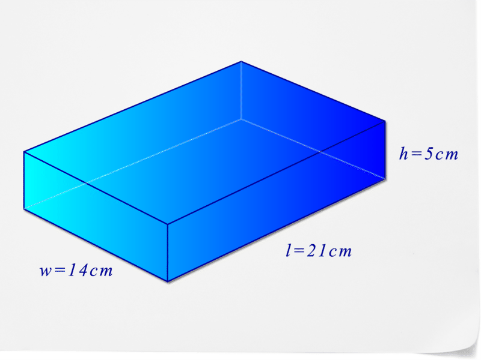

**Now let’s solve for $B$, the area of the base. The base of this prism is a rectangle, so we use the formula $A = lw$ to find its area.**

$$
\begin{align*}
B &=  lw\\
B &=21 \times 14\\
B &=294 \ cm^2
\end{align*}
$$

**Now we have all of the information we need to fill in the formula. Let’s put it in and solve for $SA$, surface area.**

$$
\begin{align*}
SA &=Ph + 2B\\
SA &=  70 (5)  +  2 (294)\\
SA &=  350  +  588\\
SA &=  938 \ cm^2
\end{align*}
$$

**This rectangular prism has a surface area of 938 square centimeters.**

We can use this method for all kinds of prisms. Let’s try another one.

Example

_What is the surface area of the figure below?_

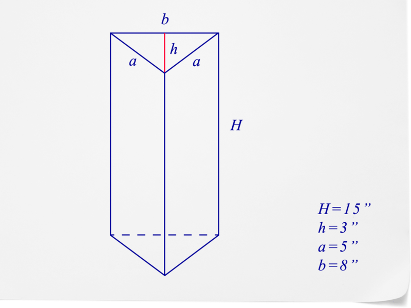

**To find $B$, we need to use the area formula for triangles: $A =\frac{1}{2} bh$. The base of the triangle is 8 inches, and the height is 3 inches.**

$$
\begin{align*}
A &=\frac{1}{2} bh\\
A  &= \frac{1}{2} (8) (3)\\
A  &= 4 (3)\\
A  &= 12 \ in.^2
\end{align*}
$$

**The area of the triangular base is 12 square inches, so we put this in for $B$ in the formula. Let’s put all of the values in and solve.**

$$
\begin{align*}
SA &=  Ph  +  2B\\
SA &=  18 (15)  +  2 (12)\\
SA &=  270  +  24\\
SA &=  294 \ in.^2
\end{align*}
$$

**The surface area of this triangular prism is 294 square inches.**

III. **Find Surface Areas and Linear Dimensions of Cylinders and Truncated Cylinders**

We use the same basic formula, $Ph + 2B$, to find the surface area of cylinders, too. As we know, the top and bottom faces of a cylinder are circles. The perimeter of a circle is its radius. We find circumference by using the formula $2 \pi r$. Then we multiply it by the height of the cylinder.

To find the area of the base, $B$, we use the area formula for circles: 

$$
\pi
{r^2}
$$

. We still multiply it by 2 because there is a circular top face and bottom face. This gives us the formula

$$
\begin{align*}
& SA =2 \pi {r^2} + 2 \pi rh\\
& \qquad \ \  (2B)  \quad \ (Ph)
\end{align*}
$$

**This formula may look long and intimidating, but all we need to do is put in the values for the radius of the circular faces and the height of the cylinder and solve.**

Let’s give it a try.

Example

_What is the surface area of the figure below? Use 3.14 to approximate pi._

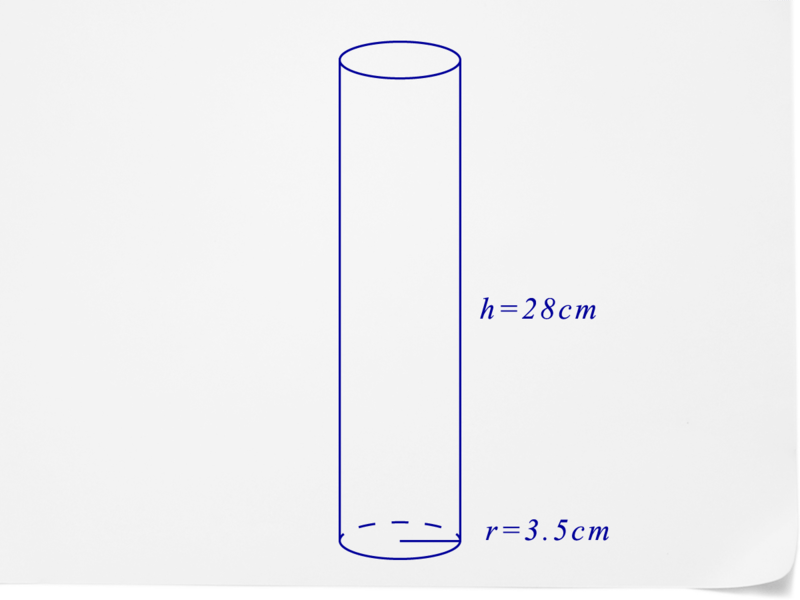

$$
\begin{align*}
SA &=2 \pi {r^2} +  2 \pi rh\\
SA  &=  2 \pi (3.5^2)  +  2 \pi (3.5) (28)\\
SA  &=  2 \pi (12.25)  +  2 \pi (98)\\
SA  &=  24.5 \pi  +  196 \pi \\
SA  &=  220.5 \pi \\
SA  &=  692.37 \ {cm^2}
\end{align*}
$$

**This cylinder has a surface area of 692.37 square centimeters.**

That wasn’t so bad! We just have to be careful to put each measurement in the right place in the formula and take it one step at a time. Let’s try another one.

Example

_What is the surface area of the figure below?_

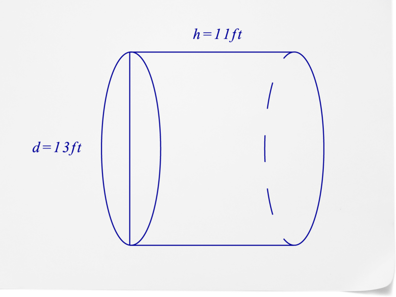

$$
\begin{align*}
SA &=  2 \pi r^2  +  2 \pi rh\\
SA  &=  2 \pi (6.5^2) +  2 \pi (6.5) (11)\\
SA  &=  2 \pi (42.25) +  2 \pi (71.5)\\
SA  &=  84.6 \pi + 143 \pi\\ 
SA  &=  227.6 \pi\\ 	
SA  &=  714.66 \ {ft^2}
\end{align*}
$$

**This cylinder has a surface area of 714.66 square feet when we approximate pi as 3.14.**

**Sometimes, we can have a cylinder that has been cut. We call it a** **_truncated cylinder_****. This is where you only see a section of the cylinder and will need to figure out the surface area of what you see.**

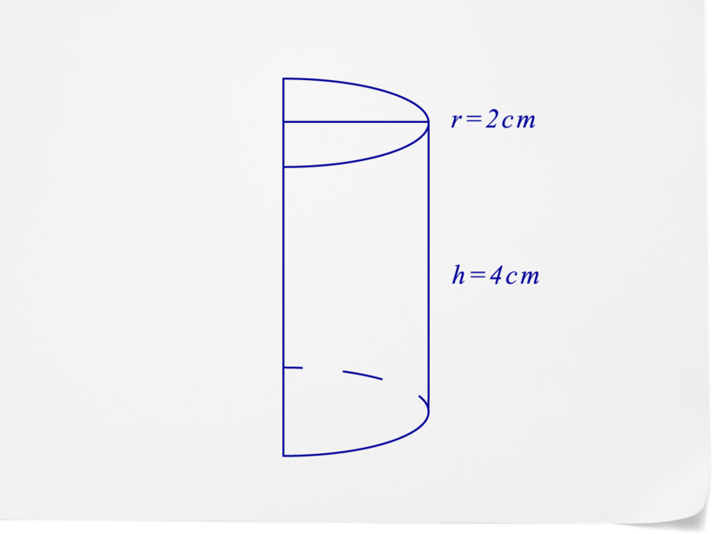

$$
\begin{align*}
SA  &=2 \pi {r^2}  +  2 \pi rh\\
SA &=  2 \pi (2^2)  +  2 \pi (2) (4)\\
SA &=  2 \pi (4)  +  2 \pi (8)\\
SA &=8 \pi + 16 \pi\\ 
SA &=75.36 \ {cm^2}
\end{align*}
$$

**We could also find the surface area of the whole cylinder by changing the height from 4 cm to 8 cm. Then we could use the same measurement for radius and calculate the surface area of the cylinder.**

Now let’s look at applying what we have learned to some real – life examples.

IV. **Solve Real – World Problems Involving Surface Area of Prisms and Cylinders**

**We have learned two ways to find surface area: drawing a net or using a formula. We can use either of these methods to solve word problems involving surface area.** Nets may be especially useful if the problem does not provide an image of the figure. If you choose to use a formula, be sure you know whether the problem deals with a cylinder or a prism and what kind of prism it is. Let’s practice using what we have learned.

Example

_Kevin is replacing the canvas on his tent. The tent has a front and back flap and two long sides. If the tent is 6 feet tall, 16 feet across the front, and 24 feet long, how many square feet of canvas will Kevin need?_

Now read the problem carefully. What is it asking us to find? **We need to find the surface area of only the canvas parts of the tent. The floor is not made of canvas, so we should not include this side in our calculations. This problem is a bit complicated, so it may help to draw a net. In your drawing, label the floor, the sides, and the front and back flap.**

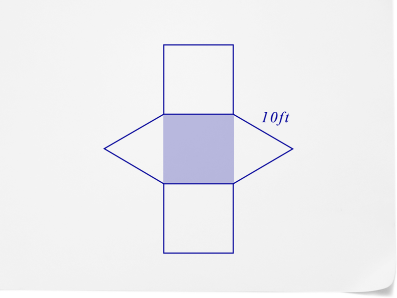

**Now let’s fill in all of the measurements. Now we’re ready to find the area of each face.**

$$
\begin{align*}
& \mathbf{front \ flap} && \mathbf{back \ flap} && \mathbf{side} && \mathbf{side}\\ 
& A =\frac{1}{2}bh && A =\frac{1}{2}bh && A = lw && A = lw\\
& \frac{1}{2}(8)(6) && \frac{1}{2}(8)(6) && 24(10) && 24(10)\\
& 24  \qquad \qquad + && 24 \qquad \qquad + && 240 \qquad \quad + && 240 \qquad = \ 528 \ ft^2
\end{align*}
$$

**Kevin will need 528 square feet of canvas to cover all of the sides of the tent, not including the floor.**

**We can also solve real – world problems involving cylinders. Take a look at this next problem.**

Example

_Mrs. Johnson is wrapping a cylindrical package in brown paper so that she can mail it to her son. The package is 22 centimeters tall and 11 centimeters across. How much paper will she need to cover the package?_

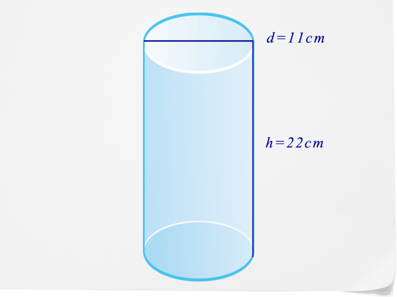

$$
\begin{align*}
SA &=  2 \pi r^2 + 2 \pi rh\\
SA &=  2 \pi (5.5^2)  +2 \pi (5.5)(22)\\
SA &=  2 \pi (30.25)  +  2 \pi (121)\\
SA &=  60.5 \pi + 242 \pi \\
SA &=  302.5 \pi\\
SA &=  949.85 \ cm^2
\end{align*}
$$

**Mrs. Johnson will need 949.85 square centimeters of brown paper in order to wrap the entire package.**

Now let’s use what we have learned on the problem from the introduction.

Real-Life Example Completed
---------------------------

**_A Special Gift_**

**Here is the original problem once again. Reread it and look for the given information. Then solve the problem.**

Mr. Samuels the custodian has been working overtime getting ready for the Olympics at Montgomery Middle School. To help the students, he has been creating long jump fields, bringing in tons of sand and offering to help out afterschool and on weekends.

“I think that we should do something nice for Mr. Samuels,” Crystal said at lunch.

“I agree. But what?” Kenneth responded.

“How about giving him one of our prism awards? I could wrap it up and we could present it to him at the Olympics,” Crystal suggested.

Kenneth, Marcy and Dylan all agreed. So that week, Crystal found a box for the prism award and began to wrap it. Because of the size of the award, she needed a good sized box.

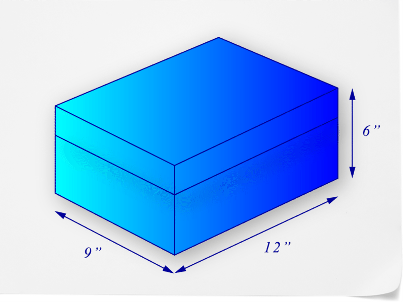

**_Solution to Real – Life Example_**

**First of all, what kind of solid figure is this? All of the faces are rectangles, including the base, so it is a rectangular prism. The picture clearly shows us what its length, width, and height are, so let’s use the formula for finding the surface area of prisms.**

**What is the perimeter of the base?**

$12 + 12 + 9 + 9 = 42 \ inches$.

**We’ll put this in for $P$.**

**We also need to find the area of the base, $B$. This base is a rectangle, so we use the formula $B = lw$.**

$$
\begin{align*}
B &=lw \\
B &=12 (9)\\
B &=108 \ in.^2
\end{align*}
$$

**Now we have all of the measurements to put in for the appropriate variables in the formula.**

$$
\begin{align*}
SA &=Ph + 2B\\
SA &=42(6)+2(108)\\
SA &=252 + 216\\
SA &=468 \ in.^2
\end{align*}
$$

**Crystal will need 468 square inches of wrapping paper in order to cover the present.**

Vocabulary
----------

Here are the vocabulary words that are found in this lesson.

__Three Dimensional Figures__

solid figures that have length, width and height.

__Prisms__

three – dimensional figures with parallel, congruent polygons as bases and rectangular side faces.

__Cylinders__

three – dimensional figures with circular parallel congruent bases and a curved rectangle as the side.

__Surface Area__

the measurement of the outer covering on a solid figure.

__Net__

the pattern of a solid figure-what a solid figure would look like if it were drawn out as a pattern.

__Truncated Cylinder__

a cylinder that is cut in part from a complete cylinder.

Time to Practice
----------------

Directions: Look at each figure and then answer the following questions about each.

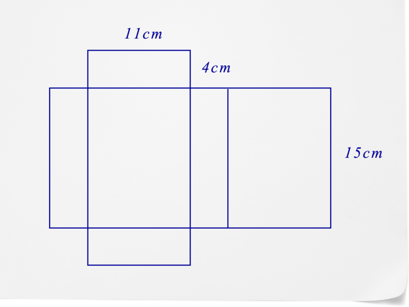
2.  What is the surface area of this figure?

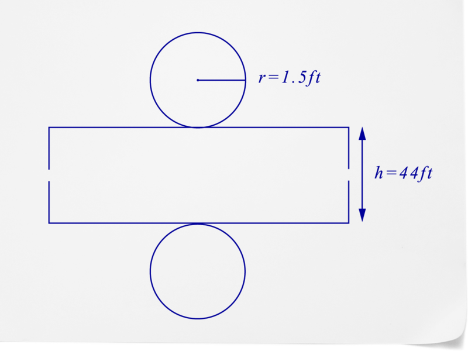
4.  What is the shape of the base of this figure?
5.  How many bases are there?
6.  What is the surface area of this figure?

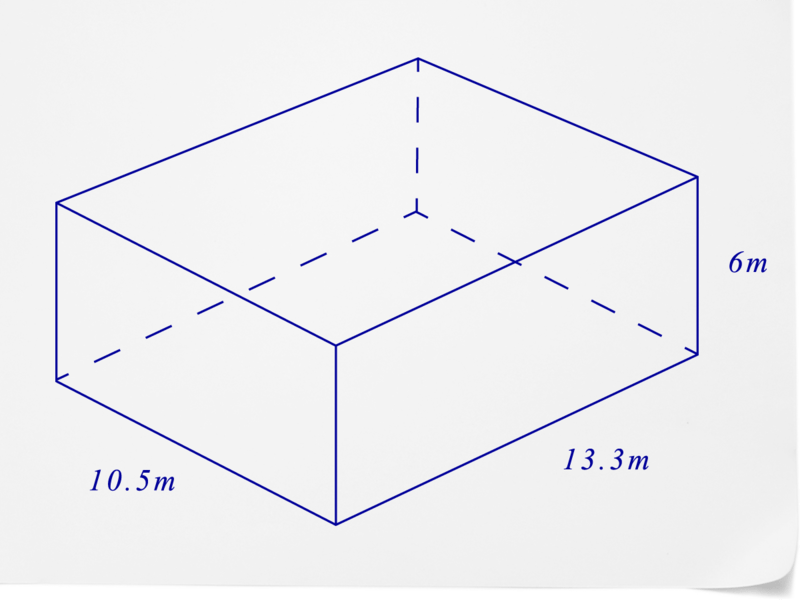
8.  What is the surface area of this figure?

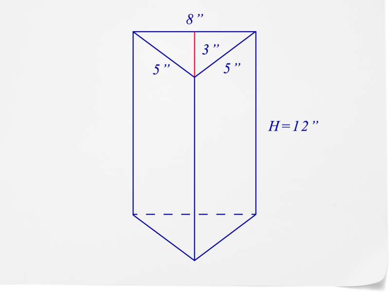
10. What is the shape of the base
11. How many bases does this figure have?
12. What is the shape of the side faces?
13. How many side faces are there?
14. What is the surface area of this figure?

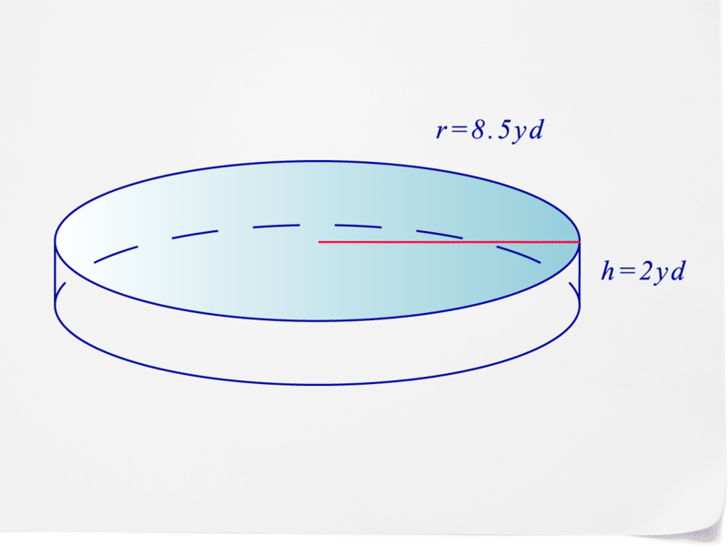
16. Which measurement is given the radius or the diameter?
17. What is the surface area of the figure?

Directions: Use what you have learned to solve the following problems.

18. A cylindrical water tank is 35 long and 10 feet across. How much sheet metal is the tank made of?
19. Did you use area or surface area to solve this problem?
20. For a class project, Duane needs to cover three shoeboxes in aluminum foil. Each box has a height of 7 inches, a length of 13 inches, and a width of 8 inches. How much aluminum foil will Duane need to cover all three boxes?
21. Juan built a dog house entirely out of wood, even the floor. If he left a square opening measuring 2.5 on all sides for the door, how many square feet of wood did Juan use?

</article>

### 8.5 Surface Area of Pyramids and Cones

<article>

Introduction
------------

**_The Award Platform_**

The students ordered an award platform from a company for Olympics. This platform would go on top of the cement area that the students already made and would be the place for the first place finisher in each event to stand and receive his/her award.

“It isn’t a trapezoid like the area we created,” Jose commented when the platform arrived at school.

“I know. They didn’t have a trapezoid. We got this instead,” Carmen explained.

“I think it will still work, and we can paint it,” Jose said.

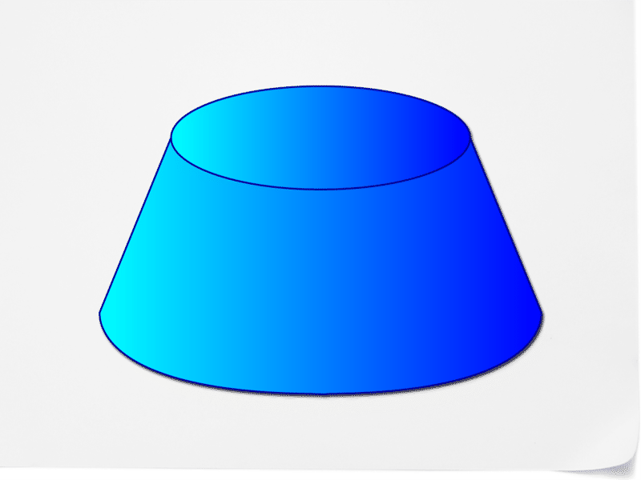

“I’m not sure,” Jose said scratching his head.

**This figure is a different kind of cone called a truncated cone. You can figure out the surface area of a figure like this one, but you will need a special formula. As you work through this lesson look for the formula. You will have a chance to use it at the end of the lesson.**

**_What You Will Learn_**

By the end of this lesson you will be able to complete the following skills.

* Recognize surface area of pyramids and cones as the sum of the areas of faces using nets.
* Find surface areas and linear dimensions of pyramids with any polygonal base.
* Find surface areas and linear dimensions of cones and truncated cones.
* Solve real - world problems involving surface area of pyramids and cones.

**_Teaching Time_**

I. **Recognize Surface Area of Pyramids and Cones as the Sum of the Areas of Faces using Nets**

In this lesson we will learn to find the surface area of pyramids and cones. **_Pyramids_** and **_cones_** are solid shapes that exist in three-dimensional space. **A pyramid has sides that are triangular faces and a base. The base can be any shape. Like pyramids, cones have a base and a point at the top. However, cones always have a circular base.**

Here is an example of a cone and a pyramid.

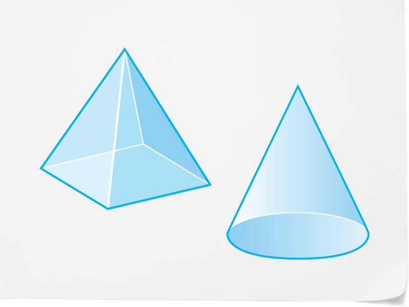

In the last lesson you learned how to calculate surface area of prisms and cylinders. Now we can figure out the surface area of cones and pyramids.

Let’s review surface area.

**_Surface area_** **is the total of the areas of each face in a solid figure.** Imagine you could wrap a pyramid or cone in wrapping paper, like a present. The amount of wrapping paper needed to cover the figure represents its surface area. To find the surface area, we must be able to calculate the area of each face and then add these areas together.

We will look at different ways to calculate surface area. One way is to use a **_net_****. A net is a two-dimensional diagram of a three-dimensional figure.** Imagine you could unfold a pyramid so that it is completely flat. Here is what the net of a pyramid would look like.

**The area of the base depends on what shape it is. Remember, pyramids can have bases in the shape of a triangle, square, rectangle, or any other polygon. We use whichever area formula is appropriate for the shape.** Here are some common area formulas:

Rectangle: $A  =  lw$

Square: $A  =  s^2$

Triangle: $A  =  \frac{1}{2} bh$

In the pyramid of the net above, we can see that it is a square pyramid. Imagine that it has a slant height of 4 cm and a side length of 6 cm. We can use these measurements to find the area of each face of the pyramid.

**The base has a side length of 6 cm, so we use the formula for finding the area of a base.**

$$
\begin{align*}
A&= s^2. 
A&=6^2\\
A&=36 \ sq.cm
\end{align*}
$$

**The area of the base of the pyramid is 36 sq. cm.**

**Next, we need to find the area of each triangular side. To find the area of one side, we use the formula for finding the area of a triangle.**

$$
\begin{align*}
A&=\frac{1}{2} bh\\
A&=\frac{1}{2}(6)(4)\\ 
A&=12 \ sq.cm
\end{align*}
$$

**This is the area of one triangle. We have four total, so we can multiply this value by 4.**

$12 \times 4 = 48 \ sq. cm$

**Next, we add up all of the areas.**

$48 + 36 = 84 \ sq. cm$

**The surface area of this square pyramid is 84 sq. cm.**

**We can also find the surface area of a cone.** Cones have different nets. Imagine you could unroll a cone. Here is what the net of a cone would look like.

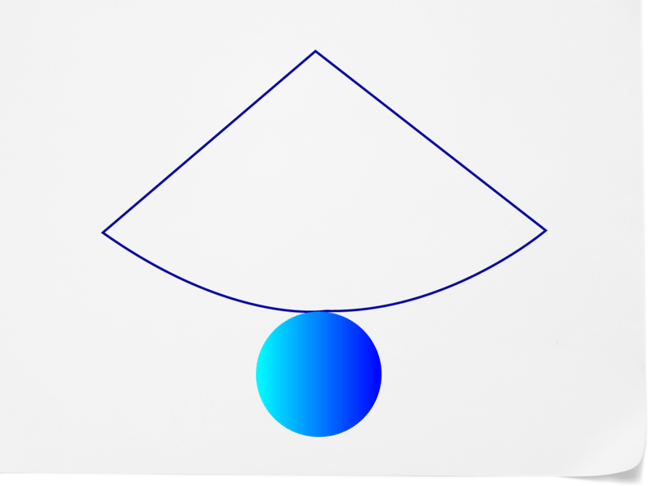

**To find the surface area of a cone, we need to calculate the area of the circular base and the side and add them together. The formula for finding the area of a circle is $A = \pi r^2$, where $r$ is the radius of the circle. We use this formula to find the area of the circular base.**

**The side of the cone is actually a piece of a circle, called a sector. The size of the sector is determined by the ratio of the cone’s slant height to its radius, or $\frac{s}{r}$.**

**To find the area of the cone’s side, we multiply the radius, the slant height, and pi.**

$A=rs \pi$

Let’s see how this would work with an example.

Example

_Find the surface area of the following cone._

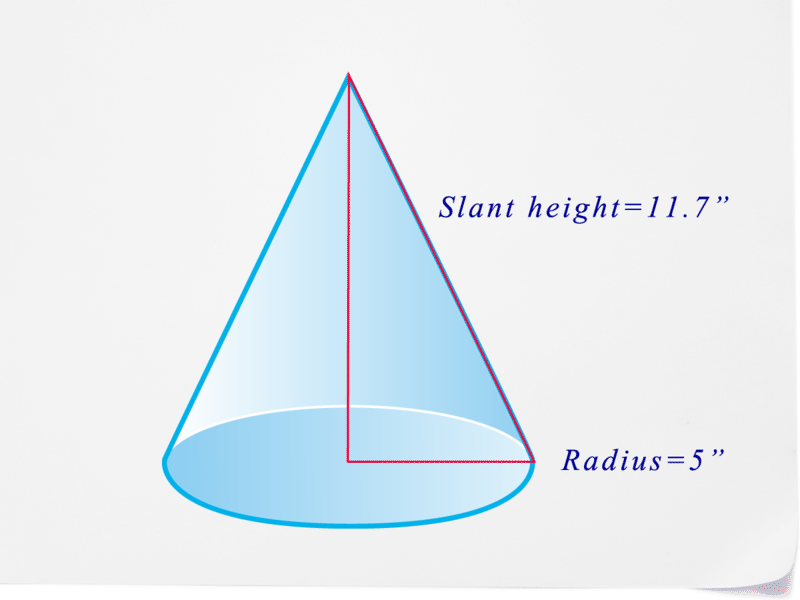

$$
\begin{align*}
& \mathbf{Bottom \ face \ (circle)} &&  \mathbf{Side}\\
& A = \pi r^2 && A =  \pi rs\\
& \pi (5^2) && \pi (5) (11.7)\\
& 25 \pi && \pi (58.5)\\
& 78.5 && 58.5 \pi
\end{align*}
$$

**We know the area of each side of the cone when we approximate pi as 3.14. Now we can add these together to find the surface area of the entire cone.**

$$
\begin{align*}
&\text{bottom face} \qquad \qquad \text{side} \qquad \qquad \text{surface area}\\
& \quad 78.5 \qquad \quad \ + \quad \ 183.69 \quad = \quad \ 262.19 \ in^2.
\end{align*}
$$

We used the formula $A =  \pi r^2$ to find the area of the circular base. Then we found the area of the side by multiplying $\pi rs$.

**When we add these together, we get a surface area of 262.19 square inches for this cone.**

There is another way to calculate surface area besides using a net. Let’s take a look at using a formula to find the surface area of a cone or pyramid.

II. **Find Surface Areas and Linear Dimensions of Pyramids with any Polygonal Base**

Nets let us see each face of a pyramid so that we can calculate its area. **However, we can also use a formula to represent the faces as we find their area.** The formula is like a short cut, because we can put the measurements in for the appropriate variable in the formula and solve for $SA$, surface area. Let’s start with pyramids.

Here is the formula for finding the surface area of a pyramid.

$$
SA  =  \frac{1}{2} \ \text{perimeter} \times  \text{slant height}  +  B
$$

**Now let’s look at how we can understand this formula.**

The first part of the formula, $\frac{1}{2} \ \text{perimeter}  \times  \text{slant height}$, is a quick way of finding the area of all of the triangular sides of the pyramid at once. Remember, the area formula for a triangle is $A = \frac{1}{2} bh$. In the formula, $b$ stands for base. The perimeter of the pyramid’s bottom face represents all of the bases of the triangular faces at once, because it’s their sum. The height of each triangle is always the same, so we can just call this the slant height of the pyramid. Therefore “$\frac{1}{2} \ \text{perimeter} \times  \text{slant height}$” is really the same as $\frac{1}{2} bh$.

**The $B$ in the formula represents the base’s area. Remember, pyramids can have bases of different shapes, so the area formula we use to find $B$ varies. We will find the base’s area first and then put it into the formula in place of $B$.**

Let’s look at an example.

Example

_What is the surface area of the pyramid below?_

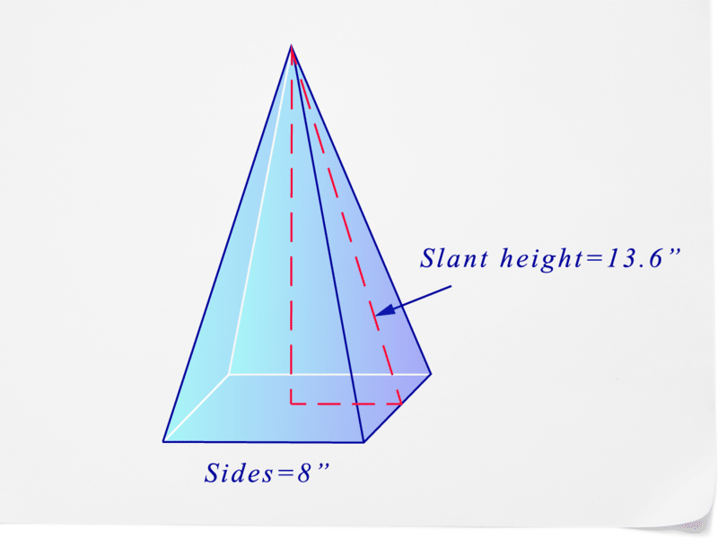

$$
\begin{align*}
B&=s^2\\
B  &=  s^2\\
B  &=  8^2\\
B  &=  64 \ in^2.
\end{align*}
$$

Now that we have the area of the base, we have all the information that we need. We can put it into the formula and solve for $SA$, surface area.

$$
\begin{align*}
SA  &=  \frac{1}{2} \ \text{perimeter}  \times  \text{slant height}  +  B\\ 
SA  &=  \left[\frac{1}{2}(32) \times 13.6\right]  +  64\\
SA  &=  (16 \times 13.6)  +  64\\
SA  &=  217.6  +  64\\
SA  &=  281.6 \ in^2.
\end{align*}
$$

**The surface area of the pyramid is 281.6 square inches.**

Example

_Find the surface area of the figure below._

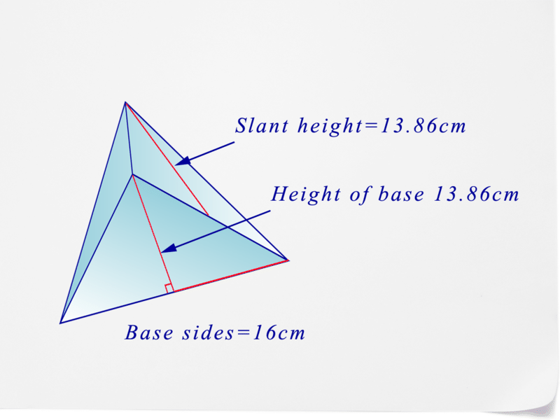

$$
\begin{align*}
B  &=  \frac{1}{2} bh\\
B  &=  \frac{1}{2} (16) (13.86)\\
B &=  8 (13.86)\\
B  &=  110.88 \ cm^2
\end{align*}
$$

**Now we’re ready to put all of the information into the formula. Let’s see what happens.**

$$
\begin{align*}
SA  &=  \frac{1}{2} \ \text{perimeter} \times  \text{slant height}  +  B\\
SA  &=  \left[\frac{1}{2} (48)  \times  13.86 \right]  +  110.88\\
SA  &=  (24  \times  13.86)  +  110.88\\
SA  &=  332.64  +  110.88\\
SA  &=  443.52 \ cm^2
\end{align*}
$$

**The surface area of this triangular pyramid is 443.52 square centimeters.**

**Sometimes, you will have to find a linear measurement. This means that you will be given the surface area and one other dimension. Then you will need to work backwards to figure out the measurement for the missing dimension. This may seem challenging, but if you think of it as a puzzle, then you will be right on track.**

Example

_The base of a square pyramid has sides of 4 cm each and a surface area of $96 \ cm^2$. What is the slant height of the pyramid?_

**This time we know the surface area, but we need to find the slant height.** Let’s find the perimeter and $B$ first so that we can put these into the formula. The base is a square with sides of 4 centimeters, so the perimeter must be $4 \times 4 = 16 \ cm$. Now we use the square area formula to find $B$.

$$
\begin{align*}
B &= s^2. 
B &= 4^2\\
B &= 16 \ cm^2
\end{align*}
$$

**$B$ is 16 square centimeters. Let’s put these values in for the appropriate variables in the formula and solve for $s$, the slant height.**

$$
\begin{align*}
SA  &=  \frac{1}{2} \ \text{perimeter} \times  \text{slant height}  +  B \\
96  &=  \frac{1}{6} (16)s +  16\\
96  &=  8s  +  16\\
96  -  16  &=  8s\\
80  &=  8s\\
80  \div  8  &=  s\\
10 \ cm  &=  s
\end{align*}
$$

**A square pyramid with a base of 4 centimeters on each side and a surface area of 96 square centimeters must have a slant height of 10 centimeters.**

$ before putting values into the formula for surface area._**")

III. **Find Surface Areas and Linear Dimensions of Cones and Truncated Cones**

Cones have a different formula because they have a circular base. But the general idea is the same. The formula is a short cut to help us combine the area of the circular base and the area of the cone’s side. Here’s what it looks like:

$SA  =   \pi r^2  +   \pi rs$

**The first part of the formula, $\pi r^2$, is simply the area formula for circles. This represents the base area. The second part, as we have seen, represents the area of the cone’s side. We simply put the pieces together and solve for the area of both parts at once.**

Now let’s try it out.

Example

_What is the surface area of the cone?_

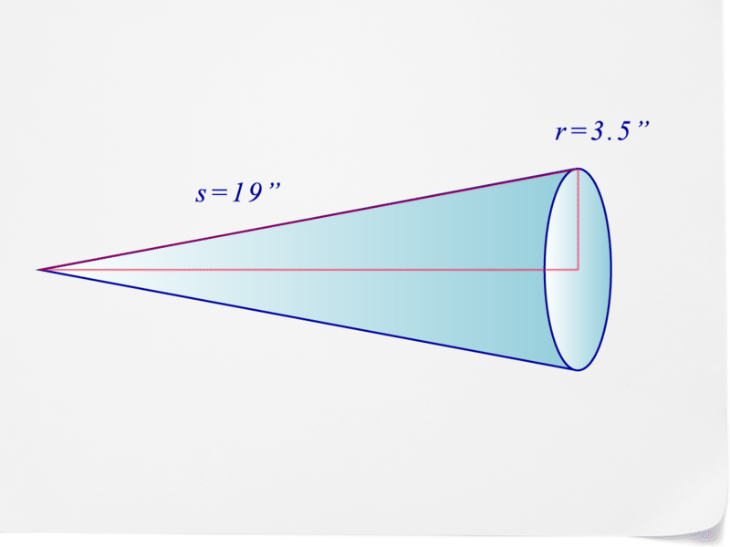

$$
\begin{align*}
SA  &=  \pi r^2  +  \pi rs\\
SA  &=  \pi (3.5^2)  +  \pi (3.5) (19)\\
SA  &=  12.25 \pi  +  66.5  \pi\\
SA  &=  78.75  \pi\\
SA  &=  247.28 \ in^2.
\end{align*}
$$

**This cone has a surface area of 247.28 square inches.**

**As with the surface area formula for pyramids, we can also use this formula to solve for either the radius or the slant height of a cone. As long as the problem gives us two of the three pieces of information we need, we can put them into the formula and solve for the unknown variable. Let’s try it.**

Example

_A cone with a radius of 15 m has a surface area of $292.5 \pi$. What is its slant height?_

**This time we have been given the radius and the surface area and we need to solve for the slant height, $s$.** All we have to do is put the values in for the appropriate variables and solve for $s$. Notice that the surface area is given as a function of pi, that’s what it means when the number has the pi symbol next to it. That’s no problem simply put the whole number into the formula for $SA$.

$$
\begin{align*}
SA  &=  \pi r^2  +  \pi rs\\
292.5 \pi  &=  \pi (15^2)  +  \pi (15)s\\
292.5 \pi  &=  225 \pi  +  15 \pi s
\end{align*}
$$

We cannot add these two terms because they are not like terms.

$$
292.5 \pi  -  225 \pi  =  15 \pi s
$$

Subtract $225 \pi$ from both sides.

$$
67.5 \pi  =  15 \pi s
$$

Divide both sides by $15 \pi$. $\pi$ cancels out on both sides.

$$
4.5 \ m  =  s
$$

**The slant height of the cone must be 4.5 meters.**

That may seem a little tricky, but if you think of it just like solving equations it will be much simpler. Now let’s look at how we can find the surface area of part of a cone.

First, let’s think about what a **_truncated cone_** would look like. **A truncated cone is one where the point of the cone is cut off leaving two circular bases and a side face.** Here is what one looks like.

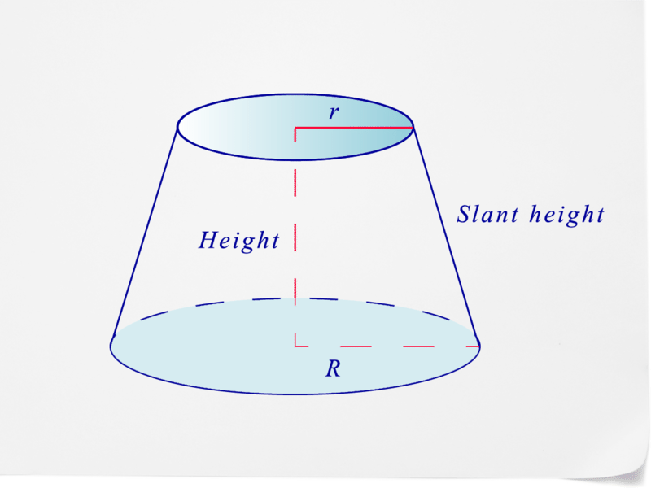

**The formula for finding the surface area of a truncated cone is:**

$$
SA= \pi [s(R+r)+ R^2+r^2]
$$

Notice that s stands for slant height and the capital $R$ stands for the larger radius and the lowercase $r$ stands for the smaller radius.

Example

_What is the surface area of a truncated cone with a slant height of 6 cm, a radius of 8 cm and a radius of 6 cm?_

**To find the surface area of this figure, we fill the dimensions into the formula and solve.**

$$
\begin{align*}
SA &= \pi[6(8+6)+8^2+6^2]\\
SA &= \pi[84+64+36]\\
SA &= 3.14(184)\\
SA &= 577.76 \ cm^2
\end{align*}
$$

Now we can look at applying what we have learned to some real – life problems.

IV. **Solve Real – World Problems Involving Surface Area of Pyramids and Cones**

We have learned two ways to find the surface area of pyramids and cones: drawing a net or using a formula. We can use either of these methods to solve word problems involving surface area. Nets may be especially useful if the problem does not provide an image of the figure. If you choose to use a formula, be sure you know whether the problem deals with a cone or a pyramid, and what the shape of the pyramid’s base is. Let’s practice using what we have learned.

_Trey is decorating conical party hats for his party by wrapping them in colored tissue paper. Each hat has a radius of 4.2 centimeters and a slant height of 8.6 centimeters. If he wants to wrap 6 party hats, how much paper will he need?_

**This problem involves a cone. It does not include a picture, so it may help to draw a net. In your drawing, label the radius and the slant height of the cone. We can also use the formula. We simply put the radius and slant height in for the appropriate variables in the formula and solve for $SA$.**

$$
\begin{align*}
SA  &=  \pi r^2  +  \pi rs\\
SA  &=  \pi (4.2^2)  +  \pi (4.2) (8.6)\\
SA  &=  17.64 \pi +  36.12 \pi\\ 
SA  &=  53.76 \pi\\
SA  &=  168.81 \ cm^2
\end{align*}
$$

**Trey will need 168.81 square centimeters of tissue paper to cover one hat, when we approximate pi as 3.14.**

**But we’re not done yet! Remember, he wants to cover 6 party hats.**

**We need to multiply the surface area of one hat by 6 to find the total amount of paper he needs: $168.81 \times 6 = 1,012.86$. Trey will need 1,012.86 square centimeters of paper to cover all 6 hats.**

Now let’s apply what we have learned to the problem from the introduction.

Real-Life Example Completed
---------------------------

**_The Award Platform_**

**Here is the original problem once again. Reread it and then solve for the surface area of the truncated cone.**

The students ordered an award platform from a company for Olympics. This platform would go on top of the cement area that the students already made and would be the place for the first place finisher in each event to stand and receive his/her award.

“It isn’t a trapezoid like the area we created,” Jose commented when the platform arrived at school.

“I know. They didn’t have a trapezoid. We got this instead,” Carmen explained.

“I think it will still work, and we can paint it,” Jose said.

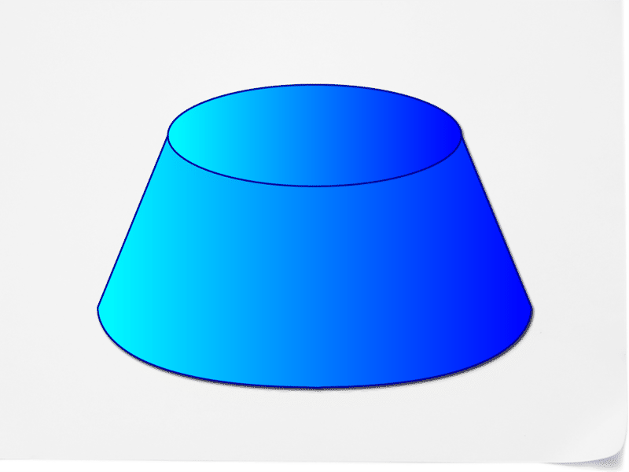

“I’m not sure,” Jose said scratching his head.

**_Solution to Real – Life Example_**

**We can use the following formula to find the surface area of a truncated cone.**

$$
\pi [s(R+r)+ R^2+r^2]
$$

**Now we can take the given information and substitute it into the formula.**

$$
\begin{align*}
& 3.14[3(3 + 2) + 3^2 + 2^2]\\
& 3.14 [3(5) + 9 + 4]\\
& 3.14 [28]\\
& SA = 87.92 \ ft^2
\end{align*}
$$

Vocabulary
----------

Here are the vocabulary words that are found in this lesson.

__Pyramid__

a three – dimensional solid figure with any polygon as a base and all triangular side faces meeting at one vertex.

__Cone__

a three – dimensional solid figure with a circular base, a sector for a side that meets in a single vertex.

__Surface area__

the measurement of the outer covering of a solid figure.

__Net__

a diagram that represents what a solid figure would look like in two-dimensions, flattened out as a pattern.

__Sector__

a piece of a circle.

__Truncated cone__

when a cone is divided by a plane so that the point is removed from the cone leaving only the bottom section.

Time to Practice
----------------

Directions: Look at each figure and answer the following questions about each.

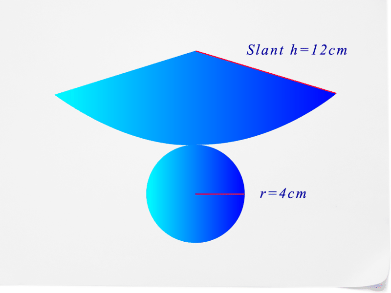
2.  What is the diameter of this figure?
3.  What is the slant height of the figure?
4.  What is the surface area of the figure?

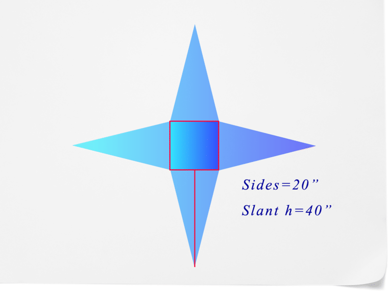
6.  What is the length of each of the sides of the base?
7.  What is the surface area of the figure?

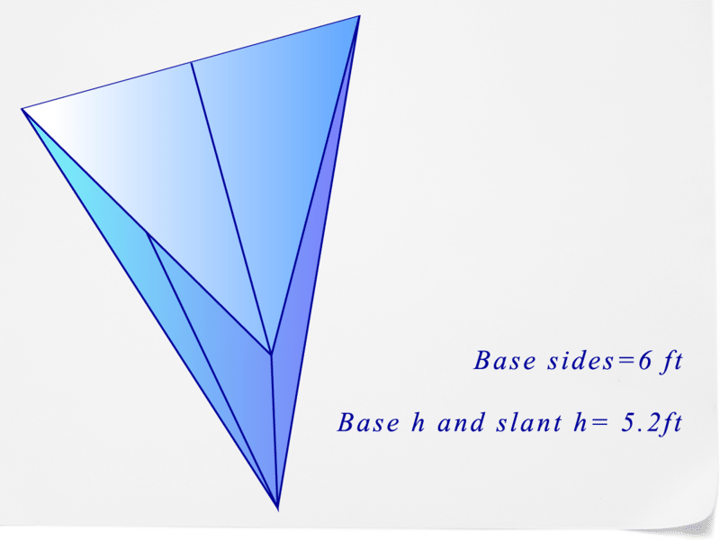
9.  What is the shape of the base?
10. How many faces does this figure have?
11. What is the surface area of this figure?

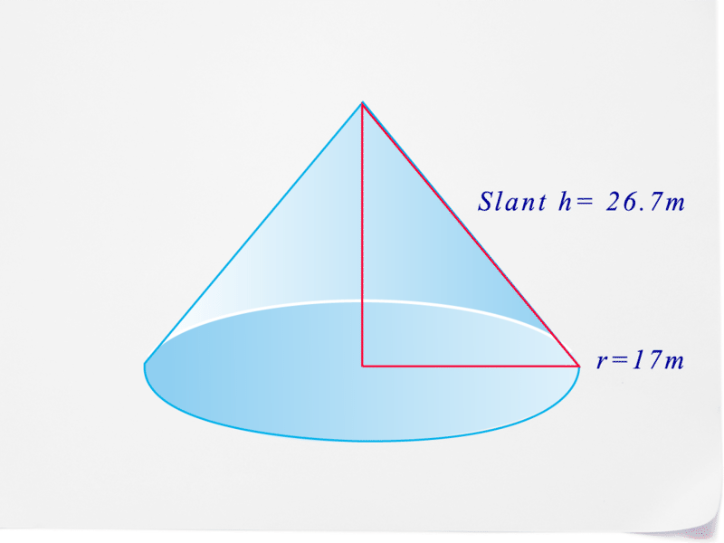
13. What is the shape of the base?
14. What is the diameter of the base?
15. What is the surface area of this figure?

Directions: Use what you have learned to solve each problem.

16. What is the slant height of a pyramid whose square base has sides of 12 feet and surface area is 624 square feet?
17. A cone with a radius of 6.2 meters has a surface area of $131.44 \pi$ square meters. What is the slant height of the cone?
18. Alice and Mike made a teepee in their backyard out of sheets. The teepee had a radius of 3.7 feet and a slant height of 9.3 feet. How many square feet of sheets did they use to make the teepee?
19. For a class project, Omar is making a model of the pyramids in Egypt. He needs to cover 3 square pyramids in gold foil. The base of each pyramid has sides of 10 inches, and each pyramid has a slant height of 18 inches. How much gold foil will Omar need to cover all three pyramids?
20. Christy is decorating a conical piñata with construction paper. If the piñata has a radius of 9.5 centimeters and a slant height of 23 centimeters, how much construction paper will Christy need to use?

</article>

### 8.6 Volume of Prisms and Cylinders

<article>

Introduction
------------

**_Lunch Break_**

When Alicia got to the store, she wasn’t sure how much soup to buy. She picked out a yummy looking organic chicken vegetable soup that she was sure everyone would like, but she couldn’t decide between two and three cans.

After standing there for a few minutes, her stomach began grumbling and she decided to go with the three cans.

“If there is any extra, someone at Jose’s will eat it,” she thought to herself.

Alicia bought the three cans of soup and headed back to Jose’s house.

Each can had a diameter of 5.4 inches and a height of 6.7 inches. What is the total volume of soup that Alicia bought?

**To figure this problem out, you will need to know about volume. Pay close attention to the work being done in this lesson and by the end of it, you will know how to answer this question.**

**_What You Will Learn_**

In this lesson you will learn how to do the following tasks.

* Recognize volume of prisms and cylinders as the sum of volumes of layers of unit cubes.
* Find volumes and linear dimensions of right prisms with any polygonal base.
* Find volumes and linear dimensions of cylinders.
* Solve real – world problems involving volume of prisms and cylinders including metric and customary units of capacity.

**_Teaching Time_**

I. **Recognize Volume of Prisms and Cylinders as the Sum of Volumes of Layers of Unit Cubes**

In the past few lessons we have been learning about finding the surface area of solid figures. Surface area is only one of the measurements that can be calculated. Another measurement is **_volume._** In this lesson we will be calculating the volume of solid figures.

**What is volume?**

**_Volume_** **of a solid figure is the measure of how much three-dimensional space it takes up or holds.**

There are several different ways that we can calculate volume. The first way that we are going to explore is by looking at we can calculate volume using unit cubes.

**What are unit cubes?**

Unit cubes are singular cubes used to represent one unit. When we “fill up” a solid figure with unit cubes, we can see the unit cubes lining up the figure. Then we can count or calculate the number of unit cubes in the solid. The number of unit cubes in the solid figure is the volume of the figure. Let’s examine what this would look like in the following prism.

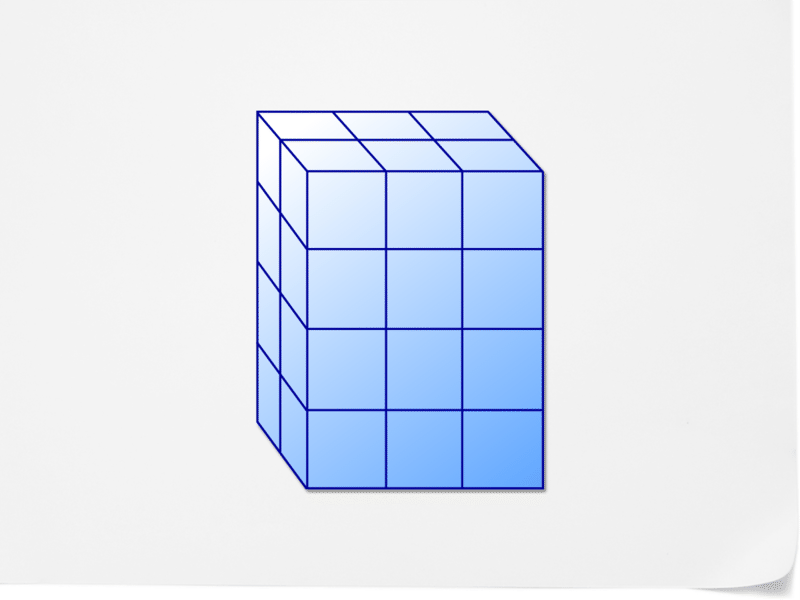

**We would write our answer for volume as 24 cubic units. Notice that we use cubic units because we have length times width times height.**

**We can also use unit cubes to calculate the volume of a cylinder.** This one will be a little funnier because a cylinder is circular and unit cubes are squares. This means that since we can’t cut a unit cube into sections, that it will be impossible for us to calculate an accurate measurement for volume. We will be estimating the volume of the cylinder.

II. **Find Volumes and Linear Dimensions of Right Prisms with Any Polygonal Base**

The formula for volume is a simplified version of the method we just learned. As we saw, we used length and width to find the number of unit cubes in the first layer of the figure. This is the same as finding the area of its base. Let’s see how this works.

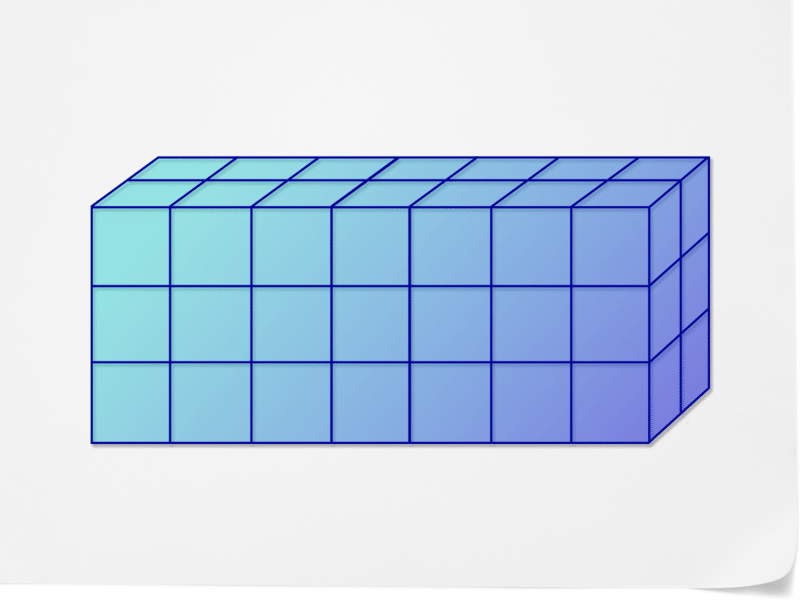

$V  =  Bh$

**$B$ represents the base area of the prism. Remember, a prism can have a base in the shape of any polygon. Therefore the formula we need to use to find the area of the base will change. But the process stays the same: we find the area of the face that is the base and then multiply this by the height of the prism. Remember, you will need to figure out the area of the base and then multiply it by the height to figure out the volume.**

Let’s try it out.

Example

_Find the volume of the prism below._

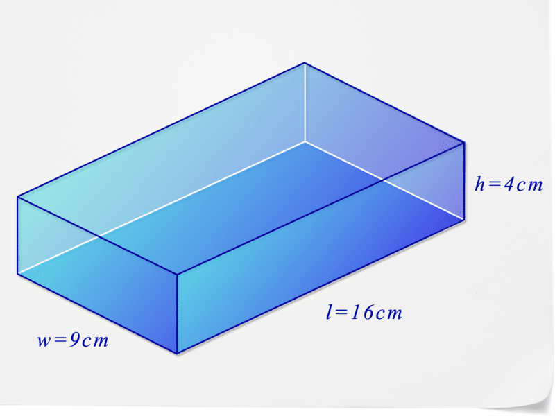

**First we find the area of the base. This is the rectangular side on the bottom. Remember, to find the area of a rectangle we multiply the length times the width. This is our first step.**

$$
\begin{align*}
A&=lw\\ 
A&=(16)(9)\\
A&=144 \ sq.cm
\end{align*}
$$

**The area of the base is 144 sq. cm.**

**But we are not done yet. We need to figure out the volume, so we will need to take the measurement for the area of the base of the figure and multiply it by the height of the figure. We use the following formula to calculate this measurement.**

$$
\begin{align*}
V&=Bh\\ 
V&=144(4)\\
V&=576 \ cm^3
\end{align*}
$$

**The volume of this rectangular prism is $576 \ cm^3$.** **_Notice that we used the exponent three to represent the cubic units of the figure. All volume is measured in cubic units, so you will need to use this exponent when working on figuring out the volume of a solid._**

Example

_What is the volume of the prism below?_

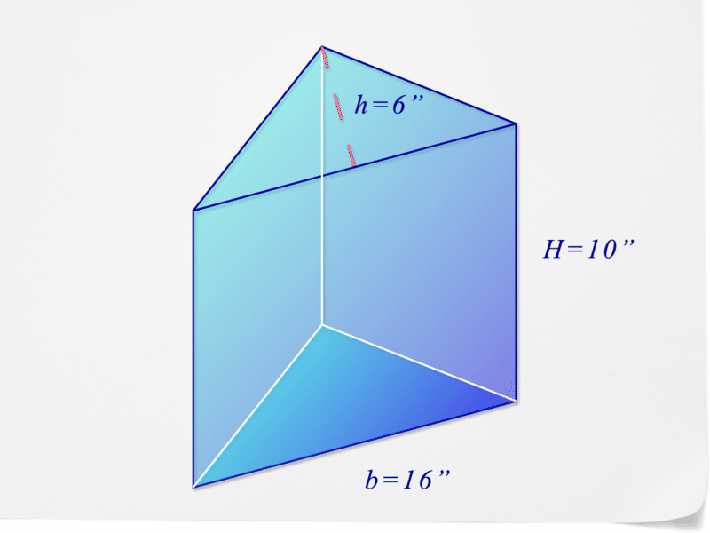

**Now let’s use the formula for finding the area of a triangle to find the area of base of the triangle.**

$$
\begin{align*}
B  &=  \frac{1}{2} bh\\
B  &=  \frac{1}{2}(16)(6)\\
B  &=  8(6)\\ 
B  &=  48 \ in.^2
\end{align*}
$$

**We now have the base area: 48 square inches.**

**Next, we simply multiply it by the height of the prism, according to the volume formula.**

$$
\begin{align*}
V  &=  Bh\\
V  &=  48 (10)\\
V  &=  480 \ in.^3
\end{align*}
$$

The volume of this triangular prism is $480 \ in^3$.

**We can also use what we have learned to work backwards.** If we know the volume and the area of the base of a prism, then we can figure out the height of the prism which would be the missing dimension. Remember that this is the same thing as working out a puzzle!

_The base of a rectangular prism with a volume of 1,145.52 cubic feet has sides of 17.2 feet and 11.1 feet. What is the height of the prism?_

**First, we need to find the area of the base, $B$. We know this is a rectangular prism, so we use the formula $B = lw$.**

$$
\begin{align*}
B  &=  lw\\
B  &=  17.2 (11.1)\\
B  &=  190.92 \ ft^2
\end{align*}
$$

**We can put this into the formula for $B$. We also have been given the volume of the prism, so we put this in for $V$. Then we solve for $h$, the height.**

$$
\begin{align*}
V  &=  Bh\\
1,145.52  &=  190.92h\\
1,145.52  \div  190.92  &=  h\\
6 \ ft  &=  h
\end{align*}
$$

**The height of the prism is 6 feet.**

Now let’s look at how we can use formulas to find the volume of cylinders.

III. **Find Volumes and Linear Dimensions of Cylinders**

**Finding the volume of a cylinder works the same way. We measure the area of the circular base in two dimensions. Then we add the third dimension by multiplying by the height of the cylinder.**

We can use the same formula to calculate the volume of cylinders as we did for prisms. First, we find the area of the bottom face. Remember that the formula we use to find the area of a circle is $A = \pi r^2$. Then, to “stack” the circles to form a cylinder, we simply multiply the area by the height of the cylinder. This gives us the formula for the volume of a cylinder:

$V  =  \pi r^2 h$

This is the same as the prism formula, $V = Bh$, except that the shape of a cylinder’s base never changes, so we do not use different area formulas to find $B$. We always use the formula for the area of a circle, which is $\pi r^2$.

All we need to know is the radius of the circular faces and the height of the cylinder. We simply put these numbers into the formula and solve for volume, $V$. Let’s give it a try.

Example

_Find the volume of the cylinder below._

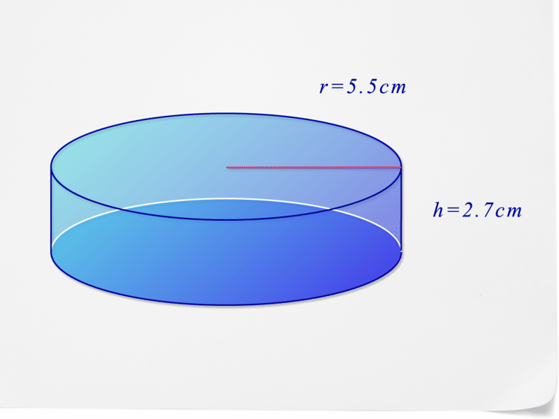

$$
\begin{align*}
V  &=  \pi r^2 h\\
V  &=\pi(5.5^2)(2.7)\\
V  &=\pi(30.25)(2.7)\\	
V  &=81.68 \pi\\
V  &=256.48 \ cm^3
\end{align*}
$$

**The volume of this cylinder is 256.48 cubic centimeters.**

**We can also think about working backwards if we have the volume and one other dimension. Then we can problem solve to figure out the missing dimension.**

Example

_A cylinder with a radius of 3 inches has a volume of $140.4 \pi$ cubic inches. What is the height of the cylinder?_

**What is the problem asking us to find? We need to solve for the height of the cylinder. The problem tells us the radius and the volume. This time the volume is written as a function of pi. This is a way of showing a more specific number, rather than approximating with 3.14. We simply put the whole number into the formula for $V$ and then solve for $h$, the height.**

$$
\begin{align*}
V  &=  \pi r^2h\\
140.4 \pi  &= \pi  (3^2) h\\
140.4 \pi  &=  9 \pi h\\
140.4 \pi  \div  9 \pi  &=  h \quad \text{Divide both sides by} \ 9 \pi. \ \pi \ \text{cancels out.}\\
15.6 \ in.  &=  h
\end{align*}
$$

**We used the volume formula to solve for $h$ and found that the height of the cylinder is 15.6 inches.**

Now let’s look at how we can apply what we have learned to some real – world problems.

IV. **Solve Real – World Problems Involving Volume of Prisms and Cylinders Including Metric and Customary Units of Capacity**

We can use the methods we have learned to solve real-world problems involving volume. First, be sure you understand what the question is asking. Second, decide what kind of solid figure the problem involves so that you know which formula to use. Let’s practice with a few problems.

_Carlos is cleaning out his fish tank, so he filled the bathtub to the rim with water for his fish to swim in while he empties their tank. If the bathtub is 5.5 feet long, 3.3 feet wide, and 2.2 feet deep, how many cubic feet of water can it hold?_

**First of all, what is the problem asking us to find? We need to find the volume of the bathtub. Is a bathtub a prism or cylinder? It is a rectangular prism, so we’ll need to use the area formula for rectangles to find $B$.**

$$
\begin{align*}
B  &=  lw\\
B  &=  5.5  \times  3.3\\
B  &=  18.15 \ ft^2
\end{align*}
$$

**Now we put this value into the volume formula and solve.**

$$
\begin{align*}
V  &=  Bh\\
V  &=  18.15  \times  2.2\\
V  &=  39.93 \ ft^3
\end{align*}
$$

**Carlos’s bathtub can hold 39.93 square feet of water.**

**Now let’s go back and use what we have learned to solve the problem from the introduction.**

Real-Life Example Completed
---------------------------

**_Lunch Break_**

**Here is the original problem once again. Reread it and then answer the question at the end.**

In the midst of all of the painting, Jose and Carmen sent Alicia out to the grocery store to pick up some lunch. Since the three were painting at Jose’s house, his mother had made some bread and soup seemed like an obvious choice.

When Alicia got to the store, she wasn’t sure how much soup to buy. She picked out a yummy looking organic chicken vegetable soup that she was sure everyone would like, but she couldn’t decide between two and three cans.

After standing there for a few minutes, her stomach began grumbling and she decided to go with the three cans.

“If there is any extra, someone at Jose’s will eat it,” she thought to herself.

Alicia bought the three cans of soup and headed back to Jose’s house.

Each can had a diameter of 5.4 inches and a height of 6.7 inches. What is the total volume of soup that Alicia bought?

**_Solution to Real – Life Example_**

**What do we need to find?**

**We need to find the volume of soup that Alicia bought. Keep in mind that she bought 3 cans of soup. We need to find the volume of one can of soup and then multiply this amount by 3 to find the total volume.**

**What information have we been given?**

**First, we know that the soup cans are cylinders, so we’ll need to use the volume formula for cylinders. We also know that the height of each can is 6.7 inches. What is the radius? We have only been given the diameter, which is 5.4 inches. Therefore we need to divide by 2 to find the radius.**

$5.4 \div 2 = 2.7$

**The radius of each can is 2.7 inches. Now we can put this information into the formula and solve for $V$, volume.**

$$
\begin{align*}
V  &= \pi  r^2h\\
V &= \pi (2.7^2)(6.7)\\
V &=\pi (7.29)(6.7)\\
V &= 48.84 \pi\\ 
V &= 153.36 \ in.^3
\end{align*}
$$

**Each can has a volume of 153.36 cubic inches when we approximate pi as 3.14.**

**But we’re not done yet! Remember, we need to find the total volume of** **_three_** **cans of soup. Therefore we need to multiply the volume of one can by 3.**

$153.36 \times 3 = 460.08 \ in^3$

**Alicia bought a total of 460.08 cubic inches of soup.**

Vocabulary
----------

Here are the vocabulary words that are found in this lesson.

__Volume__

Volume

the amount of water or capacity that a solid figure can hold. Volume is measured in cubic units.

Time to Practice
----------------

Directions: Look at each figure and then answer the questions about each figure.

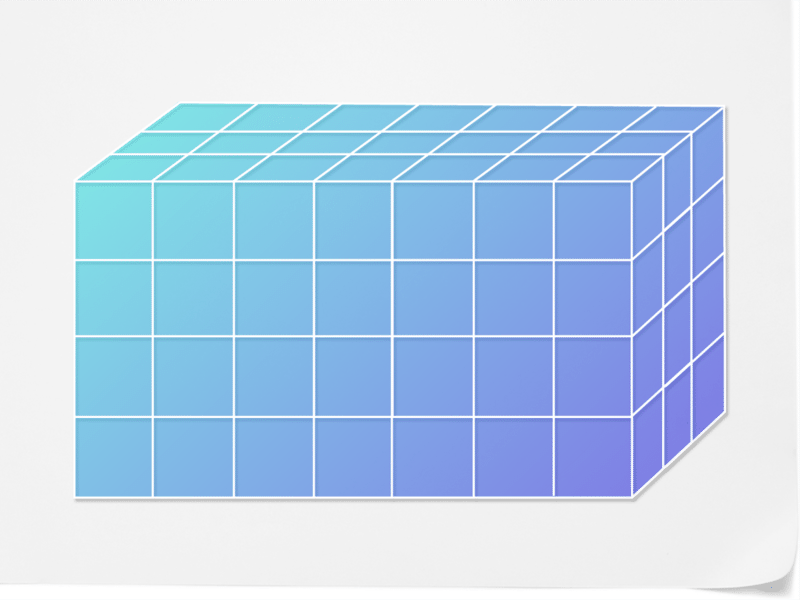
2.  What is the length of the figure?
3.  What is the width of the figure?
4.  What is the height of the figure?
5.  What is the volume of the figure?

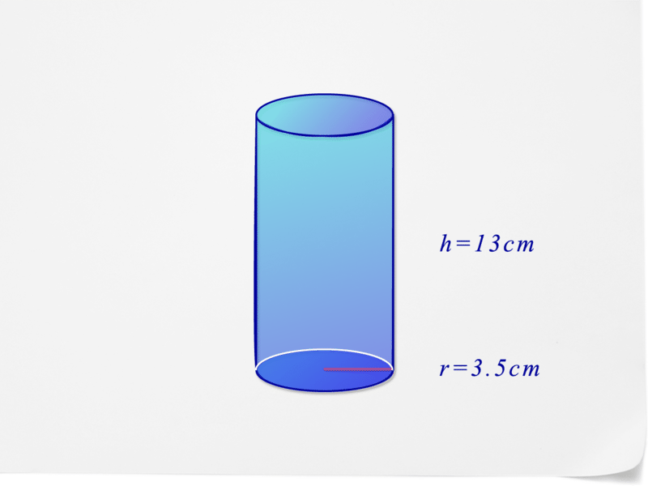
7.  What is the diameter of the figure?
8.  What is the radius is the figure?
9.  What is the volume of the figure?

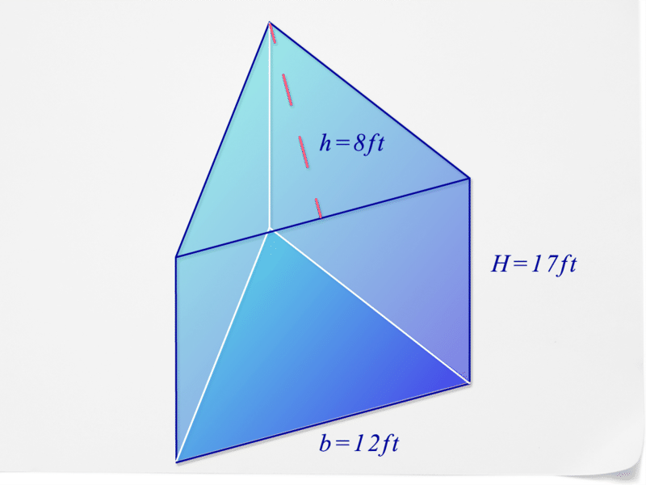
11. What is the shape of the bases?
12. What is the shape of the side faces?
13. What is the volume of the figure?

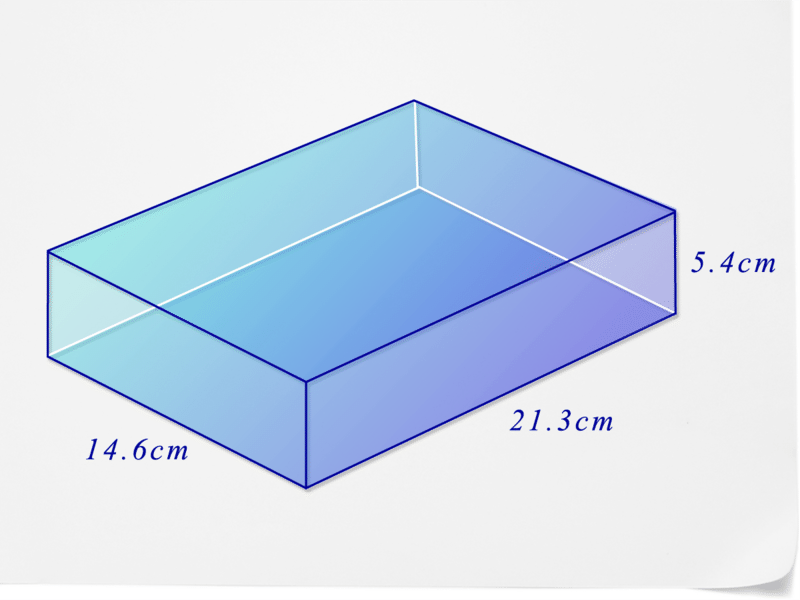
15. What is the volume of the figure?

Directions: Use what you have learned about volume to solve each problem.

16. A rectangular prism has a base measuring 16.2 by 14.8 feet. If its volume is 2,877.12 cubic feet, what is its height?
17. What is the height of a cylinder whose radius is 12 meters and volume is $1,296 \pi$?
18. Kelly is using a rectangular container to fill up a bucket of water. The container is 3.8 inches long, 2.5 inches wide, and 7.2 inches tall. If the bucket holds 1,368 cubic inches of water, how many times will Kelly have to fill the cup in order to fill the bucket?
19. The Berryville Aquarium has a shark tank in the shape of a triangular prism. There is only one shark in the tank, so right now the tank is only $\frac{2}{3}$ full. How many cubic feet of water are in the tank?
20. Based on this, how many cubic feet of water would have the tank be completely full?

</article>

### 8.7 Volume of Pyramids and Cones

<article>

Introduction
------------

**_Ice Cream Sales_**

“I agree, and besides, people like to eat,” Jamie agreed.

“How about ice cream cones? We can use the freezer in the lunch room and scoop and serve,” Dan suggested.

“I think that’s a great idea. How about using waffle cones?” Maria added.

The group continued to discuss the ice cream cones and finally agreed on two different sized cones, one that is $4^{\prime\prime}$ in diameter and $4^{\prime\prime}$ long and one that is $5^{\prime\prime}$ in diameter and $6^{\prime\prime}$ long.

“We can charge double for the larger cone,” Jamie said.

“I don’t think so. It isn’t double the size,” Dan disagreed.

“But it will hold double the amount of ice cream,” Jamie explained.

“I don’t think so because it isn’t twice as large.”

“That doesn’t matter when it comes to volume,” Jamie said.

**Who is correct? To figure this out, you will need to find the volume of both cones. Then you will be able to decide whether the group can charge double for the larger cone.**

**_What You Will Learn_**

By the end of this lesson, you will be able to complete the following skills.

* Recognize volume of pyramids and cones as the sum of volumes of layers of unit cubes.
* Find volumes and linear dimensions of pyramids with any polygonal base.
* Find volumes and linear dimensions of cones and truncated cones.
* Solve real – world problems involving volume of pyramids and cones, including metric and customary units of capacity.

**_Teaching Time_**

I. **Recognize Volume of Pyramids and Cones as the Sum of Volumes of Layers of Unit Cubes**

In this lesson we will learn to find the **_volume_** of **_pyramids_** and **_cones_**. Pyramids and cones are solid shapes that exist in three-dimensional space. A pyramid has sides that are triangular faces and a base. The base can be any shape. Like pyramids, cones have a base and a point at the top. However, cones always have a circular base. They have only one side, and it is curved.

**What is volume?**

**_Volume_** **is the measure of how much space a three-dimensional figure takes up or holds.** Imagine a funnel. Its size determines how much water the funnel will hold. If we fill it with water, the amount of water tells the volume of the funnel. Volume is often what we think of when we talk about measuring liquid or liquid capacity.

In the last lesson, you learned how to calculate the volume of prisms and cylinders. In this lesson, you will learn how to calculate the volume of pyramids and cones.

**We measure volume in three dimensions: length, width, and height. We therefore measure volume in cubic units. We can use unit cubes to represent volume. Have a look at the cube below.**

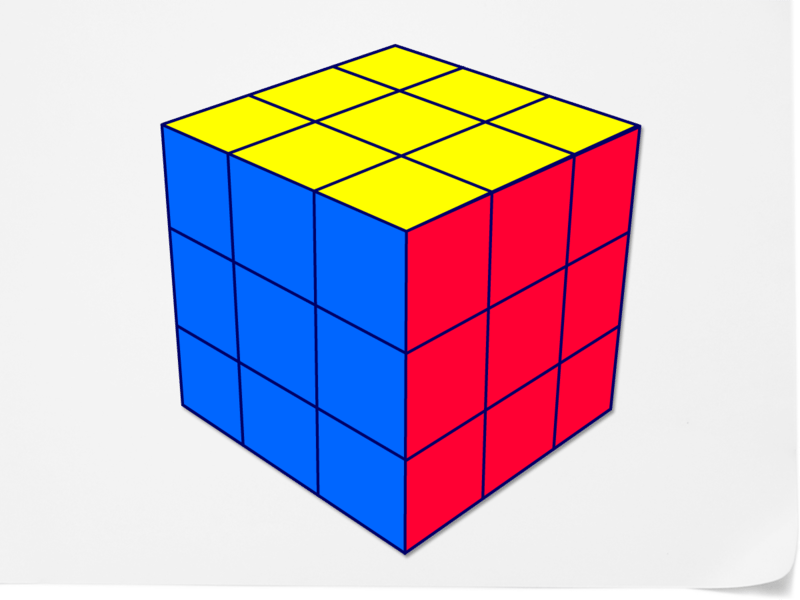

$$
\begin{align*}
V & =Bh\\
V & =(s^2 )3\\
V & =3^2 (3)\\
V & =27 \ cubic \ units
\end{align*}
$$

**Notice that we measure volume in cubic units.**

Pyramids and cones are unusual, however, because they are so much smaller at the top than they are at their base. It becomes very difficult to use unit cubes to measure the volume of these solids because we would be calculating parts of unit cubes.

**_The important thing to remember is that measuring volume involves filling up a solid figure._**

**The pyramid and cube have bases with the same area, as do the cone and the cylinder. But what happens when we try to add the third dimension of height? In the cube and cylinder, we “stack” the base, as if in layers. In the pyramid and cone, however, the area gets smaller as we go up. In fact, it gets smaller in equal proportion as we add each layer. A pyramid has exactly one-third the volume of a cube. A cone has exactly one-third the volume of a cylinder.**

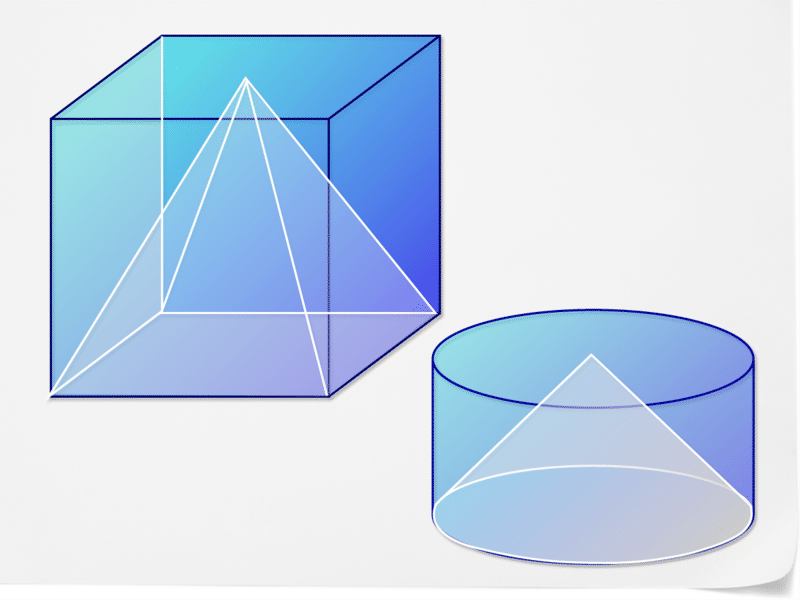

$$
V= \frac{1}{3} Bh
$$

Let’s look at how to use this formula to find the volume of pyramids first.

II. **Find Volumes and Linear Dimensions of Pyramids with Any Polygonal Base**

As we have seen, we are dealing with three dimensions when we find the volume of a solid figure. Finding the area of the base accounts for two of the dimensions the length and the width. Then we multiply this by the height of the figure. Because a pyramid has $\frac{1}{3}$ the volume of a cube, we use the cube formula and then multiply by $\frac{1}{3}$. We write the volume formula like this:

$$
V  =  \frac{1}{3} Bh
$$

In the formula, $V$ stands for volume, the amount we are solving for. $B$ represents the base area, and $h$ represents the height of the pyramid.

**Pyramids can be tricky, however, because they can have bases of any shape. Pyramids can have triangular, rectangular, or square bases. That means we need to choose the appropriate formula for finding the area of the base, or $B$.** Here are the common area formulas:

Square: $A  =  s^2$

Rectangle: $A  =  lw$

Triangle: $A  =  \frac{1}{2} bh$

**When given a pyramid, the first thing we need to do is determine the shape of the base. Then we’ll know which formula to use to find the base area. Once we have the base area, we put it into the volume formula along with the height of the pyramid and then solve for $V$.** Let’s give it a try.

Example

_What is the volume of the pyramid below?_

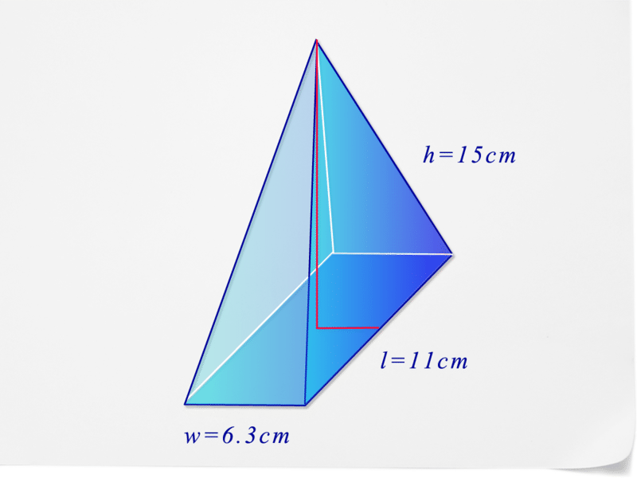

$$
\begin{align*}
B & = lw\\
B & =  11 (6.3)\\
B & =  69.3 \ cm^2
\end{align*}
$$

**The area of this pyramid’s base is 69.3 square centimeters. Now we multiply this by the height and $\frac{1}{3}$, according to the formula.**

$$
\begin{align*}
V & =  \frac{1}{3} Bh\\
V & =  \frac{1}{3} (69.3) (15)\\
V & =  23.1 (15)\\
V & =  346.5 \ cm^3
\end{align*}
$$

**The volume of this pyramid is $346.5 \ cm^3$.** **_Remember that volume is always measured in cubic units and that is why our exponent is a three._**

**We can also work the other way around. If you know the base area and the volume, then you can use substitution and our formula to find the missing measurement for height.** Let’s look at an example.

Example

_A triangular pyramid has a volume of 266 cubic feet and a base area of 42 square feet. What is its height?_

**What do we need to find? We need to solve for the height, $h$. We have been given the volume and the base area so we simply put this information into the formula.**

$$
\begin{align*}
V & = \frac{1}{3} Bh\\
266 & = \frac{1}{3} (42)h\\
266 & = 14h\\
266 \div 14 & =  h\\
19 & = h
\end{align*}
$$

**The height of this pyramid is 19 feet.**

Now let’s look at how we can use a formula to find the volume of cones.

III. **Find Volumes and Linear Dimensions of Cones and Truncated Cones**

We can use the same general formula to find the volume of cones: $V  = \frac{1}{3} Bh$. However, cones have a circular base. **To find the base area, then, we need to use the formula for finding the area of a circle: $A = \pi r^2$.** When working with pyramids, the polygon base could be different depending on the type of pyramid. This is different from a cone. With a cone, you will always have a circular base, so you will always be using the same formula for area to find the base. Here is what it would look like as one formula.

$V=\frac{1}{3} (\pi r^2)(h)$

**Now you can see that we would find the area of the base, multiply it by the height and then multiply it by one-third or take one-third of the product of the base area and the height.**

Example

_What is the volume of the cone below?_

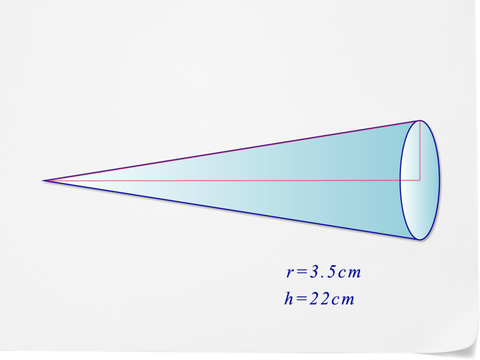

$$
\begin{align*}
B & = \pi r^2\\
B & = \pi (3.5^2)\\
B & =  12.25 \pi\\
B & =  38.47 \ cm^2
\end{align*}
$$

**The circular base has an area of 38.47 square centimeters. Now we can put this measurement into the formula for volume.**

$$
\begin{align*}
V & =  \frac{1}{3} Bh\\
V & = \frac{1}{3} (38.47) (22)\\
V & =  12.82 (22)\\
V & =  282.04 \ cm^3
\end{align*}
$$

**The volume of this cone is $282.04 \ cm^3$.**

**We can find a missing dimension of a cone if we have been given the volume of that cone and the base area. Let’s look at an example.**

Example

_What is the height of a cone whose radius is 1.6 meters and volume is 20.1 cubic meters?_

**What information have we been given, and what do we need to find? We know the radius, so we can calculate the base area. We also know the volume, so we can put this into the formula and solve for $h$, the height. Let’s find $B$ first.**

$$
\begin{align*}
B & = \pi r^2\\
B & = \pi (1.6^2)\\
B & = 2.56 \pi\\
B & = 8.04 \ m^2
\end{align*}
$$

**The base area is 8.04 square inches when we approximate pi. Now let’s put this into the volume formula.**

$$
\begin{align*}
V & = \frac{1}{3} Bh\\
20.1 & = \frac{1}{3} (8.04)h\\
20.1 & =  2.68h\\
20.1 \div 2.68 & =  h\\
7.5 \ m & =  h
\end{align*}
$$

**We found that the height of the cone must be 7.5 meters.**

In other sections on figuring out volume, we have also worked with pieces of other solids. These figures are referred to as **_truncated_** solids. We can find the volume of a truncated cone as well. Let’s explore this a little further.

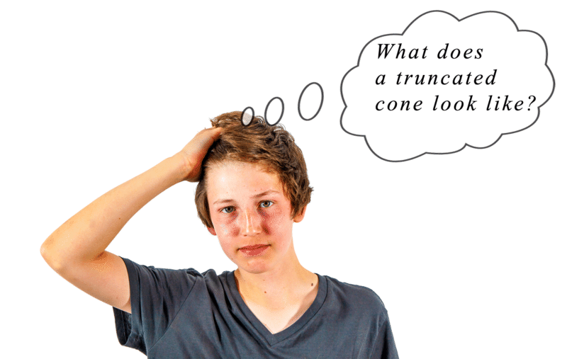

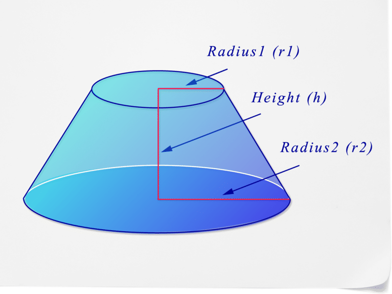

$V=\frac{1}{3} \pi(r1^2+(r1)(r2)+r2^2)h$

Now we can take some measurements and figure out the volume of the truncated cone. Let’s look at an example.

Example

_What is the volume of a truncated cone with a top radius of 2 cm, a bottom radius of 4 cm and a height of 4.5 cm?_

**To work through this problem, we have to substitute the given values into the formula and solve for the volume.**

$$
\begin{align*}
V & = \frac{1}{3} \pi (r1^2+(r1)(r2)+r2^2)h \\
V & = \frac{1}{3} \pi (2^2+(2)(4)+4^2)4.5 \\
V & = \frac{1}{3} \pi (4+8+16)4.5 \\
V & = \frac{1}{3} \pi (126)\\
V & = \frac{1}{3} (395.64)\\
V & = 131.88  \ cm^3
\end{align*}
$$

**This is the volume of this truncated cone.**

IV. **Solve Real – World Problems Involving Volume of Pyramids and Cones, Including Metric and Customary Units of Capacity**

We can also use the formula to solve real-world problems involving volume of pyramids or cones. Be sure you understand what the problem is asking. Then look to see what information is given in the problem. Third, put this information in for the appropriate variable in the formula and solve. Remember always to look first to see what shape the base of the figure is. If a picture is not given, draw one to help you. Let’s give it a try.

Example

_Brianna bought the candle below for her friend’s birthday. The package says that the candle burns one hour for every 20 cubic centimeters of wax. For how many hours will it take for the entire candle to burn?_

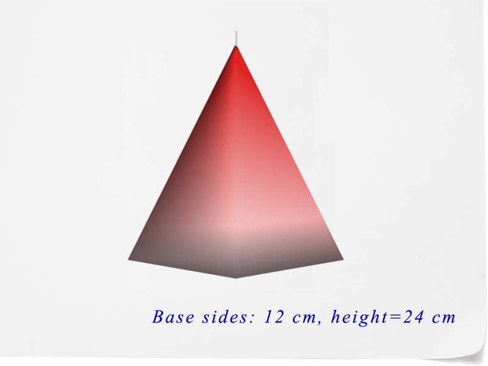

**What information have we been given? We know the dimensions of the base, which is a square, so let’s use the area formula for squares to find the base area.**

$$
\begin{align*}
B & =  s^2\\
B & = (12^2)\\
B & =  144 \ cm^2
\end{align*}
$$

**The base area of the pyramid is 144 square centimeters. We can put this information into the formula and solve for $V$, volume.**

$$
\begin{align*}
V & = \frac{1}{3} Bh\\
V & = \frac{1}{3} (144) (24)\\
V & = 48 (24)\\
V & = 1,152 \ cm^3
\end{align*}
$$

**Now we know that the candle contains 1,152 cubic centimeters of wax.**

**But we’re not done yet! Remember, we need to find how many hours the candle will burn. Look back at the problem. It tells us that the candle burns one hour for every 20 cubic centimeters of wax. To find how many hours the candle will burn, we need to divide the total volume of wax by 20.**

$1,152 \div 20 = 57.6$

**The candle will burn for 57.6 hours. This is our answer.**

Now let’s go back and solve the problem from the introduction.

Real-Life Example Completed
---------------------------

**_Ice Cream Sales_**

**Here is the original problem from the introduction. Reread it and then figure out the volume of both ice cream cones. Finally decide if the group can charge double for the larger cone-be sure to justify your answer.**

“We need a fundraiser,” Maria said at the planning meeting for the Olympics.

“I agree, and besides, people like to eat,” Jamie agreed.

“How about ice cream cones? We can use the freezer in the lunch room and scoop and serve,” Dan suggested.

“I think that’s a great idea. How about using waffle cones?” Maria added.

The group continued to discuss the ice cream cones and finally agreed on two different sized cones, one that is $4^{\prime\prime}$ in diameter and $4^{\prime\prime}$ long and one that is $5^{\prime\prime}$ in diameter and $6^{\prime\prime}$ long.

“We can charge double for the larger cone,” Jamie said.

“I don’t think so. It isn’t double the size,” Dan disagreed.

“But it will hold double the amount of ice cream,” Jamie explained.

“I don’t think so because it isn’t twice as large.”

“That doesn’t matter when it comes to volume,” Jamie said.

**_Solution to Real – Life Example_**

**We can begin by figuring out the volume of both ice cream cones.**

**Cone 1 has a diameter of $4^{\prime\prime}$ and a height of $4^{\prime\prime}$**

**Cone 2 has a diameter of $5^{\prime\prime}$ and a height of $6^{\prime\prime}$**

**The formula for volume of a cone is $\frac{1}{3} \pi r^2 h$**

**Cone 1**

$\frac{1}{3}(3.14)(2^2)(4) = 16.75 \ in^3$

**Cone 2**

$\frac{1}{3}(3.14)(2.5^2)(6) = 39.25 \ in^3$

**The volume of Cone 2 is more than double that of Cone 1. The students could definitely charge double for the cone if they chose to.**

Vocabulary
----------

Here are the vocabulary words that are found in this lesson.

__Volume__

the capacity inside a solid figure or the amount of space a solid figure can hold.

__Pyramid__

a solid figure with a polygon base and triangular side faces that meet in a single vertex.

__Cones__

a circular base and a curved side that meets in a single vertex.

__Base Area__

the area of the base of a solid figure.

__Height__

the measurement that is perpendicular to the base of a solid figure.

__Truncated cone__

a section of a cone-it has two circular radii – one on top and one as a base.

Time to Practice
----------------

Directions: Answer each of the following questions.

1.  What is the formula for finding the volume of a cone?
2.  True or false. A truncated cone is a cone without a vertex.
3.  True or false. You can use the same formula to find the volume of a truncated cone as a regular cone.
4.  What is the formula that you would need for finding the volume of a pyramid?
5.  When you see a capital B in a formula it means that you are looking for the perimeter or area of the base?

Directions: Look at each figure and then answer the following questions about each.

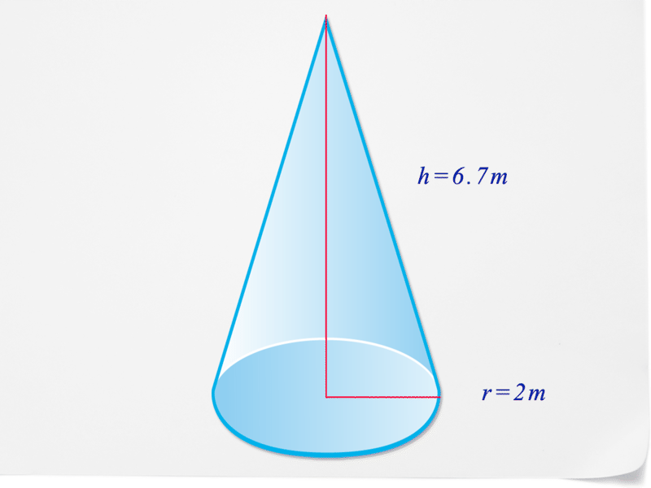
7.  What is the diameter of the base?
8.  What is the volume of this figure?

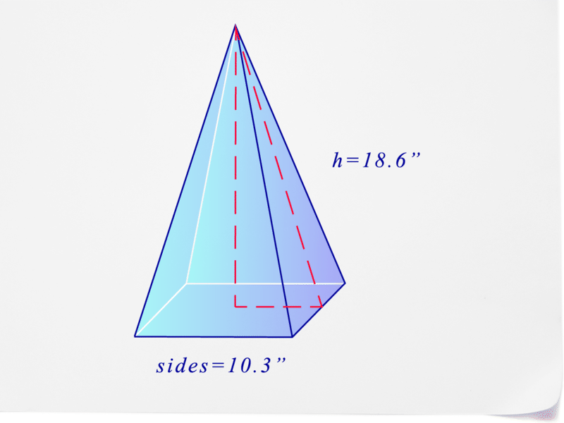
10. What is the shape of the base?
11. What is the volume of the figure?

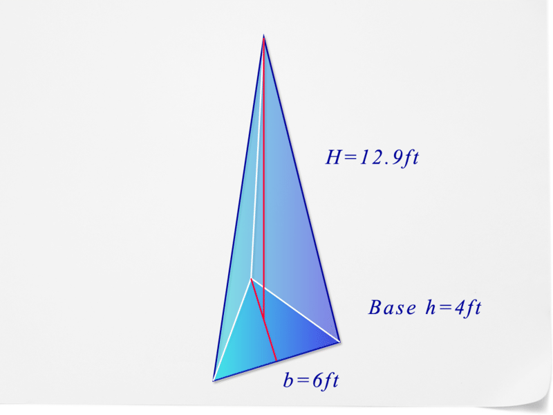
13. What is the difference between this figure and the last figure?
14. What is the volume of this figure?
15. What is the shape of the base?

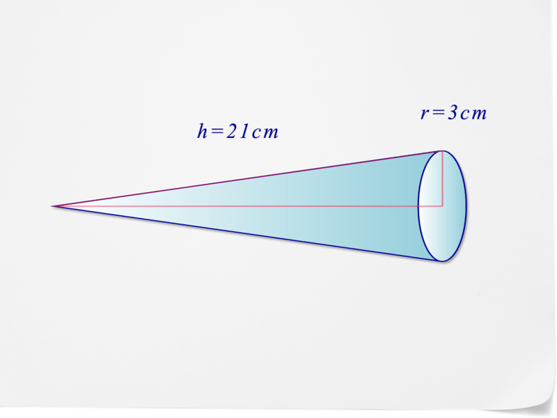
17. What is the height of the cone?
18. What is the volume of the cone?

Directions: Use what you have learned to solve each of the following problems.

19. A cone has a radius of 6 meters and a volume of $168 \pi$. What is its height?
20. A square pyramid has a base with sides of 5 yards each and a volume of 175 cubic yards. What is its height?
21. The containers of icing for Tina’s cake decorator are cones. Each container has a radius of 2.4 inches and a height of 7 inches. If Tina buys containers of red, yellow, and blue icing, how much icing will she buy?
22. Claire has a perfume bottle shaped like a triangular pyramid. Its base area is 48 square centimeters, and its height is 28 centimeters. How much does the bottle hold when it is exactly half full?

</article>

### 8.8 Surface Area and Volume of Spheres

<article>

Introduction
------------

**_The Pinata_**

For the final celebration, the students hosted a huge party in the gymnasium. Joe took on creating a piñata that students could enjoy. In fact, he made four of them for the party. When finished with the basic shape, Joe began decorating the sphere shaped piñata with green construction paper.

Each sphere has a radius of 2.4 feet and Joe made four piñatas. How much construction paper will he need to cover each piñata completely?

**Figuring out the surface area and volume of a sphere can be a tricky thing to figure out. For this problem, you will need to know how to solve for the surface area of a sphere. Pay close attention throughout this lesson and you will know how to solve the problem by the end of the lesson.**

**_What You Will Learn_**

In this lesson, you will learn how to complete the following skills.

* Recognize and apply the formula for the surface area of a sphere.
* Recognize and apply the formula for the volume of a sphere.
* Compare surface area and volume of spheres, cylinders and cones.
* Solve real – world problems involving surface area and volume of spheres.

**_Teaching Time_**

I. **Recognize and Apply the Formula for the Surface Area of a Sphere**

In this lesson we will learn to find the **_surface area_** and **_volume_** of **_spheres_**. **A sphere is a solid figure that exists in three-dimensional space. Spheres consist of all the points that are equidistant from a center point. Every point on the sphere is the distance of the radius from the center. Spheres are perfectly round.**

**Surface area is the total of the areas of each face in a solid figure.** Spheres do not have any faces because they are round. Still, we can think of its surface as a flat plane that we can unroll. Imagine you could wrap a sphere in wrapping paper, like a present. The amount of wrapping paper needed to cover the figure exactly represents its surface area.

**The volume of a solid figure is the measure of how much three-dimensional space it takes up or holds.** Imagine a filling a balloon with water. The size of the balloon determines how much water it can hold. The amount of water tells the volume of the balloon. We measure volume in cubic units, because we are measuring in three dimensions: length, width, and height.

**We can calculate the surface area and volume of a sphere by using formulas. Let’s look at finding surface area first.**

As we’ve said, surface area is the total area for the surface of a sphere. Imagine you need to wrap a present in the shape of a sphere. How much wrapping paper would you need to cut to cover the sphere?

If we could “unroll” the sphere and show it as a rectangle, the rectangle would have a width that is equivalent to the diameter of the sphere. Its length would be the same as the circumference of the sphere (recall that circumference is the distance around a circle). Now this gives us something we can work with, because we can use the area formula for rectangles to find the area of the “unrolled” sphere.

The formula for the area of rectangles is $A = lw$. In other words, we multiply the length and the width. Now let’s think about this in terms of the sphere. We have said that the length is the same as the circumference and that the width is the same as the diameter. This gives us $A = Cd$. Now let’s substitute the formula for circumference in for $C$, which is $2 \pi r$, where $r$ is the radius. Now we have $A = 2 \pi rd$. There’s one more substitution we can make to make the calculations easier. Remember, the diameter of a circle or sphere is exactly twice the radius. Let’s us $2r$ instead of $d$. Now we have $A = 2 \pi r \times 2r$. Finally, we can simplify this by multiplying to get $4 \pi r^2$. Let’s sum all of this up:

$$
\begin{align*}
A & =  l \times w\\
A & =  C \times d\\
A & =  2 \pi r \times 2r\\
SA & = 4 \pi r^2
\end{align*}
$$

**The formula for finding the surface area of a sphere is $4 \pi r^2$.**

All we need to do is substitute the measure of the radius for $r$ in the formula and solve for $SA$, the surface area. Let’s give it a try.

Example

_What is the surface area of the sphere below?_

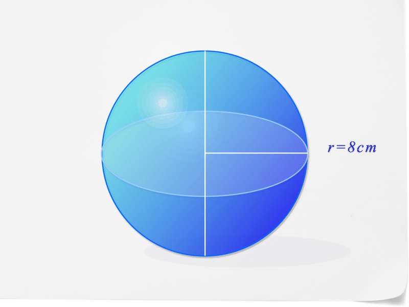

$$
\begin{align*}
SA & =  4 \pi r\\
SA & = 4 \pi (8^2)\\
SA & = 4 \pi (64)\\
SA & = 256 \pi
\end{align*}
$$

Calculating numbers with pi is a bit complicated, because pi is actually a decimal number that goes on forever.

**The most exact measure of the sphere’s surface area is to leave it as $256 \pi$. However, we often round the decimal to 3.14 to represent pi. Then we would multiply 256 by 3.14 to get a surface area of 803.84 square centimeters for this sphere. Remember, we always use square units to measure area, because we measure area in two dimensions.**

Now let’s look at how we can calculate the volume of a sphere.

II. **Recognize and Apply the Formula for the Volume of a Sphere**

**Volume, as we have said, is the measure of three-dimensional space a figure takes up. We can also think of it as how much space the figure “holds.” For spheres, finding volume is a bit complicated because it doesn’t have any flat surfaces.**

**To find the volume of spheres, we can use pyramids. Imagine a pyramid with its base on the surface of the sphere and its point as the center of the sphere. The radius of the sphere would be the height of the pyramid.**

**Let’s look at how this information can give us the formula for finding the volume of a sphere.**

$V = \frac{1}{3} Bh$

Volume formula for a pyramid, where $B$ represents the area of its base

$V = \frac{1}{3} \times \text{surface area of sphere} \times r$

The surface area of the sphere is equal to the area of the bases of all the pyramids. The height of the pyramid is equal to the radius of the sphere, so we substitute $r$ for $h$.

$V = \frac{1}{3} \times 4 \pi r^2 \times r$

We can simplify the formula by combining like terms.

$V = \frac{4}{3} r^3$

**The formula for finding the volume of a sphere is $V = \frac{4}{3} r^3$.**

**Again, all we need to know is the radius of the sphere. We put the value in for $r$ in the formula and solve for $V$, the volume.** Let’s try it.

Example

_Find the volume of the sphere below._

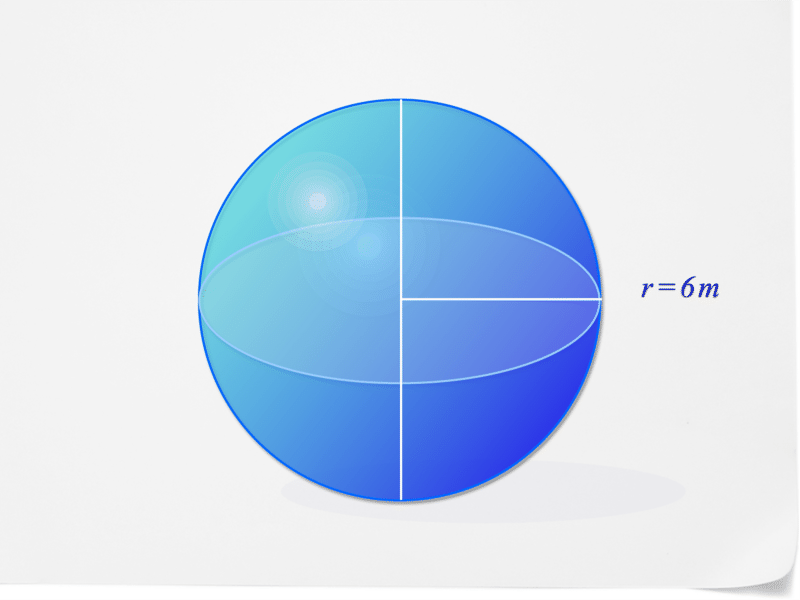

$$
\begin{align*}
V & = \frac{4}{3} \pi r^3\\
V & = \frac{4}{3} \pi (6^3)\\
V & = \frac{4}{3}(216) \pi\\
V & = 288 \pi
\end{align*}
$$

**We can leave the volume as $288 \pi$, or we can use 3.14 to approximate an answer. This gives us $288 \times 3.14 = 904.32 \ cubic \ meters$. Remember, we measure volume in three dimensions, so we use cubic units.**

The volume and surface areas of different solid figures can be compared because they have a relationship. Let’s take a look at how we can compare these figures.

III. **Compare Surface Area and Volume of Spheres, Cylinders and Cones**

We can compare the surface area and volume of spheres, cylinders and cones with the same radii and height. There is a relationship between the measurements of each of these. Let’s look at this picture.

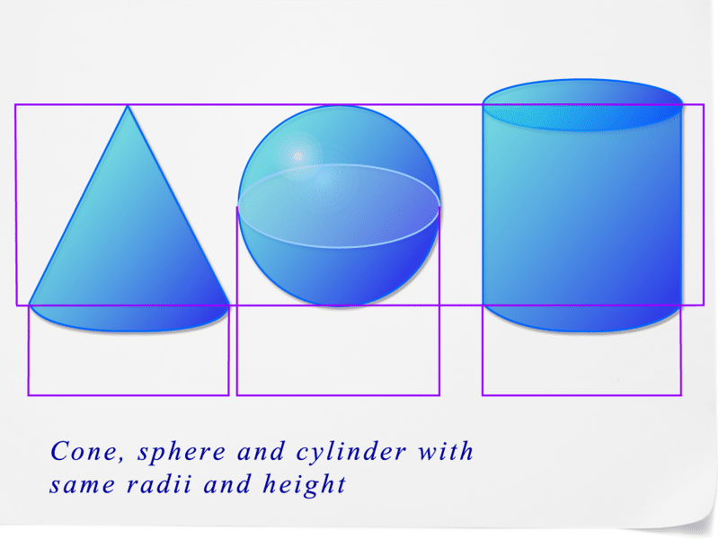

**The volume of a sphere is $\frac{2}{3}$ the volume of the cylinder. Once again, we can see how the sphere would fit inside the cylinder given the same radius and height.**

**What about surface area?**

We know that surface area refers to the outer covering on a solid figure. We can compare the surface areas of cylinders, cones and spheres too.

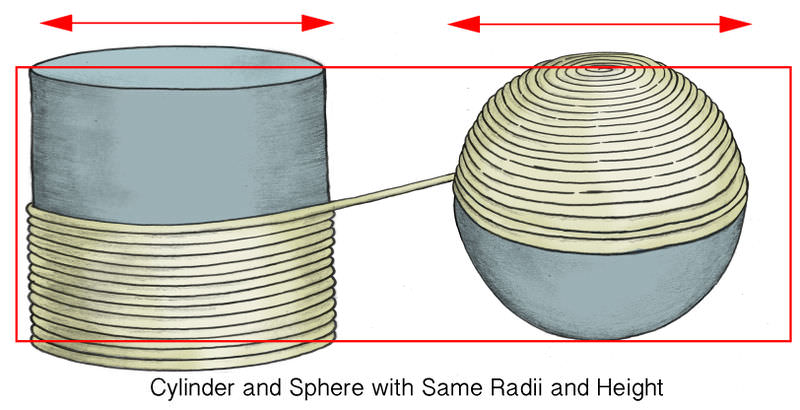

**What about cones and cylinders?**

**The surface area of a cone is one-half the surface area of a cylinder if they have the same height and radius. Let’s look at an example.**

**Cone = Radius of 10 cm, height of 6 cm**

$$
\begin{align*}
SA & = 3.14(10^2)+3.14(10)(6) \\
SA & = 502.4 \ sq.cm
\end{align*}
$$

**Cylinder with Radius of 10 cm and height of 6 cm**

$$
\begin{align*}
SA & = 2(3.14)(10^2)+2(3.14)(10)(6) \\
SA & = 1004.8 \ sq.cm
\end{align*}
$$

**You can see the relationship between these two solids.**

IV. **Solve Real – World Problems Involving Surface Area and Volume of Spheres**

We can use the formulas we have learned to solve real-world problems involving spheres. First, be sure you understand what the question is asking. Do you need to find the surface area or the volume? Second, make sure you know what the radius of the sphere is. If you have been given the diameter, divide it in half to find the radius. Let’s practice with a few problems.

Example

_Maria has a paperweight that is a glass sphere. The sphere is full of red, sparkly liquid. If the diameter of the paperweight is 6 inches, how much red liquid does it contain?_

**First of all, what is the problem asking us to find? We need to find how much liquid the paperweight contains. This amount will be the volume of the paperweight, so we’ll need to use the volume formula. Now let’s see if we know the radius of the paperweight. We know that the** **_diameter_** **is 6 inches. Therefore the radius is $6 \div 2 = 3 \ inches$. Now we can put this into the volume formula and solve.**

$$
\begin{align*}
V & = \frac{4}{3} \pi r^3\\
V & = \frac{4}{3} \pi (3^3)\\
V & = \frac{4}{3} (27) \pi\\
V & =  36 \pi
\end{align*}
$$

**The sphere has a volume of $36 \pi$. We can approximate a numeric value if we use 3.14 for pi. This gives us a volume of $36 \times 3.14 = 113.04 \ cubic \ inches$.**

Now let’s go back and apply what we have learned to the problem from the introduction.

Real-Life Example Completed
---------------------------

**_The Pinata_**

**Here is the original problem once again. Reread it and then solve the problem.**

The Olympics at Montgomery Middle School was a huge success. The students and guests had a terrific time and all decided that this event would be an annual event from now on.

For the final celebration, the students hosted a huge party in the gymnasium. Joe took on creating a piñata that students could enjoy. In fact, he made four of them for the party. When finished with the basic shape, Joe began decorating the sphere shaped piñata with green construction paper.

Each sphere has a radius of 2.4 feet and Joe made four piñatas. How much construction paper will he need to cover each piñata completely?

**_Solution to Real – Life Example_**

**This problem is asking us about covering the surface of a** **_piñata_****, so we will need to calculate its surface area. The problem tells us that the radius of the** **_piñata_** **is 2.4 feet, so we can put this into the surface area formula and solve.**

$$
\begin{align*}
SA & = 4 \pi r^2\\
SA & = 4 \pi (2.4^2)\\
SA & = 4 (5.76) \pi\\
SA & = 23.04 \pi\\
SA & = 72.35 \ ft^2
\end{align*}
$$

**The** **_piñata_** **has a surface area of 72.35 square feet when we approximate pi as 3.14, so this is how much paper Joe will need to cover one.**

**But Joe made four piñatas, so we need to multiply this answer by 4.**

$72.35(4) = 289.4 \ sq. feet$

**This is the final answer.**

Vocabulary
----------

Here are the vocabulary words that are found in this lesson.

__Sphere__

a perfectly round solid figure where all of the points of it are equidistant from a center point.

__Surface Area__

the measurement of the outer covering of a solid figure.

__Volume__

the amount of capacity contained inside a solid figure.

Time for Practice
-----------------

Directions: Find the surface area of each sphere. Use 3.14 to approximate pi.

1.  A sphere with a radius of 4 in.
2.  A sphere with a radius of 2 in.
3.  A sphere with a radius of 3.5 ft.
4.  A sphere with a radius of 6.7 in.
5.  A sphere with a radius of 12 cm.
6.  A sphere with a radius of 1.6 ft.
7.  A sphere with a radius of 9 m.

Directions: Find the volume of each sphere.

8.  A sphere with a radius of 3 m.
9.  A sphere with a radius of 5 in.
10. A sphere with a radius of 6 in.
11. A sphere with a radius of 2.5 m.
12. A sphere with a radius of 3 mm.
13. A sphere with a diameter of 8 in.
14. A sphere with a diameter of 10 ft.

Directions: Use what you have learned to solve each problem.

15. What is the surface area of a sphere whose diameter is 22 centimeters?
16. A sphere has a diameter of 12 feet. What is its volume?
17. Kelly has a perfume bottle in the shape of a sphere. The diameter of the bottle is 6 inches. How much perfume does Kelly have left if the bottle is only half full?
18. Bruce is making a sculpture in his art class that is made of 3 spheres. Each sphere has a radius of 2.3 feet. He will paint them all with blue poster paint. If each bottle of paint covers 20 square feet, how many bottles will Bruce need to buy?

</article>

## 9.0 Linear Functions and Graphs

<article>

</article>

### 9.1 Relations and Functions

<article>

Introduction
------------

**_The Bowling Field Trip_**

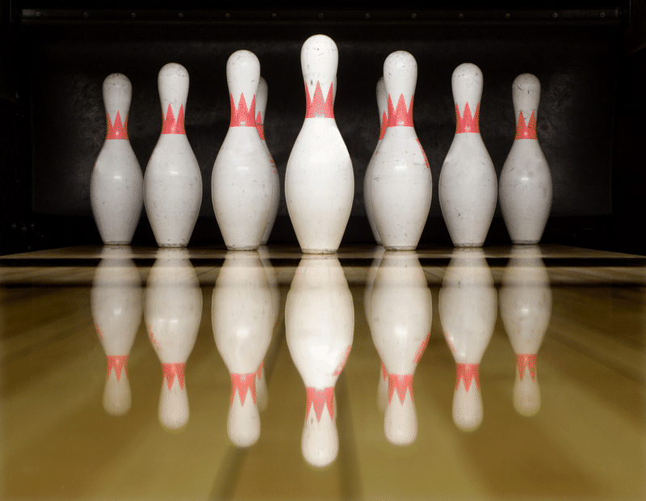

Casey and his friend Max are in charge of researching different bowling alleys to find the best price. They find out that the local bowling alley that is closest to school has a very good offer. This bowling alley charges a flat fee for shoes and then a fee per game.

“I wonder how many games we will have time for,” Casey said to Max.

“I don’t know, but that will impact the cost,” Max responded.

“Let’s figure it out. What is the flat fee for shoes?” Casey asked.

“It is $2.00 and it is $3.00 per game,” Max said.

The two boys took out a piece of paper and began to figure out how much the total would be based on games.

**To solve this problem, you will need to understand functions. A function is when one variable is impacted by another. In this case, there is a fee for shoes and a fee per game. The total cost per student will depend on the number of games. The cost is a function of the games. Learn all that you can and you will be able to figure out the fees at the end of the lesson.**

**_What You Will Learn_**

In this lesson, you will learn the following skills.

* Recognize a relation as a set of ordered pairs that relates an input to an output, and a function as relation for which there is exactly one output for each input, using tables.
* Recognize the domain of a function as the set of all possible input values, the range of a function as the set of all possible output values, and the function rule as an equation assigning each value in the domain to exactly one value in the range.
* Evaluate a function rule by finding outputs for given inputs.
* Write a function rule for given inputs and outputs.
* Write and evaluate function rules to model real – world relations.

**_Teaching Time_**

I. **Recognizing Relations and Functions**

Many numbers have precise and predictable relationships—the number of motorcycles and the number of tires, the numbers of hours you work and the money you get paid, the number of years you go to college and your lifetime earnings.

**In this lesson, we will learn to recognize a** **_relation_** **as a set of ordered pairs that relates an input to an output, and a** **_function_** **as relation for which there is exactly one output for each input, using tables.**

When we work with relations and functions, we work with the world of relationships. We look at how one factor impacts or effects another factor.

**What is a relation?**

**A relation is written as a set of ordered pairs where one value is equal to $x$ and one value is equal to $y$.** What we are really looking at with a relation is the relationship between one factor and another. Let’s think about an example.

A motorcycle has an ordered pair of bikes to tires as (1, 2).

**This means that for every one motorcycle there are two tires. This is a relation.**

Let’s look at another example.

Example

A soup kitchen prepares food for people every day of the month. The supervisor keeps count of the number of people who eat every day. Her data table for the first few days is below.

| **Day of Month** | **\# of Visitors** |
| --- | --- |
| 1   | 82  |
| 2   | 84  |
| 3   | 87  |
| 4   | 80  |
| 5   | 91  |
| 6   | 93  |
| 7   | 104 |
| 8   | 84  |
| 9   | 88  |

**She could rewrite this data as a** **_relation_****, a set of ordered pairs. The first coordinate would be the day of the month and the second coordinate would be the number of visitors.**

**She would show the relation like this {(1, 82), (2, 84), (3, 87), (4, 80), (5, 91), (6, 93), (7, 104), (8, 84), (9, 88)}. Notice that the days of the week form the $x$ value and the number of visitors forms the $y$ value.**

**The braces, {}, indicate that these are all the ordered pairs in the set.**

**There are parts of a relation too. We can have a** **_domain_** **and a** **_range_** **for every relation.** The values in the domain and range help us to understand the relation. **The** **_domain_** **is made up of the values in first column or the $x$ coordinate in the relation. The** **_range_** **is made up of the second column or the $y$ value of the relation.**

**There are different types of relations too. A relation can be a** **_function_** **or not a function.**

**A** **_function_** **is a relation in which each member of the domain is paired with exactly one member of the range.** In other words, a number in the domain cannot have two values for the range. **In the example above, every day of the month has only one number of visitors. Then this relation is a function. When we look at the values in the domain and the range, we can figure out if the relation is a function or not.**

Example

_Is this relation a function?_

$$
\begin{align*}
& 5 \qquad 10\\
& 4 \qquad 11\\
& 3 \qquad 9\\
& 6 \qquad 13\\
& 8 \qquad 4\\
& 7 \qquad 3
\end{align*}
$$

**To figure this out, we have to compare the values from the first column with the values in the second column. For each value of the domain, there is exactly one value in the range. In other words, there aren’t any values that repeat.**

**Therefore, this relation is a function.**

Example

_Is this relation a function?_

$$
\begin{align*}
& 5 \qquad 18\\
& 6 \qquad 19\\
& 12 \quad \ \ 24\\
& 12 \quad \ \ 13
\end{align*}
$$

**This relation is not a function because 12 in the domain is paired with two values in the range.**

**We can figure out if a relation is a function by looking at ordered pairs too.** Look at this example.

Example

_Is this relation a function?_ {(8, -2), (5, -3), (0, -9), (8, -4)}

**To figure this out, we look at the values in the domain. The value 8 has two values in the range that are matched with it, so this relations is not a function.**

**Some real – life examples are considered functions. Think about the motorcycle example and the number of tires. The number of tires is a function of the motorcycle. We can also say that the amount of carbon dioxide gas that can dissolve in a soda beverage depends on the soda’s temperature. The gas is a** **_function_** **of the temperature.**

Let’s continue to look at and understand functions.

II. **Recognize the domain of a function as the set of all possible input values, the range of a function as the set of all possible output values, and the function rule as an equation assigning each value in the domain to exactly one value in the range**

One of the great things about functions is that they can be applied to all kinds of situations. Just remember that in order for a relation to be a function, that the values of the domain need to be assigned to only one value of the range. One way of thinking about functions is through the use of function tables. A function table is an input/output table where the input is the domain and the output is the range. Look at this table below.

| **Input** | **Output** |
| --- | --- |
| 3   | 6   |
| 4   | 8   |
| 5   | 11  |
| 6   | 12  |

Here is function where we have an input and an output. **The input is the domain and the output is the range. If we were going to write this function as ordered pairs, we would use the input for the $x$ value and the output as the $y$ value.**

Let’s write out this relation: (3, 6) (4, 8) (5, 10) (6, 12). There is a relationship between the values of the domain and the values of the range. We can say that the range was created when some operation or operations was completed with the domain value.

**_The output is a result of an operation to the input!_**

**What happened to the input to equal the output?**

If you think about this, you will see that the $x$ value was multiplied by 2 or doubled to equal the $y$ value. We can write this as an equation.

$y = 2x$

This says that the value of $y$ is created whenever the $x$ value is multiplied by 2.

This is called a **_Function Rule_****. It can be written in words or in the form of an equation. The function rule tells you what operation or operations to perform with the input to get the output.**

III. **Evaluate a Function Rule by Finding Outputs for Given Inputs**

Now that you understand what a function rule is, we can use function rules to complete the outputs of different tables. Let’s look at an example.

Example

_Use the function rule $3x$ to evaluate the given inputs and complete each output._

| **Input** | **Output** |
| --- | --- |
| 2   |     |
| 3   |     |
| 4   |     |
| 5   |     |

**Now not all inputs will be this simple, but it will give you some practice applying a function rule. We know that the function rule is $3x$, so we can take each value from the input column and multiply it by 3. This will give us the correct value for the output table.**

| **Input** | **Output** |
| --- | --- |
| **2** | **6** |
| **3** | **9** |
| **4** | **12** |
| **5** | **15** |

**You can see that the function rule was applied to each input value and the resulting output values complete the table.** Let’s look at another example.

Example

_Use the function rule $2x + 1$ to evaluate each input value. Complete the given table._

| **Input** | **Output** |
| --- | --- |
| $-2$ |     |
| \-1 |     |
| 0   |     |
| 1   |     |
| 2   |     |

**This table has negative and positive input values, but we will follow the same procedure. Simply substitute each $x$ value into the function rule and evaluate for the output value.**

$$
\begin{align*}
2(-2)+1 &=-4+1=-3\\
2(-1)+1 &=-2+1=-1\\
2(0)+1 &=0+1=1\\
2(1)+1 &=2+1=3\\
2(2)+1 &=4+1=5
\end{align*}
$$

**Now we can substitute those values into the output column of our function.**

| **Input** | **Output** |
| --- | --- |
| $-2$ | **\-3** |
| \-1 | **\-1** |
| 0   | **0** |
| 1   | **1** |
| 2   | **3** |

**This is the answer and our work is complete.**

Remember that we call this work evaluating a function rule.

IV. **Write a Function Rule for Given Input and Outputs**

In the last section, you used function rules to evaluate function tables and find outputs. We can also use input/output tables to help us to write function rules. When we look at the input and decipher what happened to it to create the output, then we can write a function rule based on our discoveries. This is like being a detective! You will have to use what you have learned and look for clues.

Example

$** |")
| --- | --- |
| 0   | 5   |
| 3   | 8   |
| 6   | 11  |
| 9   | 14  |

**The first thing to notice is that the words input and output have been replaced by the $x$ and the $f(x)$. This means that we are using function notation to say that $x$ is the input and that the output is a function of $x$. That is what the $f(x)$ means. Function notation will affect how we write our rule too, but let’s look at that in a minute.**

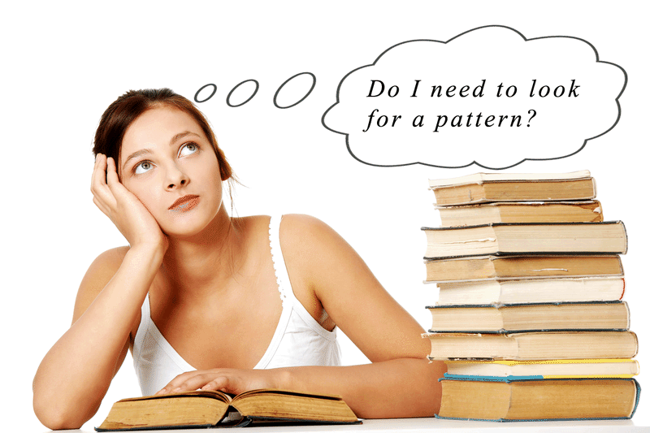

$f(x) = x + 5$

**This is our answer.**

Example

_Use function notation to write a function rule for the given table._

| **$x$** | **$f(x)$** |
| --- | --- |
| 12  | 6   |
| 9   | 4.5 |
| 7   | 3.5 |
| 4   | 2   |

**What pattern do you notice?** Each value of the input has been divided in half. We can write this function rule in two ways.

$$
\begin{align*}
f(x)&= \frac{1}{2}x \\
or \ f(x)&= \frac{x}{2}
\end{align*}
$$

**Both of these will work as a correct answer.**

V. **Write and Evaluate Function Rules to Model Real – World Relations**

Functions like these are seen in countless real-life situations. You have used many yourself without even thinking about it. Let’s look at how functions apply to real world situations.

Example

You are going to order a bunch of churros from a vender for your family. Each one costs $1.50. How much will they cost if you buy 6 or 8 or 10? What’s the function rule?

**First, we can take the given information to write the rule.**

$p(c)=1.50c$ where $p$ is total price and $c$ is the number of churros.

**Next, we can we can substitute different values into the function rule to figure out the cost for 6, 8 or 10 churros.**

$$
\begin{align*}
& p(c) =1.50c && p(c)=1.50c && p(c) =1.50c\\
& p(6) =1.50 \cdot 6 && p(8)=1.50 \cdot 8 && p(10)=1.50 \cdot 10\\
& p(6) =9 && p(8) =12 && p(10)=15\\
& \$ 9 \text{ for } 6 \text{ churrors} && \$ 12 \text{ for } 8 \text{ churros} && \$ 15 \text{ for } 10 \text{ churros}
\end{align*}
$$

**Based on the number of churros, we can figure out the differences in cost. This is our answer.**

**Now let’s go back to the problem from the introduction and look at applying what we have learned about relations and functions to our work.**

Real-Life Example Completed
---------------------------

**_The Bowling Field Trip_**

**Here is the original problem once again. To finish this problem, write an equation that represents the scenario. Then create a table of values to show the varying costs.**

The seventh grade class is planning a field trip to a bowling alley. Casey and his friend Max are in charge of researching different bowling alleys to find the best price. They find out that the local bowling alley that is closest to school has a very good offer. This bowling alley charges a flat fee for shoes and then a fee per game.

“I wonder how many games we will have time for,” Casey said to Max.

“I don’t know, but that will impact the cost,” Max responded.

“Let’s figure it out. What is the flat fee for shoes?” Casey asked.

“It is $2.00 and it is $3.00 per game,” Max said.

The two boys took out a piece of paper and began to figure out how much the total would be based on games.

**_Solution to Real – Life Example_**

**The first thing to do is to write an equation that represents the given information. We know that each game is $3.00 and the flat rate for shoes is $2.00. The varying value is the cost and that is impacted by the number of games played. The number of games played is our variable.**

$C(g) = 3g + 2$

**This equation means that $c$ the cost is a function of the number of games plus the $2 shoe fee.**

| **Games Played** | **Cost ($)** |
| --- | --- |
| **2** | **8** |
| **4** | **14** |
| **5** | **17** |
| **6** | **20** |

**The data show that when the number of games increases by 2, the cost increases by $6. Based on the number of games played, the cost could be anywhere from $8 to $20.00 although it is unlikely that any student would have time for 6 games.**

Vocabulary
----------

Here are the vocabulary words that are found in this lesson.

__Relation__

a set of ordered pairs.

__Domain__

the $x$ value in a table or function.

__Range__

the $y$ value in a table or function.

__Function__

Each value in the domain is connected to only one value in the range.

__Function Rule__

the operation or operations performed on the input value which then equals the output value.

__Input__

the $x$ value or the domain of a function.

__Output__

the $y$ value or the range of a function.

Time to Practice
----------------

Directions: Are the relations functions? If not, explain why.

1.  {(4, 7), (8, 11), (4, 9), (8, 13)}
2.  {(-3, 0), (-2, 0), (-1, 0), (0, 0), (1, 1)}
3.  {(6, 25), (12, 35), (18, 45), (24, 55)}
4.  {(2, 4), (3, 5) (2, 6), (7, 9)}
5.  The amount of bananas you buy at a store for $.85 per pound.
6.  The amount of carrots that you buy at a store for $.29 per pound.
7.  The steady price increase of a bus ticket over time.

Directions: Answer each question about functions.

8.  A pastry chef needs to purchase enough dough for her cookies. She buys one pound of dough for every twenty cookies she is going to make. She uses the function $d(c)=\frac{c}{20}$ where $c$ is the number of cookies and $d$ is the pounds of dough she should buy. Identify which variable is the domain and which is the range.
9.  Evaluate the function $f(x)=2x+7$ when the domain is {-3, -1, 1, 3}.
10. Evaluate the function $f(x)=\frac{2}{5}x-6$ when the domain is {-10, -5, 0, 5, 10}.
11. Evaluate the function $f(x)=3x-1$ when the domain is {5, 6, 7, 8, 9}.
12. Evaluate the function $f(x)=x-9$ when the domain is {1, 2, 3, 4, 5}.
13. You can convert Celsius degrees to Fahrenheit degrees with the function $F=\frac{9}{5}C+32$. Convert $7^{\circ} C, 14^{\circ} C,$ and $25^{\circ}C$ to degrees Fahrenheit.

Directions: Write function rules.

14. Write a function rule for the following data.

| **$x$** | **$f(x)$** |
| --- | --- |
| 9   | 27  |
| 11  | 33  |
| 15  | 45  |
| 16  | 48  |

15. Write a function rule for the following data:

| **$x$** | **$f(x)$** |
| --- | --- |
| $-2$ | \-6 |
| 0   | 2   |
| 2   | 10  |
| 4   | 18  |

16. Write a function rule for the following data:

| **$x$** | **$f(x)$** |
| --- | --- |
| 0   | 0   |
| 1   | 2   |
| 4   | 8   |
| 5   | 10  |

17. Write a function rule for the following table.

| **$x$** | **$f(x)$** |
| --- | --- |
| 1   | 0   |
| 2   | 2   |
| 4   | 6   |
| 8   | 14  |

18. Write a function rule for the following table.

| **$x$** | **$f(x)$** |
| --- | --- |
| 2   | 1   |
| 4   | 2   |
| 8   | 4   |
| 10  | 5   |
| 18  | 9   |

19. Write a function rule for each table.

| **$x$** | **$f(x)$** |
| --- | --- |
| 6   | 3   |
| 9   | 3   |
| 15  | 5   |
| 21  | 7   |
| 30  | 10  |

Directions: Solve the following problem.

20. Sandwich cost $3.45 each. Write a function rule for the cost, $c$, for a number of sandwiches, $s$.
21. Now, find the cost of 3, 6, and 9 sandwiches.

</article>

### 9.2 Linear Equations in Two Variables

<article>

Introduction
------------

**_The Omni Theater_**

The cost of a ticket is $5.00, but there is a $2.00 service fee per ticket.

“That is a lot of money,” Tasha says.

“Well, it depends on how many students actually go,” Uniqua says.

“Let’s figure it out. There are 22 students in our class and we could have anywhere from 22 to 18 students go based on the number of students absent. Now we need to do the math,” Tasha says taking out a piece of paper.

**Here we are working on functions again. To figure out the range of costs with this trip, you will need to write an equation and create a table to show how the cost changes based on the number of students who attend the trip. By the end of this lesson, you will know how to go about solving this problem.**

**_What You Will Learn_**

By the end of this lesson you will learn how to complete the following skills.

* Recognize a solution of an equation in two variables as an ordered pair of values which make the equation true.
* Rewrite equations in two variables in function form and find solutions by making a table.
* Use a table of solutions to graph equations in two variables, recognizing an equation whose graph is a straight line is called a linear equation, for which each variable only occurs to the first power.
* Recognize equations for graphs of vertical and horizontal lines.

**_Teaching Time_**

I. **Recognize a Solution of an Equation in Two Variables as an Ordered Pair of Values which Make the Equation True**

In the last section, we wrote function rules for function tables. When we did this work, we used a table of values where the $x$ value or the domain was given and then we used an equation or rule to figure out the $y$ value or the domain. In this section, we are going to start with equations or rules and then see how these equations can help us to figure out ordered pairs.

Let’s start by thinking about the following equation.

$3+2=5$

This is a true equation. You probably remember equations like this one from back in your elementary school days. However, we can look at this equation in a new way. Here we have the statement that three plus two is equal to five. Well, there are other values that could also be added together to equal 5. We could add positive and negative numbers to equal five. Therefore, there are many possible values that could be added together to equal five. Let’s change this equation to one where that is clear.

$x+y=5$

Now we have used the values $x$ and $y$ to show that we have two different values that can be added together to equal $y$.

**Think about ordered pairs. An** **_ordered pair_** **has an $x$ and a $y$ value.** If we were to find values that would make this a true statement, then we could also say that we had ordered pairs that would make this a true statement.

**One answer for this equation is the ordered pair (2, 3) where the $x$ value is 2 and the $y$ value is 3. The sum is equal to five.**

Let’s look at another example.

**Example**

Find three solutions to the equation $2x+y=12$ and write them in ordered pairs.

$2 \cdot 2+8=12$ so the ordered pair is (2, 8).

$2 \cdot 3+6=12$ so the ordered pair is (3, 6).

$2 \cdot -5+22=12$ so the ordered pair is (-5, 22).

**When an equation is written in a form where $x$ and $y$ are added together to equal a third value, we call that** **_standard form_****. We can say that standard form is $Ax+By=C$.**

II. **Rewrite Equations in Two Variables in Function Form and Find Solutions by Making a Table**

You just learned how to identify an equation in standard form. We can also write equations in **_function form_**. **Function form is when the $y$ value is equal to the rest of the equation.**

$y=2x+1$

This is an equation in function form. We can see that the $y$ value is a function of $2x$ plus one. This means that the value of $y$ will change based on what the $x$ value is. We can also use $f(x)$ to show that the $y$ value is a function of the rest of the equation. The $f(x)$ is used to substitute for $y$.

$ is also dependent on the rest of the equation. The $f(x)$ is the same as $y$.**")

Let’s look at an example.

Example

$y=3x+1$

To work with this equation, we have to create a table of values. Then we will know what the value of $y$ is based on the values that we substitute for $x$.

| **$x$** | **$y$** |
| --- | --- |
| 1   | 4   |
| 2   | 7   |
| 3   | 10  |
| 4   | 13  |
| 5   | 16  |

Now we have the values for $x$ and $y$. **You can also notice that since we have these two values, we also have a set of ordered pairs that have been created in a table form.**

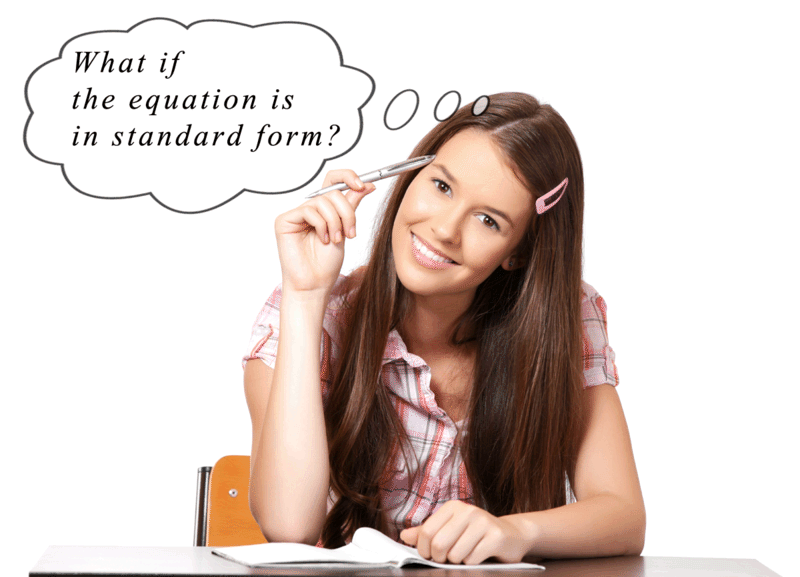

Let’s look at an example.

Example

$4x-y=-1$

Here we have an equation in standard form. We will need to rewrite this equation into function form. To do this, we will move the negative one with the $4x$ and the $-y$ to the opposite side of the equals. We can do this by using **_inverse operations_**. **Remember that an inverse operation is an opposite operation.**

$$
\begin{align*}
4x-y+y &=-1+y \\
4x &=-1+y \\
4x+1 &=y \ or \ y=4x+1
\end{align*}
$$

**Once we have an equation written in function form, we can use a table of values to figure out a set of ordered pairs.**

| **$x$** | **$y$** |
| --- | --- |
| 0   | 1   |
| 1   | 5   |
| 2   | 9   |
| 3   | 13  |

**Now we have a set of ordered pairs for the equation $y=4x+1$.**

III. **Use a Table of Solutions to Graph Equations in Two Variables, Recognizing an Equation whose Graph is a Straight Line is Called a Linear Equation, for which Each Variable Only Occurs to the First Power**

Now we have looked at equations in standard form. We have rewritten these equations into function form. Then we have created a table of values for an equation which makes this equation true. Our next step is to graph the ordered pairs from a table of values. We graph these values on the coordinate plane. Let’s look at the last example.

Example

$y=4x+1$

| **$x$** | **$y$** |
| --- | --- |
| 0   | 1   |
| 1   | 5   |
| 2   | 9   |
| 3   | 13  |

**Now we have an equation in function form. We have a table of values that makes this equation true, so we can look at graphing this function.**

First, let’s write out the ordered pairs from the table. Notice that these values are all positive, however, you can have positive and negative values that make an equation true.

(0, 1)

(1, 5)

(2, 9)

(3, 13)

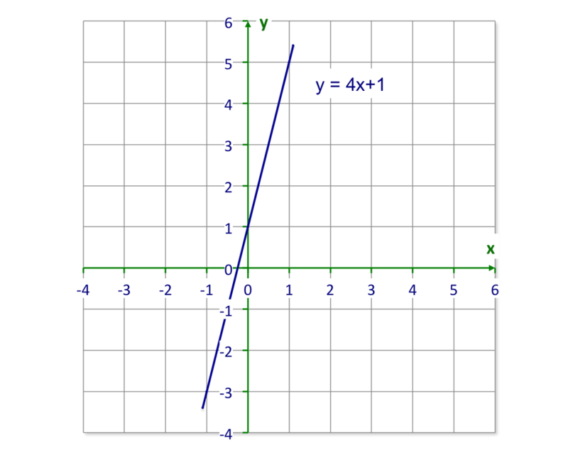

Let’s look at another example.

Example

Graph the line $y=2x-1$. Tell whether or not this equation is a linear equation.

**First, notice that this equation is already in function form, so we can create a table of values. This table will give us our ordered pairs for graphing.**

| **$x$** | **$y$** |
| --- | --- |
| **0** | **\-1** |
| **1** | **1** |
| **2** | **3** |
| **3** | **5** |

**Here are the ordered pairs.**

(0, -1)

(1, 1)

(2, 3)

(3, 5)

**Now let’s graph the equation.**

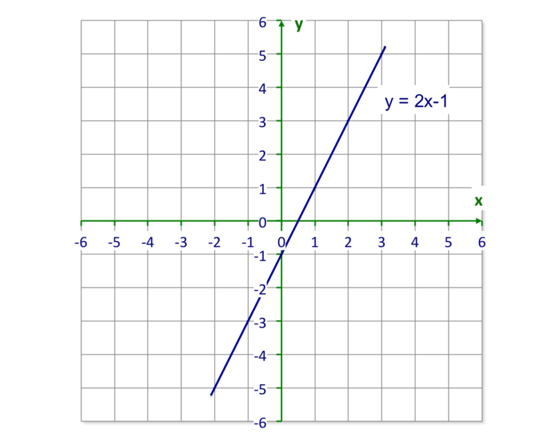

IV. **Recognize Equations for Graphs of Vertical and Horizontal Lines**

Now you know how to graph a linear equation and how to identify this equation based on the graph. What about an equation like $y=5$ or $x=-3?$ These are equations we don’t need to make tables. If $y$ is equal to five, then we could say that $x$ is equal to all of the other values.

Now let’s look at the graph of this equation.

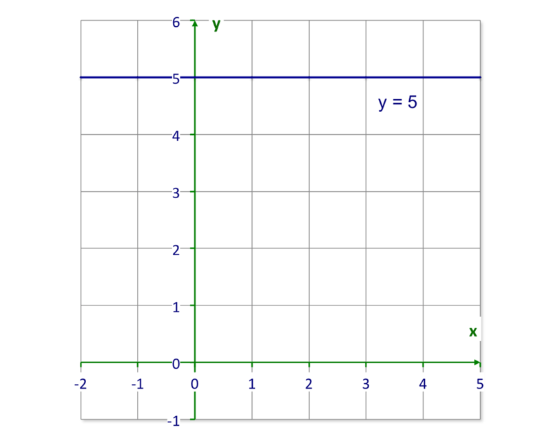

Next, we can look at the equation $x= -3$. Now we can graph this line. If we know that the $x$ value is -3, then we can say that all of the other $y$ values are all of the other numbers. Let’s take a look at this graph.

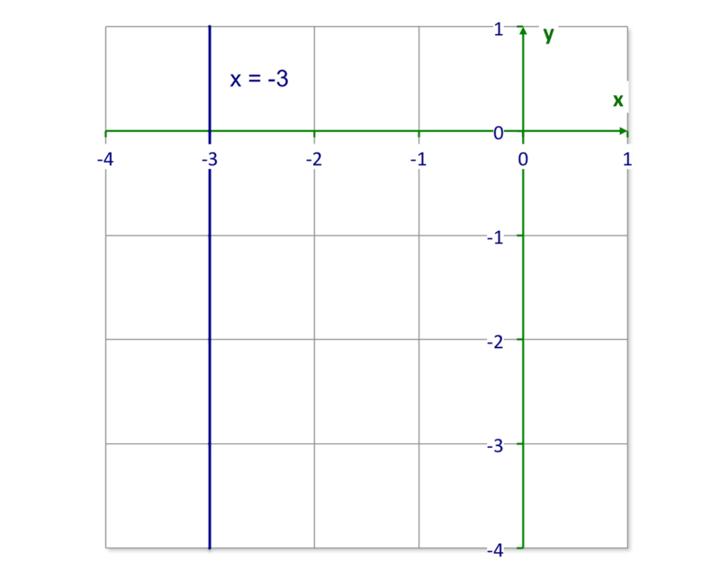

**We can say that when $x$ is equal to one value, then we have a vertical line and when $y$ is equal to one value that we have a horizontal line.**

Real-Life Example Completed
---------------------------

**_The Omni Theater_**

**Here is the original problem once again. Reread it and then write an equation and a table of values to show the varying costs.**

While Max and Casey are figuring out the bowling alley information, Tasha and Uniqua are busy coming up with an alternative field trip. They think that the class should go to the Omni Theater instead to see a film on the rainforest. By calling the Science Museum where the theater is located, they discover the following information.

The cost of a ticket is $5.00, but there is a $2.00 service fee per ticket.

“That is a lot of money,” Tasha says.

“Well, it depends on how many students actually go,” Uniqua says.

“Let’s figure it out. There are 22 students in our class and we could have anywhere from 22 to 18 students go based on the number of students absent. Now we need to do the math,” Tasha says taking out a piece of paper.

**_Solution to Real – Life Example_**

**The problem can first be solved by writing an equation. To do this, we need to look at the given information.**

**Total cost $= y$**

**_$x =$ number of students and this can vary_**

**$2.00 is the service fee**

**$5.00 per ticket**

**$y=5x+2$**

**Now we can create our table of values based on the range of students in attendance. Uniqua and Tasha think that there will be anywhere from 22 to 18 students on the trip.**

| **$x$** | **$y$** |
| --- | --- |
| **22** | **$112** |
| **21** | **$107** |
| **20** | **$102** |
| **19** | **$97** |
| **18** | **$92** |

Vocabulary
----------

Here are the vocabulary words that are found in this lesson.

__Ordered pair__

the $x$ and $y$ values that can be found in a table or used to graph points or a line on the coordinate plane.

__Standard form__

the form of an equation $Ax+By=C$

__Function form__

the form of an equation $y=mx+b$

__Linear Equation__

the graph of a linear equation forms a straight line.

Time to Practice
----------------

Directions: Find 4 solutions to the function $3x+y=24$. Write your answers as ordered pairs.

Directions: Find 4 solutions to the function $2x-y=9$. Write your answers are ordered pairs.

Directions: Write each equation in standard form.

9.  $y=2x+3$
10. $y=-4x+6$
11. $y=-2x-4$
12. $y=-5x+4$
13. $y=-3x-2$
14. $y=-4x+6$

Directions: Create a table of values for each equation and then graph it on the coordinate plane.

15. $y=2x+1$
16. $y=3x+1$
17. $y=4x$
18. $y= -2x+2$
19. $y=2x-2$
20. $y=x-1$
21. $x=4$
22. $y= -2$

</article>

### 9.3 Using Intercepts

<article>

Introduction
------------

**_Comparing Field Trips_**

“I think we should go to the Omni Theater because it is more educational,” Tasha stated strongly.

“This trip doesn’t have to be educational we can just have a fun field trip,” Casey said.

Arguments began between the students. Mr. Thomas whistled and all were quiet.

“Is there anything that the two have in common that we can think of?” Mr. Thomas asked.

“You mean money?” Casey asked.

“Yes. Is there a common fee between them both?”

The students began to think about this. Intercepts are places where two or more equations meet. In the case of the students, they wrote two equations one for each field trip. Is there a common cost in each?

**Use this lesson to learn about intercepts and then return to this problem and Mr. Thomas’ question at the end of the lesson.**

**_What You Will Learn_**

By the end of this lesson, you will understand how to complete the following skills.

* Find an $x$\- and $y$\-intercept of the graphs of a linear equation.
* Use intercepts to graph a linear equation.
* Interpret intercepts of the graph of a linear equation.
* Solve real – world problems using intercepts of lines.

**_Teaching Time_**

I. **Find an $\underline{x}$\- and $\underline{y}$\- Intercept of the Graphs of a Linear Equation**

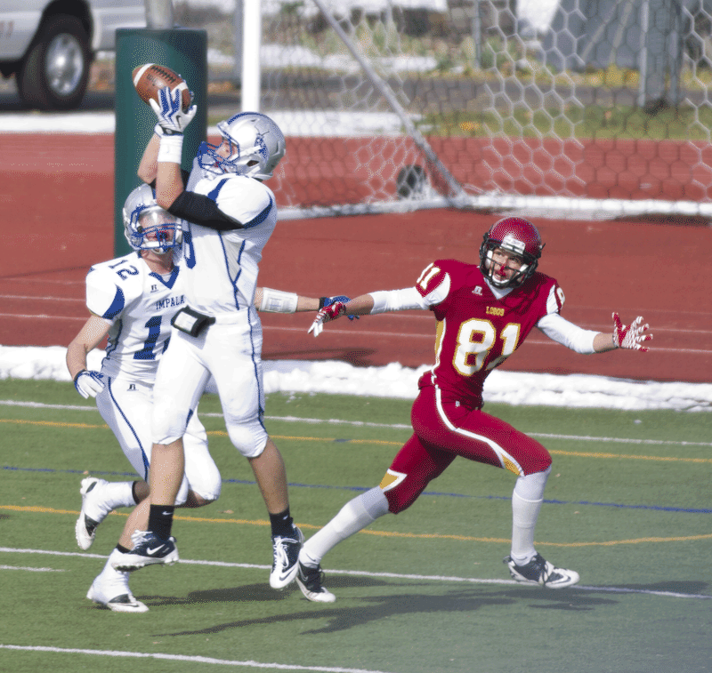

Consider the graph below. As you know, the $x$\-axis is horizontal and the $y$\-axis is vertical. Do you see that the graph crosses, or intercepts, both the $x$\- and $y$\-axes?

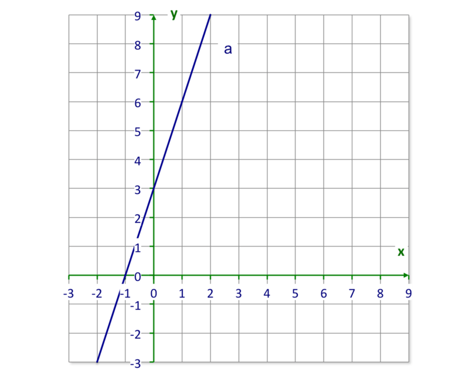

**The line crosses the $x$ – axis at -1.**

**The line crosses the $y$ – axis at 3.**

**These are the two intercepts.**

**We can figure out the two intercepts of any linear equation. All you have to do is to look for the place where the line crosses the two axis’.**

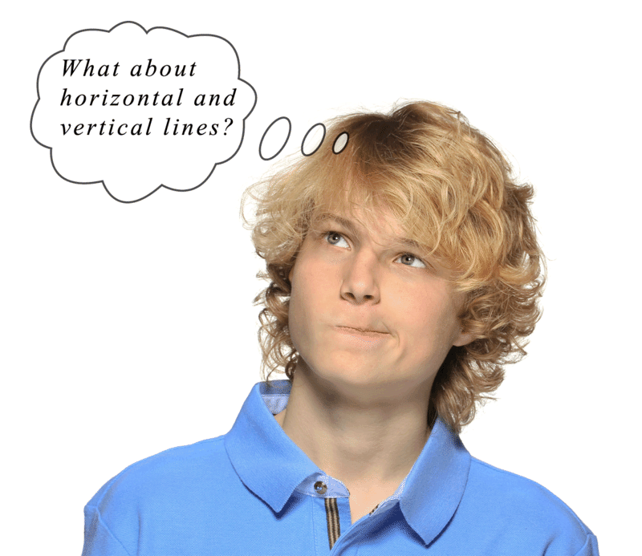

")

\[Figure 6\]

**In these two graphs, $x$ is equal to 4 and $y$ is equal to -1. You can see that each of these special types of graphs only has one intercept.**

II. **Use Intercepts to Graph a Linear Equation**

Now that you know how to identify an $x$ and a $y$\-intercept by looking at a graph, you can learn how to find the two intercepts in an equation and then use this information to graph the line. Think about it, if you know where the line crosses the $x$\-axis and where the line crosses the $y$ – axis, then you can easily graph the line. Let’s look at an example.

Example

Find the $x$\- and $y$\-intercepts and then graph the equation $2x+3y=6$.

**First, notice that this is an equation in standard form. We will need to find the $x$ and $y$ – intercepts.**

**To find the $x$\-intercept, set $y$ equal to zero.** Think about this and it makes perfect sense. If you have an intercept with the $x$ – axis, then it makes sense that the $y$ value is 0.

$$
\begin{align*}
2x+3y&=6\\
2x+3 \cdot 0&=6\\
2x&=6\\
x&=3
\end{align*}
$$

**We now have the ordered pair (3, 0) or the $x$\-intercept 3.**

**To find the $y$\-intercept set $x$ equal to zero.** Think about this and it makes perfect sense. If you have an intercept with the $y$ – axis, then it makes sense that the $x$ value is 0.

$$
\begin{align*}
2x+3y&=6\\
2 \cdot 0+3y&=6\\
3&=6\\
y&=2
\end{align*}
$$

**We now have the ordered pair (0, 2) or the $y$\-intercept 2.**

**Now we can use the intercepts to graph this line.**

")

\[Figure 8\]

**_Write down how you can find the $x$ and $y$ – intercepts in your notebook._**

III. **Interpret Intercepts of the Graph of a Linear Equation**

Now we can find the $x$\- and $y$\-intercepts of a graph by seeing where the graph crosses the axes. We can also graph an equation by calculating its $x$\- and $y$\-intercepts and plotting them on a coordinate plane. But let’s understand the significance of the $x$\- and $y$\-intercepts. Recall that the $y$ value of the $x$\-intercept is always zero and the $x$ value of the $y$\-intercept is always zero. This is useful in understanding equations.

Consider a graph whose $x$\-intercept is 5. Not only does this indicate to us that the graph will cross the $x$\-axis at 5, but it necessitates that when $x$ is 5, the $y$ value is zero. Likewise, for whatever value the $y$\-intercept has, the $x$ value must be zero.

Example

Look at the following graph and interpret the intercepts of the graph.

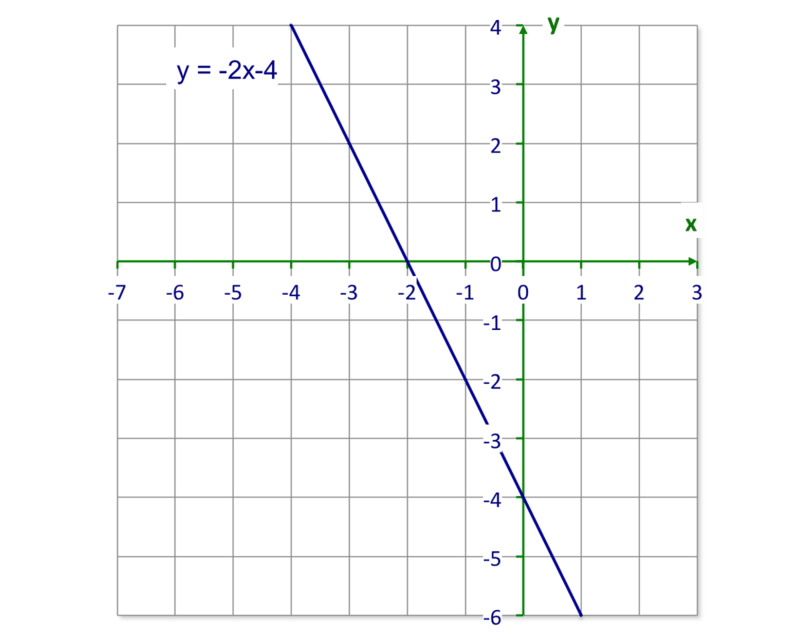

**Notice that the coordinates of the $y$ – intercept is (0, -4). We can see that the -4 can also be found in the equation itself. Notice how it is the value that is not connected to the $x$ variable. When looking at an equation and a graph, this is one way to determine the $y$ – intercept.**

**Now we can look at the value of the $x$\-intercept. In this case, it is (-2, 0). Don’t let this fool you, the $y$ – intercept can be found in the equation, but the $x$ – intercept is determined by the steepness of the line. Therefore, we will have to use the equation and a table of values to determine the $x$ – intercept. However, you can still determine it when looking at the graph of a line.**

IV. **Solve Real – World Problems Using Intercepts of Lines**

Interpreting the $x$\- and $y$\-intercepts is useful in real-world situations. We can figure out intercepts by looking at all kinds of different problems. Let’s look at an example.

Martha likes to go to the park every day but it’s 6 o’clock and her parents are waiting for her at home. She has her bike but she sometimes walks it. She walks at 3mph and she rides her bike at 9mph. If she is 6 miles from home, how long might her parents have to wait?

**$w=$ time (in hours) walking and $b=$ time(in hours) on her bike**

$$
\begin{align*}
3w+9b &=6\\
3 \cdot 0+9b &=6\\
9b &=6\\
b &=\frac{2}{3}
\end{align*}
$$

**If she only rides her bike, it will take her $\frac{2}{3}$ or 40 minutes.**

$$
\begin{align*}
3 \cdot w + 9 \cdot 0 &=6\\
3w &=6\\
w &=2
\end{align*}
$$

**If she only walks, it will take her 2 hours! Hope she rides her bike.**

**Now let’s go back and look at the problem from the introduction.**

Real-Life Example Completed
---------------------------

**_Comparing Field Trips_**

**Here is the problem from the introduction. Use what you have learned to determine the intercept.**

The students have completed all of their research and now it is time for them to figure out which field trip to attend. Mr. Thomas scheduled a meeting during homeroom when both teams would have the opportunity to present their findings. Both did this and then the students began to debate the merits of each trip.

“I think we should go to the Omni Theater because it is more educational,” Tasha stated strongly.

“This trip doesn’t have to be educational we can just have a fun field trip,” Casey said.

Arguments began between the students. Mr. Thomas whistled and all were quiet.

“Is there anything that the two have in common that we can think of?” Mr. Thomas asked.

“You mean money?” Casey asked.

“Yes. Is there a common fee between them both?”

The students began to think about this. Intercepts are places where two or more equations meet. In the case of the students, they wrote two equations one for each field trip. Is there a common cost in each?

**To determine the intercept, we must first begin with the two equations.**

**The bowling trip used the equation $y = 3g + 2$.**

**The Omni trip used the equation $y=5x+2$**

**You might notice right away that the 2 is common in both. We can check and see if this is indeed the intercept by graphing both equations. Here is the graph.**

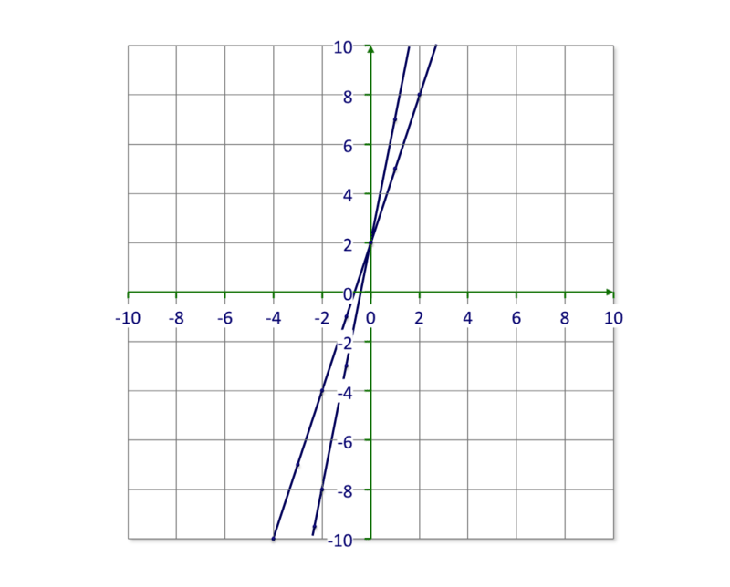

Vocabulary
----------

Here are the vocabulary words that are found in this lesson.

__$x$ – intercept__

the point where a line crosses the $x$ – axis. It will always have the coordinates $(x, 0)$.

__$y$ – intercept__

the point where a line crosses the $y$ – axis. It will always have the coordinates $(y, 0)$.

Time to Practice
----------------

Directions: Determine the $x$ and $y$ – intercepts of each equation. There will be two answers for each equation.

1.  $3x+4y=12$
2.  $6x + 2y = 12$
3.  $4x + 5y = 20$
4.  $4x + 2y = 8$
5.  $3x + 5y = 15$
6.  $-2x + 3y = -6$
7.  $-3x + y = 9$
8.  $-2x - 2y = 6$
9.  $7x + 3y = 21$
10. $2x + 9y = 36$

Directions: Look at each graph and identify the $x$ and $y$ – intercept of each equation. Each graph will have two answers.

11. 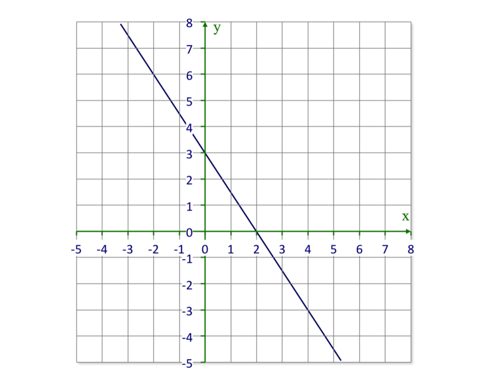
    
    \[Figure 13\]
    
12. 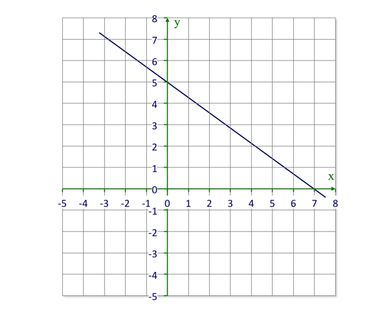
    
    \[Figure 14\]
    
13. 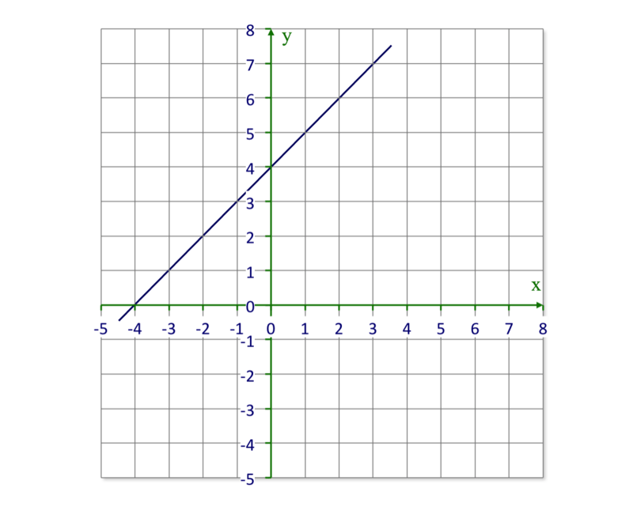
    
    \[Figure 15\]
    
14. 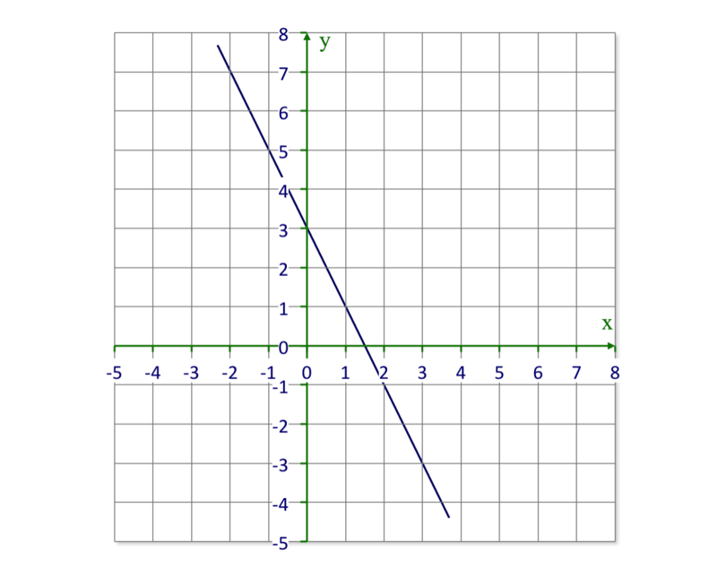
    
    \[Figure 16\]
    
15. 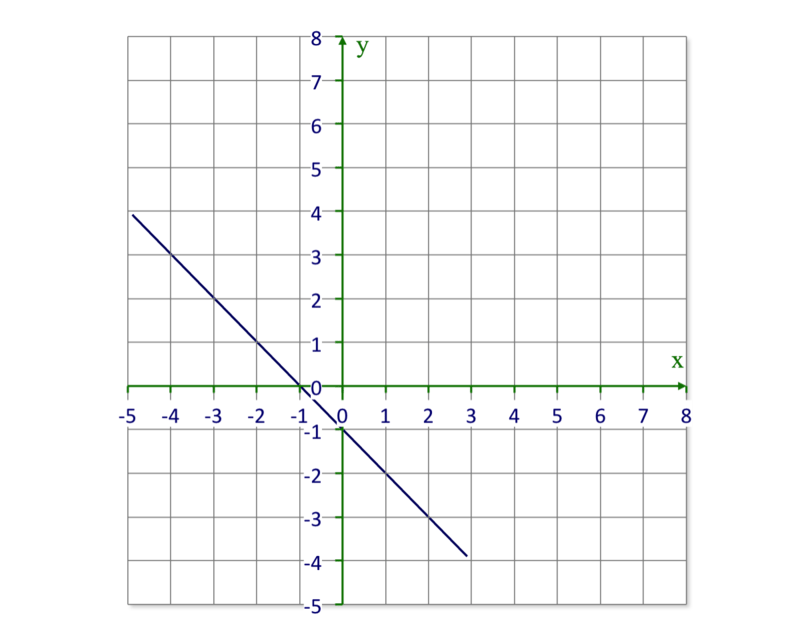
    
    \[Figure 17\]
    
16. 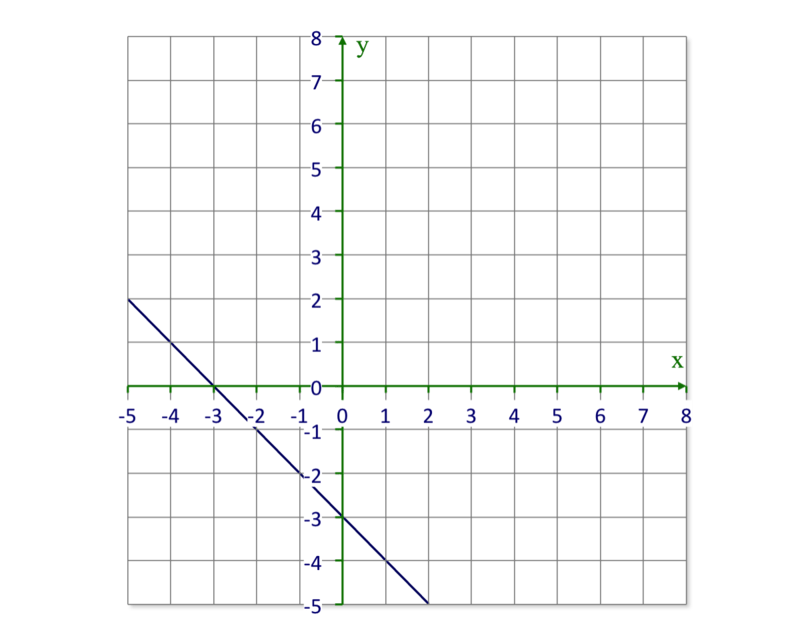
    
    \[Figure 18\]
    

Directions: Solve the following problems.

17. Tickets to a hockey game cost $60 for the front section and $30 for the rear. A manager wants to take his employees but cannot spend more than $300. How many employees can he take to the front or rear sections?
18. The ASB at a school will be purchasing drinks that they will sell at a school dance. They plan to have 200 drinks available. Bottled water costs $.25 per bottle and soda costs $.35 per can. What is the minimum and maximum that they might spend on the drinks?

</article>

### 9.4 The Slope of a Line

<article>

Introduction
------------

**_Rainforest Transportation_**

When they returned to school, Mr. Thomas had them talk about different parts that had interested them.

“I was fascinated on the bus ride that the scientists took to get to the rainforest. It was amazing to me that the bus could travel over all of those bumpy roads and not have an accident,” Mark commented.

“Yes, if you think about it, the bus ride was pretty cool to see from the Omni point of view. I mean I felt like I was going to fall over the edge some of the time,” Karen added.

Others smiled as well. Mr. Thomas seizing the opportunity wrote the following problem on the board.

A bus leaves Boston traveling at a constant speed of 60mph. You can make a table showing the distance, $d$, in miles that the train has traveled after $h$ hours.

**This is your task. After learning about slope, you will learn about direct and indirect variation. These concepts will all help you with Mr. Thomas’ problem.**

**_What You Will Learn_**

By the end of this lesson, you will be able to complete the following skills.

* Find the slope of a line passing through given points.
* Recognize and interpret positive, negative and undefined slopes.
* Compare and interpret relative slopes of given lines.
* Identify and distinguish between direct and inverse variation.

**_Teaching Time_**

I. **Find the Slope of a Line Passing Through Given Points**

**When we have a line that has been graphed on the coordinate plane, we can calculate the steepness of the line. In mathematics, we call this steepness the** **_slope of the line._** **The slope of the line is how steep the line is.**

Let’s look at an example.

Example

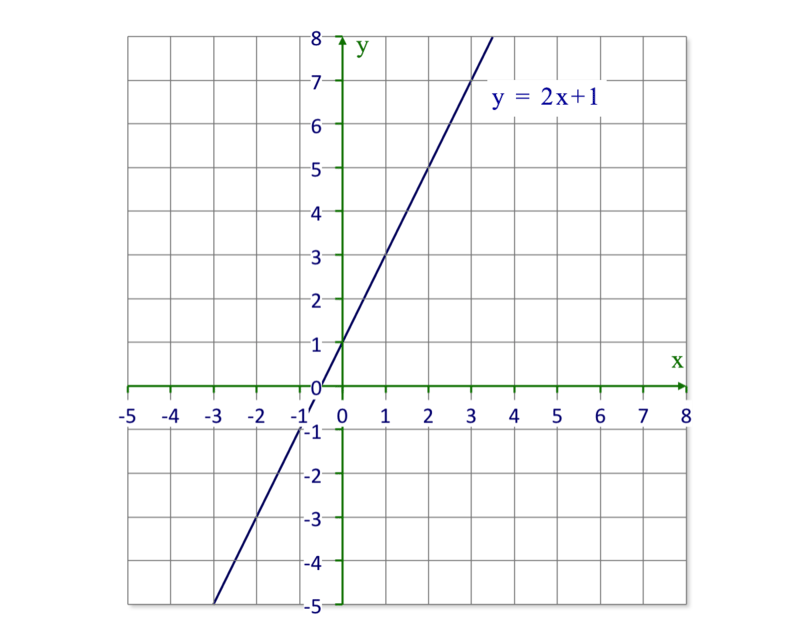

$Slope=\frac{rise}{run}$

Here is a graph where the slope is highlighted.

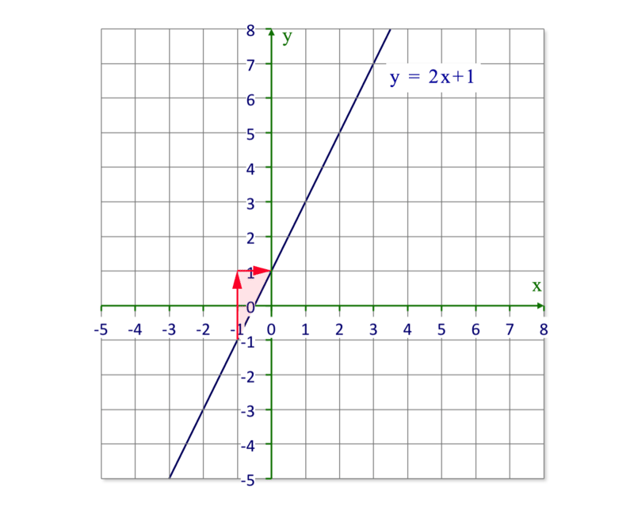

$Slope=\frac{2}{1}=2$

**The slope of this line is 2.**

**Sometimes, you won’t have a graph to look at. We can also calculate the slope of a line when we have been given two sets of ordered pairs. Then we can use a formula to calculate the slope of the line.**

$Slope=\frac{y_2-y_1}{x_2-x_1}$

Example

Calculate the slope of a line that passes through the points (0, -2) and (1, 2).

**To start, we substitute the values of these coordinates into our formula. It doesn’t matter which value you use as $y_2$ or $y_1$ the key is that you are consistent in your choices. Here is how these values can be substituted into the formula.**

$$
\begin{align*}
Slope &=\frac{2--2}{1-0}\\
Slope &=4
\end{align*}
$$

**The slope of this line is 4.**

**_Note: Sometimes, you will also see the letter “$m$” used in place of the word “slope”._**

II. **Recognize and Interpret Positive, Negative, Zero and Undefined Slopes**

In the last section, you began to learn how to figure out the slope of a line. The two slopes in the last section were both positive slopes. This means that when we did our calculations, that the slope of the line was positive. In looking at the graph, you can also see that the line went up from the left corner of the graph to the right. Look at this graph of a positive slope.

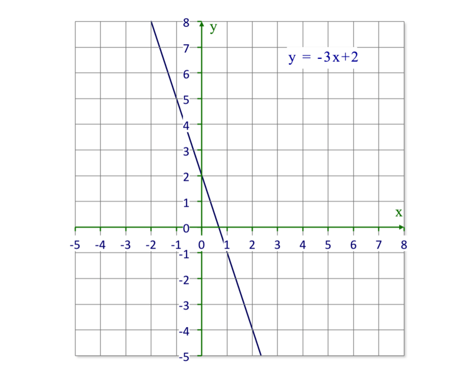

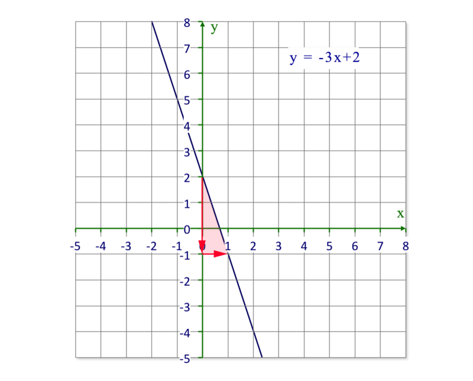

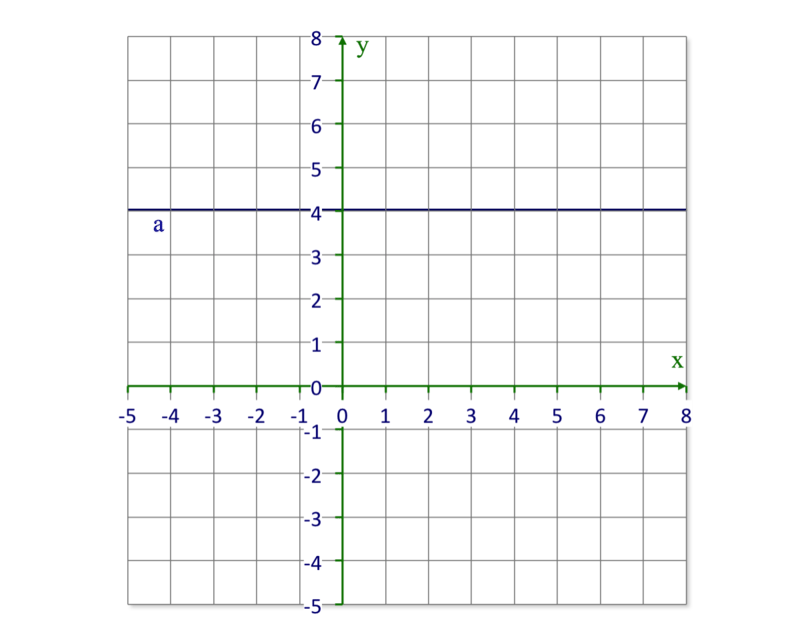

**What about a vertical line?** Let’s look at an example.

Example

Now use the slope formula on the line that goes through the points (2, 3) and (2, -3).

${x_1}=2,{y_1}=3,{x_2}=2,{y_2}=-3$

$$
\begin{align*}
m &=\frac{{y_2}-{y_1}}{{x_2}-{x_1}}\\
m &=\frac{-3-3}{2-2}\\
m &=\frac{-6}{0}
\end{align*}
$$

Slope here is undefined since it has a denominator of zero, $m$ is undefined. Graph this line.

This line is vertical!

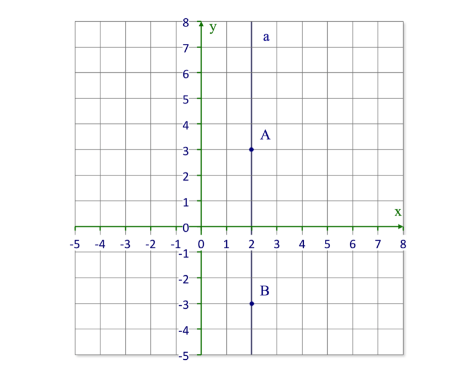

III. **Compare and Interpret Relative Slopes of Given Lines**

**We’ve seen four types of slopes.**

| Positive slopes  Rise up and run right | 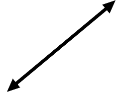  \[Figure 12. | Negative slopes  Rise up and run left | 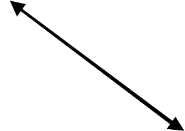  \[Figure 13. |
| --- | --- | --- | --- |
| Zero slopes  Horizontal lines |   \[Figure 14. | Undefined slopes  Vertical lines |   \[Figure 15. |

But we have yet to compare their steepness. If you consider the ski slopes, you know that some slopes are steeper than others. In the graph below, you can also see that some lines are steeper, or have a greater slope, than others.

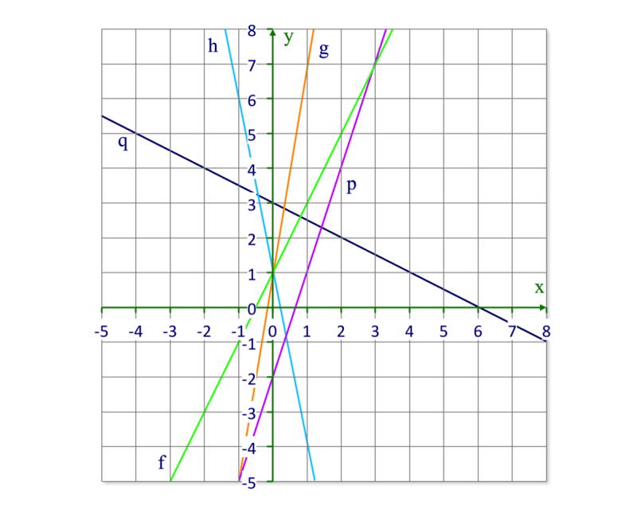

**Slope of 5 is > slope of $\frac{1}{2}$**

As you continue to work with slope, you will see how the steepness of a line can be measured and how to determine the slope by looking at the equation of a line.

IV. **Identify and Distinguish Between Direct and Inverse Variation**

Example

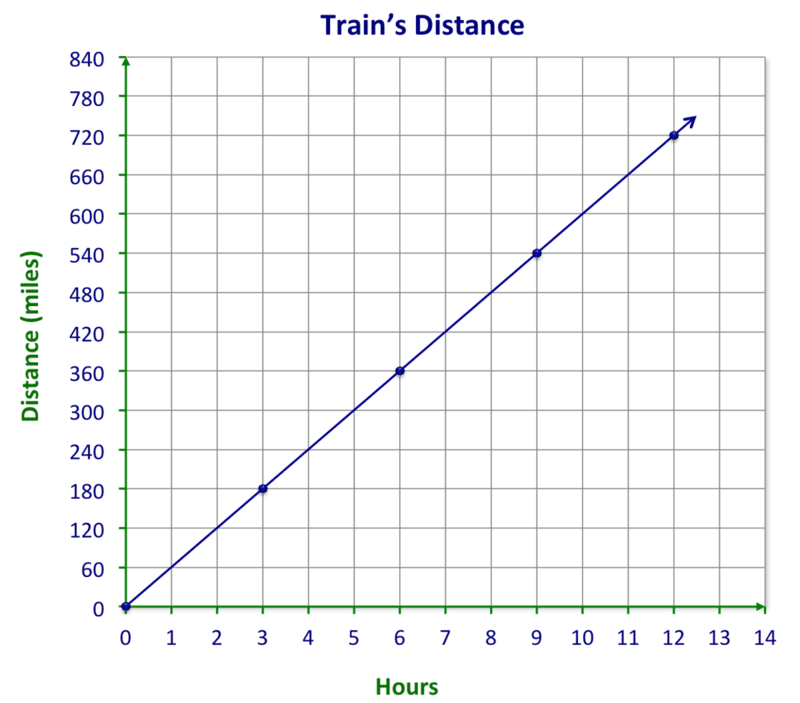

| $h$ | $d$ |
| --- | --- |
| 0   | 0   |
| 3   | 180 |
| 6   | 360 |
| 9   | 540 |
| 12  | 720 |

**This relationship can be shown in the function $d = 60 h$.**

**This type of function is called a** **_direct variation_****. It is a linear equation that can be written in the form $y=kx$, where $k \neq 0$.** This is a linear function whose $x$\- and $y$\-intercepts are always zero—it always passes through the origin. The variable $k$ is called the _constant of variation_ which is also the slope of the line. In the case above, the distance varies directly with the time because it increases in proportion to the time. That is, if the time doubles, the distance doubles, and so on. In a direct variation, as one variable increases, the other increases, too. In a direct variation, for any ordered pair $(x, y), k=\frac{y}{x}$,.

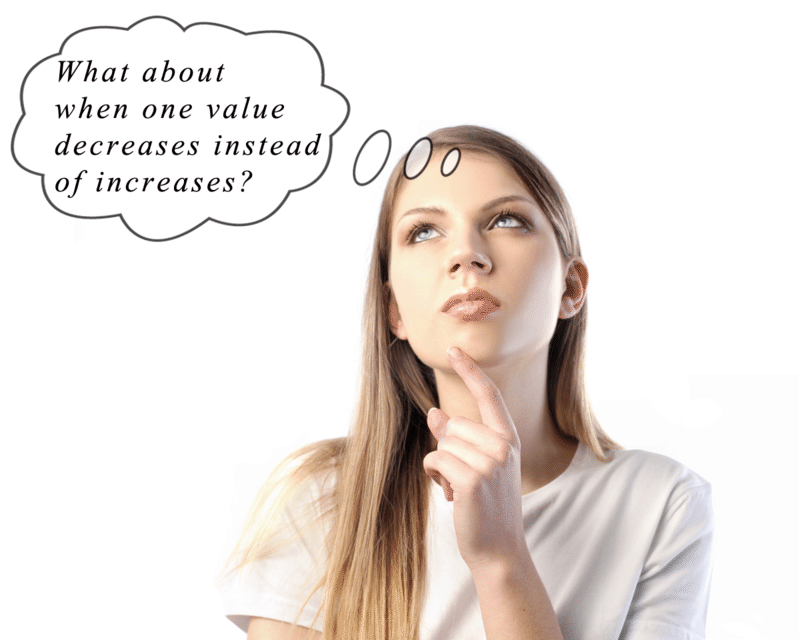

**An** **_inverse variation_** **can be written in the form $y=\frac{k}{x}$ where $k$ is still the constant of variation as in direct variations but the product of the ordered pairs is $k$.**

Real-Life Example Completed
---------------------------

**_Rainforest Transportation_**

**Here is the original problem once again. Reread it and then solve the problem at the end.**

After a lot of debating and discussing, the class finally decided to attend the Omni Theater. The presentation on the rainforest was fascinating and all of the students were glad that this was the decision that they had made. While the film did show the animals and insects of the rainforest, it also focused on ecology and on scientists and other people working to save the rainforest.

When they returned to school, Mr. Thomas had them talk about different parts that had interested them.

“I was fascinated on the bus ride that the scientists took to get to the rainforest. It was amazing to me that the bus could travel over all of those bumpy roads and not have an accident,” Mark commented.

“Yes, if you think about it, the bus ride was pretty cool to see from the Omni point of view. I mean I felt like I was going to fall over the edge some of the time,” Karen added.

Others smiled as well. Mr. Thomas seizing the opportunity wrote the following problem on the board.

A bus leaves Boston traveling at a constant speed of 60mph. You can make a table showing the distance, $d$, in miles that the train has traveled after $h$ hours.

**Now here is the table and the graph to represent the data.**

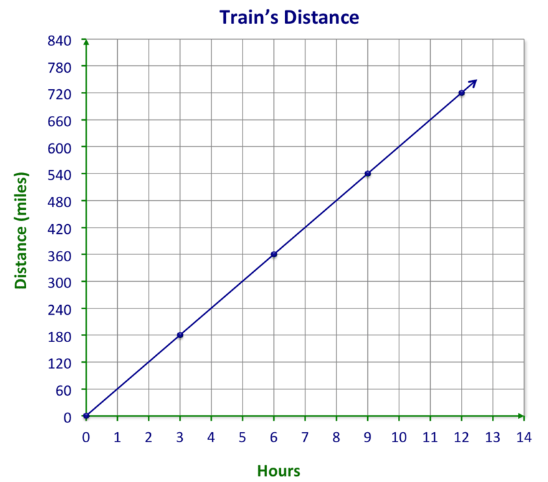
| --- | --- |
| 0   | 0   |
| 3   | 180 |
| 6   | 360 |
| 9   | 540 |
| 12  | 720 |

**This relationship can also be shown by the function $d = 60 h$.**

Vocabulary
----------

Here are the vocabulary words that are found in this lesson.

__Slope__

the steepness of the line, calculated with the ratio $\frac{rise}{run}$.

__Ratio__

a comparison between two quantities.

__Positive Slope__

a slope that goes up from the left to the right.

__Negative Slope__

a slope that goes down from the left to the right.

__Zero Slope__

the slope of a horizontal line

__Undefined Slope__

the slope of a vertical line

Time to Practice
----------------

Directions: Answer true or false for each of the following questions.

1.  True or false. The equation of a line is always linear.
2.  True or false. A linear equation will be shown as a straight line on a graph.
3.  True or false. The $x$ – intercept is where the line crosses the $y$ axis.
4.  True or false. The $y$ – intercept is where the line crosses the $y$ axis.
5.  True or false. A vertical line has an undefined slope.
6.  True or false. A horizontal line has a slope of 0.
7.  True or false. Slope is the distance that the line travels on the coordinate graph.
8.  True or false. Slope is found using a ratio.
9.  True or false. You can figure out the slope of a line if you have been given one set of points.
10. True or false. You will need two sets of points that a line passes through to figure out the slope.

Directions: Figure out the slope of a line that passes through each of the following pairs of points.

11. (2, 3) (3, 4)
12. (4, 5) (2, 3)
13. (2, 1) (-1, 3)
14. (3, 1) (4, 3)
15. (5, 7) (3, 6)
16. (3, 0) (4, 1)
17. (6, 4) (2, 7)
18. (2, 0) (0, 1)
19. (6, 1) (1, 6)
20. (4, 4) (5, 0)

Directions: Solve each problem.

21. The caloric intake of a hummingbird varies directly with the amount of nectar that it consumes. For each gram the hummingbird consumes, it takes in 5 calories. Write an equation that shows the direct variation. Identify $k$. Create a t-table and a graph.
22. Use the data in this table to model the inverse variation with an equation and graph.

$$
\begin{align*}
& x \qquad \ 5 \qquad 10 \qquad 20 \qquad 25 \qquad 50\\
& y \qquad 20 \qquad 10 \qquad \ 5 \qquad \ 4 \qquad \ 2
\end{align*}
$$

</article>

### 9.5 Slope-Intercept Form

<article>

Introduction
------------

**_Scientists in the Rainforest_**

“You know, they couldn’t exactly run out to the store to pick something up,” Casey commented.

“Or call for a pizza!” Susan said.

Mr. Thomas once again seized a great opportunity to write the following problem on the board.

**A group of backpackers leaves with 84lbs. of food. They plan to eat 11lbs. per day. Use an equation to show on a graph how much food they should have after each day. How long should their food last?**

**To work on this problem, you will need to know about writing equations involving slope. The food changes per day based on how much the backpackers eat. This lesson will teach you all that you need to know to work on this problem.**

**_What You Will Learn_**

By the end of this lesson, you will be able to complete the following skills.

* Use a graph to find the slope and $y$ – intercept of a linear equation given in function form.
* Calculate the slopes and $y$ – intercepts of linear equations in a variety of forms, and recognize slope – intercept form as equivalent to function form.
* Graph linear equations given in a variety of forms using slope and $y$ – intercept.
* Solve real – world problems using slope – intercept forms of linear equations.

**_Teaching Time_**

I. **Use a Graph to Find the Slope and $\underline{y}$ – Intercept of a Linear Equation Given in Function Form**

We have seen linear equations in function form, have created tables of values and graphs to represent them, looked at their $x$\- and $y$\-intercepts, and studied their slopes. One of the most useful forms of a linear equation is the **_slope-intercept form_** which we will be covering in this lesson.

Remember **_standard form_**? **The standard form of an equation is when the equation is written in $Ax+By=C$ form.** This form of the equation allows us to find many possible solutions. In essence, we could substitute any number of values for $x$ and $y$ and create the value for $C$. When an equation is written in standard form, it is challenging for us to determine the slope and the $y$ – intercept.

**We can write an equation in a different form than in standard form. This is when $y =$ an equation. We call this form of an equation** **_slope – intercept form_****.**

**Slope – Intercept Form is $y=mx+b$ – where $m$ is the slope and $b$ is the $y$ – intercept.**

Let’s look at an example of the slope – intercept form in action.

Example

Graph the line $y=3x+1$

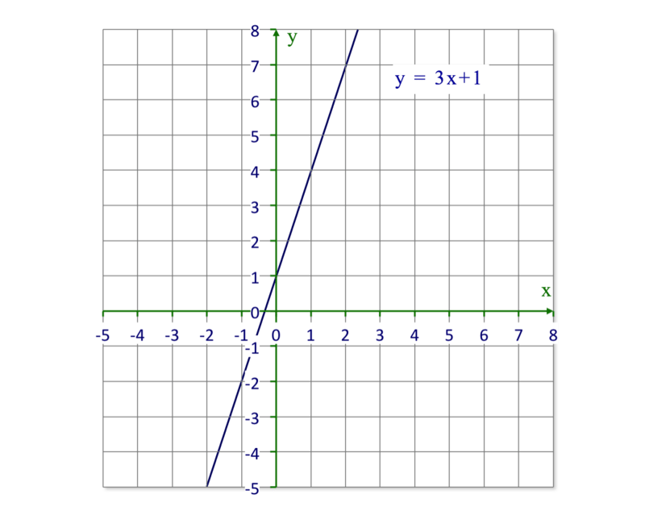

**_When an equation is in slope – intercept form, we can spot the slope and the $y$ – intercept by looking at the equation._**

$y={\color{red}m}x+ {\color{cyan}b}$

Here $m$ is the value of the slope and $b$ is the value of the $y$ – intercept.

II. **Calculate the Slopes and $\underline{y}$ – Intercepts of Linear Equations in a Variety of Forms, Recognize Slope – Intercept Form as Equivalent to Function Form**

For any equation written in the form $y=mx+b$, $m$ is the slope and $b$ is the $y$\-intercept. For that reason, $y=mx+b$ is called the _slope-intercept form._ Using the properties of equations, you can write any equation in this form.

**Because we can use slope – intercept form, we can rewrite equations in standard form into slope – intercept form. Then we can easily determine the slope and $y$ – intercept of each equation.**

Example

Write $4x+2y=6$ in slope – intercept form. Then determine the slope and the $y$ – intercept by using the equation.

$$
\begin{align*}
4x+2y &=6 \\
4x+2y-2y &=6-2y\\
4x &=6-2y\\
4x-6 &=-2y\\
\frac{4x-6}{-2} &=y \\
y &= -2x+3
\end{align*}
$$

**Now we can determine the slope and the $y$ – intercept from the equation.**

$$
\begin{align*}
-2 &= \text{slope}\\
3 &= y - \text{intercept}
\end{align*}
$$

**Think back to our work with functions. Remember how we could write a function in function form? Well take a look at function form compared with slope – intercept form.**

**Function form $= f(x)=2x+1$**

**Slope – Intercept Form $= y=2x+1$**

**Yes! The two are the same. These two equations are equivalent!**

III. **Graph Linear Equations Given in a Variety of Forms Using Slope and $\underline{y}$ – Intercept**

Do you see how useful the slope-intercept form, $y=mx+b$, is to find the slope and $y$\-intercept? Using this form, graphing is going to be easy, too. Since we know the slope and we know the $y$\-intercept, then instead of using a table of values, we can plot the $y$\-intercept on the coordinate plane and find our next point using the slope.

Example

Graph the line that goes with the equation $y=-x+5$

**First, we can determine that the slope is -1 and the $y$ – intercept is 5. Next, we can graph this line using these two pieces of information.**

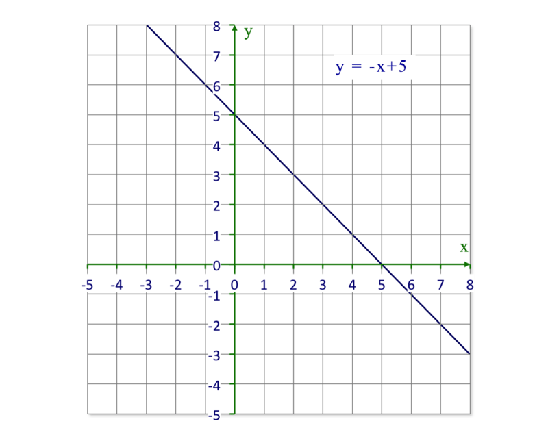

Example

Graph the line $3x+y=9$

**First, we rewrite this equation from standard form to slope – intercept form. We do this by using inverse operations.**

$$
\begin{align*}
3x-3x+y &=-3x+9\\
y &= -3x+9
\end{align*}
$$

**Now we know that the slope is -3 and the $y$ – intercept is 9. Next, we can graph the equation of the line.**

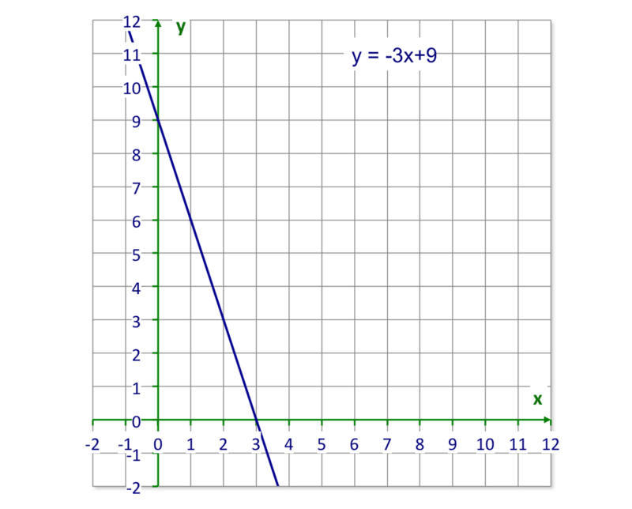

IV. **Solve Real – World Problems Using Slope – Intercept Forms of Linear Equations**

The slope-intercept form allows can be useful in solving many problems in the real world. Let’s look at an example

Example

A store employee gets paid $12.50 per hour plus a weekly bonus of $50 for punctuality. Assuming the employee is on time every day, graph her wages earned. How much would she earn for working 10 hours? 20 hours? 30 hours?

**We could use the equation $w=12.5h+50$.**

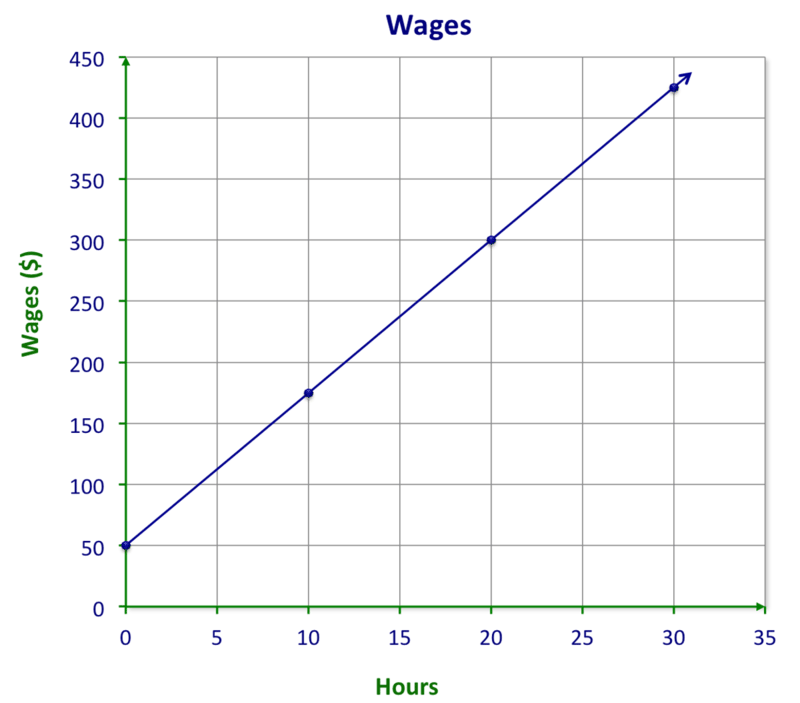

Real-Life Example Completed
---------------------------

**_Scientists in the Rainforest_**

**Here is the original problem once again. Reread it and then solve Mr. Thomas’ problem using what you have learned in this lesson.**

The rainforest was such a popular topic of discussion that Mr. Thomas let the students talk about it all week. They loved discussing all of the things that they had seen. One day, they began talking about the scientists and all of the things that they had to carry with them into the rainforest.

“You know, they couldn’t exactly run out to the store to pick something up,” Casey commented.

“Or call for a pizza!” Susan said.

Mr. Thomas once again seized a great opportunity to write the following problem on the board.

**A group of backpackers leaves with 84lbs. of food. They plan to eat 11lbs. per day. Use an equation to show on a graph how much food they should have after each day. How long should their food last?**

**First, we need to write an equation to represent the food. Use the equation $f=-11d+84$ where $f$ is the food they have remaining and $d$ is the number of days that have been gone.**

**The graph shows that they have enough food for a little more than seven days.**

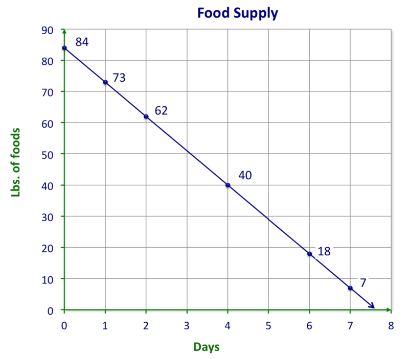
----------

Here are the vocabulary words that are found in this lesson.

__Slope – Intercept Form__

the form of an equation $y=mx+b$

__Standard Form__

the form of an equation $Ax+By=C$

__Slope__

the steepness of the line, calculated by the ratio of rise over run.

__$y$ – Intercept__

the point where a line crosses the $y$axis.

Time to Practice
----------------

Directions: Look at each equation and identify the slope and the $y$ – intercept by looking at each equation. There are two answers for each problem.

1.  $y=2x+4$
2.  $y=3x-2$
3.  $y=4x+3$
4.  $y=5x-1$
5.  $y=\frac{1}{2}x+2$
6.  $y= -2x+4$
7.  $y= -3x-1$
8.  $y=\frac{-1}{3}x+5$

Directions: Use what you have learned to write each in slope – intercept form and then answer each question.

$2x+4y=12$

9.  Write this equation in slope – intercept form.
10. What is the slope?
11. What is the $y$ – intercept?

$2x+2y=8$

12. Write this equation in slope – intercept form.
13. What is the slope?
14. What is the $y$ – intercept?

$3x+6y=2$

15. Write the following equation in slope – intercept form.
16. What is the slope?
17. What is the $y$ – intercept?

Directions: Use what you have learned to solve each problem.

Miguel wants to save $47 for a video game. He received $20 as a gift and gets $4 per week for allowance.

18. Write an equation in slope-intercept form that represents this situation.
19. Graph the equation.
20. How long will it take him to save enough money?

A homeowner wants to reduce the amount of electricity he uses at his house. He finds that he uses 600 watts of power per month. By using energy-efficient light bulbs, he decreases his usage by 12 watts per light bulb each month.

21. How many energy-efficient light bulbs does he need to cut his consumption in half?
22. Write an equation in slope-intercept form.

</article>

### 9.6 Linear Functions

<article>

Introduction
------------

**_Banana Math_**

“There were so many different things growing,” Mark agreed.

The students began having a discussion about the things that had intrigued them about the plant life of the rainforest. One of the points that was brought up is that there are plants in the rainforest that can’t be found anywhere else in the world. Mr. Thomas spotted the opportunity and wrote the following problem.

**You buy a banana tree that is 8 inches tall. It grows 4 inches per day. Its height (in inches) $h$ is a function of time (in days) $d$.**

**You can express this function as an equation and a graph. That is the work that you will learn about in this lesson. Pay close attention and you will be ready to complete both of these parts by the end of the lesson.**

**_What You Will Learn_**

In this lesson, you will learn how to complete the following skills.

* Write linear equations given two points on a line, $x$ and $y$ – intercepts, slope and $y$ – intercept, or a table of values.
* Use function notation to express a linear relationship between an independent and dependent variable.
* Graph functions given in function notation.
* Model and solve real - world problems using tables, equations and graphs of linear functions.

**_Teaching Time_**

I. **Write Linear Equations Given Two Points on a Line, $\underline{x}$ and $\underline{y}$ – intercepts, slope and $\underline{y}$ – intercept, or a table of values**

The $y=mx+b$ form of an equation was most useful in rapidly identifying both the slope, $m$, and the $y$\-intercept, $b$. In fact, if we know what the slope of an equation is and we know its $y$\-intercept, then we can just as easily write the equation. All you have to do is plug in the slope for $m$ in the $y=mx+b$ form and the $y$\-intercept for $b$.

Example

$m = 4, y-intercept = 3$

**We know that we are going to use the form of the equation $y=mx+b$, so we can substitute these values into the equation and write it.**

$y=4x+3$

**This is the answer. The key is to always watch for negative signs and be sure to include them when you write your equation.**

Sometimes, we can also be given the slope and a point that the line crosses through. We can also use this information to write an equation of a line. Let’s look at an example.

Example

$\text{Slope} = -2$, the line passes through the point (0,-3)

**With this example, we know the slope, so that can be easily substituted into the slope-intercept form. The point has a 0 for the $x$ value, so that means that we have been given the coordinate of the $y$ – intercept.**

$y= -2x-3$

**This is the answer.**

**What if you only know two points and you don’t know the slope? It’s a similar operation that we can use in order to write the equation.**

Do you recall that the slope formula is $m=\frac{{y_2}-{y_1}}{{x_2}-{x_1}}$? In other words, given any two points $(x_1, y_1)$ and $(x_2, y_2)$, we can use the slope formula to calculate the slope of the line that passes through those points. Even when you only know two points, finding the slope is just a matter of using the formula. But then what?

We will use the notion below.

if $m=\frac{{y_2}-{y_1}}{{x_2}-{x_1}}$ then $m=\frac{{y}-{y_1}}{{x}-{x_1}}$ because the slope is the same on any part of a line. In other words, we can use a formula similar to the slope formula for finding the equation. This time, however, we will leave $x$ and $y$ as variables because the relationship is true for any values of $x$ and $y$ in that equation.

Example

Write the equation of the line that passes through the points $(3,7)$ and $(5,11)$. First we will find the slope using the slope formula for ${x_1}=3,{y_1}=7,{x_2}=5,{y_2}=11$.

$$
\begin{align*}
m &=\frac{{y_2}-{y_1}}{{x_2}-{x_1}}\\
m &=\frac{11-7}{5-3}\\
m &=\frac{4}{2}\\
m &=2
\end{align*}
$$

Now plug in our known values of $m, x_1$, and $y_1$.

$$
\begin{align*}
m &=\frac{y-{y_1}}{x-{x_1}}\\
\frac{2}{1} &=\frac{y-3}{x-7}
\end{align*}
$$

Do you see that we have a proportion? This can be solved by cross multiplying.

$$
\begin{align*}
\frac{2}{1} &=\frac{y-3}{x-7}\\
1(y-3) &=2(x-7)\\
y-3 &=2x-14\\
y &=2x-11
\end{align*}
$$

**This is the answer.**

**What about when you have been given a table of values? Well, there is a way to figure out the equation quite simply when you have a table of values. Take a look at the example.**

Example

| $x$ | $y$ |
| --- | --- |
| 0   | 5   |
| 1   | 7   |
| 2   | 9   |
| 3   | 11  |
| 4   | 13  |

**First, notice that the $y$ – intercept is the value that has an $x$ value of 0. With an $x$** **_value_** **of 0, we know that the $y$ – intercept is 5.**

**Now we need to figure out the slope. Look at the y values in the table. Can you see a pattern? If you look carefully, you will see that the values jump by +2 each time. This is the slope. Think about how the line would move when graphed. The pattern of the $y$** **_values_** **represents the slope of the line.**

$y=2x+5$

**This is the answer.**

II. **Use Function Notation to Express a Linear Relationship Between an Independent and Dependent Variable**

If you think about this it makes perfect sense. We have talked about how the function of $y$ **_depends_** on the rest of the equation. This brings us back to the function notation that we worked on in earlier sections. Remember?

=4x+1$")

**Here we know that the function of $x$ is dependent on 4 times that value, $x$ and one.**

Once you understand the connection between independent variables and dependent variables, we can move on to graphing these linear equations.

III. **Graph Functions Given in Function Notation**

As with any other linear equation, functions can be graphed using a t-table or using the slope-intercept form. It is important to place the independent variable on the $x$\-axis and the dependent variable on the $y$\-axis or the results can be misinterpreted. Let’s look at an example.

You buy a orange tree that is 12 inches tall. It grows 3 inches per day. Its height (in inches) $h$ is a function of time (in days) $d$.

$h=3d+12$

Let’s use slope-intercept form to show its graph. We know that the slope is 3 and the $y$ – intercept is 12. That gives us enough information to graph this line.

IV. **Model and Solve Real – World Problems Using Tables, Equations and Graphs of Linear Functions**

There are so many ways that we can use functions in real life. Think about all of the things that you do in a day. If you drive to work, then the time that it takes you to drive is a function of the speed of your car. If you are paid hourly, then the amount of money that you make is a function of the number of hours that you work. Each and every day we use functions. Let’s take a look at another example.

Example

A group of students measure the length of their classmates’ arms and legs and found the following data:

| **arm(in)** | **legs(in)** |
| --- | --- |
| 25  | 30  |
| 27  | 33.2 |
| 26  | 31.6 |

Assume there is a linear relationship. Write and graph the linear function that describes this data.

Use the table to determine ordered pairs. Then you can find the slope. Find the slope using the slope formula for $x_1=25, y_1 = 30, x_2 = 27, y_2 = 33.2$.

$$
\begin{align*}
m &=\frac{{y_2}-{y_1}}{{x_2}-{x_1}}\\
m &=\frac{33.2-30}{27-25}\\
m &=\frac{3.2}{2}\\
m &=1.6 \\
m &=\frac{8}{5}
\end{align*}
$$

Now substitute in our known values of $m, x_1,$ and $y_1$.

$$
\begin{align*}
m &=\frac{{y}-{y_1}}{{x}-{x_1}}\\
\frac{8}{5} &=\frac{y-30}{x-25}\\
5(y-30) &=8(x-25)\\
5y-150 &=8x-200 \\
5 &=8x-50\\
y &=\frac{8}{5}x-10
\end{align*}
$$

Now we can graph the data.

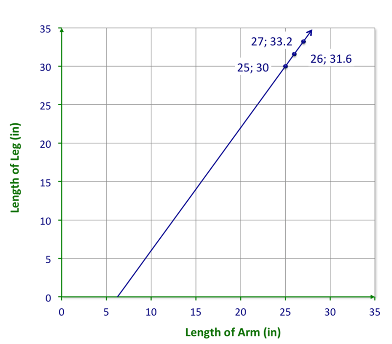

Real-Life Example Completed
---------------------------

**_Banana Math_**

**Here is the original problem once again. Reread it and then complete both parts of the solution. Write an equation and draw a graph for this problem.**

“The vegetation of the rainforest was very interesting,” Carmen commented in Mr. Thomas’ class as the rainforest discussion continued.

“There were so many different things growing,” Mark agreed.

The students began having a discussion about the things that had intrigued them about the plant life of the rainforest. One of the points that was brought up is that there are plants in the rainforest that can’t be found anywhere else in the world. Mr. Thomas spotted the opportunity and wrote the following problem.

**You buy a banana tree that is 8 inches tall. It grows 4 inches per day. Its height (in inches) $h$ is a function of time (in days) $d$.**

**_Solution to Real – Life Example_**

**First, we need to write an equation. We can use the $h$ to represent the height of the banana tree. We can use the $d$ to represent the number of days. The 8 is the height that the tree started with. Here is our equation.**

$h=4d+8$

**Let’s use slope-intercept form to show its graph.**

$m=4,b=8$

**Notice that we only need the first quadrant of the coordinate plane because negative values would not make sense.**

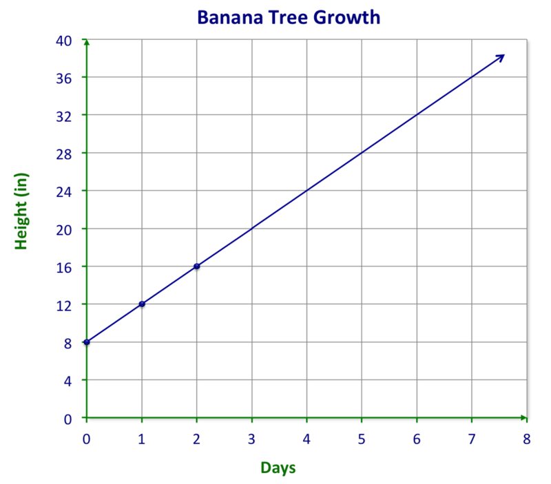
----------

Here are the vocabulary words in this lesson.

__Independent Variable__

a value that is not dependent on another value. It is the $x$ _value_ in a table.

__Dependent Variable__

a value that is dependent on the equation. It is the $y$ _value_ in a table.

__Function Notation__

an equation where the value of $x$ is dependent on the equation involving $x$.

Time to Practice
----------------

Directions: Write the equation of a line with the following slopes and $y$ – intercepts.

1.  $\text{slope} = 2, \ y \ \text{int} = 4$
2.  $\text{slope} = -3, \ y \ \text{int} = 2$
3.  $\text{slope} = -4, \ y \ \text{int} = 4$
4.  $\text{slope} = 3, \ y \ \text{int} = -5$
5.  $\text{slope} = \frac{1}{2}, \ y \ \text{int} = -2$
6.  $\text{slope} = -\frac{1}{3}, \ y \ \text{int} = 2$
7.  $\text{slope} = 1, \ y \ \text{int} = 8$
8.  $\text{slope} = -2, \ y \ \text{int} = 4$
9.  $\text{slope} = -1, \ y \ \text{int} = -1$
10. $\text{slope} = 5, \ y \ \text{int} = -2$

Directions: Write the following horizontal or vertical line equations.

11. A horizontal line with a $b$ value of 7.
12. A horizontal line with a $b$ value of -4.
13. A vertical line with an $x$ value of 2
14. A vertical line with an $x$ value of -5

Directions: Write the equation of a line that passes through the following points.

15. (3, -3) and (-3, 1)
16. (2, 3) and (0, -3)
17. (2, 3) and (3, 4)
18. (2, 3) and (3, 4)

Directions: Use what you have learned to solve each problem.

19. A migrating monarch butterfly travels 1100 miles. If it flies 30 miles per day, the distance $d$ it still has to travel is a function of days $t$ it has traveled. Write a function rule for the situation.
20. A writer gets paid a writer’s fee of $3000 plus $1.50 for each copy of the book that is sold. Create a function rule for this situation.
21. How many books does the writer need to sell to earn $10,000 total?

</article>

### 9.7 Systems of Linear Functions

<article>

Introduction
------------

**_A Second Trip to the Omni_**

“Do you want to go with me?” Kelly asked.

“Sure, but I have karate first, so I will have to meet you there. What time is the show?” Tyler asked.

“The show starts at 2:30 pm. I’m going to leave at one o’clock so I can look around,” Kelly said.

“Well, I don’t get done karate until then, so I probably won’t leave until 2:00 pm,” Tyler said.

On Saturday, the two went about their day and both left for the museum. Kelly’s Mom tends to drive slowly and cautiously, so she was traveling on city streets at 45 mph. Tyler’s karate class is downtown, so he could take the highway to get to the Omni theater and his Dad drove at an average of 55 mph. Will the two catch up to each other?

**This is a problem about equations and systems of equations. You will need to solve a system of equations to figure this one out. To figure this out, you would need to find a solution that will work for both equations. You will learn all about it in this lesson.**

**_What You Will Learn_**

In this lesson, you will learn how to do the following skills.

* Recognize a solution of a linear system in two variables as an ordered pair that is a solution of each equation in the system.
* Recognize linear systems with no solutions and linear systems with infinitely many solutions.
* Solve linear systems by graphing.
* Solve linear systems by substitution.
* Model and solve real - world problems using systems of linear equations.

**_Teaching Time_**

I. **Recognize a Solution of a Linear System in Two Variables as an Ordered Pair that is a Solution of Each Equation in the System**

As useful as you have seen linear functions to be, there are yet other applications of the idea. In a system of linear equations, you will see how linear equations can work together in a system to solve even more complex problems. Indeed, there are various ways that we can find solutions to these problems or find that there may be no solution at all.

If you add two numbers together, you get 13. Can you think of any ordered pairs that would work for this?

(1, 12), (3, 10), (-4, 17), (4.5, 8.5)

Hopefully you’ll agree that there are infinite pairs of numbers whose sum is 13. You might also agree that there are infinite pairs of numbers whose difference is 7.

(9, 2), (11, 4), (37, 30), (95.8, 88.8), (-3, -10)

However, which ordered pair is true for both conditions at once? Which pair has a sum of 13 and a difference of 7?

If you make a list of ordered pairs, you can check them to see which makes both equations true. This is a **_system of equations_****—two or more equations at the same time.** In the example above, the solution is (10, 3) because the sum of the two numbers is 13 and their difference is 7.

**The pair (10, 3) makes both equations true.**

Example

Which ordered pair makes both equations true?

1. 

$$
\begin{align*}
x+y &=8 \\
4x-y &=-3
\end{align*}
$$

a. (2, 6)

b. (3, 15)

c. (4, 4)

d. (1, 7)

Let’s test each pair and see which pair, if any, works:

a. 

$$
\begin{align*}
x+y &=8 \\
2+6 &=8? \\
8 &=8 \\
4x-y &=-3 \\
4 \cdot 2-6 &=-3? \\
8-6 &=-3? \\
2 &\ne -3
\end{align*}
$$

The ordered pair (2, 6) makes the first equation true, but not the second. Because it is not true for both equations, it is not a solution to the system.

b. 

$$
\begin{align*}
x+y &=8 \\
3+15 &=8? \\
18 &\ne 8
\end{align*}
$$

The ordered pair (3, 15) does not even make the first equation true. It cannot be a solution to the system.

c. 

$$
\begin{align*}
x+y &=8 \\
4+4 &=8? \\
8 &=8 \\
4x-y &=-3 \\
4 \cdot 4-4 &=-3? \\
16-4 &=-3 \\
12 &\ne -3
\end{align*}
$$

The ordered pair (4, 4) makes the first equation true, but not the second. Because it is not true for both equations, it is not a solution to the system.

d. 

$$
\begin{align*}
x+y &=8 \\
1+7 &=8? \\
8 &=8 \\
4x-y &=-3 \\
4 \cdot 1-7 &=-3? \\
4-7 &=-3?\\
-3 & = -3
\end{align*}
$$

**The ordered pair (1, 7) makes both equations true. This is a solution to the system.**

Remember, the ordered pair must be a solution to both equations in the system.

II. **Recognize Linear Systems with No Solutions and Linear Systems with Infinitely Many Solutions**

A solution to a system of equations is an ordered pair that makes both equations true. Is there always a solution? Can there be more than one solution? Let’s investigate this with an example.

Example

Two numbers have a sum of 17. If you add two numbers together, their sum is 15. As you know, there are infinite ordered pairs whose sum is 17. There are also infinite ordered pairs whose sum is 15. But can a single ordered pair have a sum of both 17 and 15 at the same time?

**First, let’s write two equations to help us to sort out the information in this system of equations. There are two equations and both have a different sum.**

$$
\begin{align*}
x+y &=17 \\
x+y &=15
\end{align*}
$$

**If we think about these two equations, you will see that there aren’t any values that will work for both of these equations.**

**Therefore, this system has no solutions.**

Example

Two numbers have a sum of -8. Twice the first number plus twice the second number is -16.

**First, let’s write the two equations described above. Then we can investigate possible solutions.**

$$
\begin{align*}
x+y &= -8 \\
2x+2y &=-16
\end{align*}
$$

**Does this system have a solution? Think of a solution for the first equation. How about (-3, -5)? Does it work for the second? Yes. Think of another solution like (9, -1). This one is also true in both equations.**

**This equation has an infinite number of solutions.**

**Some systems of equations have infinite solutions because all ordered pairs that make one equation true also make the other true.**

III. **Solve Linear Systems by Graphing**

When we have a system of equations, we can graph the equations and solve the system by graphing. When you graph two linear equations, two lines are formed. These two lines will intersect. The point where the lines intersect is the solution for the system. Let’s look at an example.

Example

Solve the following system by graphing.

$$
\begin{align*}
y &= 2x-4 \\
y &= -2x+8
\end{align*}
$$

**To work on this system, we will graph both of these lines and look for the point of intersection. That point of intersection will be the solution to the system.**

.**")

**This is the solution to the system of equations.**

**Sometimes you might have two equations that do not intersect. If this happens, then you know that this is a system with no solutions. Parallel lines are one possible system that would not have a solution. Parallel lines have the same slope, so you can recognize a system with no solutions.**

IV. **Solve Linear Systems by Substitution**

Graphing systems of equations is an excellent way of finding their solutions. It is also an easy way to see if a system has no solutions or has infinitely many. However, as you saw in the last example, graphing is not always practical, specifically when the solution is not an integer because fractional numbers can be difficult to read on a graph. Or imagine if your $y$\-intercept is 5250 and your slope is $\frac{85}{3}$. These types of numbers would make graphing a particular challenge. Solving the system algebraically—using properties of equations—is our next best bet.

Example

Let’s recall that in a system of equations, we are looking for the same $x$ and $y$ values that make all equations true. So, the solution to the system

$$
\begin{align*}
3y &=x-2 \\
y-x &=4
\end{align*}
$$

is the ordered pair $(x, y)$ that makes the first and the second equation true. In other words, $x$ in the first equation equals $x$ in the second equation and $y$ in the first equation equals $y$ in the second equation. Now, look at the second equation, $y-x=4$. It is simple to solve for the $y$ value—add $x$ to both sides. So $y=x+4$. Well, if $y$ is the same in both equations and $y=x+4$, then we can substitute $x + 4$ in the place of $y$ in the first equation. That is why this is called the _substitution method_.

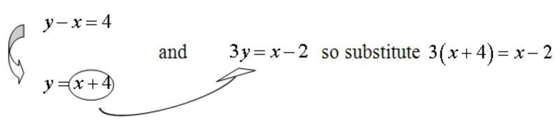

$$
\begin{align*}
3(x+4) &= x-2 \\
3x+12 &=x-2 \\
2x+12 &=-2 \\
2x &=-14 \\
x &=-7
\end{align*}
$$

If $x = -7$, substitute again to find $y$:

$$
\begin{align*}
y &=x+4 \\
y &=-7+4 \\
y &=-3
\end{align*}
$$

**Our solution, then, is (-7, -3).**

V. **Model and Solve Real – World Problems Using Systems of Linear Equations**

Two methods for solving systems of equations are graphing and substitution. There are many situations in the real world where these strategies can be useful.

Two trains leave the station going in the same direction. One train leaves two hour before the other. The first train’s average speed is 65mph while the second train’s average speed is 90mph. How long will it take for the second train to catch up to the first?

**First, let’s think about functions with regard to this problem. The second train’s distance $d$ is a function of time $t$. It can be found with the equation $d=90t$.**

**Since the first train left two hours before the first train, it had two hours more than the second train to travel. Its speed was 65mph, though. Its distance can be found with the equation $d=65(t+2)$.**

Solve the system of equations using a graph.

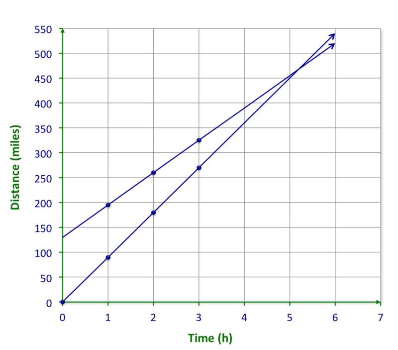

**Now let’s go back and look at the problem from the introduction.**

Real-Life Example Completed
---------------------------

**_A Second Trip to the Omni_**

**Here is the problem from the introduction. Reread it and then solve it for the solution.**

Kelly loved the Omni presentation on the rainforest so much that she decided to go and see it again. She asked Tyler if he wanted to go with her on Saturday afternoon.

“Do you want to go with me?” Kelly asked.

“Sure, but I have karate first, so I will have to meet you there. What time is the show?” Tyler asked.

“The show starts at 2:30 pm. I’m going to leave at one o’clock so I can look around,” Kelly said.

“Well, I don’t get done karate until then, so I probably won’t leave until 2:00 pm,” Tyler said.

On Saturday, the two went about their day and both left for the museum. Kelly’s Mom tends to drive slowly and cautiously, so she was traveling on city streets at 45 mph. Tyler’s karate class is downtown, so he could take the highway to get to the Omni theater and his Dad drove at an average of 55 mph. Will the two catch up to each other?

**This is a problem about equations and systems of equations. You will need to solve a system of equations to figure this one out.**

**_Solution to Real – Life Example_**

**The first equation we can write is to represent Tyler’s time. His Dad is traveling 55 mph. Therefore his distance is a function of speed and time.**

$d = 55t$

**Kelly left one hour before Tyler did. She is traveling 45 miles per hour. Therefore, the speed times Tyler’s time plus one hour equals Kelly’s time.**

$d = 45(t + 1)$

**Now see if there is a solution that will work for both equations. We can try to solve this by using substitution.**

$$
\begin{align*}
55t &= 45(t + 1) \\
55t &= 45t + 1 \\
55t - 45t &= 1 \\
10t &= 1 \\
t &= \frac{1}{10}
\end{align*}
$$

**Now we go to Tyler.**

$$
\begin{align*}
d &= 55\left ( \frac{1}{10} \right ) \\
d &= 5.5
\end{align*}
$$

**The solution could be the following values for $d$** **_and_** **$t$. However, when you substitute those values into both equations, the solution does not work. Therefore there isn’t a solution for this system, and the Kelly and Tyler won’t meet up while driving.**

Vocabulary
----------

Here are the vocabulary words that are found in this lesson.

__System of Equations__

two or more equations at the same time. The solution will be the ordered pair that works for both equations.

Time to Practice
----------------

Directions: Figure out which pair is a solution for each given system.

1.  Which ordered pair is a solution of the following system?

$$
\begin{align*}
x-3y &=9 \\
3x+y &=7
\end{align*}
$$

(a) $(6, -1)$

(b) $(-1, -4)$

(c) $(0, 7)$

(d) $(3, -2)$

2.  Which ordered pair is a solution of the following system?

$$
\begin{align*}
y &=3x-7 \\
5x-3y &=13
\end{align*}
$$

(a) $\left (3, \frac{2}{3} \right)$

(b) $(2, -1)$

(c) $(4, 7)$

(d) $(5, 8)$

3.  Figure out which ordered pair is a solution for the following system.

$$
\begin{align*}
\frac{1}{2}x +3y &= -6 \\
2x + 4y &= 0
\end{align*}
$$

Directions: Determine whether each system has infinite solutions or no solutions.

4.  $$
    \begin{align*}
    x +y &= 10 \\
    y &= -x +10
    \end{align*}
    $$
    
5.  $$
    \begin{align*}
    3x -6y &= -24 \\
    x -2y &= -8
    \end{align*}
    $$
    
6.  $$
    \begin{align*}
    \frac{3}{4}x &= \frac{2}{3}y-1 \\
    9x &= 8y-12
    \end{align*}
    $$
    
7.  $$
    \begin{align*}
    y &= \frac{1}{2}x + 3 \\
    y &= \frac{1}{2}x - 2 \\
    \\
    y &= 3x-5 \\
    y &= 3x-2
    \end{align*}
    $$
    
8.  $$
    \begin{align*}
    y &= \frac{1}{2}x + 3 \\
    y &= \frac{1}{2}x - 2
    \end{align*}
    $$
    

Directions: Answer each question true or false.

9.  Parallel lines have the same slope.
10. Parallel lines have infinite solutions.
11. Perpendicular lines have one solution.
12. Lines with an infinite number of solutions are not parallel.

Directions: Graph the following systems of equations. Identify the solution or write no solution or infinitely many solutions, if appropriate.

13. $$
    \begin{align*}
    y &= 2x - 3 \\
    y &= x - 1
    \end{align*}
    $$
    
14. $$
    \begin{align*}
    2x + 2y &= 1 \\
    y &= -x + \frac{1}{2}
    \end{align*}
    $$
    
15. $$
    \begin{align*}
    y &= -3x + 1 \\
    3x - y &= -7
    \end{align*}
    $$
    
16. $$
    \begin{align*}
    y &= 2x \\
    \frac{y}{2} &= x- \frac{5}{2}
    \end{align*}
    $$
    

Directions: Solve the following systems using the substitution method.

17. $$
    \begin{align*}
    2y -8 &= 8 \\
    2y + 2x &= 2
    \end{align*}
    $$
    
18. $$
    \begin{align*}
    4x + y &= -2 \\
    -2x - 3y &= 1
    \end{align*}
    $$
    
19. $$
    \begin{align*}
    y &= 2x \\
    6x - y &= 8
    \end{align*}
    $$
    
20. $$
    \begin{align*}
    x + 4y &= -3 \\
    2x + 8y &= -6
    \end{align*}
    $$
    
21. Anglica’s mother leaves to visit her grandmother for her birthday. Her grandmother lives 450 miles away and her mother drives at an average of 50mph. Three hours later, Angelica’s step-father notices that her mother forgot the gift for her grandmother so he decides to try to catch up to her. If he drives at an average of 80mph, will he catch up to her before she gets to her grandmother’s house? Write a system of equations to model the situation and solve using the substitution method.

</article>

### 9.8 Graphs of Linear Inequalities

<article>

Introduction
------------

**_A Traveling Dilemma_**

You are going on a trip in a jeep out to the rainforest. You need to have enough fuel to get there and back. It is 115 miles one way. You can buy two different kinds of fuel for your truck, gasoline or ethanol. Gasoline gets better gas mileage at 21 mpg but ethanol is cleaner burning and gives you 17 mpg. Use a linear inequality to figure at how many gallons of each you would need.

**To write an inequality, you will first need to know about them. This lesson will teach you everything that you need to know. By the end of it, you should be able to solve Kenya’s problem.**

**_What You Will Learn_**

In this lesson, you will learn how to complete the following skills.

* Identify the meaning of inequality symbols relating expressions involving two variables.
* Recognize a solution of a linear inequality in two variables as an ordered pair of values which make the inequality true.
* Graph linear inequalities by rewriting as an equation in slope – intercept form graphing the equation as a dashed line for $<$ or $>$, a solid line for $\le$ or $\ge$, and shadowing the half-plane that tests true for the inequality.
* Model and solve real - world problems using graphs of linear inequalities.

**_Teaching Time_**

I. **Identify the Meaning of Inequality Symbols Relating Expressions Involving Two Variables**

Our task in equations has been to find any and all of the solutions—the solution set—that make the equation true. As we consider inequalities, the task remains the same. We have to find all the values that make the statement true.

less than $<$ greater than $>$ not equal to $\ne$

less than or equal to $\le$ greater than or equal to $\ge$

You may have seen a simple inequality like “a number is less than five” or $x < 5$ and pondered the infinite values that would make $x$ true. You have also solved inequalities like $3(x-4) \ge 7x + 10$ using properties of equations.

**Just as equations can be in one or two variables, so can inequalities. However, because there are five inequality signs, we must be aware of their meanings. Additionally, there are oftentimes many ways to say the same thing—“is less than” could be said “is not as much as”—although they use the same inequality symbol.**

Example

Translate the following expressions to inequalities:

1.  The sum of two numbers is more than 10. $x+y>10$
2.  The difference between two numbers is at least 32. $x-y \ge 32$
3.  Four less than a number is less than one-third another number. $x-4< \frac{1}{3}y$
4.  Negative 5 times the sum of two numbers is not 18. $-5(x+y) \ne 18$

**You can see that anytime that we are talking about two numbers or two unknown numbers that we can use two variables in an equation. This allows us to express an inequality in two variables.**

II. **Recognize a Solution of a Linear Inequality in Two Variables as an Ordered Pair of Values which Make the Inequality True**

Just as with equations, a solution to an inequality will be the value(s) that make the inequality true. When you saw the inequality, $x<5$, you knew that 4 is a solution, 2, 0, -3, -7.3, etc.

There are infinitely many values that make the inequality true.

When we had equations in two variables like $x+y=7$, we also saw that there were infinitely many solutions. The solutions were shown as pairs of numbers, ordered pairs, because there was more than one variable, like (3, 4) or (-1, 8).

**For the same reason, we will show solutions to inequalities in two variables as ordered pairs. We can find solutions by guessing and checking or by using mathematical reasoning.**

Example

Which solution makes this inequality a true statement?

$3x+2>y$

$$
\begin{align*}
& (3, 5) && 3 \cdot 3 +2>5?  && \text{yes}\\
& (-6, 0) && 3 \cdot -6+2>0? && \text{no}\\
& (-1, -1) && 3 \cdot -1+2>-1? && \text{no}\\
& (10, 31) && 3 \cdot 10+2>31? && \text{yes}
\end{align*}
$$

**In this example, there are two possible solutions for this inequality. Remember that oftentimes, you will have more than one solution for an inequality.**

III. **Graph Linear Inequalities by Rewriting as an Equation in Slope – Intercept Form graphing the equation as a dashed line for $\underline{<}$ or $\underline{>}$, a solid line for $\underline{\le}$ or $\underline{\ge}$, and shadowing the half-plane that tests true for the inequality**

Listing solutions to single variable inequalities is useful but, because there are infinitely many solutions, it is impossible to show the entire solution set with a list. For that reason, we use number lines. So when $x<2$, we show it like this.

$, greater than $(>)$, and not equal to $(\ne)$ symbols, we use an open circle because, although the solution set is infinitely close to the endpoint, the endpoint itself is not actually a solution. With the less than or equal to $(\le)$ and greater than or equal to $(\ge)$ symbols, the endpoint is a solution so we use a closed circle.")

**Just as we graphed linear equations, we can also graph linear inequalities. We will graph the linear inequalities using slope-intercept form. As the circle on a number line marks the end of the solution set of a single variable inequality, so the line on the coordinate plane will mark the boundary of the solution set of a linear inequality.**

**The solution set will be on one side of the line or the other. We will take a test point to figure out which side makes the inequality true and then shade that half of the coordinate plane to indicate the solution set.**

**With the less than $(<)$, greater than $(>)$, and not equal to $(\ne)$ symbols, we will use a dotted line instead of an open circle because, although the solution set is infinitely close to the line, the points on the line itself are not actually solutions. With the less than or equal to $(\le)$ and greater than or equal to $(\ge)$ symbols, the points on the line are solutions so we use a solid line.**

Let’s look at an example.

Example

Graph the solution set of the inequality $y > x+3$.

**Graph using $m=1, b=3$. Use a dotted line because the symbol is $>$.**

. Does the point make the inequality $y>x+3$ true? $1>1+3?$ No! The solution set must be on the other side of the line. As you can see in the graph, we shaded the opposite side.")

**We can graph any inequality in this way. First, graph the equation of the line. Then check if it is a solid or dashed line. Then shade above or below the line based on the inequality symbol.**

IV. **Model and Solve Real – World Problems Using Graphs of Linear Inequalities**

There are many different real life situations that require inequalities or can be described by an inequality. Let’s look at an example.

You’re going to a party! You’re supposed to bring sodas and chips but you only have $20 to spend. Sodas cost $1.50 per bottle and chips cost $2.50 per bag. How many of each can you buy?

**This situation can be modeled with a linear inequality.**

**Let $s$ equal the number of sodas you buy and $c$ the number of chips that you buy.**

**The inequality is $1.5s + 2.5c \le 20$ because the cost of the sodas plus the cost of the chips must not be more than $20.**

**Graph the inequality and shade the correct region. Find 5 combinations of sodas and chips that you could buy by looking at the ordered pairs within the solution on the graph.**

 (9, 2) (7, 3) (6, 4) etc.**")

Now let’s look at how we can apply what we have learned to the problem from the introduction.

Real-Life Example Completed
---------------------------

**_A Traveling Dilemma_**

**Here is the problem from the introduction. Reread it and then use an inequality and a graph to solve the problem.**

The students finished up their trip to the Omni by presenting real – world problems to the class. Some has to do with conservation and some had to do with travel or with animals. Each student wrote a problem and had a solution for it. Here is the problem that Kenya wrote about the rainforest.

You are going on a trip in a jeep out to the rainforest. You need to have enough fuel to get there and back. It is 115 miles one way. You can buy two different kinds of fuel for your truck, gasoline or ethanol. Gasoline gets better gas mileage at 21 mpg but ethanol is cleaner burning and gives you 17 mpg. Use a linear inequality to figure at how many gallons of each you would need.

**_Solution to Real – Life Example_**

**To write the solution, we first need to write an inequality. We use $e$ for ethanol and $g$ for gasoline and we write the number of miles per gallon that each gets. We want to be able to travel there and back. Since it is 115 miles per way, that is a sum of 230 miles. Here is the inequality.**

$21g + 17e \ge 230$

$, you could have (13, 2), (12, 3), (6, 8). The first value in each pair represents the ethanol usage, the second value represents the gasoline usage.**")

Time to Practice
----------------

Directions: translate each statement into an inequality.

1.  The difference between two numbers is greater than 8.
2.  Half of one number is at least 3 times another number.
3.  A quarter the sum of two numbers is less than 15.
4.  Seven times one number plus 3 less than another is not more than -16.
5.  Six times a number is greater than negative thirty.
6.  Five times a number and six is less than or equal to 39.
7.  Twelve divided by a number is less than seven.
8.  Six times a number and two less than another number is less than or equal to -12.

Directions: Which ordered pairs make the inequalities true?

$2x-5y \ge 20$

9.  (10, 5)
10. (10, 4)
11. (-10, -10)
12. (0, 0)

$y>-4x-2$

13. (1, 1)
14. (0, -6)
15. (2, -9)
16. (-1, 0)

Directions: Graph the following inequalities. Be sure to choose a dotted or a solid line and shade the correct region based on a test point.

17. $y < - \frac{2}{3} x-2$
18. $6x - 3y \le -9$
19. $3x + y > 3x -4$
20. You’re going to make a fruit salad with mangos and bananas. Bananas cost $.60 per pound and mangos cost $.90 per pound. If you can only spend $7.50, how many pounds of each can you buy? Write an inequality for the situation and solve it.
21. Julio is going to Europe and wants to have at least $500 worth of cash. He has Euros and dollars. Each Euro is worth about one and a half dollars. What are 3 combinations he could have to maintain his goal? Show your inequality and solve it.

</article>

## 10.0 Analyzing Data

<article>

</article>

### 10.1 Measures of Central Tendency and Dispersion

<article>

Introduction
------------

**_The Track Team_**

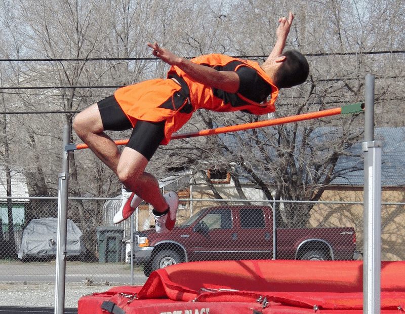

“What does that mean coach?” Marco asked smiling a huge grin.

The Hawks were very excited that their season had gone so well and now they were ready to prepare for regionals.

“It means that we are all going to figure out where we are in our team standings and then set goals to improve. That way we can have a great showing at regionals,” Mr. Watson explained.

As soon as he heard this, Alfredo began to figure out his standing. Alfredo is a high-jumper at his school. He has 8 teammates whose records are 172 cm, 174 cm, 175 cm, 179 cm, 181 cm, 181 cm, 182 cm, and 185 cm. If Alfredo’s record is 176 cm, how does he compare to the rest of the team?

**You can help Alfredo figure this out by understanding statistics and data. Pay close attention during this lesson and you will see this problem again at the end of the lesson.**

**_What You Will Learn_**

By the end of this lesson, you will be able to complete the following skills.

* Find the mean, median and mode of a set of data.
* Find the deviation of each data point from the mean of a set of data.
* Find the range and the mean absolute deviation of a set of data.
* Find, analyze and compare measures of central tendency and dispersion to describe real – world data.

**_Teaching Time_**

I. **Find the Mean, Median and Mode of a Set of Data**

In the real world, there are many situations in which a large group of data is collected. In order to make sense of the data, we use a number of **_statistical measures_**. **These measures help us to generalize a group of data, make inferences about it, and compare it with other groups of data.** These statistical measures include mean, median, mode, range, deviation from the mean, and absolute deviation from the mean. Depending on the situation, certain measures may be more helpful than others in interpreting data. Let’s look at these statistical measures.

The **_mean_**, **_median_**, and **_mode_** are three common **_measures of central tendency_**; they are three mathematical tools frequently used to analyze data. **The** **_mean_****, commonly referred to as the average, is the sum of all the data items divided by the number of data items. The** **_median_** **is the middle number in a set of data that is ordered from lowest to highest. If there is an even number of data, we take the average of the middle two numbers to find the median. Finally, the** **_mode_** **is the number that occurs most often.**

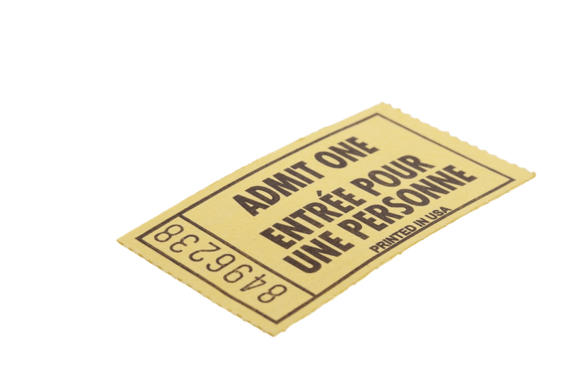

A manager at a small movie theater was analyzing the number of people who came to the movies during the week. Over nine days, he found the following data: 81, 89, 92, 85, 93, 62, 85, 105, and 90. Find the mean, median, and mode of the data.

**First, let’s find the mean. Remember that the mean is the same as the average.**

Mean: add all of the data items and divide by the number of items.

$$
\begin{align*}
& = \frac{81+89+92+85+93+62+85+105+90}{9}\\
&= \frac{782}{9}\\
&= 86.8
\end{align*}
$$

**The average or mean is 86.8 which could be rounded up to 87.**

**Next, let’s find the median.**

Median: the middle number when the data is ordered from lowest to highest.

First reorder the data from least to greatest:

$$
\begin{align*}
& 62, 81, 85, 85, 89, 90, 92, 93, 105 \\
& \qquad \qquad \quad \ \ \uparrow \\
& \text{The middle number, 89, is the median.}
\end{align*}
$$

**The median is 89.**

**Finally, let’s find the mode.**

The mode is the number that occurs most often. In this case, 85 occurs two times and all of the other number only once. The number 85 is the mode.

**The mode is 85.**

II. **Find the Deviation of Each Data Points from the Mean of a Set of Data**

**Step 1: Find the mean.**

$$
\begin{align*}
& = \frac{45+37.5+51+89+47+55}{6}\\
&= \frac{324.5}{6}\\
&= 54.08
\end{align*}
$$

The average food server tip was $54.08.

Step 2: Find the difference of each food server tip from the mean. This is the deviation from the mean. Notice that Greg’s value is always used because we are looking for the deviation between the tips of the other waiters and Greg.

| **Difference from mean** | **Deviation from the mean** |
| --- | --- |
| 54.08 - 37.5 | 16.58 |
| 54.08 - 45 | 9.08 |
| 54.08 - 47 | 7.08 |
| 54.08 - 51 | 3.08 |
| 55 - 54.08 | .92 |
| 89 - 54.08 | 34.92 |

When we subtract, we place the largest of the two numbers first so that the difference is positive.

The deviation from the mean can let each food server know how far he or she was from the average tips that night.

**Greg earned $51. The average was $54.08 so he was very close to the average although a little bit lower.**

**Remember that when we look for the deviation from the mean, we are looking for the difference between an average and a value.**

III. **Find the Range and the Mean Absolute Deviation of a Set of Data**

An important measure of data deals with how spread out the data is. In other words, two sets of data could have identical means, medians, and modes. This will not tell, however, how high the data went nor how low. **The deviation from the mean shows how far an individual item is from the mean but does not say anything about the group as a whole.** Two additional statistical measures help to analyze this factor in a set of data.

**The** **_range_** **is found by subtracting the smallest number from the largest number. This will give you an idea of the span or the breadth of the data.** For example, if you are a new car buyer and have just entered the work force, it may help for you to know that the mean price of new cars is $22,300. This may be too high for you, but the mean doesn’t really supply you with enough information. If you know that new car prices vary from $10,500 to $89,900, then you have a better idea about what a car might cost at the lower end, easier for your income level. The range of car prices, in this example is $\$89,900 - \$10,500 = \$79,400$. It is a broad range that should allow for you to purchase a car.

A second statistical measure that can be useful is the **_mean absolute deviation_**. We already found the deviation from the mean, which is how far an individual item is from the mean. Because we only found the positive difference, we actually found the _absolute deviation_. The **_mean absolute deviation_**, then, is **the mean of those deviations**.

A city surveyor took elevation measurements around a coastal city that has a reported mean elevation of 35 feet above sea level. He went to various homes and gathered the following data: 152, 316, 26, 64, 20, 506, 210, and 89. Find the range and mean absolute deviation.

**Step 1: Find the range. Subtract the smallest number from the largest.**

$506 - 20 = 486$

**Step 2: Find the deviations from the mean (mean of 35 already given).**

| **Difference from mean** | **Deviation from the mean** |
| --- | --- |
| 35 – 20 | 15  |
| 35 – 26 | 9   |
| 64 – 35 | 29  |
| 89 – 35 | 54  |
| 152 – 35 | 117 |
| 210 – 35 | 175 |
| 316 – 35 | 281 |
| 506 – 35 | 471 |

**Step 3: Find the mean of the deviations from the mean.**

$$
\begin{align*}
& = \frac{15+9+29+54+117+175+281+471}{8}\\
&= \frac{1151}{8}\\
&= 143.9
\end{align*}
$$

**The mean absolute deviation is about 143.9 feet.**

You have been learning about all the different types of statistical data measures. Now let’s look at how to apply these in real-life situations.

IV. **Find, Analyze and Compare Measures of Central Tendency and Dispersion to Describe Real – World Data**

We have seen a variety of measures of central tendency. Mean, median, mode, range, deviation from the mean, and mean absolute deviation are all valuable tools for considering data. The exact tool that is best for a situation depends on what it is that an individual wants to know.

Example

An amusement park is designing a new section for children over 3 years old and under 8 years old. They take a survey of the heights and weights of a thousand children in that age group. Which measure of central tendency should they use to accommodate the greatest number of children on a roller coaster?

**In order to attract the more customers, they should accommodate as many children as possible. For this reason, they should use the range which will include from the tallest to the shortest children on the ride.**

**_Now that you have an idea how to do this, you can think about examples that would require the mean or average – think about grades or scores overall. You can also think about the mode if you thought about how many times a number occurs in a set of data. As in our amusement park, for example, how many days did 500 people attend? When using the median, remember to think about questions that ask for a middle score._**

Real-Life Example Completed
---------------------------

**_The Track Team_**

**Here is the problem from the introduction. Reread it and then use what you have learned to help Alfredo figure out his standings on the team.**

“It is time to get ready for competition!” Mr. Watson the track coach said to his track and field team on Monday afternoon.

“What does that mean coach?” Marco asked smiling a huge grin.

The Hawks were very excited that their season had gone so well and now they were ready to prepare for regionals.

“It means that we are all going to figure out where we are in our team standings and then set goals to improve. That way we can have a great showing at regionals,” Mr. Watson explained.

As soon as he heard this, Alfredo began to figure out his standing. Alfredo is a high-jumper at his school. He has 8 teammates whose records are 172 cm, 174 cm, 175 cm, 179 cm, 181 cm, 181 cm, 182 cm, and 185 cm. If Alfredo’s record is 176 cm, how does he compare to the rest of the team?

**_Solution to Real – Life Example_**

**In this case, finding the deviation from the mean would be most useful in answering the question because he wants to compare his individual record to that of the team.**

**Step 1: Find the mean.**

$$
\begin{align*}
& = \frac{172+174+175+179+181+181+182+185}{8}\\
&= \frac{1429}{8}\\
&= 178.6
\end{align*}
$$

**Step 2: Calculate his deviation from the mean:** $178.6 - 176 = 2.6cm$.

Alfredo’s record is 2.6cm lower than the mean. He should continue to work on improving his high jump. Now that Alfredo understands his place on the team, he can work with the coach on a plan to improve.

**_Notice that when comparing to others, we use the deviation from the mean._**

Vocabulary
----------

Here are the vocabulary words for this lesson.

__Statistical Measures__

measures used to generalize a set of data, make inferences and compare it with other groups of data.

__Measures of Central Tendency__

Math tools used to analyze data

__Mean__

the average of a set of data.

__Median__

the middle score in a set of data that has been arranged from smallest to largest.

__Mode__

the value that occurs the most times in a data set.

__Deviation from the mean__

how far a value is from the mean or average

__Range__

the breadth of the data, the difference between the largest and smallest values.

__Mean Absolute Deviation__

the mean of the deviations

Time to Practice
----------------

Directions: Find the mean, median, mode, range, deviations from the mean for the given data. Round all answers to the nearest tenths place. Notice that each answer has five answers.

1.  13, 18, 24, 21, 16, 24, 14, 17, 24
2.  116, 137, 120, 75, 98, 139
3.  22, 24, 25, 30, 32, 34, 37, 38, 40

Directions: Define each term.

4.  Mean
5.  Median
6.  Mode
7.  Deviation from the mean
8.  Range

Directions: Complete the following.

9.  Invent a data set that has 8 items, a mean of 16, a median of 17, a mode of 10, and a range of 21.
10. Two groups of adult female harbor seals were weighed from different parts of the globe, one from the Pacific Ocean and one from the Atlantic Ocean. The Pacific Ocean group had weights of: 126kg, 130kg, 135kg, 136kg, 137kg, 140kg, 148kg, and 150kg. The Atlantic Ocean group had weights of 117kg, 119kg, 122kg, 123kg, 130kg, 131kg, 141kg, 149kg, and 152kg. A marine biologist was concerned about their health and accessibility to food. Use a central tendency to compare the groups. Explain why you chose that central tendency.
11. A convenience store supervisor oversees 3 stores in a geographical region. Part of his job is to analyze store performance. Because they are in different parts of town, it is only fair to compare a store to its own historical data. Look at the sales data and determine which store’s July sales is best using a measure of central tendency. Explain your reasoning.

| **Store #** | **January** | **February** | **March** | **April** | **May** | **June** | **July** |
| --- | --- | --- | --- | --- | --- | --- | --- |
| Store 1 | 82,000 | 86,000 | 75,000 | 77,000 | 72,000 | 79,000 | 80,00 |
| Store 2 | 110,000 | 115,000 | 116,000 | 112,000 | 105,000 | 107,000 | 103,000 |
| Store 3 | 65,000 | 62,000 | 59,000 | 61,000 | 58,000 | 63,000 | 68,000 |

</article>

### 10.2 Stem-and-Leaf Plots and Histograms

<article>

Introduction
------------

**_Measuring Up_**

“Hey coach, what’s up?” Manuel asked taking his place on the team.

“I am checking on heights,” Mr. Watson explained taking out his tape measure. He began to measure each boy in centimeters.

“Why?” Carl asked curiously.

“Well, I have the heights of Markwell’s team and I want to compare our heights with theirs. I am wondering if there is a correlation between speed and height. So I am going to start with the heights,” Mr. Watson explained.

Mr. Watson wrote the following heights from smallest to largest.

Markwell Cougars: 170, 172, 175, 176, 176, 176, 178, 181, 182, 183, 183, 183, 185, 185, 187, 188, 188, 189, 190, 195

Hawks: 169, 175, 176, 176, 178, 179, 180, 183, 183, 186, 186, 186, 187, 187, 187, 187, 187, 188, 190, 191, 192

**There are many different ways to display this data. In this lesson, you will learn about histograms and by the end of this lesson, you will be able to create a display of the heights of both teams.**

**_What You Will Learn_**

In this lesson, you will learn how to complete the following skills.

* Draw a stem-and-leaf plot to represent and interpret a set of data.
* Organize data in a frequency table and make a histogram to represent and interpret a set of data, justifying size of intervals.
* Compare stem-and-leaf plots and histograms of the same data.
* Make, compare and interpret back to back stem-and-leaf data and double histograms of real – world data.

**_Teaching Time_**

I. **Draw a Stem-and-Leaf Plot to Represent and Interpret a Set of Data**

Measures of central tendency are an important method for interpreting a set of data. However, humans tend to be very visual. That is, many people understand things best when they can see them. For that reason, we have a variety of tools which allow us to see a set of data. These tools include plots and graphs. Each type of visual tool has advantages and the best type of plot or graph depends on the situation. Indeed, sometimes it is a matter of preference as many different graphs could be used to illustrate the same data. Here we’ll consider **_stem-and-leaf plots_** and **_histograms_**. Let’s start with stem-and-leaf plots.

Example

An accountant must consider the cost of healthcare for the employees at a company. The healthcare costs are based on age of the employees. She finds that the ages of the employees are as follows: 32, 19, 37, 22, 25, 46, 58, 35, 41, 45, 35, 27, 29, 42, 53, 70, 56, 34, 29, 30, 21, 24, 27, and 45.

This data is difficult to understand in an unorganized list. Measures of central tendency could be calculated but they would not help to determine healthcare costs. A stem-and-leaf plot will give her a better idea of numbers of employees per age group.

**To create a stem-and-leaf plot, we first must put the data in order from smallest to largest:**

19, 21, 22, 24, 25, 27, 27, 29, 29, 30, 32, 34, 35, 35, 37, 41, 42, 45, 45, 46, 53, 56, 58, 70.

**Now, choose stem values. That means to choose values that would be the first digit(s) of appropriate groupings. In this case, because our youngest employee is 19 and the oldest is 70, we can use the tens place as our stem.** We construct the stem vertically, then, as shown below. Then, we place each piece of data, the leaves, in the plot, next to its stem. We place the leaves in order, only separated by a column. The stem, the tens place, is not repeated.

$$
\begin{align*}
&\text{Stem} \quad \text{Leaves}\\
& \quad \ \begin{array}{c|c c c c c c c c} 1 & 9 \\
2 & 1, & 2, & 4, & 5, & 7, & 7, & 9, & 9\\
3 & 0, & 2, & 4, & 5, &	5, & 7 \\
4 & 1, & 2, & 5, & 5, &	6 \\
5 & 3, & 6, & 8 \\
6 \\
7 & 0 \\
\end{array}
\end{align*}
$$

**The stem-and-leaf plot is complete.**

Now, look at the plot. What trends can you see? **The bulk of the employees are in their 20’s and 30’s, for example.** By counting off, you can quickly locate the median. You may also notice the importance of lining up the numbers in columns so that you can quickly see how many data items there are per row.

**If our example had used numbers in the hundreds, then the hundreds would have become the largest stem. If it had been in the thousands, then the thousands would have been the largest stem. You get the idea!**

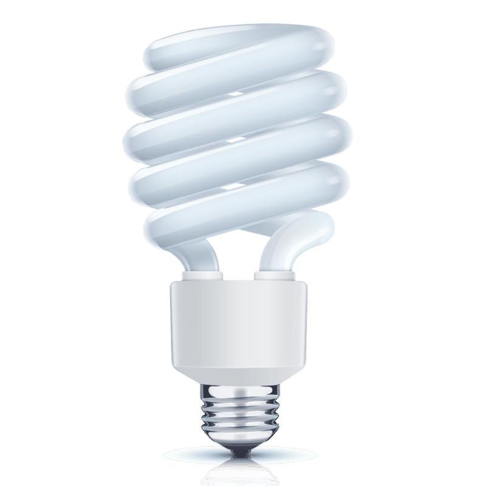

What does the word **_frequency_** mean? Frequency is used to measure how often something occurs. When we think about the word frequency, we think about “how often”. **We can use a** **_frequency table_** **to measure and visually show how often a data value occurs.** Let’s think about this.

A teacher is preparing for parent conferences. In order to provide parents with the most information possible about their children, he wants to organize the grades of the class so that they can compare the grades to the rest of the class. The math percents have been calculated and his students earned the following grades: 88, 86, 92, 65, 72, 75, 81, 84, 85, 93, 99, 50, 78, 80, 86, 76, 74, 95, 81, 87, 90, 72, 76, 61, 85, 84, 78, 83. Grades are determined by percent where 0-59% is an F, 60-69% is a D, 70-79% is a C, 80-89% is a B, and 90-100% is an A, so that makes the most logical _intervals_. Intervals are always chosen depending on the range of the data. He will make a _frequency table_ to illustrate the information. For each student who scored in the given range, he puts an X.

|     |     |     |
| --- | --- | --- |Frequency Table of Grades
| **Interval** | **Tally** | **Frequency** |
| --- | --- | --- |
| 90-100 | XXXXX | 5   |
| 80-89 | XXXXXXXXXXXX | 12  |
| 70-79 | XXXXXXXX | 8   |
| 60-69 | XX  | 2   |
| 0-59 | X   | 1   |

This tally is useful in the sense that it communicates to parents how many students in the class scored in the A range, B range, etc. It would not be as important for the parents to see the individual scores of each student as opposed to seeing the total number of each grade. That way, if their child earned a B, then they would know that the child falls in a category that most other students scored in. If a child earned a D, for example, it would indicate that they are below the general level of the other students and might need additional help.

**Notice that a frequency table showed you how often a particular score was earned. We could see it in a visual way. Sometimes, frequency tables use X’s and other times, they can use lines for tally marks.**

**A histogram is similar to a bar graph in that it uses columns to illustrate data on $x$\- and $y$\-axes. In a histogram, we can use the same intervals as we did for the frequency table. The bars in the histogram will have no space between them.**

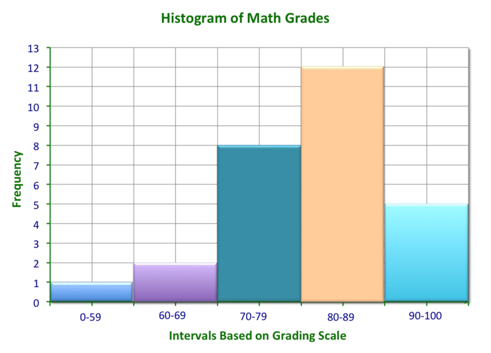

III. **Compare Stem-and-Leaf Plots and Histograms of the Same Data**

As mentioned, each type of plot or graph has advantages. At times, it is only personal preference that decides which is best. In other times, certain tools make interpretation easier or more logical. Let’s compare stem-and-leaf plots and histograms of the same data.

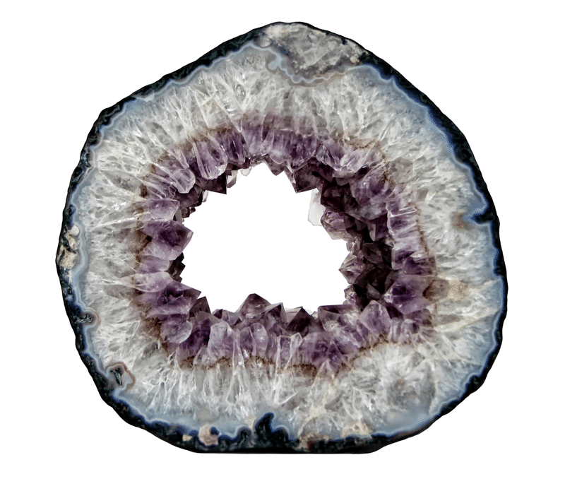

Create a stem-and-leaf plot and a histogram of the mass of geodes found at a volcanic site. Scientists measured 24 geodes in kilograms and got the following data: .8, .9, 1.1, 1.1, 1.2, 1.5, 1.5, 1.6, 1.7, 1.7, 1.7, 1.9, 2.0, 2.3, 5.3, 6.8, 7.5, 9.6, 10.5, 11.2, 12.0, 17.6, 23.9, 26.8.

**Now we need to build a stem-and-leaf plot. Remember, we are trying to determine if the data would be better displayed in a stem-and-leaf plot or in a histogram. We can start with the stem-and-leaf plot.**

The stem for this plot could be either the ones place or the tens place. If we use the ones place, it would require 24 rows. That’s too many to be useful. We should, then, use the tens place.

$$
\begin{align*}
\begin{array}{c|c c c c c c c c c c c c c c c c c c c} 0 & .8, & .9, & 1.1, & 1.1, & 1.2, & 1.5, & 1.6, & 1.7, & 1.7, & 1.7, & 1.9, & 2.0, & 2.3, & 5.3, & 6.8, & 7.5, & 9.6, \\
1 & 0.5, & 1.2, & 2.0, & 7.6, \\
2 & 3.9, & 6.8 \\
\end{array}
\end{align*}
$$

You can see that either using the ones place or the tens place has distinct disadvantages. This stem-and-leaf plot is large and limited to only two options that are not ideal.

**The histogram, on the other hand, offers more choices because we could make our intervals whatever values we choose. We should choose even intervals that are based on the data.**

The minimum item is .8 kg and the maximum is 26.8. To get a good idea of the data, we could use intervals that encompass perhaps 4 kg intervals, 5 kg intervals, or 6 kg intervals. Let’s try intervals of 5.

Begin with a frequency table.

| **Interval** | **Tally** | **Frequency** |
| --- | --- | --- |
| 0-5 | XXXXXXXXXXXXXX | 14  |
| 5.1-10 | XXXX | 4   |
| 10.1-15 | XXX | 3   |
| 15.1-20 | X   | 1   |
| 20.0-25 | X   | 1   |
| 25.1-30 | X   | 1   |

Now we can create a histogram for this data.

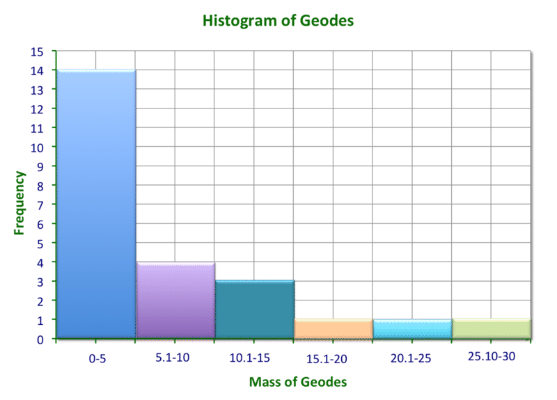

**Now you know that you have to consider the data itself and the intervals that make the most sense when comparing data.**

IV. **Make, Compare and Interpret Back to Back Stem-and-Leaf Plots and Double Histograms of Real – World Data**

Both stem-and-leaf plots and histograms are useful. So far, we have only seen them illustrating a single factor. However, they can both be used to illustrate two factors. Plants generally have leaves on both sides of the stem. **A** **_double stem-and-leaf plot_** **is used to show to factors, one on either side of the stem.** Let’s look at an example.

A zoologist takes the weights of male and female chimpanzees at 1 year of age. She finds the following data, in pounds, and places it in order from smallest to largest.

Females: 14, 17, 19, 19, 20, 21, 23, 24

Males: 18, 22, 24, 25, 26, 28, 31, 32, 34

**Make a double stem-and-leaf plot that represents this data so we can compare the males and the females in the same data display.**

$$
\begin{align*}
& \quad \text{Females} \qquad \qquad \quad \text{Males}\\
& \begin{array}{c c c c|c|c c c c c c} 9, & 9, & 7, & 4 & 1 & 8 \\
4, & 3, & 1, & 0 & 2 & 2, & 4, & 5, & 6, & 8 \\
& & & & 3 & 1, & 2, & 4 \\
\end{array}
\end{align*}
$$

In this plot, the female data on the left begins with smallest data closest to the stem and increases as you go left. You can see from the stem-and-leaf plot that the tendency is for the males to weigh more than the females after a year. We can also see that there are more males in this group than females.

**We can also create a double histogram to show the data. This will allow us to compare data for both the males and the females on one graph.**

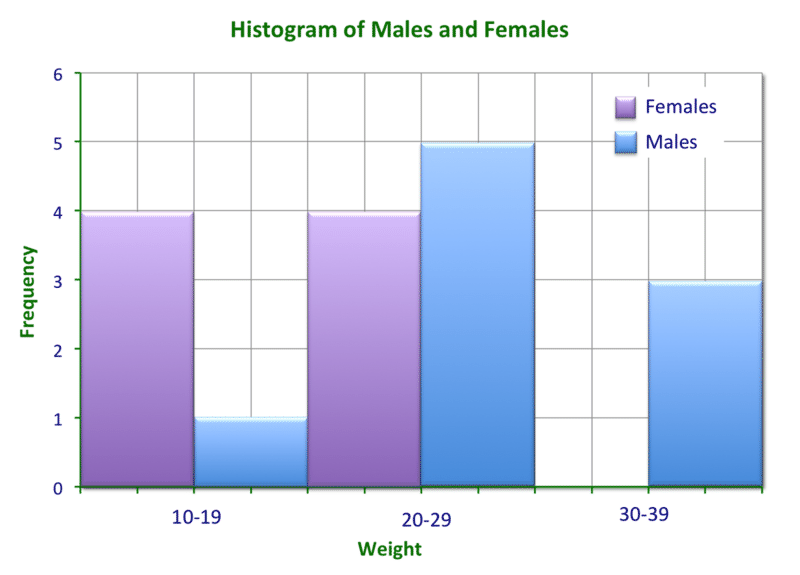

Real-Life Example Completed
---------------------------

**_Measuring Up_**

**Here is the problem from the introduction. Reread it and then create a display of the data using histograms and frequency tables.**

One afternoon, Mr. Watson had all of the boys on the distance running team line up on the field. “Hey coach, what’s up?” Manuel asked taking his place on the team.

“I am checking on heights,” Mr. Watson explained taking out his tape measure. He began to measure each boy in centimeters.

“Why?” Carl asked curiously.

“Well, I have the heights of Markwell’s team and I want to compare our heights with theirs. I am wondering if there is a correlation between speed and height. So I am going to start with the heights,” Mr. Watson explained.

Mr. Watson wrote the following heights from smallest to largest.

Markwell Cougars: 170, 172, 175, 176, 176, 176, 178, 181, 182, 183, 183, 183, 185, 185, 187, 188, 188, 189, 190, 195

Hawks: 169, 175, 176, 176, 178, 179, 180, 183, 183, 186, 186, 186, 187, 187, 187, 187, 187, 188, 190, 191, 192

**_Solution to Real – Life Example_**

**The first thing to do is to create a frequency table using the data. Here is an example.**

|     |     |     |     |     |
| --- | --- | --- | --- | --- |Frequency Table
|     | **Markwell Cougars** |     | **Hawks** |     |
| --- | --- | --- | --- | --- |
| **Interval** | **Tally** | **Frequency** | **Tally** | **Frequency** |
| 160-169 |     |     | X   | 1   |
| 170-179 | XXXXXXX | 7   | XXXXX | 5   |
| 180-189 | XXXXXXXXXXX | 11  | XXXXXXXXXXXX | 12  |
| 190-199 | XX  | 2   | XXX | 3   |

**Now, you can use this data to create a histogram that compares the data.**

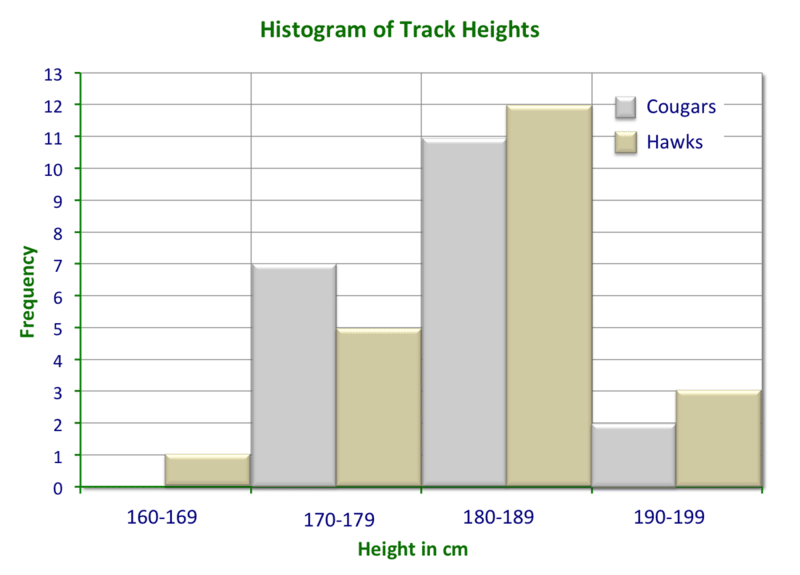

Vocabulary
----------

Here are the vocabulary words that are found in this lesson.

__Stem-and-Leaf Plots__

a visual display of data that takes the largest base ten of a value and separates it by large bases and smaller values in the data.

__Histograms__

A visual display of data that uses bars, $x$ and $y$ axes with no spaces between the intervals.

__Frequency Table__

a table that shows how often different values occur in a data set. They are arranged using tally marks or X’s.

__Double Stem-and-Leaf Plots__

Stem-and-leaf plots that show two different sets of data on the same display by organizing according to stems and leaves of base ten values.

__Double Histograms__

a visual display of data using bars and intervals to compare data sets that contain two different sets of values.

Time to Practice
----------------

Directions: Use each situation to answer the following questions.

The following data was taken of employee’s paychecks at a company: $2105, $2390, $2087, $2345, $2166, $2051, $2432, $2344, $2580, $2017, $1977, $2406, $2113, $2501, $2475, $2030.

1.  Make a stem-and-leaf plot that represents the data.
2.  What can you interpret from the plot?
3.  Explain the intervals that you chose.
4.  Why is it necessary to show intervals for which there was no data?

A company sent its employees on 18 business trips last year. They pay for employees’ food and housing expenses while they are away. The company would like to get a better idea of what the trips are costing.

The following data shows the total receipts for each trip, in dollars: 160, 175, 255, 267, 290, 295, 310, 332, 350, 352, 364, 375, 410, 462, 490, 495, 580, 710.

5.  Create a histogram that illustrates this data.
6.  Explain why you chose the intervals that you chose.
7.  What can you interpret from your histogram?

Compare the stem-and-leaf plot to the histogram of Melanie’s Christmas gift expenses. She told her husband, “Most of the gifts were about $60.”

8.  Is she telling the truth?
9.  Which tool is more useful in making a decision about her truthfulness?

$$
\begin{align*}
\begin{array}{c|c c c c c c} 4 & 1, & 6 \\
5 & 3, & 2 \\
6 & 8, & 8, & 9, & 9 \\
7 & 7, & 8, & 9, & 9, & 9, & 9 \\
\end{array}
\end{align*}
$$

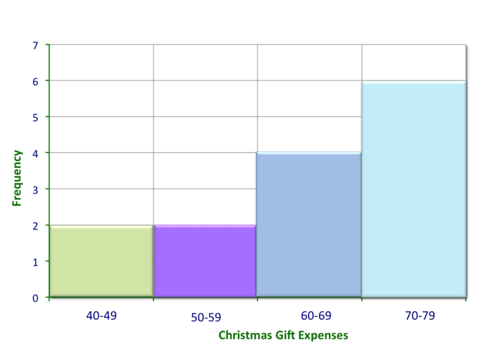

Hybrid: $17, $24, $19, $21, $10, $12, $15, $20, $6, $16

Gasoline-Only: $34, $27, $15, $31, $29, $27, $24, $14, $35, $28

10. Create a double stem-and-leaf plot to represent this data.
11. What can you conclude from your stem-and-leaf plot?

The same company that has operations in Germany and in the United States tallied the number of unpaid vacation days taken by their employees in both countries. The frequency table below shows their results.

|     | **Germany** |     | **United States** |     |
| --- | --- | --- | --- | --- |
| **\# of Days** | **Tally** | **Frequency** | **Tally** | **Frequency** |
| 0-5 | XX  | 2   | XXXXXXXXX | 9   |
| 6-10 | XXXXX | 5   | XXXXXXXX | 8   |
| 11-15 | XXXXXXXX | 8   | XXXXXX | 6   |
| 16-20 | XXXXXXXXXX | 10  | XXXX | 4   |
| 21-25 | XXXXXXXXX | 9   | X   | 1   |

12. Create a double histogram that illustrates this data.
13. What does the histogram tell you about the unpaid vacation days taken in the two countries? Why do you think this might be true?
14. How might this affect the company’s decisions?
15. Why do you think they chose intervals of 5 days?

16 – 20 Conduct your own survey and collect data. Choose attendance rates in your class or vacation days per year for example. Then create a frequency table, histogram and analyze your data.

</article>

### 10.3 Box-and-Whisker Plots and Outliers

<article>

Introduction
------------

**_Shot Put Measurement_**

Varsity: 36.8, 43.5, 45.8, 46.2, 49.1, 50.7, 52.7, 54.3, 54.4, 55.8, 56.0, 58.5

Junior Varsity: 33.2, 35.4, 36.2, 37.0, 37.6, 39.4, 40.6, 40.8, 41.3, 42.1, 44.5, 50.3

Mr. Watson wants to present this information to both of his teams. He wants to compare them. How do they compare? How can Mr. Watson create a display that will communicate what he wants to tell his team?

**To accomplish this task, you will need to know about box-and-whisker plots. Pay close attention and you will be able to help Mr. Watson at the end of the lesson.**

**_What You Will Learn_**

In this lesson, you will learn the following skills.

* Draw a box-and-whisker plot to represent given data.
* Use a box-and-whisker plot to identify the median, quartiles, inter quartile range, extremes and any outliers of a set of data.
* Compare box-and-whisker plots before and after removal of outliers.
* Make, compare and interpret double box-and-whisker plots of real-world data.

**_Teaching Time_**

I. **Draw a Box-and-Whisker Plot to Represent Given Data**

At times it is useful to get a general idea of how data cluster together. **_Box-and-whisker_** **plots display the distribution of data items along a number line.** The data are divided into four equal parts, separated by points called **_quartiles_**. You can also see the smallest data point, the extreme minimum, and the largest data point, the extreme maximum.

**A box-and-whisker plot is created by determining five points.** First we’ll place the data in order from smallest to largest. Then, we create a number line that shows the range of the data using equal intervals. We’ll use the median as our middle point on the box-and-whisker plot and to split the data in half. The median of each half, the _quartile_, is then calculated. These separate the data into quarters. Finally, we’ll use the highest datum and the lowest datum as our endpoints or our _extremes_. Boxes are drawn between the quartiles and whiskers are drawn to the extremes.

Example

Draw a box-and-whisker plot for the given data.

16, 51, 32, 16, 24, 37, 7, 22, 19, 40, 10, 31, 29, 38, 21, 11

**Step 1: Put the data in order from smallest to largest.**

7, 10, 11, 16, 16, 19, 21, 22, 24, 29, 31, 32, 37, 38, 40, 51

**Step 2: Draw a number line that includes your extremes, 7 and 51. In this case, we will use a number line from 5 to 55 using intervals of 5.**

**Step 3: Determine the median of the data.** The middle points in the data are 22 and 24 so the median is 23. Mark the median with a point beneath the number line.

**Step 4: The median separates the data into two groups** as shown below:

$$
7, 10, 11, 16, 16, 19, 21, 22 \qquad 24, 29, 31, 32, 37, 38, 40, 51
$$

Find the median in each of these groups. These are the quartiles which are 16 and 34.5. These divide the data into four groups. Mark the quartiles as you did the median, with a point.

**Step 5: Draw boxes between the quartiles and the median.**

**Step 6: Mark the extremes, the smallest and largest numbers, with points.** In this case, the extremes are 7 and 51.

**Step 7: Draw whiskers, or horizontal lines, to connect the quartiles to the extremes.**

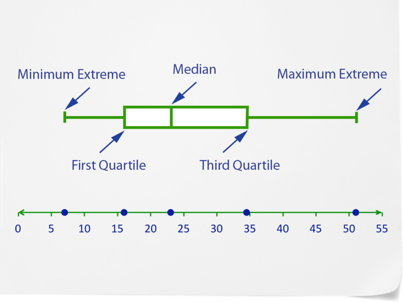

**In this particular example, we can see that the second half of the data is stretched out over a further area than the first half and about half is between 15 and 35.**

II. **Use a Box-and-Whisker Plot to Identify the Median, Quartiles, Interquartile Range, Extremes and any Outliers of a Set of Data**

In order to construct a box-and-whisker plot, you must calculate several statistical measures. However, a box-and-whisker plot that is already constructed can quickly supply statistical measures by looking at the five points.

**The first and last points give you the** **_extremes_** **of the data. The third or middle point gives you the** **_median_****. And the second and fourth points, between the median and the extremes, give you the** **_quartiles_****.**

**The** **_interquartile range_** **is the range between the first quartile and the third quartile.** This shows you where the middle half of the data is. It can be calculated by subtracting the first quartile from the third quartile. Finally, the **_outliers_**, **data items that are far away from the general trend**, can be located as extremes that cause the whiskers to be exceptionally long. Data does not always have outliers. For example, if no single point is exceptionally far from other points, no outlier exists.

Example

Use the given box-and-whisker plot to identify the a) extremes, b) the median, c) the quartiles, d) the interquartile range, and e) the outliers (if any).

 **The extremes in this data set are approximately 35 and 129.**")

b) **The median is approximately 95.**

c) **The first quartile is approximately 82 and the third quartile approximately 104.**

d) **The interquartile range, then, is 104 – 82 or 22.**

e) **Finally, the extreme minimum, 35, appears to be an outlier as the left whisker is very long compared to the rest of the plot.**

III. **Compare Box-and-Whisker Plots Before and After Removal of Outliers**

As you know, _outliers_ are points that are unusually large or small compared to the rest of the data. When we discuss measures of central tendency like mean, median, and mode, we must also remember that in the real world there are many exceptions. Sometimes when we consider data, we might choose to remove the outliers in order to draw better conclusions based on the data. Let’s look at an example.

Shanda runs on her school’s track team. They recently ran a 100 meter dash at a track meet and recorded official times. These are the results in seconds: 11.7, 10.8, 11.1, 10.9, 11.7, 11.6, 12.0, 19.6, 12.2, 11.6, 11.5, 11.6, 11.0, 12.0, 11.6, 11.5, 11.7, 11.3, 12.3, 10.1.

**Shanda’s time was 11.1 and she wants to know how she compares to the rest of her team. She will use a box-and-whisker plot to help figure this out. Here are the steps to this process.**

**Step 1:** She places the data in order.

10.1, 10.8, 10.9, 11.0, 11.1, 11.3, 11.5, 11.5, 11.6, 11.6, 11.6, 11.6, 11.7, 11.7, 11.7, 12.0, 12.0, 12.2, 12.3, 19.6

**Step 2:** She draws a number that includes the extremes.

**Step 3:** She finds the median, 11.6, and places a point on the number line.

**Step 4:** She finds the first and third quartiles, 11.2 and 11.85.

**Step 5:** She draws boxes between the quartiles and the median.

**Step 6:** She places the extremes, 10.1 and 19.6, on the numbers with points.

**Step 7:** She draws whiskers from the quartiles to the extremes.

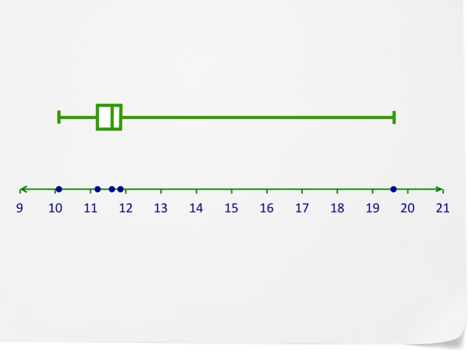

Here’s her new data:

10.8, 10.9, 11.0, 11.1, 11.3, 11.5, 11.5, 11.6, 11.6, 11.6, 11.6, 11.7, 11.7, 11.7, 12.0, 12.0, 12.2, 12.3

**She recalculates her statistical measures and creates a new box-and-whisker plot:**

**Extremes: 10.8 and 12.3**

**Median: 11.6**

**First and third quartiles: 11.3 and 11.7**

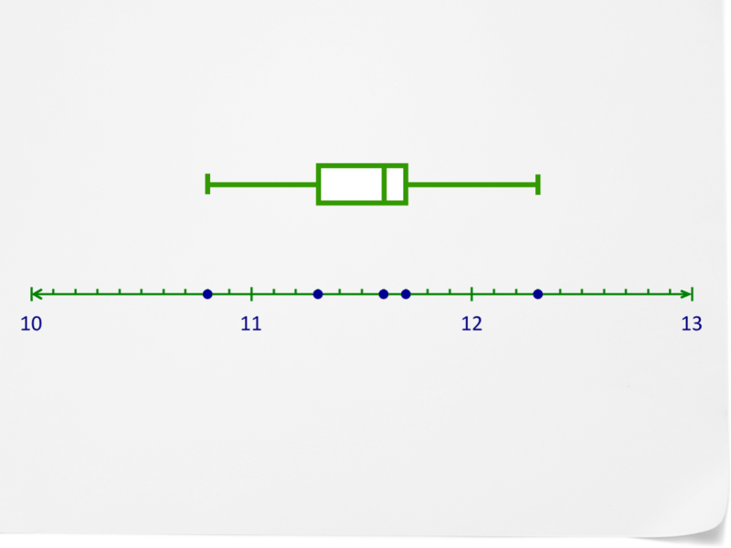

IV. **Make, Compare and Interpret Double Box-and-Whisker Plots of Real-World Data**

As we have seen with stem-and-leaf plots and histograms, we can make double plots or graphs when there are two factors that we are comparing. A double box-and-whisker plot can be made by drawing the second factor beneath the first factor. This will allow us to look at both factors on the same plot. We can use what we have learned to accomplish this with the problem from the introduction. Let’s go take a look.

Real-Life Example Completed
---------------------------

**_Shot Put Measurement_**

**Here is the problem from the introduction. Reread it and then create a data display using what you have learned about box-and-whisker plots. Finally analyze the data.**

A track and field coach, Mr.Watson was measuring shot put distances for his varsity and junior varsity teams. Here is his data, in feet, that he put in order from least to greatest.

Varsity: 36.8, 43.5, 45.8, 46.2, 49.1, 50.7, 52.7, 54.3, 54.4, 55.8, 56.0, 58.5

Junior Varsity: 33.2, 35.4, 36.2, 37.0, 37.6, 39.4, 40.6, 40.8, 41.3, 42.1, 44.5, 50.3

Mr. Watson wants to present this information to both of his teams. He wants to compare them. How do they compare? How can Mr. Watson create a display that will communicate what he wants to tell his team?

**_Solution to Real – Life Example_**

**Make a double box-and-whisker plot of this data. How does the data compare?**

|     | **Varsity** | **Junior Varsity** |
| --- | --- | --- |
| Extremes: | 36.8 and 58.5 | 33.2 and 50.3 |
| Median: | 51.7 | 40.0 |
| First and third quartiles: | 46.0 and 55.1 | 36.6 and 41.7 |

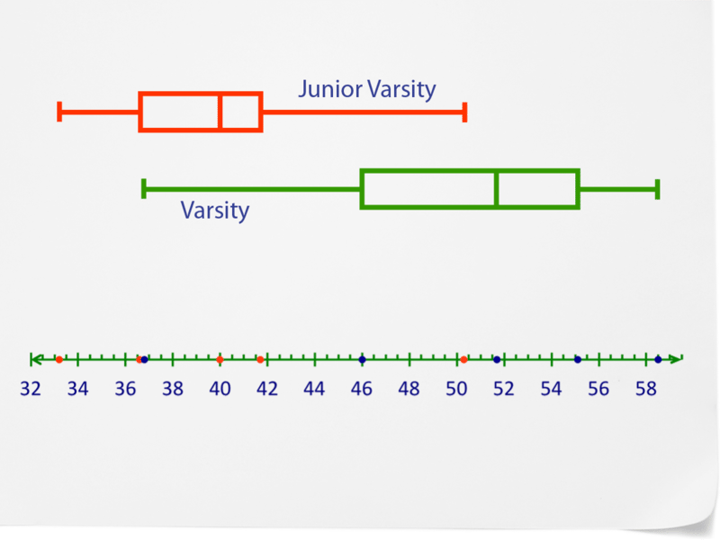

Vocabulary
----------

Here are the vocabulary words that are found in this lesson.

__Box-and-Whisker Plots__

a visual display of data on a number line.

__Quartiles__

when data is divided into four even sections.

__Median__

the middle value in a data set.

__Extremes__

the first and last points in a data set

__Interquartile Range__

the range between the first and third quartiles

__Outliers__

Data values that are far away from the general trend of the data.

Time to Practice
----------------

Directions: Use each data for each set of instructions.

90, 104, 98, 156, 140, 85, 122, 129, 142, 138, 131, 81, 151, 147, 130, 156

1.  Create a box-and-whisker plot for the data.
2.  Identify the extremes.
3.  Identify the median.
4.  Identify the quartiles.

Directions: Define the following terms.

5.  box-whisker-plot
6.  quartiles
7.  Median
8.  Extremes
9.  Interquartile Range
10. Outliers

Directions: Use the box-and-whisker plot to answer the following questions.

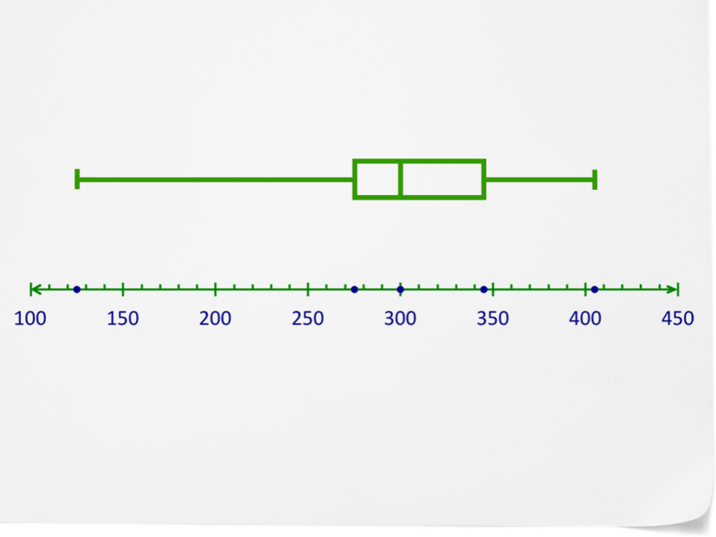
12. Identify the quartiles
13. Identify the interquartile range.
14. Identify any extremes
15. Identify any outliers.

Directions: Use the data set:

316, 385, 338, 410, 390, 328, 335, 406, 355, 310, 332, 374, 359, 640, 417, 382, 317

16. Draw a box-and-whisker plot for the data set.
17. Identify the extremes
18. median
19. quartiles
20. the outlier(s)
21. Remove the outlier(s) and make another box-and-whisker plot.
22. Identify the extreme, median, and quartiles.
23. How do the box-and-whisker plots compare?

</article>

### 10.4 Scatterplots

<article>

Introduction
------------

**_Height and Speed in the 800 m_**

$$
\begin{align*}
5^\prime 3^{\prime \prime} &= 2.26.11\\
5^\prime 2^{\prime \prime} &= 3.01.11\\
5^\prime 4^{\prime \prime} &= 2.23.20\\
5^\prime 5^{\prime \prime} &= 2.20.01\\
5^\prime 6^{\prime \prime} &= 2.18.23\\
5^\prime 6^{\prime \prime} &= 2.18.25
\end{align*}
$$

Can Mr. Watson support his claim given this data?

**To prove his claim, Mr. Watson will need to create a visual display of the data and a correlation between height and time. This is the perfect place for scatterplots. Use what you learn in this lesson to help Mr. Watson prove or disprove his claim.**

**_What You Will Learn_**

By the end of this lesson, you will understand how to complete the following skills.

* Make a scatterplot to display paired data sets given as an input-output table.
* Interpret scatterplots as showing positive, negative or no relationship between two sets of data.
* Use a scatterplot to draw a trend line and estimate unknown outputs and given inputs.
* Use a graphing calculator to find the best fitting line for a scatterplot.

**_Teaching Time_**

I. **Make a Scatterplot to Display Paired Data Sets Given as an Input-Output Table**

In the real world, many things are related to each other. For example, the more you smoke, the lower your life expectancy. Or the more years you spend in college, the greater your income in the future. Many fields try to find relationships between two variables. One tool that helps us accomplish this is the scatterplot. **A** **_scatterplot_** **is a type of graph where corresponding values from a set of data are placed as points on a coordinate plane. A relationship between the points is sometimes shown to be positive, negative, strong, or weak.** Sometimes a scatterplot shows that there is no relationship at all. Aside from finding relationships, scatterplots are useful in predicting values based on the relationship that was revealed.

Let’s look at how a scatterplot can be applied when looking at an example.

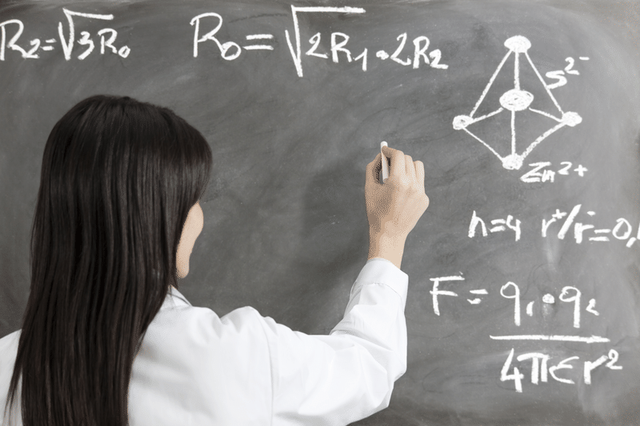

A student had a hypothesis for a science project. He believed that the more students studied math, the better their math scores would be. He took a poll in which he asked students the average number of hours that they studied per week during a given semester. He then found out the overall percent that they received in their math classes. His data is shown in the table below:

$$
\begin{align*}
& \text{study time (hours)} \qquad \ \ 4 \quad 3.5 \quad \ 5 \quad \ \ 2 \quad \ 3 \quad 6.5 \quad .5 \quad 3.5 \ \ 4.5 \quad \ 5 \quad 1 \quad 1.5 \quad \ 3 \quad 5.5\\
& \text{Math Grade (percent)} \quad 82 \quad 81 \quad 90 \quad 74 \quad 77 \quad 97 \quad 51 \quad 78 \quad 86 \quad 88 \ \ 62 \quad 75 \quad 79 \quad 90
\end{align*}
$$

**In order to understand this data, he decided to make a scatterplot.** In this case, our independent variable, or **_input data_**, is the study time because the hypothesis is that the math grade depends on the study time. That means that the math grade is the dependent variable, or **_output data_**. We will place the input data on the $x$\-axis and the output data on the $y$\-axis. Also, the scales and intervals on the axes will be determined by the data. Since the greatest value on the $x$\-axis is 6.5, we can use intervals of 1 until we reach 7. On the $y$\-axis, the greatest value is 97 and, since it is a percent, it makes sense to go up to 100. Our intervals could be 10 since that would give the scatterplot a workable shape.

. The first ordered pair, then, is (4, 82). Draw each of the 14 points. Remember, it takes two pieces of data to make a single point.")

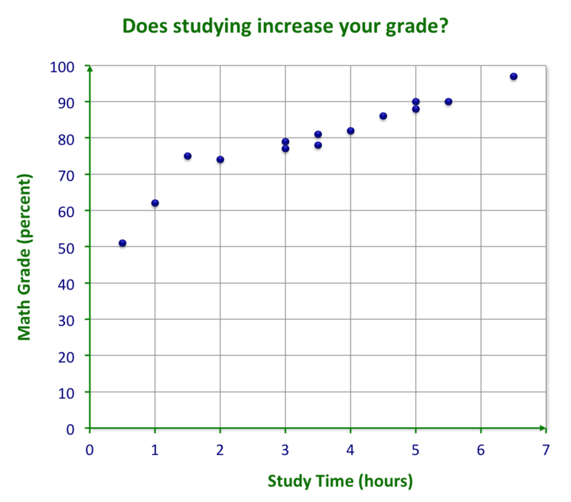

II. **Interpret Scatterplots as Showing Positive, Negative, or No Relationship Between Two Sets of Data**

As you may have guessed, the scatterplots are useful because their shapes may indicate a relationship between the variables. Consider, for example, the following: what happens to people’s heating bills as the temperature outside goes up? Or, what happens to the gasoline consumption in a vehicle as the miles traveled goes up?

For the first question, you might have thought that as the temperature outside goes up, people’s heating bills go down because they use their heaters less. As one variable goes up, the other goes down. How about the second question? You might imagine that as the miles traveled in a car go up, the amount of gasoline consumed also goes up. So, as one variable goes up, the other goes up, too.

**We can say that these variables correlate or are connected together. When we look at a scatterplot, we can determine the different variables and their correlation.**

In the examples above, the first illustrates a negative relationship—as one variable goes up, the other goes down. The second example illustrates a positive relationship—as one variable goes up, the other goes up, too. Well, what if there is no relationship—while one variable goes up, the other may go up, down, or stay the same; the second variable is independent of the first. This oftentimes occurs, too. This is an example of no relationship. Like the number of blue cars on a given road and the number of accidents. The two variables have no relationship.

These three trends, positive, negative, and no relationship are evident on scatterplots. This is what they look like:

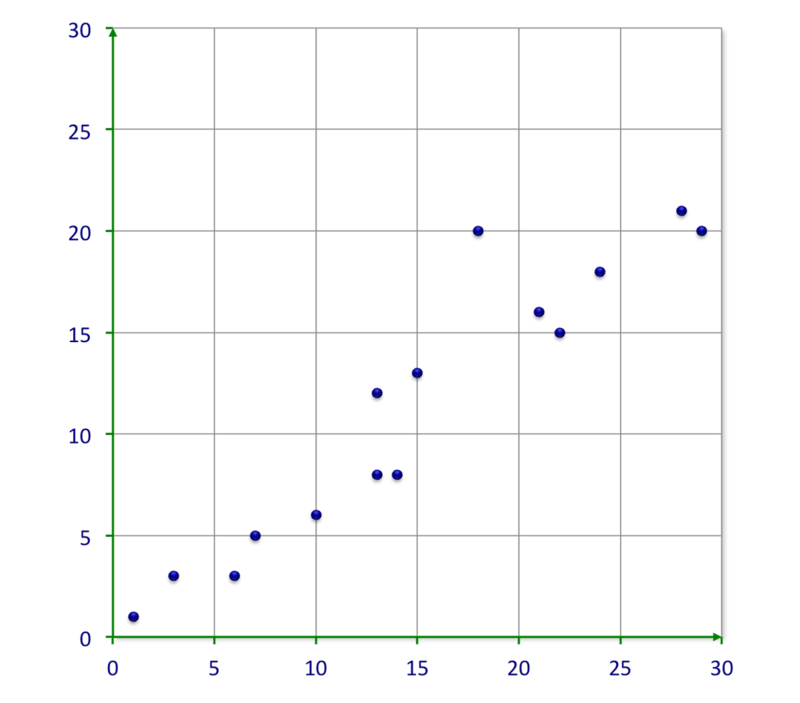

As the $x$\-values increase, the $y$\-values increase. Some points may not follow an exact pattern but the overall _trend_, the general tendency or movement, is clearly from the lower left to the upper right of the plot.

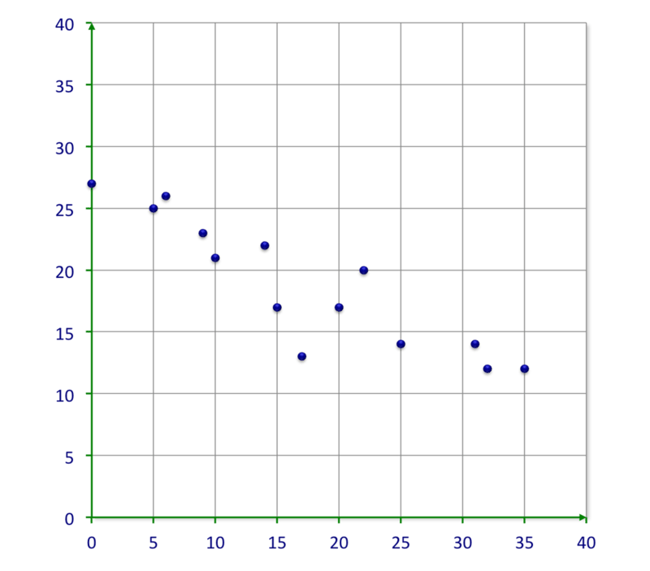

In this case, as the $x$\-values increase, the $y$\-values decrease. You may argue that the slope is not as steep which is true. However, the general tendency is evident. This graph moves from the upper left to the lower right.

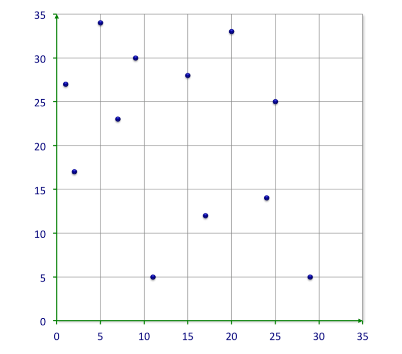

At times, there is no relationship between variables. The scatterplots of these situations will show no trend. In other words, there seems to be no definite pattern with the points; you cannot see any particular direction that they take.

III. **Use a Scatterplot to Draw a Trend Line and Estimate Unknown Outputs and Given Inputs**

Scatterplots are as useful for finding a relationship between variables as they are for making predictions. Here, we will make a **_trend line_**, **or a line that best describes the data on a scatterplot**, in order to estimate unknown outputs for given inputs.

A trend line is a straight line that best represents the points on a scatterplot. The trend line may go through some points but need not go through them all. The trend line is used to show the pattern of the data. This trend line may show a positive trend or a negative trend. However, if there is no relationship, then no trend line can be adequately drawn.

Your trend line is your best approximation so it may be different from others’.

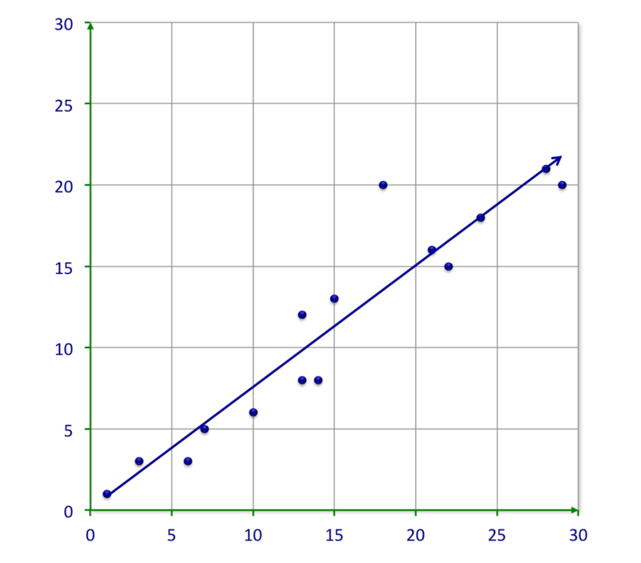

**You may notice that outliers are practically ignored when a trend line is drawn. This trend line goes from the lower left to the upper right and shows a positive relationship.**

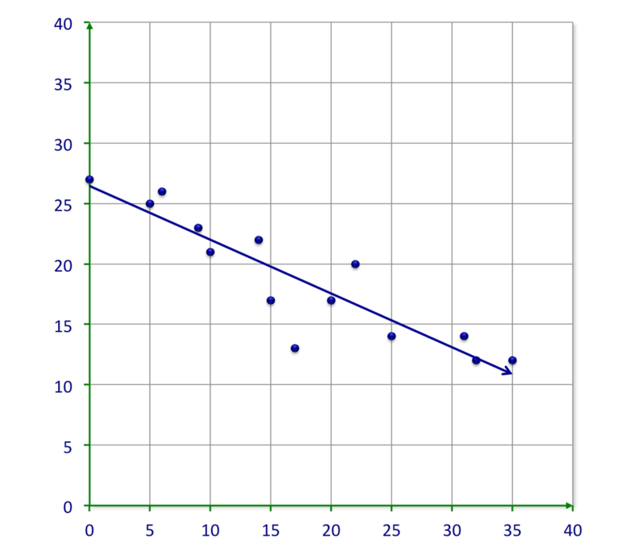

IV. **Use a Graphing Calculator to Find the Best-Fitting Line for a Scatterplot**

You probably recognize this coordinate plane. In previous lessons, you used points on a graph to find the equation of a line. A scatterplot is created on a coordinate plane and its trend line, just like any non-vertical line on a graph, has a function rule. Using the same methodology, you can write the equation of a trend line. You can use slope and $y$\-intercept, for instance.

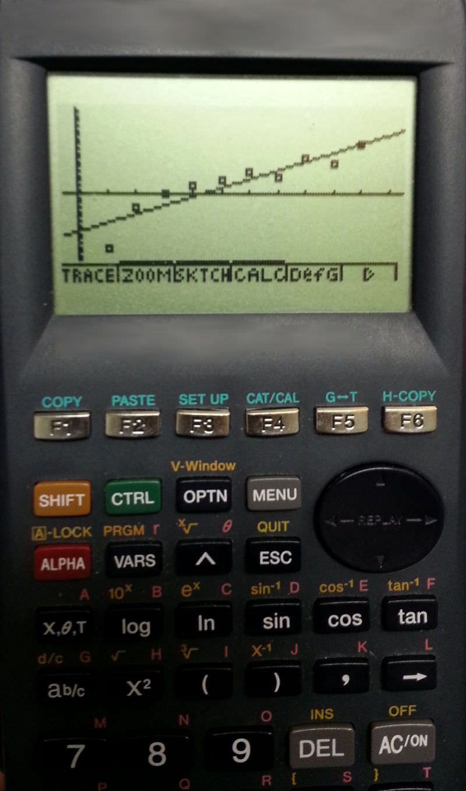

If you got the basic idea, you see that scatterplots are powerful tools. I’m sure you know that computers and technology are even more powerful at times. Scientists in the real world rarely create scatterplots on a piece of paper and compute equations by hand. They use computer programs that can approximate the trend line much more accurately than you and I can with our eyes.

You can make scatterplots on your graphing calculator, if you have one. Then, you can compute the trend line called the _linear regression_ in some models. Your graphing calculator can put the equation in $y=mx+b$ form or $Ax+By=C$ form, depending on the mode you choose. Then, you can choose any input values for which your calculator will tell you the output values.

Every graphing calculator is different. The key combination necessary for these operations is shown in your guidebook. When you study more advanced math, these operations will be required. Try it now and see how close your response gets on your graphing calculator to the one you computed by hand.

Real-Life Example Completed
---------------------------

**_Height and Speed in the 800 m_**

**Here is the original problem from the introduction. Reread it and then create a scatterplot to prove that there is or is not a correlation between height and speed.**

Mr. Watson has determined that there is a correlation between speed and the height of the student. He is so sure of it, that he gathered data to support his claim. When looking at the students who run the 800 meters, he gathered the following heights and times.

$$
\begin{align*}
5^\prime 3^{\prime \prime} &= 2.26.11\\
5^\prime 2^{\prime \prime} &= 3.01.11\\
5^\prime 4^{\prime \prime} &= 2.23.20\\
5^\prime 5^{\prime \prime} &= 2.20.01\\
5^\prime 6^{\prime \prime} &= 2.18.23\\
5^\prime 6^{\prime \prime} &= 2.18.25
\end{align*}
$$

Can Mr. Watson support his claim given this data?

**_Solution to Real – Life Example_**

**First, let’s put the data in a table so that we can see it clearly.**

| **_height_** | **_time_** |
| --- | --- |
| $5^\prime 6^{\prime \prime}$ | 2.18.23 |
| $5^\prime 6^{\prime \prime}$ | 2.18.25 |
| $5^\prime 5^{\prime \prime}$ | 2.20.01 |
| $5^\prime 4^{\prime \prime}$ | 2.23.20 |
| $5^\prime 3^{\prime \prime}$ | 2.26.11 |
| $5^\prime 2^{\prime \prime}$ | 3.01.01 |

**Looking at this data, you can suspect that there will be a correlation between speed and height. Let’s look at a scatterplot of the data.**

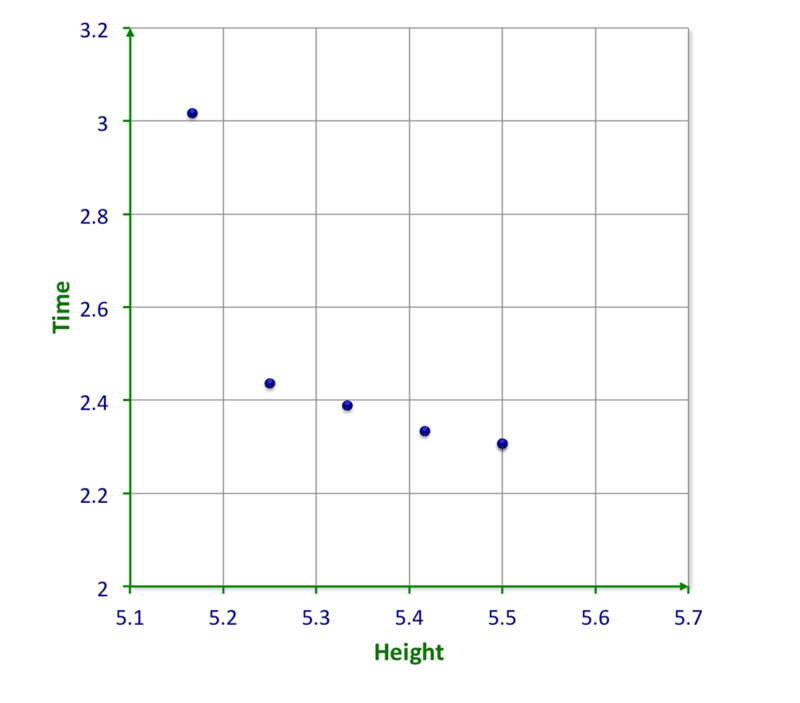

Vocabulary
----------

Here are the vocabulary words that are found in this lesson.

__Scatterplot__

a graph where corresponding values are placed on the coordinate plane and the relationship between the values can be determined.

__Input Value__

the $x$ value - it is the independent value

__Output Value__

the $y$ value - it is the dependent value

__Positive Correlation__

a scatterplot where the points plotted go up from left to right.

__Negative Correlation__

a scatterplot where the points plotted go down from left to right.

__No Correlation__

a scatterplot where there isn’t a clear relationship between the dependent and independent values.

Time to Practice
----------------

Directions: Use what you have learned to answer each question or complete each task.

1.  Make a scatterplot to display the data set in the table:

$$
\begin{align*}
& x \quad 23 \quad 18 \quad 30 \quad 24 \quad 29 \quad 45 \quad 10 \quad 17 \quad 27 \quad 39 \quad 32 \quad 40 \quad 21 \quad 14\\
& y \quad 62 \quad 72 \quad 54 \quad 60 \quad 57 \quad 30 \quad 79 \quad 65 \quad 55 \quad 34 \quad 48 \quad 41 \quad 68 \quad 76
\end{align*}
$$

What type of relationship would you predict for the following variables, positive, negative, or no relationship?

2.  altitude vs. the amount of oxygen in the atmosphere
3.  number of customers vs. profit
4.  number of siblings vs. grade point average

What type of relationship is shown in the following scatterplots?

5.  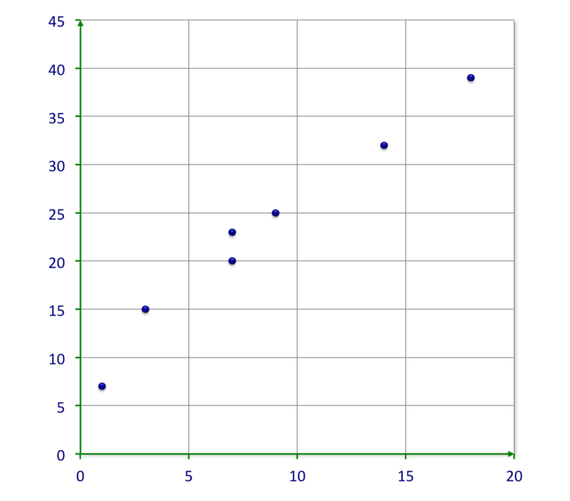
    
    \[Figure 13\]
    
6.  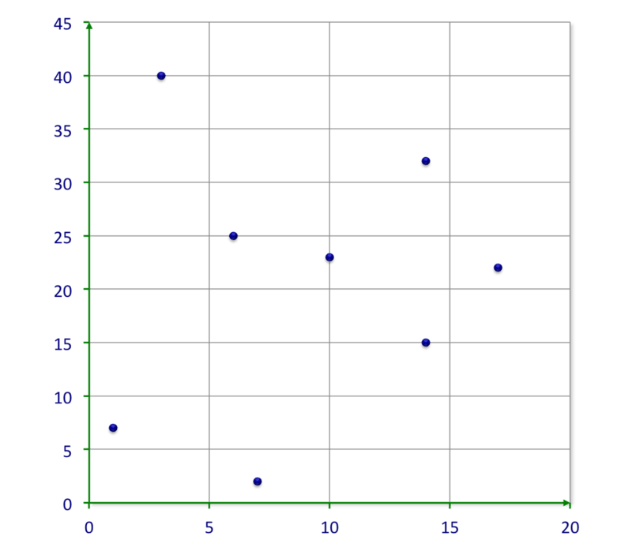
    
    \[Figure 14\]
    
7.  Use the following table to make a scatter plot.

$$
\begin{align*}
& x \qquad \ 3 \qquad \ 6 \qquad \ 8 \qquad \ 14 \qquad 18 \qquad 23 \qquad 29 \qquad 32 \qquad 37\\
& y \qquad 55 \qquad 50 \qquad 46 \qquad 40 \qquad 37 \qquad 18 \qquad 26 \qquad 20 \qquad 18
\end{align*}
$$

8.  Draw a trend line.
9.  Identify the type of relationship.
10. Then predict the output values for the input values 10 and 40.

A zoologist studied the relationship between the kilometers from a lake and number of felines per 100 square kilometers. She found the following data:

$$
\begin{align*}
& \text{Distance from Lake} \qquad 3 \qquad \ 1 \qquad \ 4 \qquad 3 \qquad 4.5 \qquad 5 \qquad .5 \qquad 2 \qquad 2.5 \qquad 3.5 \qquad 8 \qquad 6 \qquad 5\\
& \# \text{ of Felines} \qquad \qquad \quad \ 5 \qquad 10 \qquad 2 \qquad 8 \qquad \ 6 \qquad \ \ 5 \qquad \ 8 \qquad 8 \qquad \ 6 \qquad \ \ 6 \qquad \ 0 \qquad 2 \qquad 4
\end{align*}
$$

11. Make a scatterplot that illustrates this data.
12. Draw a trend line.
13. Use slope and $y$\-intercept to calculate the equation of your trend line.
14. Use your equation to estimate the number of felines 1.5 kilometers from a lake.
15. Use your graphing calculator to create a scatterplot and calculate the linear regression.

Directions: Define the following terms.

16. Input value
17. Output value
18. Positive correlation
19. Negative correlation
20. No correlation

</article>

### 10.5 Misleading Statistics

<article>

Introduction
------------

**_Fundraising_**

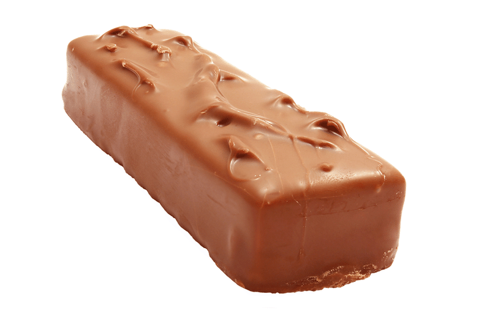

“It is easy to sell and not expensive,” Chris says as he sells candy bars at lunch time.

At the end of the fundraiser, the team began to tally up their totals. Mark sold 72 bars and Clint sold 65 bars. Mark wants to make it look like he has sold more than Clint. Is this possible? How can he do it?

**To accomplish this goal, while a dishonest, Mark will need to create a graph with misleading statistics. This happens all the time in the real – world. We will use Mark and Clint as an example of how easily people can be lead astray by misleading statistics.**

**_What You Will Learn_**

In this lesson, you will learn how to complete the following skills.

* Identify and analyze misleading data displays.
* Identify and explain misleading comparisons of data.
* Design data displays to intentionally exaggerate or minimize possible comparisons.
* Revise data displays to eliminate misleading representations or conclusions.

**_Teaching Time_**

I. **Identify and Analyze Misleading Data Displays**

**What does it mean to mislead? When we mislead someone, we want them to think something other than what is the truth. Sometimes, there can be data displays that are misleading. Let’s think about this.**

When we have built graphs and plots, we have taken care to show the data correctly by choosing appropriate intervals and scales. There are a variety of ways that graphs can be displayed in a way that is misleading. At times, we simply make mistakes. Other times, however, people may try to convince us of something by manipulating a graph that may otherwise not truly support the data. We must keep a critical eye when we read graphs and compare the data.

Example

Consider the graph below of the Yula High School Graduation Rate.

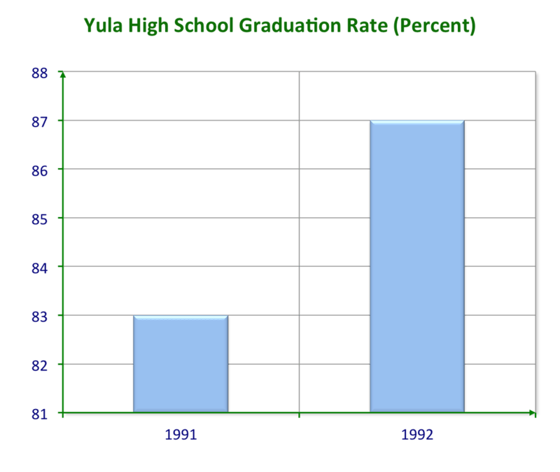

What do the bars show you about the graduation rate at Yula High School?

It appears that the graduation rate skyrocketed. However, if you look at the scale on the $y$\-axis, you can see that the entire graph is not represented. The scale only represents a range from 81 to 88 percent. This exaggerates the difference in the data. Was there an improvement from 1991 to 1992? Yes. But the improvement was only 4% where the bars can mislead into thinking that the improvement was much greater.

**So you can see that the size of the intervals and bars can impact the way we interpret the data.**

Example

A sales manager at Bank X prepared a report of the number of new clients they have in the quarter compared to their competitors. He prepared a graph and declared that, although they had fewer new clients, they’re not far behind. What do you think?

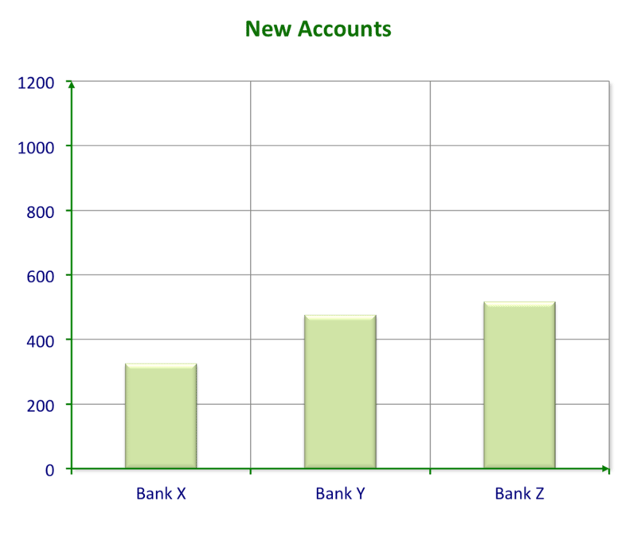

| **Bank X** | **Bank Y** | **Bank Z** |
| --- | --- | --- |
| 325 | 475 | 517 |

Bank Y has 46% more new clients and Bank Z has 59% more new clients than Bank X. Because the scale on the $y$\-axis goes up to 1200, it decreases the relative size of the bars on the graph. An appropriate scale would extend to no further than 600.

**Once again, we have to look at how the graph is constructed to see if the data is misleading or not.**

II. **Identify and Explain Misleading Comparisons of Data**

We can also look at what it means when we have data that compares. In the last example, we compared different banks with new accounts. We can also look at comparisons within other arenas. Once again, look for misleading representations of the data.

Example

A hospital director was up for his evaluation. He wanted to show that he has helped the community in his years on the job. He prepared this graph for the evaluation committee to show how his work has helped to reduce cases of the flu.

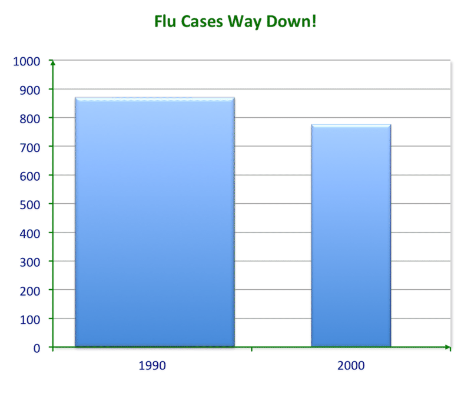

No. What trick did he use to mislead the committee? He did not change the scale but changed the size of the bar. The 1990 bar is very wide; it gives the appearance of being much bigger than 2000. Of course, the width of the bar does not make a difference for what the graph means. The flu cases dropped from about 875 to about 775. It is about a 12% decrease.

**You can see that even if the comparison looks like it is true, we have to examine the actual data to see if the data display is accurate or misleading.**

III. **Design Data Displays to Intentionally Exaggerate or Minimize Possible Comparisons**

As you can see, it is important to keep an eye on the data and the way that it is presented to us. In order to improve your skills in spotting misleading data, let’s see how you can design data displays to intentionally exaggerate or minimize comparisons. Look at this example.

Example

Mei Ling knows that her grade point average has dropped but doesn’t want her parents to notice. It went from 3.75 to 3.25 in one semester. How can she change manipulate a graph to mislead them? She decides to change the width of the bars to make the lower score look bigger.

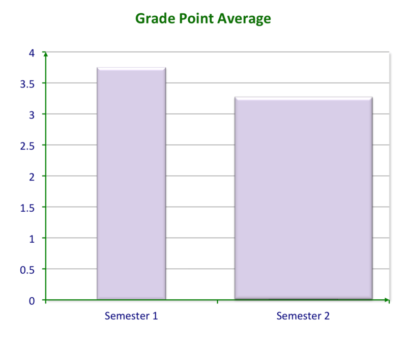

IV. **Revise Data Displays to Eliminate Misleading Representations or Conclusions**

Now that you know how to look for misleading data representations and how to create data displays that are intentionally misleading, we can move on to correcting misleading displays. Once you have discovered that a display is misleading, the next step is to help to revise the data display so that the data is accurately shown.

Four team members on the swim team recorded the following data for the 400 meter relay.

| **Team Member** | **David** | **Manual** | **Andre** | **Luke** |
| --- | --- | --- | --- | --- |
| Seconds | 32.5 | 36  | 34  | 33.5 |

David made a graph of the data. Here is his graph.

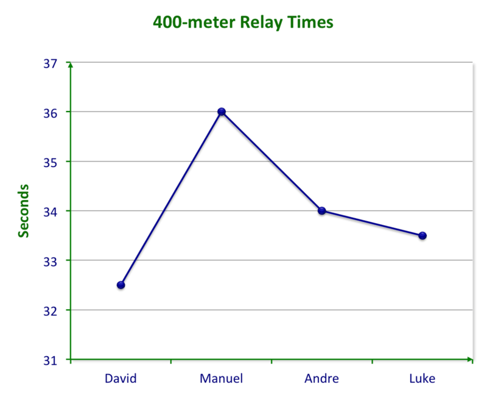

Manuel made the graph this way.

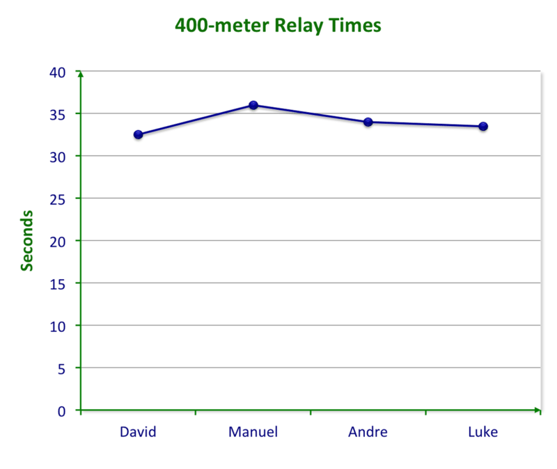

Now let’s go and apply what we have learned to the problem from the introduction.

Real-Life Example Completed
---------------------------

**_Fundraising_**

**Here is the problem from the introduction. Reread it and then create a graph to mislead. When finished, correct your work with a friend to show an accurate graph.**

Because the track team is going to regionals, they need to raise some money for the bus and the hotel. The boys team has decided to work on selling chocolate bars. They figure that this will be an excellent choice for a bunch of students.

“It is easy to sell and not expensive,” Chris says as he sells candy bars at lunch time.

At the end of the fundraiser, the team began to tally up their totals. Mark sold 72 bars and Clint sold 65 bars. Mark wants to make it look like he has sold more than Clint. Is this possible? How can he do it?

**_Solution to Real – Life Example_**

**Here is how we can create a misleading graph.**

**Create a bar graph and skip numbers in the scale. In an appropriate graph, a scale may reach 75 or 80, beginning from 0. However, if Mark skips 0-60 on her scale, the bars will look extremely different.**

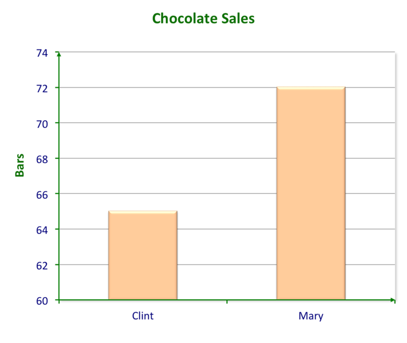

**Now work with a partner and create a graph that is accurate and shows that Clint sold more bars than Mark did.**

Time to Practice
----------------

Directions: Answer each of the following questions true or false.

1.  To sell more a product, a company may create a display that misleads consumers.
2.  You can create a graph to make it look like you have sold more of a product that you actually have.
3.  Misleading statistics aren’t that relevant in sales.
4.  Graphs aren’t actually misleading at all.
5.  You can create a misleading graph only if your intervals are too small.
6.  You can create a misleading graph whether your intervals are too small or too big.
7.  The height of the bars in a bar graph can be misleading.
8.  If the bars of a graph are too wide this can be misleading too.
9.  You must be careful whenever you read a data display to be sure that the data is accurate.

Directions: Why are the following graphs misleading? What is the error in the conclusions drawn based on the graphs?

10. 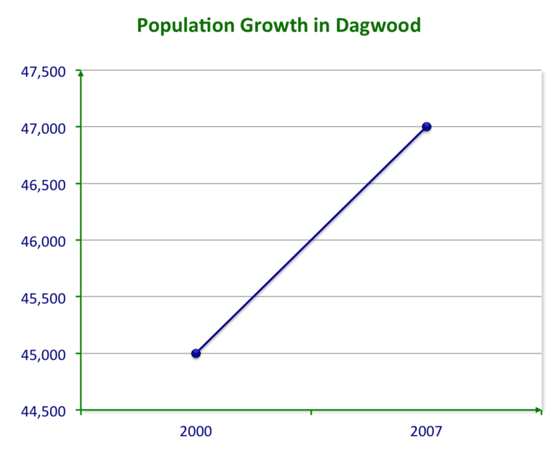
    
    \[Figure 11\]
    
    Conclusion: “The population in Dagwood is exploding!”
11. 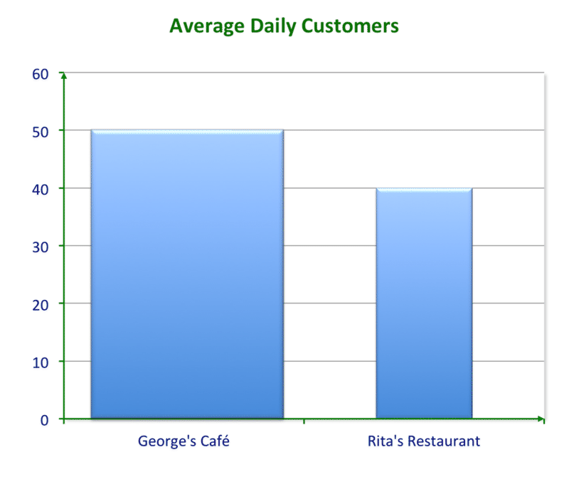
    
    \[Figure 12\]
    
    Conclusion: “George’s Café is far more successful than Rita’s Restaurant.”
12. Draw a graph to intentionally exaggerates this data: “From 2002 to 2004, the average number of semesters that students studied in order to complete their Bachelor’s Degree increased from 4.1 to 4.5.”
13. Explain the faulty conclusion that could be drawn from this graph.
14. Draw a graph to intentionally minimizes this data: “Mike had 110 customers on his paper route in March and in June only 75.”
15. Explain the faulty conclusion that could be drawn from this graph.
16. Revise your graph in number 3 to represent the data more accurately.
17. Revise your graph in number 5 to represent the data more accurately.

</article>

### 10.6 Using Data Displays

<article>

Introduction
------------

**_Team Shirts_**

“What’s the matter?” his friend Mattias asked.

“This shirt doesn’t fit and this always happens to me. I am going to figure out why!” Jacob said taking off the shirt where the sleeves were too short once again.

After Jacob’s anger had subsided, he started to think about this question. Was he the only one with this problem? Jacob decided to find out by measuring his peers’ heights and arm lengths. He used inches and create a table like this:

$$
\begin{align*}
& \text{Height (in)} \qquad \qquad \ 52 \qquad 53 \qquad 56 \qquad 58 \qquad 59 \qquad 62 \qquad 64 \qquad 65 \qquad \ 66 \qquad \ 67 \qquad 68 \qquad 69 \qquad 70\\
& \text{Arm Length (in)} \qquad 22 \qquad 23 \qquad 24 \qquad 23 \qquad 24 \qquad 27 \qquad 25 \qquad 25 \qquad 25.5 \qquad 26 \qquad 27 \qquad 27 \qquad 28
\end{align*}
$$

**Now that Jacob has his data done, he needs to create a display. Which one should he create? Think about this question throughout this lesson and in the end, you will help Jacob create the appropriate display for his data.**

**_What You Will Learn_**

* Associate given conclusions about sets of data with given line graphs, scatterplots, circle graphs, bar graphs, stem-and-leaf plots, box-and-whisker plots and histograms.
* Select and justify appropriate displays of given categorical and numerical data.
* Collect, organize and compare displays of real-world categorical and numerical data.

**_Teaching Time_**

I. **Associate Given Conclusions about Sets of Data with Given Line Graphs, Scatterplots, Circle Graphs, Bar Graphs, Stem-and-Leaf Plots, Box-and-Whisker Plots and Histograms**

As you have seen, data can exist in many forms. A frequent goal of collecting data is drawing conclusions based on the data. The best conclusions correspond with trends that the data shows. Depending on the data you have, certain types of displays are more appropriate or more effective than others. We must make good choices of displaying data in a logical way. Of course, in a world so full of data, it must be collected and organized carefully to aid in appropriate decision-making.

Sometimes two people look at the same graph and draw completely different conclusions. Graphs can show us many things but the conclusions that we draw based upon the graphs is oftentimes more a matter of opinion. The idea of graphs is, in part, to make inferences. Those inferences must be based on the data.

Let’s look at an example.

Example

Some scientists from the EPA were studying the amount of dissolved oxygen in a lake over several weeks. This graph was created by the data they found.

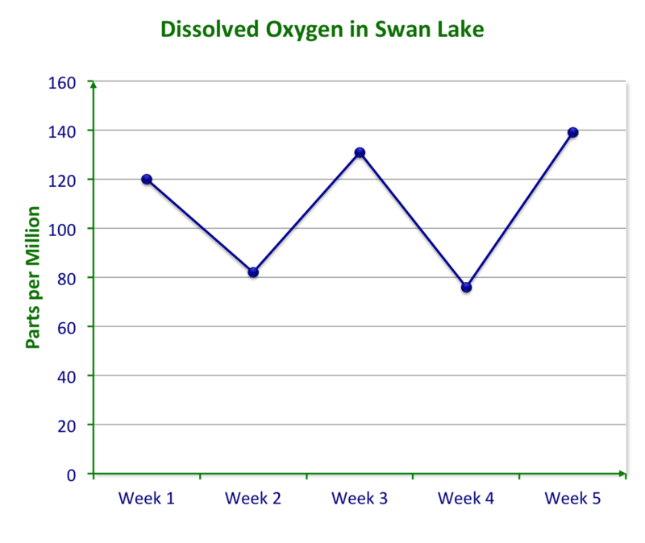

1.  The amount of dissolved oxygen fluctuated over the 5 weeks.
2.  The average amount of dissolved oxygen has been about 110 parts per million over 5 weeks.
3.  The dissolved oxygen in Week 6 will be about 60 parts per million.

**Do you agree with their conclusions?**

**The first two conclusions are clearly shown by the data. However, the prediction about Week 6, conclusion number 3, is not convincingly shown. The level of dissolved oxygen does seem to fluctuate and has gone slightly higher over time and then lower, but it is not enough evidence to be sure that the Week 6 dissolved oxygen will go even lower.**

Example

The boss at an office took a survey of people’s preference for lunch because he wanted to treat the office to a lunch for the holidays. His data is shown below.

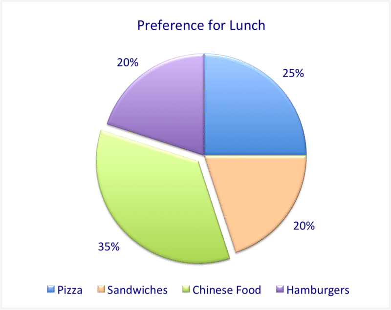

1.  A lot of people like Chinese food.
2.  Nobody likes Italian food.
3.  If I order sandwiches, then 80% of the staff will be unhappy.
4.  If I get some pizzas and some Chinese food, the majority will have their preference.

**Do you agree with his conclusions?**

**According to the graph, Conclusion 1 is supported because the largest number of people selected Chinese food.**

**The graph does not support Conclusion 2. Perhaps Italian food was not an option on the survey. Also, just because you have a preference does not mean you don’t like the other choices.**

**For the same reason, Conclusion 3 is not supported, either. Just because you may prefer Chinese food does not mean you do not like sandwiches.**

**Conclusion 4 is supported because 25% prefer sandwiches and 35% prefer Chinese food so 60%, a majority, will have their preference.**

Example

A tally of the animals at a local shelter was taken so that children visiting on a field trip could see. Here are the results.

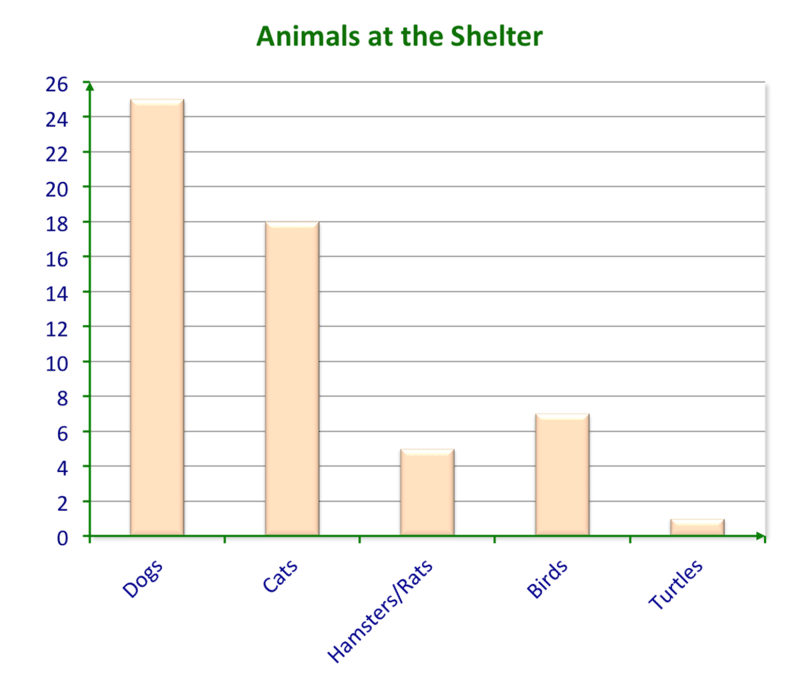

Bobby: “Nobody likes dogs!”

Lisa: “I didn’t know that hamsters and rats were the same thing!”

Miguel: “Everyone must have taken all the turtles!”

Mona: “They must have mostly food for dogs and cats!”

The teacher responded to their comments patiently:

“Bobby, just because they have a lot of dogs doesn’t mean people don’t like them. Since dogs are the most common pet, it makes sense that there would be more dogs at the shelter.”

“Lisa, it looks like hamsters and rats were tallied in the same category, maybe because they are kept in the same cage or given similar food. This bar graph does not mean they are the same, though.”

“Miguel, since turtles are a less common pet, the shelter probably has fewer turtles. It doesn’t mean that they had a lot that were taken already.”

“Yes, Mona. It does make sense that having so many dogs and cats compared to other animals requires much more food for them than for the other animals. Also, they are bigger animals than the others, generally, so they eat more, too. Don’t they?”

**Once again, a data display was used to make connections. The children used the graph from the animal shelter to draw conclusions.**

Example

A market research firm collected data on the ages of customers at a surf shop. Look at the stem-and-leaf plot they created based on the data:

$$
\begin{align*}
\text{Sally's Surf Gear} & \qquad \text{Customer Age Survey}\\
& \begin{array}{c|c c c c c c c c} 1 & 2, & 4, & 5, & 5, & 6, & 8, & 8, & 9 \\
2 & 0, & 1, & 1, & 4, & 5, & 7, & 8 \\
3 & 1, & 3, & 5, & 5 \\
4 & 5, & 6 \\
5 & 2, & 4 \\
6 & 0 \\
7 \\
\end{array}
\end{align*}
$$

These are the recommendations they made for marketing:

1.  Most of your customers are in the teens and twenties so focus advertising on them.
2.  People older than 60 don’t like surfing. Forget about them.
3.  Men like surfing more than women so advertise in men’s magazines.

Sally looked at the same graph but didn’t agree with all of their conclusions.

1.  Yes, most of my customers are less than 30, I should focus advertising efforts on them. However, I may want to draw in customers in age ranges that are not already clientele.
2.  This data does not show that people over 60 do not like surfing. Not all of my customers are represented here. Also, although generally surfing may be too strenuous for the elderly, it doesn’t mean that they don’t like it.
3.  This tally does not consider gender. The conclusion about women not liking surfing is not based on the tally but on the ridiculous bias of the marketing company.

**There are a couple of things that we can decide after looking at these examples. First, you can see how useful different displays of data are depending on the information that has been collected. Then you can see that we can use many different displays. The key is to think about what information you have gathered and how you want the information displayed. Then move on to building the correct visual. In the next section you will see how selecting the appropriate display is done.**

II. **Select and Justify Appropriate Displays of Given Categorical or Numerical Data**

There are many ways to display data so how do you know which is the best way to display given data? Some choices are simply preferential but most types of data have types of displays that suit them best.

**Types of Data**

**Two major types of data are categorical data and numerical data.** **_Categorical data_** **refers to data to which the independent variable is assigned a name, not a number.** For example, you may take data based on the months May, June, July, and August or you may tally people based on males and females. Sometimes categories can be numbers that are used to name the categories. For example, players on a team are given numbers on their shirts. Those numbers are only used to clarify who is who. It would not make sense to use mathematical operations with the numbers. Generally, categorical data is simply tallied.

The second type of data is numerical. **_Numerical data_** **measures some characteristic of the variable. Examples of data that is measured numerically are time, height, weight, length, volume, density, force, etc. Anything that can be measured with a numerical system is numerical data.**

**Types of Displays**

In the previous section, we considered conclusions based on line graphs, scatterplots, circle graphs, bar graphs, stem-and-leaf plots, box-and whisker plots, and histograms.

There are many more types of displays of data, but let’s stick with these for now. Although there are few exact rules about data displays, each type of display has certain instances for which it is ideal. Also, there are instances where certain displays are inappropriate. Furthermore, the best display of data depends on what information you hope to get from it.

**Line graphs** are generally used to show change over time. **Scatterplots** are used to show a trend or a relationship (correlation) between to variables. **Circle graphs** are best to show data that represents one whole or one hundred percent of something. **Bar graphs** are excellent for categorical data. **Stem-and-leaf plots** are useful to represent ranges and can be used to illustrate ranges of two variables. **Box-and-whisker plots** are used to show how spread out data is and where the bulk of the data lies.

III. **Collect, Organize and Compare Displays of Real – World Categorical and Numerical Data**

Collecting data is not a task for only scientists, mathematicians, and researchers. You can do it, too. As you can see in all of the tables given, it is important to organize the data, usually done in tables. Secondly, it is important to know what type of measure(s) and unit(s) you will be using. Is your variable categorical or numerical? Then you can decide what type of display is best for your data and analyze your results.

Your teacher complains about having more students than all of the other classes. You wonder if this is true and ask your friends to tally the number of students in their classes. At lunchtime they tell you the following information.

Room 301 has 32 students. Room 302 has 27 students. Room 303 has 36 students. Room 304 has 30 students. Your room, Room 305, has 34 students.

This data is hard to compare if it is not organized in some fashion. You decide to make a table.

$$
\begin{align*}
& \text{Room} \qquad \qquad \quad \ 301 \qquad 302 \qquad 303 \qquad 304 \qquad 305\\
& \# \text{ of Students} \qquad 32 \qquad \ \ 27 \qquad \ 36 \qquad \ \ 30 \qquad \ 34
\end{align*}
$$

**This is categorical data, and it is best displayed as a bar graph.**

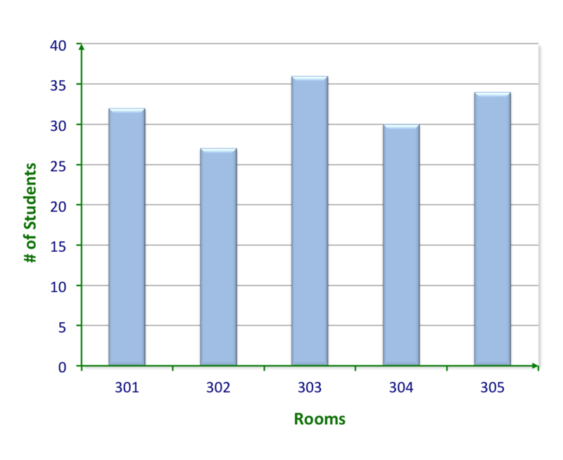

**Now let’s look at the problem from the introduction and work on solving it.**

Real-Life Example Completed
---------------------------

**_Team Shirts_**

**Here is the original problem once again. Reread it and then create a data display.**

“I can’t believe it!” Jacob exclaimed trying on his new long sleeved team shirt for the track team.

“What’s the matter?” his friend Mattias asked.

“This shirt doesn’t fit and this always happens to me. I am going to figure out why!” Jacob said taking off the shirt where the sleeves were too short once again.

After Jacob’s anger had subsided, he started to think about this question. Was he the only one with this problem? Jacob decided to find out by measuring his peers’ heights and arm lengths. He used inches and create a table like this:

$$
\begin{align*}
& \text{Height (in)} \qquad \qquad \ 52 \qquad 53 \qquad 56 \qquad 58 \qquad 59 \qquad 62 \qquad 64 \qquad 65 \qquad \ 66 \qquad \ \ 67 \qquad 68 \qquad 69 \qquad 70\\
& \text{Arm Length (in)} \qquad 22 \qquad 23 \qquad 24 \qquad 23 \qquad 24 \qquad 27 \qquad 25 \qquad 25 \qquad 25.5 \qquad 26 \qquad 27 \qquad 27 \qquad 28
\end{align*}
$$

**_Solution to Real – Life Example_**

**By using a scatterplot, Jacob can compare the two variables, which are both numerical data, at once to see if there is a relationship. Here are the results.**

. It looks like his measurements are slightly different than the normal student. For this reason, your shirts don’t seem to fit quite right.**")

Vocabulary
----------

Here are the vocabulary words that are found in this lesson.

__Numerical Data__

Data that is assigned a name and not a number.

Time to Practice
----------------

Directions: Answer each question about data displays.

1.  What is considered numerical data?
2.  What is considered categorical data?
3.  If you were looking for a relationship between two values, would you use a scatterplot or a line graph?
4.  If there was a relationship between the data would you have a positive correlation or a negative correlation?
5.  The words positive correlation and negative correlation are associated with which type of data display?
6.  If you had an outlier, then would you have a scatterplot or a box-and-whisker plot?
7.  What is a quartile?
8.  Which type of data display is a quartile associated with?
9.  If you were watching a trend over time would you use a line graph or a scatterplot?
10. If you were comparing two trends and their results which data display would make the most sense?
11. What is the mean?
12. What is the median?
13. What is the mode?

Directions: Answer each question.

Do the conclusions fit the graph? Explain your reasoning.

14. 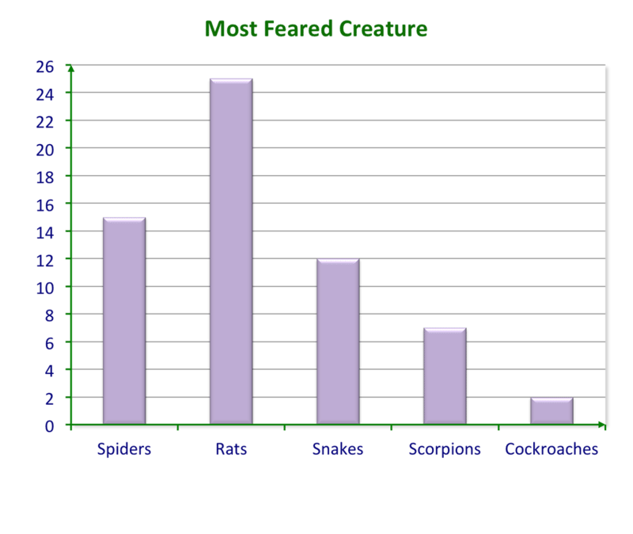
    
    \[Figure 10\]
    
    Conclusion 1: Rats are the most feared creature. Conclusion 2: Rats are the most dangerous creature. Conclusion 3: Nobody is afraid of bats.
15. 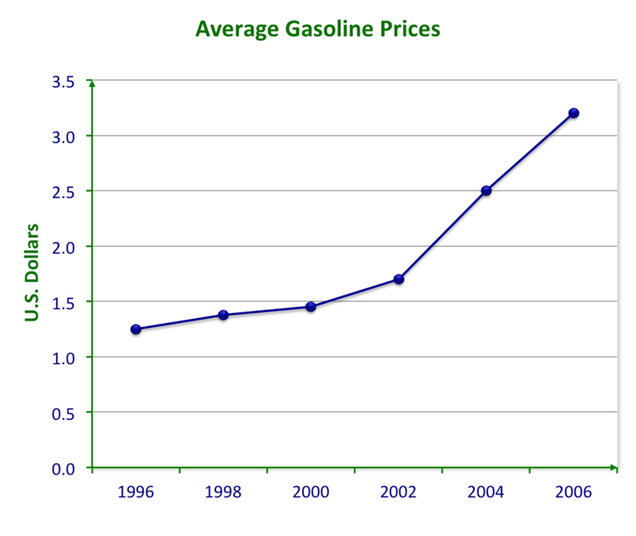
    
    \[Figure 11\]
    
    Conclusion 1: Prices have increased every year for 10 years. Conclusion 2: Prices of gasoline increased more rapidly after 2000. Conclusion 3: Prices will be even higher in 2008.

Create a graph for the following sets of data. Explain your choice.

16. $$
    \begin{align*}
    & \text{Player } \# \qquad \qquad \qquad \ 14 \qquad \ 28 \qquad 36 \qquad 45 \qquad 52\\
    & \text{Homeruns per Year} \qquad 31 \qquad 10 \qquad \ 0 \qquad \ 19 \qquad 47
    \end{align*}
    $$
    
17. A class survey shows the following chocolate preferences: 16 milk chocolate, 10 dark chocolate, 4 white chocolate

Brainstorm ideas of data that you can take in your class or in your life. Take the data and create a data display. Then answer:

18. How did you organize the data?
19. What units did you use?
20. Was it categorical or numerical?
21. Why did you choose that data display?
22. What conclusions can be drawn based on your data display?

</article>

### 10.7 Collecting Data

<article>

Introduction
------------

**_The Team Tally_**

All of the boys ran and at the end of it they asked Carla for the times. Although five boys ran, she had only recorded the scores of three boys.

“Why did you do that?” Marco asked.

“I only recorded the first three to cross the finish line,” Carla explained. “At the race, those will be the three winners.”

“But that isn’t accurate?” Marco explained.

**Who is correct? In this lesson you will learn about collecting data. By the end of the lesson, you will be able to determine and create an argument that supports Carla or Marco as correct.**

**_What You Will Learn_**

By the end of this lesson you will be able to complete the following skills.

* Classify sampling methods as random, stratified random, systematic, convenience and self-selected.
* Identify and discuss potential bias in sampling methods.
* Identify and compare potential bias in survey questions.
* Compare, analyze and interpret population survey data and sample survey data.

**_Teaching Time_**

I. **Classify Sampling Methods as Random, Stratified Random, Systematic, Convenience and Self – Selected**

**A common tool that people use to gather information about a population is a survey.** A population can refer to any group about which information is desired. In other words, if you want to know about the opinions of students in your school, then the population is the entire school. The population could be an entire city, country, or even a group of plants, animals, or things. As you can imagine, a population can be very large. For this reason, it is oftentimes impractical or even impossible to get information on every single member of the population. In order to save time and resources, we may survey only a small percentage of the population. In order to make sure that the information we gather from a small percentage is representative of the entire population, we use techniques to choose the members that we survey.

Of course, sometimes people hope to see a certain outcome. They desire to prove their hypothesis correct for one reason or another. For this reason, we have to watch out for potential bias in a survey. **When surveys are carried out appropriately, the information that they tell us can be most useful.**

Let’s think about an example.

Example

Every year at Monica’s middle school, a vote for the student with the best smile takes place. This student is honored by having his or her face on the front of the yearbook. Monica wants to win. She’s competing again four other students who are in different classes: Winthrop, Penelope, Giovanna, and Oscar. A week before the official vote, she wants to take a survey to see for whom other students will be voting. There are 2000 students in her school, though, and she knows that she cannot ask everyone. She’ll have to take a sample, a small part of the population, and assume that the information they give her is true for the rest of the school. She plans to ask 50 people. In order to choose the 50 people that she asks, she can use a variety of methods.

**To help Monica, let’s think about the different types of samples that can be collected.**

**Sampling Methods**

**Random Sampling**: Monica can take a random sample by giving each student in the school an equal opportunity of being chosen. Like a lottery machine that uses ping-pong balls to choose winning numbers, Monica would have to select students completely randomly. For example, if she had a list of students, she could mix up the names and choose the first 50 with her eyes closed.

**Stratified Random**: In this method Monica would make sure that she selected an equal number of students in certain strata. _Strata_ means layers or levels. In her school, students are in levels by grade. In this case, _strata_ can also refer to gender and educational program. If she randomly chooses 25 girls and 25 boys, she is using a stratified random method.

**Systematic Sampling**: Monica may also decide to sample students in a systematic manner. That is, she could stand at the front of the school or in the lunch line and sample every $20^{th}$ student. This way, she would get approximately 50 students, assuming that they all attend school on the given day and they all come through the same door or go to lunch. If they do not, then she may not get a representative sample; the sample would be biased.

**Convenience Sampling**: If Monica finds these methods too difficult, she could go with an easier route—ask the first 50 students that walk by her homeroom, for example. This is called convenience sampling; it is the method that is easiest because it selects the members of the population to whom the sampler has the most access. The problem is that this method does not ensure a representative portion of the entire population. If she is in advanced biology, for example, and asks only students in that room or only students who walk by that room, they may have different views than students in the rest of the school. Perhaps the fact that they share a class or grade level with her will make them more likely to vote for her. That may not be true of the rest of the school.

**Self-Selected**: There are many people who like to be asked. They like that their opinion counts, they like to express their points-of-view, they like to participate, they like to help, or they like to influence an outcome. For whatever reason, some people may choose to participate if you give them the chance. If Monica walks around with a sign that says, “Tell me who you’re voting for,” she allows members of the population to select themselves. You may have seen taste-tests in local malls, for example, that have signs reading: “Choose your favorite soda.” People who participate are self-selecting. As with convenience sampling, this may not be a representative portion of the population. People who do not select to participate may have different views from those that do participate.

II. **Identify and Discuss Potential Bias in Sampling Methods**

A key concern in sampling methods is getting a representative group of the entire population. This gives the study validity; it helps us to believe what the results of the study say. However, many sampling methods are biased—they give an unfair preference to a certain group or exclude a certain segment of the population—which gives us less confidence in the results.

**Any sampling method that favors one group or gives a group a smaller likelihood of participating is biased. Let’s look at an example.**

Example

A school polls parents about traffic congestion in the morning. They ask the parents of every 3rd car in the school drop-off area before school bell rings to rate the traffic.

**Let’s think about this method of sampling. Is it the best one? Is it biased?**

**If there is traffic congestion, some people may be arriving late. This sampling method is biased because it only includes people who arrive on time. Their opinions may be different from those that arrive late. Therefore, this is not the best way to gather a sampling.**

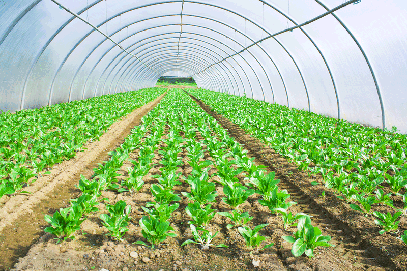

A biologist measures the growth of plants but only samples plants near the entrance because she cannot reach plants in the middle of the greenhouse.

**The plant growth may not have been the same near the door as in other parts of the greenhouse. She used convenience sampling which is not always the best choice for a sample.**

III. **Identify and Compare Potential Bias in Survey Questions**

What is bias? Bias is when one group of people is targeted more than another group. This provides only a specific view of the situation. Survey questions can reveal bias in the survey itself. Sometimes the people who create surveys hope for certain results and create questions to steer the answers. At other times, there are inadvertent cultural biases based on religion, language, age, economic level, etc. **We can learn to spot potential bias in survey questions by looking for questions that exclude a particular group or only include specific groups.**

Can you find bias in the following questions?

| **Question** | **Possible Bias** |
| --- | --- |
| 1. When you visited the restroom, was the cleanliness a) bad, b) okay, c) good? | There is the assumption that the person visited the bathroom. |
| 2. At what time of the day do you usually use your swimming pool? | There is the assumption that the person has a swimming pool. |
| 3. Which do you think is the most powerful book in the Bible? | There is the assumption that people belong to a certain religion or knows about the Bible. |
| 4.What was more important to the history of America, the Emancipation Proclamation or Women’s Suffrage? | There is the assumption that people are familiar with these issues from U.S. history and that they understand the words. |
| 5.Do you think you should go to church every Sunday? | There is the assumption that people believe in these ideas. |

**If a person taking a survey does not feel like the options available for a question do not accurately represent his or her true response, a bias in the survey has occurred.** They may feel confused or frustrated. In some cases, they may not even understand the meaning of the question because their education or background did not prepare them or they don’t even speak the language in which the survey is written.

Finally, some people may not be willing to tell the truth, for one reason or another. If a person is asked to identify themselves and then reveal confidential or personal information, they may not answer truthfully. They may not even take the survey seriously and not answer in a sincere manner.

IV. **Compare, Analyze and Interpret Population Survey Data and Sample Survey Data**

When a survey is complete, there is still a lot of work to do. As you have seen in previous lessons, data can be analyzed using a great many choices of displays and statistical measures. From these data analyses, we hope to make some generalizations about the population at large. We also hope, at times, to make decisions based on the data.

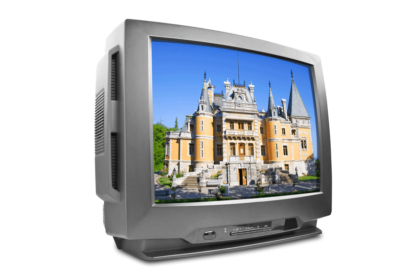

A number of children were surveyed about the amount of time that they watch TV and the amount of time that they spend studying. The study was completed at a charter school that specializes in college preparation for first-generation Americans. Three students from each class were randomly chosen to participate in the survey. Their results are shown in the table below:

| TV  | 3.5 | 3.5 | 3.5 | 5   | 3   | 1   | 1   | 0   | 0   |
| --- | --- | --- | --- | --- | --- | --- | --- | --- | --- |
| Studying | 2   | 1.5 | 2.5 | 1   | 3.5 | 4.5 | 5   | 5   | 1   |
| TV  | 1   | 2   | 2   | 2   | 1.5 | 0   | 0.5 | 4   | 4   |
| Studying | 3.5 | 7   | 6   | 5.5 | 5   | 6   | 4   | 0.5 | 1   |
| TV  | 4   | 6   | 3   | 4   | 3   | 6   | 6.5 | 1   | 1   |
| Studying | 1.5 | 1   | 4   | 2   | 4.5 | 0   | 0.5 | 7   | 1   |

Clearly, this data is difficult to interpret in this form. Because the school is looking for a relationship between TV time and studying time, a scatterplot is an excellent display of the data.

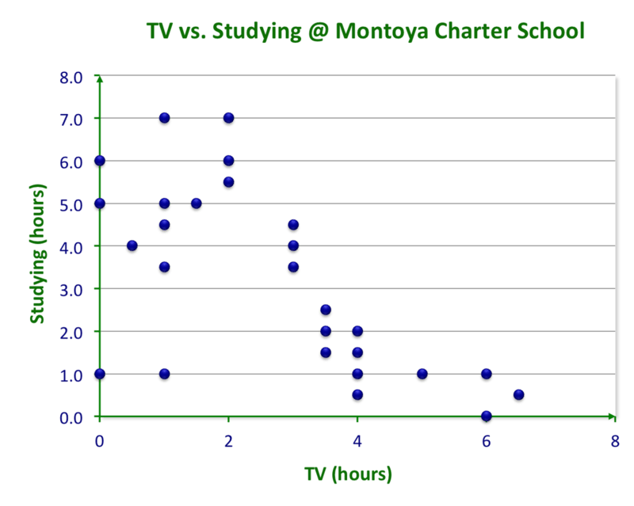

1.  Montoya Charter School students who watch more than 2 hours of TV do not study.
2.  Children in the United States watch too much TV.
3.  Students who do not study enough will get low grades.
4.  TV is causing students to be less interested in school.

**What is wrong with their conclusions based on the data?**

1.  The data shows that many students who watch more than 2 hours of TV do study although generally fewer hours.
2.  This sample was only taken at a charter school that serves a specific population. You cannot generalize this data to other populations like the entire United States.
3.  There is no data in this study that relates studying time to grades.
4.  A scatterplot does not imply causation, only correlation; the variables are shown to have a negative relationship, but that does not mean that one causes the other. If you take television time away from students, it does not mean that they will necessarily study more nor be more interested in school.

**Now let’s go back to the problem from the introduction.**

Real-Life Example Completed
---------------------------

**_The Team Tally_**

**Here is the problem from the introduction. Reread it and then write whether Carla or Marco is correct and why.**

A group of boys decided to practice their times for the 400 meters one day after school. Five of the boys on the track team gathered together and all decided to practice. They figured out that the best way to do it was to have each person start in turns. One person would run, then the next and then the next until everyone had run. Carla came too so that she could run the stop watch and record the times.

All of the boys ran and at the end of it they asked Carla for the times. Although five boys ran, she had only recorded the scores of three boys.

“Why did you do that?” Marco asked.

“I only recorded the first three to cross the finish line,” Carla explained. “At the race, those will be the three winners.”

“But that isn’t accurate?” Marco explained.

**_Solution to Real – Life Example_**

**Marco is accurate on this one. The boys all started at a different time. Therefore, the order that they crossed the finish line does not help in determining who was fastest. You have to calculate each time to figure this out. Time, not order is what makes the difference here.**

Vocabulary
----------

Here are the vocabulary words that are found in this lesson.

__Survey__

a method of gathering information about a population.

__Random Sampling__

everyone has an equal chance of being chosen because there isn’t a specific method by which the information is gathered.

__Stratified Sampling__

An equal number is selected from each level.

__Systematic Sampling__

There is a system that has been developed for gathering each sample.

__Convenience Sampling__

a sampling is collected based on first or last.

__Self-Selected Sampling__

Sampling people who like being asked.

Time to Practice
----------------

Directions: Define each of the following terms.

1.  Survey
2.  Random sample
3.  Stratified sample
4.  Systematic sample
5.  Convenience sample
6.  Self Selected sample

Directions: Match the sampling method with the example.

7.  A mother asks everyone in her office-building about the best restaurant in town. - a. Random Sampling
8.  A police traffic stop pulls over every $3^{rd}$ car to check for proper insurance. - b.Stratified Sampling
9.  A phone company uses a computer to choose customer for a satisfaction survey. 5% of each region are chosen randomly. - c. Systematic Sampling
10. People call a phone number given on a receipt at a restaurant to answer questions about cleanliness and service. Each person who calls gets entered into a drawing. - d. Convenience Sampling
11. A cattle herder checks for Mad Cow Disease by drawing blood from 30 cows that he chose by drawing their ID numbers from a hat. - e. Self-Selected Sampling
12. For each of the sampling methods in numbers 1-5 above, would you consider them biased or unbiased? Explain your answer.

Directions: Why are the following survey questions biased?

13. How old is your spouse?
14. How many times do you go to the park each month? a) 1-2, b) 3-5, c) 6-10, or d) more than 10
15. Which is more important, the First or Second Amendment of the Constitution?
16. Don’t you agree that equality for all Americans is important?
17. Use the following data to create a data display. Why did you choose this data display?
18. Then, analyze the data. What tendency do you see?
19. What conclusions can be drawn? What further research could be done on this topic? A stratified random survey is conducted regarding the best city for the next Winter Olympics. The results of 500 surveys are as shown below:

|     | **Beijing** | **Chicago** | **Buenos Aires** | **Paris** |
| --- | --- | --- | --- | --- |
| Women | 15% | 12% | 10% | 63% |
| Men | 13% | 53% | 12% | 22% |

</article>

### 10.8 Interpreting Data

<article>

Introduction
------------

**_The New Track_**

Yes, the track team the Hawks had taken first place at regionals. It was the talk of the town and the newspaper article seemed to suggest that great things were going to happen as a result.

“Well, I don’t want to disappoint you Sam, but 53% are for the new track but there is a 5% margin of error,” his Dad explained.

“What does that have to do with anything?”

“A lot. A margin of error can mean that the survey results aren’t completely accurate, or you could say that you can’t take them at face value,” his Dad said.

Sam is perplexed. 53% is 53%, or is it?

**In this lesson, you will learn all about margin of error. By the end of the lesson, you will understand how a margin of error can impact results.**

**_What You Will Learn_**

In this lesson, you will learn how to complete the following skills.

* Make population predictions based on representative survey data.
* Use given survey margin of error to determine upper and lower bounds of the interval containing a sample percent in which a population percent is most likely to lie.
* Interpret and evaluate conclusions of newspaper or magazine articles containing sample survey results or statistical displays.
* Analyze and interpret statistical data organized and displayed in a variety of forms, justifying conclusions.

**_Teaching Time_**

I. **Make Population Predictions Based on Representative Survey Data**

Drawing conclusions based on data is a major goal in gathering data. As you have seen, some data can be misleading and some conclusions can be doubtful. For that reason, it is important to keep an eye open for public information that may not be entirely based on data. We must be critical about where information comes from because biases may occur in the sampling methods, survey questions, display methods, and conclusions. Nevertheless, good science and math can lead to valuable information. Let’s look at how we can make predictions based on survey data.

A cellular phone company conducts a random survey in their service area regarding the problems encountered with phone service. They surveyed 700 people with cellular phones in a population of 125,000 people. They find the following results.

|     |     |     |     |
| --- | --- | --- | --- |Worst Problem with Telephone
| **Too Expensive** | **poor Signal** | **Not Enough Features** | **Ugly Design** |
| --- | --- | --- | --- |
| 39% | 33% | 16% | 12% |

**Based on their survey, they can extrapolate the data to the entire population.** In other words, when the survey was carried out in a proper manner, they can assume that the survey is accurate for the entire population. If there are 125,000 people in the population, they can assume that the same results found in the survey will be true for all of the 125,000 people. So, how many people will find the phones too expensive? Signal quality poor? Too few features?

**Calculate the percent found in the data of the entire population.**

Like this: $.39 \times 125000=48,750$

|     |     |     |     |
| --- | --- | --- | --- |Worst Problem with Telephone
| **Too Expensive** | **poor Signal** | **Not Enough Features** | **Ugly Design** |
| --- | --- | --- | --- |
| 39% | 33% | 16% | 12% |
| 48,750 | 41,250 | 20,000 | 15,000 |

**We could also calculate several other features such as mean, median and mode.**

Example

A high school conducts a survey for their foreign language program. They need to know how many sections of each class they need. There are 3,400 students in the high school and each class can have a maximum of 35 students in it. Of 200 students surveyed, they find the following number of student responses:

|     |     |     |     |     |     |
| --- | --- | --- | --- | --- | --- |Which foreign language class would you like to take?
| **Class** | **Spanish** | **French** | **German** | **Chinese** | **None** |
| --- | --- | --- | --- | --- | --- |
| \# of Responses | 85  | 35  | 39  | 23  | 18  |

In order to apply this information to the entire student body, the percentages are calculated. Then, each percent is applied to the entire student population.

|     |     |     |     |     |     |
| --- | --- | --- | --- | --- | --- |Which foreign language class would you like to take?
| **Class** | **Spanish** | **French** | **German** | **Chinese** | **None** |
| --- | --- | --- | --- | --- | --- |
| Percent | 42.5% | 17.5% | 19.5% | 11.5% | 9%  |
| Total for population | 1445 | 595 | 468 | 391 | 306 |

Based on this data, how many classes of each should they offer? Divide the number of students for each course by 35 students in each section.

| **Class** | **Spanish** | **French** | **German** | **Chinese** | **None** |
| --- | --- | --- | --- | --- | --- |
| \# of classes Needed | 42  | 17  | 14  | 12  | 0   |

**Because 35 is the maximum number of students, the number of classes must be rounded up to the next whole number. Classes cannot go over 35 and fractional classes cannot be offered.**

II. **Use Given Survey Margin of Error to Determine Upper and Lower Bounds of the Interval Containing a Sample Percent in which a Population Percent is Most Likely to Lie**

First, notice that in this section we are looking for things that are not true. This is not the usual way that we think through things, so we must keep this fact in mind as we work.

As you know, the method of choosing samples is important to find data whose results you can trust. The better the sampling method is the better the data collected. When data is gathered well, its results will be truer for the entire population. Nevertheless, most research companies and survey takers understand that it is actually quite difficult to find a perfect sample. **There will always be a** **_margin of error_****, or a percentage by which the true numbers for the entire population may differ.** In other words, a survey company may calculate a margin of error of $\pm 3 \%$. This means that the measurements for the entire population may vary either up or down by 3%.

Example

A survey company reports that 51% of people surveyed said they will vote for Candidate X (with a margin of error of $\pm 3 \%$).

**Can we be sure that Candidate X will win? No, since there is a margin of error of $\pm 3 \%$, it could be as high as $51 + 3$ or 54% or it could be as low as $51 - 3$ or 48%.**

A survey with a margin of error of $\pm 5 \%$ shows that 42% of participants reported preferring a shopping trip to the Sun Valley Mall versus a shopping trip to the Newberry Mall. If the population of shoppers that the two malls serve is 272,000 people, what might be the least number of people that prefer Sun Valley Mall and what might be the greatest?

|     | **Reported Preference to Sun Valley** | **Margin of Error** | **Extremes** | **\# of People in Population** |
| --- | --- | --- | --- | --- |
| Least | 42% | \-5% | 37% | at least 100,640 |
| Greatest | 42% | +5% | 47% | at most 127,840 |

III. **Interpret and Evaluate Conclusions of Newspaper or Magazine Articles Containing Sample Survey Results or Statistical Displays**

In modern media, particularly newspapers and magazines, it is common to find reports based on survey results. Oftentimes a margin of error is mentioned. Keep in mind, however, that although magazines and newspapers may intend to report just the news, there is oftentimes a bias based on the author’s opinions, the beliefs of the owners or managers of the companies, or a sheer desire to report exciting or eye-opening news with the intent to sell more issues. For this reason, we must keep a critical point of view when we match what an article might say to what the data tells us.

A local newspaper article entitled “More Beets than Meats” discusses more people switching over to vegetarianism. The article says, “In a hundred people surveyed in 1998, 8% reported being a vegetarian. In a similar survey taken in 2000, that number grew by 50% to 12% (margin of error in surveys $\pm 3 \%$). It’s a great time to invest in produce companies because that number will just keep on growing!”

**Now let’s examine the article itself. This article reports that the number of vegetarians grew by 50%. However, it also reports a margin of error of $\pm 3 \%$.**

This means that the actual results may have been as high as 11% vegetarians in 1998 and as low as 9% vegetarians in 2000. It’s possible that the number of vegetarians actually declined. Also, even if the number of vegetarians did increase by 50% during those two years, it does not mean that the number will continue to increase at that rate. Finally, there is no mention of the sampling method. The method they used may not have been representative of the entire population.

IV. **Analyze and Interpret Statistical Data Organized and Displayed in a Variety of Forms, Justifying Conclusions**

“Don’t believe everything you read.” That is what a lot of people will tell you. What is more important is that you interpret statistical information and displays appropriately. Based on your own interpretations, you can then draw your own conclusions.

Example

In 1945, the world population was about 2 billion people. In 2005, it was about 6 billion. In 2020, the world population is expected to be 9 billion people.

The data is graphed below.

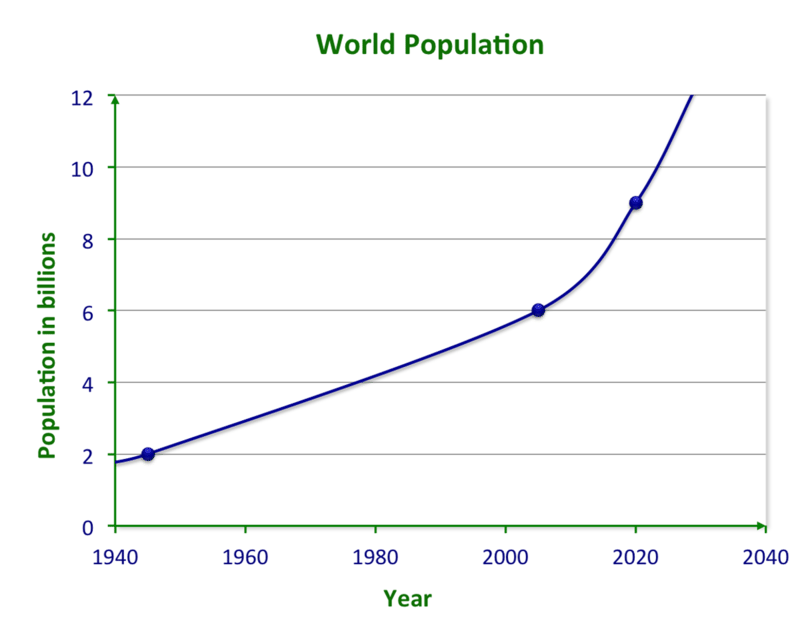

1.  The population grew faster in more recent years.
2.  The population is 3 times higher today than it was 60 years ago.
3.  The trend implies that the population will continue to grow in the future at faster rates.

**How might this affect the world?**

1.  There being more people implies that more resources will be needed to sustain them.
2.  More housing and infrastructure will be needed to accommodate more people.
3.  Increased population may also increase the economy as people create wealth and spend money.

**Now let’s go back and apply what we have learned to the problem from the introduction.**

Real-Life Example Completed
---------------------------

**_The New Track_**

**Here is the original problem once again. Reread it and then calculate the margin of error.**

“Wow! It looks like we are going to get a new track at the school,” Sam said at breakfast as he read the newspaper over his Dad’s shoulder. “It must be because we won at regionals.”

Yes, the track team the Hawks had taken first place at regionals. It was the talk of the town and the newspaper article seemed to suggest that great things were going to happen as a result.

“Well, I don’t want to disappoint you Sam, but 53% are for the new track but there is a 5% margin of error,” his Dad explained.

“What does that have to do with anything?”

“A lot. A margin of error can mean that the survey results aren’t completely accurate, or you could say that you can’t take them at face value,” his Dad said.

Sam is perplexed. 53% is 53%, or is it?

**First, we have to look at the given information and the margin of error. We know that the survey said that 53% were in favor of the new track. The margin of error is 5%. This means that it could be as high as 58% or as low as 48% in favor of the new track. Depending on the percentage that the school thinks it needs to allocate funds for a new track, this percentage could impact whether or not a new track is gotten.**

Vocabulary
----------

Here are the vocabulary words that are found in this lesson.

__Margin of Error__

A percentage by which the true number for the entire population may differ.

Time to Practice
----------------

Directions: Use what you have learned on each problem presented below.

A job satisfaction survey is taken of 500 people who work in the auto industry. The results are shown in the table below:

|     |     |     |     |
| --- | --- | --- | --- |Job Satisfaction Survey(margin of error
| **Very Dissatisfied** | **Dissatisfied** | **Satisfied** | **Very Satisfied** |
| --- | --- | --- | --- |
| 16% | 21% | 41% | 22% |

1.  Based on the margin of error, find the percent range of responses in each category.
2.  Assuming that there are 340,000 people in the industry, what is the range of responses for each category?
3.  What conclusions can you draw based upon this data?

Directions: Look at the chart regarding the Prom Location. Assume a margin of error of $\pm 5 \%$.

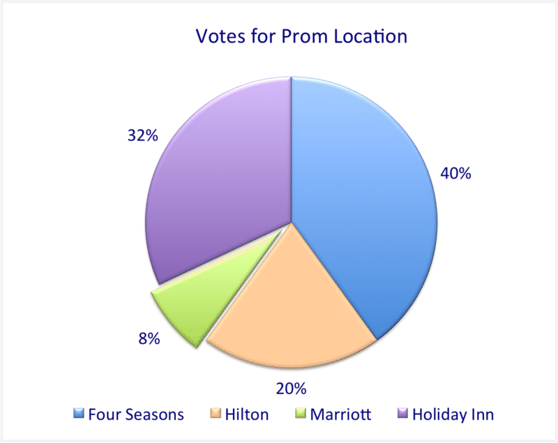
5.  What conclusions can be drawn on this data?
6.  What other information do you think may be important in making the decision?

A college newspaper reports the following:

“Ever since the new volleyball stadium was built at the end of 2005, the interest in the Women’s Volleyball Team has grown. In turn, that has made the team go nearly perfect this year. Their current record is 14 wins and 3 losses. Last year at this time, they were only 13 and 4. Come and see the new stadium and encourage the college to build the new football stadium, too!”

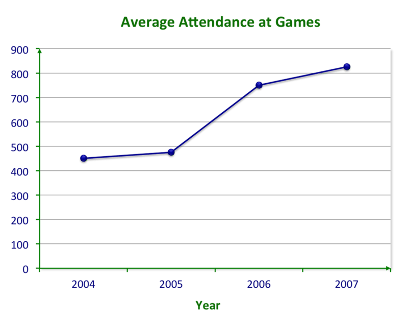
8.  Do you agree with them? Why or why not?
9.  What bias might the writer have had?

Directions: Median house prices for 3 states are shown below.

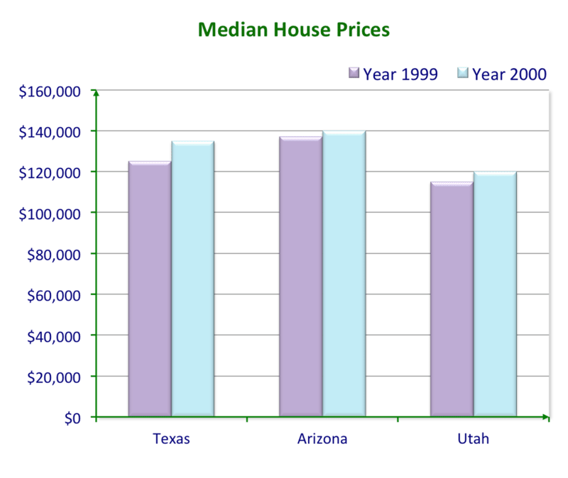
11. What would be an inappropriate conclusion drawn from this data? Why?

**_Extension – have students use a newspaper and find statistics. Then have them interpret the data and the different data displays. Have students present their findings to the class._**

</article>

## 11.0 Using Probability

<article>

</article>

### 11.1 Counting Methods

<article>

Introduction
------------

**_The Bike Shop_**

There are so many different types of bikes, that Telly is having a difficult time choosing. To complicate matters even more, Ms. Kelley said that she would let Telly design her own bike so she can choose seat color and type of handlebars as well as color of the bike. Telly knows that she wants a mountain bike, so at least that part has been chosen. Here are all of the options that Telly has.

Mountain bike

Colors = Red, Green, Blue or Purple

Seat = normal or extra cushion

Handlebars = straight or curved

Telly took out a piece of paper and tried drawing out all of her options. She became frustrated almost immediately.

**This is where you come in. You can help Telly to work through this problem by learning about the Counting Principle and about tree diagrams. Pay attention because you will see this problem again.**

**_What You Will Learn_**

In this lesson, you will learn how to use the following skills.

* Use tree diagrams to list all possible outcomes of a series of events involving two or more choices or results.
* Recognize the number of possible outcomes of a series of events as the product of the number of possible outcomes for each event.
* Use the Counting Principle to find all possible outcomes of a series of events involving two or more choices or results.
* Find probabilities of specified outcomes using the Counting Principle.

**_Teaching Time_**

I. **Use Tree Diagrams to List All Possible Outcomes of a Series of Events Involving Two or More Choices or Results**

In this chapter you will learn about **_probability_**. **_Probability_** **is a mathematical way of calculating how likely an event is likely to occur.** **An** **_event_** **is a result of an experiment or activity** that might include such things as:

* flipping a coin
* spinning a spinner
* rolling a number cube
* choosing an item from a jar or bag

An important concept when calculating probability is to think about outcomes. **An** **_outcome_** **is a possible result of some event occurring.** For example, when you flip a coin, “heads” is one outcome; tails is a second outcome. **_Total outcomes_** **are computed simply by counting all possible outcomes.**

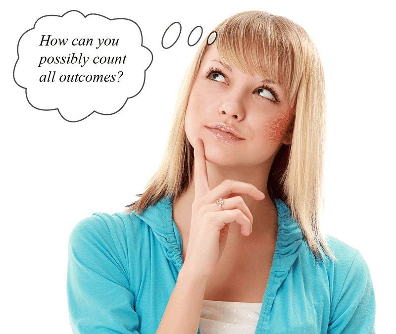

**For example, if you flip a coin two times, how many different outcomes are possible? To find out, make a tree diagram.**

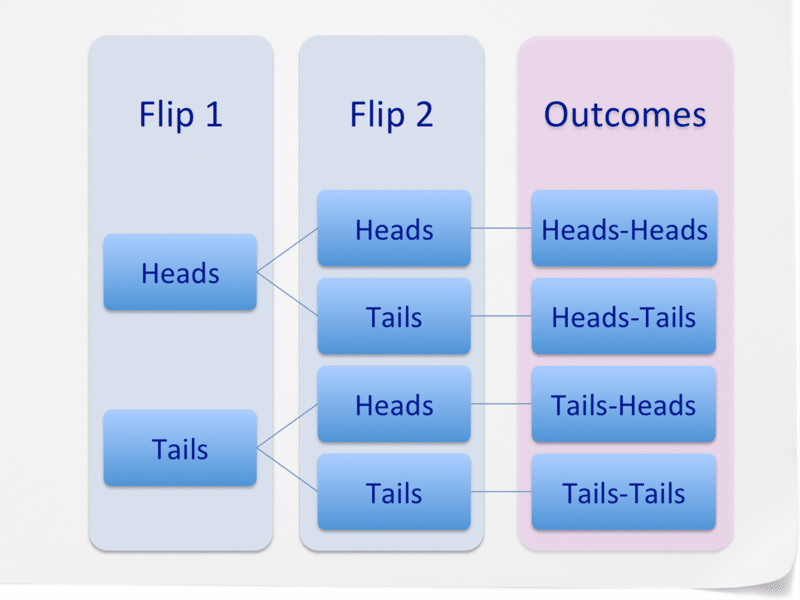

The pink box shows the total number of outcomes for both flips:

$$
\begin{align*}
& \text{heads-heads} \quad \ \text{tails-heads}\\
& \text{heads-tails} \qquad \text{tails-tails}
\end{align*}
$$

What happens when you increase the number of flips to three? Just add another section to your tree diagram.

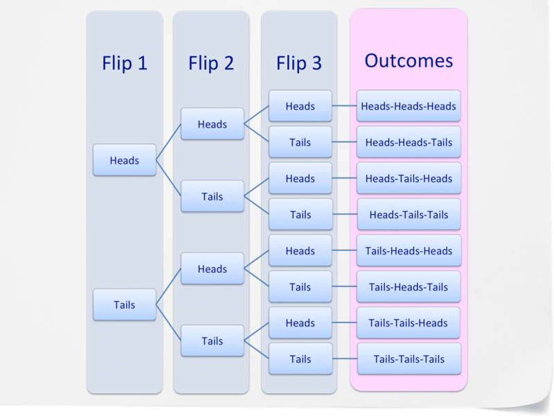

$$
\begin{align*}
& HHH \quad HTH \quad THH \quad TTH\\
& HHT \quad HTT \quad \ THT \quad TTT
\end{align*}
$$

For a sub sandwich, Luis has the following choices.

$$
\begin{align*}
& \underline{\text{Choice 1: Bread}} \qquad \underline{\text{Choice 2: Cheese}} \qquad \underline{\text{Choice 3: Meat}}\\
& \text{white, wheat} \qquad \quad \ \ \text{swiss, cheddar} \qquad \quad \ \text{turkey, ham, tuna}
\end{align*}
$$

How many different kinds of sandwiches can Luis make?

**To figure this out, Luis can create a tree diagram to show all of his choices and calculate the sandwich outcomes.**

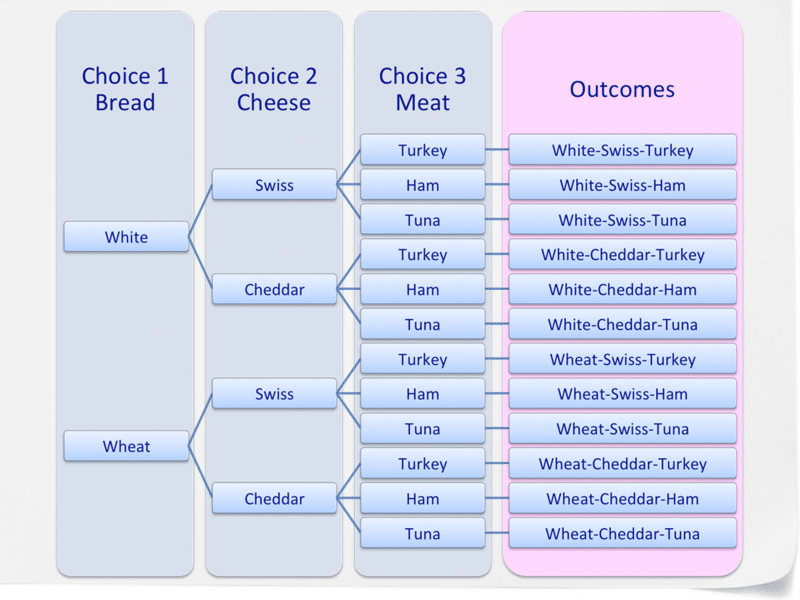

**There are twelve possible sandwich outcomes for Luis.**

II. **Recognize the Number of Possible Outcomes of a Series of Events as the Product of the Number of Possible Outcomes for Each Event**

Sometimes it just isn’t possible to draw out a whole tree diagram to calculate outcomes. When this happens, we can use arithmetic to calculate the outcomes. Let’s look at an example.

Example

Ichiro’s Car Wash offers three different wash services – basic outer body wash, interior cleaning, and finally, custom hand-detailing. Customers order a wash choice plus wax or no wax. You can use a tree diagram to find that there are 6 different choices, or outcomes, for a car wash.

**How could we do this without a tree diagram?**

**We can look at the situation in terms of outcomes. For the first choice there are 3 different outcomes. For the second choice there are 2 different outcomes.**

$3 \ \text{outcomes} \cdot 2 \ \text{outcomes} = 6 \ \text{outcomes}$

**What if we changed the options? Would this method still work? Let’s add on to the car wash problem and see.**

Consider Ichiro’s oil change choices. Customers can get standard or synthetic oil, filter or no filter, and pay with a coupon or for the regular price. For each choice there are 2 different outcomes.

$2 \ \text{outcomes} \cdot 2 \ \text{outcomes} \cdot 2 \ \text{outcomes} = 8 \ \text{outcomes}$

This method of calculating the number of total outcomes can be stated as a general rule called the **_Counting Principle_**.

**_Counting Principle_**: The number of choices or outcomes for two independent events, $A$ and $B$ taken together, is the product of the total number of outcomes for each event.

$\text{Total outcomes for} \ A \ \text{and} \ B = \text{(number of outcomes for} \ A) \cdot \text{(number of outcomes for} \ B)$

Now that you understand that we need to calculate choices or outcomes to calculate all of the possible number of outcomes, let’s look at applying the Counting Principle in some examples.

III. **Use the Counting Principle to Find All Possible Outcomes of a Series of Events Involving Two or More Choices or Results**

Once again, the Counting Principle requires that we take the number of choices or outcomes for two independent events and multiply them together. The product of these outcomes will give us the total number of outcomes for each event.

**For example, 2 tosses of a coin there are 2 outcomes for each toss. Using the Counting Principle, you can find the total number of outcomes as:**

$2 \ \text{outcomes} \cdot 2 \ \text{outcomes} = 4 \ \text{total outcomes}$

**You can use the Counting Principle to find probabilities of events.** For example, suppose you wanted to know the probability of rolling two number cubes and coming up with a sum of 5. The **probability of any event is equal to the ratio of favorable outcomes to the total number of equally likely possible outcomes.**

$$
\begin{align*}
& P \text{(event)} = \frac{\text{favorable outcomes}}{\text{total outcomes}}
\end{align*}
$$

**_Favorable outcomes_** **are the outcomes you are looking for.** In this case the favorable outcomes are outcomes that have a sum of 5. To find the number of total outcomes for the two tosses, you can use the Counting Principle. Since each toss of a number cube has 6 different outcomes.

$$
\begin{align*}
\text{total outcomes} &= 6 \ \text{outcomes} \cdot 6 \ \text{outcomes}\\
&= 36\ \text{total outcomes}
\end{align*}
$$

To figure out this particular problem we must add another step. Now list those 36 outcomes and mark the outcomes that result in a sum of 5.

$$
1-1 \quad 2-1 \quad 3-1 \quad {\color{red}\mathbf{4-1}} \quad 5-1 \quad 6-1 \\
1-2 \quad 2-2 \quad {\color{red}\mathbf{3-2}} \quad 4-2 \quad 5-2 \quad 6-2 \\
1-3 \quad {\color{red}\mathbf{2-3}} \quad 3-3 \quad 4-3 \quad 5-3 \quad 6-3 \\
{\color{red}\mathbf{1-4}} \quad 2-4 \quad 3-4 \quad 4-4 \quad 5-4 \quad 6-4 \\
1-5 \quad 2-5 \quad 3-5 \quad 4-5 \quad 5-5 \quad 6-5 \\
1-6 \quad 2-6 \quad 3-6 \quad 4-6 \quad 5-6 \quad 6-6
$$

Since there are 4 outcomes that have a sum of 5:

$P(5) = \frac{4}{36}=\frac{1}{9}$

**The probability of rolling two number cubes with a sum of 5 is $\frac{1}{9}$.**

IV. **Find Probabilities of Specified Outcomes Using the Counting Principle**

In the last section, we started using the Counting Principle to calculate probability. Let’s explore this a little further.

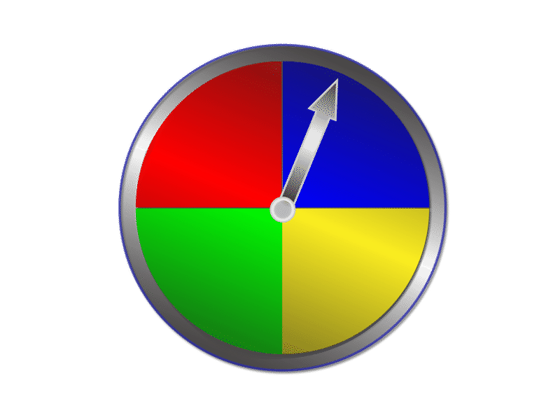

What is the probability of spinning the spinner twice and having it land on the same color both times?

Step 1: Rather than draw a tree diagram, use the Counting Principle to find the number of total outcomes. Since each spin has 4 outcomes:

$$
\begin{align*}
\text{total outcomes}&= 4 \ \text{outcomes} \cdot 4 \ \text{outcomes}\\ 
&= 16 \ \text{total outcomes}
\end{align*}
$$

Step 2: Now list all 16 outcomes and find the number of ways both spinners can land on the same color both times:

$$
\begin{align*}
&{\color{red} \mathbf{red - red}} && \text{blue}-\text{red} && \text{yellow}-\text{red} && \text{green}-\text{red} \\
&\text{red}-\text{blue} && {\color{red} \mathbf{blue - blue}} && \text{yellow}-\text{blue} && \text{green}-\text{blue}\\
&\text{red}-\text{yellow} && \text{blue}-\text{yellow} && {\color{red} \mathbf{yellow - yellow}} && \text{green}-\text{yellow}\\
&\text{red}-\text{green} && \text{blue}-\text{green} && \text{yellow}-\text{green} && {\color{red} \mathbf{green - green}}
\end{align*}
$$

Step 3: Find the ratio of favorable outcomes to total outcomes:

$$
P \text{(same)} = \frac{favorable}{total \ outcomes}=\frac{4}{16}= \frac{1}{4}
$$

**The probability of the arrow landing on the same color two times in a row is $\frac{1}{4}$.**

**Now let’s go back and apply what we have learned to the problem from the introduction.**

Real-Life Example Completed
---------------------------

**_The Bike Shop_**

**Here is the original problem once again. Reread it and then figure out the total number of options that Telly has.**

Telly and Carey are working in a bicycle shop over the spring vacation. They are excited because Ms. Kelley the owner is going to let each of them choose a new bike when the week is done. This way, they get to work and earn a new bike at the same time.

There are so many different types of bikes, that Telly is having a difficult time choosing. To complicate matters even more, Ms. Kelley said that she would let Telly design her own bike so she can choose seat color and type of handlebars as well as color of the bike. Telly knows that she wants a mountain bike, so at least that part has been chosen. Here are all of the options that Telly has.

Mountain bike

Colors = Red, Green, Blue or Purple

Seat = normal or extra cushion

Handlebars = straight or curved

Telly took out a piece of paper and tried drawing out all of her options. She became frustrated almost immediately.

**_Solution to Real – Life Example_**

**First, list out the options once again.**

**Mountain bike**

**Colors = Red, Green, Blue or Purple**

**Seat = normal or extra cushion**

**Handlebars = straight or curved**

**Next, we can use the Counting Principle to calculate the total number of options that Telly has for her bike.**

**There are four colors = 4**

**There are two seat options = 2**

**There are two handlebar options = 2**

**$4 \times 2 \times 2 = 16$ possible bike options**

**This is the answer.**

Vocabulary
----------

Here are the vocabulary words that are found in this lesson.

__Probability__

the mathematical way of calculating the likelihood of an event occurring, the ratio of favorable outcomes to total outcomes.

__Event__

a result of an experiment or activity.

__Outcome__

a possible result of an event occurring.

__Total Outcomes__

all possible outcomes

__Tree Diagram__

a branching diagram that shows all possible outcomes for an event.

__Counting Principle__

$\text{Outcomes} \times \text{outcomes} = \text{total outcomes}$

__Favorable Outcomes__

The outcomes that you are looking for.

Time to Practice
----------------

Directions: Use a tree diagram to figure out all of the different outcomes.

1.  Jeff’s Jet Ski rentals has 3 different jet ski models: the single, the double, and the racer. Renters can rent for a half hour or a full hour. How many rental choices are there?
2.  CableCom offers Basic Cable, Premium Cable, and Super Premium Cable service. CableCom offers these services for home use, small business use, or large business use. How many different cable choices are there?
3.  The _Gotham Gazette_ offers the following newspaper choices:
    
    * home or office delivery
    * weekdays only, weekends only, or all seven day delivery
    * monthly or weekly payments
    
    How many different kinds of choices can you get? Use a tree diagram to list them all.
    
4.  On Main Street, Jiri has to go through 4 traffic lights that can be either red or green. How many different outcomes are there for the 4 lights? Use a tree diagram to list them all.
5.  The I-Cone high tech ice cream shop offers the following options.
    
    * cone: sugar, waffle
    * size: teeny, mega, huge
    * flavors: shocking blueberry, marvelous mango, chocolate attack
    
    How many different choices are there? List the outcomes using a tree diagram.
    

Directions: Use the counting principle to determine the number of outcomes.

6.  Nigel dropped 3 open-faced peanut butter sandwiches that were equally likely to land face-up or face-down. How many different outcomes are there?
7.  Movie Star Toothpaste comes in 3 different flavors: sparkle, blast, and stripe, 3 different sizes, and 2 different tube styles. How many toothpaste choices are there?
8.  Dave made 3 predictions for this Sunday’s football games. How many different outcomes of being right or wrong are there? List the outcomes.
9.  Bridget made 4 predictions for this Sunday’s football games. How many different outcomes of being right or wrong are there? List the outcomes.
10. How many more outcomes will there be if Bridget adds an extra prediction for problem 4 above?
11. Sandy’s Sandals come in 4 different models: sport, super-sport, casual, and chic, 5 different colors, and 9 different sizes. How many choices are there?
12. In problem 6 above, Sandy’s has run out of size 8 sandals of all types. How many fewer choices are there?
13. Mike’s Bikes features three different bike styles: mountain, racer, and stunt bike. You can choose from 6 different gear systems, 4 frame alloys, and 5 colors. How many bike choices are there?
14. In problem 8 above, Mike gets a new bike color but now features only 5 different gear systems. Does he have more or fewer choices now? How many more or fewer?
15. Mavis and Marvin each have a deck of 52 cards. Each chooses 1 card from their deck. How many different outcomes are possible for the two events?
16. Tilly spins a spinner that has red, blue, and yellow sections 3 times. How many different outcomes are possible?
17. Tilly spins a spinner that has red, blue, and yellow sections and tosses a number cube. How many different outcomes are possible?
18. Tilly tosses a number cube 2 times. How many different outcomes are possible?
19. Tilly tosses a number cube 3 times. How many different outcomes are possible?

Directions: Use the counting principle to determine probabilities.

20. Kalyani spins the spinner 2 times. What is the probability that the arrow will land on green both times?
21. Kalyani spins the spinner 2 times. What is the probability that the arrow will land on the same color both times?
22. Kalyani spins the spinner 2 times. What is the probability that the arrow will land on a different color each time?
23. Kalyani spins the spinner 3 times. What is the probability that the arrow will land on a different color each time?
24. Kalyani spins the spinner 3 times. What is the probability that red will come up at least one time?
25. Kalyani spins the spinner 3 times. What is the probability that red will come up 2 or more times?

</article>

### 11.2 Permutations

<article>

Introduction
------------

**_The Lock_**

“What are you doing?” Carey asked sitting next to the pile of locks.

“I am checking to make sure that all of these locks work,” Telly explained. “Here is a pile for you.”

Carey starting working on the locks too. After about five minutes she stopped and looked at Telly.

“You know these shouldn’t even be called combination locks. A lock isn’t a real combination, it’s actually a permutation,” Carey said laughing.

Telly looked at her friend as if she had six heads. She was completely puzzled.

“What do you mean?” Telly asked.

**Do you know what Carey means? If you don’t right now, you will by the end of the lesson. This lesson will help you to understand about permutations.**

**_What You Will Learn_**

By the end of this lesson, you will be able to complete the following skills.

* Recognize permutations as arrangements in which order is important.
* Count all permutations of $n$ objects or events.
* Count all permutations of $n$ objects taken $r$ at a time.
* Evaluate permutations using permutation notation.

**_Teaching Time_**

I. **Recognize Permutations as Arrangements in which Order is Important**

_Order_ is important in some situations and not important in others. For example, in following a cake recipe, the order in which the events take place is important. You need to crack the eggs _before_ you mix them with the flour. Similarly, you put the icing on the cake only _after_ it has baked.

For solving many problems in which order is important, you can use **_permutations_**. **A** **_permutation_** **is a selection of items in which** **_order_** **is important.** To use permutations to solve problems, you need to be able to identify the problems in which order, or the arrangement of items, matters. Let’s look at an example.

Example

Francis Imelda Guzman wants to know how many ways she can arrange her initials, $F, I, N$. Does order matter for this problem?

**Since she wants to arrange each letter in a particular arrangement, the order does matter. This is a permutation not a combination.**

**Step 1:** Write out a single order, or permutation.

$FIG$

**Step 2:** Now **rearrange** those same letters. Did changing the order of the items change the outcome? If so, then order matters.

$NGI \ \Longleftarrow$ different than original

**Each arrangement of letters is a different permutation.**

II. **Count All Permutations of** $\underline{n}$ **Objects or Events**

**We can count permutations too. There is a mathematical way to calculate the number of permutations possible given the number of items selected.**

Example

Three taxis – an Acme Cab, a Bluebird Limo, and a Checker – all arrive outside of the BigWig Hotel at exactly the same moment. In how many different ways can the three line up?

**One way to look at this problem is as the product of 3 different choices. For choice 1 you can select any of the three cabs, Acme, Bluebird, or Checker.**

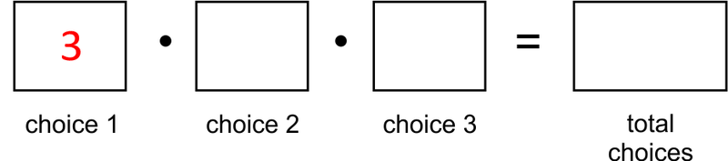

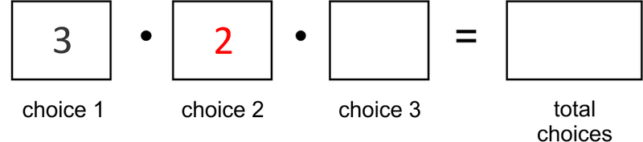

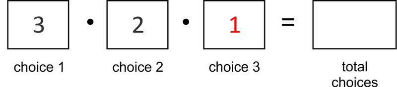

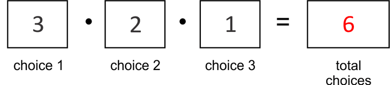

$$
\begin{align*}
&\mathbf{Acme-Bluebird-Checker} && \mathbf{Bluebird-Acme-Checker} && \mathbf{Checker-Acme-Bluebird}\\
&\mathbf{Acme-Checker-Bluebird} && \mathbf{Bluebird-Checker-Acme} && \mathbf{Checker-Bluebird-Acme}
\end{align*}
$$

**Notice that order is important here. Each of the 6 choices, or permutations, is a unique and different arrangement.** For example, Acme-Bluebird-Checker is not the same way as Acme-Checker-Bluebird.

**What happens when you increase the number of cabs by adding a Decker Taxi? How many different ways are there now?**

Starting over, you can now see that there are 4 choices for the first cab, followed by 3 choices, 2 choices, and 1 choice.

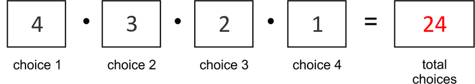

$$
\begin{align*}
& \text{Acme-Bluebird-Checker-Decker} && \text{Bluebird-Acme-Checker-Decker} && \text{Checker-Acme-Bluebird-Decker}\\
& \text{Acme-Bluebird-Decker-Checker} && \text{Bluebird-Acme-Decker-Checker} && \text{Checker-Acme-Decker-Bluebird}\\
& \text{Acme-Checker-Bluebird-Decker} && \text{Bluebird-Checker-Acme-Decker} && \text{Checker-Bluebird-Acme-Decker}\\
& \text{Acme-Checker-Decker-Bluebird} && \text{Bluebird-Checker-Decker-Acme} && \text{Checker-Bluebird-Decker-Acme}\\
& \text{Acme-Decker-Bluebird-Checker} && \text{Bluebird-Decker-Acme-Checker} && \text{Checker-Decker-Acme-Bluebird}\\
& \text{Acme-Decker-Checker-Bluebird} && \text{Bluebird-Decker-Checker-Acme} && \text{Checker-Decker-Bluebird-Acme}\\
& \text{Decker-Acme-Bluebird-Checker} && && \\
& \text{Decker-Acme-Checker-Bluebird} && && \\
& \text{Decker-Bluebird-Acme-Checker} && && \\
& \text{Decker-Bluebird-Checker-Acme} && && \\
& \text{Decker-Checker-Acme-Bluebird} && && \\
& \text{Decker-Checker-Bluebird-Acme} && && \\
\end{align*}
$$

**You can see that when we use mathematics, we can figure out the number of permutations possible.**

III. **Count Permutations of** $\underline{n}$ **Objects Taken** $\underline{r}$ **at a Time**

We can find the number of permutations in a group if you include all members of that group. For example, suppose there are 3 cabs in front of a hotel, Acme, Bluebird, and Checker. **If all 3 line up to wait for the next customer, the number of different lineups, or permutations, of 3 items taken 3 at a time is:**

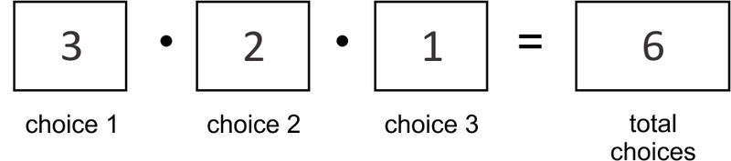

**What happens when 4 cabs show up at the hotel, but there is only room for 3 cabs to line up? For example, how many different 3-cab lineups would there be if you started with 4 cabs – Acme, Bluebird, Checker, and Decker?**

Now, for choice 1 you have _four_ choices instead of 3.

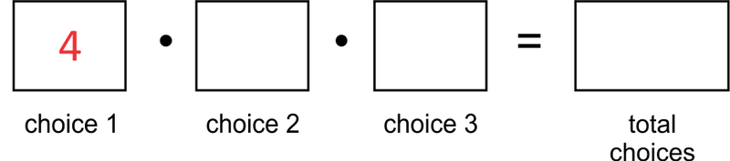

The final calculation gives 24 total choices:

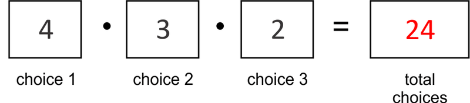

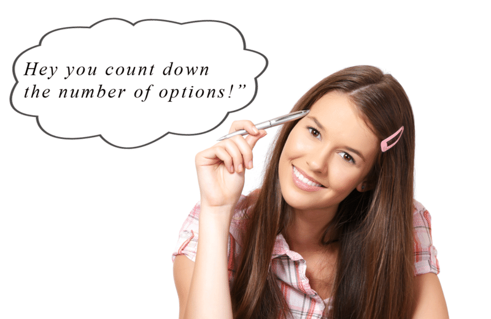

IV. **Evaluate Permutations Using Permutation Notation**

The most efficient way to calculate permutations uses numbers called **_factorials_**. **Factorials are special numbers that represent the product of a series of descending numbers.** The symbol for a factorial is an exclamation sign. Here are some examples.

$$
\begin{align*}
8! &= 8- \text{factorial} = 8 \cdot 7 \cdot 6 \cdot 5 \cdot 4 \cdot 3 \cdot 2 \cdot 1\\
11! &= 11- \text{factorial} = 11 \cdot 10 \cdot 9 \cdot 8 \cdot 7 \cdot 6 \cdot 5 \cdot 4 \cdot 3 \cdot 2 \cdot 1\\
4! &= 4- \text{factorial} = 4 \cdot 3 \cdot 2 \cdot 1\\
17! &= 17- \text{factorial} = 17 \cdot 16 \cdot 15 \cdot 14 \cdot 13 \cdot 12 \cdot 11 \cdot 10 \cdot 9 \cdot 8 \cdot 7 \cdot 6 \cdot 5 \cdot 4 \cdot 3 \cdot 2 \cdot 1
\end{align*}
$$

**To compute the values of factorials, simply multiply the series of numbers.**

$$
\begin{align*}
4! &= 4 \cdot 3 \cdot 2 \cdot 1 = 24\\
5! &= 5 \cdot 4 \cdot 3 \cdot 2 \cdot 1 = 120\\
8! &= 8 \cdot 7 \cdot 6 \cdot 5 \cdot 4 \cdot 3 \cdot 2 \cdot 1 = 40,320\\
11! &= 11 \cdot 10 \cdot 9 \cdot 8 \cdot 7 \cdot 6 \cdot 5 \cdot 4 \cdot 3 \cdot 2 \cdot 1 = 39,916,800
\end{align*}
$$

**We can use factorials to calculate permutations. Let’s look at an example.**

Example

Suppose you have 6 items and you want to know how many arrangements you can make with 4 of the items.

Order matters in this problem, so you need to find the number of permutations there are in 6 items taken 4 at a time. In permutation notation you write the following.

${\color{red}_{6}}P {\color{blue}_{4}} \ \Longleftarrow$ 6 items taken 4 at a time

In general, permutations are written as:

${\color{red}_{n}}P {\color{blue}_{r}} \ \Longleftarrow {\color{red}n}$ items taken ${\color{blue}r}$ at a time

To compute ${_n}P{_r}$ you write:

$$
{_{\color{red}n}}P{_{\color{blue}r}}=\frac{{\color{red}n}!}{({\color{red}n}-{\color{blue}r})!}=\frac{\Longleftarrow {\color{red}\text{total items!}}}{\Longleftarrow \ ({\color{red}\text{total items}}-{\color{blue}\text{items taken at a time}})!}
$$

To compute $_{6}P _{4}$ just fill in the numbers:

$$
\begin{align*}
{\color{red}_{6}}P {\color{blue}_{4}}&= \frac{{\color{red}6}!}{({\color{red}6}-{\color{blue}4})!}\\
{\color{red}_{6}}P {\color{blue}_{2}}&= \frac{{\color{red}6}!}{({\color{red}6}-{\color{blue}2})!}= \frac{6!}{4!}= \frac{6 \times 5 \times \cancel{4 \times 3 \times 2 \times 1}}{\cancel{4 \times 3 \times 2 \times 1}}= \frac{6 \times 5}{1}=30
\end{align*}
$$

**Notice that it is the product of the values in descending order that tells us how many permutations are possible.**

**You can use this method to solve any number of permutations.**

Example

Find $_{7}P _{3}$

**Step 1:** Understand what $_{7}P _{3}$ means.

${\color{red}_{7}}P {\color{blue}_{3}} \ \Longleftarrow$ 7 items taken 3 at a time

**Step 2:** Set up the problem.

$$
{\color{red}_{7}}P {\color{blue}_{3}}= \frac{{\color{red}7}!}{({\color{red}7}-{\color{blue}3})!}= \frac{\Longleftarrow{\color{red} \text{total items!}}}{\Longleftarrow({\color{red} \text{total items}}-{\color{blue} \text{items taken at a time}})!}
$$

**Step 3:** Fill in the numbers and simplify.

$$
{\color{red}_{7}}P {\color{blue}_{3}}= \frac{{\color{red}7}!}{({\color{red}7}-{\color{blue}3})!}= \frac{7!}{4!}= \frac{7 \times 6 \times 5 \times \cancel{4 \times 3 \times 2 \times 1}}{\cancel{4 \times 3 \times 2 \times 1}}= \frac{7 \times 6 \times 5}{1}=210
$$

**There are 210 possible permutations.**

**Now let’s go back to the problem from the introduction and apply the information in this lesson.**

Real-Life Example Completed
---------------------------

**_The Lock_**

**Here is the original problem from the introduction. Reread it and then explain what Carey meant when she said the lock shouldn’t be called a combination lock.**

Telly was sitting in the middle of a whole pile of combination locks when Carey arrived on Tuesday morning.

“What are you doing?” Carey asked sitting next to the pile of locks.

“I am checking to make sure that all of these locks work,” Telly explained. “Here is a pile for you.”

Carey starting working on the locks too. After about five minutes she stopped and looked at Telly.

“You know these shouldn’t even be called combination locks. A lock isn’t a real combination, it’s actually a permutation,” Carey said laughing.

Telly looked at her friend as if she had six heads. She was completely puzzled.

“What do you mean?” Telly asked.

**_Solution to Real – Life Example_**

**Carey said the lock should be called a permutation lock because a permutation is a series of numbers in a specific order. If you don’t put the numbers in that order, then the lock will not open. This is not the case with a mathematical combination as you will understand in the next lesson.**

**Remember, when order is important, it is a permutation.**

Vocabulary
----------

Here are the vocabulary words that are found in this lesson.

__Permutation__

a selection of items in which order is important.

__Factorial__

a special number that represents the product of a series of descending values.

Time to Practice
----------------

Directions: Write whether order is important for each problem. Give an example to explain each answer.

1.  Four different frogs entered the jumping contest – Spots, Dots, Slimey, and Croaky. In how many ways can the 4 finish in first, second, third, and fourth place?
2.  In Scrabble, Denise has the letters A, R, X, O, G, I, and L. How many different 4-letter words can she make?
3.  Six people have signed up to play Scrabble – Tim, Jim, Kim, Pam, Sam, and Cam. Only 4 people can play at one time. How many different 4-player games are possible?
4.  Arnold printed out his 8-page report without putting page numbers on the pages. Now the pages have gotten all mixed up. In how many different ways can Arnold arrange the 8 pages?
5.  The special lunch at Bamboo Restaurant gives you a choice of won-ton or hot-sour soup, a choice of kung pao shrimp or chicken with broccoli, and a choice rice or noodles. How many different special lunches are there?
6.  Rex forgot the password for his ATM bank card. He knows that the password is made of the 4 digits of his birthday, October 24 or 1, 0, 2, 4.? How many different passwords does he need to try to be sure he gets his password?
7.  Javier wrote out wrote out the letters of Jasmine’s name on 7 cupcakes and put them in a box. How many different ways can he take them out of the box one by one?
8.  On the new reality show, Lazybones, the five finalists – Snoozin’ Betty, Lounge Man, The Yawn Meister, Lana Later, and Bob the Procrastinator – compete to see who is the laziest person. On today’s show, the five will be weeded down to 3 super-finalists. How many different ways can the 3 super-finalists be chosen?
9.  Four friends have printed the letters M, E, T, S on the front of their shirts. They’re going to the Mets game and will sit in 4 seats side by side. In how many different ways can the four sit?
10. How many different 3-digit numbers can you form from the digits 4, 5, and 6?

Directions: Use permutations to solve each problem.

11. How many 3-digit numbers can Blanche write using the digits 7, 8, and 9 without repeating any of the digits? List the numbers.
12. How many 4-letter arrangements can Blanche write using the letters A, B, C, D without repeating any of the letters? List the arrangements.
13. The programmer for Oddball-TV has 5 new half-hour shows she wants to air on Tuesday evenings: Strange Days, Slightly Off, Odd Rod, Bent, and Icky the Great. In how many different orders can she present the shows?
14. A train has 6 different cars – a passenger car, a baggage car, a mail car, a diner car, a freight car, and a caboose. In how many different orders can the cars be arranged?
15. The last 5 digits of Beryl’s phone number are 34567. How many numbers have these same 5 digits?
16. Mia has 7 charms for her charm bracelet – a heart, a moon, a turtle, a cube, a bird, a hoop, and a car. Into how many different orders can she arrange the 7 charms?
17. One of the charms in Mia’s bracelet in problem 6 above fell off. How many fewer arrangements are there now?
18. The Soccer Sweepstakes will pay you $700 if you can guess the order of the 6 teams in the Central League. Each guess costs $1. How much would you need to spend to make to make sure you got the correct order?

Directions: Solve each problem.

19. For her first card trick, Marlo the Magnificent shuffles 4 cards carefully, then has an audience member pull 2 cards out of the 4-card stack, one by one. How many different orders are possible?
20. For her next trick, Marlo the Magnificent shuffles 5 cards, then has an audience member pull 2 cards out of the 5-card stack, one by one. How many different orders are possible now?
21. For Marlo’s third trick, she shuffles 5 cards and has an audience member pull 3 cards out one by one. How many different orders are possible now?
22. Marlo shuffles 6 cards for her final trick and has an audience member pull 4 cards out one by one. How many different orders are possible now?
23. There are 8 teams in the 8th grade Premier Soccer League. How many different ways can the top 2 teams finish the season?
24. How many different ways can the top 3 teams in the Premier League finish the season?

</article>

### 11.3 Combinations

<article>

Introduction
------------

**_The Big Race_**

It was the girls third day of work and they were beginning to help Ms. Kelley to organize a big bike race. The shop was hosting a group of bikers from all around the area to help raise money for charity. Bikers from all over had already registered and now it was just a matter of Ms. Kelley organizing the list into a starting order.

“How do you decide who gets to race in the front?” Carey asked.

“You mean the leader of the pack?” Ms. Kelley asked.

“I guess I do,” Carey said.

“Well, it is totally random. This isn’t a professional race, so it doesn’t matter who starts where. Everyone will get an equal chance and besides, all of the money raised goes to charity,” Ms. Kelly explained.

Carey looked at Telly.

“A combination, not a permutation,” Carey said.

Telly got it this time. After the situation with the locks she now understood the definition of a permutation.

**Do you understand how a permutation is different from a combination? Why did Carey say that this was a combination?**

**_What You Will Learn_**

In this lesson, you will learn how to do the following skills.

* Recognize combinations as arrangements in which order is not important.
* Count all combinations of $n$ objects or events.
* Count combinations of $n$ objects taken $r$ at a time.
* Evaluate combinations using combination notation.

**_Teaching Time_**

I. **Recognize Combinations as Arrangements in which Order is not Important**

_Order_ is important for some groups of items but not important for others. For example, consider a list of the words: POTS, STOP, SPOT, and TOPS.

* For the spelling of each individual word, order is important. The words POTS, STOP, SPOT, and TOPS all use the same letters, but spell out very different words.
* For the list itself, order is not important. Whether the words are presented in one order – such as POTS, STOP, SPOT, TOPS, or another order, such as STOP, SPOT, TOPS, POTS, or a third order, such as TOPS, POTS, SPOT, STOP – makes no difference. As long as the list includes all 4 words, the order of the 4 words doesn’t matter.

**A** **_combination_** **is an arrangement of items in which order, or how the items are arranged, is not important.** The collection of one order of the items is not functionally different than any other order.

Example

Six people – Larry, Sherry, Terri, Carrie, Mary, and Harry all want to ride in a rowboat that can hold only 4 passengers. How many different groups of 4 passengers can ride in the boat?

**Step 1:** Write out a single order.

Larry, Sherry, Terri, Harry

**Step 2:** Now **rearrange** the order. Did changing the order of the items change the outcome? If so, then order matters.

Sherry, Harry, Larry, Terri $\Longleftarrow$ different order, same 4 passengers

**Order does NOT matter for this problem. Use combinations.**

Example

Four tap dancers are entered in the Star Power Talent Show – Debbie, Maurice, Minnie, and Ronnie. The 4 will appear separately on stage. In how many different ways can the 4 be scheduled to appear on stage?

**Step 1:** Write out a single order.

Debbie, Ronnie, Maurice, Minnie

**Step 2:** Now **rearrange** the order. Did you change the outcome? If so, then order matters.

Maurice, Debbie, Minnie, Ronnie $\Longleftarrow$ different order, meaning is DIFFERENT

**Order DOES matter for this problem. Use permutations, not combinations.**

II. **Count All Combinations of $\underline{n}$ Objects or Events**

When solving problems, we can use combinations to solve problems when order is not important. One way to find the number of combinations is to use a tree diagram.

Example

For his top tennis doubles team, Coach Yin is considering 3 players: Joyce, Rose, and Nica. How many different doubles teams can the coach consider?

The first tree diagram shows all 6 _permutations_ of the 3 players. But order doesn’t matter in this problem. For example, the team of Joyce-Rose is no different than the team of Rose-Joyce.

So in the second tree diagram we cross out all outcomes that are repeats. This leaves 3 combinations that are not repeats.

Joyce-Rose, Joyce-Nica, Rose-Nica

")

\[Figure 4\]

**This method of making a tree diagram and crossing out repeats is reliable, but it is not the only way to find combinations. You can list them out.**

Example

How many different violin duos can Ben, Jen, Ren, Wen, and Ken form?

**Step 1:** Start with Ben. Add all combinations that begin with Ben to your list.

$$
\begin{align*}
& \underline{\text{Combination}} &&	\underline{\text{List}}\\
& \text{{\color{red}Ben,} {\color{red}Jen}, Ren, Wen, Ken} && \text{{\color{red}Ben-Jen}}\\
& \text{{\color{red}Ben}, Jen, {\color{red} Ren}, Wen, Ken} && \text{{\color{red}Ben-Ren}}\\
& \text{{\color{red}Ben}, Jen, Ren, {\color{red}Wen}, Ken} && \text{{\color{red}Ben-Wen}}\\
& \text{{\color{red}Ben}, Jen, Ren, Wen, {\color{red}Ken}} && \text{{\color{red}Ben-Ken}}\\
\end{align*}
$$

**Step 2:** You’ve covered all combinations that begin with Ben. Now go through all combinations that begin with Jen, Ren, and Wen.

$$
\begin{align*}
& \underline{\text{Combination}} &&	\underline{\text{List}}\\
& \text{Ben, Jen, Ren, Wen, Ken} && \text{Ben-Jen}\\
& \text{Ben, Jen, Ren, Wen, Ken} && \text{Ben-Ren}\\
& \text{Ben, Jen, Ren, Wen, Ken} && \text{Ben-Wen}\\
& \text{Ben, Jen, Ren, Wen, Ken} && \text{Ben-Ken}\\
& \text{Ben, {\color{red}Jen}, {\color{red}Ren}, Wen, Ken} && \text{{\color{red}Jen-Ren}}\\
& \text{Ben, {\color{red}Jen}, Ren, {\color{red} Wen}, Ken} && \text{{\color{red}Jen-Wen}}\\
& \text{Ben, {\color{red}Jen}, Ren, Wen, {\color{red}Ken}} && \text{{\color{red}Jen-Ken}}\\
& \text{Ben, Jen, {\color{red}Ren}, {\color{red}Wen}, Ken} && \text{{\color{red}Ren-Wen}}\\
& \text{Ben, Jen, {\color{red}Ren}, Wen, {\color{red}Ken}} && \text{{\color{red}Ren-Ken}}\\
& \text{Ben, Jen, Ren, {\color{red}Wen}, {\color{red}Ken}} && \text{{\color{red}Wen-Ken}}\\
\end{align*}
$$

**Your list is now complete. In all, there are 10 combinations.**

III. **Count Combinations of $\underline{n}$ Objects Taken $\underline{r}$ at a Time**

In the last section you learned about permutations. Remember that **a** **_permutation_** **is an arrangement of objects or events that are organized in a particular way.** We can agree that a combination is an arrangement of objects or events where order does not matter. When we worked with permutations, we used factorials to show how a number of arrangements were taken so many at a time. Let’s review factorials.

**A** **_factorial_** **is a special number that represents the product of a set of values in descending order.**

Example

**5!**

**To evaluate 5! We can say that this is the product of values starting with 5 in descending order.**

$5 \times 4 \times 3 \times 2 \times 1 = 120$

**The answer is 120.**

We can use factorials and combination notation to evaluate combinations without using lists or tree diagrams. Let’s take a look at how this works.

IV. **Evaluate Combinations Using Combination Notation**

Just like you learned how to use notation and factorials to figure out permutations, you can learn a similar calculation method for combinations.

**The notation for combinations is similar to the notation for permutations.** To represent the number of combinations there are for 6 items taken 4 at a time, write:

${\color{red}_6}C{\color{blue}_4} \ \Longleftarrow$ 6 items taken 4 at a time

In general, combinations are written as:

${\color{red}_n}C{\color{blue}_r} \ \Longleftarrow \color{red}n$ items taken $\color{blue}r$ at a time

To compute ${{_n}C{_r}}$ use the formula:

${\color{red}_n}C{\color{blue}_r}=\frac{{\color{red}n}!}{{\color{blue}r!}({\color{red}n}-{\color{blue}r})!}$

Example

Find ${{_5}C{_2}}$

**Step 1:** Understand what ${_5}C{_2}$ means.

${\color{red}_5}C{\color{blue}_2} \ \Longleftarrow$ 5 items taken 2 at a time

**Step 2:** Set up the problem.

${\color{red}_5}C{\color{blue}_2}=\frac{{\color{red}5}!}{{\color{blue}2!}({\color{red}5}-{\color{blue}2})!}$

**Step 3:** Fill in the numbers and simplify.

$$
{{_5}C{_2}}=\frac{5!}{2! (3!)}=\frac{5 \times \overset{2}{\cancel{4}
} \times \cancel{3 \times 2 \times 1}}{\cancel{2} \times \cancel{1} \times \cancel{(3 \times 2 \times 1)}}=\frac{5 \times 2}{1}=10
$$

**There are 10 different possible combinations.**

**Now that you understand this notation, let’s go back to the problem from the introduction.**

Real-Life Example Completed
---------------------------

**_The Big Race_**

**Here is the original problem once again. Reread it and then explain why Carey and Telly agree that this is a combination not a permutation.**

“Come on girls, you can help me to make this list,” Ms. Kelley called to Carey and Telly.

It was the girls third day of work and they were beginning to help Ms. Kelley to organize a big bike race. The shop was hosting a group of bikers from all around the area to help raise money for charity. Bikers from all over had already registered and now it was just a matter of Ms. Kelley organizing the list into a starting order.

“How do you decide who gets to race in the front?” Carey asked.

“You mean the leader of the pack?” Ms. Kelley asked.

“I guess I do,” Carey said.

“Well, it is totally random. This isn’t a professional race, so it doesn’t matter who starts where. Everyone will get an equal chance and besides, all of the money raised goes to charity,” Ms. Kelly explained.

Carey looked at Telly.

“A combination, not a permutation,” Carey said.

Telly got it this time. After the situation with the locks she now understood the definition of a permutation.

**_Solution to Real – Life Example_**

**The key here is that the order of the bikers does not matter. Ms. Kelley said that it is random. Anyone can be in the front and therefore this is a combination. A combination is a series where order does not matter. If this was a situation where order did matter, then it would be considered a permutation.**

Vocabulary
----------

Here are the vocabulary words that are found in this lesson.

__Combination__

an arrangement of items or events where the order is not important.

__Permutation__

an arrangement of items or events where the order is important.

__Factorial__

a special number which represents the product of numbers in descending order.

Time to Practice
----------------

Directions: Write whether order is important for each problem. Write whether you would be likely to use combinations or permutations to solve the problem.

1.  At Dudley’s Dude Ranch there are 6 riders but only 4 horses. How many different ways can a group of 4 go out on ride?
2.  With 4 laps to go, Dale Earnhardt Jr., Robbie Gordon, Kyle Busch, and Kasey Kahne are all in contention to win a NASCAR race. In how many different ways can the drivers finish the race? Do you need to find permutations or combinations to solve this problem?
3.  Ace, King, Queen, Jack, Ten, and Nine of Clubs are face down on a table. How many different 3-card hands can you draw all at once?
4.  A bag has 4 marbles: red, blue, yellow, and green. In how many different ways can you reach into the bag and draw out 2 marbles at once and drop them in a cup?
5.  How many different 4-horn bands can you choose from a class of 10 horn players?
6.  Eight candidates are running in the primary elections for president. How many president and vice president pairs are possible?
7.  Fifteen students compete in the Geography Bee. How many different winners, 2nd place, and 3rd place finishers can there be?
8.  Nine people want to ride on the banana boat but there are only 4 life jackets. How many different groups can ride on the banana boat at one time?
9.  The 5 last people at a movie must compete for the last 3 empty seats. How many different groups of 3 can sit and watch the movie?

Directions: Use what you have learned to figure out combinations.

10. Leah collected 3 different flowers for a bouquet – a rose, a tulip, and a daffodil. How many 2-flower bouquets can she make? List the bouquets.
11. Leah added a lily to her flowers. How many 2-flower bouquets can she make out of a rose, a tulip, a daffodil, and a lily? List the bouquets.
12. How many 3-flower bouquets can Leah make out of a rose, a tulip, a daffodil, and a lily? List the bouquets.
13. How many 2-flower bouquets can Leah make out of a rose, a tulip, a daffodil, a lily, and a violet?
14. How many 3-flower bouquets can Leah make out of a rose, a tulip, a Daffodil, a lily, and a violet?
15. At Dudley’s Dude Ranch there are 5 dudes who want to ride – Peg, Greg, Meg, Sue, and Drew – but only 4 horses. How many different 4-horse groups can go out for a ride?

Directions: Use the formula to figure out the different combinations.

16. How many different color pairs are there among red, orange, yellow, green, and blue?
17. How many different sets of 3 colors are there among red, orange, yellow, green, and blue?
18. How many different color pairs are there among red, orange, yellow, green, blue, and purple?
19. How many different sets of 3 colors are there among red, orange, yellow, green, blue, and purple?
20. How many different sets of 3 colors are there among red, orange, yellow, green, blue, purple, and white?
21. Ten tennis players are on the Davis Cup Team. Only two players can play in the doubles finals. How many different doubles teams could play in the finals?

</article>

### 11.4 Theoretical and Experimental Probability

<article>

Introduction
------------

**_Weekend Woes_**

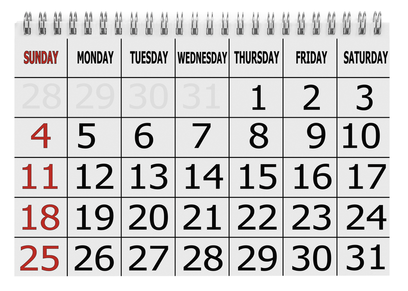

“But that was part of the deal. We both have to work one day out of the weekend,” Telly said.

“Well, which day do you want?” Carey asked.

“I don’t know. I haven’t really thought about it,” Telly said. “But we could make it really random.”

“How?” Carey asked.

Telly took two pieces of paper and wrote Saturday on one and Sunday on the other.

“Now we can figure out the probability of you getting Saturday or Sunday,” she said.

**We can stop there. This lesson is all about probability. Telly’s experiment is an example of experimental probability. Let’s talk more about this at the end of the lesson.**

**_What You Will Learn_**

In this lesson, you will learn how to demonstrate the following skills.

* Recognize the theoretical probability of an event as the ratio of favorable outcomes to possible outcomes.
* Recognize the experimental probability of an event as the ratio of successful outcomes to trials attempted.
* Write and compare probabilities as fractions, decimals and percents.
* Make and compare predictions based on theoretical and experimental probabilities, justifying the use of either.

**_Teaching Time_**

I. **Recognize the Theoretical Probability of an Event as the Ratio of Favorable Outcomes to Possible Outcomes**

In this chapter we have explored different outcomes for events, but not probability itself. **_Probability_** **is defined as a mathematical way of calculating how likely an event is to occur.** The **probability** of an event occurring is defined as the ratio of **_favorable outcomes_** to the number of possible equally likely **_total outcomes_** in a given situation. In ratio form, the probability of an event is:

$P \text{(event)}=\text{favorable outcomes} : \text{total outcomes}$

**_Theoretical probability_** **is probability that is based on an ideal situation.** For example, since a flipped coin has two sides and each side is equally likely to land up, the theoretical probability of landing heads (or tails) is _exactly_ 1 out of 2. Whether or not the coin actually lands on heads (or tails) 1 out of every 2 flips in the real world does not affect theoretical probability. The theoretical probability of an event remains the same no matter how events turn out in the real world.

Example

Find the probability of tossing a number cube and having it come up “4”.

**Step 1:** Find the total number of outcomes

$$
\begin{align*}
\text{Total outcomes} &= \bullet \ 1 \ \bullet \bullet \ 2 \ \bullet \bullet \bullet \ 3 \ \bullet \bullet \bullet \bullet \ 4 \ \bullet \bullet \bullet \bullet \bullet \ 5 \ \bullet \bullet \bullet \bullet \bullet \bullet \ 6 \\
&= 6 \ \text{total outcomes}
\end{align*}
$$

**Step 2:** Find the number of favorable outcomes.

$$
\begin{align*}
\text{favorable outcomes} &= \bullet \ 1 \ \bullet \bullet \ 2 \ \bullet \bullet \bullet \ 3 \ \ {\color{red}\bullet \bullet \bullet \bullet \ 4} \ \bullet \bullet \bullet \bullet \bullet \ 5 \ \bullet \bullet \bullet \bullet \bullet \bullet \ 6 \\
&= 1 \ \text{favorable outcome}
\end{align*}
$$

**Step 3:** Find the ratio of favorable outcomes to total outcomes.

$$
\text{Favorable}:\text{Total}= 1:6
$$

While theoretical probability is based on the ideal, we can also figure out experimental probability.

II. **Recognize the Experimental Probability of an Event as the Ratio of Successful Outcomes to Trials Attempted**

**_Theoretical probability_** is based on an ideal situation. Since a flipped coin seems equally likely to land up or down, the theoretical probability of landing heads (or tails) is 1 out of 2. Whether or not the coin actually lands on heads (or tails) 1 out of every 2 flips in the real world is something you must determine with **_experimental probability_**.

**_Experimental probability_** **is probability based on doing actual experiments** – flipping coins, spinning spinners, picking ping pong balls out of a jar, and so on. To compute the experimental probability of the number cube landing on 3 you would need to conduct an experiment. Suppose you were to toss the number cube 60 times.

")

\[Figure 3\]

Total outcomes: 60 tosses

Experimental probability:

$$
P(3) =\frac{favorable \ outcomes}{total \ outcomes}=\frac{Number \ of \ 3's}{Total \ Number \ of \ tosses}
$$

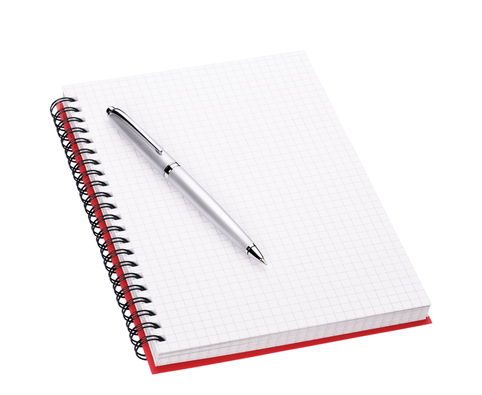

Example

What is the experimental probability of having the number cube land on 3?

| **trial** | **1** | **2** | **3** | **4** | **5** | **6** | **Total** |
| --- | --- | --- | --- | --- | --- | --- | --- |
| raw data:3s | ${\|}$ | ${\|}$ |     | ${\|}$ | ${\|}$ | ${\|}$ |     |
| favorable outcomes:3s | 1   | 3   | 0   | 1   | 2   | 2   | 9   |
| **total tosses** total outcomes | 10  | 10  | 10  | 10  | 10  | 10  | 60  |
| **experimental probability:** favorable outcomes to total outcomes | x   | x   | x   | x   | x   | x   | $9:60=3:20$ |

The data from the experiment shows that 3 turned up on the number cube 9 out of 60 times. Simplified, this ratio becomes:

$$
\text{Favorable outcomes}:\text{total outcomes}= 3:20
$$

**You can see that it is only possible to calculate the experimental probability when you are actually doing experiments and counting results.**

Example

A spinner was spun in a probability experiment 48 times. The results are shown in the table. Compute the experimental probability of the spinner landing on yellow.

| --- | --- | --- | --- | --- |
| **raw data** | $\cancel{\|} \ \cancel{\|} \ \cancel{\|} \ {\|}$ | $\cancel{\|} \ \cancel{\|} \ {\|}$ | $\cancel{\|} \ \cancel{\|} \ \cancel{\|} \ {\|}$ | 48  |
| **total from tally** | 16  | 14  | 18  | 48  |
| **favorable outcomes:yellow** | x   | x   | 18  | x   |
| **experimental probability:** | x   | x   | $\colorbox{yellow}{\color{red}18:48}$ | x   |

The data from the experiment above shows that the arrow landed on yellow 18 out of 48 times. Simplified, this ratio becomes:

$$
\begin{align*}
\text{Favorable outcomes} : \text{total outcomes} &= 18:48\\
&= 3:8
\end{align*}
$$

**_Notice that the ratio 18 out of 48 was simplified to 3 out of 8. We can simplify probabilities because they are written in ratio form._**

III. **Write and Compare Probabilities as Fractions, Decimals and Percents**

You’ve seen how to compute probabilities in terms of ratios. Since any ratio can be turned into a fraction, decimal, or percent, you can also turn any probability into a fraction, decimal, or percent.

For example, when you toss a number cube, the probability of rolling a “3” is:

$$
\begin{align*}
P (3) &=\text{favorable outcomes} : \text{total outcomes}\\
P (3) &= 1 : 6
\end{align*}
$$

You can write the same probability as a fraction simply by rewriting the two numbers in the ratio as the numerator and denominator of a fraction.

$P(3)=\frac{1}{6}$

**This is the answer in fraction form.**

**How can we turn this fraction into a decimal?**

**You can turn a fraction into a decimal by dividing the numerator by the denominator.**

$$
\frac{{\color{blue}1}}{{\color{red}6}}=\overset{ \ \ 0.167}{{\color{red}6} \overline{ ) {{\color{blue}1}.000 \;}}}
$$

**How can we turn the decimal into a percent?**

**We can turn a decimal into a percent by multiply the decimal by 100 since a percent is out of 100. Then we can move the decimal point two decimal places to show the percent.**

$0.167 = 0.167 \times 100 = 16.7\%$

**To summarize, the probability of rolling a 3 with a number cube is 1 out of 6, or:**

| **ratio** | **fraction** | **decimal** | **percent** |
| --- | --- | --- | --- |
| **1:6** | **$\frac{1}{6}$** | **0.167** | **16.7%** |

IV. **Make and Compare Predictions Based on Theoretical and Experimental Probabilities, Justifying the Use of Either**

**A** **_prediction_** **is a reasonable guess about what will happen in the future.** Good predictions should be based on facts and probability. There are two main types of predictions.

**Type 1: Predictions based on theoretical probability:** These are the most reliable types of predictions, based on physical relationships that are easy to see and measure and that do not change over time. They include such things as:

* coin flips
* spinners
* number cubes

**Type 2: Predictions based on data and experimental probability:** These predictions are often reliable, but subject to change depending on the situation. They include such activities as:

* batting averages, shooting percentages, and similar data from sports
* predicting the weather
* sales figures from such things as movies, TV shows, products
* polls and surveys that measure opinion
* historical data that measures past events

The difference between the two types of prediction is best illustrated by the following examples.

* Type 1: Coin flip prediction: of 100 flips, 50 are predicted to turn up heads
* Type 2: Weather prediction: a 50 percent chance of rain tomorrow

Note that both predictions are about the future – and you never know what might happen in the future. Though it is HIGHLY UNLIKELY to occur, a coin could land on heads 10, or 20, or even 50 times in a row. Similarly, a weather data might predict a zero percent chance of rain. But on a given day, the unexpected could happen. The winds could change clouds could unexpectedly move out or move in. That’s why predictions based on experimental probability are always less reliable than those based on theoretical probability.

**In general, the greater the number of outcomes you have, the closer a prediction based on probability is likely to be.**

One hundred coin flips should turn out to be close to 50 percent heads; 1000 flips should be even closer to 50 percent; 10,000 flips should be closer yet. The same thing goes with weather forecasts. Over a year, forecasts are a lot more likely to be accurate than over a single day or a single week.

To make predictions, use the following formulas.

$\mathbf{Type \ 1 \ Prediction}= \text{theoretical probability} \cdot \text{number of trials}$

Or, for type 2 situations in which you do not have theoretical probability:

$\mathbf{Type \ 2 \ Prediction}= \text{experimental probability} \cdot \text{number of trials}$

**Problem:** Out of 150 number cube rolls, predict how many will turn up greater than 4.

**Step 1:** Find the theoretical or experimental probability.

$$
P(> 4) =\frac{favorable \ outcomes}{total \ outcomes}=\frac{2}{6}=\frac{1}{3}
$$

**Step 2:** Multiply the theoretical probability by the number of total trials

$$
\begin{align*}
\text{Prediction} &=\text{theoretical probability} \cdot \text{number of trials}\\
&=\frac{1}{3} \cdot 150 \\
&= 50
\end{align*}
$$

**Based on these numbers, you would predict that 50 out of 150 rolls would land on numbers greater than 4.**

**Now let’s apply what you have learned about predictions from the problem in the introduction.**

Real-Life Example Completed
---------------------------

**_Weekend Woes_**

**Here is the original problem from the introduction. Think about how this is an example of experimental probability and then figure out the probability of Carey working Saturday in fraction, decimal and percentage form.**

“I don’t want to work on the weekend,” Carey said to Telly at lunch one day.

“But that was part of the deal. We both have to work one day out of the weekend,” Telly said.

“Well, which day do you want?” Carey asked.

“I don’t know. I haven’t really thought about it,” Telly said. “But we could make it really random.”

“How?” Carey asked.

Telly took two pieces of paper and wrote Saturday on one and Sunday on the other.

“Now we can figure out the probability of you getting Saturday or Sunday,” she said.

**_Solution to Real – Life Example_**

**Carey has a chance of working Saturday or Sunday. There are two possible outcomes. She has a one out of 2 chance of working on Saturday and a one out of two chance of working on Sunday.**

$\frac{1}{2}$

.50

**50% chance or probability for each outcome.**

Vocabulary
----------

Here are the vocabulary words that are found in this lesson.

__Probability__

a mathematical way of calculating how likely an event is to occur.

__Favorable Outcome__

the outcome that you are looking for

__Total Outcomes__

all of the outcomes both favorable and unfavorable.

__Theoretical Probability__

probability based on an ideal situation relating favorable to total outcomes

__Experimental Probability__

probability based on doing actual experiments.

__Prediction__

a reasonable guess based on probability

Time to Practice
----------------

Directions: Solve each problem.

A spinner has five sections: purple, yellow, green, blue and red.

1.  Find the probability for the arrow landing on blue on the spinner:
    1.  List each favorable outcome.
    2.  Count the number of favorable outcomes.
    3.  Write the total number of outcomes.
    4.  Write the probability.
2.  Find the probability for the arrow landing on red or green on the spinner:
    1.  List each favorable outcome.
    2.  Count the number of favorable outcomes.
    3.  Write the total number of outcomes.
    4.  Write the probability.
3.  Find the probability for the arrow NOT landing on yellow on the spinner:
    1.  List each favorable outcome.
    2.  Count the number of favorable outcomes.
    3.  Write the total number of outcomes.
    4.  Write the probability.
4.  Find the probability for rolling 6 on the number cube:
    1.  List each favorable outcome.
    2.  Count the number of favorable outcomes.
    3.  Write the total number of outcomes.
    4.  Write the probability.
5.  Find the probability for rolling greater than 2 on the number cube:
    1.  List each favorable outcome.
    2.  Count the number of favorable outcomes.
    3.  Write the total number of outcomes.
    4.  Write the probability.
6.  Find the probability for rolling less than 4 on the number cube:
    1.  List each favorable outcome.
    2.  Count the number of favorable outcomes.
    3.  Write the total number of outcomes.
    4.  Write the probability.
7.  Find the probability for rolling 1 or 6 on the number cube:
    1.  List each favorable outcome.
    2.  Count the number of favorable outcomes.
    3.  Write the total number of outcomes.
    4.  Write the probability.
8.  A box contains 12 slips of paper numbered 1 to 12. Find the probability for randomly choosing a slip with a number less than 4 on it:
    1.  List each favorable outcome.
    2.  Count the number of favorable outcomes.
    3.  Write the total number of outcomes.
    4.  Write the probability.

Directions: Use the table to answer the questions. Express all ratios in simplest form.

Use the table to compute the experimental probability of flipping a coin and having it land on heads.

| **trial** | **1** | **2** | **3** | **4** | **5** | **6** | **Total** |
| --- | --- | --- | --- | --- | --- | --- | --- |
| **raw data(heads)** | $\cancel{\|}$ | $\cancel{\|} \ {\|}$ | $\cancel{\|} \ {\|}$ | ${\|}$ | $\cancel{\|} \ {\|}$ | $\cancel{\|}$ |     |
| **number of heads** | 5   | 6   | 6   | 3   | 6   | 5   | 31  |
| **total number of flips** | 10  | 10  | 10  | 10  | 10  | 10  | 60  |
| **experimental probability** | x   | x   | x   | x   | x   | x   | 31:60 |

9.  How many favorable outcomes were there in the experiment?
10. How many total outcomes were there in the experiment?
11. What was the experimental probability of the coin landing on heads? 31:60

Use the table to compute the experimental probability of a number cube landing on 6.

| **trial** | **1** | **2** | **3** | **4** | **5** | **Total** |
| --- | --- | --- | --- | --- | --- | --- |
| **raw data** | ${\|}$ | ${\|}$ | ${\|}$ | ${\|}$ | ${\|}$ | x   |
| **number of 6's** | 4   | 1   | 1   | 2   | 1   | 9   |
| **total tosses** | 10  | 10  | 10  | 10  | 10  | 50  |
| **experimental probability** | x   | x   | x   | x   | x   | 9:50 |

12. How many favorable outcomes were there in the experiment?
13. How many total outcomes were there in the experiment?
14. What is the experimental probability of the arrow landing on yellow?

Directions: Use what you have learned about probability, fractions, decimals and percents to answer each question.

A bag has 6 red marbles, 5 blue marbles, 7 green marbles, 2 white marbles, and 5 yellow marbles. Find the probability of randomly picking out one of the following.

15. What is the probability in fraction form of choosing red marble?
16. What is the probability in decimal form of choosing green marble?
17. What is the probability in percent form of choosing a green or blue marble?
18. Which 3 marbles together have a 60 percent chance of being chosen?
19. Which 2 marbles together have a 40 percent chance of being chosen?
20. Which 3 marbles together have a 0.72 chance of being chosen?

</article>

### 11.5 Probability and Odds

<article>

Introduction
------------

**_The Rainstorm_**

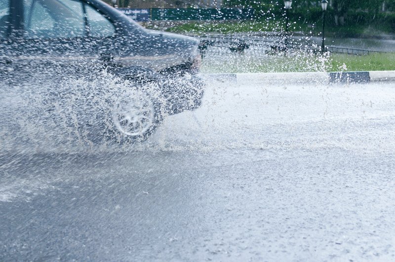

“I can’t believe it!” Ms. Kelley exclaimed as she came into the shop.

“What?” both girl asked alarmed.

“There is a 4 to 5 chance that it is going to rain on Saturday. I just heard the weather report,” Ms. Kelley said sighing.

“Well, there is still a chance that it won’t,” Telly said trying to cheer her up.

**When we think about chances and odds, we can calculate the likelihood that an event will or won’t occur. In this case, there are odds that it will rain and odds that it won’t. We can also express those odds as a fraction or a percentage. Learn about odds in this lesson and you can work on the odds of the rainstorm at the end.**

**_What You Will Learn_**

In this lesson, you will learn how to complete the following skills.

* Recognize and distinguish among overlapping, disjoint and complementary events, including the use of Venn diagrams and set notation.
* Recognize the odds in favor of events as the ratio of favorable outcomes to unfavorable outcomes.
* Recognize the odds in favor of events are the ratio of the probability that the event will occur.
* Calculate odds using outcomes or probabilities.
* Calculate probabilities given odds.

**_Teaching Time_**

I. **Recognize and Distinguish among Overlapping, Disjoint and Complementary Events**

When we spin a spinner or roll a die to calculate a probability, some probabilities have events in common and some don’t. This is where we can begin to talk about identifying **_disjoint events_**. **_Disjoint events_** **are events that don’t have any outcomes in common.**

Example

Consider spinning this spinner.

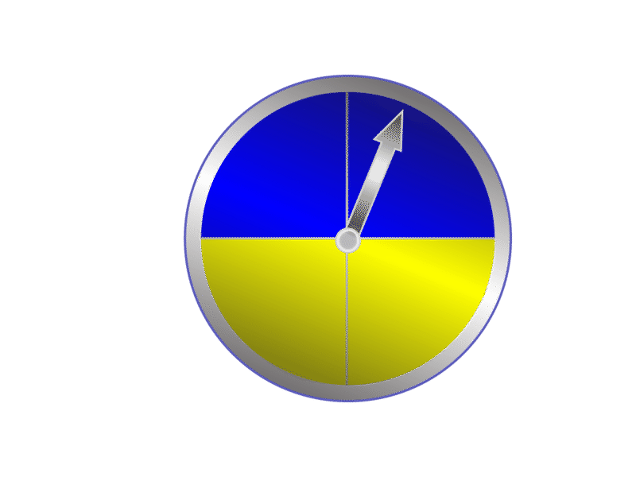
* Event B: {blue}

Events A and B are disjoint events because they have no outcomes in common – the arrow either lands on blue or yellow.

We can use a Venn diagram to show when events overlap and when they don’t overlap. A Venn diagram is something that you may have seen before. It has round shapes that overlap or don’t overlap. The Venn diagram for disjoint events shows no overlap between the two events.

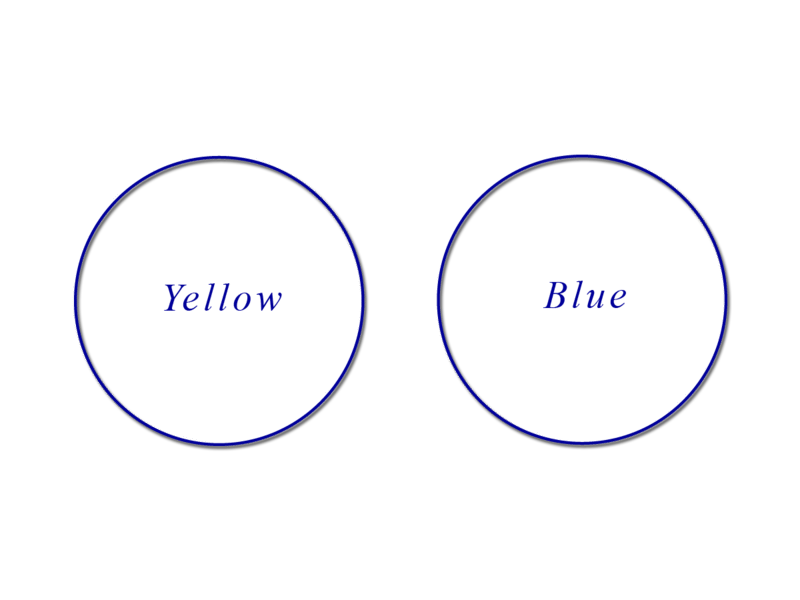

Example

Consider this spinner and the events R (red) and T (top).

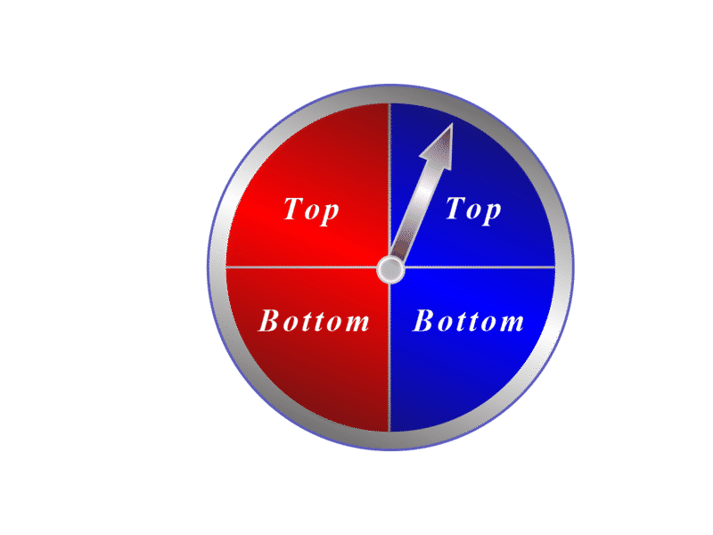
* Event T: {**red-top**, blue-top}

Clearly, both events share an outcome – red-top – so the two are called **overlapping events**. The Venn diagram for overlapping events shows that the two events overlap, or share 1 or more outcomes.

 or 100 percent.**")

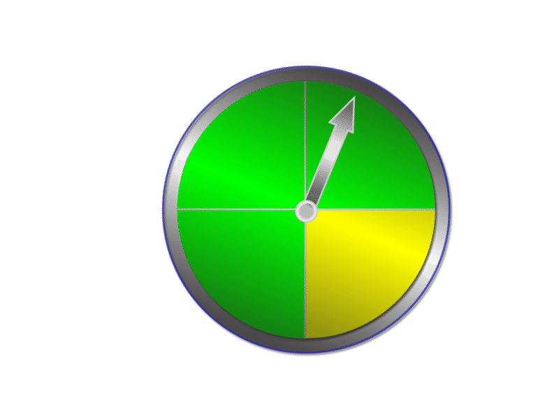

$P \text{(yellow)} + P \text{(green)} = 1$

**Complementary events are** **_either-or_** **events. Either the spinner above lands on green or it lands on yellow. There are no other outcomes.**

II. **Recognize the Odds in Favor of Events as the Ratio of Favorable Outcomes to Unfavorable Outcomes**

You’ve seen that the probability of an event is defined as a ratio that compares the favorable out comes to the total outcomes. We can write this ratio in fraction form.

$$
P \text{(event)} = \frac{favorable \ outcomes}{total \ outcomes}
$$

Sometimes people express the likelihood of events in terms of **odds** rather than probabilities. The **odds** of an event occurring are equal to the ratio of favorable outcomes to **unfavorable outcomes**.

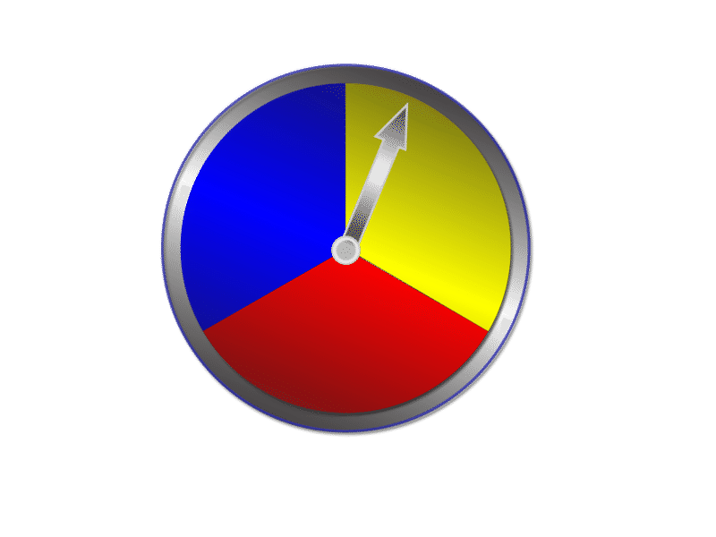

$$
\begin{align*}
\text{favorable outcomes} &= 1 \text{(red)} \\
\text{unfavorable outcomes} &= 2 \text{(blue, yellow)} \\
\text{total outcomes} &= 3
\end{align*}
$$

So the _probability_ of spinning red is:

$$
P \text{(red)} = \frac{favorable \ outcomes}{total \ outcomes} = \frac{1}{3}
$$

While the _odds_ in favor of red are:

$$
\text{Odds(in favor of red)} = \frac{favorable \ outcomes}{unfavorable \ outcomes} = \frac {1}{2}
$$

Odds _against_ an event occurring are defined as:

$$
\text{Odds(against red)} = \frac{unfavorable \ outcomes}{favorable \ outcomes} = \frac{2}{1}
$$

**You can solve any probability problem in terms of odds rather than probabilities. Notice that the ratio represents what is being compared. Be sure that your numbers match the comparison.**

Example

What are the odds in favor of a number cube landing on 4?

**Step 1:** Find the favorable and unfavorable outcomes.

$$
\begin{align*}
\text{favorable outcomes} &= 1(4) \\
\text{unfavorable outcomes} &= 5 (1, 2, 3, 5, 6)
\end{align*}
$$

**Step 2:** Write the ratio of favorable to unfavorable outcomes.

$$
\text{Odds}(4) = \frac{favorable \ outcomes}{unfavorable \ outcomes} = \frac{1}{5}
$$

**The odds in favor of rolling a 4 are 1 to 5.**

III. **Recognize the Odds in Favor of Event as the Ratio of the Probability that the Event Will Occur**

We can use odds to calculate how likely an event is to happen. We can compare the odds in favor of an event with the probability that the event will actually occur. Let’s look at an example.

Example

You’ve seen that the odds in favor of an event $(E)$ occurring are shown in this ratio.

$$
\text{Odds(in favor of} \ E) = \frac{favorable \ outcome}{unfavorable \ outcome} = \frac{1}{2}
$$

And the odds _against_ the same event occurring are:

$$
\text{Odds(against} \ E) = \frac{unfavorable \ outcome}{favorable \ outcome} = \frac{2}{1}
$$

**You can use these two facts to compute the ratio of things happening and not happening.**

* Odds in favor of rain: 7 to 3

**These odds tell you not only the odds of rain, but also the odds of** **_not_** **raining.**

If the odds in favor or rain are 7 to 3, then the odds against rain are:

* Odds against rain: 3 to 7

Another way of saying that is:

* Odds that it will NOT rain: 3 to 7

**You can use this idea in many different situations. If you know the odds that something will happen, then you also know the odds that it will not happen.**

IV. **Calculate Odds using Outcomes or Probabilities**

You can express the likelihood of an event using odds or probabilities. To convert probabilities into odds, go over the problem below.

The weather report forecasts that there is a 30 percent probability that it will rain tomorrow. What are the odds that it will rain tomorrow?

**Step 1:** Turn the probability into a fraction in simplest form.

$$
\begin{align*}
30. &= \frac{30}{100}\\
&= \frac{3}{10}
\end{align*}
$$

**Step 2:** Express the fraction in terms of favorable outcomes and total outcomes.

$$
P \text{(rain)} = \frac{favorable \ outcomes} {total \ outcomes} = \frac{3}{10}
$$

**Step 3:** Subtract the favorable outcomes from the total number of outcomes to find the unfavorable outcomes.

$$
\begin{align*}
\text{total outcomes} - \text{favorable outcomes} &= \text{unfavorable outcomes} \\
10 - 3 &= 7
\end{align*}
$$

**Step 4:** Use the favorable outcomes and unfavorable outcomes to find the odds.

$$
\text{Odds(rain)} = \frac{favorable \ outcomes}{unfavorable \ outcomes} = \frac{3}{7}
$$

**The odds that it will rain tomorrow are 3 to 7.**

Real-Life Example Completed
---------------------------

**_The Rainstorm_**

**Here is the problem from the introduction. Answer each question at the end of the problem.**

Telly and Carey were already hard at work when Ms. Kelley came into the bike shop on Thursday morning. It was three days before the big race and there was still a lot of work to be done.

“I can’t believe it!” Ms. Kelley exclaimed as she came into the shop.

“What?” both girl asked alarmed.

“There is a 4 to 5 chance that it is going to rain on Saturday. I just heard the weather report,” Ms. Kelley said sighing.

“Well, there is still a chance that it won’t,” Telly said trying to cheer her up.

**What are the chances that it won’t rain?**

**What are the odds that it will as a percentage?**

**What are the odds that it won’t as a percentage?**

**_Solution to Real – Life Example_**

**What are the chances that it won’t rain?**

**We know that the odds of it raining is 4 to 5. Therefore it is a 1 out of 5 chance that it won’t rain. Not very good odds.**

**What are the odds that it will as a percentage?**

**4 to 5 can be written as a percentage – 80% chance of rain.**

**What are the odds that it won’t as a percentage?**

**1 to 5 can be written as a percentage – 20% chance that it won’t rain.**

Vocabulary
----------

Here are the vocabulary words that are found in this lesson.

__Disjoint events__

events that don’t have any outcomes in common.

__Complementary events__

probability that has a sum of 100%. Either/Or events are complementary events.

Time to Practice
----------------

Directions: Solve the problems. For overlapping events, tell which events overlap.

1.  For a flip of a coin, are events $H(\text{heads})$ and $T(\text{tails})$ disjoint or overlapping? Draw a Venn diagram to represent the events.
2.  For a flip of a coin, are events $H(\text{heads})$ and $T(\text{tails})$ complementary or non-complementary?
3.  For a single toss of a number cube, are $E(\text{even})$ and $T(3)$ disjoint events or overlapping events?
4.  For a single toss of a number cube, are $E(\text{even})$ and $S(6)$ disjoint events or overlapping events?
5.  For a single toss of a number cube, are $G3(\text{greater than} \ 3)$ and $O(\text{odd})$ disjoint events or overlapping events?
6.  For a single toss of a number cube, are $E(\text{even})$ and $O(\text{odd})$ complementary events or non-complementary events?

$ and $G(\text{green})$ disjoint events or overlapping events? Draw a Venn diagram to represent the events.")
8.  For a single spin, are $G(\text{green})$ and $L(\text{left})$ disjoint events or overlapping events? Draw a Venn diagram to represent the events
9.  For a single spin, are $Y(\text{yellow})$ and $R(\text{red})$ complementary or non-complementary events?
10. For a single spin, are $R(\text{right})$ and $L(\text{left})$ complementary or non-complementary events?
11. For a light switch, are ON and OFF disjoint or overlapping events?
12. For a light switch, are ON and OFF complementary or non-complementary events?
13. For an oven, are ON and OFF disjoint or overlapping events?

Directions: Solve the problems.

14. For rolling a number cube, what are the odds in favor of rolling a 2?
15. For rolling a number cube, what are the odds against rolling a 2?
16. For rolling a number cube, what are the odds in favor of rolling a number greater than 3?
17. For rolling a number cube, what are the odds in favor rolling a number less than 5?
18. For rolling a number cube, what are the odds against rolling a number less than 5?
19. For rolling a number cube, what are the odds in favor of rolling an even number?
20. For rolling a number cube, what are the odds against rolling an even number?

Directions: For a spinner numbered 1 – 10, answer the following questions.

21. For spinning the spinner, what are the odds in favor of the arrow landing on 10?
22. For spinning the spinner, what are the odds of the arrow NOT landing on 10?
23. For spinning the spinner, what are the odds in favor of the arrow landing on a number greater than 2?
24. For spinning the spinner, what are the odds in favor of the arrow NOT landing on a number greater than 2?
25. For spinning the spinner, what are the odds of the arrow not landing on a blue number greater than 5?

</article>

### 11.6 Conditional Probability

<article>

Introduction
------------

**_Bike Shop Repairs_**

Carey booked two appointments right away.

What are the chances that both of these appointments were booked on a Monday, Tuesday or Wednesday morning?

**Answering this question will require you to understand conditional probability. This lesson will teach you all that you need to know so that you will be able to figure out the solution to the problem by the end of the lesson.**

**_What You Will Learn_**

By the end of this lesson, you will be able to complete the following skills.

* Recognize and distinguish among independent and dependent events.
* Recognize and apply the definition of conditional probability to find probabilities in finite sample spaces.
* Calculate the probabilities of a series of independent events, mutually exclusive events and events that are not mutually exclusive.
* Make predictions involving conditional probability.

**_Teaching Time_**

I. **Recognize and Distinguish among Independent and Dependent Events**

In the last few sections, you have been learning all about probability. Now we can think about different events and how these events impact each other. Take a look at this example.

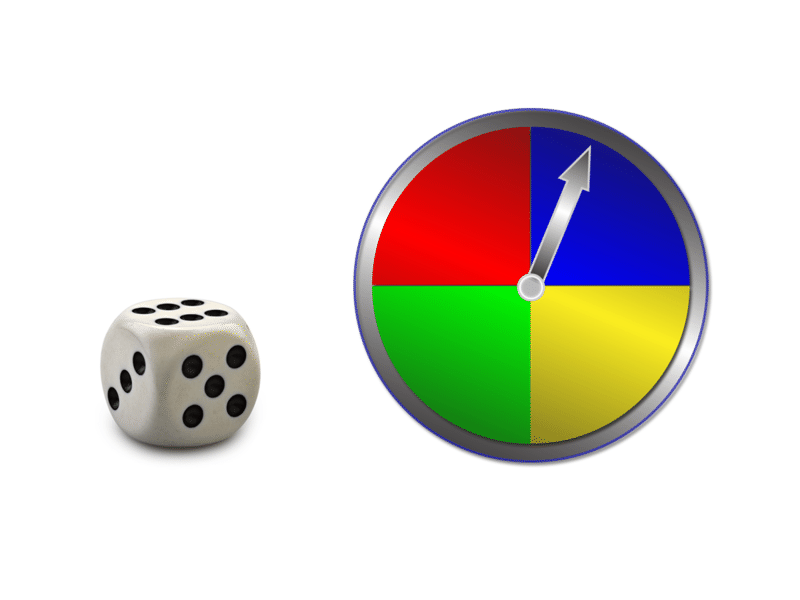

Event A: Toss 5 on the number cube

Event B: Spin blue on the spinner

The probability of each of these events by itself is easy enough to compute. In general:

$$
P \text{(event)} = \frac{favorable \ outcomes}{total \ outcomes}
$$

If this is the case, then we can write the following ratios for rolling a 5.

$$
\begin{align*}
P (5) &= \frac{favorable \ outcomes}{total \ outcomes} = \frac{1}{6}\\
P(\text{blue}) &= \frac{favorable \ outcomes}{total \ outcomes} = \frac{1}{4}
\end{align*}
$$

These two events were performed with a spinner and a number cube.

**Now a question arises.**

**_Does event A affect the probability of event B in any way?_**

That is, does the number cube landing on 5 affect where the arrow lands in the spinner? If not, then the two events are said to be **_independent events_**.

**Definition:** If the outcome of one event has no effect on the outcome of a second event, then the two events are **_independent events._**

**Events A and B above are independent events. No matter how the number cube turns up, its outcome does not affect the outcome of spinning the spinner.**

**Now let’s think about a different kind of example, one where the outcome of one event does impact the outcome of another event.**

Example

A bag has 3 red marbles, 4 blue marbles, and 3 green marbles. Irina pulls 1 green marble out of the bag. Does this change the probability that the next marble Irina pulls out of the bag will be green?

**Solution:** Here, the act of taking a marble out of the bag changes the situation. For the first marble, the probability of pulling out a green marble was:

$$
P \text {(green)} = \frac{favorable \ outcomes}{total \ outcomes} = \frac{3}{10}
$$

For the second marble, there are now only 9 marbles left in the bag and only 2 of them are green. So the probability of pulling out a green marble for the second marble is now:

$$
P \text {(green)} = \frac{favorable \ outcomes}{total \ outcomes} = \frac{2}{9}
$$

Clearly, the first event affected the outcome of the second event in this situation. So the two events are NOT independent. In other words, they are **_dependent events_**.

**Definition:** If the outcome of one event has an effect on the outcome of a second event, then the two events are **_dependent events._**

II. **Recognize and Apply the Definition of Conditional Probability to Find Probabilities in Finite Sample Spaces**

Sometimes the outcome that you get when figuring out a probability is what we call “conditional.” This means that we will only an outcome if the conditions designed to cause a specific result. Let’s look at an example.

Example

Consider a jar with 4 black marbles and 6 white marbles. If you pull out 2 marbles from the jar randomly, one at a time, without replacing the first marble, what is the probability that both marbles will be white?

**Start by approaching the problem the same as you would with independent events.** The probability of the first marble being white is:

$$
P (\text{white} \ 1 \text{st marble}) = \frac{6}{10} = \frac{3}{5}
$$

**What about the second marble?** Having removed the first marble from the bag, now instead of 6 white marbles out of 10 total marbles, there are only 5 white marbles left out of 9 total marbles:

$$
P (\text{white} \ 2 \text{nd marble}) = \frac{5}{9}
$$

This gives a probability of both events occurring as:

$$
\begin{align*}
P (\text{white then white}) &= P (\text{white} \ 1 \text{st marble}) \cdot P (\text{white} \ 2 \text{nd marble}) \\
&= \frac{3}{5} \cdot \frac{5}{9} \\
&= \frac{1}{3}
\end{align*}
$$

**The same general method works for calculating any two (or more) dependent events.**

Example

Jack’s Catering Service is accepting weekday appointments for Monday through Thursday, and weekend appointments for Friday through Sunday. If appointment dates are made randomly, what is the probability that 2 weekdays will be the first 2 days to be booked?

Solution: The probability that the first day will be a weekday is:

$$
P (\text{weekday} \ 1 \text{st}) = \frac {4}{7}
$$

The probability that the second booked day will also be a weekday is:

$$
P (\text{weekday} \ 2 \text{nd}) = \frac {3}{6} = \frac{1}{2}
$$

$$
\begin{align*}
P \text{(weekday and weekday)} &= P \text{(weekday} \ 1 \text{st}) \cdot P \text{(weekday} \ 2 \text{nd}) \\
&= \frac{4}{7} \cdot \frac{1}{2}\\
&= \frac{2}{7}
\end{align*}
$$

Now let’s look at conditional probability and outcomes.

**_Conditional probability_** **involves situations in which you determine the probability of an event based on another event having occurred**.

For example, suppose you roll two number cubes on a table. The first cube lands face up on 5. The second cube falls off of the table so you can’t see how it landed. Given what you know so far, what is the probability that the sum of the number cubes will be 9?

**To solve this problem, consider the entire sample space for rolling two number cubes.**

$$
\begin{align*}
&66 \quad 56 \quad {\color{red}46} \quad 36 \quad 26 \quad 16 \\
&65 \quad 55 \quad {\colorbox{yellow}{\color{red}45}} \ \ 35 \quad 25 \quad 15 \\
&64 \quad 54 \quad {\color{red}44} \quad 34 \quad 24 \quad 14 \\
&63 \quad 53 \quad {\color{red}43} \quad 33 \quad 23 \quad 13 \\
&62 \quad 52 \quad {\color{red}42} \quad 32 \quad 22 \quad 12 \\
&61 \quad 51 \quad {\color{red}41} \quad 31 \quad 21 \quad 11
\end{align*}
$$

You already know that the first number cube landed on 4, so now you need to consider only those outcomes marked in red. Only 1 of those 6 results in a 9, so:

$$
P (9 | 4) = \frac{favorable \ outcomes}{total \ outcomes} = \frac{1}{6}
$$

Notice that we write the conditional probability as $P (9 | 4)$. You can read this as:

$P (9|4) \Longleftarrow$ the probability of 9, given 4

Here are some other examples of how to read this notation.

$P (B|A) \Longleftarrow$ the probability of $B$, given $A$

$P (7|3) \Longleftarrow$ the probability of 7, given 3

$P (\text{heads}| \text{tails}) \Longleftarrow$ the probability of heads, given tails

$P (\text{red}| \text{blue}) \Longleftarrow$ the probability of red, given blue

**The probability is determined because certain factors are in place.**

III. **Calculate Probabilities of a Series of Independent Events, Mutually Exclusive Events and Events that are not Mutually Exclusive**

Sometimes, we have mutually exclusive events and we have events that overlap and are not mutually exclusive.

In a previous section, you saw that event $R(\text{red})$ and event $T(\text{top})$ are **_overlapping events_** because both events share one outcome – red-top. The Venn diagram for overlapping events shows that the two events overlap, or share 1 or more outcomes.

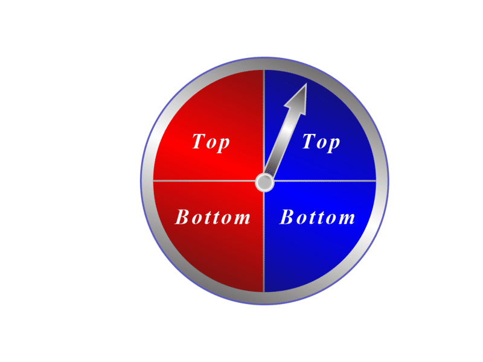

$$
\begin{align*}
& \mathbf{red - top} \qquad \ \text{blue}-\text{top}\\
& \text{red}-\text{bottom} \quad \text{blue}-\text{bottom}
\end{align*}
$$

The probability of red-top is:

$$
P(\text{red}-\text{top}) = \frac{favorable \ outcomes} {total \ outcomes} = \frac{1}{4}
$$

You can compute the probabilities of other overlapping events in a similar way.

Example

For a single toss of a number cube, what is the probability of event $E(\text{even})$ and event $S(4)$ both occurring?

**Step 1:** Identify the overlapping outcomes of both events.

$$
\begin{align*}
E (\text{even}) &= 2, \mathbf{4}, 6 \\
S(4) &= \mathbf{4}
\end{align*}
$$

**Step 2:** Find the total number of outcomes.

$$
\begin{align*}
\text{total outcomes} &= 1, 2, 3, 4, 5, 6 \\
&= 6 \ \text{total outcomes}
\end{align*}
$$

**Step 3:** Find the probability of the overlapping events.

$$
P(4) = \frac{favorable \ outcomes}{total \ outcomes} = \frac{1}{6}
$$

IV. **Make Predictions Involving Conditional Probability**

**Think back for a minute and remember what we mean when we talk about conditional probability.**

**_Conditional probability_** **involves situations in which you determine the probability of an event based on another event having occurred.**

We can use conditional probability to determine probabilities, but also to make predictions. Look at this example.

Example

A stack of 12 cards has the Ace, King, and Queen of all 4 suits, spades, hearts, diamonds, and clubs. What is the probability that if you draw 2 cards randomly, they will both be hearts? Make a prediction.

**Step 1:** Draw the first card. The probability of it being a heart is 3 of 12.

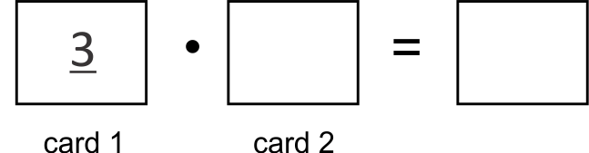

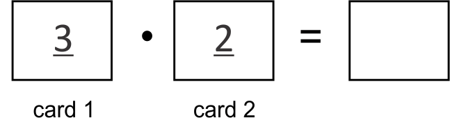

 = \frac{1}{22}$. You would predict that both cards would be hearts $\frac{1}{22}$ of the time.**")

Real-Life Example Completed
---------------------------

**_Bike Shop Repairs_**

**Here is the original problem from the introduction. Reread it and then solve it for the correct probability.**

On Thursday, Carey was in charge of answering the phones and booking appointments for bike repairs. The bike shop repairs bikes on Monday, Tuesday and Wednesday mornings and on Thursday and Friday afternoons. All appointments are booked randomly. The person making the appointment can choose or the person answering the phone can choose.

Carey booked two appointments right away.

What are the chances that both of these appointments were booked on a Monday, Tuesday or Wednesday morning?

**_Solution to Real – Life Example_**

**To work on this probability, first we must determine the probability of the first appointment booked being on a Monday, Tuesday or Wednesday. There are five possible days for appointments, but three favorable outcomes.**

**Probability of first appointment being Mon, Tues or Weds $=\frac{3}{5}$**

**Probability of second appointment being Mon, Tues or Weds $=\frac{2}{4}$ or $\frac{1}{2}$**

**Now we can multiply them for the conditional probability.**

$\frac{3}{5} \cdot \frac{1}{2} = \frac{3}{10}$ or 30%

**There is a 30% chance that the first two appointments booked would be on a Monday, Tuesday or Wednesday morning.**

Vocabulary
----------

Here are the vocabulary words that are found in this lesson.

__Independent Events__

The outcome of one event has no effect on the outcome of a second event.

__Dependent Events__

If the outcome of one event has an effect on the outcome of another event they are dependent events.

__Overlapping Events__

Events that share one outcome

__Conditional Probability__

Probability that is predicted based on specific criteria or conditions.

Time to Practice
----------------

Directions: Write whether events A and B are dependent or independent.

1.  A: Doug flips a coin. B: Marlene chooses a card out of a deck.
2.  A: In a bag with 5 white marbles and 5 black marbles, Sanjay pulls out a white marble. B: Without returning the marble to the bag, Sanjay pulls out a second marble.
3.  A: Eddie chooses the color blue for his new bike. B: Eddie chooses lasagne from the dinner menu.
4.  A: The probability that it will rain tomorrow. B: The probability that the Red Wings hockey team will win their game tomorrow.
5.  A: From a deck of cards, the probability of one player drawing a heart from the deck. B: On the next player’s turn, the probability of drawing another heart.
6.  A: The probability of a spinner landing on blue 6 times in a row. B: The probability of the spinner landing on blue on the next spin.
7.  A: The probability that the Rockies will be in the playoffs. B: The probability that the Rockies will win the World Series.
8.  A: The probability that tomorrow will be sunny. B: The probability that tomorrow will be a full moon.
9.  A The probability that tomorrow will be sunny. B: The probability that tomorrow will be cloudy.
10. A: The probability that it will be a half-moon today. B: The probability that it will be a full moon tomorrow.

Directions: Solve the problems.

11. A stack of 12 cards has 4 Aces, 4 Kings, and 4 Queens. What is the probability of picking 2 Aces from the stack at random?
12. What is the probability of picking an Ace then a King from the stack above?
13. What is the probability of picking 3 Queens from the stack above?
14. Stoyko’s shirt drawer has 4 colored t-shirts and 4 white t-shirts. If Stoyko picks out 2 shirts at random, what is the probability that they will both be colored?
15. If Stoyko picks out 2 shirts at random from the drawer above, what is the probability that the first one will be colored and the second one will be white?
16. On a game show, there are 16 questions: 8 easy, 5 medium-hard, and 3 hard. If contestants are given questions randomly, what is the probability that the first two contestants will get easy questions?
17. On the game show above, what is the probability that the first contestant will get an easy question and the second contestant will get a hard question?
18. On the game show above, what is the probability that both of the first two contestants will get hard questions?
19. For a single toss of a number cube, what is the probability that the cube will land on a number that is both odd and greater than 2?
20. For a single toss of a number cube, what is the probability that the cube will land on a number that is greater than 2 and less than 6?
21. For a single toss of a number cube, what is the probability that the cube will land on a number that is greater than 1 and less than 6?
22. What is the probability that a sum of a pair of number cubes will be 11 if the first cube lands on 5?
23. What is the probability that a sum of a pair of number cubes will be odd if the first cube lands on 2?
24. What is the probability that a sum of a pair of number cubes will be even and greater than 6 if the first cube lands on 4?
25. If you toss 2 number cubes, predict how likely they are to match.
26. If you toss 2 number cubes, predict how likely they are NOT to match.

</article>

### 11.7 Geometric Probability

<article>

Introduction
------------

**_The Bike Trick_**

The picture was of a bicyclist riding down a piece of pipe. In fact, the pipe had been split into two separate pieces and the bicyclist was able to ride on both pieces of the pipe.

“I made one of those once,” Ms. Kelley said looking at the article.

“How did you do that?” Telly asked.

“Well, you start with a 10 foot piece of pipe. Then you metal saw it into two separate pieces. You hope that your work is accurate and that you end up with a piece that is about 7 feet or longer. That way you can really ride down before the quick turn,” Ms. Kelly said walking away.

“What are the chances that the pipe is split like that?” Telly asked.

**This is another place for probability. This is geometric probability though, so pay close attention and you will be able to figure out this problem.**

**_What You Will Learn_**

By the end of this lesson, you will understand the following concepts.

* Recognize probability of a point in the area of a specified region as a ratio compared to the area of the entire region.
* Find geometric probabilities involving rectangular regions.
* Find geometric probabilities involving circular regions.
* Make predictions involving geometric probability.

**_Teaching Time_**

I. **Recognize Probability of a Point in One Area of a Specific Region as a Ratio Compared to the Area of the Entire Region**

The best way to begin thinking about geometric probability is to look at an example. Let’s start there.

Example

A bus is traveling on Four-Color Road through the towns of Greenville, Red Hook, Yellow Town, and Mt. Blue. Each town takes up exactly 1 mile of distance on the Four-Color Road.

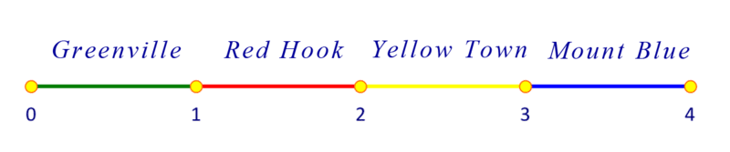

**Let’s think about how we can solve this problem. To solve it, imagine that not a single rider gets on the bus, but 100 riders. If each rider enters at some random point, you would expect to collect the riders to be evenly distributed over the 4 different towns.**

| **Day** | **Greenville** | **Red Hook** | **Yellow town** | **Mt.blue** |
| --- | --- | --- | --- | --- |
| expected riders | 25  | 25  | 25  | 25  |

Of course, in real life, the data might be slightly different, but overall you would expect 25 of 100, or $\frac{1}{4}$ of the riders, to get on in Greenville. In probability terms:

$$
P(\text{Greenville}) = \frac{1}{4}
$$

**This is because there is one spot out of four possible points that a person could be picked up on the bus.**

In general:

The probability of a randomly selected point to be located in a given “favorable” section of a distance is equal to the ratio of the length of the favorable section to the entire distance.

$$
\begin{align*}
P (\text{point in section}) &= \frac{\text{Length of ``favorable'' section}}{\text {Total distance}}
\end{align*}
$$

Let’s look at another problem where we will use the same diagram of the four color towns.

Example

In the bus problem above, what is the probability that a rider will randomly board the bus in Red Hook or Yellow Town?

**To solve this problem represent the rider as a point that can appear anywhere along the route.**

$$
\begin{align*}
P (\text{Red Hook or Yellow Town}) &= \frac{\text{length of ``favorable'' section}}{\text {total distance}} \\
&= \frac{1 \ mile + 1 \ mile}{4 \ miles} \\
&= \frac{1}{2}
\end{align*}
$$

**You would expect the rider to board the bus in Red Hook or Yellow Town about $\frac{1}{2}$ of the time.**

**These two examples are related to geometric probability-space and possible outcomes. The space of the road is four roads. There are four possible outcomes within the four roads.**

II. **Find Geometric Probabilities Involving Rectangular Regions**

If we think about geometric probability and rectangles, we can use the following example to help us understand this concept.

Example

As a joke, a tennis player on the left side of the court who was attempting to place his serve into service box $A$ hit a serve straight up in the air as high as he could. The ball landed on the green side of the court in some random location.

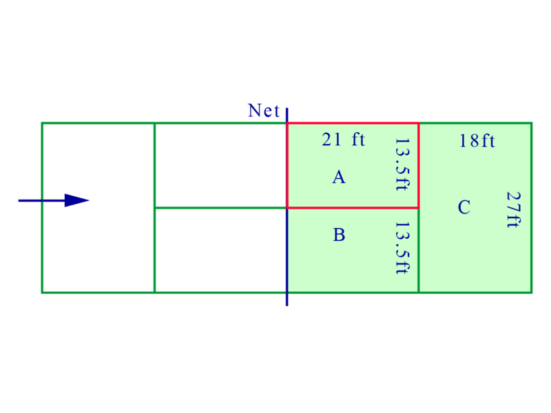

**Think back to the information that you just learned in the last section. In this section, you learned how to determine where one point can be randomly located within other given sections. Here we have possible outcomes and we have our favorable outcome identified. It is identified physically in space and not just in number form.**

$$
\begin{align*}
P (\text{point in section}) &= \frac{\text{length of ``favorable'' section}}{\text{total distance}}
\end{align*}
$$

**A similar rule applies for area.**

The probability of a randomly selected point to be located in a section of an **area** is equal to the ratio of the area of the “favorable” section to the entire **area**.

$$
\begin{align*}
P (\text{point in section}) &= \frac{\mathbf{area} \ \text{of ``favorable'' section}}{\text{total} \ \mathbf{area}}
\end{align*}
$$

**To find the probability that the ball will land in the box, just find the ratio of the area of box $A$ to the area of the entire green side of the court.**

$$
\begin{align*}
P (\text{ball lands in box}) &= \frac{\text{area of favorable section}}{\text{total area}} \\
&= \frac{\text{area of box}\ A}{\text{area box} \ A + \text{box} \ B + \text{box} \ C}
\end{align*}
$$

**Now calculate the area of box $A$, box $B$, and box $C$. You can look at the diagram to determine this. Remember that the formula for the area of a rectangle is $A = lw$ and the units are measured in square units. In this case, it will be square feet.**

$$
\begin{align*}
\text{Box} \ A &= 21 \ ft \cdot 13.5 \ ft \\
&= 283.5 \ sq \ ft \\
\text{Box} \ B &= 21 \ ft \cdot 13.5 \ ft \\
&= 283.5 \ sq \ ft \\
\text{Box} \ C &= 18 \ ft \cdot 27 \ ft \\
&= 486 \ sq \ ft
\end{align*}
$$

So:

$$
\begin{align*}
P(\text{ball lands in box}) &= \frac{\text{area of ``favorable'' section}}{\text{total area}}\\
&= \frac{\text{area} \ A}{\text{area} \ B + \text{area} \ B + \text{area} \ C} \\
&= \frac{283.5}{1053} \\
&= 26.9\%
\end{align*}
$$

**The ball has a little more than a 1 in 4 chance of landing in the service box.**

III. **Find Geometric Probabilities Involving Circular Regions**

In the last section, we looked at geometric probability involving rectangular regions. To solve these problems, we used the formula for the area of a rectangle and then we used information tha we have already learned about ratios and percentages to determine our outcomes. We can also work with circular regions. This lesson will teach you how to figure out the geometric probability of circular regions. Let’s look at an example.

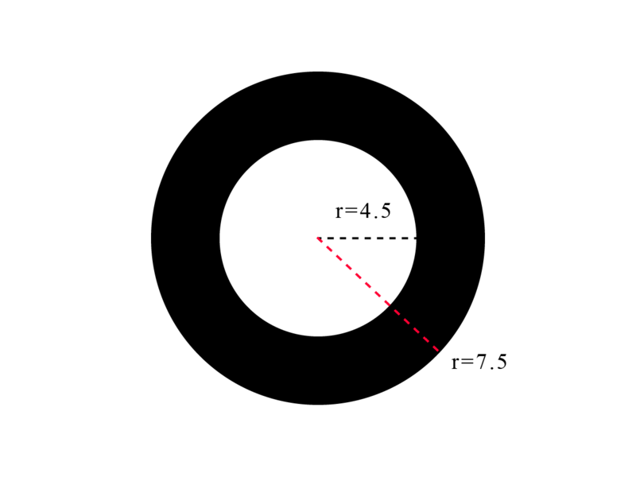

**The probability for a random point being located in the white circle is therefore:**

$$
\begin{align*}
P(\text{white}) &= \frac{\text{Area of white}}{\text{Total area}}
\end{align*}
$$

**Use the formula for the area of a circle, $A = \pi r^2$ to find the area of the white circle and the total area of the figure.**

$$
\begin{align*}
A (\text{white}) &= \pi r^2 \\
&= (3.14) \cdot (4.5) \cdot(4.5) \\
&= 63.6 \ sq \ in \\
A \text{(large)} &= \pi r^2 \\
&= (3.14) \cdot(7.5) \cdot (7.5) \\
&= 176.6 \ sq \ in
\end{align*}
$$

So:

$$
\begin{align*}
P (\text{white}) &= \frac{\text{area of white}}{\text{total area}} \\
&= \frac{63.6}{176.6} \\
&= 36\%
\end{align*}
$$

**To find the probability of a point being randomly located in the black region, first find the area of the black region.**

$$
\begin{align*}
A (\text{black}) &= \text{total area} - \text{white area} \\
&= 176.6 - 63.6 \\
&= 113.0
\end{align*}
$$

So:

$$
\begin{align*}
P (\text{black}) &= \frac{\text{area of black}}{\text{total area}} \\
&= \frac{113.0}{176.6} \\
&= 64\%
\end{align*}
$$

Notice that an easy way to find the $P(\text{black})$ is to recognize that $P(\text{black})$ and $P(\text{white})$ are **_complementary_** events.

**The point must be either in the black area or the white area, so the two probabilities must add up to 100 percent.**

$$
\begin{align*}
P (\text{black}) + P (\text{white}) &= 100. \\
P(\text{black}) + 36. &= 100. \\
{\color{red}64\%} + 36. &= 100\%
\end{align*}
$$

**This is a way that we can check our work. Notice that you will need to use the formula for the area of a circle to determine geometric probability related to area.**

IV. **Make Predictions Involving Geometric Probability**

Now that you understand geometric probability, we can also make predictions involving geometric probability. This will help us to understand how to work with geometric probability. Let’s look at an example.

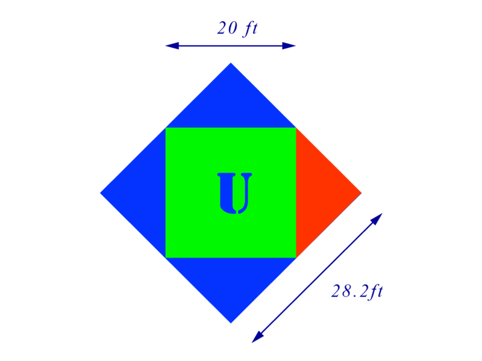

The Ultra Company displays this giant logo on a downtown billboard. The logo is lit up by thousands of small high definition LCD pixels. The pixels are often damaged or burn out. Predict where the next 60 damaged pixels will be located.

**Before making predictions, we must figure out the probability of each section.** To find the probability of where a damaged pixel will be located, first find the area of each section. As the diagram shows, each side of green square measures 20 feet, while each side of the blue diamond measures 28.2 feet

$$
\begin{align*}
A (\text{green}) &= 20 \cdot 20 \\
&= 400 \ sq \ ft \\
A (\text{diamond}) &= 28.2 \cdot 28.2 \\
&= 795.2 \ sq \ ft
\end{align*}
$$

**Now the total area of all 4 equal-sized triangles is equal to the area of the entire figure minus the central green square.**

$$
\begin{align*}
A (\text{diamond}) - A (\text{green}) &= A (4 \ \text{triangles}) \\
795.2 - 400 &= 395.2 \ sq \ ft
\end{align*}
$$

Since there are 4 equal-sized triangles, each triangle has the following areas.

$$
\begin{align*}
\text{Area of all triangles} \div 4 &= \text{area of single triangle} \\
395.4 \div 4 &= 98.9 \ sq \ ft
\end{align*}
$$

So:

$$
\begin{align*}
A \text{(red)} &= 98.9 \ sq \ ft \\
A \text{(blue)} &= 3 \cdot 98.9\\
&= 296.6 \ sq \ ft
\end{align*}
$$

To find the probability of each area:

$$
\begin{align*}
P (\text{green}) &= \frac{\text{area of green}}{\text{area of diamond}} \\
&= \frac{400}{795.2} \\
&= 50.2. \\
\\
P (\text{blue}) \ &= \frac{\text{area of blue}}{\text{area of diamond}} \\
&= \frac{296.6}{795.2} \\
&= 37.3\%\\
\\
P \text{(red)} \ \ &= \frac{\text{area of red}}{\text{area of diamond}} \\
&= \frac{98.9}{795.2} \\
&= 12.5\%
\end{align*}
$$

**Now that we have all of the probabilities figured out, we can make predictions. Remember that before you make a prediction, you will need to figure out the probability first. The probability will help you to figure out each prediction.**

**Problem:** Predict where the next 64 damaged pixels will be located in the figure above.

**Step 1:** Find the probabilities. (You already found them above.)

$$
\begin{align*}
P (\text{green}) &= 50.2. \\
P (\text{blue}) &= 37.3. \\
P (\text{green}) &= 12.5\%
\end{align*}
$$

**Step 2:** Multiply each probability by the number of events. In this case, the total number of events is 64, the number of damaged pixels. Round off where necessary

$$
\begin{align*}
\text{green} &= 0.502 \cdot 64 \\
&= 32 \\
\text{blue} &= 0.373 \cdot 64 \\
&= 24 \\
\text{red} &= 0.125 \cdot 64 \\
&= 8
\end{align*}
$$

**This is the answer.**

Real-Life Example Completed
---------------------------

**_The Bike Trick_**

**Here is the problem from the introduction. Use the information to figure out the probability that one piece of the pipe is greater than or equal to 7 feet in length.**

“Look at this,” Carey said showing Telly a picture of a stunt bike rider.

The picture was of a bicyclist riding down a piece of pipe. In fact, the pipe had been split into two separate pieces and the bicyclist was able to ride on both pieces of the pipe.

“I made one of those once,” Ms. Kelley said looking at the article.

“How did you do that?” Telly asked.

“Well, you start with a 10 foot piece of pipe. Then you metal saw it into two separate pieces. You hope that your work is accurate and that you end up with a piece that is about 7 feet or longer.That way you can really ride down before the quick turn,” Ms. Kelly said walking away.

“What are the chances that the pipe is split like that?” Telly asked.

**_Solution to Real – Life Example_**

Step 1: The minimum size for the larger piece would be 7 feet. That would make the smaller piece 3 feet in length. Mark this off on your diagram.

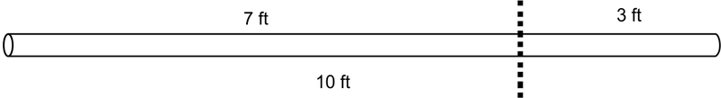

With 3 feet on either end, that leaves a 4 foot length in the center of the pipe.

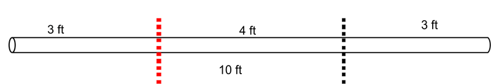

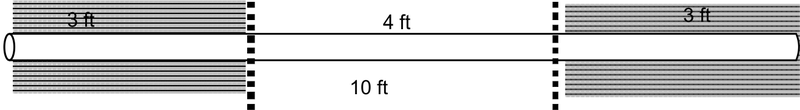

$$
\begin{align*}
P (> 7 \ ft) &= \frac{\text{length of favorable sections}}{\text{total distance}} \\
&= \frac{3 \ ft + 3 \ ft}{10 \ ft} \\
&= \frac{6}{10} \\ 
&= \frac{3}{5}
\end{align*}
$$

**The probability is 60% that one piece of the pipe will be 7 feet long or greater.**

Time to Practice
----------------

Directions: Draw diagrams to solve the problems.

1.  Geoff rode his bike along an 8 mile path and lost his cell phone at some random location somewhere along the way. What is the probability that Geoff’s phone dropped during the first mile of the path?
2.  In the phone problem above, what is the probability that Geoff dropped his phone during the first mile or the last 2 miles?
3.  In the phone problem above, Geoff searched from mile 4.5 to mile 7. What is the phone probability that he found the phone?
4.  In the phone problem above, a cell phone tower is located at mile 4 in the exact center of the path. The tower has a range of 2.75 miles. If Geoff uses a second cell phone to call his lost phone, what is the probability that the lost phone will ring?
5.  In the phone problem above, what range would the tower need to have to be sure that Geoff’s lost phone would ring?

Directions: Use this information on the football field to answer the following questions.

A football field is 120 yards long – 100 yards (green) plus two end zones (shown in red and blue) and 53 yards wide. The two hash mark lines that run across the center of the field are 13 yards apart and 20 yards from the sidelines. A pigeon flies over the stadium and lands at some random location on the football field.

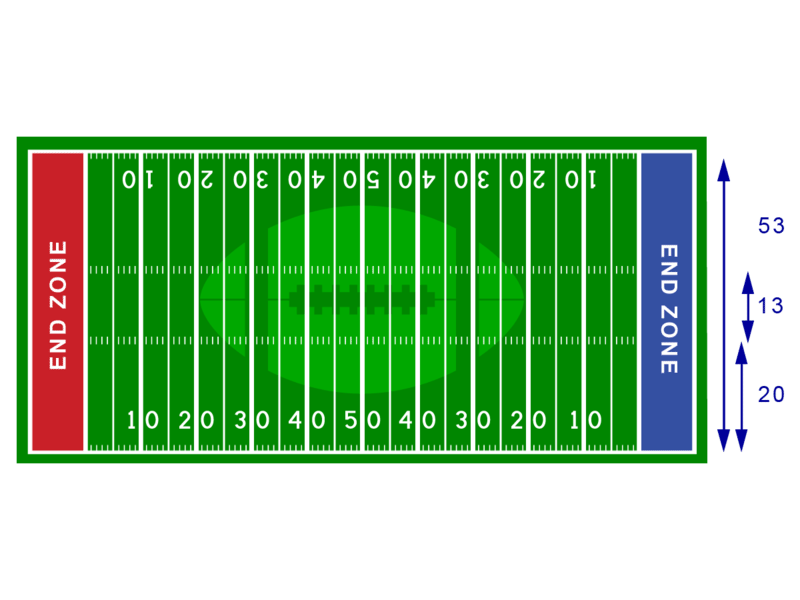
7.  What is the probability that the pigeon will land between the goal line and the 20 yard line on either side of the field?
8.  What is the probability that the pigeon will land within 5 yards of the 50-yard line?
9.  What is the probability that the pigeon will land between the two hash marks somewhere on the green part of the field?
10. What is the probability that the pigeon will land somewhere on the green part of the field outside of the hash marks (not between both hash marks)?
11. What is the probability that the pigeon will land between the two hash marks and between the two 40-yard lines?

Directions: Look at the diagram and then answer each question as it is related to geometric probabilities.

 is 1 meter. Each radius thereafter increases by 1 m, as shown. What is the probability of a randomly thrown dart landing on circle 1?")
13. What is the probability that the dart will land in circle 2?
14. What is the probability that the dart will land in circle 3?
15. What is the probability that the dart will land in circle 4?
16. What is the probability that the dart will land in circle 5?
17. What pattern describes how the probability changes for each circle?
18. What is the probability that the dart will land in a yellow area?
19. What is the probability that the dart will land in an orange area?

Directions: Now use what you have learned to make predictions.

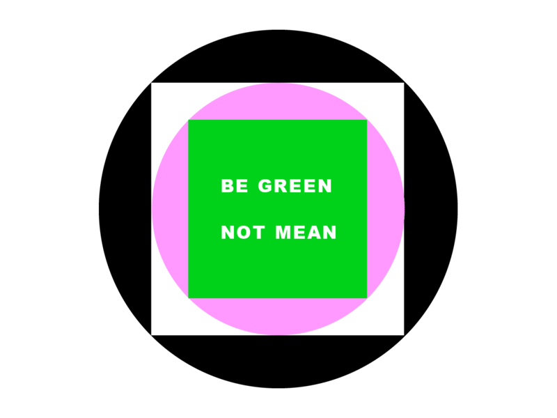

$$
\begin{align*}
\text{black circle radius} &= 13.8 \ ft \\
\text{pink circle radius} &= 10.0 \ ft \\
\text{white square side} &= 20.0 \ ft \\
\text{green square side} &= 14.1 \ ft
\end{align*}
$$

20. Of the next 240 pixels in the _be green, not mean_ sign to be damaged, predict how many will be green.
21. Of the next 500 pixels in the _be green, not mean_ sign to be damaged, predict how many will be white.
22. Of the next 60 pixels in the _be green, not mean_ sign to be damaged, predict how many will be black.
23. Of the next 200 pixels in the _be green, not mean_ sign to be damaged, predict how many will be black or white.
24. Of the next 81 pixels in the _be green, not mean_ sign to be damaged, predict how many will not be green.

</article>

### 11.8 Probability and Simulations

<article>

Introduction
------------

**_The Bike Selection_**

“I have to have it,” she said smiling.

“I guess you made up your mind,” Carey said.

“Yes, imagine if we had asked all of our friends which bike I should get, we would have had a ton of different answers,” Telly said.

Telly is correct there would have been a lot of answers to keep track and tally.

**This is your task. Design a simulation where Telly would have surveyed her classmates and figured out the probability that she would have selected this bike out of the other 16 options.**

**Pay attention through this lesson and you can figure this out at the end of the lesson.**

**_What You Will Learn_**

In this lesson, you will learn how to complete the following skills.

* Perform directed simulations to explore experimental probability using concrete objects.
* Perform directed simulations to explore experimental probability using technology.
* Select and use different models to simulate events.
* Make and compare predictions based on theoretical probabilities and related simulations.

**_Teaching Time_**

I. **Perform Directed Simulations to Explore Experimental Probability Using Concrete Objects**

You can test theoretical probability calculations by performing a **_simulation_**. **A** **_simulation_** **is a way of collecting probability data using actual objects, such as coins, spinners, and cards.** Let’s look at an example.

Example

Conduct a simulation to see how many times heads comes up when you flip a coin 50 times.

**Step 1:** Make a table like the one below. Conduct your simulation in groups of 10 flips. Leave lots of room to tally your results. Write in a prediction of how many times heads will turn up.

| **trial** | **1** | **2** | **3** | **4** | **5** | **Prediction** | **Total** |
| --- | --- | --- | --- | --- | --- | --- | --- |
| **tally** |     |     |     |     |     | x   | x   |
| **heads** |     |     |     |     |     | 25  |     |
| **total flips** |     |     |     |     |     | 50  |     |

**Step 2:** Begin conducting your simulation. Tally your results. Some sample data is shown.

**_Remember, this is a sample and not actual data._**

| **trial** | **1** | **2** | **3** | **4** | **5** | **Prediction** | **Total** |
| --- | --- | --- | --- | --- | --- | --- | --- |
| **tally** | ${\|}$ | $\cancel{\|}$ | ${\|}$ |     |     | x   | x   |
| **heads** |     |     |     |     |     | 25  |     |
| **total flips** |     |     |     |     |     | 50  |     |

**Step 3:** Here is what your completed table might look like.

| **trial** | **1** | **2** | **3** | **4** | **5** | **Prediction** | **Total** |
| --- | --- | --- | --- | --- | --- | --- | --- |
| **tally** | ${\|}$ | $\cancel{\|}$ | ${\|}$ | $\cancel{\|} \ {\|}$ | $\cancel{\|}$ | x   | x   |
| **heads** | 4   | 5   | 3   | 6   | 5   | 25  | 23  |
| **total flips** | 10  | 10  | 10  | 10  | 10  | 50  | 50  |

**Now that you are set up and understand the process, run the simulations and solve the problems that follow. Record your data. Make sure you make a table and predictions for each simulation.**

**Simulation 1:**

Run a simulation of 60 coin flips to see how frequently tails turns up.

1.  How many times did you predict tails would occur? How many times did it actually occur?
2.  How well did your data agree with your prediction? Explain.

**_Work on this simulation with a partner. Record your data and then discuss your answers._**

II. **Perform Directed Simulations to Explore Experimental Probability using Technology**

Many calculators and websites have random number generators and other features that can be used to generate data for simulations. Here we’ll use the website http://www.random.org to run a coin flipping simulation.

**Step 1:** Make a table for collecting coin flip data like the one shown. Fill in your prediction. You won’t need to tally data here – the computer will do it for you.

| **trial** | **1** | **2** | **3** | **4** | **5** | **6** | **7** | **8** | **9** | **10** | **Prediction** | **Total** |
| --- | --- | --- | --- | --- | --- | --- | --- | --- | --- | --- | --- | --- |
| **heads** |     |     |     |     |     |     |     |     |     |     |     |     |
| **total flips** |     |     |     |     |     |     |     |     |     |     |     |     |

**Step 2:** Open the webpage http://www.random.org/. Click on “coin flipper.” Here we’ve selected 10 as the number of coins to flip on each trial. Click on “Flip coin(s)”. Record the data in the table. Sample data collected from the website is shown below.

| **trial** | **1** | **2** | **3** | **4** | **5** | **6** | **7** | **8** | **9** | **10** | **Prediction** | **Total** |
| --- | --- | --- | --- | --- | --- | --- | --- | --- | --- | --- | --- | --- |
| **heads** | 6   | 4   | 6   | 2   | 7   | 6   | 6   | 5   | 5   | 5   | 50  | 52  |
| **total flips** | 10  | 10  | 10  | 10  | 10  | 10  | 10  | 10  | 10  | 10  | 100 | 100 |

**Step 3:** Analyze your data. How accurate was your prediction?

Use the website http://www.random.org/ (or some other simulator) to run the simulations and solve the problems that follow. Record your data. Make sure you make a table and predictions for each simulation.

**Simulation 1:**

Run a simulation of 100 coin flips to see how frequently tails turns up. Use a recording table like the one shown above.

1.  How many times did you predict tails would occur? How many times did it actually occur?
2.  How well did your data agree with your prediction? Explain.
3.  Try another 100 flips. How did the additional data change your results? Explain.

**_Your answers will vary. Work with a partner and figure out the results for each simulation. Be sure to record your data._**

III. **Select and Use Different Models to Simulate Events**

When working on different types of problems, we have to work to figure out what model makes the most sense. You now know how to use a website, create a table and perform experiments. Deciding which one to use will always be dependent on your own choice. Sometimes, you will choose one method and then figure out that you really need a different one. Let’s look at how we can make predictions based on theoretical probability.

IV. **Make and Compare Probabilities based on Theoretical Probabilities and Related Simulations**

In the real world, probability experiments don’t always turn out to have ideal results. When you flip a coin 10 times, the “ideal” result would be 5 heads and 5 tails. But you know from experience that with such a small number of trials anything can happen. Change the number of trials to 20 or 1000 and you might see results closer to ideal. Do 500 or 1000 flips and you would expect your results to be closer.

Theoretically, it seems clear that additional trials give results that are closer to ideal. But keep in mind that in the real world ANYTHING can happen. **To test to see if large numbers of trials** **_really_** **give results that are closer to ideal, let’s run some random number simulations using large numbers of trials.**

Step 1: Predict how many 1s, 2s, 3s, 4s, and so on would appear if 1000 random numbers from 0 to 9 are generated. Record your predictions in a table like the one shown. Fill in the table.

| **digit** | **0** | **1** | **2** | **3** | **4** | **5** | **6** | **7** | **8** | **9** | **Total** |
| --- | --- | --- | --- | --- | --- | --- | --- | --- | --- | --- | --- |
| **prediction** | 100 | 100 | 100 | 100 | 100 | 100 | 100 | 100 | 100 | 100 | 1000 |
| **group 1** |     |     |     |     |     |     |     |     |     |     | 1000 |
| **group 2** |     |     |     |     |     |     |     |     |     |     |     |
| **group 3** |     |     |     |     |     |     |     |     |     |     |     |
| **group 4** |     |     |     |     |     |     |     |     |     |     |     |
| **total** |     |     |     |     |     |     |     |     |     |     |     |

Step 2: Open the webpage http://www.random.org/. Click on “random integer generator”.

Step 3: To get 1000 random numbers from 0 to 9:

* Fill in: “Generate 1000 random integers.”
* Fill in: “Each integer should have a value between 0 and 9.”
* Fill in: “Format in 10 column(s).” (You can format differently if you like.)

Step 4: Click on “Get numbers” and obtain your 1000 random integers.

**IMPORTANT:** If you don’t want to spend all day counting, do the following:

Step 5: Highlight and COPY all 1000 numbers on the web-page.

Step 6: PASTE the numbers into a word-processing document. You may need to do a little bit of re-formatting, but if things go well you’ll end up with a list of numbers like the one below.

Step 7: Now highlight all of the numbers on the list (in your document, not on the web-page) and go to the FIND function of your word processor. You can use the FIND function to count your data so you don’t have to do the work! (Note: different computer systems work differently, so you may need to modify these directions for your own system.)

* To find the number of 0s on the list, go to the FIND function, type in “0” and click “highlight all items for this selection only” or its equivalent. The results for our sample data list showed the number of 0s was 94. You, of course, will get different results.
* Record this number on your table.
* Repeat the process to find the number of 1s, 2s, 3s, 4s, 5s, 6s, 7s, 8s, and 9s in a similar way. Record your data as group 1 in your table. The table below shows typical data from the list we generated below.

| **digit** | **0** | **1** | **2** | **3** | **4** | **5** | **6** | **7** | **8** | **9** | **Total** |
| --- | --- | --- | --- | --- | --- | --- | --- | --- | --- | --- | --- |
| **prediction** | 100 | 100 | 100 | 100 | 100 | 100 | 100 | 100 | 100 | 100 | 1000 |
| **group 1** | 93  | 88  | 100 | 110 | 102 | 94  | 98  | 104 | 100 | 111 | 1000 |
| **group 2** |     |     |     |     |     |     |     |     |     |     |     |
| **group 3** |     |     |     |     |     |     |     |     |     |     |     |
| **group 4** |     |     |     |     |     |     |     |     |     |     |     |
| **total** |     |     |     |     |     |     |     |     |     |     |     |

Step 8: Repeat the process to create group 2, group 3, and so on. In a short time, you can collect thousands of data trials.

You can think about what this model allows us to do. We can use technology and objects too to calculate results.

Step 9: Total up your data and compare it to ideal results. For example, in the data we collected, the digits 2 and 8 turned out to agree with the theoretical value of 100.

Now let’s go back to the problem from the introduction.

Real-Life Example Completed
---------------------------

**_The Bike Selection_**

Telly stood in front of the window and looked at the bicycle. It was perfect. She had debated all of the different options that she could have and still she thought that the one in the window of the bike shop was the perfect one for her.

“I have to have it,” she said smiling.

“I guess you made up your mind,” Carey said.

“Yes, imagine if we had asked all of our friends which bike I should get, we would have had a ton of different answers,” Telly said.

Telly is correct there would have been a lot of answers to keep track and tally.

**This is your task. Design a simulation where Telly would have surveyed her classmates and figured out the probability that she would have selected this bike out of the other 16 options.**

**_Solution to Real – Life Example_**

**_Answers will vary. Use this as an opportunity to present different simulations and discuss them with your friends._**

Vocabulary
----------

Here is the key vocabulary word that is found in this lesson.

__Simulation__

a way of collecting data using objects such as spinners, coins or cards.

Time to Practice
----------------

Directions: Run a simulation using playing cards. Make a stack of the Ace, Jack, King, Queen, and Ten of each suit. Predict how frequently an Ace will turn up. Run 60 trials in groups of 10. Return the card to the deck and shuffle after you choose each card. Use a table like the one below.

| **trial** | **1** | **2** | **3** | **4** | **5** | **6** | **Prediction** | **Total** |
| --- | --- | --- | --- | --- | --- | --- | --- | --- |
| **tally** |     |     |     |     |     |     |     |     |
| **Ace** |     |     |     |     |     |     |     |     |
| **total tosses** | 10  | 10  | 10  | 10  | 10  | 10  |     |     |

1.  How many times did you predict an Ace would occur? How many times did it actually occur?
2.  How well does your data agree with your prediction?

Directions: Run a simulation of 72 number cube tosses in groups of 12 to see how frequently 4 or 5 turns up. Use a table like the one below.

| **trial** | **1** | **2** | **3** | **4** | **5** | **6** | **Prediction** | **Total** |
| --- | --- | --- | --- | --- | --- | --- | --- | --- |
| **tally** |     |     |     |     |     |     |     |     |
| **4 or 5** |     |     |     |     |     |     |     |     |
| **total tosses** | 12  | 12  | 12  | 12  | 12  | 12  |     |     |

3.  How many times did you predict 4 or 5 would occur? How many times did it actually occur?
4.  How well does your data agree with your prediction?
5.  Try another group of 36 tosses. Add your results of 36 tosses to your previous 72 tosses to make 108 total tosses. How well did your data now agree with your prediction? Explain.

Directions: Use http://www.random.org for each simulation. Run a number cube simulation to see how many times each number on the cube comes up. In http://www.random.org/, click on the link that reads “dice roller”. Choose 12 for the number of number cubes (dice) you want to roll. Set up a table like the one below to have a total of 96 rolls.

Tally up the number of 1s, 2s, 3s, 4s, 5s, and 6s that turn up and record them in the table. Keep rolling until you have a total of 96 rolls.

| **number** | **1**    \[Figure 3. | **2**    \[Figure 4. | **3**    \[Figure 5. | **4**  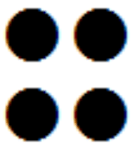  \[Figure 6. | **5**    \[Figure 7. | **6**  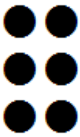  \[Figure 8. | **Total** |
| --- | --- | --- | --- | --- | --- | --- | --- |
| **tally** |     |     |     |     |     |     |     |
| **total** |     |     |     |     |     |     | 96  |
| **prediction** | 16  | 16  | 16  | 16  | 16  | 16  | 96  |

6.  How many times did you predict each number on the number cube would appear in 96 rolls?
7.  How many times did it actually appear?
8.  How well does your data agree with your prediction?
9.  Try an additional 96 rolls. How did the additional data change your results? Explain.

Directions: Run a random number simulation to see how many times each number from 0 to 9 appears in 100 numbers. On http://www.random.org/, do the following:

* Click on “random integer generator.”
* Choose 100 for “Generate 100 random integers.”
* Choose 0 and 9 for “Each integer should have a value between 0 and 9.”
* Click on “Get numbers.”

Record your data in a table like the one below. Make a prediction for how many times each digit will turn up out of 100 total digits.

| **digit** | **0** | **1** | **2** | **3** | **4** | **5** | **6** | **7** | **8** | **9** | **Total** |
| --- | --- | --- | --- | --- | --- | --- | --- | --- | --- | --- | --- |
| **tally** |     |     |     |     |     |     |     |     |     |     |     |
| **total** |     |     |     |     |     |     |     |     |     |     | 100 |
| **prediction** | 10  | 10  | 10  | 10  | 10  | 10  | 10  | 10  | 10  | 10  | 100 |

10. How many times did you predict each digit appears?
11. How many times did it actually appear?
12. How well does your data agree with your prediction?
13. Try an extra 100 digits. How does the additional data change your results?

Directions: Go back to the data you collected in the last section on theoretical probability and predictions. Use that data to answer the following questions.

14. How does your data compare to ideal results?
15. Which digits were closest to ideal?
16. Which were farthest?
17. Try pooling your data with other students. You may be able to get 10,000 or even 100,000 data trials. As you collect more data, how close do your values get to ideal?

</article>

## 12.0 Polynomials

<article>

</article>

### 12.1 Polynomials

<article>

Introduction
------------

**_A Visit Downtown_**

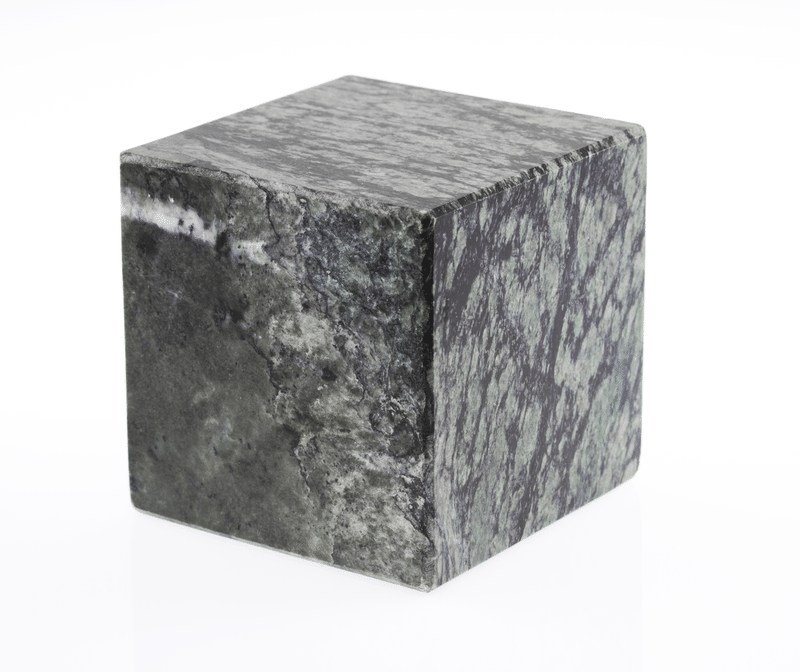

“Hey there is a problem with these cubes,” Tanya said to her friend Michael.

Here is the problem on the sheet.

Before you is a cube. Use the formula $A = 6s^2$ to find the surface area of a cube whose side measures 8 feet.

Tanya looked at Michael who looked at her. Both students began working on the problem in their notebooks.

**You can work on this problem too. You will learn about polynomials in this lesson. By the end of the lesson you will be able to solve this problem.**

**_What You Will Learn_**

In this lesson, you will learn the how to complete the following skills.

* Recognize and identify monomials, binomials and trinomials.
* Write and classify polynomials in standard form.
* Simplify polynomials by combining like terms.
* Evaluate polynomial expressions.

**_Teaching Time_**

I. **Recognize and Identify Monomials, Binomials and Trinomials**

Sometimes, you will see an expression or an equation that has exponents and variables in it. These expressions and equations can have more than one variable and sometimes more than one exponent in them. To understand how to work with these variables and exponents, we have to understand **_polynomials_**.

**A** **_polynomial_** **is an algebraic expression that shows the sum of** **_monomials_****.**

**A** **_monomial_** **is an expression in which variables and constants may stand alone or be multiplied. A monomial cannot have a variable in the denominator. We can think of a monomial as being one term.**

To understand these new terms better, let’s look at some word prefixes so that we can better understand the new terms.

| **Word** | **Monopoly** | **Bicycle** | **Tricycle** | **Polygon** |
| --- | --- | --- | --- | --- |
| **Definition** | A situation in which one company owns all of the market for a given type of product. | A vehicle with two wheels. | A vehicle with three wheels. | A shape with many sides. |
| **Prefix** | _Mono_ means one | _Bi_ means two | _Tri_ means three | _Poly_ means many. |

**In math we can use these prefixes too. Each prefix will give us a hint as to the type of expression that we are dealing with.**

**Examples of monomials**: $5 \quad x^3 \quad -2 x^5 \quad x^2y$

Since the prefix _mono_ means one, a monomial is a single piece or _term_. The prefix _poly_ means many. So the word _polynomial_ refers to one or more than one term in an expression. The relationship between these terms may be sums or difference.

**Example of polynomials**: $x^2+ 5 \qquad 3x-8+4x^5 \qquad -7a^2+9b-4b^3+6$

**We call an expression with a single term a** **_monomial_****, an expression with two terms is a** **_binomial_****, and an expression with three terms is a** **_trinomial_****. An expression with more than three terms is named simply by its number of terms—“five-term polynomial.”**

From the examples above, we can name the expressions as follows:

| **Number of Terms** | **1** | **2** | **3** | **4** |
| --- | --- | --- | --- | --- |
| Name | monomial | binomial | trinomial | four-term polynomial |
| Expression | $-2x^5$ | $x^2+5$ | $3x-8+4x^5$ | $-7a^2+9b-4b^3+6$ |

Now that you understand how to identify each type of expression, let’s go and work on different ways to write them and classify them.

II. **Write and Classify Polynomials in Standard Form**

First, let’s think about how we can classify each polynomial. We classify them according to terms. Each term can be classified by its degree. **The degree of a term is determined by the exponent of the variable or the sum of the exponents of the variables in that term.**

**Examples:**

$x^2$ has an exponent of 2, so it is a term to the second degree.

$-2x^5$ has an exponent of 5, so it is a term to the fifth degree.

$x^2y$ has an exponent of 2 on the $x$ and an unwritten exponent of 1 on the $y$,

so this term is to the third degree $(2 + 1)$. Notice that we add the two degrees together because it has two variables.

8 is a monomial that is a constant with no variable, its degree is zero.

**We can also work on the ways that we write polynomials. One way to write a polynomial is in what we call standard form.**

**In order to write any polynomial in standard form, we look at the degree of each term. We then write each term in order of degree, from highest to lowest, left to write.**

**Example:**

write the expression $3x-8+4x^5$ in standard form.

This is a trinomial. $3x$ has a degree of 1, -8 has a degree of zero, and $4x^5$ has a degree of 5. We write these in order by degree, highest to lowest:

$4x^5+3x-8$

The degree of a polynomial is the same as the degree of the highest term, so this expression is called “a fifth-degree trinomial.”

III. **Simplify Polynomials by Combining Like Terms**

Begin this section by thinking about the following example.

Example

In a grocery store, a refrigerator in the back has 52 cartons of milk and 65 cans of soda. In the refrigerator near the cash registers, there are 12 cartons of milk and 26 cans of soda. How many do they have in all?

**Yes...there are 64 cartons of milk and 91 cans of soda!**

**In this example, you probably added just the milk together and just the soda can together. You know that the milk cartons are alike. You know that soda cans are alike. But the milk and the soda cans are not alike. In mathematics, we are able to combine** **_like terms_** **but we do not combine** **_unlike terms_****.**

As we already saw, **a term can be a single number like 7 or -5.** These are called **_constants_**.

**Any term with a variable has a numerical factor called the** **_coefficient_****. The coefficient of $4x$ is 4.** The coefficient of $-7a^2$ is -7. The coefficient of $y$ is 1 because its numerical factor is an unwritten. You could write “$1y$” to show that the coefficient of $y$ is 1 but it is not necessary because any number multiplied by 1 is itself.

**Terms are considered** **_like terms_** **if they have exactly the same variables with exactly the same exponents.**

**Examples:**

$7n$ and $5n$ are like terms because they both have the variable $n$ with an exponent of 1.

$4n^2$ and $-3n$ are not like terms because, although they both have the variable $n$, they do not have the same exponent

$5x^3$ and $8y^3$ are not like terms because, although they both have the same exponent, they do not have the same variable.

**Like terms can be combined by adding their coefficients.**

**Examples:**

$$
\begin{align*}
7n+5n &=12n\\
3x^3+5x^3 &=8x^3\\
-2t^4-10t^4 &=-12t^4\\
2n^2-3n+5n^2+11n &=7n^2+8n
\end{align*}
$$

Notice that the exponent does not change when you combine like terms. If you think of $7n$ as simply a shorter way of writing $n + n + n + n + n + n + n$ and $5n$ as a shorter way of writing $n + n + n + n + n$, then combining those like terms to get $12n$ is a simpler way to write $7n + 5n$.

IV. **Evaluate Polynomial Expressions**

In previous lessons, you have learned the order of operations, commonly called PEMDAS. In other words, arithmetic operations are performed in the following order:

1.  First any operations inside grouping symbols (P).
2.  Second any values with exponents (E).
3.  Third multiplication and division in order from left to right (M and D).
4.  Finally addition and subtraction in order from left to right (A and S).

When we consider expressions, we can _evaluate_ an expression for a given value. In other words, we can find the total value if we know how much the variable is. We can replace the variable(s) with the given value and then use the order of operations to calculate the total value.

Example

Evaluate $x^2+3x-10$ for $x=5$

**Step 1:** Replace the variables with the given value, 5.

$5^2+3 \cdot 5-10$

**Step 2:** Find the total value using the order of operations.

$$
\begin{align*}
& 5^2+3 \cdot 5-10\\
& 25+3 \cdot 5-10 && (\text{There is no group, so first is the number with the exponent.})\\
& 25+15-10 && (\text{Complete the multiplication})\\
& 40-10 && (\text{Addition and subtraction from left to right.})\\
& 30 && (\text{Our total is} \ 30.)
\end{align*}
$$

**This is our answer. We can evaluate any expression when we have been given a value for the variable.**

Real-Life Example Completed
---------------------------

**_A Visit Downtown_**

**Here is the problem from the introduction. Reread it and then solve it for the surface area of the cube.**

Mr. Travis is taking his Social Studies class on a tour of downtown. He has created a scavenger hunt for the students as they travel around the city. The scavenger hunt is made up of all different types of architecture and landmarks as well as problems that will need to be solved. Mr. Travis asked the bus to drop the students off in front of the town hall. In the square across from the town hall is a plaza with three cubes in it.

“Hey there is a problem with these cubes,” Tanya said to her friend Michael.

Here is the problem on the sheet.

Before you is a cube. Use the formula $A =6s^2$ to find the surface area of a cube whose side measures 8 feet.

Tanya looked at Michael who looked at her. Both students began working on the problem in their notebooks.

**_Solution to Real – Life Example_**

**Now you can use the formula and the given information to solve for the surface area of the cube. The given length of the cube is 8 feet. You can substitute this into the formula for the side length.**

$$
\begin{align*}
A &= 6s^2\\
A &=6(8^2)\\
A &=6(64)\\
A &=384 \ sq.feet
\end{align*}
$$

**This is the surface area of the cube.**

Vocabulary
----------

Here are the vocabulary words that are found in this lesson.

__Polynomial__

an algebraic expression that shows the sum of monomials. A polynomial can also be named when there are more than three terms present.

__Monomial__

an expression where there is one term.

__Binomial__

an expression where there are two terms.

__Trinomial__

an expression where there are three terms.

__Constant__

a term that is a single number such as 4 or 9.

__Coefficient__

a variable and a numerical factor and the numerical factor is the coefficient

__Like Terms__

are terms that have the same variables and same exponents.

Time to Practice
----------------

Directions: Use the chart to identify each term with the correct label.

| **Number of Terms** | **1** | **2** | **3** | **4** |
| --- | --- | --- | --- | --- |
| Name | monomial | binomial | trinomial | four-term polynomial |
| Expression | $-2x^5$ | $x^2+5$ | $3x-8+4x^5$ | $-7a^2+9b-4b^3+6$ |

1.  $4x^2$
2.  $3x+7$
3.  $9x^2+6y$
4.  $x^2+2y^2+8$
5.  $5c^3$
6.  $3x^2+4x+3y^2+7$
7.  $4x+3xy+9$
8.  $2x^2+7y + 9$

Directions: Determine the degree of each polynomial.

9.  $4x^2$
10. $5y^5$
11. 9
12. $x^2+2y$
13. $7x^4+3y^3$
14. 12

Directions: Write the following polynomials in standard form and then identify its degree:

15. $-8+3y^2-2y^3+y$
16. $m^4-12m^7+6m^5-6m-8$
17. $-x^3y^2+5x^3y+8xy$

Directions: Simplify the following polynomials by combining like terms. Write your answer in standard form.

18. $3x+7-5x+4$
19. $6y^2-4y^3+y^2-8$
20. $-5q+q^2+7-q-7$
21. $n^2m-3n^2m+5n^2 m^2+11n$

Directions: Evaluate the following expressions for the given value.

22. $7x^3$ for $x=2$
23. $6y^2-2y-8$ for $y = 6$
24. $3(x-7) + 5(x + 1)$ for $x = 10$
25. $-2y^3+6(y-4)^2+y$ for $y = -3$

</article>

### 12.2 Adding and Subtracting Polynomials

<article>

Introduction
------------

**_The Pyramid Building_**

“Here we go again,” said Michael as he read the next problem to his friends.

“A pyramid-shaped building has rectangular floors that get increasingly smaller as you go higher up in the building. If the $87^{th}$ floor has a length of $6x+16$ and a width of 28, and each floor’s length and width decrease by 4 as you ascend, find the total area of the $87^{th}, 88^{th},$ and $89^{th}$ floor.”

This is the next dilemma.

**To work on this problem, you will need to understand area as well as adding and subtracting polynomials. Pay close attention to the rules of this lesson and you will be able to figure out this problem by the end of the lesson.**

**_What You Will Learn_**

In this lesson, you will learn the following skills.

* Add polynomials vertically.
* Add polynomials horizontally.
* Subtract polynomials vertically.
* Subtract polynomials horizontally.
* Solve real – world problems by writing, simplifying, and evaluating polynomial expressions regarding rectangle areas.

**_Teaching Time_**

I. **Add Polynomials Vertically**

Now that you understand how to identify polynomials, we can work on adding and subtracting them. Let’s start with adding. To begin, let’s look at how we can add whole numbers with many digits.

Example

Add the numbers 5026 and 3210.

You might add it like this, right?

$$
5026 \\
\underline{+3210} \\
{8236}
$$

If you think about it, you might notice that the same addition could be thought of in this way.

$$
\begin{align*}
& \qquad \qquad \qquad \text{thousands} \quad \qquad \text{hundreds} \quad \qquad \text{tens} \quad \qquad \text{ones} \\
& \quad 5026 \quad \rightarrow \qquad \ \ 5000 \qquad \qquad \qquad \qquad \qquad \ \ 20 \qquad \qquad 6\\
& \underline{+ \ 3210  \quad \rightarrow \quad \  + \ 3000 \qquad \qquad \quad \ \ 200 \qquad \ \ \quad10 \qquad \qquad \qquad}\\
& \quad 8236 \quad \leftarrow \qquad \ \ 8000 \quad \ + \qquad \quad 200 \quad + \quad \  30 \quad \ + \quad \ 6
\end{align*}
$$

**Here we have shown 5026 to be $5000 + 20 + 6$. The number 3210 is $3000 + 200 + 10$.**

Each of the similar places has been lined up vertically (one on top of the other) so that 3000 is beneath 5000 in the thousands place and 10 is beneath 20 in the tens place. Also, 200 is by itself because the first number had no digits in the hundreds place. Likewise, 6 is by itself because the second number had no digits in the ones place. Although this is not a practical way of writing a simple addition problem, it does demonstrate the technique we can use to add polynomials.

You learned in the previous lesson about **_like terms_****—terms are alike when they have exactly the same variable(s) to exactly the same power(s).** When terms are alike, we can combine them by adding their coefficients.

**Example:** $5x^3+9x^3=14x^3$

We also learned that **_polynomials_** **are one or more terms in an expression**.

**Example of polynomials**: $x^2+ 5 \qquad 3x-8+4x^5 \qquad -7a^2+9b-4b^3+6$

**Polynomials can be added in the same manner as we added 5026 and 3210.**

Example

Add the polynomials $(7x^2+9x-5)$ and $(6x^2+3x+10)$.

$$
\begin{align*}
& (7x^2+9x-5) \quad \rightarrow \quad 7x^2 \quad + \quad 9x \quad + \quad -5 \\
& \qquad \quad + \\ 
& \underline{(6x^2+3x+10) \ \ \rightarrow \quad 6x^2 \quad + \quad 3x \quad + \quad 10 \;} \\
& 13x^2+12x+5 \quad \leftarrow \ \ 13x^2 \ \ + \quad 12x \ \  + \quad \ 5
\end{align*}
$$

**Each of the like terms was aligned vertically, one on top of the other. Notice that the negative sign on -5 was kept with the number 5. Be careful when you add the integers.**

Example

Add the polynomials $(-2x^3+9x^2-3)$ and $(8x^2+5x-14)$.

$$
\begin{align*}
& \quad (-2x^3+9x^2-3) \qquad \ \rightarrow \quad -2x^3 \quad + \quad 9x^2 \quad \ + \quad \quad \quad + \ \ -3\\
& \underline{\ +(8x^2+5x-14) \qquad \quad  \rightarrow \ \qquad  \qquad \qquad 8x^2 \ \ \ \ + \quad 5x \quad + \ -14 \ \ } \\
& -2x^3+17x^2+5x-17 \  \leftarrow \quad -2x^3 \quad + \quad 17x^2 \ \ + \quad 5x \quad + \ \ -17
\end{align*}
$$

**Each of the terms was again aligned vertically. Notice this time that the space underneath $-2x^3$ is empty. That is because there was no like term in the second polynomial that could be combined with $-2x^3$. There was a like term of $9x^2$. The $8x^2$ is the like term that could be combined with $9x^2$ so it was placed beneath. Their sum was $17x^2$. There was no like term of $5x$, either. But -3 and -14, the constants, were like terms so were aligned together and combined. The result was $-2x^3+17x^2+5x-17$. Unneeded addition signs are removed.**

II. **Add Polynomials Horizontally**

A second method for adding polynomials is horizontally—in a single line. Just as you might add $6 + 19 = 25$ without placing them one on top of the other, so can a polynomial be added to another.

Example

$$
\begin{align*}
& =(7x^2+3x-11)+(3x^2-9x+5)\\
&=7x^2+3x-11+3x^2-9x+5 \\
&=10x^2-6x-6
\end{align*}
$$

**Step 1:** rewrite without parenthesis

**Step 2:** combine like terms

In Step 1, the polynomial can be rewritten without parentheses because the parentheses serve only to show the separation of the polynomials. Notice, we do not align them vertically by like terms as before. However, we had to take care to recognize and combine like terms correctly.

**This method can be a little trickier. If you find yourself getting confused, then go back and add the polynomials horizontally.**

III. **Subtract Polynomials Vertically**

Just like we could add polynomials, we can subtract them too. We can perform this operation both vertically and horizontally. Let’s start with vertically.

When we subtract polynomials, we can use a similar procedure as with addition—we can subtract vertically. However, remember that subtraction is the same as “adding the opposite.” In other words, $5 - 8$ is the same as $5 + (-8)$. We can add the opposite of 8 instead of subtracting 8. We will use the same idea with polynomials.

Example

$(9x^2+4x-7)-(2x^2+6x-4)$

**Set up the problem vertically by aligning the like terms.**

$$
\begin{align*}
& \quad (9x^2+4x-7) \quad \rightarrow \ \ \quad 9x^2 \quad + \ \ \quad 4x \quad + \quad -7 \quad \text{Lines up like terms.} \\
& \underline{-(2x^2+6x-4) \quad \rightarrow \quad -2x^2 \quad + \quad -6x \quad + \ \quad 4 \quad \ \text{Add the opposite.} \quad \ \ } \\
& \quad 7x^2-2x-3 \quad \ \ \leftarrow \quad \ \ 7x^2 \quad + \ \quad -2x \ \ + \quad -3 \quad \text{Combine lilke terms.}
\end{align*}
$$

**When you add the opposite, the sign changes on each of the terms in the subtracted polynomial. Inside the parentheses, the coefficient of $2x^2$ is positive. But when you add the opposite, the sign changes to negative, or $-2x^2$. We also changed the sign on the $6x$ to $-6x$ and the -4 to 4.**

Example

$(-7x^3+3x^2-x+4)-(-6x^2+9)$

$$
\begin{align*}
& \quad (-7x^3+3x^2-x+4) \quad \rightarrow \ \ \quad -7x^3 \quad + \ \ \quad 3x^2 \quad + \quad -x \quad + \quad \quad 4 \quad \ \text{Lines up like terms.} \\
& \underline{\; \; \; \; \; \; \; \; \; \; \; \; \; \; \; \; \; -(-6x^2+9) \quad \rightarrow \quad \quad \quad \quad \quad \quad \quad \ \ 6x^2 \quad + \ \quad \quad \quad \ + \quad -9 \ \ \ \text{Add the opposite.}\; \; \; \; \; \;} \\
& \quad -7x^3+9x^2-x-5 \quad \ \leftarrow \quad \quad -7x^3 \quad + \quad \ 9x^2 \quad + \quad -x \quad + \quad -5 \quad \ \text{Combine lilke terms.}
\end{align*}
$$

Now we can look at subtracting polynomials horizontally.

IV. **Subtract Polynomials Horizontally**

When we added polynomials, we used two methods—adding vertically and adding horizontally. You just learned to subtract polynomials vertically. As you have guessed, we can also subtract polynomials horizontally. First we will review the distributive property.

The distributive property: For all real numbers $a, b,$ and $c, \ a(b + c) = ab + ac$.

**Examples:**

$$
\begin{align*}
5(3x+7)&=15x+35 \\
4(2y-7)&=8y-28 \\
-2(9x+3)&=-18x-6 \\
-3 (-2y-4)&=6y+12
\end{align*}
$$

**Remember to be careful with negative signs when using distributive property.**

Now, let us remember that _coefficients_ are the numerical factors of variables. The coefficient of $3x$ is 3. The coefficient of $9x^2$ is 9. When we see the term $-x$, the coefficient is -1. Although you could write $-1x$, we normally do not because the 1 is considered unnecessary. How does this relate to the distributive property? The negative sign could be in front of the parentheses, like this: $-(3x - 2)$. This is similar to $-x$ where the coefficient is the unwritten -1. Just like you could write $-1x$, you could also write $-1(3x - 2)$. The distributive property is now more apparent in that each term will now be multiplied by -1.

Example

$$
\begin{align*}
& -(7x+5)=-1(7x+5)=-7x-5 \\
& -(x^2-3x+14)=-1(x^2-3x+14)=-x^2+3x-14 \\
& \qquad \qquad \quad \uparrow
\end{align*}
$$

Here you can insert the -1 and then multiply. As with adding the opposite, the sign changes on each of the terms in the polynomial.

**We can now use this method to subtract polynomials horizontally. First we’ll distribute the negative sign to each of the terms in the subtracted polynomial and then we will combine like terms just as we did when we added polynomials.**

Example

$$
\begin{align*}
& (5x+3)-(2x-8)\\
&=(5x+3)-1(2x-8) \\
&=5x+3-2x+8 \\
&=3x+11
\end{align*}
$$

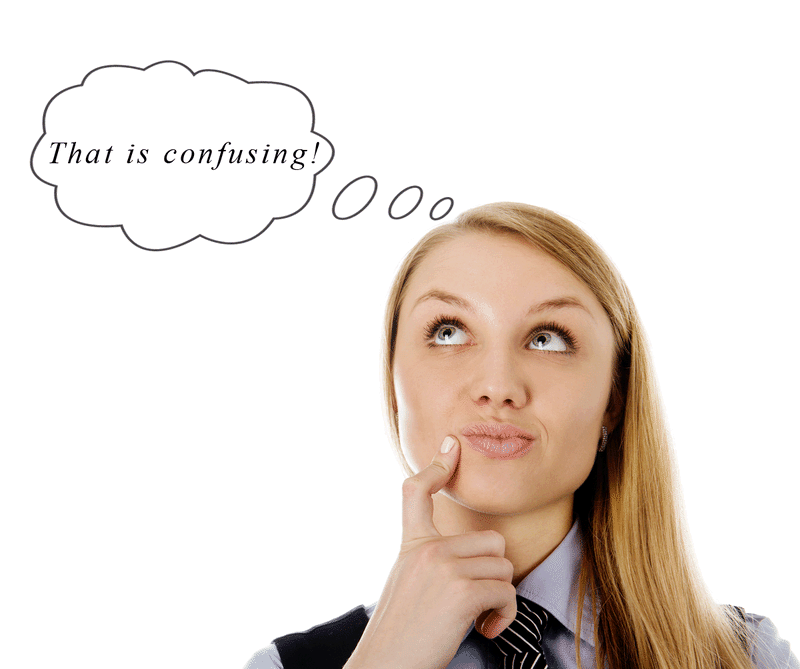

V. **Solve Real – World Problems by Writing, Simplifying and Evaluating Polynomial Expressions Regarding Rectangle Areas**

As seen in previous lessons, polynomials can be applied to geometrical shapes. Keep in mind some basic geometrical ideas.

**_Area_** **refers to the space inside an object or space. It is measured in square units.** The area of land is generally measured with units such as acres, square miles, or square kilometers. The area formula of a rectangle is $A = lw$ or area equals length times width. Shapes that are not rectangular are often broken up into rectangular parts. Their total area is calculated by adding the areas of the separate parts.

Example

A concrete walkway surrounds a rectangular swimming pool. In order to know how much weather treatment to buy, the owner must know how many square units of concrete he has. The walkway is 5 feet wide on all sides. The swimming pool has a length of $7x$ and a width of 14 feet. How many square units concrete does he have?

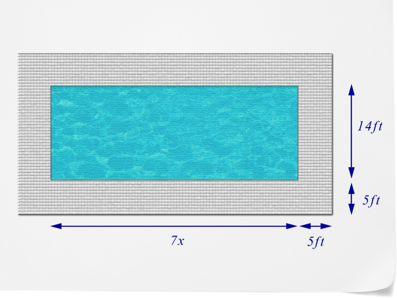

The length of the large rectangle measures $7x + 5 + 5$. Its width measures $14 + 5 + 5$.

So its area will be $(7x + 5 + 5) \cdot (14 + 5 + 5)$

**The area of the swimming pool will be its length times its width or $7x \cdot 14$.**

**Area of the swimming pool is $98x$.**

**To find the area of the concrete, subtract the area of the swimming pool from the total area:**

$$
\begin{align*}
&(168x + 240)-98x \\
&=70x + 240
\end{align*}
$$

**This is the answer.**

Now let’s go back to the problem from the introduction.

Real-Life Example Completed
---------------------------

**_The Pyramid Building_**

**Here is the problem from the introduction. Reread it and then figure out the areas of the other floors of the building.**

As the students rounded the corner on fifth street, they spotted a peculiar looking building. It was in the shape of a pyramid.

“Here we go again,” said Michael as he read the next problem to his friends.

“A pyramid-shaped building has rectangular floors that get increasingly smaller as you go higher up in the building. If the $87^{th}$ floor has a length of $6x + 16$ and a width of 28, and each floor’s length and width decrease by 4 as you ascend, find the total area of the $87^{th}, 88^{th},$ and $89^{th}$ floor.”

This is the next dilemma.

**_Solution to Real – Life Example_**

**Here is the work to figure out the area of the other three floors and the total area too.**

$$
\begin{align*}
87^{th} \ \text{floor} \quad \text{Area} &= 28(6x + 16) = 168x + 448 \\
88^{th} \ \text{floor} \quad \text{Area} &= (28 - 4)(6x + 16 - 4) = 24(6x + 12) = 144x + 288\\
89^{th} \ \text{floor} \quad \text{Area} &= (28 - 4 - 4)(6x + 16 - 4 - 4) = 20(6x + 8) = 120x + 160 \\
\text{Total area} &= (168x + 448) + (144x + 288) + (120x + 160) \\
&=168x + 448 + 144x + 288 + 120x + 160 \\
&=432x + 896
\end{align*}
$$

Vocabulary
----------

Here are the words that are found in this lesson.

__Polynomial__

one or more terms in an expression, often referred to specifically in situations where there are more than three terms.

__Like Terms__

terms that have the same variable and power.

__Area__

the space inside an object or area. It is measured in square units.

Time to Practice
----------------

Directions: Add the following polynomials vertically. Be sure to align like terms.

1.  $(4x^2+7x-2)+(3x-17)$
2.  $(-4x^4-x^3+8)+(-2x^3+5x+6)$
3.  $(10x^3-4x^2-2x+5)+(-x^2+9x-5)$
4.  $(6x^2+5x+9)+(4x^2+3x+6)$
5.  $(9x^2-3x+4)+(6x^2-9x+2)$
6.  $(3y^2+4x-9)+(-5y^2-6x+10)$

Directions: Add the following polynomials horizontally.

7.  $(-3x-8)+(15x+5)$
8.  $(x^4+7x^3-2x+7)+(-8x^3+9x^2-4)$
9.  $(4x^2y-3x^2y^2+7xy)+(9x^2y^2-5xy+3x^2)$
10. $(5xy-3x+19)+ (4xy-9x-22)$

Subtract the following polynomials vertically.

11. $(x^2+5x)-(3x-14)$
12. $(7y^3+4y^2-3y-1)-(y^3+6y^2-4)$

Subtract the following polynomials horizontally.

13. $(m^2+17m-11)-(3m^2+8m+12)$
14. $(z^2+3z)-(3z^2+7z+16)-(4z-13)$
15. Find the sum of the area of the two rectangles. 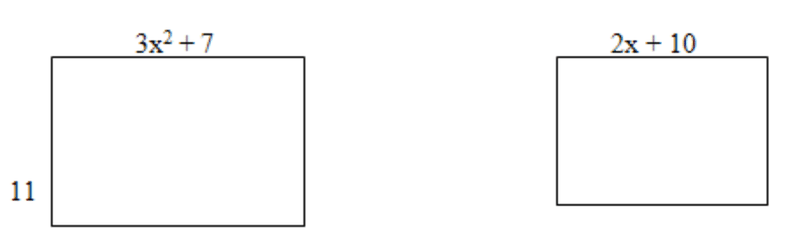
    
    \[Figure 7\]
    
16. Divide this shape into rectangles. Then find its total area. 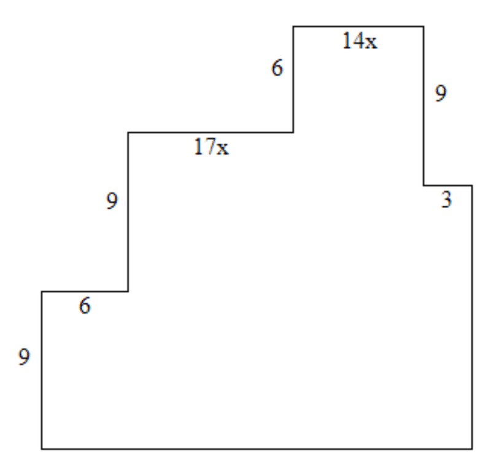
    
    \[Figure 8\]
    
17. A wooden rectangular patio has a length of 27 and a width of $6x - 2$. Cut into the patio are three equal rectangular planters of length $4x + 1$ and width 3. What is the total area of the wooden patio without the planters? Use a sketch to help you.
18. An ancient pyramid has a walkway about half-way up. The pyramid has four sides. On each side of the pyramid, the rectangular walkway is 10 feet wide and $40x + 8$ long. There is a second walkway closer to the top which is half as wide and half as long. What is the area of the long walkway?
19. What is the area of the short walkway?
20. What is the total area of the two walkways?

</article>

### 12.3 Monomials and Powers

<article>

Introduction
------------

**_The Laboratory_**

“This is a good friend of mine Professor Smith,” Mr. Travis said introducing the students to a woman with blonde hair and a wide smile.

“Welcome,” Professor Smith said. “Are you enjoying your trip downtown?”

Many students responded yes and then were drawn over to one of the laboratory tables where a lot of work was taking place.

“What is happening here?” Sam asked.

“Well, I started with a very small sample of cobalt. I actually had 10 grams of it and I took a third of a third of a third of a third of it,” She explained.

The students began figuring the math out in their heads. **Can you figure it out? How many grams did the sample end up being?**

**_What You Will Learn_**

By the end of this lesson you will be able to complete the following skills.

* Multiply monomials by expanding the expression, regrouping factors and multiply coefficients.
* Recognize and apply the Power of a Product Property to numeric and variable monomial expressions.
* Recognize and apply the Power of a Quotient Property to numeric and variable monomial expressions.
* Recognize and apply the Power of a Power Property to numeric and variable monomial expressions.

**_Teaching Time_**

I. **Multiply Monomials by Expanding the Expression, Regrouping Factors and Multiply Coefficients**

You have already seen exponents, but let’s review the definitions of some words so that we can get started. First, let’s look at some of the parts of a term.

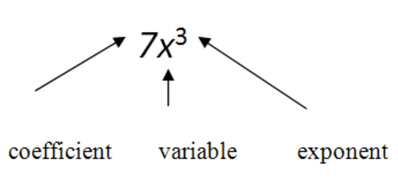

**We can say that the monomial $7x^3$ has a power of 3 or is to the $3^{rd}$ power.**

Remember what we said about the coefficient of a variable like $x$—if there is no visible coefficient, then the coefficient is an unwritten 1. You could write “$1x$” but it is not necessary. Similarly, if there is no exponent on a coefficient or variable, then you can think of it as having an unwritten exponent of 1. So 7 could be written as $7^1$. The constant 7 then, is to the $1^{st}$ power.

Also, the exponent is applied to the constant, variable, or quantity that is directly to its left. That value is called the **_base_****.** In the monomial above, the base is $x$. The exponent, in this case, is not applied to the 7 because it is not directly to the left of the exponent.

**What is the** **_exponent_****?** It’s a shortcut. It’s a way of writing many multiplications in a simpler way. In the monomial above, $7x^3$, the 3 indicates that the variable $x$ is multiplied by itself three times.

$7x^3=7 \cdot x \cdot x \cdot x$

You can see the amount of space that is saved by using the exponent. **When we write all of the multiplications instead of using the exponent, it is called the** **_expanded form_****.** You can see that it is, indeed, expanded—it takes much more space to write. Imagine if the exponent were greater, like $7x^{27}$.

$$
7x^{27}=7 \cdot x \cdot x \cdot x \cdot x \cdot x \cdot x \cdot x \cdot x \cdot x \cdot x \cdot x \cdot x \cdot x \cdot x \cdot x \cdot x \cdot x \cdot x \cdot x \cdot x \cdot x \cdot x \cdot x \cdot x \cdot x \cdot x \cdot x
$$

The exponent truly saves a lot of space! Let’s look at an example where we write an expression out into expanded form.

Example

$$
\begin{align*}
& (7x^3)(4x^5)\\
&=(7 \cdot x \cdot x \cdot x)(4 \cdot x \cdot x \cdot x \cdot x \cdot x)
\end{align*}
$$

**Here we have written the expression out into expanded form.**

Now, use the commutative property of multiplication to change the order of the factors so that similar factors are next to each other.

$$
\begin{align*}
&=7 \cdot 4 \cdot x \cdot x \cdot x \cdot x \cdot x \cdot x \cdot x \cdot x && \text{Parentheses disappear.} \\
&=28x^8 && \text{Multiply coefficients 7 and 4.}\\
& && \text{Use exponent as a shortcut for the variables.}
\end{align*}
$$

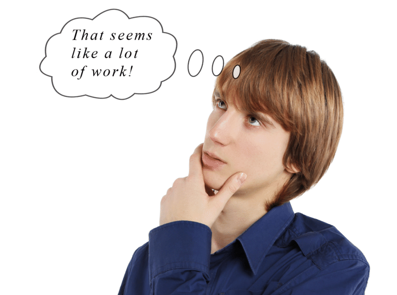

II. **Recognize and Apply the Power of a Product Property to Numeric and Variable Monomial Expressions**

In the previous section, we said that an exponent is applied to the constant, variable, or quantity that is directly to its left. However, we only applied exponents to single variables. **Exponents can also be applied to products using parentheses.**

Take the following example: $(5x)^4$

**If we apply the exponent 4 to whatever is directly to its left, we would apply it to the parentheses, not just the $x$. The parentheses are directly to the left of the 4. This indicates that the entire product in the parentheses is taken to the $4^{th}$ power. As in the previous section, we can write this in expanded form.**

$$
\begin{align*}
& (5x)^4 \\
&=(5x)(5x)(5x)(5x)
\end{align*}
$$

**Now we multiply the monomials as we have already learned—by placing like factors next to each other, multiplying the coefficients, and simplifying using exponents.**

$$
\begin{align*}
&=5 \cdot 5 \cdot 5 \cdot 5 \cdot x \cdot x \cdot x \cdot x \\
&=625x^4
\end{align*}
$$

**This is the** **_Power of a Product Property_** **which says, for any nonzero numbers $a$ and $b$ and any integer $n$**

$(ab)^n=a^n b^n$

Example

$$
\begin{align*}
& (7h)^3 \\
&=(7h)(7h)(7h) \\
&=7 \cdot 7 \cdot 7 \cdot h \cdot h \cdot h \\
&=343 h^3
\end{align*}
$$

Example

$$
\begin{align*}
& (-2x^4)^5 \\
&=(-2x^4)(-2x^4)(-2x^4)(-2x^4)(-2x^4) \\
&=(-2 \cdot x \cdot x \cdot x \cdot x)(-2 \cdot x \cdot x \cdot x \cdot x)(-2 \cdot x \cdot x \cdot x \cdot x)(-2 \cdot x \cdot x \cdot x \cdot x) \\
&=-2 \cdot -2 \cdot -2 \cdot -2 \cdot -2 \cdot x \cdot x \cdot x \cdot x \cdot x \cdot x \cdot x \cdot x \cdot x \cdot x \cdot x \cdot x \cdot x \cdot x \cdot x \cdot x \cdot x \cdot x \cdot x \cdot x \\
&=-32x^{20}
\end{align*}
$$

You can see that whether we have positive or negative integers or both, we can still use the Power of a Product Property. You may have already noticed a pattern with the exponents and the final product. When you multiply like bases, there is another shortcut—you can add the exponents of like bases. Another way of saying it is:

$$
a^m \cdot a^n=a^{m+n}
$$

Example

$$
\begin{align*}
& (-2x^4)^5 \\
&=(-2x^4)(-2x^4)(-2x^4)(-2x^4)(-2x^4) \\
&=-2 \cdot -2 \cdot -2 \cdot -2 \cdot -2 \cdot x^4 \cdot x^4 \cdot x^4 \cdot x^4 \cdot x^4 \\
&=-2 \cdot -2 \cdot -2 \cdot -2 \cdot -2 \cdot x^{4+4+4+4+4}\\
&=-32x^{20}
\end{align*}
$$

III. **Recognize and Appy the Power of a Quotient Property to Numeric and Variable Monomial Expressions**

^4$. We can use exponents with fractions or quotients, too. In order to answer the question above, we would multiply the numerators and denominators across, like this: $\frac{1 \cdot 1 \cdot 1 \cdot 1}{2 \cdot 2 \cdot 2 \cdot 2}=\frac{1}{16}$. Half of a half of a half of a half is one sixteenth. Once again, we have repeating multiplication of the same number which we could write more easily as $\frac{1^4}{2^4}=\frac{1}{16}$.")

**The** **_Power of a Quotient Property_** **says that for any nonzero numbers $a$ and $b$ and any integer $n$:**

$$
\left(\frac{a}{b}\right)^n=\frac{a^n}{b^n}
$$

Example

$\left(\frac{5}{3}\right)^4=\frac{5^4}{3^4}=\frac{625}{81}$

**You can see in this example that we have simplified the expression by figuring out what five to the fourth is and what three to the fourth is. The next step in this problem would be to divide.**

Example

$\left(\frac{3k}{2j}\right)^4=\frac{(3k)^4}{(2j)^4}=\frac{(3k)(3k)(3k)(3k)}{(2j)(2j)(2j)(2j)}=\frac{81k^4}{16j^4}$

**This problem has different variables, so this is as far as we can take this problem.**

IV. **Recognize and Appy the Power of a Power Property to Numeric and Variable Monomial Expressions**

We have raised monomials to a power, products to a power, and quotients to a power. You can see that exponents are a useful tool in simplifying expressions. If you follow the rules of exponents, the patterns become clear. We have already seen powers taken to a power. For example, look at the quotient:

$$
\left(\frac{x^7}{y^9}\right)^4=\frac{(x^7)^4}{(y^9)^4}=\frac{(x^7)(x^7)(x^7)(x^7)}{(y^9)(y^9)(y^9)(y^9)}=\frac{x^{7+7+7+7}}{y^{9+9+9+9}}=\frac{x^{28}}{y^{36}}
$$

If you focus on just the numerator, you can see that $(x^7)^4=x^{28}$. You can get the exponent 28 by multiplying 7 and 4. **This is an example of the** **_Power of a Power Property_** **which says for any nonzero numbers $a$ and $b$ and any integer $n$:**

$$
(a^m)^n=a^{m \cdot n}
$$

Example

$(x^5)^3=x^{5.3}=x^{15}$

Example

$(x^6 y^3)^7=x^{6 \cdot 7} y^{3 \cdot 7}=x^{42} y^{21}$

Example

Combine the Power of a Quotient Property and the Power of a Power Property.

$\left(\frac{k^{10}}{f^6} \right)^4=\frac{k^{10 \cdot 4}}{f^{6 \cdot 4}}=\frac{k^{40}}{f^{24}}$

Now let’s go back and work on the problem from the introduction.

Real-Life Example Completed
---------------------------

**_The Laboratory_**

**Here is the original problem once again. Reread it and then solve for the number of grams in the sample.**

One of the places that the students were able to visit when they went downtown was a laboratory at the city college. Downtown, the city college had some of its classrooms and one of the classrooms was a laboratory.

“This is a good friend of mine Professor Smith,” Mr. Travis said introducing the students to a woman with blonde hair and a wide smile.

“Welcome,” Professor Smith said. “Are you enjoying your trip downtown?”

Many students responded yes and then were drawn over to one of the laboratory tables where a lot of work was taking place.

“What is happening here?” Sam asked.

“Well, I started with a very small sample of cobalt. I actually had 10 grams of it and I took a third of a third of a third of a third of it,” She explained.

The students began figuring the math out in their heads. **Can you figure it out? How many grams did the sample end up being?**

**To figure out the number of grams in the sample, we must use what we have learned about monomials and powers.**

**Professor Smith started off with 10 grams.**

**Then she took a third of a third of a third of a third of it. That is $\frac{1}{3}$ to the fourth power.**

**Here is how we can set up the problem.**

$10 \left(\frac{1}{3}\right)^4=10 \left(\frac{1^4}{3^4}\right)=10 \left (\frac{1}{81}\right)=\frac{10}{81} \ grams$

**We can convert that into a decimal by dividing the numerator by the denominator.**

**.12 grams is our answer as a decimal.**

Vocabulary
----------

Here are the vocabulary words that are found in this lesson.

__Monomial__

a single term of variables, coefficients and powers.

__Coefficient__

the number part of a monomial or term.

__Variable__

the letter part of a term

__Exponent__

the little number, the power, that tells you how many times to multiply the base by itself.

__Base__

the number that is impacted by the exponent.

__Expanded Form__

write out all of the multiplication without an exponent.

__Power of a Product Property__

$(ab)^n=a^n(b^n)$

__Power of a Quotient Property__

the exponent is applied to both the top and bottom numbers in an expression.

__Power of a Power Property__

the exponent is applied to all the terms inside the parentheses by multiplying the powers together.

Time to Practice
----------------

Directions: Simplify.

1.  $(6x^5)(9x^2)$
2.  $(-13d^5)(-5d^{15})$
3.  $(3p^3 q^4)(7 pq^2 u^2)(2 pqu)$
4.  $(10x)^4$
5.  $(-4t^3)^5$
6.  $(18 r^2 s^3)^2(2r^{11}s^3 t^2)^3$
7.  $\left(\frac{2}{3}\right)^4$
8.  $\left(\frac{7k}{-2m}\right)^3$
9.  $\left(\frac{x^{11}}{y^9}\right)^5$
10. $(6a^4)^4$
11. $(w^{23}y^{21}z^{32})^3$
12. $\left(\frac{-5x^3}{3h^2 j^8}\right)^5$

Directions: Write out each expression in expanded form and simplify.

13. $(7x^2)(4x^9)$
14. $(12y^3)(4y^9)$
15. $(7x^6)(5x^5)$

Directions: Use what you have learned to solve each problem.

16. Write the equation for finding the area of this rectangle. 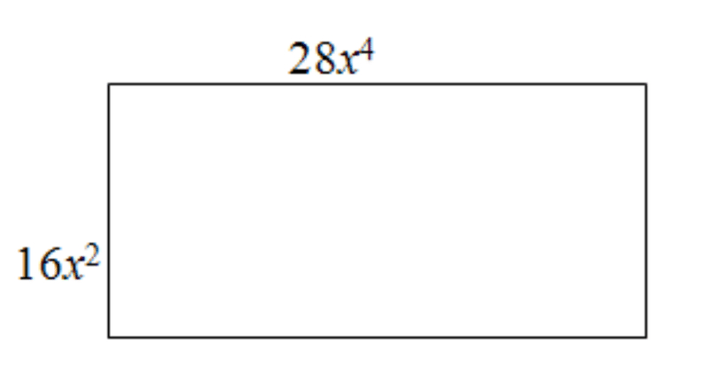
    
    \[Figure 7\]
    
17. Find the area of the rectangle.
18. Find the volume of a cube whose side, $s$, is $15 g^4$.
19. A cheese-maker cuts a 54kg. block of cheese in half 5 times. How can you write this using exponents?
20. What is the mass of the smallest piece?

</article>

### 12.4 Multiplying Binomials

<article>

Introduction
------------

**_The Community Garden_**

A farmer has two rectangular fields. One measures $3x + 7$ by $2x - 4$. The other measures $x^2 + 1$ by $6x + 5$. Find the combined area of the two fields.

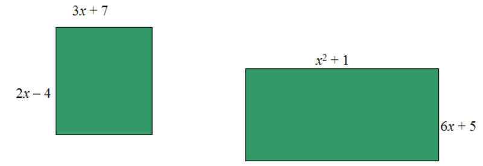

**_What You Will Learn_**

In this lesson, you will learn how to complete the following skills.

* Multiply binomials using a table.
* Multiply binomials vertically.
* Multiply binomials horizontally (FOIL)
* Solve real – world problems by writing, simplifying and evaluating polynomial expressions involving linear dimensions, surface areas and volumes of rectangular prisms.

**_Teaching Time_**

I. **Multiply Binomials Using a Table**

We defined **_binomials_** **as two-term polynomials**. When we added and subtracted polynomials, we were careful to combine **_like terms_**. When we multiply polynomials we will carefully apply the rules of exponents, as well.

**When we multiply binomials, we can use a table to help us to organize and keep track of the information. This table will help you to organize and keep track of your work. Let’s take a look.**

Example

Multiply the binomials $(x+5)(x+3)$.

We can use a table like a rectangle, as if each of the binomials were a dimension of the rectangle.

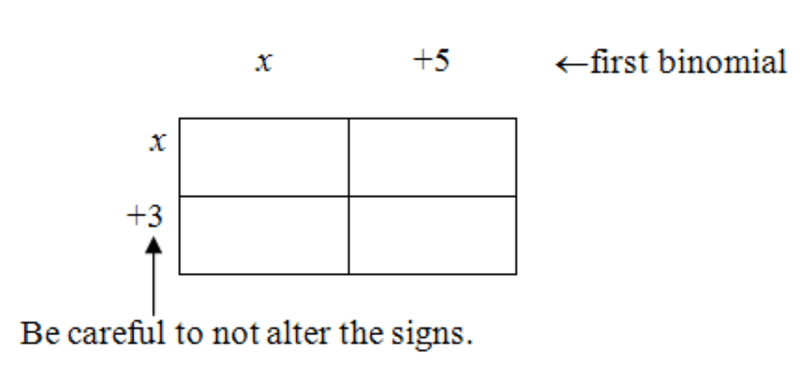

Now, we will find the area of the four separate rectangles.

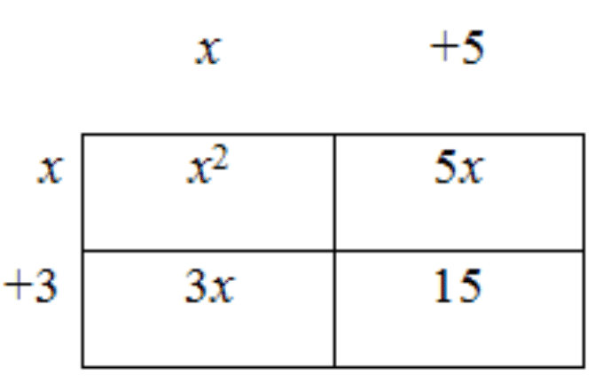

In order to find the total, we will add the four areas: $x^2 + 5x +3x +15$

Now, combine like terms carefully: $x^2 + 8x + 15$.

**This is our answer.**

Example

Multiply $(x-4)(x+6)$

|     | $x$ | $-4$ |
| --- | --- | --- |
| $x$ | $x^2$ | $-4x$ |
| $+6$ | $6x$ | $-24$ |

$$
\begin{align*}
& x^2-4x+6x-24 \\
&= x^2+2x-24
\end{align*}
$$

**_Notice the careful work with the negative and positive signs._**

Here is one that is a little different. Notice the position of the exponent in this example.

Example

Multiply $(5x - 8)^2$.

**_Remember that the exponent applies to the entire binomial such that_** $(5x -8)^2 = (5x - 8)(5x - 8)$.

|     | $5x$ | $-8$ |
| --- | --- | --- |
| $5x$ | $25x^2$ | $-40x$ |
| $-8$ | $-40x$ | $64$ |

$$
\begin{align*}
& 25x^2-40x-40x+64 \\
&=25x^2-80x +64
\end{align*}
$$

II. **Multiply Binomials Vertically**

In the last section, you learned how to multiply binomials by using a table. In this lesson you will learn how to multiply binomials vertically.

A second method for multiplying binomials is similar to the algorithm that we commonly use for multiplying two-digit numbers.

$$
\begin{align*}
& \qquad \qquad \qquad \quad \text{thousands} \qquad \quad \text{hundreds} \qquad \quad \text{tens} \qquad \quad \text{ones} \\
& \quad \quad 73 \ \quad \rightarrow \qquad \qquad \qquad \qquad \qquad \qquad \qquad \qquad 70 \ \quad + \qquad 3 \\
& \ \underline{\quad \times 81} \ \quad \rightarrow \ \ \underline{\qquad \qquad \qquad \qquad \qquad \qquad \qquad \ \quad 81 \ \quad + \qquad 1} \\
& \quad \quad 73\ \quad \rightarrow \qquad \qquad \qquad \qquad \qquad \qquad \qquad \qquad 70 \ \quad + \qquad 3 \\
& \ \underline{+4580} \ \quad \rightarrow \ \ \underline{\ \ \qquad 4000 \qquad + \qquad \ 500 \quad + \ \quad 80 \ \quad + \qquad 0} \\
& \quad 4653 \ \quad \leftarrow \ \quad \qquad 4000 \qquad + \ \qquad 500 \quad + \quad 150 \ \quad + \qquad 3
\end{align*}
$$

**When you expand the multiplication like is done on the right, you can see that in our multiplication algorithm for two-digit numbers, we line up numbers by similar places.**

**We will use this same idea to multiply binomials but instead of using decimal places, we will line up the products by like terms.**

Example

Multiply $(3x + 2)(5x + 4)$

$$
\begin{align*}
& 2^{nd} \text{power} \qquad \ \quad 1^{st} \text{power} \qquad \quad 0 \ \text{power} \\
& \qquad \qquad \qquad \qquad \ \ \ \quad 3x \quad + \qquad \ \quad 2 \\
& \underline{\qquad \qquad \qquad \qquad \qquad 5x \quad + \qquad \ \quad 4 \;\;} \\
& \qquad \qquad \qquad \qquad \ \ \quad 12x \quad + \qquad \ \quad 8 \\
& \underline{\qquad 15x^2 \quad + \qquad \ \quad 10x \ \quad + \;\;\;\;\;\;\;\;\;\;\;\;\;\;\;}\\
& \qquad 15x^2 \quad + \qquad \ \quad 22x \quad + \qquad \ \quad 8 \quad \rightarrow \quad 15x^2 + 22x + 8
\end{align*}
$$

Just as in multiplication with numerals, we first multiply 4 by 2 and get 8. We then multiply 4 by $3x$ and get $12x$. When we multiply $5x$ by 2, we get $10x$. This is not a like term of 8 but of $12x$ so the $10x$ was aligned beneath the $12x$. Finally, the product of $5x$ and $3x$ is $15x^2$. This is to the $2^{nd}$ power so how no like terms. Our sum on the bottom-right shows the final product.

Example

Multiply $(7x - 3)^2$

$$
\begin{align*}
& 2^{nd} \text{power} \qquad \quad 1^{st} \text{power} \qquad \quad 0 \ \ \text{power} \\
& \qquad \qquad \qquad \qquad \ \ \quad 7x \quad + \qquad \quad -3 \\
& \underline{\qquad \qquad \qquad \qquad \ \ \quad 7x \quad + \qquad \quad -3} \\
& \qquad \qquad \qquad \qquad -21x \quad + \qquad \ \ \quad 9 \\
& \underline{\qquad 49x^2 \quad + \qquad -21x \ \quad + \;\;\;\;\;\;\;\;\;\;\;\;\;\;\;\;\;}\\
& \qquad 49x^2 \quad + \qquad -42x \quad + \qquad \qquad 9 \quad \rightarrow \quad 49x^2 -42x + 9
\end{align*}
$$

This is another special case called a **_perfect square trinomial_**. Because the binomial was taken to the second power, we had $(7x - 3)(7x - 3)$. This resulted in our product’s first term, $49x^2$, and its last term, 9, being perfect squares. Also, the middle term, $-42x$, was equal to $-21x + -21x$, or $2 \cdot(-21x)$.

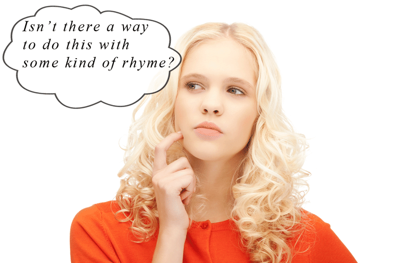

III. **Multiply Binomials Horizontally (FOIL)**

In the previous sections, we noticed that when you multiply two binomials, the product is actually the sum of four multiplications, like in the table method or the vertical method of multiplication. In other words, the product $(3x+2)(5x+4)$ was found by multiplying $3x$ by $5x,3x$ by 4, 2 by $5x$ and 2 by 4. The four resulting products were combined if they were like terms and that was our final product.

If we notice this pattern, then a third option for multiplying will be to simply show those four multiplications without drawing a box or setting up the multiplication vertically.

**This third method is called the FOIL method. “FOIL” is an acronym which tells us which terms to multiply in order to get our product—**

**F—First terms in the binomials**

**O—Outside terms in the binomials**

**I—Inside terms in the binomials**

**L—Last terms in the binomials**

Let’s multiply $(2x+8)(5x-13)$ using the FOIL method.

| F   | First terms are $2x$ and $5x$ | $(\mathbf{\underline{2x}}+8)(\mathbf{\underline{5x}}-13)$ | $10x^2$ |
| --- | --- | --- | --- |
| O   | Outside terms are $2x$ and -13 | $(\mathbf{\underline{2x}}+8)(5x\underline{\mathbf{-13}})$ | $-26x$ |
| I   | Inside terms are 8 and $5x$ | $(2x\underline{\mathbf{+8}})(\mathbf{\underline{5x}}-13)$ | $40x$ |
| L   | Last terms are 8 and -13 | $(2x\underline{\mathbf{+8}})(5x\underline{\mathbf{-13}})$ | \-104 |

The table above helps to illustrate which terms must be multiplied. However, we don’t need to make a table like that for each multiplication. We can show it like this:

$$
(2x+8)(5x-13)=10x^2 - 26x + 40x - 104 = 10x^2 + 14x - 104
$$

Of the three methods we’ve seen for multiplication, you might agree that this is the quickest method. Of course, all three methods should give us the same product.

Example

Multiply $(6x+5)(3x-1)$

$$
\begin{align*}
&(6x+5)(3x-1) \\
&= 6x \cdot 3x + 6x \cdot -1 + 5\cdot 3x + 5 \cdot -1 \\
&= 18x^2 -6x +15x -5 \\
&= 18x^2 +9x -5
\end{align*}
$$

Example

Multiply $(5x^3+2x)(7x^2+8)$

$$
\begin{align*}
&(5x^3+2x)(7x^2+8) \\
&= 5x^3 \cdot 7x^2 + 5x^3 \cdot 8 + 2x \cdot 7x^2 + 2x \cdot 8 \\
&= 35x^5 +40x^3 +14x^3 +16x \\
&= 35x^5 +54x^3 +16x
\end{align*}
$$

Now let’s look at how we can work with these concepts in real – life.

IV. **Solve Real – World Problems by Writing, Simplifying and Evaluating Polynomial Expressions Involving Linear Dimensions, Surface Areas and Volume of Rectangular Prisms**

Now let’s apply what we have learned to three dimensional figures.

To find the volume of a rectangular prism, use the formula $V=lwh$.

Example

A rectangular prism has the following dimensions: $l = x, w = 2x + 1,$ and $h = 3x - 2$.

Find its volume.

$$
\begin{align*}
V &= lwh \\
V &= x(2x+1)(3x-2) \\
V &= (2x^2+x)(3x-2) \\
V &= 2x^2 \cdot 3x + 2x^2 \cdot -2 + x \cdot 3x + x \cdot -2 \\
V &= 6x^3 -4x^2 + 3x^2 -2x \\
V &= 6x^3 -x^2 - 2x
\end{align*}
$$

**Now let’s apply what we have learned about multiplying binomials to the problem from the introduction.**

Real-Life Example Completed
---------------------------

**_The Community Garden_**

**Here is the problem from the introduction. Reread it and then solve it for the combined area of the two fields.**

The students loved walking through the community garden which was adjacent to the town hall. All of the flowers were in full bloom. One of the community workers was there and he presented the students with the following problem. The students suspected that this was the work of their teacher Mr. Travis, but they began to work on solving the problem anyway. Here it is.

A farmer has two rectangular fields. One measures $3x + 7$ by $2x - 4$. The other measures $x^2 + 1$ by $6x + 5$. Find the combined area of the two fields.

**_Solution to Real – Life Example_**

**Remember, we need to work on figuring out the area of both rectangles and then the sum of those two areas will give us the total area. Here is how we can solve this problem.**

$$
\begin{align*}
&(3x+7)(2x-4)+(x^2+1)(6x+5) \\
&= (3x \cdot 2x + 3x \cdot -4 + 7 \cdot 2x + 7 \cdot -4) + (x^2 \cdot 6x +x^2 \cdot 5 + 1 \cdot 6x + 1 \cdot 5) \\
&= (6x^2 -12x +14x -28) + (6x^3 +5x^2 + 6x +5) \\
&= 6x^2 + 2x - 28 +6x^3 + 5x^2 +6x +5 \\
&= 6x^3 + 11x^2 + 8x -23
\end{align*}
$$

Vocabulary
----------

Here are the vocabulary words that are found in this lesson.

__Binomials__

polynomials with two terms in them.

__Perfect Square Trinomial__

a trinomial where the first term and the last term are perfect squares because the binomial was to the second power or squared.

__FOIL__

firsts, outers, inners, lasts – binomial multiplication

Time to Practice
----------------

Directions: Use a table to multiply the following binomials.

1.  $(x+3)(x+5)$
2.  $(x-3)(x-5)$
3.  $(x+3)(x-3)$
4.  $(x+2)(x-8)$
5.  $(3x^2+3x)(6x-2)$
6.  $(2x-7y)(5x+4y)$
7.  $(2x-9)^2$

Directions: Multiply the following binomials vertically.

8.  $(d+2)(4d-1)$
9.  $(5x+7)(5x-7)$
10. $(4b^2+3c)(2b-5c^2)$

Directions: Multiply the following binomials using the FOIL method:

11. $(p+6)(5p+2)$
12. $(-7y^2-4y)(6y+2)$
13. $(x^3+3x)^2$
14. $(2x+1)(x-4)$
15. $(3x-3)(5x+9$)
16. $(x+5)^2$

Directions: Use what you have learned to solve each problem.

17. Find the area of a square whose side measures $5n - 2$.
18. A guard dog is tied to a rope attached to a pole in the ground. The rope measures $x + 5$. The dog can walk around the stake to the full length of the rope in all directions. Find how much area she can guard.
19. A company is designing a cardboard box that will measure $l = z, w = z - 3,$ and $h = 2z + 4$. What will its volume be?
20. Use the same box measurements from problem 13 to find the box’s surface area.

</article>

### 12.5 Exploring Parabolas

<article>

Introduction
------------

**_The Arc_**

“This is beautiful,” Kelsey said looking at the entrance.

“It sure is. It looks like a parabola,” Kenny commented.

“A what?” Kelsey exclaimed.

“A parabola. Don’t you know what a parabola is?” Kenny asked.

**Do you know what a parabola is? This lesson is all about parabolas. Pay close attention because at the end of the lesson you will need to define the term parabola.**

**_What You Will Learn_**

By the end of this lesson you will be able to complete the following skills.

* Identify and compare graphs of parabolas given equations.
* Identify and compare equations of parabolas given graphs.
* Graph a parabola, given an equation.
* Write the equation of a parabola given a graph.

**_Teaching Time_**

I. **Identify and Compare Graphs of Parabolas Given Equations**

Graphs and equations are important parts of mathematics. Equations can show relationships between different variables, like $x$ and $y$. Graphs can show all of the pairs of numbers, $x$ and $y$, that make an equation true—they show all of the solutions. Oftentimes, graphs represent infinite pairs of such numbers.

You have studied the relationships of linear equations—their graphs were straight lines. But not all graphs will be linear. **Some graphs are shaped like U's. These U shaped graphs are called** **_parabolas_****.** Let’s check out parabolas.

When we graphed linear equations, we made tables of value, or _t-tables_, using the equation that was given. For example, for the equation $y = x + 4$, we use the $x$\-values in the t-table to find the corresponding $y$\-values.

| $x$ | $y$ |
| --- | --- |
| $-4$ | 0   |
| \-3 | 1   |
| \-2 | 2   |
| \-1 | 3   |
| 0   | 4   |
| 1   | 5   |
| 2   | 6   |

We then used the t-table to create a graph on a coordinate plane.

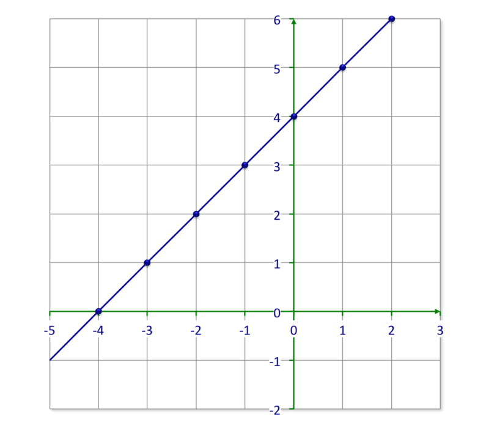

1. But what happens if we change the power to 2?

Let’s try.

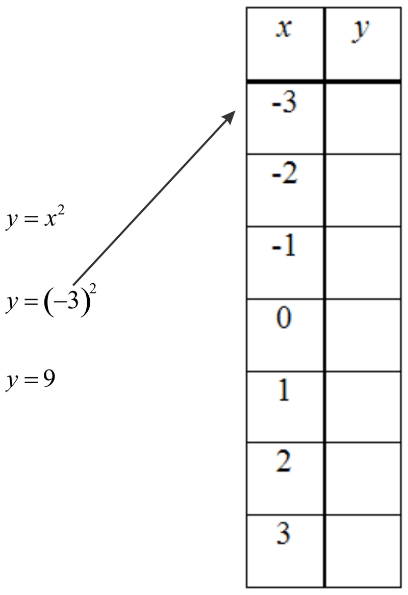

**Make a t-table just like with linear equations.**

**Be sure to include negative numbers, zero, and positive numbers. Then, substitute the values of $x$ in the equation to find the values of $y$.**

**Start with -3.**

**So for the $x$ value of -3, the $y$ value is 9. Use the same process to complete your t-table.**

| $x$ | $y$ |
| --- | --- |
| $-3$ | 9   |
| \-2 | 4   |
| \-1 | 1   |
| 0   | 0   |
| 1   | 1   |
| 2   | 4   |
| 3   | 9   |

**Now you can graph the values on the coordinate plane.**

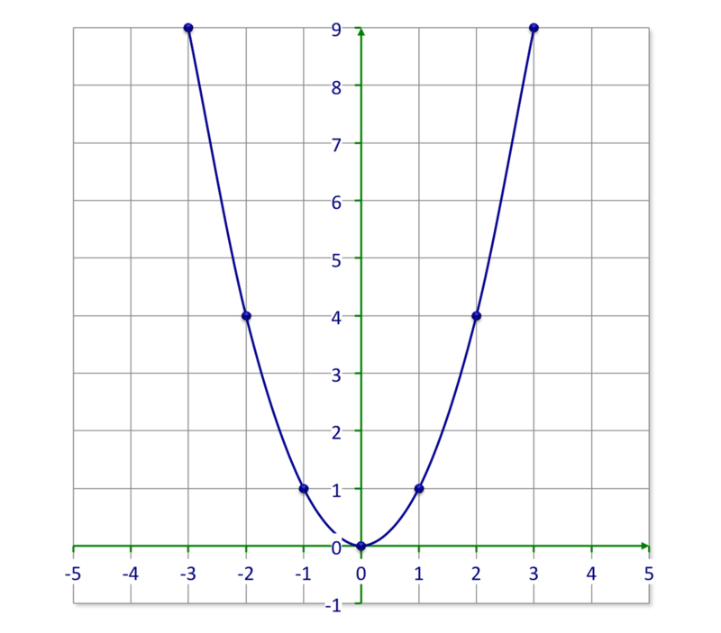

This shape is called a **_parabola_**.

**Equations to the $2^{nd}$ power are called** **_quadratic equations_** **and their graphs are always parabolas.**

Example

Compare the graph of the equation $y=x^2-2$ to the one above.

| $x$ | $y$ |
| --- | --- |
| $-3$ | 7   |
| \-2 | 2   |
| \-1 | \-1 |
| 0   | \-2 |
| 1   | \-1 |
| 2   | 2   |
| 3   | 7   |

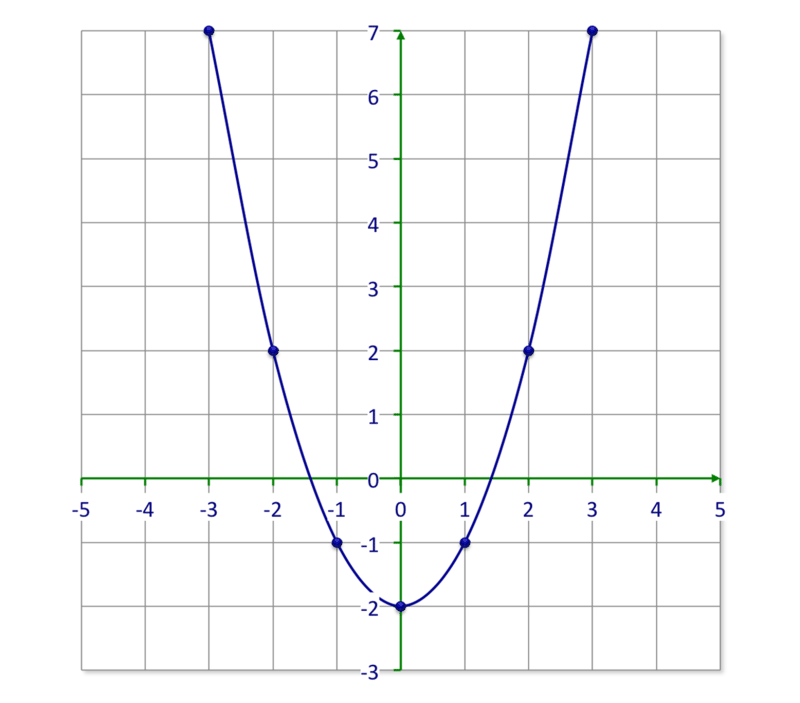

Example

Now try the graph of $y=-x^2$.

| $x$ | $y$ |
| --- | --- |
| $-3$ | \-9 |
| \-2 | \-4 |
| \-1 | \-1 |
| 0   | 0   |
| 1   | \-1 |
| 2   | \-4 |
| 3   | \-9 |

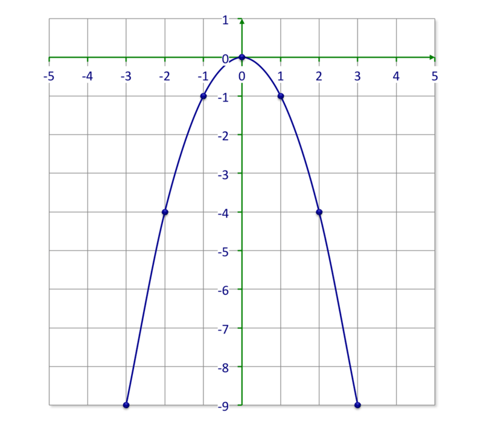

As we look at parabolas we can see that the bottom point, the _vertex_, has moved. It is no longer on the $y$\-axis. As you compare graphs, you will see that the graphs change based on the values in the equation.

**Notice that when you see an equation to the second power, that the graph of the equation will be a parabola.**

II. **Identify and Compare Equations of Parabolas, Given Graphs**

We’ve seen quadratic equations and that their graphs are parabolas. In the last examples, we noticed that the graphs can change position, direction, and width based on the coefficients of $x^2$ and $x$ as well as the constant. Because those pieces of the equation are so important, we have named them in what is called the _standard form_.

**Standard form of a quadratic equation: $y=ax^2+bx+c$ (where $a$ cannot be zero) – notice that $a, b$ and $c$ will be coefficients and can be either positive or negative. This will also effect the parabola that is graphed.**

Once again, the **$a$ value can predict two things—1) how wide the graph will be and 2) if the graph opens upward or downward.** Generally speaking, the further the $a$ value is from zero, the narrower the graph; the closer the $a$ value is to zero, the wider the graph. Also, a positive value of $a$ will give us a graph that opens upwards while a negative value of $a$ will open downward.

**How about the $b$ value? You may have noticed that all of the parabolas are symmetrical—they are the same on both sides, as if they were reflected on a mirror that were right down the middle of the graph.**

**The $b$ value helps us to predict the axis of symmetry.**

**Finally, the $c$ value, determines the $y$\-****_intercept_** **of the graph—it tells us where the graph will hit the $y$\-axis. When the $c$ value was 3, the graph crossed the $y$\-axis at 3.**

Let’s look at some graphs.

")

\[Figure 11\]

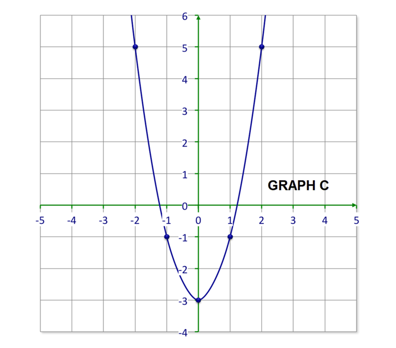

| **Graph A** | **Graph B** | **Graph C** |
| --- | --- | --- |
| opens upward | opens downward | opens upward |
| fairly wide | neither narrow nor wide | fairly narrow |
| symmetrical on $y$\-axis | symmetry is right of the $y$\-axis | symmetrical on $y$\-axis |
| $y$\-intercept is 3 | $y$\-intercept is 2 | $y$\-intercept is -3 |
| equation is $y=\frac{1}{2}x^2+3$ | equation is $y=-x^2+x+2$ | equation is $y=2x^2-3$ |
| $a=\frac{1}{2},b=0,c=3$ | $a=-1,b=1,c=2$ | $a=2,b=0,c=-3$ |

**Now you can see how the graphs of each equation provides us with information.**

III. **Graph a Parabola, Given an Equation**

You have seen a lot of graphs in this lesson. It’s your turn to graph.

**First, use the given equations to complete a t-table.** Be sure to include positive numbers, zero, and negative numbers in your t-table. Also, be careful with your order of operations calculate the $y$\-values.

**Then graph your points on a coordinate plane.** You can check your graphs using the knowledge that you have about the $a, b,$ and $c$ values. We know that the parabolas must be symmetrical, too.

If your graph does not fit the knowledge that you have learned about parabolas then it may indicate an error in your calculations or in graphing.

Example

Graph the equation $y=x^2-4$.

Start with a t-table. Enter your $x$\-values.

| $x$ | $y$ |
| --- | --- |
| $-3$ |     |
| \-2 |     |
| \-1 |     |
| 0   |     |
| 1   |     |
| 2   |     |
| 3   |     |

Then, substitute your first value of $x$ in the equation.

$$
\begin{align*}
y&=(-3)^2-4\\
y&=9-4\\
y&=5
\end{align*}
$$

Do this with all of the $x$ values so that you can fill in the appropriate $y$ values.

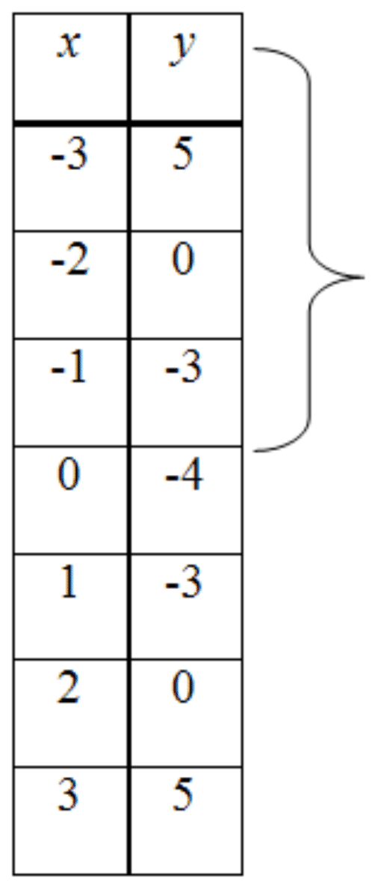

Your completed t-table should look like this.

Use the points from your t-table to create a graph. Your first point is (-3, 5).

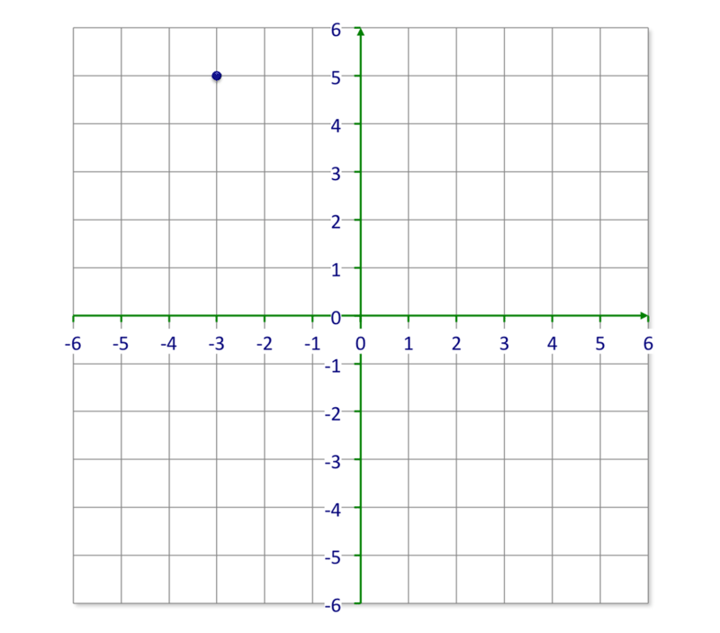

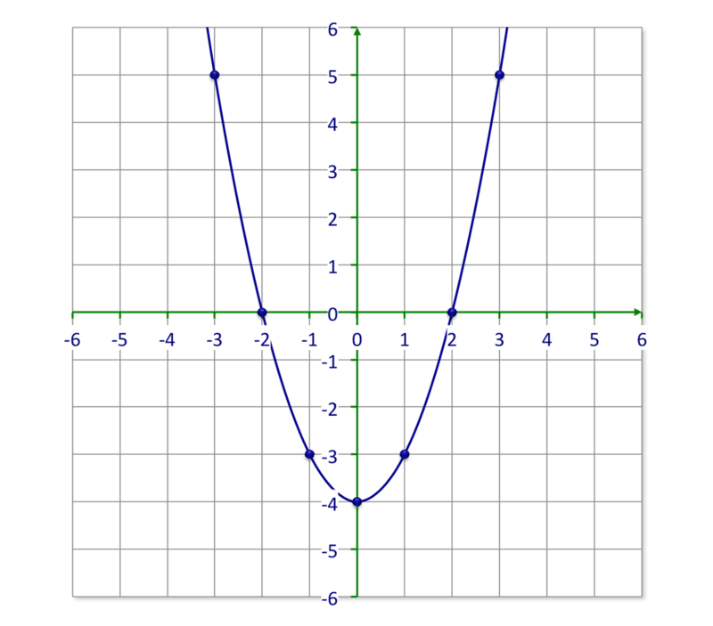

Graph the equation $y=-\frac{1}{2}x^2+5$.

| $x$ | $y$ |
| --- | --- |
| $-3$ | .5  |
| \-2 | 3   |
| \-1 | 4.5 |
| 0   | 5   |
| 1   | 4.5 |
| 2   | 3   |
| 3   | .5  |

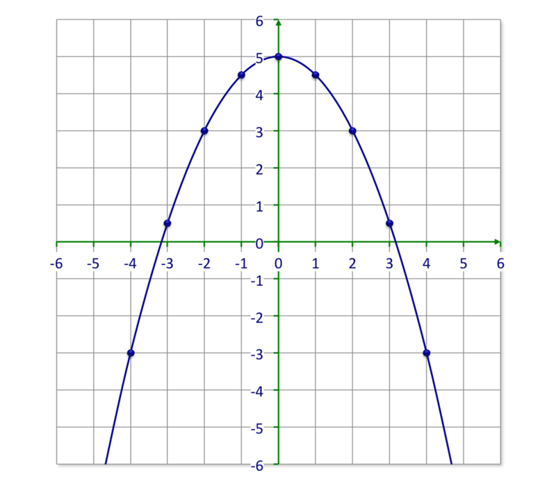

IV. **Write the Equation of a Parabola, Given a Graph**

Just as we have learned to make linear equations based on linear graphs, we can also find a quadratic equation by using the parabola.

We know that the $a$ value tells if the graph goes upward or downward. So, if the graph goes downward, the $a$ value must be negative. If the graph goes upward, the $a$ value must be positive.

We also know that the $c$ value tells us the $y$\-intercept on the graph. So, if we know the $y$\-intercept, then we know the $c$ value.

**If we have a graph, then we can also work backwards—we can fill in a t-table using the points we see on the graph. Then, by looking for a pattern in the t-table, we can derive the equation.**

Example

Write the equation for the given graph.

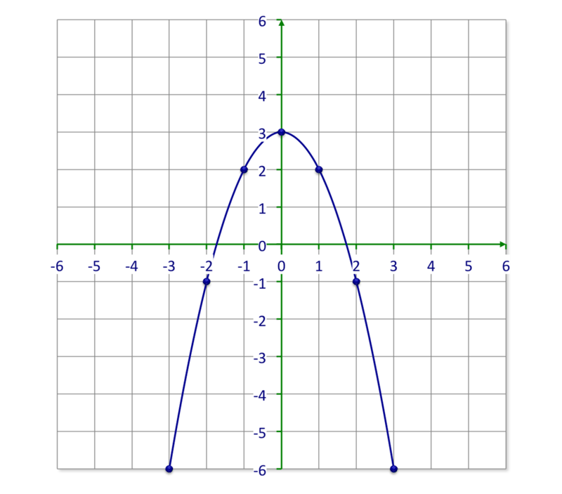

The $y$\-intercept is 3 so $c = 3$.

| $x$ | $y$ |
| --- | --- |
| $-2$ | \-1 |
| \-1 | 2   |
| 0   | 3   |
| 1   | 2   |
| 2   | \-1 |

Standard form: $y=ax^2+bx+c$

$c = 3$ so $y=ax^2+bx+3$

The graph goes downward and we see the same pattern as with $y = -x^2$.

**The equation may be $y=-x^2+3$.**

Test point (1, 2) $\rightarrow$ does $2=(-1)^2+3$?

Yes! Our equation is correct!

**Now let’s look at the problem from the introduction.**

Real-Life Example Completed
---------------------------

**_The Arc_**

**Here is the problem from the introduction. Reread it and then define a parabola.**

The students were having a terrific time walking all around downtown. While they were seeing the sights and solving problems, they were also learning about the city that they live in. The students reached the park and stopped at the entrance. The entrance to the park was a beautiful arc decorated with ivy and flowering vines.

“This is beautiful,” Kelsey said looking at the entrance.

“It sure is. It looks like a parabola,” Kenny commented.

“A what?” Kelsey exclaimed.

“A parabola. Don’t you know what a parabola is?” Kenny asked.

**A parabola is the shape that is created by a quadratic equation. It forms an arc. A parabola has a vertex that is either a maximum point or a minimum point. If the squared value is positive then the parabola opens upward. If the squared value is negative then the parabola opens downward.**

Vocabulary
----------

Here are the vocabulary words that are found in this lesson.

__Parabola__

a U shaped graph that is non – linear.

__Quadratic Equations__

equations to the second power that will always graph as a parabola.

__Vertex of a Parabola__

the bottom or top point of a parabola.

Time to Practice
----------------

Directions: Answer the following questions about parabolas.

1.  True or false. A parabola is always formed by a quadratic equation.
2.  True or false. If the $a$ value is far from zero then you have a narrow graph.
3.  True or false. If the $a$ value is close to zero then you have a narrow graph.
4.  True or false. The $c$ value helps you to predict the symmetry of a parabola.
5.  True or false. All parabolas are symmetrical.
6.  True or false. The $y$ intercept is the same as the $c$ value.
7.  A parabola with a positive squared value opens \_\_\_\_\_\_\_\_\_\_\_\_\_.
8.  A parabola with a negative squared value opens \_\_\_\_\_\_\_\_\_\_\_\_\_.
9.  What is the vertex of the parabola?
10. True or false. A parabola always forms a U shape.

Directions: Match the three graphs to their equations. Describe the graphs using words. Identify their $a, b,$ and $c$ values.

11. $y=3x^2-2$
12. $y=x^2+x-3$
13. $y=-\frac{1}{2}x^2+2$

**Graph A**

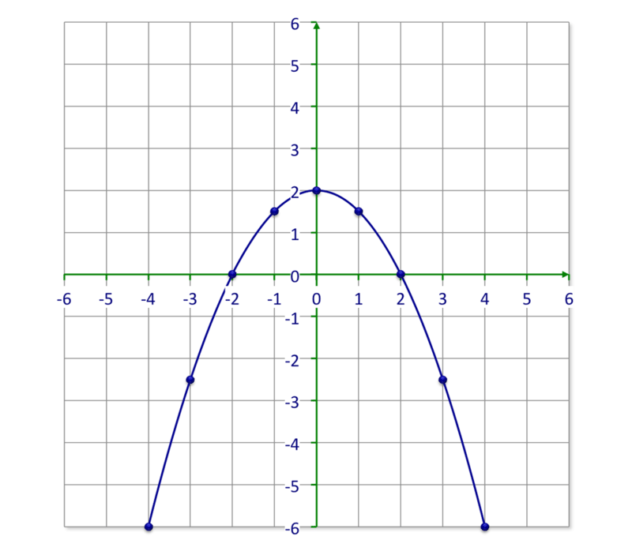

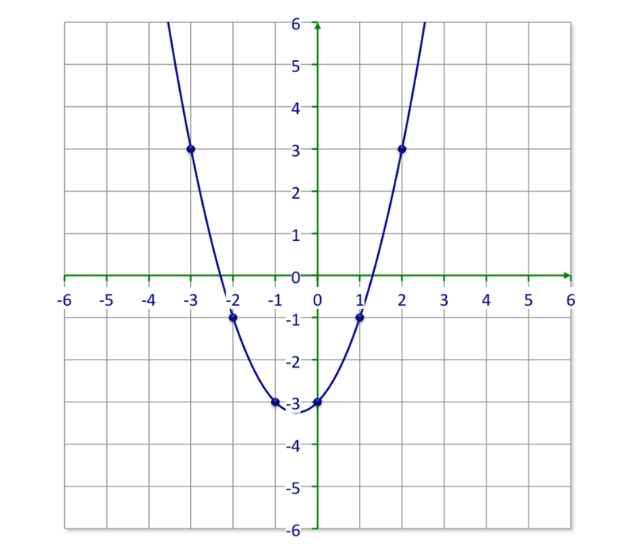

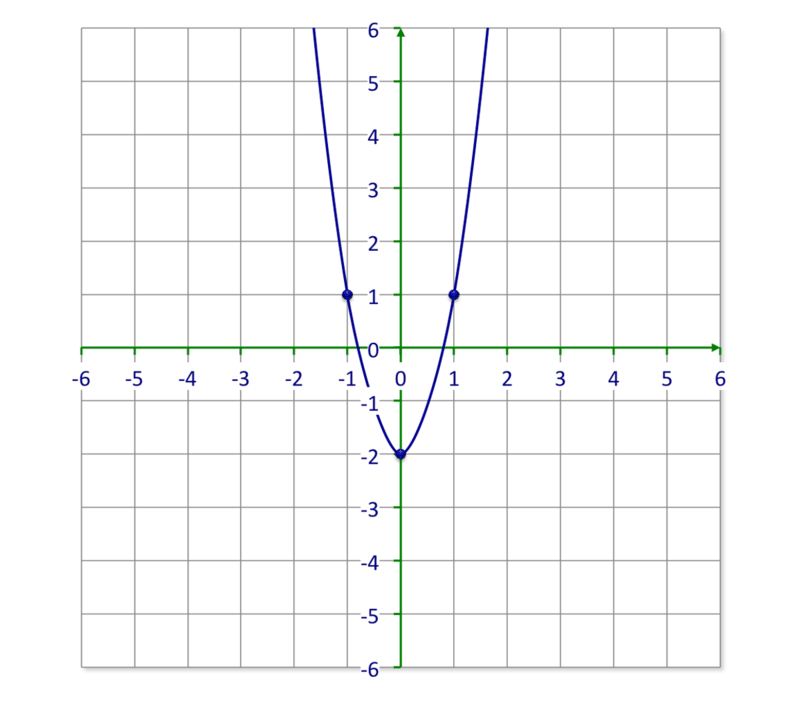

14. $y=x^2-1$
15. $y=-x^2+x$
16. $y=\frac{1}{2}x^2+1$

Write the equations of the following graphs. Use the $a$ and $c$ values and a t-table to help you.

17. 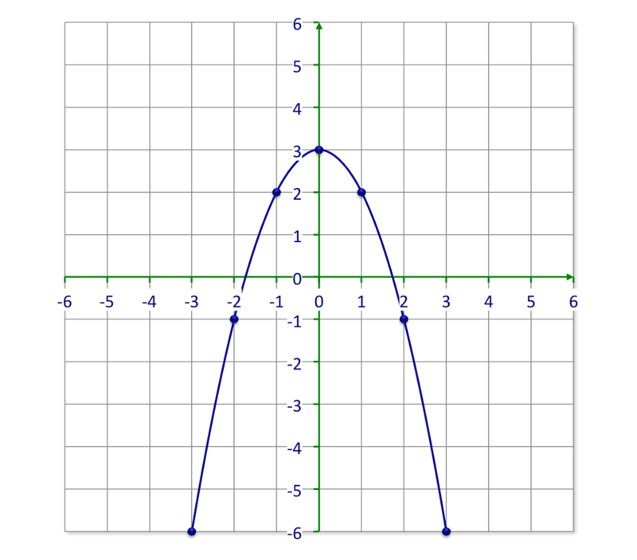
    
    \[Figure 23\]
    
18. 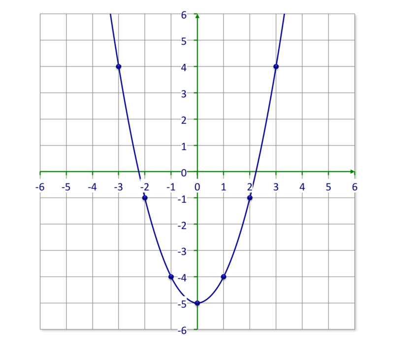
    
    \[Figure 24\]

</article>

### 12.6 Quadratic Functions

<article>

Introduction
------------

**_The Ball_**

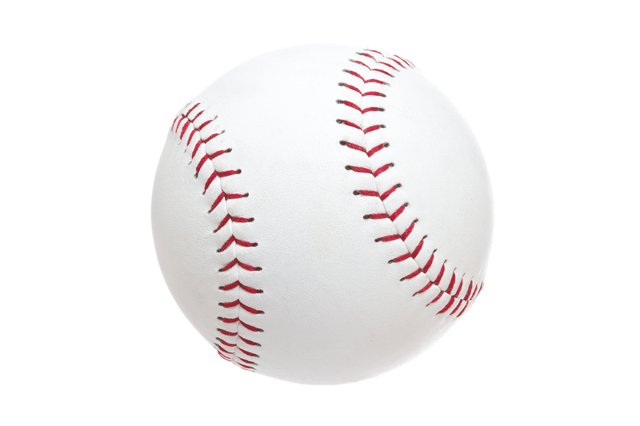

When an object is thrown into the air with a starting velocity of $r$ feet per second, its distance $d$ in feet, above its starting point $t$ seconds after it is thrown is about $d=rt-16t^2$. Use your graphing calculator or a table of values and graph paper to show the distance of an object from its starting point that has an initial velocity of 80 feet per second.

**To figure out this problem, you will need to know about quadratic functions and their graphs. Pay close attention because you will need to work with this problem again at the end of the lesson.**

**_What You Will Learn_**

By the end of this lesson, you will be able to execute the following skills.

* Recognize a quadratic function as an equation in two variables that can be written in the form $y = ax^2 + bx + c$, where $a$, $b$ and $c$ are constants and $a \ne 0$.
* Evaluate quadratic functions for several values of the domain, using tables.
* Recognize the graph of a quadratic function as a parabola, and associate the value $a$ with its upward or downward opening.
* Evaluate and analyze real – world situations modeled by quadratic functions, using a graphing calculator.

**_Teaching Time_**

I. **Recognize a Quadratic Function as an Equation in Two Variables that Can Be Written in the Standard Form**

We have seen many parabolas in the previous section and discussed the relationship between the coefficients in a quadratic equation and its graph. We will take one step further by defining **_quadratic functions_** and seeing how they can be applied to the world we live in.

We have touched on the idea of quadratic equations and standard form. You have used input values, oftentimes $x$ values, to calculate corresponding $y$ values. In those cases, **our input values are known as the** **_domain_****, while the output values our known as the** **_range_****.** These are also called the **_independent variable_** and **_dependent variable_**, at times.

| **$\underline{x}$\-values** | **$\underline{y}$\-values** |
| --- | --- |
| input values | output values |
| domain | range |
| independent variable | dependent variable |

You have also learned that a **_function_** **is a relation that assigns exactly one value of the domain to each value of the range.** So, when we say **_quadratic function_****, we are referring to any function that can be written in the form** $y=ax^2+bx+c$, where $a, b,$ and $c$ are constants and $a \neq 0$. This we defined as the standard form.

Why can’t $a$ equal zero? What happens if it does? If the $a$ value is zero, you might notice that it would make the first term $ax^2$ disappear because anything times zero is zero. You would be left with simply $y=bx+c$. Although this is still a function, it is no longer quadratic. This is a linear function. All quadratic functions are to the $2^{nd}$ degree.

**Let’s look at some examples.**

**Tell if the following equations are quadratic functions. If they are, place them in standard form and identify the $a, b,$ and $c$ values.**

1. $y=x^2-3x+5$

Yes, it is a quadratic function. The standard form is $y=x^2-3x+5; \ a=1,b=-3,c=5$.

2. $y=-7x^2+4x$

Yes, it is a quadratic function. The standard form is $y=-7x^2+4x; \ a=-7,b=4,c=0$.

3. $y-6=x^2$

Yes, it is a quadratic function. The standard form is $y=x^2+6; \ a=1,b=0,c=6$.

4. $3x^2+y=3x^2+4x-2$

No, this is not a quadratic function because if you subtract $3x^2$ from both sides, your $a$ value will be zero.

II. **Evaluate Quadratic Functions for Several Values of the Domain, Using Tables**

You know that the word **_domain_** refers to input values and the word **_range_** refers to output values. Recall that a **_function_** is a relation that assigns exactly one value of the domain to each value of the range. That means that for every $x$ value, there is only one $y$ value.

We can find $y$ values by substituting $x$ values in the function. We organize the information using a table of values or a t-table. In most cases, the input values could be any numbers. However, for our convenience, we will use negative numbers, zero, and positive numbers as shown in the example below.

Example

Complete a table of values for the function $y=x^2+3x+2$.

| $x$ | $y$ |
| --- | --- |
| $-3$ |     |
| \-2 |     |
| \-1 |     |
| 0   |     |
| 1   |     |
| 2   |     |
| 3   |     |

To find the $y$ values, we will substitute the $x$ values in the equation.

The completed t – table should look like this.

| $x$ | $y$ |
| --- | --- |
| $-3$ | 2   |
| \-2 | 0   |
| \-1 | 0   |
| 0   | 2   |
| 1   | 6   |
| 2   | 12  |
| 3   | 20  |

**Evaluating a quadratic function is always the same. You substitute the $x$ – values into the equation and solve the for $y$ – values.**

III. **Recognize the Graph of a Quadratic Function as a Parabola, and Associate the Value a with its Upward or Downward Opening**

We defined the standard form of a quadratic function as $y = ax^2 + bx + c$.

You might remember that we discussed the effect that the values of $a, b,$ and $c$ have on the graphs of quadratic equations. Now we are going to use this information when we look at a quadratic function. What we know about the values of $a, b,$ and $c$ help us to understand the opening of a parabola.

| **Value** | **What it tells you** | **Example $y = -3x^2 + x -2$** |
| --- | --- | --- |
| $a$ | if $a > 0$, graph opens upward  if $a <$ graph opens downward  if $a$ is close to zero, wider graph  if $a$ is far from zero, narrower graph | $a = -3$  $a$ is less than zero so graph opens downward  $a$ is further from zero so will be narrow |
| $b$ | helps predict axis of symmetry | $b = 1$  axis of symmetry of the parabola |
| $c$ | $y$\-intercept | $c = -2$  graph crosses $y$\-axis at -2 |

We know that the graph of a quadratic function will always be a parabola. **A** **_parabola_** **is a kind of “U” shape that is always symmetrical on both sides.** It can go either upward or downward. Also, a parabola is not linear—no part of the parabola is actually a straight line. Thus, it cannot be vertical, either.

**If we wanted to predict the shape of the parabola, we would need to look at the value of $a$. We know that $a$ helps us to determine a parabola’s shape.**

**Look at these examples.**

Examples

$$
\begin{align*}
& y = x^2 && y = 3x^2 && y = \frac{1}{3}x^2\\
& a = 1 \ so \ a > 0 && a = 3 \ so \ a > 0 && a = \frac{1}{3} \ so \ a > 0\\
& \text{graph opens upward} && \text{graph opens upward} && \text{graph opens upward}\\
& \text{neither wide nor narrow} && \text{graph is narrow} && \text{graph is wide}
\end{align*}
$$

")

\[Figure 4\]

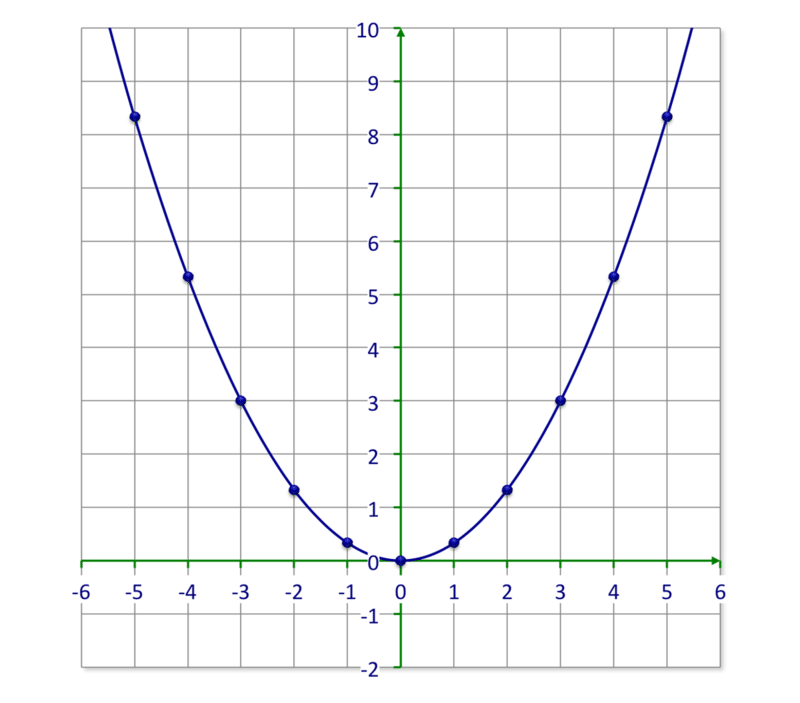

Example

What would you predict about the graph of $y = 7x^2$?

**Because the $a$ value is 7, it would be very narrow. Also, because $a > 0$, it would open upward.**

Example

What would you predict about the graph of $y = - \frac{1}{4}x^2$?

**Because the $a$ value is $-\frac{1}{4}$, it would be very wide. Also, because $a < 0$, it would open downward.**

IV. **Evaluate and Analyze Real – World Situations Modeled by Quadratic Functions, Using a Graphing Calculator**

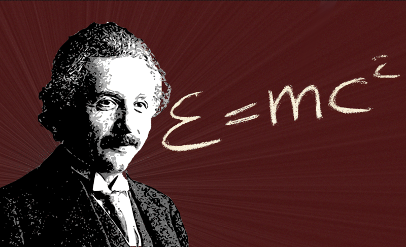

There are many quadratic functions and formulas used in every day life that you can use by making a table of values or using a graphing calculator. As we do so, let’s keep in mind which values for the domain are realistic.

Example

The area of a square is found with the formula $A=s^2$. Show a graph of the area as the length of the side increases.

$$
\begin{align*}
& \text{Length of side} \quad 0 \qquad 1 \qquad 2 \qquad 3 \qquad 4 \qquad 5\\
& \text{Area} \qquad \qquad \quad 0 \qquad 1 \qquad 4 \qquad 9 \qquad 16 \quad \ 25
\end{align*}
$$

The area of a square is non-linear, so the graph will be non-linear too. Let’s look at the graph that represents the area of a square.

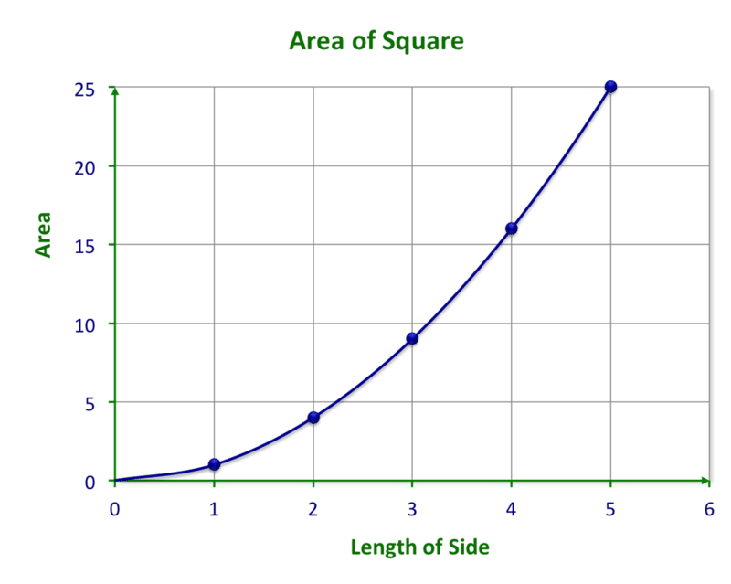

In this graph, it is necessary to show only quadrant I because distance and area cannot be negative.

**You can graph this function in your graphing calculator.**

**Now let’s apply what we have learned to the problem from the introduction.**

Real-Life Example Completed
---------------------------

**_The Ball_**

**Here is the problem from the introduction. Reread it and then solve it with your graphing calculator.**

When passing the baseball field, Mr. Travis handed the students the following problem written on a piece of paper that looked like a baseball. Here is what it said.

When an object is thrown into the air with a starting velocity of $r$ feet per second, its distance $d$ in feet, above its starting point $t$ seconds after it is thrown is about $d=rt-16t^2$. Use your graphing calculator or a table of values and graph paper to show the distance of an object from its starting point that has an initial velocity of 80 feet per second.

**_Solution to Real – Life Example_**

**First, think about the information that you have and the equation that you can write.**

$$
\begin{align*}
r & = 80\\
d & = 80t - 16t^2
\end{align*}
$$

**Next, we can make a table of values.**

$$
\begin{align*}
& t \ (seconds) \quad \qquad 0 \qquad 1 \qquad 2 \qquad 3 \qquad 4 \qquad 5\\
& d \text{ distance } (ft) \quad \ 0 \quad \ \ 64 \quad \ \ 96 \quad \ 96 \quad \ \ 64 \quad \ \ 0
\end{align*}
$$

**Finally we can take those values, insert them into a graphing calculator and create the following graph.**

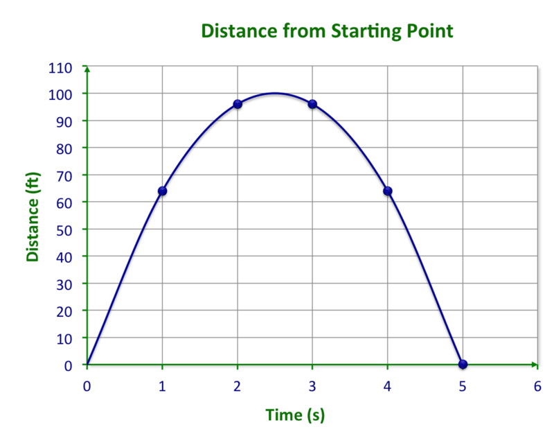
----------

Here are the vocabulary words that are found in this lesson.

__Domain__

input value, independent value

__Range__

output value, dependent value

__Function__

relation that assigns one value of the domain to each value of range

__Quadratic Function__

To the $2^{nd}$ degree in standard form-a parabola is created by a quadratic function.

Time to Practice
----------------

Directions: Tell if the following equations are quadratic functions. If they are, place them in standard form and identify the $a, b,$ and $c$ values.

1.  $y = 3x^2 - x + 4$
2.  $y = 4x - 18 + x^2$
3.  $y + x^2 - 6 = x^2 + 4x - 5$
4.  $3y + 3 = 7x^2 - 5x$
5.  $6y = x^5 + 3x^4 + x - 7$
6.  $4y + 3x = 8x^2 + 3x - 12$

Directions: Use a table of values to evaluate the following quadratic function for several values in the domain.

7.  $y = x^2 - 8$
8.  $y = - 2x^2 + 5x$
9.  $y = -x^2 + 3x - 7$
10. $y = \frac{2}{3}x^2 + 2x - 1$

Use your tables to graph the four functions. Then relate their $a$ values to the shape of their graphs.

11. $y = x^2 - 8$
12. $y = - 2x^2 + 5x$
13. $y = -x^2 + 3x - 7$
14. $y = \frac{2}{3}x^2 + 2x - 1$
15. The formula for the area of a circle is $A=\pi r^2$. Use 3.14 for $\pi$. Use your graphing calculator or create a table of values to show the area of circles with radii of 0 to 10.
16. When an object is thrown into the air with a starting velocity of $r$ feet per second, its distance $d$ in feet, above its starting point $t$ seconds after it is thrown is about $d= rt - 16t^2$. Use your graphing calculator or a table of values and graph paper to show the distance of an object from its starting point that has an initial velocity of 112 feet per second.

17 – 20 Write three equations that are considered quadratic equations and then graph them.

</article>

### 12.7 Exponential Functions

<article>

Introduction
------------

**_The Laboratory Dilemma_**

“What is it?” Janet asked.

“Here we go, see what you can do with this,” Mr. Travis wrote the following problem on the board.

In a laboratory, one strain of bacteria can double in number every 15 minutes. Suppose a culture starts with 60 cells, use your graphing calculator or a table of values to show the sample’s growth after 2 hours. Use the function $b=60 \cdot 2^q$ where $b$ is the number of cells there are after $q$ quarter hours.

**To work on this problem, you have to understand exponential functions. Pay close attention during this lesson and you will know how to solve it by the end of the lesson.**

**_What You Will Learn_**

In this lesson, you will learn how to complete the following skills.

* Recognize an exponential function as an equation in two variables that can be written in the form $y = ab^x$.
* Evaluate and graph exponential functions using tables.
* Distinguish between exponential growth and decay.
* Evaluate and analyze real – world situations modeled by exponential functions, using a graphing calculator.

**_Teaching Time_**

I. **Recognize an Exponential Function as an Equation in Two Variables that Can Be Written in the Form** $\underline{y = ab^x}$

Let’s think about exponential functions by looking at the following example.

Example

Two girls in a small town once shared a secret, just between the two of them. They couldn’t stand it though, and each of them told three friends. Of course, their friends couldn’t keep secrets, either, and each of them told three of their friends. Those friends told three friends, and those friends told three friends, and son on... and pretty soon the whole town knew the secret. There was nobody else to tell!

These girls experienced the startling effects of an exponential function. If you start with the two girls who each told three friends, you can see that they told six people or $2 \cdot 3$. Those six people each told three others, so that $6 \cdot 3$ or $2 \cdot 3 \cdot 3$—they told 18 people. Those 18 people each told 3, so that now is $18 \cdot 3$ or $2 \cdot 3 \cdot 3 \cdot 3$ or 54 people. You can see how this is growing and you could show the number of people told in each round of gossip with a function: $y=ab^x$ where $y$ is the number of people told, $a$ is the two girls who started the gossip, $b$ is the number of friends that they each told, and $x$ is the number of rounds of gossip that occurred. **This is called an** **_exponential function_****—any function that can be written in the form $y=ab^x$, where $a$ and $b$ are constants, $a \ne 0,b>0$, and $b \ne 1$.**

As we did with linear and quadratic functions, we could make a table of values and calculate the number of people told after each round of gossip. Use the function $y=2 \cdot 3^x$ where $y$ is the number of people told and $x$ is the number of rounds of gossip that occurred.

$$
\begin{align*}
& x \ \text{rounds of gossip} \ \quad 0 \quad 1 \quad 2 \quad \ \ 3 \quad \quad 4 \quad \quad 5\\
& y \ \text{people told} \qquad \quad \ \ 2 \quad 6 \quad 18 \quad 54 \quad 162 \quad 486
\end{align*}
$$

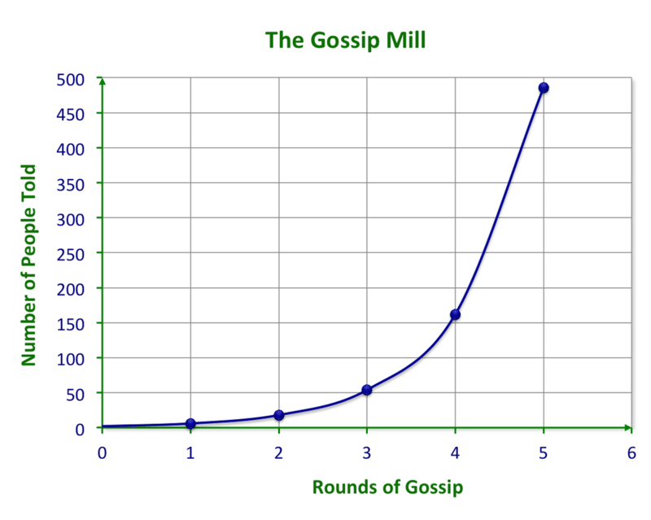

If your function can be written in the form $y=ab^x$, where $a$ and $b$ are constants, $a \ne 0, b>0,$ and $b \ne 1$, then it must be exponential. In quadratic equations, your functions were always to the $2^{nd}$ power. In exponential functions, the exponent is a variable. Their graphs will have a characteristic curve either upward or downward.

**Examples of Exponential Functions:**

1.  $y=2^x$
2.  $c=4 \cdot 10^d$
3.  $y=2 \cdot \left(\frac{2}{3}\right)^x$
4.  $t=4 \cdot 10^u$

**Not Exponential Functions:**

$$
\begin{align*}
& 1.\ y=3 \cdot 1^x && 2.\ n=0 \cdot 3^p && 3. \ y=(-4)^x &&  4. \ y=-6 \cdot 0^x\\
\text{because} & \quad \ b=1 && \quad \ a=0 && \quad \ b<0 && \quad \ b \le 1
\end{align*}
$$

II. **Evaluate and Graph Exponential Functions Using Tables**

As you saw in the gossip example, exponential functions can be graphed by using a table of values like we did for quadratic functions. Substitute values for $x$ and calculate the corresponding values for $y$.

Example

Graph $y=2^x$.

Here is the table.

| $x$ | $y=2^x$ | $y$ |
| --- | --- | --- |
| $-3$ | $y=2^{-3}$ | $\frac{1}{8}$ |
| \-2 | $y=2^{-2}$ | $\frac{1}{4}$ |
| \-1 | $y=2^{-1}$ | $\frac{1}{2}$ |
| 0   | $y=2^0$ | 0   |
| 1   | $y=2^1$ | 2   |
| 2   | $y=2^2$ | 4   |
| 3   | $y=2^3$ | 8   |
| 4   | $y=2^4$ | 16  |
| 5   | $y=2^5$ | 32  |
| 6   | $y=2^6$ | 64  |

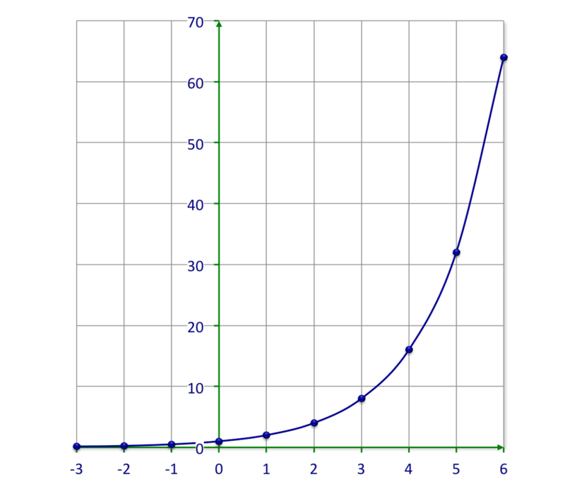

**What happens when the** $b$ **value is less than 1?**

**Example**

Graph $y=2 \cdot \left( \frac{2}{3}\right)^x$

| $x$ | $y$ |
| --- | --- |
| $-3$ | $\frac{27}{4}$ |
| \-2 | $\frac{9}{2}$ |
| \-1 | 3   |
| 0   | 2   |
| 1   | $\frac{4}{3}$ |
| 2   | $\frac{8}{9}$ |
| 3   | $\frac{16}{27}$ |
| 4   | $\frac{32}{81}$ |
| 5   | $\frac{64}{243}$ |
| 6   | $\frac{128}{729}$ |

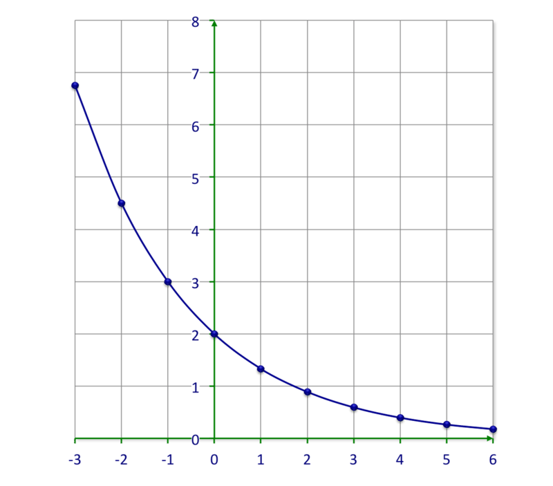

III. **Distinguish between Exponential Growth and Decay**

In the last examples, you saw different kinds of graphs. In some cases with exponential functions, as the $x$ value increased, the $y$ value increased, too. **This was a** **_direct_** **relationship known as** **_exponential growth_****.** As the $x$ value increases, the $y$ value grows at a very fast rate! The other graph you saw showed the opposite—as the $x$ value increased, the $y$ value decreased. **This relationship is an** **_inverse_** **relationship known as** **_decay_****.** The graphs of these functions are opposites, reflected on the $y$\-axis.

")

\[Figure 6\]

We can also analyze growth and decay functions in real – life situations.

IV. **Evaluate and Analyze Real – World Situations Modeled by Exponential Functions, Using a Graphing Calculator**

This story reminds us of the drastic increases that we can see in exponential functions. Although this story is a fable, there are many instances in the real-world where exponential growth can be seen.

Take the human population, for example. It took hundreds of thousands of years for the population to reach 1 billion in 1804. Look at the chart below to see how increasingly quickly the next billion was reached.

| **Population** | **1 billion** | **2 billion** | **3 billion** | **4 billion** | **5 billion** | **6 billion** | **7 billion** | **8 billion** | **9 billion** |
| --- | --- | --- | --- | --- | --- | --- | --- | --- | --- |
| **Year** | 1804 | 1927 | 1961 | 1974 | 1987 | 1999 | 2011 | 2024 | 2042 |
| **Years until next billion** | 123 | 34  | 13  | 13  | 12  | 12  | 13  | 18  |     |

Of course, many of these functions can be graphed on your graphing calculator or using a table of values and graph paper.

Example

A condominium complex charges $185 per month for the homeowners’ association fee. The rates can rise every year because of inflation but they promise not to raise the rates more than 10% each year. Keep in mind, though, that if they raise the rate by 10% the first year, the second year is now more expensive. If they raise the maximum again, they are increasing the original $185 plus the first year’s adjustment by 10%. Graph the situation for 10 years. How much could the homeowners’ fee be in ten years? Use the function $f=185 \cdot 1.1^t$ where $f$ is the fee after $t$ years.

| $t$ | $f$ |
| --- | --- |
| 0   | 185 |
| 1   | 203.5 |
| 2   | 223.85 |
| 3   | 246.24 |
| 4   | 270.86 |
| 5   | 297.94 |
| 6   | 327.74 |
| 7   | 360.51 |
| 8   | 396.56 |
| 9   | 436.22 |
| 10  | 479.84 |

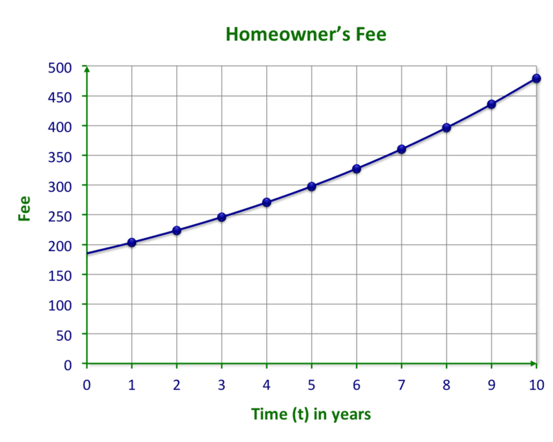

Real-Life Example Completed
---------------------------

**_The Laboratory Dilemma_**

**Here is the problem from the introduction. Reread it and then solve it for the solution.**

“We have been given a dilemma by my friend Professor Smith,” Mr. Travis said upon the class’ return to the classroom.

“What is it?” Janet asked.

“Here we go, see what you can do with this,” Mr. Travis wrote the following problem on the board.

In a laboratory, one strain of bacteria can double in number every 15 minutes. Suppose a culture starts with 60 cells, use your graphing calculator or a table of values to show the sample’s growth after 2 hours. Use the function $b=60 \cdot 2^q$ where $b$ is the number of cells there are after $q$ quarter hours.

**_Solution to Real – Life Example_**

**First, we can create a t-table to go with the equation of the function. Here are the values in that table.**

| $q$ | $b$ |
| --- | --- |
| 0   | 60  |
| 1   | 120 |
| 2   | 240 |
| 3   | 480 |
| 4   | 960 |
| 5   | 1920 |
| 6   | 3840 |
| 7   | 7680 |
| 8   | 15360 |

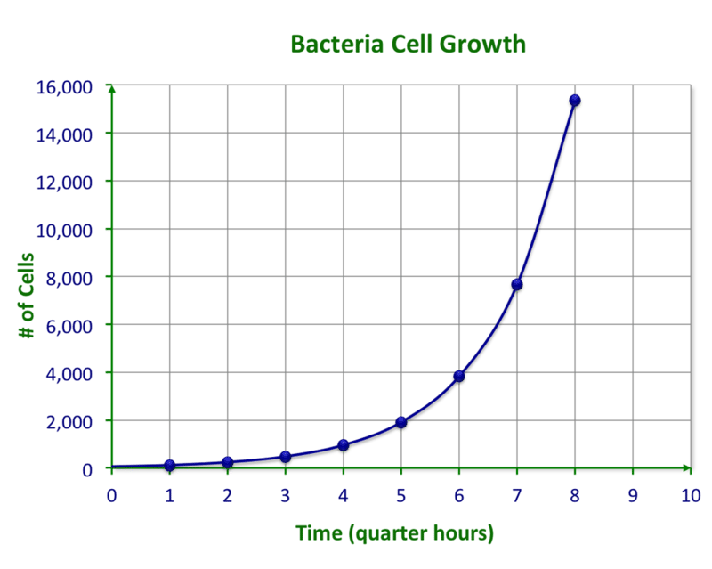
----------

Here are the vocabulary words that are found in this lesson.

__Exponential Functions__

results that expand exponentially. The graph curves upward or downward.

__Exponential Growth Graph__

a direct relationship graph each variable increases.

__Decay Graph__

an indirect relationship graph, one variable increases as the other one decreases.

Time to Practice
----------------

Directions: Classify the following functions as exponential or not exponential. If it is not exponential, state the reason why.

1.  $y=7^x$
2.  $c=-2 \cdot 10^d$
3.  $y=1^x$
4.  $n=0 \cdot \left(\frac{1}{2}\right)^x$
5.  $y=5 \cdot \left(\frac{4}{3}\right)^x$
6.  $y=(-7)^x$
7.  Use a table of values to graph the function $y=3^x$. There are two parts to this answer.
8.  Use a table of values to graph the function $y=\left(\frac{1}{3}\right)^x$. There are two parts to this answer.
9.  What type of graph did you make in number 7?
10. What type of graph did you make in number 8?
11. You invest $1000 in a savings account that pays 6% interest per year. Use your graphing calculator to show your balance over 10 years. Use the function $B=1000 \cdot 1.06^t$ where $B$ is the balance in your account and $t$ is the number of years you have invested. Round to the nearest whole dollar.
12. Graph this function.
13. In a laboratory, one strain of bacteria can double in number every 12 minutes. Suppose a culture starts with 50 cells, use your graphing calculator or a table of values to show the sample’s growth after 2 hours. Use the function $b=50 \cdot 2^q$ where $b$ is the number of cells there are after $q$ segments of 12 minutes.
14. Graph this function.

</article>

### 12.8 Sequences

<article>

Introduction
------------

**_The Arcade_**

“That has a lot of math in it,” Sasha commented as Henry had his turn.

“How do you figure?” Henry asked.

“It just does,” Sasha said convincingly. “Think about it. In this video game, an alien splits into two aliens who then split into two more aliens every 10 minutes.”

“Good point, how many aliens there would be after they split 10 times?” Henry asked.

**We can start by thinking about this as a number pattern. This lesson is all about patterns and sequences. Think about the video game and you will need to solve the sequence at the end of the lesson.**

**_What You Will Learn_**

In this lesson, you will learn how to complete the following skills.

* Recognize an arithmetic sequence as having a common difference between consecutive terms.
* Extend and graph arithmetic sequences.
* Recognize a geometric sequence as having a constant common ratio between consecutive terms.
* Extend and graph geometric sequences.
* Evaluate and analyze real – world situations modeled by sequences, using a graphing calculator.

**_Teaching Time_**

I. **Recognize an Arithmetic Sequence as Having a Common Difference Between Consecutive Terms**

Look at this example of a sequence.

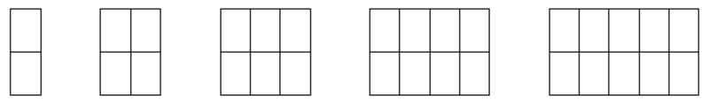

If you saw this same pattern in terms of numbers, it would look like this:

$$
2, 4, 6, 8, 10
$$

This set of numbers is called a **_sequence_****; it is a series of numbers that follow a pattern.** If there was another set of boxes, you’d probably guess there would be 12, right? Just like if you added another number to the sequence, you’d write 12. You noticed that there was a difference of 2 between each two numbers, or _terms_, in the sequence. **When we have a sequence with a fixed number between each of the terms, we call this sequence an** **_arithmetic sequence_****.**

Example

What is the common difference between each of the terms in the sequence?

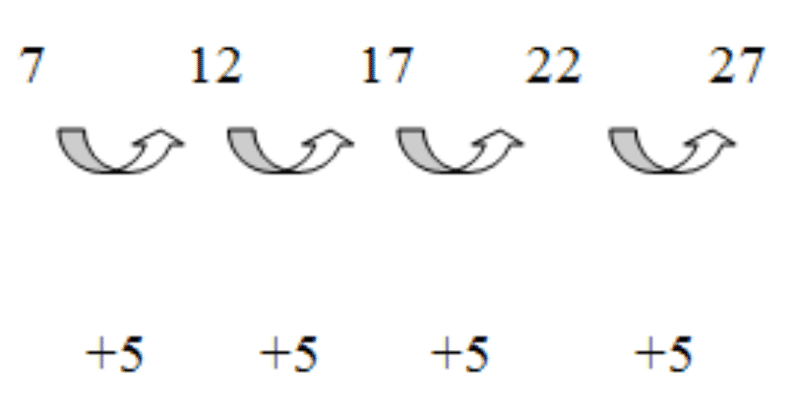

**This is an example of an arithmetic sequence. You can see that you have to be a bit of a detective to figure out the number patterns in these examples.**

Finding the difference between two terms in a sequence is one way to look at sequences. We have used tables of values for several types of equations and we have used those tables of values to create graphs. Graphs are helpful because they are visual representations of the same numbers. When values rise, we can see them rise on a graph. Let’s use the same ideas, then, to graph arithmetic sequences.

Example

Graph the sequence 2, 5, 8, 11, 14, 17,...

First convert it into a table of values with independent values being the term number and the dependent values being the actual term.

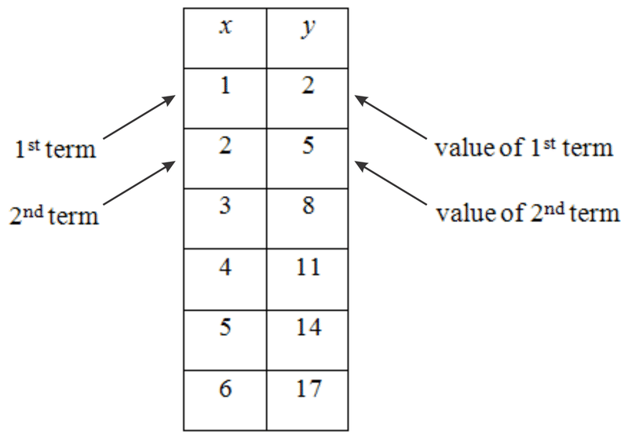

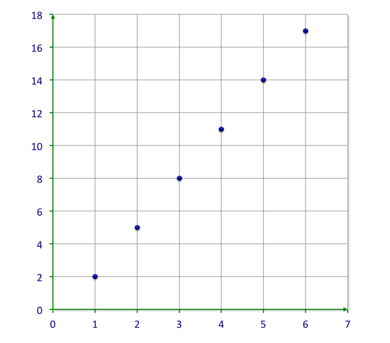

In the graph that we created in the example, each term was expressed as a single point. This is called **_discrete data_****—only the exact points are shown.** This type of data is usually involves things that are counted in whole numbers like people or boxes. Depending on what type of situation you are graphing, you may choose to connect the points with a line. The line demonstrates that there are data points _between_ the points that we have graphed. This is called **_continuous data_** **and usually involves things like temperature or length that can change fractionally.**

So, we can graph sequences and classify them as either discrete or continuous data. Yet another possibility is continuing a sequence in either direction by adding terms that follow the same pattern.

III. **Recognize a Geometric Sequence as Having a Constant Common Ratio Between Consecutive Terms**

Arithmetic sequences are commonplace in the world of mathematics. There are other types of sequences, though, that follow other types of patterns. Look at the boxes below.

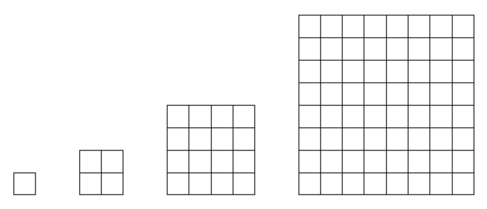

**This is a** **_geometric sequence_****; it’s a sequence in which the terms are found by multiplying by a fixed number called the** **_common ratio_****.** In the example above, the common ratio is 4.

Once you know the common ratio, then you can figure out the next step in the pattern.

Example

What is the common ratio between each of the terms in the sequence?

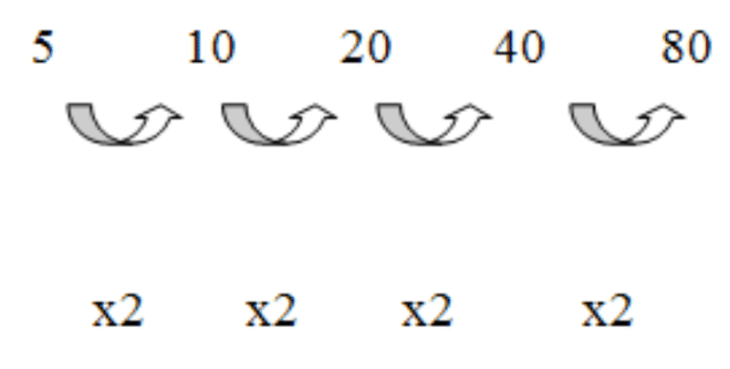

**You can see how knowing the common ratio helped us with our problem solving.**

IV. **Extend and Graph a Geometric Sequence**

Consider the following sequence:

$$
8, 24, 72, 216, \ldots
$$

Doesn’t your brain want to find the next number? You’ve probably figured out that the common ratio here is 3. So the next term in the sequence would be $216 \cdot 3$ or 648. You would continue the same process to find the term that follows. Or, you could divide by 3 to find the previous term.

**Just as we did with arithmetic sequences, it can be useful to graph geometric sequences. We’ll use the same method as before—create a table of values and then use a coordinate plane to plot the points.**

Example

The amount of memory that computer chips can hold in the same amount of space doubles every year. In 1992, they could hold 1MB. Chart the next 15 years in a table of values and show the amount of memory on the same size chip in 2007.

** |")
| --- | --- |
| 1992 | 1   |
| 1993 | 2   |
| 1994 | 4   |
| 1995 | 8   |
| 1996 | 16  |
| 1997 | 32  |
| 1998 | 64  |
| 1999 | 128 |
| 2000 | 256 |
| 2001 | 512 |
| 2002 | 1024 |
| 2003 | 2048 |
| 2004 | 4096 |
| 2005 | 8192 |
| 2006 | 16384 |
| 2007 | 32768 |

**Now let’s go back and solve the problem from the introduction.**

Real-Life Example Completed
---------------------------

**_The Arcade_**

**Here is the problem from the introduction. Reread it and then solve figure out the solution.**

On the way home from school on the day of the trip downtown, a bunch of students stopped off at the arcade. It was always fun to talk and get something to eat and play a video game or two. Sam and Henry began to play a favorite game of theirs with aliens.

“That has a lot of math in it,” Sasha commented as Henry had his turn.

“How do you figure?” Henry asked.

“It just does,” Sasha said convincingly. “Think about it. In this video game, an alien splits into two aliens who then split into two more aliens every 10 minutes.”

“Good point, how many aliens there would be after they split 10 times?” Henry asked.

**We can write a number pattern.**

**2, 4, 8, 16, 32, 64, 128, 256, 512, 1024**

**1024 aliens after 10 splits!**

**This is the answer to our problem.**

Vocabulary
----------

Here are the vocabulary words that are found in this lesson.

__Sequence__

a series of numbers that follows a pattern.

__Arithmetic Sequence__

a fixed number between each of the terms in a sequence.

__Discrete data__

only the exact points are shown.

__Continuous data__

data that changes continuously.

__Geometric Sequence__

a sequence where you find terms by multiplying a fixed number by a common ratio.

Time to Practice
----------------

Directions: Write the common difference for each sequence. If there is not a pattern, indicate this in your answer.

1.  \-9, -7, -5, -3, -1
2.  5.05, 5.1, 5.15, 5.2, 5.25
3.  3, 6, 10, 15, 21, 28
4.  17, 14, 11, 8, 5, 2

Directions: Solve this problem by using what you know about arithmetic sequences.

An ant colony invades the caramels in a candy store. The first day they eat a $\frac{1}{4}$ of a caramel, the second day $\frac{1}{2}$ of a caramel, the third day $\frac{3}{4}$.

5.  What is the difference between each day?
6.  How many do you think they’ll eat on the fourth, fifth, and sixth days?

Directions: Find the common ratio between each term.

7.  \-4, 20, -100, 500, -2500
8.  60, 15, $\frac{15}{4}$, $\frac{15}{64}$
9.  $\frac{1}{8}$, $\frac{1}{4}$, $\frac{1}{2}$, 1, 2
10. 3, 6, 8, 9

Directions: Identify the following sequences as an arithmetic sequence, a geometric sequence, or neither. For arithmetic sequences, find the common difference. For geometric sequences, find the common ratio.

11. 1, 4, 7, 10, 13
12. 180, 60, 20, $6 \frac{2}{3}$
13. 102, 94, 86, 78
14. 18, 27, 35, 43, 50
15. 5, -50, 500, -5000, 50000
16. $\frac{17}{62}$, $\frac{10}{31}$, $\frac{23}{62}$, $\frac{13}{31}$, $\frac{29}{62}$
17. You have been hired to paint a house. They give you two options for payment. Option A is for you to receive $80 up front plus $40 per day. Option B is to get paid based on the number of days you work. They offer you $3 if you work only one day, $6 if you work two days, $12 if you work three days, and so on. Make two separate tables of value to show the two options for 10 days. Which option would you prefer?

</article>

